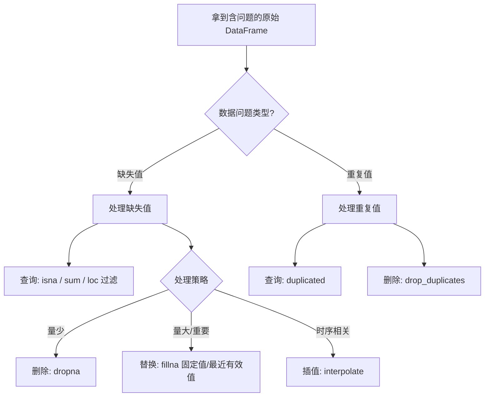

# 数据清洗：表格数据缺失值与异常值的处理

本文介绍常见的数据清洗技巧。

## 什么是缺失值

从 CSV 文件或其他数据源加载到 DataFrame 时，往往某些单元格的数据是缺失的。打印 DataFrame 时，缺失部分会显示为 NaN、None 或 NaT（取决于单元格的数据类型），这类值称为缺失值。

假设阿普闪购举办了一次全员英语能力考试，每位员工都有听力、阅读、写作、口试四个成绩。这里抽样了三位员工的分数数据用于分析，如下所示：

```
scores = [[20.26, 71.58, 27.06, 97.51],
       [40.61, 72.32, 56.54,  5.45],
       [72.44, 68.89,  6.65, 75.54]]

```

执行上述代码，将分数数据导入到 DataFrame 中。代码如下：

```
import pandas as pd
# DataFrame 的列名
index_arr = ["听力", "阅读", "写作", "口试"]
# 从 scores 列表中创建 DataFrame
# index 参数代表行索引
# columns 参数代表列索引
df_scores = pd.DataFrame(scores,
            index = ["小亮", "小明", "小E"],
            columns= index_arr)
# 打印 DataFrame
df_scores

```

输出为：

现在，三位员工的分数已被录入。需求方希望将小李的成绩一并纳入分析，但小李只有听力成绩，另外三项成绩未知。

代码如下：

```
# 生成小李的 Series，没有的成绩用 None 取代
ser_xiaol = pd.Series([30.04,None,None,None], index=index_arr,name="小李")
# 将小李的 Series 添加到 df_scores 中（append 已在 Pandas 2.0 移除，使用 pd.concat）
df_scores = pd.concat([df_scores, ser_xiaol.to_frame().T])
# 查看 df_scores
df_scores

```

执行代码后，输出如下：

可以看到，小李的阅读、写作和口试显示了 NaN，代表**数字类型**的缺失值。时间类型的缺失值一般显示为 NaT，字符串类型的则显示为 None。

在实际项目中，缺失值几乎一直存在于原始数据源中。如果分析时不将其处理掉，很可能得到错误的结果。

以这个例子来说：如果要计算写作科目的平均分，小李的 NaN 到底当作 0，还是当作平均数，还是干脆不把小李纳入计算，**都需要根据情况进行决策，以最大化降低缺失值对于分析结果的影响**。

下面介绍针对缺失值不同策略的实现方式。

## 查询缺失值

处理缺失值的第一步是查询缺失值是否存在以及数量情况。与上述例子不同，现实项目中的 DataFrame 中是否有缺失值、有多少缺失值往往是未知的。

下面介绍如何查询 DataFrame 中的缺失值情况。为了更好地演示查看缺失值，再添加一条记录到 DataFrame。

```
# 生成小王的 Series，没有的成绩用 None 取代
ser_xiaowang = pd.Series([None, 91.00, 72.34, None], index = index_arr, name="小王")
# 将小王的 Series 添加到 df_scores 中
df_scores = pd.concat([df_scores, ser_xiaowang.to_frame().T])
# 查看 df_scores
df_scores

```

下面开始分析缺失值的情况。

### 1. 按单元格查看缺失值情况

DataFrame 提供了 isna 函数，isna 函数返回一个新的 DataFrame，行数和列数与原来的 DataFrame 相同，新的 DataFrame 全部由布尔型数据组成。若原 DataFrame 的单元格的数据是缺失值，则新 DataFrame 对应位置的单元格为 True，否则为 False。

```
# 调用 isna 函数，并查看结果
df_scores.isna()

```

输出：

可以看到，小李的阅读、写作、口试，以及小王的听力、口试是 True，代表在原来的 DataFrame 中这些数据是缺失值。

### 2. 按列查看缺失值

由于现实项目中的 DataFrame 往往很大，逐一查看每个单元格是 True 还是 False 并不现实，更常见的查看手段是按列聚合缺失值的数量。

在 isna 函数的基础上再调用一次 sum 函数，即可实现按列聚合。

```
# 按列聚合缺失值并查看
df_scores.isna().sum()

```

输出为：

代表听力、阅读、写作三列各有一个缺失值，口试一列有两个。

### 3. 按行查看缺失值

既然可以按列查看，自然也可以按行查看。按行查看可以了解某个员工的缺失值情况。按行查看的实现方式与按列类似，只需在 sum 函数的参数中传入 1 即可。

```
# 按行聚合缺失值并查看
df_scores.isna().sum(1)

```

输出为：

### 4. 过滤出有缺失值的列

有时候需要单独将有缺失值的列过滤出来查看大概情况，配合使用 isna 函数和前文学习的 loc 函数即可实现。

```
# 行索引部分，取所有的行
# 列索引部分，取所有包含缺失值的列
# any 函数类似 sum 函数，但 any 函数做的是布尔聚合，当列有一个或以上的 True 时，结果就是 True， 否则为 False
df_scores.loc[:, df_scores.isna().any()]

```

输出为：

因为目前的 DataFrame 每一列都至少包含一个缺失值，所以过滤列之后输出了所有记录。

### 5. 过滤出有缺失值的行

对应地，如果需要过滤出有缺失值的行，同样可以通过 loc 配合 isna 实现。

```
# 行索引部分，通过 any(1) 来聚合行维度的结果
# 列索引部分，取所有的列
df_scores.loc[df_scores.isna().any(1),:]

```

输出为：

可以看到，包含缺失值的小李和小王的记录被过滤了出来。

### 6. 缺失值的总个数

对 isna 返回的布尔 DataFrame 做 sum，可以得到各列各行有多少个缺失值；再对这个结果做一次 sum，即可得到整个 DataFrame 包含的缺失值总数。

```
df_scores.isna().sum().sum()

```

输出为：

```
5

```

代表整个 DataFrame 一共包含五个缺失值。

## 处理缺失值

查询出缺失值后，根据分析的场景和缺失值的情况来决定如何处理这些缺失值。

常见的缺失值处理方法有以下三种。

### 1. 缺失值删除

顾名思义，删除就是将缺失值直接从 DataFrame 中移除，一般在缺失值比较少的情况下可以用删除来简单处理。

pandas 的 DataFrame 提供了删除缺失值的方法 dropna，通过传入恰当的参数，可以灵活地删除部分或全部的缺失值。

（1）删除所有缺失值所在的行

```
df_scores.dropna()

```

输出为：

（2）删除所有缺失值所在的列

```
df_scores.dropna(axis = 1)

```

输出为：

因为 DataFrame 每一列都至少有一个缺失值，所以删除后 DataFrame 只剩下行索引。

（3）删除少于 X 个正常值的行

有时候需要删除缺失值较多的行、保留有缺失值但数量较少的行，可以通过指定 thresh 参数来实现。

```
# 删除正常值小于 2 个的行
df_scores.dropna(thresh=2)

```

输出为：

可以看到，小李的正常值只有 1 个，所以被删除；小王的正常值有两个，所以被保留。

（4）参考某几列作为删除依据

有些情况下，数据表中不同列的权重（重要性）不一样。比如这次职工英语考试，最关键的是听力，所以只看听力这一列：如果听力是缺失值则删除，其他列有缺失值则不删除。可以通过 subset 参数实现。

```
# 删除写作一列是缺失值的所有行
df_scores.dropna(subset=["听力"])

```

输出为：

可以看到，小王的记录被删除，而小李的被保留，原因就是小李的听力成绩存在，而通过 subset 参数指定了只看听力这一列的缺失值情况。

另外需要注意，**dropna 方法默认不会改变调用它的 DataFrame**，而是将删除缺失值后的 DataFrame 作为函数的返回值返回。所以上面的代码并没有实际修改 df_scores。如果需要实际修改 df_scores，则需要做一次赋值，比如：df_scores = df_scores.dropna()。

### 2. 缺失值替换

除了删除之外，另一个主流的缺失值处理方式是替换，即将缺失值的部分替换为一个固定的值，以减少缺失值对分析结果的不确定性。当数据量大且缺失值的数量也不小时，使用填充策略相比删除策略能显著提升分析结果的准确性。

常见的缺失值替换策略有以下几种。

（1）全表固定值替换

最简单的缺失值替换方式，是使用一个默认值来替换 DataFrame 中所有的缺失值。首先查看目前 DataFrame 的缺失值情况。

```
df_scores

```

输出为：

现在用 33.0 这个数字来替换掉全部的缺失值。代码如下：

```
df_scores.fillna(33.0)

```

输出为：

可以看到，所有的缺失值已经被替换为 33.0。

（2）按列固定值替换

除了全局替换，也可以实现按列替换缺失值。为了不影响 df_scores 的值，这里用一个新 DataFrame 来测试。

```
# 复制一个 DataFrame， 命名为 df_scores_test
df_scores_test = df_scores.copy(deep=True)
# 将听力一列的缺失值填充为 60
df_scores_test["听力"] = df_scores_test["听力"].fillna(60.0)
# 查看
df_scores_test

```

执行之后，输出为：

小王的听力成绩被填充为 60 分。

（3）按行固定值替换

按行填充和按列填充类似，只是索引单行需要借助 loc 对象。因为按行列填充都会修改原始 DataFrame，所以这里仍使用 df_scores_test 来进行测试。

```
# 将 小李 一行的缺失值统一填充为 50.0
df_scores_test.loc["小李", :] = df_scores_test.loc["小李",:].fillna("50.0")
# 查看
df_scores_test

```

输出为：

可以看到，小李的阅读、写作、口试成绩都被填充为 50.0。

（4）最近有效值替换

在实际项目中，除了使用固定值之外，一个常见的策略是使用最近有效值来做替换。

所谓最近有效值，是在列的维度上：当某一个单元格的数据是缺失值时，在该列向上搜索，遇到的第一个有效值（非缺失值）就是最近有效值。

仍以 df_scores 这个 DataFrame 为例说明，数据如下：

- 小王的听力是缺失值，在该列往上找，第一个有效值就是小李的听力成绩 30.04，所以 30.04 就是小王听力的最近有效值。
- 同理，小李阅读的最近有效值是 68.89，以此类推。

pandas 中要实现最近有效值填充，直接调用 ffill 函数即可（旧版 fillna(method="ffill") 写法已在 Pandas 3.0 移除）。代码如下：

```
df_scores.ffill()

```

输出为：

可以看到，几个缺失值的位置都被对应的最近有效值替换了。最近有效值灵活利用了列的数据特性，比起全局统一值的替换往往能达到更好的效果。

当调用 bfill 函数时（旧版写法 fillna(method="bfill")），pandas 会用缺失值对应列往下搜索到的第一个有效值来填充。

### 3. 缺失值插值

在有的场景下，只使用最近有效值依然不能很好地满足分析诉求。比如一些时间序列分析的场景，缺失值可能和前面或者后面的数据都有一定的关系。

如果能结合缺失值前后的有效值信息来推测缺失值，准确性相比直接用最近有效值要高很多。pandas 提供了插值方法来实现这一目的。

插值就是通过已有的点拟合出一个函数关系 f，然后根据缺失值的位置 x 从拟合出的函数中取得对应的 f(x) 值，用这个值替换缺失值。这样得到的 f(x) 最有可能贴近真实值。

插值的方法有很多，最简单的有线性插值、临近点插值、立方插值等。这里以简单的线性插值为例介绍 pandas 插值的用法。

假设如下 Series：

```
ser_test = pd.Series([100,3, None, None, 9])
ser_test

```

执行之后输出：

目前 ser_test 中有两个缺失值，想要通过线性插值计算这两个缺失值，需要拿到缺失值前后的两个数据点 (1, 3.0)、(4, 9.0)，根据两点直线方程有：

化简可得 y = 2x + 1，将缺失值的行索引 2 和 3 代入该函数，可以得到插值分别为 5 和 7。

以上是线性插值的原理，实际编码中并不需要手算，pandas 提供了 interpolate 函数可以直接完成。

现在计算 ser_test 的插值情况。

```
# 调用 interpolate 对 Series 进行插值，默认为线性插值
ser_test.interpolate()

```

输出为：

可以看到，填充的结果和手算的结果一致。

现在使用插值的方法来填充 df_scores 这个 DataFrame。当对 DataFrame 使用 interpolate 时，实际上是每个列 Series 分别计算并插值。代码如下：

```
df_scores.interpolate()

```

输出为：

从结果可以看到，绿框的两个缺失值成功替换为线性插值的版本，而红框部分仍然用的是最近有效值。原因是线性插值需要缺失值前后有效值的信息来拟合方程，而红框部分都缺少后面的有效值，所以无法拟合。**当线性插值无法拟合的时候，会默认采用最近有效值来填充**。

### 4. 处理重复值

除了常见的缺失值之外，实际项目中还经常遇到异常数据问题：重复值。企业的数据日志记录系统出现问题时，有时会导致数据丢失，产生缺失值问题；有时会重复写入数据，从而产生重复值问题。

重复值指的是 DataFrame 中的两行全部或部分一样。

为了更好地演示如何处理重复值，先模拟一下重复值的场景，额外添加两条小王的记录进 DataFrame。

```
# 生成一条一模一样的小王的记录
ser_xiaowang = pd.Series([None, 91.00, 72.34, None], index = index_arr, name="小王")

# 将新增加的 Series 添加到 df_scores 中
df_scores = pd.concat([df_scores, ser_xiaowang.to_frame().T])
# 查看 df_scores
df_scores

```

输出为：

pandas 提供了 duplicated 函数来识别 DataFrame 中是否存在重复的行。执行 duplicated 后返回一个布尔类型的 Series，将重复的行标记为 True，其他为 False。用法如下：

```
df_scores.duplicated()

```

输出：

从结果可以看到，第一个小王的记录因为是第一次出现，不算重复，标记为 False；第二个小王的记录因为是第二次出现，标记为 True，即重复。

确认有重复的数据后，只需调用 pandas 提供的 drop_duplicates 方法即可删除这些重复值。

```
# 修改 df_scores ，所以需要将 drop_duplicates 的结果赋值回 df_scores
df_scores = df_scores.drop_duplicates()
df_scores

```

输出为：

## 数据清洗处理策略



## 小结

本文讲解了缺失值和重复值的处理方式。拿到一个不完美的数据集后，可以根据这些方法进行初步的分析和数据清洗。

回顾本文的主要知识点。

- 缺失值的概念：DataFrame 中缺少的部分数据，数字的显示为 NaN，字符串显示为 None，时间类型则显示为 NaT。
- 查看缺失值：
  - 按单元格查看：df.isna()
  - 按列查看：df.isna().sum()
  - 按行查看：df.isna().sum(1)
  - 有缺失值的列：df.loc[:, df.isna().any()]
  - 有缺失值的行：df_scores.loc[df_scores.isna().any(1),:]
  - 缺失值总个数：df.isna().sum().sum()
- 处理缺失值：
  - 删除缺失值：df.dropna()
  - 缺失值替换：df.fillna()
  - 缺失值插值：df.interpolate()
- 处理重复值：
  - 查看重复行：df.duplicated()
  - 删除重复行：df.drop_duplicates()

## 版本差异（数据科学栈 → 当前版本）

| 库 | 本文编写时 | 当前稳定版 | 升级要点 |
|----|-----------|-----------|---------|
| Python | 3.8-3.12 | 3.14 | 3.12+ 起性能显著提升；3.14 PEP 649/750 |
| NumPy | 1.x/2.0 | 2.5.x | `np.float_` 等别名移除；NEP 50 类型提升 |
| Pandas | 1.x/2.x | 3.0.x | Copy-on-Write 默认开启；`inplace`/`fillna(method=)` 弃用或移除；`DataFrame.append` 已移除；字符串 dtype 变化 |
| Matplotlib | 3.x | 3.x 稳定版 | API 兼容，样式更新 |
| Seaborn | 0.12/0.13 | 0.13.x | API 稳定 |
| scikit-learn | 1.x | 1.9.x | API 稳定，新算法持续加入 |

> 本文讲解的数据分析流程（读取→清洗→分析→可视化）与核心 API 在最新版本中成立；升级时重点关注 Pandas 3.0 的 Copy-on-Write 与 NumPy 2.x 的类型变化。
