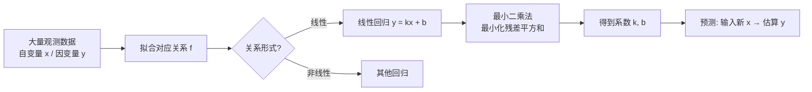

# 回归分析


### 什么是回归分析

回归分析，本质是在寻找不同变量之间的关系。

这里的变量和 Python 的变量不太一样，指的是统计学中的变量。统计学的变量指说明事物某种特征的量，变量往往会根据多次观测而有多个值。

举个例子，统计房屋的地段、面积、楼层和房价的关系。这里面的地段、面积、楼层和房价都是变量。回归分析是如何确定它们之间的关系的呢？答案是通过大量的观测。

观测（也可以说是观察）也是统计学的说法，整体来说指通过搜集现有的数据。比如搜集不同地区、不同楼层的房子的数据，整理成一个表格。每个变量都是一列：地段、面积、楼层、房价。找地段、面积、楼层和单价的关系，就是找到一个这样的函数：

y = f(地段, 面积, 楼层)

f 是什么样形式的函数，原先并不知道，只知道有大量的房屋数据。**所谓回归分析，就是通过大量已有的数据，来拟合出对应关系 f。同样对于新的数据，只要知道了房屋的地段、面积和楼层，就能估算出其房价。**

在上面的变量中，地段、面积和楼层称为自变量，单价称为因变量。

回归分析在现实中有非常多的应用。只要把现实问题用自变量、因变量的思路去建模，就能使用回归分析找到自变量和因变量的关系，以及用自变量预测未知的因变量。

比如针对员工的基本信息，可以通过回归分析来分析哪些变量（年龄、性别、籍贯、学历）和员工收入的函数关系。这样只要知道了员工的基本信息，就能预测出员工的收入。

### 线性回归

#### 定义

回归分析有非常多种，其中最基础、使用最广的是线性回归。线性回归也是相对来说最容易理解的回归分析方法。

线性回归，顾名思义，就是自变量和因变量的函数关系是线性关系。以上面说的房屋价格问题为例，如果用线性回归来建模这个问题，这个问题就可以转换为以下公式：

单价 = a × 地段 + b × 面积 + c × 楼层 + d

为了简化表示，假设 x0 = 地段、x1 = 面积、x2 = 楼层、y = 单价。上述式子可以化简为这样：

y = ax0 + bx1 + cx2 + d

对于线性回归问题，本质就是要通过已知的一批 (y, x0, x1, x2) 的观测记录，来求得线性函数的四个系数 a、b、c、d 的值。

#### 误差衡量

通过已有的观测来估算 a、b、c、d 往往都不是精准的，会存在一定的误差。那么如何衡量找到的系数是对的呢？首先需要能够描述一组特定的系数（比如 a',b',c',d'）到底有多贴近真实的 abcd。把参数等于 a',b',c',d' 的函数 f 记做 f'。

然后假设 m 条观测记录，每条记录包含 y、x0、x1、x2 四个值。a',b',c',d' 这组参数的误差就等于：

SSR = Σ [f'(x0, x1, x2) − y]²

这个公式也被称为 SSR（Sum of Square Residuals），残差平方和。它指的是：针对每一条记录，用 a',b',c',d' 系数确定的函数 f'，结合 x0、x1、x2 计算出一个 y'。y' 是用估算系数计算出的估计值，而记录中的 y 则是实际值。用估算值减去实际值就得到了这条记录的误差。然后，将每条记录的误差求平方并加总起来，就得到了参数 a',b',c',d' 的总误差。

所以，线性回归的问题进一步转化为，**找到一组特定的 a,b,c,d，使得总误差函数的结果最小。** 一般情况下比较常见的方法是梯度下降。由于 Python 已经提供了现成的拟合能力，并不需要手工计算，所以如何计算的过程在此不展开。

#### 线性回归的几何意义

下面通过一个直观的例子来说明线性回归希望解决的问题。假设只有一个自变量和一个因变量，那么函数形式就是一个类似直线方程的形式：

y = kx + b

假设收集到 5 组（x,y）的观测记录，分别如下：

x
y

1.0
35.1

2.0
42.9

3.0
39.7

4.0
41.5

5.0
49.3

那用线性回归解决的问题就是通过这五组记录，估算出方程中的 k 和 b。

寻找的 k 和 b，就是希望寻找到一条直线，尽可能地靠近这些点。这样的直线可以画出很多条，那到底怎么衡量哪条直线是最好的呢？一般来说，常见的方法是统计每个观测点到直线的竖直距离（观测点的 y 与直线上同一 x 位置对应点的 y' 之差），再将这些距离加起来。哪条线的距离和最小，说明哪条线就是最优的。

线上的点和观测的点，x 是一样的，相减等于 0，所以只需要比较两个 y 的差即可。对于特定的 k', b'，小竖线的长度总和可以表示为如下公式：

Σ (k'x + b' − y)

让 i 从 1 到 5 循环，分别计算每个 x 对应的 y 和 y' 的距离并加总。但这会有一个问题：有的 y 比 y' 大，比如第二个点；有的 y 却比 y' 小，比如第三个点。但感兴趣的只是距离，这样会因为符号问题导致计算出现误差。解决的办法也很简单：直接把两个 y 相减后加上一个平方，这样就不会有符号问题了。

所以公式修改如下：

Σ (k'x + b' − y)²

上面的公式看着很眼熟，没错，这就是前文所讲的残差平方和的公式。

### 回归分析总览



### 用 Python 实现线性回归

上面介绍了什么是线性回归、线性回归能解决什么样的问题，以及如何衡量回归分析的结果。下面介绍如何做回归分析，如何从观测记录中计算线性函数的系数。

本篇以一个具体的例子来介绍如何使用 Python 完成回归分析的计算。

回归分析的数学原理，简单来说就是通过对误差函数求导的形式来做梯度下降，不断迭代出最佳的系数（比如一元线性回归的 k 和 b）。这里涉及比较多数学原理，不再展开，直接使用 Python 提供的方案即可完成。

#### 环境准备

为了实现回归分析，安装一个新的工具包：scikit-learn，和 NumPy 配合完成。

```
conda install scikit-learn
```

输入 y 回车，完成安装。

#### 任务描述

众所周知，房子的价格很大程度取决于地段。观测了十套房子的单价以及它们距离市中心的距离。如下所示：

距离市中心的距离（公里）
单价（万元）

1.0
10.14

2.0
9.89

3.0
8.41

4.0
9.61

5.0
7.95

6.0
7.46

7.0
6.62

8.0
5.23

9.0
4.70

10.0
4.77

假设距离市中心的距离和单价存在线性关系。尝试基于上述数据进行回归分析，求得线性函数的系数，并预测距离市区 15 公里的房屋单价。

#### 问题分析

通过距离来预测单价，所以这是一个典型的一元线性回归问题。距离是自变量，记做 x；单价是因变量，记做 y。所以求的函数就是：

y = kx + b

k 和 b 就是线性函数的系数，只要求得 k 和 b，把 x 带入 15.0，就能得到距离市区 15 公里的地方单价的预测值。

#### 任务实现

（1）载入数据。把已经列好的数组分别用两个一维数组来存储。

```
x = np.array([1.0, 2.0, 3.0, 4.0, 5.0 ,6.0,7.0,8.0,9.0,10])
y = np.array([10.14 ,  9.89 ,  8.41,  9.61,  7.95,
        7.46,  6.62,  5.23,  4.70,  4.77])

```

（2）实现画图函数。为了方便分析，先实现两个工具函数，一个用来画点，一个用来画点+线。由于还没有学习 matplotlib，代码的含义可以先不用关心，理解函数怎么使用即可。

```
import matplotlib
import matplotlib.pyplot as plt
# 将数组 x和数组 y 一一对应，以逐个点的形式画在坐标系上
def draw(x,y):
    matplotlib.style.use("ggplot")
    plt.scatter(x, y,c='b' )
    plt.show()
# 将数组 x和数组 y 一一对应，以逐个点的形式画在坐标系上
# 然后将数组 x 和数组 y1 一一对应，以直线的形式画在坐标系上
def draw_point_line(x,y,y1):
    matplotlib.style.use("ggplot")
    plt.scatter(x, y,c='b' )
    plt.plot(x, y1, c='r')
    plt.show()

```

（3）查看观测数据的分布。调用 draw 函数将观测值画出来，看看是否具备线性关系。

```
draw(x,y)

```

运行后可以看到：

可以看到，确实如任务描述章节所述，随着距离市区的公里数越多（x 轴），房屋的单价就越低（y 轴），而且看起来可以找到一条直线尽可能地靠近目前所有的点。

（4）初始化线性回归器对象。线性回归器（LinearRegression）是 scikit-learn 工具包中的一个类，通过它可以非常方便地进行回归分析。

```
from sklearn.linear_model import LinearRegression
# 创建线性回归实例
model = LinearRegression()

```

（5）调整 x 数组的结构，满足 LinearRegression 类的 fit 函数的要求。

```
# LinearRegression 类的第一个参数接受一个 NxM 的二维数组，N 代表观测记录数，M代表自变量的个数
# 目前有 10 条观测记录，每条记录只有一个自变量，所以直接将其形状调整为 10x1即可
x = x.reshape([10, 1])
x

```

输出如下：

```
array([[ 1.],
       [ 2.],
       [ 3.],
       [ 4.],
       [ 5.],
       [ 6.],
       [ 7.],
       [ 8.],
       [ 9.],
       [10.]])

```

可以看到，x 从一个 10 个元素的一维数组已被成功转化为 10x1 的二维数组。

（6）实现回归分析，并输出找到的最佳 k 和 b。

```
# 调用 model 对象的 fit 方法，即可完成回归分析
model.fit(x ,y)
# fit 之后，model 对象的 coef_ 属性是一个数组，存储的即是所有自变量的最佳系数
# 这里只有一个自变量，直接取第一个元素即可
print("最佳的k:",model.coef_[0])
# intercept_ 属性则是偏移系数，也就是要找的 b
print("最佳的b:", model.intercept_)

```

输出如下：

```
最佳的k: -0.6667878787878787
最佳的b: 11.145333333333333

```

（7）查看拟合效果。调用 fit 函数进行回归分析，虽然总能找到一个针对当前观测记录最优的 k 和 b，但依然可能不是完美的。毕竟观测记录一般都会有一定的误差，从之前画的散点图来看，观测记录只能说大概线性，而不是严格线性的（毕竟无法用一条直线把所有点连接起来）。所以每次 fit 完之后，都可以调用 score 函数来看一下分析的效果如何。

```
fit_score = model.score(x, y)
print("fit 的效果：",fit_score)

```

输出如下：

```
fit 的效果： 0.9314051422328029

```

score 返回的是 0 到 1 之间的值，所以 0.93 已经算非常不错的效果，这说明观测记录集本身也是基本线性的。

（8）查看拟合出的直线。在 fit 之后，model 对象内部就记录了最佳的 k 和 b 的信息，之后调用 predict 函数，传入自变量，就可以获得对应预测出的因变量预测值。所以画出拟合的直线，只需要将原始的 x 传入 model，拿到预测的 y，之后和 x 结对画线即可。

```
# 获得预测的 y 值
y_pred = model.predict(x)
print("观测记录的y：", y)
print("线性模型预测的y：", y_pred)
# 用（x,y）画点，用（x, y_pred）画直线
draw_point_line(x, y, y_pred)

```

运行后可以看到：

可以看到，预测值和原先的观测值仍有一定的误差，但已经非常接近了。从图来看，拟合出的直线也尽可能地贴合了所有的点。

（9）预测距离市中心 15 公里的房价。只需要把 15 以一个 1x1 的二维数字传入 model 对象的 predict 即可。

```
result = model.predict([[15]])
# predict的返回值是一个列表，由于只预测了一条，所以取第一条结果即可
print("距离市中心十五公里的房价是：", result[0])

```

输出如下：

```
距离市中心十五公里的房价是： 1.1435151515151531

```

### 小结

至此，基本完成了线性回归分析的学习。

回顾一下本文的内容，主要包含如下关键点。

- 回归分析的本质：分析变量之间的关系，通过大量的观测记录，来拟合出自变量到因变量的函数关系 f。
- 线性回归：最简单也是最常用的回归，代表自变量和因变量之间是线性关系。以三元回归为例，形式可以表示为 y = ax0 + bx1 + cx2 + d，要求函数关系本质就是求四个参数 a、b、c、d 的值。
- 用 Python 实现线性回归：
需要安装 scikit-learn 工具包，与 NumPy 配合完成；

- 自变量和因变量的观测记录需要分别存储；
- 创建 LinearRegression 类来进行回归分析的计算。通过 fit 函数可以完成线性函数系数的计算。在使用 fit 函数时，传入的自变量需要是 NxM 的二维数组；
- fit 之后，可以调用 score 获得拟合效果的打分；
- fit 之后，调用 predict 可以预测对输入的自变量的值预测出因变量的预测值。

## 版本差异（数据科学栈 → 当前版本）

| 库 | 本文编写时 | 当前稳定版 | 升级要点 |
|----|-----------|-----------|---------|
| Python | 3.8-3.12 | 3.14 | 3.12+ 起性能显著提升；3.14 PEP 649/750 |
| NumPy | 1.x/2.0 | 2.5.x | `np.float_` 等别名移除；NEP 50 类型提升 |
| Pandas | 1.x/2.x | 3.0.x | Copy-on-Write 默认开启；`inplace` 移除；字符串 dtype 变化 |
| Matplotlib | 3.x | 3.x 稳定版 | API 兼容，样式更新 |
| Seaborn | 0.12/0.13 | 0.13.x | API 稳定 |
| scikit-learn | 1.x | 1.9.x | API 稳定，新算法持续加入 |

> 本文讲解的数据分析流程（读取→清洗→分析→可视化）与核心 API 在最新版本中成立；升级时重点关注 Pandas 3.0 的 Copy-on-Write 与 NumPy 2.x 的类型变化。
