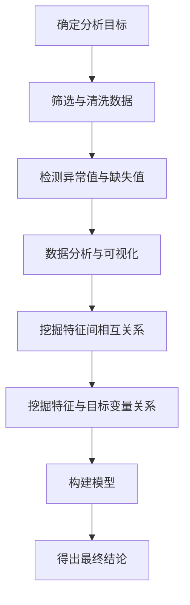

# 初识 EDA：探索性数据分析

通过一份公开的疫情数据集，以分析确诊病例随时间蔓延的趋势为例，实践 EDA 分析。

### EDA 简介

EDA 区别于传统数据分析的重要一点就是，EDA 不做任何前置的假设，而是直接通过对原始数据进行分析，用可视化技术和各种统计的方法来探寻数据隐含的规律和信息。就是**从数据中寻找规律，而不是基于人工假设。**

一般来说，EDA 分为以下几个步骤：

- 确定分析任务的目标；
- 筛选、清洗数据；
- 检测异常值与缺失值；

- 数据分析，可视化；
- 挖掘特征之间的相互关系；

- 挖掘特征与目标变量之间的关系
- 根据上一步的结果构建模型；
- 得出最终结论。
从上面的流程不难看出，之前的实战思路都类似 EDA 的思路，并且学习到的比如 numpy、pandas 和 matplotlib 等工具也都是为 EDA 所服务的。

下面通过一个具体的实战，从 EDA 的流程来做一次完整的数据分析。

### EDA 标准流程



### 任务背景

本案例使用一份公开的疫情数据集，目标是预测不同国家随着时间推进的确诊病例变化趋势。通过对确诊数据的探索性分析，可以发现蔓延规律，并据此建立预测模型，为资源规划提供依据。

### 数据集描述

这次的数据集由两个文件组成，分别是 train.csv 和 test.csv。

train.csv 的格式如下：每行包含 Id（记录 id）、Province_State（省份）、Country_Region（国家）、Date（日期）、ConfirmedCases（累计确诊数）、Fatalities（累计死亡数）。

test.csv 的格式如下：字段与 train.csv 基本一致，但不包含 ConfirmedCases 和 Fatalities 两列。

为什么是两个文件呢？ 顾名思义 train.csv 是用来做数据分析以及训练模型的。而模型的目的，就是预测 test.csv 里面的记录，对应的确诊数和死亡数。

下面，就按照之前介绍的 EDA 流程，对上述数据进行分析，并基于分析的结论建立模型。

### EDA 分析

#### 确定分析任务的目标

为了更加明确任务目标，首先需要先看一下 train.csv 和 test.csv 里面的内容。

首先导入必要的工具包：

```
import pandas as pd
import matplotlib.pyplot as plt
import numpy as np
import seaborn as sns
import random
from plotly import tools
import plotly.express as px
from plotly.offline import init_notebook_mode, iplot, plot
import plotly.figure_factory as ff
import plotly.graph_objs as go

```

然后导入两个数据文件，分别查看：

```
df_train = pd.read_csv("train.csv")
df_test = pd.read_csv("test.csv")
# 首先查看 train 文件中的内容
df_train

```

运行后可以看到：

从输出的数据摘要来看，train 数据中一共有 3.5w 条记录，时间跨度从 2020 年 1 月 22 号到 2020 年 5 月 15 号，包含不同国家在不同日期内的确诊病例和死亡病例的数据。另外可以看到省份字段有很多缺失值，需要在清洗环节处理。

然后看一下 test 数据：

```
df_test

```

运行后可以看到：

可以看到，test 包含的数据也不少，字段和 train 类似，只是不包含确诊病例数和死亡病例数。时间跨度是从 4 月份到 5 月份，值得注意的一点是时间和 train 数据集中有一定的重叠。

但从 test 数据集的分布来看，本次分析的任务目标已经基本清晰了：**从 train 数据中训练出模型，然后分别预测 test 数据集中，不同的国家在不同的日期中的确诊病例数和死亡病例数。**

#### 筛选、清洗数据

下面，就进入了清洗数据的环节。首先从缺失值开始：

```
df_train.isna().sum()

```

输出如下：

```
Id                    0
Province_State    20700
Country_Region        0
Date                  0
ConfirmedCases        0
Fatalities            0
dtype: int64

```

可以看到，除了省份，其他都没有缺失值，还算不错，但省份的缺失值数量很大，有 2w 条，而数据集一共才 3w+ 条数据。这代表后续分析不适合从省份入手，不然会有较大的偏差。

目前先简单用空字符串来填充即可。

```
df_train = df_train.fillna("")
df_train

```

运行后可以看到：

可以看到，缺失值已经被成功填充了。

接下来，通过 describe 来看一下 dataframe 中的统计分布信息。

```
df_train.describe()

```

运行后可以看到：

从输出来看，基本是正常的，符合预期，没有明显的异常值。

#### 数据分析、可视化

下面，进入数据分析与可视化的环节。

首先从国家维度切入，看看不同国家历史累计确诊数。由于这个数据表中的数据是累计确诊数随着时间变化的表，所以不能直接对国家维度进行聚合，那样会多计很多重复的内容。

比如从刚才的 DataFrame 概览中，Zimbabwe 5-11 和 5-12 确诊数都是 36。代表 5-12 没有新增，还是 36 确诊。如果直接进行求和，则会被计为 72 了。

基于上面的分析，分国家确诊病例数这样处理：

- 首先按国家、省份、和日期维度聚合，并求和；
- 之后按国家和省份维度聚合，但聚合方式为取最大值；
- 最后按照国家维度聚合求和，并排序。
代码如下：

```
df_countries = df_train.groupby(["Country_Region","Province_State","Date"])["ConfirmedCases"].sum()
df_countries = df_countries.groupby(["Country_Region", "Province_State"]).max()
df_countries = df_countries.groupby(["Country_Region"]).sum().sort_values(ascending=False)
# 取前 20 条画图
df_countries = df_countries.head(20)

```

执行之后，下一步使用 plotly 将图表画出来：

```
fig = px.bar(df_countries, x=df_countries.index, y='ConfirmedCases', labels={'x':'Country'},
             color="ConfirmedCases", color_continuous_scale=px.colors.sequential.Bluered)
fig.update_layout(title_text='国家历史最高确诊数')
fig.show()

```

运行后可以看到：

可以看到，美国的确诊病例数远大于其他的国家。通过框选查看除了美国之外其他国家的情况。

调整坐标轴范围之后可以看到：即便排除了美国，剩余国家的差别仍然非常大。从这些图不难发现，**国家这个特征应该是预测确诊病例数的核心特征之一**。

接下来以美国为例，来分析一下确诊病例随着时间的变化趋势。

首先还是准备数据源，代码如下：

```
# 首先过滤出所有美国的记录，并取省份、日期和确诊数，死亡数等字段
df_usa_records = df_train.loc[df_train["Country_Region"]=="US", ["Province_State","Date", "ConfirmedCases", "Fatalities"]]
# 将上述记录按日期维度聚合，同时这会抛弃省份维度
df_usa_records = df_usa_records.groupby("Date").sum()
# 重置索引（自动添加序号索引），否则会用 date 作为索引，不方便画图
df_usa_records = df_usa_records.reset_index()
# 查看
df_usa_records

```

运行后可以看到：

接下来，继续使用 plotly 将其画出来：

```
fig = px.bar(df_usa_records,x='Date', y='ConfirmedCases', color="ConfirmedCases", color_continuous_scale=px.colors.sequential.Magma)
fig.update_layout(title_text='美国随时间确诊病例数')
fig.show()

```

运行后可以看到：

整个数据表的时间维度是 2020 年的 2 月到 5 月，这个时候全球除了中国已经取得了一定的控制，其他的国家仍然处于爆发的阶段。从上图中也可以看出，3 月中旬之前美国的确诊数还比较少，但从 3 月中旬开始，确诊病例数随着时间维度开始不断地攀升。所以又可以得出，时间同样也是核心的特征之一。

接下来看一下美国的死亡病例数：

```
fig = px.bar(df_usa_records,x='Date', y='Fatalities', color="Fatalities", color_continuous_scale=px.colors.sequential.Magma)
fig.update_layout(title_text='美国随时间死亡病例数')
fig.show()

```

运行后可以看到：

可以看到整体的趋势类似确诊曲线，但相比较确诊曲线有一定的滞后性，不过也基本符合直觉。

再随机抽样另一个国家的数据情况，比如巴西。代码如下：

```
df_brz_records = df_train.loc[df_train["Country_Region"]=="Brazil", ["Province_State","Date", "ConfirmedCases", "Fatalities"]]
df_brz_records = df_brz_records.groupby("Date").sum()
df_brz_records = df_brz_records.reset_index()
fig = px.bar(df_brz_records,x='Date', y='ConfirmedCases', color="ConfirmedCases", color_continuous_scale=px.colors.sequential.Magma)
fig.update_layout(title_text='巴西随时间确诊病例数')
fig.show()

```

运行后可以看到：

看下随时间死亡病例数情况：

```
fig = px.bar(df_brz_records,x='Date', y='Fatalities', color="Fatalities", color_continuous_scale=px.colors.sequential.Magma)
fig.update_layout(title_text='巴西随时间死亡病例数')
fig.show()

```

运行后可以看到：

从上图中可以看到，巴西的确诊数和死亡数和美国类似，仍然是随着时间不断攀升。但是从 4 月下旬开始却比美国的增长陡峭很多。从这里可以看到，不同国家之间除了确诊总数的差别之外，在确诊病例数的发展情况也有区别，进一步说明国家维度应该是一个核心特征。

#### 特征工程

现在来开始建立模型，从之前的分析可以知道，时间和国家维度都是重要的参考指标。也就是核心特征，但回想之前使用的线性回归，往往都要求特征是数字，这样才能利用梯度算法来计算模型，而国家是类别值，而时间则是特殊类型，该怎么办呢？这就需要将这两个特征进行预处理，将其转换为数字。这就是熟悉的特征工程环节。

（1）处理日期数据

处理日期数据的方法就是将日期转化为三个数字：年、月、日，并分别新建字段。处理的逻辑思路和代码如下：

```
# 传入日期，将其用 - 分割，并返回第一部分，即年
def get_year(date_str):
    comps = date_str.split("-")
    return int(comps[0])
# 传入日期，将其用 - 分割，并返回第二部分，即月
def get_month(date_str):
    comps = date_str.split("-")
    return int(comps[1])
# 传入日期，将其用 - 分割，并返回第三部分，即日
def get_day(date_str):
    comps = date_str.split("-")
    return int(comps[2])
# 分别对 Date 字段 apply 上述三个函数，并用结果新建对应的 列
df_train["Year"] = df_train.Date.apply(get_year)
df_train["Month"] = df_train.Date.apply(get_month)
df_train["Day"] = df_train.Date.apply(get_day)
# 查看
df_train

```

运行后可以看到：

可以看到，已经将日期分别拆成了年、月、日三个新的字段。

（2）处理国家的特征

从筛选数据的环节知道，省份处理有较多的缺失。但仍然有大概 1/3 的记录是有值的，所以也不能直接抛弃这个字段，但如果直接将其作为一个特征的话，可能会影响模型的结果。

所以将省份直接拼接到国家的维度，将国家+省份整体作为一个特征。这样就能尽可能地使用省份信息，又能避免太多空值给模型造成的影响。代码如下：

```
df_train["Country_Region"] = df_train["Country_Region"] + df_train["Province_State"]
df_train["Country_Region"].value_counts()

```

输出如下：

```
ChinaLiaoning                      115
Egypt                              115
Burundi                            115
USDelaware                         115
Panama                             115
                                  ...
CanadaNew Brunswick                115
ChinaJiangsu                       115
Congo (Kinshasa)                   115
FranceSaint Pierre and Miquelon    115
Colombia                           115
Name: Country_Region, Length: 313, dtype: int64

```

可以看到，对于有省份数据的记录，已经拼接到了国家这个字段上面。

处理国家特征的第二步，就是如何将其转换为数字，一般来说将类别特征转换为数字，可以使用 sklearn 工具包中的 LabelEncoder 对象。代码如下：

```
from sklearn.preprocessing import LabelEncoder
encoder = LabelEncoder()
df_train["Country_Region"] = encoder.fit_transform(df_train["Country_Region"])
df_train

```

运行后可以看到，Country_Region 字段已被编码为数字序号。

（3）抽取训练特征和目标特征

下面就是从原始数据表中排除干扰项，形成用于训练的特征，以及拆分出 ConfirmedCases 作为预测目标特征。代码如下：

```
df_train_final = df_train[["Country_Region", "Year", "Month", "Day"]]
labels = df_train.ConfirmedCases

```

#### 模型训练

现在特征已经准备好了，现在就需要选择合适的模型架构来训练预测模型。在之前的课程中，使用过线性回归模型，但线性回归却不适用于这里的场景。

从上面表的内容中可以看到，国家被编码成了序号。虽然是数字，但这个数字的大小本身是无意义的。比如 1 是阿富汗，2 是美国，3 是巴拿马，阿富汗和巴拿马都很少，美国很多。这就是所谓的非线性关系，就是不能用这个值的大小作为判断依据。但是从之前的分析，国家本身对于确诊病例数的发展却很关键。

对于这类非线性特征，就需要使用非线性的模型。本节使用业界最常见的 xgboost 来建立模型。

首先要安装 xgboost 工具包，打开开始→Anaconda3→Anaconda Prompt，输入 conda install xgboost 进行安装。

安装完成后即可进行训练，代码如下：

```
# 导入 xgboost
from xgboost import XGBRegressor
# 创建 xgboost，并配置参数
xgb = XGBRegressor(n_estimators = 2500 , random_state = 0 , max_depth = 27)
# 对刚才准备的特征进行训练
xgb.fit(df_train_final, labels)

```

这个训练过程会跑的时间稍久一些，之后会输出：

```
XGBRegressor(base_score=0.5, booster='gbtree', colsample_bylevel=1,
             colsample_bynode=1, colsample_bytree=1, gamma=0, gpu_id=-1,
             importance_type='gain', interaction_constraints='',
             learning_rate=0.300000012, max_delta_step=0, max_depth=27,
             min_child_weight=1, missing=nan, monotone_constraints='()',
             n_estimators=2500, n_jobs=8, num_parallel_tree=1, random_state=0,
             reg_alpha=0, reg_lambda=1, scale_pos_weight=1, subsample=1,
             tree_method='exact', validate_parameters=1, verbosity=None)

```

这代表模型训练成功。

#### 获取结论

模型训练完成后，对 test 数据集中的数据进行预测。首先将 test 数据集进行和之前 train 数据集一样的操作，包括拆分日期，合并国家省份等，因为需要确保预测的特征和训练的特征一致，才能用刚才训练的模型进行预测。

整理 test 数据集的基本特征：

```
df_test = df_test.fillna("")
df_test["Year"] = df_test.Date.apply(get_year)
df_test["Month"] = df_test.Date.apply(get_month)
df_test["Day"] = df_test.Date.apply(get_day)
df_test["Country_Region"] = df_test["Country_Region"] + df_test["Province_State"]
df_test

```

运行后可以看到：

从输出可以看到，test 特征字段已经和 train 一致了。

接下来就是进行预测，并且将预测结果添加到 test 数据表中。

```
df_test_final = df_test[["Country_Region", "Year", "Month", "Day"]]
df_test["predict_confirm"] = xgb.predict(df_test_final)
df_test

```

运行后可以看到：

可以看到，predict_confirm 已经被成功的添加了。

测试数据是从 4 月 2 号开始的，训练数据也包含这个日期的数据，查看一下训练数据中这部分数据的取值。

```
df_train[df_train.Date >= "2020-04-02"]

```

运行后可以看到：

通过对比两张表，可以发现预测还是比较准确的。

> 严谨来说，训练数据是不应该包含测试数据的，这样会导致模型对测试数据效果过于好，进而不足够说明模型的效果。但这里主要以演示过程为目的，没有进行额外的处理。

### 小结

本节 EDA 的初战就结束了。回顾一下，本节主要学习了如下内容。

- EDA 的概念和基本的步骤。
- 遵循 EDA 的基本步骤来进行了疫情蔓延趋势的案例实战，主要包括：
  - 通过 fillna 填充缺失数据；
  - 通过多次 groupby 聚合来处理出想要的数据；
- 通过 plotly 绘制柱状图来分析相关趋势；
- 通过对字段 apply 处理函数来拆分日期维度；
- 通过 LabelEncoder 来将国家处理为数值；
- 通过 xgboost 来拟合非线性关系的数据。
下一篇将带来案例实战：训练电影票房预测模型。

## 版本差异（数据科学栈 → 当前版本）

| 库 | 本文编写时 | 当前稳定版 | 升级要点 |
|----|-----------|-----------|---------|
| Python | 3.8-3.12 | 3.14 | 3.12+ 起性能显著提升；3.14 PEP 649/750 |
| NumPy | 1.x/2.0 | 2.5.x | `np.float_` 等别名移除；NEP 50 类型提升 |
| Pandas | 1.x/2.x | 3.0.x | Copy-on-Write 默认开启；`inplace` 移除；字符串 dtype 变化 |
| Matplotlib | 3.x | 3.x 稳定版 | API 兼容，样式更新 |
| Seaborn | 0.12/0.13 | 0.13.x | API 稳定 |
| scikit-learn | 1.x | 1.9.x | API 稳定，新算法持续加入 |

> 本文讲解的数据分析流程（读取→清洗→分析→可视化）与核心 API 在最新版本中成立；升级时重点关注 Pandas 3.0 的 Copy-on-Write 与 NumPy 2.x 的类型变化。
