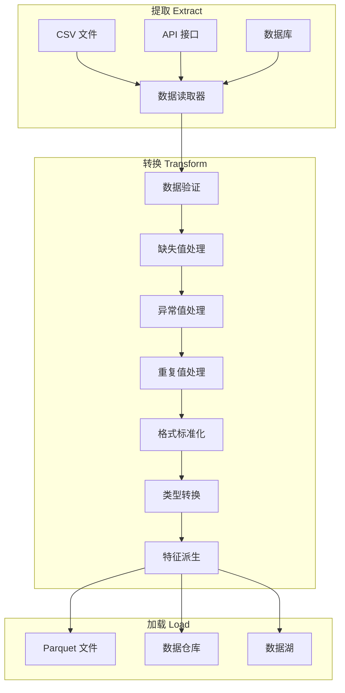
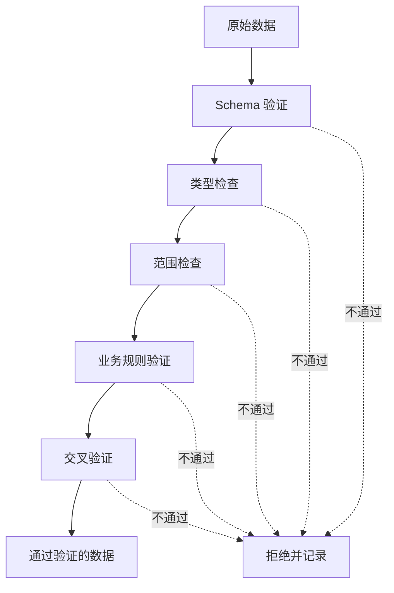
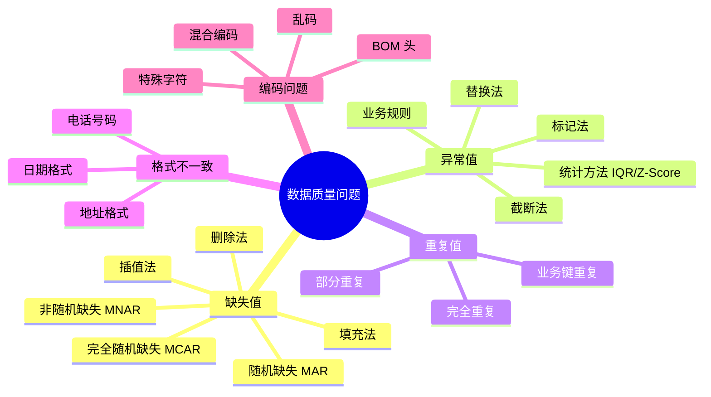
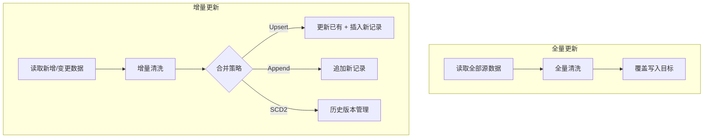
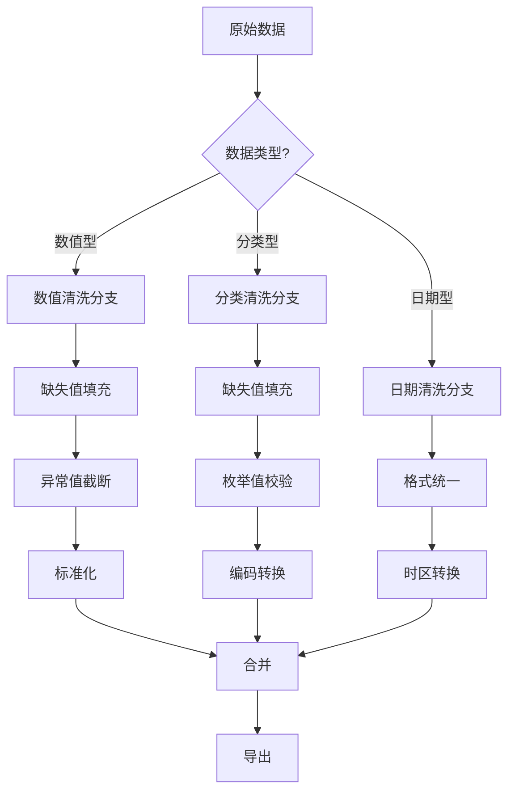
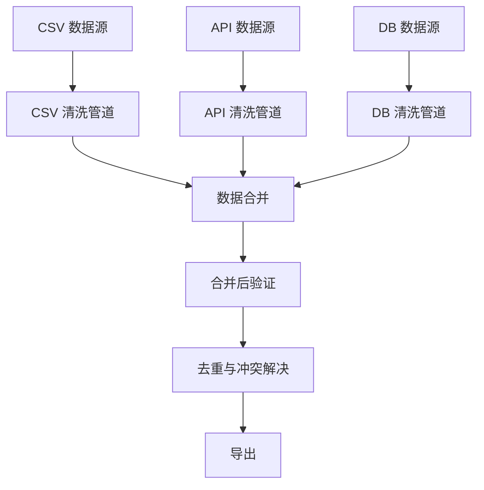

# 数据清洗管道实战

**数据清洗是数据工程中最耗时也最关键的环节。** 一个设计良好的清洗管道不仅能提升数据质量，还能让数据流转过程可追溯、可复现、可维护。本文聚焦 Python 数据清洗管道的设计原则、验证策略、编排模式与实战场景。

> 阅读提示

- 如果你想了解管道设计原则，从 [数据清洗管道设计原则](#数据清洗管道设计原则) 开始
- 如果你想快速掌握数据验证方法，跳到 [数据验证策略](#数据验证策略)
- 如果你想看完整实战代码，直接看 [场景一：CSV 数据清洗管道](#场景一csv-数据清洗管道)
- 如果你想了解增量更新策略，看 [增量更新策略](#增量更新策略)
- 本文基于 **Python 3.12+**，Pandas 2.x/3.0，PyArrow

## 数据清洗管道设计原则

### ETL 管道全景



### 核心设计原则

| 原则 | 说明 | 实践方式 |
|------|------|----------|
| **幂等性** | 同一输入多次执行产生相同结果 | 避免随机填充、使用确定性种子 |
| **可追溯** | 每条数据可追溯到原始来源 | 添加 `_source`、`_ingested_at` 元数据列 |
| **可复现** | 相同数据 + 相同代码 = 相同输出 | 固定随机种子、版本化清洗规则 |
| **渐进式** | 清洗步骤可独立运行和调试 | 每步返回 DataFrame，不修改原始数据 |
| **防御性** | 对异常输入优雅降级而非崩溃 | try/except + 日志记录 + 默认值 |
| **可观测** | 管道运行状态可监控 | 统计每步处理行数、耗时、异常数 |

### 管道基类设计

```python
from __future__ import annotations

import logging
import time
from abc import ABC, abstractmethod
from dataclasses import dataclass, field

import pandas as pd

logger = logging.getLogger(__name__)


@dataclass
class PipelineStats:
    """管道运行统计"""
    step_name: str
    input_rows: int = 0
    output_rows: int = 0
    dropped_rows: int = 0
    duration_seconds: float = 0.0
    errors: list[str] = field(default_factory=list)

    @property
    def drop_rate(self) -> float:
        return self.dropped_rows / self.input_rows if self.input_rows else 0.0


class PipelineStep(ABC):
    """管道步骤基类：每个清洗步骤继承此类"""

    def __init__(self, name: str) -> None:
        self.name = name

    @abstractmethod
    def process(self, df: pd.DataFrame) -> pd.DataFrame:
        """处理数据，返回清洗后的 DataFrame"""
        ...

    def run(self, df: pd.DataFrame) -> tuple[pd.DataFrame, PipelineStats]:
        """执行步骤并收集统计信息"""
        stats = PipelineStats(step_name=self.name, input_rows=len(df))
        start = time.perf_counter()

        try:
            result = self.process(df)
            stats.output_rows = len(result)
            stats.dropped_rows = stats.input_rows - stats.output_rows
        except Exception as e:
            stats.errors.append(str(e))
            logger.error(f"步骤 [{self.name}] 执行失败: {e}")
            result = df  # 失败时返回原始数据（防御性设计）

        stats.duration_seconds = round(time.perf_counter() - start, 3)
        logger.info(
            f"步骤 [{self.name}]: {stats.input_rows} → {stats.output_rows} 行 "
            f"(丢弃 {stats.dropped_rows}, 耗时 {stats.duration_seconds}s)"
        )
        return result, stats


class DataPipeline:
    """数据清洗管道：组合多个步骤顺序执行"""

    def __init__(self, name: str) -> None:
        self.name = name
        self.steps: list[PipelineStep] = []
        self.stats: list[PipelineStats] = []

    def add_step(self, step: PipelineStep) -> DataPipeline:
        """添加步骤（支持链式调用）"""
        self.steps.append(step)
        return self

    def run(self, df: pd.DataFrame) -> pd.DataFrame:
        """顺序执行所有步骤"""
        logger.info(f"管道 [{self.name}] 启动，输入 {len(df)} 行")
        self.stats = []

        for step in self.steps:
            df, step_stats = step.run(df)
            self.stats.append(step_stats)

        logger.info(f"管道 [{self.name}] 完成，输出 {len(df)} 行")
        return df

    def report(self) -> pd.DataFrame:
        """生成管道运行报告"""
        return pd.DataFrame([
            {
                "步骤": s.step_name,
                "输入行数": s.input_rows,
                "输出行数": s.output_rows,
                "丢弃行数": s.dropped_rows,
                "丢弃率": f"{s.drop_rate:.2%}",
                "耗时(秒)": s.duration_seconds,
                "错误": "; ".join(s.errors) if s.errors else "",
            }
            for s in self.stats
        ])
```

::: tip 管道基类设计要点
- 每个步骤继承 `PipelineStep`，只实现 `process()` 方法
- `run()` 方法自动收集统计信息，无需手动埋点
- 失败时返回原始数据而非抛异常，保证管道不中断
- `DataPipeline.report()` 可生成完整的运行报告
:::

## 数据验证策略

数据验证是清洗管道的第一道防线。在数据进入转换流程之前，先验证其结构和内容是否符合预期。

### 验证层次



### Schema 验证

Schema 验证确保数据包含预期的列名、数据类型和约束条件。

```python
from dataclasses import dataclass
from typing import Any

import pandas as pd


@dataclass
class ColumnSchema:
    """列级 Schema 定义"""
    name: str
    dtype: str                # 期望的数据类型
    nullable: bool = True     # 是否允许空值
    unique: bool = False      # 是否要求唯一
    min_value: float | None = None
    max_value: float | None = None
    allowed_values: list[str] | None = None
    regex_pattern: str | None = None


class SchemaValidator:
    """Schema 验证器"""

    def __init__(self, schema: list[ColumnSchema]) -> None:
        self.schema = schema
        self.errors: list[dict[str, Any]] = []

    def validate(self, df: pd.DataFrame) -> tuple[pd.DataFrame, list[dict[str, Any]]]:
        """验证 DataFrame 是否符合 Schema"""
        self.errors = []
        schema_dict = {s.name: s for s in self.schema}

        # 1. 检查必需列是否存在
        missing_cols = set(schema_dict.keys()) - set(df.columns)
        for col in missing_cols:
            self.errors.append({
                "列": col, "规则": "列存在性", "问题": f"缺少必需列: {col}",
            })

        # 2. 逐列验证
        for col_name, col_schema in schema_dict.items():
            if col_name not in df.columns:
                continue
            series = df[col_name]

            # 类型检查
            if not self._check_dtype(series, col_schema.dtype):
                self.errors.append({
                    "列": col_name, "规则": "数据类型",
                    "问题": f"期望 {col_schema.dtype}，实际 {series.dtype}",
                })

            # 空值检查
            if not col_schema.nullable and series.isnull().any():
                null_count = series.isnull().sum()
                self.errors.append({
                    "列": col_name, "规则": "非空约束",
                    "问题": f"发现 {null_count} 个空值",
                })

            # 唯一性检查
            if col_schema.unique and series.duplicated().any():
                dup_count = series.duplicated().sum()
                self.errors.append({
                    "列": col_name, "规则": "唯一性",
                    "问题": f"发现 {dup_count} 个重复值",
                })

            # 范围检查
            if col_schema.min_value is not None:
                numeric = pd.to_numeric(series, errors='coerce')
                below = (numeric < col_schema.min_value).sum()
                if below > 0:
                    self.errors.append({
                        "列": col_name, "规则": "最小值",
                        "问题": f"{below} 个值低于最小值 {col_schema.min_value}",
                    })

            if col_schema.max_value is not None:
                numeric = pd.to_numeric(series, errors='coerce')
                above = (numeric > col_schema.max_value).sum()
                if above > 0:
                    self.errors.append({
                        "列": col_name, "规则": "最大值",
                        "问题": f"{above} 个值超过最大值 {col_schema.max_value}",
                    })

            # 枚举值检查
            if col_schema.allowed_values is not None:
                invalid = ~series.isin(col_schema.allowed_values) & series.notna()
                if invalid.any():
                    bad_values = series[invalid].unique().tolist()[:5]
                    self.errors.append({
                        "列": col_name, "规则": "枚举值",
                        "问题": f"非法值: {bad_values}",
                    })

        return df, self.errors

    def _check_dtype(self, series: pd.Series, expected: str) -> bool:
        """检查数据类型是否匹配"""
        type_map = {
            "int": ["int64", "int32", "Int64", "Int32"],
            "float": ["float64", "float32"],
            "str": ["object", "string"],
            "datetime": ["datetime64[ns]", "datetime64[ns, UTC]"],
            "bool": ["bool", "boolean"],
        }
        allowed = type_map.get(expected, [expected])
        return str(series.dtype) in allowed


# 定义 Schema
user_schema = [
    ColumnSchema("user_id", dtype="int", nullable=False, unique=True),
    ColumnSchema("username", dtype="str", nullable=False, regex_pattern=r"^[a-zA-Z0-9_]{3,20}$"),
    ColumnSchema("age", dtype="int", nullable=True, min_value=0, max_value=150),
    ColumnSchema("email", dtype="str", nullable=False),
    ColumnSchema("status", dtype="str", nullable=False, allowed_values=["active", "inactive", "suspended"]),
    ColumnSchema("created_at", dtype="datetime", nullable=False),
]

# 使用
validator = SchemaValidator(user_schema)
df, errors = validator.validate(df)
if errors:
    for err in errors:
        print(f"  验证失败 [{err['列']}] {err['规则']}: {err['问题']}")
```

### 使用 Pandera 进行声明式验证

Pandera 是一个专门的数据验证库，支持声明式 Schema 定义和自动类型强制转换。

```python
import pandera as pa
from pandera import Column, Check, Index

# 定义 Schema
sales_schema = pa.DataFrameSchema(
    columns={
        "order_id": Column(int, Check(lambda x: x > 0, error="订单ID必须为正整数"), nullable=False),
        "product": Column(str, Check.isin(["A", "B", "C", "D"]), nullable=False),
        "quantity": Column(int, Check.in_range(1, 1000), nullable=False),
        "price": Column(float, Check.greater_than(0), nullable=False),
        "order_date": Column("datetime64[ns]", nullable=False),
        "discount": Column(float, Check.in_range(0.0, 1.0), nullable=True),
    },
    checks=[
        # 行级验证：折扣价不能为负
        Check(
            lambda df: (df["price"] * (1 - df["discount"].fillna(0))) >= 0,
            error="折扣后价格不能为负",
        ),
    ],
    strict=True,       # 禁止出现未定义的列
    coerce=True,       # 自动类型转换
)

# 验证
validated_df = sales_schema.validate(df)
```

### 验证策略对比

| 策略 | 工具 | 优点 | 缺点 | 适用场景 |
|------|------|------|------|----------|
| 手动验证 | 自定义函数 | 完全灵活 | 代码量大、易遗漏 | 简单场景、一次性验证 |
| Schema 验证 | 自定义 Schema 类 | 可复用、可扩展 | 需要维护 Schema 定义 | 中等复杂度项目 |
| Pandera | pandera 库 | 声明式、自动类型转换、统计信息 | 学习成本、依赖第三方库 | 正式项目、团队协作 |
| Great Expectations | great_expectations | 丰富的验证规则、数据文档、集成广泛 | 重量级、配置复杂 | 企业级数据平台 |
| Pydantic | pydantic | 与 FastAPI 集成好、类型安全 | 逐行验证性能差 | API 数据验证 |

## 常见数据质量问题与修复

### 问题全景



### 缺失值处理

```python
import pandas as pd
import numpy as np


class MissingValueHandler:
    """缺失值处理器"""

    @staticmethod
    def diagnose(df: pd.DataFrame) -> pd.DataFrame:
        """诊断缺失值分布"""
        total = len(df)
        missing = df.isnull().sum()
        report = pd.DataFrame({
            "列名": df.columns,
            "缺失数": missing.values,
            "缺失率": (missing.values / total * 100).round(2),
            "非空数": total - missing.values,
            "数据类型": df.dtypes.values,
        })
        return report[report["缺失数"] > 0].sort_values("缺失率", ascending=False)

    @staticmethod
    def fill_numeric(df: pd.DataFrame, col: str, strategy: str = "median") -> pd.DataFrame:
        """数值列缺失值填充"""
        df = df.copy()
        series = df[col]

        strategies = {
            "mean": series.mean(),
            "median": series.median(),
            "mode": series.mode()[0],
            "zero": 0,
            "min": series.min(),
            "max": series.max(),
        }

        if strategy not in strategies:
            raise ValueError(f"未知策略: {strategy}，可选: {list(strategies.keys())}")

        fill_value = strategies[strategy]
        missing_count = series.isnull().sum()
        df[col] = series.fillna(fill_value)
        print(f"  [{col}] 填充 {missing_count} 个缺失值，策略: {strategy}，填充值: {fill_value:.4f}")
        return df

    @staticmethod
    def fill_categorical(df: pd.DataFrame, col: str, fill_value: str = "未知") -> pd.DataFrame:
        """分类列缺失值填充"""
        df = df.copy()
        missing_count = df[col].isnull().sum()
        df[col] = df[col].fillna(fill_value)
        print(f"  [{col}] 填充 {missing_count} 个缺失值，填充值: '{fill_value}'")
        return df

    @staticmethod
    def fill_with_indicator(df: pd.DataFrame, col: str, fill_value: float = 0) -> pd.DataFrame:
        """填充并添加缺失指示列（保留缺失信息）"""
        df = df.copy()
        df[f"_is_{col}_missing"] = df[col].isnull().astype(int)
        df[col] = df[col].fillna(fill_value)
        return df

    @staticmethod
    def interpolate_time(df: pd.DataFrame, col: str, method: str = "linear") -> pd.DataFrame:
        """时间序列插值填充"""
        df = df.copy()
        missing_count = df[col].isnull().sum()
        df[col] = df[col].interpolate(method=method)
        print(f"  [{col}] 插值填充 {missing_count} 个缺失值，方法: {method}")
        return df

    @staticmethod
    def drop_by_threshold(df: pd.DataFrame, threshold: float = 0.5) -> pd.DataFrame:
        """删除缺失率超过阈值的列"""
        missing_rate = df.isnull().sum() / len(df)
        drop_cols = missing_rate[missing_rate > threshold].index.tolist()
        if drop_cols:
            print(f"  删除缺失率 > {threshold:.0%} 的列: {drop_cols}")
            df = df.drop(columns=drop_cols)
        return df
```

::: warning 缺失值填充策略选择
- **删除法**：缺失率 < 5% 且非关键列时可用
- **均值/中位数**：数值列，分布偏斜时选中位数
- **众数**：分类列
- **插值法**：时间序列数据
- **指示列法**：缺失本身可能有业务含义（如用户未填写某字段暗示某种行为）
- **不要**统一用 0 填充，0 在不同列有不同含义
:::

### 异常值处理

```python
import pandas as pd
import numpy as np


class OutlierHandler:
    """异常值处理器"""

    @staticmethod
    def detect_iqr(df: pd.DataFrame, col: str, factor: float = 1.5) -> pd.Series:
        """IQR 法检测异常值"""
        q1 = df[col].quantile(0.25)
        q3 = df[col].quantile(0.75)
        iqr = q3 - q1
        lower = q1 - factor * iqr
        upper = q3 + factor * iqr
        return (df[col] < lower) | (df[col] > upper)

    @staticmethod
    def detect_zscore(df: pd.DataFrame, col: str, threshold: float = 3.0) -> pd.Series:
        """Z-Score 法检测异常值"""
        z_scores = np.abs((df[col] - df[col].mean()) / df[col].std())
        return z_scores > threshold

    @staticmethod
    def clip_iqr(df: pd.DataFrame, col: str, factor: float = 1.5) -> pd.DataFrame:
        """IQR 截断法：将异常值截断到边界"""
        df = df.copy()
        q1 = df[col].quantile(0.25)
        q3 = df[col].quantile(0.75)
        iqr = q3 - q1
        lower = q1 - factor * iqr
        upper = q3 + factor * iqr
        outlier_count = ((df[col] < lower) | (df[col] > upper)).sum()
        df[col] = df[col].clip(lower, upper)
        print(f"  [{col}] IQR 截断: {outlier_count} 个异常值，范围 [{lower:.2f}, {upper:.2f}]")
        return df

    @staticmethod
    def mark_outliers(df: pd.DataFrame, col: str, factor: float = 1.5) -> pd.DataFrame:
        """标记异常值（不修改原值，添加标记列）"""
        df = df.copy()
        is_outlier = OutlierHandler.detect_iqr(df, col, factor)
        df[f"_is_{col}_outlier"] = is_outlier.astype(int)
        print(f"  [{col}] 标记 {is_outlier.sum()} 个异常值")
        return df

    @staticmethod
    def replace_with_percentile(
        df: pd.DataFrame, col: str, lower_pct: float = 0.01, upper_pct: float = 0.99
    ) -> pd.DataFrame:
        """百分位替换法"""
        df = df.copy()
        lower = df[col].quantile(lower_pct)
        upper = df[col].quantile(upper_pct)
        outlier_count = ((df[col] < lower) | (df[col] > upper)).sum()
        df[col] = df[col].clip(lower, upper)
        print(f"  [{col}] 百分位替换: {outlier_count} 个异常值，范围 [{lower:.2f}, {upper:.2f}]")
        return df
```

### 异常值检测方法对比

| 方法 | 原理 | 优点 | 缺点 | 适用分布 |
|------|------|------|------|----------|
| IQR 法 | Q1-1.5*IQR ~ Q3+1.5*IQR | 稳健、不受极端值影响 | 对非对称分布效果差 | 近似正态分布 |
| Z-Score | 偏离均值超过 3 个标准差 | 直观、标准化 | 对极端值敏感（均值被拉偏） | 正态分布 |
| 百分位法 | 1% ~ 99% 分位数 | 简单、可控 | 可能误删正常极值 | 任意分布 |
| 业务规则 | 领域知识定义边界 | 最准确 | 需要领域专家 | 特定业务场景 |
| 孤立森林 | 无监督异常检测 | 多维异常检测 | 需要训练、参数调优 | 高维数据 |

### 重复值处理

```python
import pandas as pd


class DuplicateHandler:
    """重复值处理器"""

    @staticmethod
    def diagnose(df: pd.DataFrame, subset: list[str] | None = None) -> dict:
        """诊断重复值"""
        total = len(df)
        exact_dupes = df.duplicated().sum()
        key_dupes = 0
        if subset:
            key_dupes = df.duplicated(subset=subset).sum()

        return {
            "总行数": total,
            "完全重复行": exact_dupes,
            "完全重复率": f"{exact_dupes / total:.2%}",
            "业务键重复行": key_dupes,
            "业务键重复率": f"{key_dupes / total:.2%}" if subset else "N/A",
        }

    @staticmethod
    def remove_exact(df: pd.DataFrame, keep: str = "first") -> pd.DataFrame:
        """删除完全重复行"""
        before = len(df)
        df = df.drop_duplicates(keep=keep).reset_index(drop=True)
        print(f"  删除完全重复: {before} → {len(df)} 行 (移除 {before - len(df)} 行)")
        return df

    @staticmethod
    def remove_by_key(
        df: pd.DataFrame, key_cols: list[str], keep: str = "last"
    ) -> pd.DataFrame:
        """按业务键去重（保留最新或最早记录）"""
        before = len(df)
        df = df.drop_duplicates(subset=key_cols, keep=keep).reset_index(drop=True)
        print(f"  按键 {key_cols} 去重: {before} → {len(df)} 行")
        return df

    @staticmethod
    def merge_duplicates(
        df: pd.DataFrame, key_cols: list[str], agg_strategy: dict[str, str]
    ) -> pd.DataFrame:
        """合并重复记录（聚合冲突字段）"""
        before = len(df)
        # key_cols 以外的列按策略聚合
        result = df.groupby(key_cols, as_index=False).agg(agg_strategy)
        print(f"  合并重复: {before} → {len(result)} 行")
        return result


# 使用示例：合并重复用户记录
# agg_strategy = {"email": "first", "age": "max", "updated_at": "max", "score": "mean"}
# df = DuplicateHandler.merge_duplicates(df, key_cols=["user_id"], agg_strategy=agg_strategy)
```

### 格式不一致处理

```python
import pandas as pd
import re


class FormatNormalizer:
    """格式标准化处理器"""

    @staticmethod
    def normalize_date(df: pd.DataFrame, col: str, target_format: str = "%Y-%m-%d") -> pd.DataFrame:
        """日期格式标准化"""
        df = df.copy()
        df[col] = pd.to_datetime(df[col], errors="coerce")
        invalid = df[col].isnull()
        if invalid.any():
            print(f"  [{col}] {invalid.sum()} 个日期无法解析，设为 NaT")
        return df

    @staticmethod
    def normalize_phone(df: pd.DataFrame, col: str) -> pd.DataFrame:
        """电话号码标准化（保留数字，添加国家代码）"""
        df = df.copy()
        original = df[col].copy()

        def clean_phone(phone: str) -> str:
            if pd.isna(phone):
                return phone
            digits = re.sub(r"[^\d+]", "", str(phone))
            # 中国手机号：11位，添加 +86
            if re.match(r"^1[3-9]\d{9}$", digits):
                return f"+86{digits}"
            # 已有国家代码
            if digits.startswith("+"):
                return digits
            return digits

        df[col] = df[col].apply(clean_phone)
        changed = (df[col] != original).sum()
        print(f"  [{col}] 标准化 {changed} 个电话号码")
        return df

    @staticmethod
    def normalize_string(
        df: pd.DataFrame, col: str, strip: bool = True, lower: bool = False,
        remove_extra_spaces: bool = True,
    ) -> pd.DataFrame:
        """字符串标准化"""
        df = df.copy()
        series = df[col].astype(str)

        if strip:
            series = series.str.strip()
        if lower:
            series = series.str.lower()
        if remove_extra_spaces:
            series = series.str.replace(r"\s+", " ", regex=True)

        df[col] = series.replace("nan", pd.NA)
        return df

    @staticmethod
    def normalize_column_names(df: pd.DataFrame) -> pd.DataFrame:
        """列名标准化：小写 + 下划线"""
        df = df.copy()
        original = df.columns.tolist()
        df.columns = (
            df.columns.str.strip()
            .str.lower()
            .str.replace(r"[^\w]", "_", regex=True)
            .str.replace(r"_+", "_", regex=True)
            .str.strip("_")
        )
        changed = [f"{o} → {n}" for o, n in zip(original, df.columns) if o != n]
        if changed:
            print(f"  列名标准化: {changed[:5]}{'...' if len(changed) > 5 else ''}")
        return df
```

### 编码问题处理

```python
import chardet
import pandas as pd


class EncodingHandler:
    """编码问题处理器"""

    @staticmethod
    def detect_encoding(file_path: str, sample_size: int = 10000) -> dict:
        """检测文件编码"""
        with open(file_path, "rb") as f:
            raw = f.read(sample_size)
        result = chardet.detect(raw)
        return {
            "编码": result["encoding"],
            "置信度": f"{result['confidence']:.2%}",
            "语言": result.get("language", "未知"),
        }

    @staticmethod
    def read_with_fallback(file_path: str, encodings: list[str] | None = None) -> pd.DataFrame:
        """尝试多种编码读取文件"""
        if encodings is None:
            encodings = ["utf-8", "gbk", "gb2312", "gb18030", "latin-1"]

        for encoding in encodings:
            try:
                df = pd.read_csv(file_path, encoding=encoding)
                print(f"  成功读取，编码: {encoding}")
                return df
            except (UnicodeDecodeError, UnicodeError):
                continue

        # 最后尝试忽略错误
        df = pd.read_csv(file_path, encoding="utf-8", errors="replace")
        print("  警告: 使用 errors='replace' 读取，部分字符可能丢失")
        return df

    @staticmethod
    def remove_bom(file_path: str, output_path: str | None = None) -> str:
        """移除 BOM 头"""
        output_path = output_path or file_path
        with open(file_path, "rb") as f:
            content = f.read()

        # UTF-8 BOM
        if content.startswith(b"\xef\xbb\xbf"):
            content = content[3:]
            print("  移除 UTF-8 BOM")
        # UTF-16 LE BOM
        elif content.startswith(b"\xff\xfe"):
            content = content[2:]
            print("  移除 UTF-16 LE BOM")

        with open(output_path, "wb") as f:
            f.write(content)
        return output_path
```

## 增量更新策略

### 全量 vs 增量



| 维度 | 全量更新 | 增量更新 |
|------|---------|---------|
| 数据量 | 全部数据 | 仅新增/变更部分 |
| 执行时间 | 长（与数据总量成正比） | 短（与变更量成正比） |
| 资源消耗 | 高 | 低 |
| 实现复杂度 | 简单 | 较复杂（需识别变更） |
| 数据一致性 | 强（每次完整重建） | 需额外保证 |
| 适用场景 | 数据量小、变更频繁 | 数据量大、变更较少 |

### Watermark 策略

Watermark 通过时间戳标记已处理数据的位置，下次只处理新数据。

```python
import os
import json
from datetime import datetime
from pathlib import Path

import pandas as pd


class WatermarkManager:
    """Watermark 管理器：记录和读取数据处理的进度标记"""

    def __init__(self, watermark_dir: str = ".watermarks") -> None:
        self.watermark_dir = Path(watermark_dir)
        self.watermark_dir.mkdir(exist_ok=True)

    def _path(self, pipeline_name: str) -> Path:
        return self.watermark_dir / f"{pipeline_name}.json"

    def get(self, pipeline_name: str) -> datetime | None:
        """获取上次处理的 watermark"""
        path = self._path(pipeline_name)
        if path.exists():
            data = json.loads(path.read_text())
            return datetime.fromisoformat(data["watermark"])
        return None

    def set(self, pipeline_name: str, watermark: datetime) -> None:
        """设置 watermark"""
        path = self._path(pipeline_name)
        path.write_text(json.dumps({
            "pipeline": pipeline_name,
            "watermark": watermark.isoformat(),
            "updated_at": datetime.now().isoformat(),
        }, ensure_ascii=False))
        print(f"  Watermark 已更新: {pipeline_name} → {watermark}")

    def incremental_read(
        self, pipeline_name: str, df: pd.DataFrame, time_col: str
    ) -> pd.DataFrame:
        """基于 watermark 过滤增量数据"""
        last_watermark = self.get(pipeline_name)

        if last_watermark is None:
            print(f"  首次运行，处理全部数据 ({len(df)} 行)")
            return df

        df[time_col] = pd.to_datetime(df[time_col])
        incremental = df[df[time_col] > last_watermark]
        print(f"  增量数据: {len(incremental)} 行 (watermark: {last_watermark})")
        return incremental


# 使用示例
wm = WatermarkManager()

# 读取增量数据
df_all = pd.read_csv("orders.csv", parse_dates=["updated_at"])
df_incremental = wm.incremental_read("orders_pipeline", df_all, "updated_at")

# 处理完成后更新 watermark
if len(df_incremental) > 0:
    new_watermark = df_incremental["updated_at"].max()
    wm.set("orders_pipeline", new_watermark)
```

### Change Data Capture (CDC)

CDC 通过捕获数据源的变更日志来识别新增、修改和删除的记录。

```python
from enum import Enum
from dataclasses import dataclass

import pandas as pd


class ChangeType(Enum):
    INSERT = "INSERT"
    UPDATE = "UPDATE"
    DELETE = "DELETE"


@dataclass
class ChangeRecord:
    change_type: ChangeType
    key: dict
    data: dict
    timestamp: str


class CDCProcessor:
    """CDC 变更处理器"""

    @staticmethod
    def detect_changes(
        source: pd.DataFrame,
        target: pd.DataFrame,
        key_cols: list[str],
        compare_cols: list[str] | None = None,
    ) -> pd.DataFrame:
        """对比源表和目标表，检测变更"""
        compare_cols = compare_cols or [c for c in source.columns if c not in key_cols]

        # 标记来源
        source = source.copy()
        target = target.copy()
        source["_source"] = "source"
        target["_source"] = "target"

        merged = pd.merge(
            source, target, on=key_cols, how="outer", suffixes=("_src", "_tgt"), indicator=True
        )

        changes = []

        for _, row in merged.iterrows():
            key = {k: row[k] for k in key_cols}

            if row["_merge"] == "right_only":
                # 目标有、源没有 → 删除
                changes.append({**key, "_change_type": ChangeType.DELETE.value})
            elif row["_merge"] == "left_only":
                # 源有、目标没有 → 新增
                changes.append({**key, "_change_type": ChangeType.INSERT.value})
            else:
                # 两边都有，检查是否有字段变更
                for col in compare_cols:
                    src_val = row.get(f"{col}_src")
                    tgt_val = row.get(f"{col}_tgt")
                    if src_val != tgt_val and not (pd.isna(src_val) and pd.isna(tgt_val)):
                        changes.append({**key, "_change_type": ChangeType.UPDATE.value})
                        break

        result = pd.DataFrame(changes) if changes else pd.DataFrame()
        if len(result) > 0:
            print(f"  CDC 检测: {len(result)} 条变更")
            print(f"    新增: {(result['_change_type'] == 'INSERT').sum()}")
            print(f"    更新: {(result['_change_type'] == 'UPDATE').sum()}")
            print(f"    删除: {(result['_change_type'] == 'DELETE').sum()}")
        else:
            print("  CDC 检测: 无变更")
        return result

    @staticmethod
    def apply_changes(
        target: pd.DataFrame, changes: pd.DataFrame, source: pd.DataFrame, key_cols: list[str]
    ) -> pd.DataFrame:
        """将变更应用到目标表"""
        if changes.empty:
            return target

        target = target.copy()

        # 处理删除
        deletes = changes[changes["_change_type"] == ChangeType.DELETE.value]
        if len(deletes) > 0:
            delete_keys = deletes[key_cols]
            mask = target[key_cols].apply(tuple, axis=1).isin(
                delete_keys.apply(tuple, axis=1)
            )
            target = target[~mask]

        # 处理更新和新增
        upserts = changes[changes["_change_type"].isin([ChangeType.INSERT.value, ChangeType.UPDATE.value])]
        if len(upserts) > 0:
            upsert_keys = upserts[key_cols]
            # 先删除目标中已有的（更新场景）
            mask = target[key_cols].apply(tuple, axis=1).isin(
                upsert_keys.apply(tuple, axis=1)
            )
            target = target[~mask]
            # 再从源表插入
            source_rows = source[
                source[key_cols].apply(tuple, axis=1).isin(
                    upsert_keys.apply(tuple, axis=1)
                )
            ]
            target = pd.concat([target, source_rows], ignore_index=True)

        return target.reset_index(drop=True)
```

## 管道编排模式

### 线性管道

最简单的编排模式：步骤按顺序执行，上一步的输出是下一步的输入。


```python
# 线性管道
pipeline = DataPipeline("linear_clean")
pipeline.add_step(ReadCSVStep("data.csv"))
pipeline.add_step(ValidateStep(schema))
pipeline.add_step(MissingValueStep(strategy="median"))
pipeline.add_step(OutlierStep(method="iqr"))
pipeline.add_step(FormatNormalizeStep())
pipeline.add_step(ExportStep("output.parquet"))

result = pipeline.run(initial_df)
```

### 分支管道

数据需要按不同规则分别处理，最后再合并。



```python
class BranchPipeline:
    """分支管道：按条件分发到不同子管道"""

    def __init__(self, name: str) -> None:
        self.name = name
        self.branches: dict[str, DataPipeline] = {}

    def add_branch(self, branch_name: str, pipeline: DataPipeline) -> BranchPipeline:
        self.branches[branch_name] = pipeline
        return self

    def run(self, df: pd.DataFrame, branch_fn) -> pd.DataFrame:
        """
        branch_fn: 接收 DataFrame，返回 {分支名: 子 DataFrame} 的字典
        """
        splits = branch_fn(df)
        results = {}

        for branch_name, sub_df in splits.items():
            if branch_name in self.branches:
                results[branch_name] = self.branches[branch_name].run(sub_df)
            else:
                results[branch_name] = sub_df

        # 合并所有分支结果
        return pd.concat(results.values(), ignore_index=True)


# 使用示例
def split_by_type(df: pd.DataFrame) -> dict[str, pd.DataFrame]:
    numeric_cols = df.select_dtypes(include=[np.number]).columns.tolist()
    other_cols = [c for c in df.columns if c not in numeric_cols]
    return {
        "numeric": df[numeric_cols],
        "other": df[other_cols],
    }

branch_pipeline = BranchPipeline("type_aware_clean")
branch_pipeline.add_branch("numeric", numeric_pipeline)
branch_pipeline.add_branch("other", categorical_pipeline)

result = branch_pipeline.run(df, split_by_type)
```

### 合并管道

多个数据源分别清洗后合并。



```python
class MergePipeline:
    """合并管道：多数据源清洗后合并"""

    def __init__(self, name: str) -> None:
        self.name = name
        self.sources: dict[str, DataPipeline] = {}

    def add_source(self, source_name: str, pipeline: DataPipeline) -> MergePipeline:
        self.sources[source_name] = pipeline
        return self

    def run(
        self,
        source_data: dict[str, pd.DataFrame],
        merge_on: list[str],
        how: str = "outer",
        dedup: bool = True,
    ) -> pd.DataFrame:
        """分别清洗后合并"""
        cleaned = {}
        for name, pipeline in self.sources.items():
            if name in source_data:
                cleaned[name] = pipeline.run(source_data[name])

        # 逐步合并
        dfs = list(cleaned.items())
        if not dfs:
            return pd.DataFrame()

        result = dfs[0][1]
        for name, df in dfs[1:]:
            result = pd.merge(result, df, on=merge_on, how=how, suffixes=("", f"_{name}"))

        # 合并后去重
        if dedup:
            before = len(result)
            result = result.drop_duplicates(subset=merge_on, keep="last").reset_index(drop=True)
            print(f"  合并后去重: {before} → {len(result)} 行")

        return result
```

## 实战场景

### 场景一：CSV 数据清洗管道

完整的 CSV 数据清洗管道：读取 → 验证 → 清洗 → 转换 → 导出。

```python
from __future__ import annotations

import logging
import time
from pathlib import Path

import numpy as np
import pandas as pd

logging.basicConfig(level=logging.INFO, format="%(message)s")
logger = logging.getLogger(__name__)


# ── 步骤 1：数据读取 ──────────────────────────────────────────

class ReadCSVStep(PipelineStep):
    """CSV 数据读取步骤"""

    def __init__(self, file_path: str, **read_kwargs) -> None:
        super().__init__(name="读取CSV")
        self.file_path = file_path
        self.read_kwargs = read_kwargs

    def process(self, df: pd.DataFrame) -> pd.DataFrame:
        path = Path(self.file_path)
        if not path.exists():
            raise FileNotFoundError(f"文件不存在: {self.file_path}")

        result = pd.read_csv(self.file_path, **self.read_kwargs)
        print(f"  读取 {path.name}: {result.shape[0]} 行 × {result.shape[1]} 列")
        return result


# ── 步骤 2：列名标准化 ────────────────────────────────────────

class NormalizeColumnsStep(PipelineStep):
    """列名标准化步骤"""

    def process(self, df: pd.DataFrame) -> pd.DataFrame:
        original = df.columns.tolist()
        df.columns = (
            df.columns.str.strip()
            .str.lower()
            .str.replace(r"[^\w]", "_", regex=True)
            .str.replace(r"_+", "_", regex=True)
            .str.strip("_")
        )
        changed = sum(1 for o, n in zip(original, df.columns) if o != n)
        print(f"  标准化 {changed} 个列名")
        return df


# ── 步骤 3：数据验证 ──────────────────────────────────────────

class ValidateStep(PipelineStep):
    """数据验证步骤"""

    def __init__(self, required_cols: list[str] | None = None) -> None:
        super().__init__(name="数据验证")
        self.required_cols = required_cols or []

    def process(self, df: pd.DataFrame) -> pd.DataFrame:
        # 检查必需列
        missing = set(self.required_cols) - set(df.columns)
        if missing:
            raise ValueError(f"缺少必需列: {missing}")

        # 检查空 DataFrame
        if df.empty:
            raise ValueError("DataFrame 为空")

        # 添加元数据列
        df["_validated_at"] = pd.Timestamp.now()
        print(f"  验证通过: {len(df)} 行")
        return df


# ── 步骤 4：缺失值处理 ────────────────────────────────────────

class HandleMissingStep(PipelineStep):
    """缺失值处理步骤"""

    def __init__(
        self,
        numeric_strategy: str = "median",
        categorical_fill: str = "未知",
        drop_threshold: float = 0.8,
    ) -> None:
        super().__init__(name="缺失值处理")
        self.numeric_strategy = numeric_strategy
        self.categorical_fill = categorical_fill
        self.drop_threshold = drop_threshold

    def process(self, df: pd.DataFrame) -> pd.DataFrame:
        # 删除缺失率过高的列
        missing_rate = df.isnull().sum() / len(df)
        drop_cols = missing_rate[missing_rate > self.drop_threshold].index.tolist()
        if drop_cols:
            df = df.drop(columns=drop_cols)
            print(f"  删除高缺失列: {drop_cols}")

        # 数值列填充
        numeric_cols = df.select_dtypes(include=[np.number]).columns
        for col in numeric_cols:
            if df[col].isnull().any():
                strategies = {
                    "mean": df[col].mean(),
                    "median": df[col].median(),
                    "zero": 0,
                }
                fill_val = strategies.get(self.numeric_strategy, df[col].median())
                count = df[col].isnull().sum()
                df[col] = df[col].fillna(fill_val)
                print(f"  [{col}] 填充 {count} 个缺失值 ({self.numeric_strategy}={fill_val:.2f})")

        # 分类列填充
        cat_cols = df.select_dtypes(include=["object", "string"]).columns
        for col in cat_cols:
            if df[col].isnull().any():
                count = df[col].isnull().sum()
                df[col] = df[col].fillna(self.categorical_fill)
                print(f"  [{col}] 填充 {count} 个缺失值 ('{self.categorical_fill}')")

        return df


# ── 步骤 5：异常值处理 ────────────────────────────────────────

class HandleOutlierStep(PipelineStep):
    """异常值处理步骤"""

    def __init__(self, method: str = "iqr", factor: float = 1.5) -> None:
        super().__init__(name="异常值处理")
        self.method = method
        self.factor = factor

    def process(self, df: pd.DataFrame) -> pd.DataFrame:
        numeric_cols = df.select_dtypes(include=[np.number]).columns
        for col in numeric_cols:
            if self.method == "iqr":
                q1 = df[col].quantile(0.25)
                q3 = df[col].quantile(0.75)
                iqr = q3 - q1
                lower = q1 - self.factor * iqr
                upper = q3 + self.factor * iqr
                outlier_count = ((df[col] < lower) | (df[col] > upper)).sum()
                if outlier_count > 0:
                    df[col] = df[col].clip(lower, upper)
                    print(f"  [{col}] IQR 截断 {outlier_count} 个异常值 [{lower:.2f}, {upper:.2f}]")
            elif self.method == "zscore":
                z = np.abs((df[col] - df[col].mean()) / df[col].std())
                outlier_count = (z > 3).sum()
                if outlier_count > 0:
                    lower = df[col].quantile(0.01)
                    upper = df[col].quantile(0.99)
                    df[col] = df[col].clip(lower, upper)
                    print(f"  [{col}] Z-Score 截断 {outlier_count} 个异常值")
        return df


# ── 步骤 6：重复值处理 ────────────────────────────────────────

class HandleDuplicateStep(PipelineStep):
    """重复值处理步骤"""

    def __init__(self, key_cols: list[str] | None = None, keep: str = "first") -> None:
        super().__init__(name="重复值处理")
        self.key_cols = key_cols
        self.keep = keep

    def process(self, df: pd.DataFrame) -> pd.DataFrame:
        before = len(df)
        if self.key_cols:
            df = df.drop_duplicates(subset=self.key_cols, keep=self.keep)
        else:
            df = df.drop_duplicates(keep=self.keep)
        removed = before - len(df)
        if removed > 0:
            print(f"  去重: 移除 {removed} 行 (保留: {self.keep})")
        return df.reset_index(drop=True)


# ── 步骤 7：类型转换 ──────────────────────────────────────────

class TypeConvertStep(PipelineStep):
    """类型转换步骤"""

    def __init__(
        self,
        date_cols: list[str] | None = None,
        category_cols: list[str] | None = None,
        int_cols: list[str] | None = None,
    ) -> None:
        super().__init__(name="类型转换")
        self.date_cols = date_cols or []
        self.category_cols = category_cols or []
        self.int_cols = int_cols or []

    def process(self, df: pd.DataFrame) -> pd.DataFrame:
        # 日期列
        for col in self.date_cols:
            if col in df.columns:
                df[col] = pd.to_datetime(df[col], errors="coerce")
                print(f"  [{col}] 转换为 datetime")

        # 分类列
        for col in self.category_cols:
            if col in df.columns:
                df[col] = df[col].astype("category")
                print(f"  [{col}] 转换为 category")

        # 整数列
        for col in self.int_cols:
            if col in df.columns:
                df[col] = pd.to_numeric(df[col], errors="coerce").astype("Int64")
                print(f"  [{col}] 转换为 Int64")

        return df


# ── 步骤 8：数据导出 ──────────────────────────────────────────

class ExportStep(PipelineStep):
    """数据导出步骤"""

    def __init__(self, output_path: str, format: str = "parquet") -> None:
        super().__init__(name="数据导出")
        self.output_path = output_path
        self.format = format

    def process(self, df: pd.DataFrame) -> pd.DataFrame:
        path = Path(self.output_path)
        path.parent.mkdir(parents=True, exist_ok=True)

        if self.format == "parquet":
            df.to_parquet(self.output_path, index=False)
        elif self.format == "csv":
            df.to_csv(self.output_path, index=False)
        elif self.format == "json":
            df.to_json(self.output_path, orient="records", force_ascii=False, indent=2)
        else:
            raise ValueError(f"不支持的格式: {self.format}")

        size_mb = path.stat().st_size / 1024 / 1024
        print(f"  导出: {self.output_path} ({size_mb:.2f} MB, {len(df)} 行)")
        return df


# ── 组装管道 ──────────────────────────────────────────────────

def build_csv_pipeline(
    input_path: str,
    output_path: str,
    required_cols: list[str] | None = None,
    key_cols: list[str] | None = None,
    date_cols: list[str] | None = None,
    category_cols: list[str] | None = None,
) -> DataPipeline:
    """构建 CSV 数据清洗管道"""
    pipeline = DataPipeline("csv_clean_pipeline")
    pipeline.add_step(ReadCSVStep(input_path))
    pipeline.add_step(NormalizeColumnsStep())
    pipeline.add_step(ValidateStep(required_cols=required_cols))
    pipeline.add_step(HandleMissingStep(numeric_strategy="median", categorical_fill="未知"))
    pipeline.add_step(HandleOutlierStep(method="iqr"))
    pipeline.add_step(HandleDuplicateStep(key_cols=key_cols))
    pipeline.add_step(TypeConvertStep(date_cols=date_cols, category_cols=category_cols))
    pipeline.add_step(ExportStep(output_path, format="parquet"))
    return pipeline


# ── 运行示例 ──────────────────────────────────────────────────

if __name__ == "__main__":
    pipeline = build_csv_pipeline(
        input_path="raw_sales.csv",
        output_path="clean_sales.parquet",
        required_cols=["order_id", "product", "amount"],
        key_cols=["order_id"],
        date_cols=["order_date", "created_at"],
        category_cols=["product", "status"],
    )

    # 运行管道
    result = pipeline.run(pd.DataFrame())

    # 查看运行报告
    report = pipeline.report()
    print("\n管道运行报告:")
    print(report.to_string(index=False))
```

### 场景二：多数据源合并清洗管道

API + CSV + Database 三种数据源的合并清洗管道。

```python
from __future__ import annotations

import json
import sqlite3
from datetime import datetime
from typing import Any

import pandas as pd
import requests

import logging

logger = logging.getLogger(__name__)


# ── 数据源读取器 ──────────────────────────────────────────────

class APISourceReader:
    """API 数据源读取器"""

    def __init__(self, url: str, params: dict | None = None, headers: dict | None = None) -> None:
        self.url = url
        self.params = params or {}
        self.headers = headers or {}

    def read(self) -> pd.DataFrame:
        """从 API 读取数据"""
        try:
            response = requests.get(self.url, params=self.params, headers=self.headers, timeout=30)
            response.raise_for_status()
            data = response.json()

            # 适配常见 API 响应格式
            if isinstance(data, list):
                records = data
            elif isinstance(data, dict):
                # 尝试常见的数据字段名
                for key in ["data", "results", "items", "records"]:
                    if key in data:
                        records = data[key]
                        break
                else:
                    records = [data]
            else:
                records = []

            df = pd.DataFrame(records)
            df["_source"] = "api"
            df["_ingested_at"] = datetime.now().isoformat()
            print(f"  API 读取: {len(df)} 条记录")
            return df

        except requests.RequestException as e:
            logger.error(f"API 请求失败: {e}")
            return pd.DataFrame()


class CSVSourceReader:
    """CSV 数据源读取器"""

    def __init__(self, file_path: str, **read_kwargs) -> None:
        self.file_path = file_path
        self.read_kwargs = read_kwargs

    def read(self) -> pd.DataFrame:
        """从 CSV 读取数据"""
        df = pd.read_csv(self.file_path, **self.read_kwargs)
        df["_source"] = "csv"
        df["_ingested_at"] = datetime.now().isoformat()
        print(f"  CSV 读取: {len(df)} 条记录")
        return df


class DatabaseSourceReader:
    """数据库数据源读取器"""

    def __init__(self, connection_string: str, query: str) -> None:
        self.connection_string = connection_string
        self.query = query

    def read(self) -> pd.DataFrame:
        """从数据库读取数据"""
        conn = sqlite3.connect(self.connection_string)
        try:
            df = pd.read_sql(self.query, conn)
            df["_source"] = "database"
            df["_ingested_at"] = datetime.now().isoformat()
            print(f"  数据库读取: {len(df)} 条记录")
            return df
        finally:
            conn.close()


# ── 多源合并管道 ──────────────────────────────────────────────

class MultiSourcePipeline:
    """多数据源合并清洗管道"""

    def __init__(self, name: str) -> None:
        self.name = name
        self.readers: dict[str, Any] = {}
        self.clean_steps: list[PipelineStep] = []
        self.merge_config: dict[str, Any] = {}

    def add_source(self, name: str, reader: Any) -> MultiSourcePipeline:
        """添加数据源"""
        self.readers[name] = reader
        return self

    def add_clean_step(self, step: PipelineStep) -> MultiSourcePipeline:
        """添加清洗步骤（应用于所有数据源）"""
        self.clean_steps.append(step)
        return self

    def set_merge_config(self, on: list[str], how: str = "outer", dedup: bool = True) -> MultiSourcePipeline:
        """设置合并配置"""
        self.merge_config = {"on": on, "how": how, "dedup": dedup}
        return self

    def run(self) -> pd.DataFrame:
        """执行多源合并管道"""
        logger.info(f"多源管道 [{self.name}] 启动")

        # 1. 读取所有数据源
        source_data = {}
        for name, reader in self.readers.items():
            try:
                source_data[name] = reader.read()
            except Exception as e:
                logger.error(f"数据源 [{name}] 读取失败: {e}")
                source_data[name] = pd.DataFrame()

        # 2. 分别清洗
        cleaned = {}
        for name, df in source_data.items():
            if df.empty:
                continue
            for step in self.clean_steps:
                df, _ = step.run(df)
            cleaned[name] = df

        # 3. 合并
        if not cleaned:
            logger.warning("所有数据源为空")
            return pd.DataFrame()

        dfs = list(cleaned.values())
        result = dfs[0]
        for i, df in enumerate(dfs[1:], 1):
            merge_on = self.merge_config.get("on", [])
            merge_how = self.merge_config.get("how", "outer")
            suffixes = ("", f"_{list(cleaned.keys())[i]}")
            result = pd.merge(result, df, on=merge_on, how=merge_how, suffixes=suffixes)

        # 4. 合并后去重
        if self.merge_config.get("dedup", True) and self.merge_config.get("on"):
            before = len(result)
            result = result.drop_duplicates(subset=self.merge_config["on"], keep="last")
            result = result.reset_index(drop=True)
            print(f"  合并后去重: {before} → {len(result)} 行")

        # 5. 添加元数据
        result["_merged_at"] = datetime.now().isoformat()
        result["_pipeline"] = self.name

        logger.info(f"多源管道 [{self.name}] 完成: {len(result)} 行")
        return result


# ── 运行示例 ──────────────────────────────────────────────────

def build_multi_source_pipeline() -> MultiSourcePipeline:
    """构建多数据源合并管道"""

    pipeline = MultiSourcePipeline("user_data_merge")

    # 添加数据源
    pipeline.add_source("api", APISourceReader(
        url="https://api.example.com/users",
        headers={"Authorization": "Bearer <YOUR_TOKEN>"},
    ))
    pipeline.add_source("csv", CSVSourceReader("legacy_users.csv"))
    pipeline.add_source("db", DatabaseSourceReader(
        connection_string="users.db",
        query="SELECT * FROM active_users WHERE status = 'active'",
    ))

    # 添加清洗步骤（应用于所有数据源）
    pipeline.add_clean_step(NormalizeColumnsStep())
    pipeline.add_clean_step(HandleMissingStep(numeric_strategy="median"))
    pipeline.add_clean_step(HandleDuplicateStep(key_cols=["user_id"]))

    # 设置合并配置
    pipeline.set_merge_config(on=["user_id"], how="outer", dedup=True)

    return pipeline


if __name__ == "__main__":
    pipeline = build_multi_source_pipeline()
    result = pipeline.run()

    # 导出
    result.to_parquet("merged_users.parquet", index=False)
    print(f"\n最终输出: {len(result)} 行 × {len(result.columns)} 列")
    print(f"数据来源分布: {result['_source'].value_counts().to_dict()}")
```

### 多源合并冲突解决策略

当多个数据源对同一实体提供不同值时，需要冲突解决策略。

```python
class ConflictResolver:
    """多源数据冲突解决器"""

    @staticmethod
    def resolve_by_priority(
        df: pd.DataFrame,
        key_col: str,
        conflict_cols: list[str],
        source_priority: list[str],  # 数据源优先级，从高到低
    ) -> pd.DataFrame:
        """按数据源优先级解决冲突"""
        df = df.copy()

        for col in conflict_cols:
            # 找到冲突列的所有版本（可能有 _api, _csv 等后缀）
            versions = [c for c in df.columns if c.startswith(col)]
            if len(versions) <= 1:
                continue

            # 按优先级选择非空值
            result_col = []
            for _, row in df.iterrows():
                resolved = None
                for source in source_priority:
                    col_name = f"{col}_{source}" if f"{col}_{source}" in versions else col
                    if col_name in row and pd.notna(row[col_name]):
                        resolved = row[col_name]
                        break
                result_col.append(resolved)

            df[col] = result_col
            # 删除冲突版本列
            drop_cols = [c for c in versions if c != col]
            df = df.drop(columns=drop_cols)

        return df

    @staticmethod
    def resolve_by_recency(
        df: pd.DataFrame, key_col: str, conflict_cols: list[str], time_col: str = "_ingested_at"
    ) -> pd.DataFrame:
        """按数据新鲜度解决冲突（取最新值）"""
        df = df.copy()
        df[time_col] = pd.to_datetime(df[time_col])

        for col in conflict_cols:
            versions = [c for c in df.columns if c.startswith(col)]
            if len(versions) <= 1:
                continue

            # 选择最新时间戳对应的值
            for idx, row in df.iterrows():
                latest_val = None
                latest_time = pd.Timestamp.min
                for v in versions:
                    if pd.notna(row[v]):
                        latest_val = row[v]
                df.at[idx, col] = latest_val

            drop_cols = [c for c in versions if c != col]
            df = df.drop(columns=drop_cols)

        return df
```

## 常见陷阱

| 陷阱 | 现象 | 原因 | 解决方案 |
|------|------|------|----------|
| 修改原始 DataFrame | 下游步骤看到意外数据 | Pandas 默认不复制数据 | 每步开头 `df = df.copy()` |
| SettingWithCopyWarning | 链式赋值警告 | 修改了视图而非副本 | 用 `.loc[]` 或 `.copy()` |
| 统一用 0 填充缺失值 | 数据分布被破坏 | 0 在不同列含义不同 | 按列选择填充策略（中位数/众数/插值） |
| IQR 处理偏态分布 | 误删大量正常值 | IQR 假设近似正态分布 | 偏态数据用百分位法或对数变换后检测 |
| 忽略编码问题 | 中文乱码 | 文件编码与读取编码不一致 | 用 chardet 检测编码，或尝试多种编码 |
| 合并产生笛卡尔积 | 行数暴增 | 多对多合并 | 合并前检查键的唯一性，用 `validate` 参数 |
| 增量更新遗漏数据 | 部分数据未被处理 | Watermark 时间戳精度不够 | 使用数据库事务时间而非业务时间 |
| 管道无日志 | 出错无法定位 | 缺少运行统计和日志 | 每步记录输入/输出行数、耗时、异常 |
| 类型推断错误 | 数值列被读为字符串 | CSV 中混合了数字和文本 | 读取时指定 `dtype`，或用 `pd.to_numeric` |
| 时区不一致 | 时间数据错乱 | 不同源使用不同时区 | 统一转为 UTC，显示时再转本地时区 |
| 去重保留错误记录 | 最新数据被删除 | `keep="first"` 保留了旧记录 | 按时间排序后再去重，或用 `keep="last"` |
| 大文件内存溢出 | OOM 错误 | 一次性加载全部数据 | 用 `chunksize` 分块处理或使用 Polars/Dask |

### 陷阱详解：修改原始 DataFrame

```python
# ❌ 反面：直接修改传入的 DataFrame
def clean_data(df: pd.DataFrame) -> pd.DataFrame:
    df["age"] = df["age"].fillna(df["age"].median())  # 修改了原始 df！
    return df

original = pd.DataFrame({"age": [25, None, 30]})
cleaned = clean_data(original)
print(original["age"].isnull().sum())  # 0 — 原始数据被污染了！

# ✅ 正面：复制后修改
def clean_data(df: pd.DataFrame) -> pd.DataFrame:
    df = df.copy()  # 显式复制
    df["age"] = df["age"].fillna(df["age"].median())
    return df

original = pd.DataFrame({"age": [25, None, 30]})
cleaned = clean_data(original)
print(original["age"].isnull().sum())  # 1 — 原始数据完好
```

### 陷阱详解：IQR 处理偏态分布

```python
# ❌ 反面：对收入数据直接用 IQR
# 收入数据通常右偏，IQR 会把高收入正常值标记为异常
income = pd.Series([5000, 6000, 5500, 5800, 50000, 6200, 5300])
q1, q3 = income.quantile(0.25), income.quantile(0.75)
iqr = q3 - q1
upper = q3 + 1.5 * iqr
print(f"上界: {upper:.0f}")  # 约 7150，50000 被截断

# ✅ 正面：对数变换后检测，或用百分位法
log_income = np.log1p(income)
q1, q3 = log_income.quantile(0.25), log_income.quantile(0.75)
iqr = q3 - q1
upper = np.expm1(q3 + 1.5 * iqr)  # 转回原始尺度

# ✅ 正面：直接用百分位法
lower = income.quantile(0.01)
upper = income.quantile(0.99)
cleaned = income.clip(lower, upper)
```

## 最佳实践速查表

| 场景 | 推荐做法 | 避免 |
|------|---------|------|
| 管道设计 | 每步只做一件事，返回新 DataFrame | 在一个函数里做所有清洗 |
| 数据复制 | 每步开头 `df.copy()` | 直接修改传入的 DataFrame |
| 缺失值 | 按列选择策略（中位数/众数/插值） | 统一用 0 或删除 |
| 异常值 | 先标记再决定处理方式 | 直接删除所有异常值 |
| 重复值 | 明确去重键和保留策略 | 盲目 `drop_duplicates()` |
| 类型转换 | 读取时指定 `dtype` | 依赖 Pandas 自动推断 |
| 编码 | chardet 检测 + 多编码回退 | 假定所有文件都是 UTF-8 |
| 增量更新 | Watermark + 事务时间 | 依赖业务时间戳 |
| 合并 | 先检查键唯一性再 merge | 直接 merge 不验证 |
| 日志 | 每步记录行数变化和耗时 | 管道静默运行 |
| 导出 | Parquet（更快更小） | 到处用 CSV |
| 大文件 | chunksize / Polars / Dask | 一次性 read_csv |
| 元数据 | 添加 `_source`、`_ingested_at` 列 | 丢失数据来源信息 |
| Schema | 用 Pandera 或自定义 Schema 验证 | 不验证直接处理 |
| 管道测试 | 用小数据集单元测试每个步骤 | 只在完整数据上测试 |

## 术语表

| 术语 | 英文 | 定义 |
|------|------|------|
| ETL | Extract, Transform, Load | 数据提取、转换、加载的管道模式 |
| 幂等性 | Idempotency | 同一操作多次执行产生相同结果的性质 |
| Watermark | Watermark | 标记数据处理进度的位置标记，用于增量更新 |
| CDC | Change Data Capture | 变更数据捕获，通过日志识别数据变更 |
| Schema | Schema | 数据结构的定义，包括列名、类型和约束 |
| 缺失值 | Missing Value | 数据中的空值（NaN、None、NA） |
| 异常值 | Outlier | 显著偏离大多数数据的极端值 |
| IQR | Interquartile Range | 四分位距：Q3 - Q1，用于识别异常值 |
| Z-Score | Z-Score | 标准分数，衡量数据点偏离均值的标准差数 |
| 笛卡尔积 | Cartesian Product | 多对多合并产生的行数爆炸 |
| Upsert | Update or Insert | 存在则更新，不存在则插入 |
| SCD2 | Slowly Changing Dimension Type 2 | 数据仓库中历史版本管理策略 |
| Parquet | Apache Parquet | 列式存储格式，比 CSV 更快更小 |
| BOM | Byte Order Mark | 文件开头的编码标识字节 |
| 数据血缘 | Data Lineage | 数据从源头到终点的完整流转路径 |
| 管道编排 | Pipeline Orchestration | 管道步骤的调度和依赖管理 |
| 分支管道 | Branch Pipeline | 按条件将数据分发到不同子管道 |
| 合并管道 | Merge Pipeline | 多个数据源清洗后合并的管道模式 |

## 延伸阅读

### 官方文档

- [Pandas 官方文档 — 数据清洗](https://pandas.pydata.org/docs/user_guide/missing_data.html)
- [Pandera 官方文档](https://pandera.readthedocs.io/)
- [Great Expectations 官方文档](https://docs.greatexpectations.io/)
- [PyArrow Parquet 文档](https://arrow.apache.org/docs/python/parquet.html)

### 经典参考

- 《数据仓库工具箱》（Ralph Kimball）— ETL 与维度建模经典
- 《Designing Data-Intensive Applications》（Martin Kleppmann）— 数据系统设计圣经
- [The Data Engineering Cookbook](https://github.com/andkret/Cookbook) — 数据工程实践指南

### 推荐阅读

- 本系列：[Airflow 任务调度](02-Airflow任务调度) — 管道的调度与监控
- 本系列：[数据质量与校验](03-数据质量与校验) — Great Expectations 与 Pandera 深入
- 本系列：[完整 ETL 实战](04-完整ETL实战) — 端到端 ETL 管道
- 本站：[数据分析全流程](../02-数据处理与分析/01-数据分析全流程) — 数据清洗的下游：分析与可视化
- 本站：[爬虫概览与HTTP基础](../../01-Web与爬虫/02-爬虫/01-爬虫概览与HTTP基础) — 数据采集的上游：网络爬虫
- 本站：[数据库操作](../../09-进阶核心/03-数据库/01-关系型数据库) — ETL 的存储层

## 版本差异（数据科学栈 → 当前版本）

| 库 | 本文编写时 | 当前稳定版 | 升级要点 |
|----|-----------|-----------|---------|
| Python | 3.8-3.12 | 3.14 | 3.12+ 起性能显著提升；3.14 PEP 649/750 |
| NumPy | 1.x/2.0 | 2.5.x | `np.float_` 等别名移除；NEP 50 类型提升 |
| Pandas | 1.x/2.x | 3.0.x | Copy-on-Write 默认开启；`inplace` 行为变化；字符串 dtype 变化 |
| Matplotlib | 3.x | 3.x 稳定版 | API 兼容，样式更新 |
| Seaborn | 0.12/0.13 | 0.13.x | API 稳定 |
| scikit-learn | 1.x | 1.9.x | API 稳定，新算法持续加入 |

> 本文讲解的数据分析流程（读取→清洗→分析→可视化）与核心 API 在最新版本中成立；升级时重点关注 Pandas 3.0 的 Copy-on-Write 与 NumPy 2.x 的类型变化。
