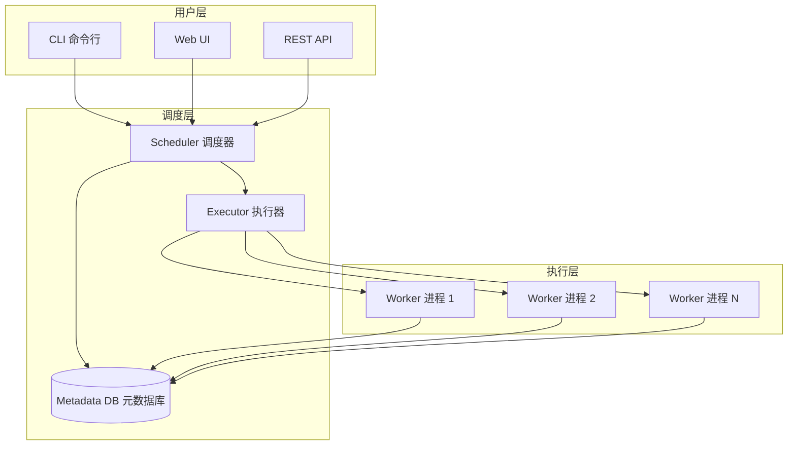
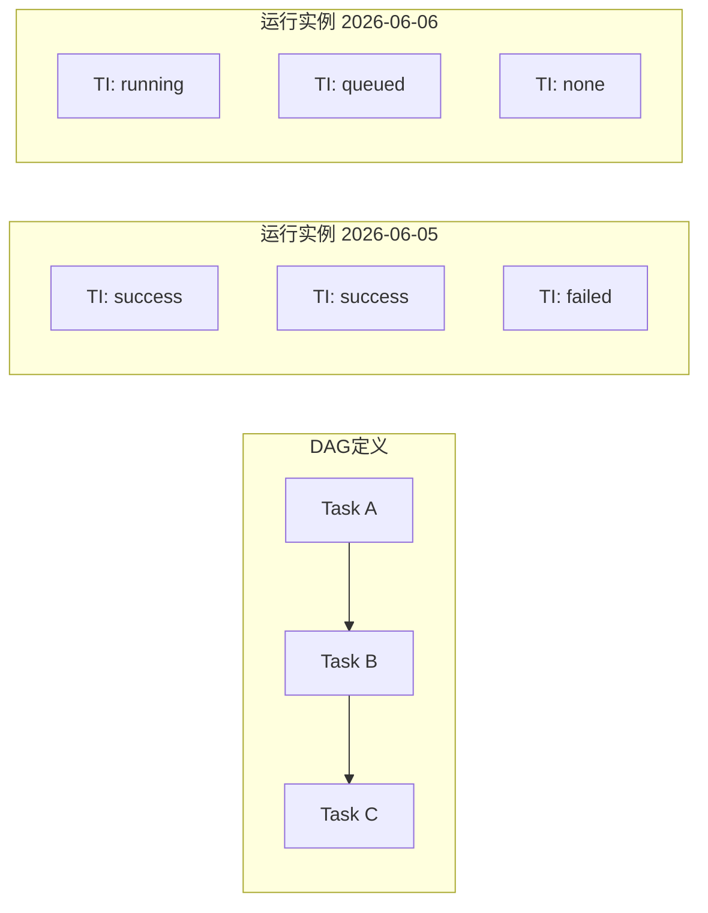
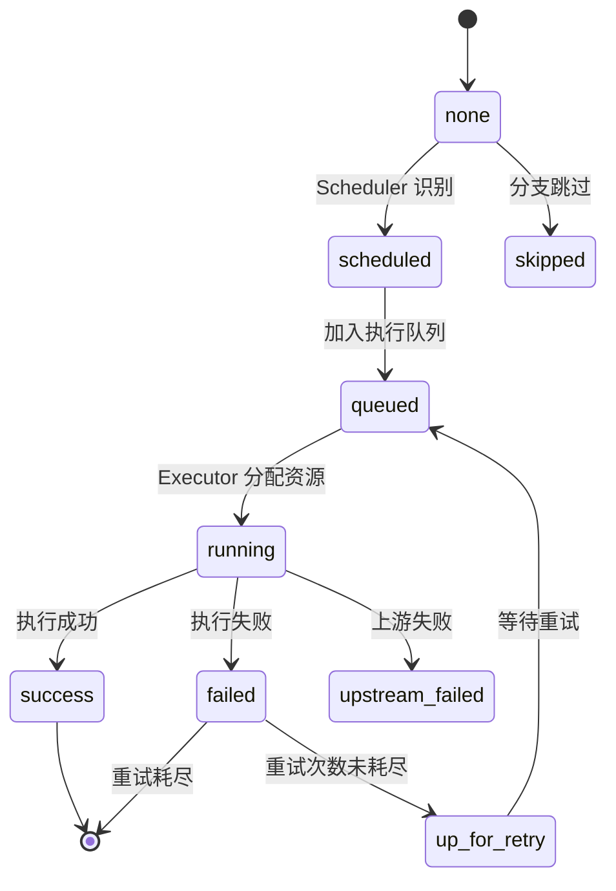
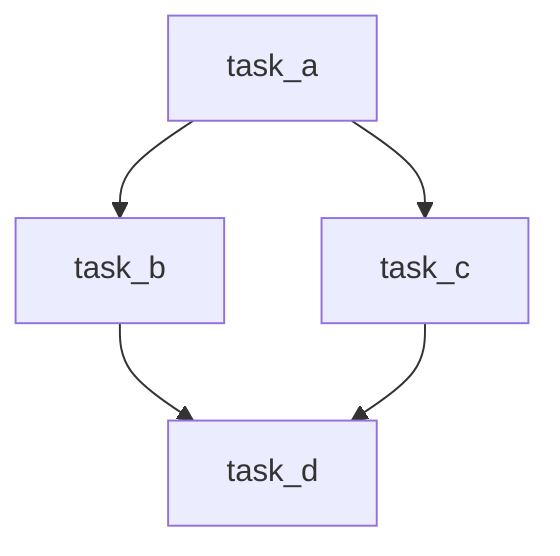
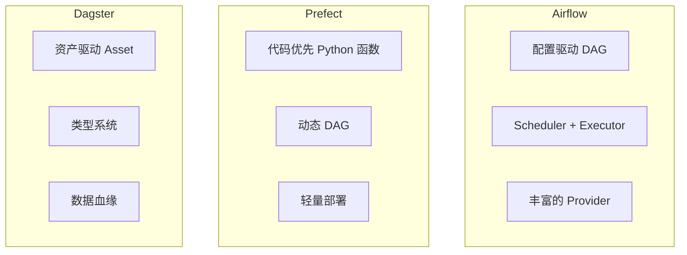

# Airflow 任务调度

Apache Airflow 是当前最主流的工作流编排平台，被 Airbnb、Netflix、Apple 等公司广泛使用。本文不重复官方 API 手册，而是聚焦于 **DAG 设计、任务调度策略和实战决策**。

> 阅读提示

- 如果你想了解 Airflow 核心概念，从 [Airflow 核心概念](#airflow-核心概念) 开始
- 如果你想快速上手 DAG 编写，跳到 [DAG 编写实战](#dag-编写实战)
- 如果你想看完整 ETL 流程，直接看 [场景一：数据 ETL DAG](#场景一数据-etl-dag)
- 如果你想对比调度框架，跳到 [Airflow vs Prefect vs Dagster 对比](#airflow-vs-prefect-vs-dagster-对比)
- 本文基于 **Apache Airflow 2.8+**（2.x 语法；截至 2026-09，Airflow 3.x 已发布，导入路径与部分参数有变化），Python 3.10+

## Airflow 核心概念

### 架构全景



Airflow 核心架构由三大组件构成：

| 组件 | 职责 | 说明 |
|------|------|------|
| **Scheduler** | 调度器 | 持续扫描 DAG 文件，解析任务依赖，将满足条件的任务实例交给 Executor 执行 |
| **Executor** | 执行器 | 决定任务在哪里运行：本地进程、Celery 集群、Kubernetes Pod 等 |
| **Metadata DB** | 元数据库 | 存储 DAG 状态、任务实例、变量、连接等元信息，通常使用 PostgreSQL |

::: tip Scheduler 是核心
Scheduler 是 Airflow 的心脏。它不断扫描 `dags/` 目录，解析 DAG 文件，检查调度条件，并将就绪的任务交给 Executor。如果 Scheduler 挂掉，整个调度将停止。
:::

### DAG（有向无环图）

DAG（Directed Acyclic Graph）是 Airflow 中工作流的定义单元，描述了任务之间的依赖关系和执行顺序：

```python
from datetime import datetime, timedelta
from airflow import DAG
from airflow.operators.python import PythonOperator

# DAG 定义
with DAG(
    dag_id="my_first_dag",
    default_args={
        "owner": "data_team",
        "retries": 2,
        "retry_delay": timedelta(minutes=5),
    },
    description="我的第一个 Airflow DAG",
    start_date=datetime(2026, 1, 1),
    schedule="0 8 * * *",  # 每天早上 8 点
    catchup=False,
    tags=["example", "tutorial"],
) as dag:
    # 任务定义（后续添加）
    pass
```

**DAG 关键参数**：

| 参数 | 类型 | 说明 | 示例 |
|------|------|------|------|
| `dag_id` | str | DAG 唯一标识符 | `"etl_daily"` |
| `schedule` | str/cron | 调度频率 | `"0 8 * * *"` |
| `start_date` | datetime | DAG 生效起始时间 | `datetime(2026, 1, 1)` |
| `catchup` | bool | 是否回填历史执行 | `False`（推荐） |
| `max_active_runs` | int | 最大并发运行数 | `1` |
| `tags` | list | 标签（用于过滤） | `["etl", "prod"]` |
| `default_args` | dict | 任务默认参数 | 重试、超时等 |

### Task 与 TaskInstance

- **Task**：DAG 中的节点，定义"做什么"
- **TaskInstance**：Task 的一次具体运行，包含状态、日志、开始/结束时间



**TaskInstance 状态机**：



### Operator（操作器）

Operator 是 Task 的实现方式，定义了任务的具体行为。Airflow 提供了丰富的内置 Operator：

| Operator 类别 | 代表 | 用途 |
|--------------|------|------|
| 动作类 | `PythonOperator`、`BashOperator` | 执行具体操作 |
| 传输类 | `S3ToRedshiftOperator`、`GCSToBigQueryOperator` | 数据搬移 |
| 感知类 | `S3KeySensor`、`SqlSensor` | 等待外部条件满足 |

```python
from airflow.operators.python import PythonOperator
from airflow.operators.bash import BashOperator
from airflow.operators.empty import EmptyOperator

# Python 函数任务
def process_data(**kwargs):
    print("处理数据...")

python_task = PythonOperator(
    task_id="process_data",
    python_callable=process_data,
)

# Shell 命令任务
bash_task = BashOperator(
    task_id="run_script",
    bash_command="python /scripts/etl.py {{ ds }}",
)

# 空操作（用作起点/终点）
start = EmptyOperator(task_id="start")
end = EmptyOperator(task_id="end")
```

### Sensor（传感器）

Sensor 是特殊的 Operator，用于等待某个条件满足后才继续执行：

```python
from airflow.sensors.filesystem import FileSensor
from airflow.sensors.python import PythonSensor
from airflow.providers.amazon.aws.sensors.s3 import S3KeySensor

# 等待文件出现
wait_for_file = FileSensor(
    task_id="wait_for_file",
    filepath="/data/input/sales_{{ ds }}.csv",
    poke_interval=60,        # 每 60 秒检查一次
    timeout=3600,            # 最多等 1 小时
    mode="poke",             # 或 "reschedule"（释放 worker）
)

# 等待 S3 文件
wait_for_s3 = S3KeySensor(
    task_id="wait_for_s3",
    bucket_key="s3://my-bucket/data/{{ ds }}/ready.flag",
    aws_conn_id="aws_default",
    poke_interval=120,
    mode="reschedule",       # 推荐模式，不占用 worker slot
)
```

::: warning Sensor 的 mode 参数
- `mode="poke"`：Sensor 占用 worker slot 持续检查，可能导致 worker 资源耗尽
- `mode="reschedule"`：每次检查后释放 worker slot，下次再重新调度。**生产环境强烈推荐**
:::

### XCom（跨任务通信）

XCom（Cross-Communication）允许 Task 之间传递小量数据：

```python
from airflow.operators.python import PythonOperator

def extract(**context):
    """提取数据，通过 XCom 传递结果"""
    data = {"count": 100, "date": "2026-06-06"}
    # 自动推送到 XCom（返回值会被自动推送）
    return data

def transform(**context):
    """从 XCom 拉取上游数据"""
    # 拉取指定 task 的 XCom
    upstream_data = context["ti"].xcom_pull(
        task_ids="extract",
        key="return_value",
    )
    count = upstream_data["count"]
    transformed = count * 2
    return {"transformed_count": transformed}

extract_task = PythonOperator(
    task_id="extract",
    python_callable=extract,
)

transform_task = PythonOperator(
    task_id="transform",
    python_callable=transform,
)

extract_task >> transform_task
```

::: danger XCom 限制
- **大小限制**：XCom 存储在元数据库中，没有固定的官方上限，但应仅传递小量数据；过大会拖慢调度并可能超出数据库字段限制
- **不适合大数据传输**：不要用 XCom 传递 DataFrame，应使用文件系统或对象存储
- **序列化**：仅支持 JSON 可序列化的对象（默认后端），或启用 Pickle 后端（`enable_xcom_pickling`）
:::

## DAG 编写实战

### PythonOperator

PythonOperator 是最常用的 Operator，用于执行 Python 函数：

```python
from datetime import datetime, timedelta
from airflow import DAG
from airflow.operators.python import PythonOperator
from airflow.operators.empty import EmptyOperator


def fetch_data(source: str, **context):
    """从指定数据源获取数据"""
    execution_date = context["ds"]  # 逻辑执行日期 YYYY-MM-DD
    print(f"从 {source} 获取 {execution_date} 的数据")
    # 模拟数据获取
    record_count = 1500
    return {"source": source, "count": record_count, "date": execution_date}


def validate_data(min_count: int = 0, **context):
    """数据质量校验"""
    upstream = context["ti"].xcom_pull(task_ids="fetch")
    count = upstream["count"]
    if count < min_count:
        raise ValueError(f"数据量不足: {count} < {min_count}")
    print(f"校验通过: 数据量 {count} >= {min_count}")
    return {"validated": True, "count": count}


def load_data(**context):
    """加载数据到目标存储"""
    upstream = context["ti"].xcom_pull(task_ids="validate")
    print(f"加载 {upstream['count']} 条数据到数据仓库")


with DAG(
    dag_id="python_operator_demo",
    start_date=datetime(2026, 1, 1),
    schedule="@daily",
    catchup=False,
    default_args={"owner": "data_team"},
) as dag:

    start = EmptyOperator(task_id="start")

    fetch = PythonOperator(
        task_id="fetch",
        python_callable=fetch_data,
        op_kwargs={"source": "mysql_prod"},  # 传入函数参数
    )

    validate = PythonOperator(
        task_id="validate",
        python_callable=validate_data,
        op_kwargs={"min_count": 100},  # 最小数据量阈值
    )

    load = PythonOperator(
        task_id="load",
        python_callable=load_data,
    )

    end = EmptyOperator(task_id="end")

    start >> fetch >> validate >> load >> end
```

### BashOperator

BashOperator 用于执行 Shell 命令或脚本：

```python
from airflow.operators.bash import BashOperator

# 执行简单命令
check_env = BashOperator(
    task_id="check_env",
    bash_command="echo '执行日期: {{ ds }}' && python --version",
)

# 执行脚本文件（注意末尾空格！）
run_etl = BashOperator(
    task_id="run_etl",
    bash_command="/opt/scripts/etl.sh {{ ds }} ",
    #                                    ^^^ 注意：脚本路径后必须有空格
)

# 带环境变量
run_with_env = BashOperator(
    task_id="run_with_env",
    bash_command="echo $MY_VAR",
    env={"MY_VAR": "production"},
    append_env=True,  # 追加而非覆盖当前环境变量
)
```

::: warning BashOperator 脚本路径陷阱
当 `bash_command` 指向脚本文件时，路径末尾**必须有一个空格**，否则 Airflow 会将其当作命令而非文件路径，导致 `FileNotFoundError`。这是官方已知行为。
:::

### BranchPythonOperator

BranchPythonOperator 实现条件分支，根据运行时逻辑决定执行哪条路径：

```python
from airflow.operators.python import BranchPythonOperator
from airflow.operators.empty import EmptyOperator


def decide_branch(**context):
    """根据执行日期决定走哪条分支"""
    execution_date = context["logical_date"]
    day_of_week = execution_date.weekday()  # 0=周一, 6=周日

    if day_of_week < 5:
        return "weekday_process"  # 返回 task_id
    else:
        return "weekend_process"


with DAG(
    dag_id="branch_demo",
    start_date=datetime(2026, 1, 1),
    schedule="@daily",
    catchup=False,
) as dag:

    start = EmptyOperator(task_id="start")

    branch = BranchPythonOperator(
        task_id="branch",
        python_callable=decide_branch,
    )

    weekday_process = PythonOperator(
        task_id="weekday_process",
        python_callable=lambda: print("工作日处理: 全量 ETL"),
    )

    weekend_process = PythonOperator(
        task_id="weekend_process",
        python_callable=lambda: print("周末处理: 增量汇总"),
    )

    # 关键：使用 trigger_rule 确保无论哪个分支执行，end 都能运行
    end = EmptyOperator(
        task_id="end",
        trigger_rule="none_failed_min_one_success",  # 至少一个上游成功
    )

    start >> branch >> [weekday_process, weekend_process] >> end
```

```mermaid
flowchart TD
    start[start] --> branch[branch 分支判断]
    branch -->|工作日| weekday[weekday_process 全量ETL]
    branch -->|周末| weekend[weekend_process 增量汇总]
    weekday --> end[end]
    weekend --> end[end]

```

::: tip trigger_rule 规则
`trigger_rule` 控制任务在什么条件下触发，默认是 `all_success`（所有上游成功）：

| 规则 | 含义 |
|------|------|
| `all_success` | 所有上游成功（默认） |
| `all_failed` | 所有上游失败 |
| `all_done` | 所有上游完成（不论成败） |
| `one_success` | 至少一个上游成功 |
| `none_failed_min_one_success` | 没有失败 + 至少一个成功（分支场景推荐） |
| `none_failed` | 没有失败（允许跳过） |
:::

## 任务依赖与调度

### 依赖关系

Airflow 支持多种依赖表达方式：

```python
# 方式一：位运算符（最常用）
task_a >> task_b >> task_c          # A → B → C

# 方式二：反向位运算符
task_c << task_b << task_a          # 同上，C ← B ← A

# 方式三：并行 + 汇合
task_a >> [task_b, task_c] >> task_d  # A → B,C → D

# 方式四：复杂依赖
(task_a >> task_c) & (task_b >> task_c)  # A → C, B → C

# 方式五：链式
from airflow.utils.task_group import TaskGroup

with TaskGroup(group_id="processing") as processing_group:
    step1 = PythonOperator(task_id="step1", ...)
    step2 = PythonOperator(task_id="step2", ...)
    step1 >> step2

start >> processing_group >> end
```



### cron 表达式与调度间隔

Airflow 的 `schedule` 参数支持 cron 表达式和预设别名：

**预设别名**：

| 别名 | cron 等价 | 含义 |
|------|----------|------|
| `@once` | — | 仅运行一次 |
| `@hourly` | `0 * * * *` | 每小时 |
| `@daily` | `0 0 * * *` | 每天零点 |
| `@weekly` | `0 0 * * 0` | 每周日零点 |
| `@monthly` | `0 0 1 * *` | 每月 1 日零点 |
| `@yearly` | `0 0 1 1 *` | 每年 1 月 1 日零点 |

**cron 表达式格式**：

```
┌───────── 分钟 (0-59)
│ ┌───────── 小时 (0-23)
│ │ ┌───────── 日 (1-31)
│ │ │ ┌───────── 月 (1-12)
│ │ │ │ ┌───────── 星期 (0-6, 0=周日)
│ │ │ │ │
* * * * *
```

**常用调度模式**：

```python
# 工作日早 8 点
schedule = "0 8 * * 1-5"

# 每 15 分钟
schedule = "*/15 * * * *"

# 每小时第 30 分钟
schedule = "30 * * * *"

# 每周一和周三早 9 点
schedule = "0 9 * * 1,3"

# 每月 1 日和 15 日凌晨 2 点
schedule = "0 2 1,15 * *"
```

::: warning schedule 的逻辑执行时间
Airflow 的 `schedule` 决定的是 **逻辑执行时间（logical_date）**，而非实际运行时间。例如 `schedule="0 8 * * *"` 表示逻辑日期为每天 8:00，但实际运行可能在 8:00 之后（取决于 Scheduler 的处理速度和队列情况）。
:::

### 重试策略

合理的重试策略是生产环境稳定运行的关键：

```python
from datetime import datetime, timedelta
from airflow import DAG

default_args = {
    "owner": "data_team",
    "depends_on_past": False,          # 不依赖上一次执行
    "retries": 3,                       # 失败后重试 3 次
    "retry_delay": timedelta(minutes=5), # 每次重试间隔 5 分钟
    "retry_exponential_backoff": True,   # 指数退避
    "max_retry_delay": timedelta(hours=1), # 最大重试间隔
    "execution_timeout": timedelta(hours=2), # 单次执行超时
    "on_failure_callback": notify_failure,   # 失败回调
    "on_retry_callback": notify_retry,       # 重试回调
    "email_on_failure": True,            # 失败时发邮件
    "email": ["data-team@company.com"],
}

with DAG(
    dag_id="retry_demo",
    default_args=default_args,
    start_date=datetime(2026, 1, 1),
    schedule="@daily",
    catchup=False,
) as dag:
    # DAG 任务定义
    pass
```

**指数退避重试时间计算**：

```python
# retry_delay=5min, max_retry_delay=60min
# 第 1 次重试: 5 分钟后
# 第 2 次重试: 10 分钟后 (5 * 2)
# 第 3 次重试: 20 分钟后 (5 * 2^2)
# 第 4 次重试: 40 分钟后 (5 * 2^3)
# 第 5 次重试: 60 分钟后 (被 max_retry_delay 截断)
```

| 参数 | 推荐值 | 说明 |
|------|--------|------|
| `retries` | 2-3 | 数据管道推荐 3 次，幂等任务可更多 |
| `retry_delay` | 3-5 分钟 | 根据故障恢复时间调整 |
| `retry_exponential_backoff` | `True` | 避免雪崩式重试 |
| `max_retry_delay` | 30-60 分钟 | 防止等待过长 |
| `execution_timeout` | 根据任务设定 | 防止任务挂死 |

## Airflow vs Prefect vs Dagster 对比



| 对比维度 | Airflow | Prefect | Dagster |
|---------|---------|---------|---------|
| **核心理念** | 配置驱动，DAG 即配置 | 代码优先，Python 函数即任务 | 资产驱动，数据即一等公民 |
| **定义方式** | DAG 上下文管理器 + Operator | `@flow` / `@task` 装饰器 | `@asset` / `@op` 装饰器 |
| **动态 DAG** | 困难（静态解析） | 原生支持 | 支持 |
| **调度器** | Scheduler（独立进程） | Agent（轻量） | Daemon |
| **执行器** | Celery / K8s / Local | Dask / K8s / Local | K8s / Celery / Local |
| **UI 能力** | 成熟丰富 | 简洁现代 | 强（数据血缘可视化） |
| **数据血缘** | 手动配置 | 基础支持 | 原生核心特性 |
| **学习曲线** | 陡峭 | 平缓 | 中等 |
| **社区生态** | 最成熟（2015+） | 快速增长（2018+） | 稳步增长（2019+） |
| **Provider / 集成数量** | 90+ Provider 包（900+ 集成） | 100+ 集成 | 100+ 集成 |
| **适用场景** | 复杂企业级调度 | 中小团队、快速迭代 | 数据平台、数据治理 |
| **部署复杂度** | 高（多组件） | 低（单进程起步） | 中等 |
| **状态管理** | 元数据库（强一致） | 后端 API | 元数据库 |
| **成本** | 高（需维护 Scheduler） | 低（Cloud 免费额度） | 中等 |

**选择建议**：

- **Airflow**：已有成熟运维体系、需要大量第三方集成、团队有 Airflow 经验
- **Prefect**：中小团队、快速原型、Python 原生偏好、不想运维复杂基础设施
- **Dagster**：数据平台建设、需要数据血缘和治理、数据质量是核心关注点

### 代码对比：同一 ETL 流程

```python
# ========== Airflow ==========
from airflow import DAG
from airflow.operators.python import PythonOperator
from datetime import datetime

def extract(): ...
def transform(): ...
def load(): ...

with DAG("etl", start_date=datetime(2026,1,1), schedule="@daily") as dag:
    t1 = PythonOperator(task_id="extract", python_callable=extract)
    t2 = PythonOperator(task_id="transform", python_callable=transform)
    t3 = PythonOperator(task_id="load", python_callable=load)
    t1 >> t2 >> t3

# ========== Prefect ==========
from prefect import flow, task

@task
def extract(): ...
@task
def transform(): ...
@task
def load(): ...

@flow
def etl():
    raw = extract()
    processed = transform(raw)
    load(processed)

# ========== Dagster ==========
from dagster import asset

@asset
def raw_data(): ...

@asset
def processed_data(raw_data): ...

@asset
def loaded_data(processed_data): ...
```

## 实战场景

### 场景一：数据 ETL DAG

一个完整的 ETL 流程，包含提取、转换、加载和错误处理：

```python
"""
数据 ETL DAG — 从 API 提取数据，清洗转换后加载到数据仓库
"""
from datetime import datetime, timedelta
import json
import logging

import requests
import pandas as pd

from airflow import DAG
from airflow.operators.python import PythonOperator
from airflow.operators.empty import EmptyOperator
from airflow.operators.bash import BashOperator
# SlackNotifier 由 apache-airflow-providers-slack 提供（截至 2026-09 官方导入路径）
from airflow.providers.slack.notifications.slack import SlackNotifier


logger = logging.getLogger(__name__)

# ============ 配置 ============
API_URL = "https://api.example.com/orders"
DATA_DIR = "/tmp/etl_data"
MIN_RECORDS = 50

default_args = {
    "owner": "data_team",
    "retries": 3,
    "retry_delay": timedelta(minutes=5),
    "retry_exponential_backoff": True,
    "max_retry_delay": timedelta(minutes=30),
    "execution_timeout": timedelta(hours=1),
}


# ============ 提取 ============
def extract_orders(**context):
    """从 API 提取订单数据"""
    ds = context["ds"]  # 逻辑执行日期

    logger.info(f"开始提取 {ds} 的订单数据")
    response = requests.get(
        API_URL,
        params={"date": ds},
        timeout=30,
    )
    response.raise_for_status()

    orders = response.json()
    record_count = len(orders)

    # 数据量校验
    if record_count < MIN_RECORDS:
        raise ValueError(
            f"数据量异常: 获取 {record_count} 条, 期望至少 {MIN_RECORDS} 条"
        )

    # 保存原始数据到本地
    raw_path = f"{DATA_DIR}/orders_raw_{ds}.json"
    with open(raw_path, "w") as f:
        json.dump(orders, f)

    logger.info(f"提取完成: {record_count} 条数据 → {raw_path}")

    # 通过 XCom 传递元信息
    return {"raw_path": raw_path, "record_count": record_count, "date": ds}


# ============ 转换 ============
def transform_orders(**context):
    """清洗和转换订单数据"""
    ds = context["ds"]
    upstream = context["ti"].xcom_pull(task_ids="extract")

    raw_path = upstream["raw_path"]

    # 读取原始数据
    with open(raw_path) as f:
        orders = json.load(f)

    df = pd.DataFrame(orders)

    # 1. 列名标准化
    df.columns = df.columns.str.strip().str.lower().str.replace(" ", "_")

    # 2. 去重
    before = len(df)
    df = df.drop_duplicates(subset=["order_id"])
    logger.info(f"去重: {before} → {len(df)} 行")

    # 3. 处理缺失值
    df["customer_id"] = df["customer_id"].fillna("UNKNOWN")
    df["amount"] = df["amount"].fillna(0)

    # 4. 数据类型转换
    df["order_date"] = pd.to_datetime(df["order_date"], errors="coerce")
    df["amount"] = pd.to_numeric(df["amount"], errors="coerce")

    # 5. 业务规则过滤
    df = df[df["amount"] > 0]
    df = df[df["order_date"].notna()]

    # 6. 新增计算列
    df["amount_cny"] = df["amount"] * 7.2  # USD → CNY
    df["order_month"] = df["order_date"].dt.to_period("M").astype(str)

    # 保存转换后数据
    clean_path = f"{DATA_DIR}/orders_clean_{ds}.parquet"
    df.to_parquet(clean_path, index=False)

    logger.info(f"转换完成: {len(df)} 条数据 → {clean_path}")
    return {"clean_path": clean_path, "record_count": len(df)}


# ============ 质量校验 ============
def quality_check(**context):
    """数据质量校验"""
    upstream = context["ti"].xcom_pull(task_ids="transform")
    clean_path = upstream["clean_path"]

    df = pd.read_parquet(clean_path)

    checks = []

    # 校验 1: 无空值
    null_counts = df.isnull().sum()
    critical_nulls = null_counts[null_counts > 0]
    checks.append(("无空值", len(critical_nulls) == 0, str(critical_nulls.to_dict())))

    # 校验 2: 金额非负
    has_negative = (df["amount"] < 0).any()
    checks.append(("金额非负", not has_negative, f"负数记录数: {(df['amount'] < 0).sum()}"))

    # 校验 3: 日期范围合理
    date_min = df["order_date"].min()
    date_max = df["order_date"].max()
    date_ok = (date_max - date_min).days <= 365
    checks.append(("日期范围", date_ok, f"{date_min} ~ {date_max}"))

    # 汇总结果
    all_passed = all(check[1] for check in checks)
    for name, passed, detail in checks:
        status = "PASS" if passed else "FAIL"
        logger.info(f"  [{status}] {name}: {detail}")

    if not all_passed:
        raise ValueError("数据质量校验未通过，请检查日志")

    logger.info("数据质量校验全部通过")
    return {"quality_passed": True, "checks": len(checks)}


# ============ 加载 ============
def load_to_warehouse(**context):
    """加载数据到数据仓库"""
    ds = context["ds"]
    upstream = context["ti"].xcom_pull(task_ids="transform")

    clean_path = upstream["clean_path"]
    df = pd.read_parquet(clean_path)

    # 模拟加载到数据仓库（实际使用 BigQueryOperator / SnowflakeOperator）
    logger.info(f"加载 {len(df)} 条数据到数据仓库 (日期: {ds})")

    # 实际项目中:
    # df.to_sql("orders", con=engine, if_exists="append", index=False)
    # 或使用 Airflow Provider:
    # BigQueryInsertJobOperator(...)
    # SnowflakeOperator(...)

    logger.info("加载完成")
    return {"loaded_records": len(df)}


# ============ DAG 定义 ============
with DAG(
    dag_id="etl_orders",
    default_args=default_args,
    description="订单数据 ETL 管道：提取 → 转换 → 校验 → 加载",
    start_date=datetime(2026, 1, 1),
    schedule="0 6 * * *",  # 每天早上 6 点
    catchup=False,
    max_active_runs=1,
    tags=["etl", "orders", "production"],
) as dag:

    start = EmptyOperator(task_id="start")

    extract = PythonOperator(
        task_id="extract",
        python_callable=extract_orders,
    )

    transform = PythonOperator(
        task_id="transform",
        python_callable=transform_orders,
    )

    validate = PythonOperator(
        task_id="quality_check",
        python_callable=quality_check,
    )

    load = PythonOperator(
        task_id="load",
        python_callable=load_to_warehouse,
    )

    # 清理临时文件
    cleanup = BashOperator(
        task_id="cleanup",
        bash_command=f"rm -f {DATA_DIR}/orders_*_{{{{ ds }}}}.json {DATA_DIR}/orders_*_{{{{ ds }}}}.parquet",
        trigger_rule="all_done",  # 无论成败都清理
    )

    end = EmptyOperator(
        task_id="end",
        trigger_rule="none_failed_min_one_success",
    )

    # 依赖关系
    start >> extract >> transform >> validate >> load >> end
    [extract, transform, validate, load] >> cleanup
```

```mermaid
flowchart TD
    start[start] --> extract[extract 提取API数据]
    extract --> transform[transform 清洗转换]
    transform --> validate[quality_check 质量校验]
    validate --> load[load 加载到仓库]
    load --> end[end]

    extract -.-> cleanup[cleanup 清理临时文件]
    transform -.-> cleanup
    validate -.-> cleanup
    load -.-> cleanup

```

### 场景二：定时报告生成 DAG

条件分支 + 邮件通知的定时报告生成流程：

```python
"""
定时报告生成 DAG — 根据日期类型选择报告模板，生成后发送邮件通知
"""
from datetime import datetime, timedelta
import smtplib
from email.mime.text import MIMEText
from email.mime.multipart import MIMEMultipart

from airflow import DAG
from airflow.operators.python import PythonOperator, BranchPythonOperator
from airflow.operators.empty import EmptyOperator
from airflow.providers.smtp.operators.smtp import EmailOperator


# ============ 辅助函数 ============
def get_report_type(**context):
    """判断报告类型：日报 / 周报 / 月报"""
    logical_date = context["logical_date"]
    day = logical_date.day
    weekday = logical_date.weekday()

    if day == 1:
        return "generate_monthly_report"  # 每月 1 日生成月报
    elif weekday == 4:  # 周五
        return "generate_weekly_report"   # 周五生成周报
    else:
        return "generate_daily_report"    # 其余生成日报


# ============ 报告生成 ============
def generate_daily_report(**context):
    """生成日报"""
    ds = context["ds"]
    print(f"生成日报: {ds}")
    # 实际项目中：查询数据库，生成图表，导出 PDF/HTML
    report_path = f"/reports/daily_{ds}.html"
    return {"report_type": "daily", "report_path": report_path}


def generate_weekly_report(**context):
    """生成周报"""
    ds = context["ds"]
    print(f"生成周报: {ds}")
    report_path = f"/reports/weekly_{ds}.html"
    return {"report_type": "weekly", "report_path": report_path}


def generate_monthly_report(**context):
    """生成月报"""
    ds = context["ds"]
    print(f"生成月报: {ds}")
    report_path = f"/reports/monthly_{ds}.html"
    return {"report_type": "monthly", "report_path": report_path}


# ============ 通知 ============
def send_notification(**context):
    """发送通知邮件"""
    # 从分支任务的 XCom 获取报告信息
    branch_task = context["ti"].xcom_pull(task_ids="decide_report_type")

    # 拉取对应报告任务的输出
    report_info = context["ti"].xcom_pull(task_ids=branch_task)
    report_type = report_info["report_type"]
    report_path = report_info["report_path"]

    print(f"发送 {report_type} 通知: {report_path}")

    # 实际项目中使用 EmailOperator 或 SlackNotifier
    # 此处仅打印日志


# ============ DAG 定义 ============
with DAG(
    dag_id="report_generation",
    description="定时报告生成：日报 / 周报 / 月报",
    start_date=datetime(2026, 1, 1),
    schedule="0 9 * * *",  # 每天早上 9 点
    catchup=False,
    default_args={
        "owner": "bi_team",
        "retries": 2,
        "retry_delay": timedelta(minutes=3),
    },
    tags=["report", "notification"],
) as dag:

    start = EmptyOperator(task_id="start")

    # 分支判断
    decide = BranchPythonOperator(
        task_id="decide_report_type",
        python_callable=get_report_type,
    )

    # 三种报告生成
    daily = PythonOperator(
        task_id="generate_daily_report",
        python_callable=generate_daily_report,
    )

    weekly = PythonOperator(
        task_id="generate_weekly_report",
        python_callable=generate_weekly_report,
    )

    monthly = PythonOperator(
        task_id="generate_monthly_report",
        python_callable=generate_monthly_report,
    )

    # 发送通知（无论哪个分支都执行）
    notify = PythonOperator(
        task_id="send_notification",
        python_callable=send_notification,
        trigger_rule="none_failed_min_one_success",
    )

    end = EmptyOperator(
        task_id="end",
        trigger_rule="none_failed_min_one_success",
    )

    # 依赖关系
    start >> decide >> [daily, weekly, monthly] >> notify >> end
```

```mermaid
flowchart TD
    start[start] --> decide{decide_report_type}
    decide -->|每天| daily[generate_daily_report]
    decide -->|每周五| weekly[generate_weekly_report]
    decide -->|每月1日| monthly[generate_monthly_report]
    daily --> notify[send_notification]
    weekly --> notify
    monthly --> notify
    notify --> end[end]

```

## 常见陷阱

| 陷阱 | 现象 | 原因 | 解决方案 |
|------|------|------|----------|
| catchup=True 导致回填风暴 | DAG 启动后产生大量历史 DAG Run | `start_date` 设为很久以前且 `catchup=True` | 生产环境设 `catchup=False`，需要回填时用 `airflow dags backfill` |
| XCom 传递大数据 | 任务失败或 OOM | XCom 存储在元数据库，大数据会拖慢调度并可能超出数据库限制 | 大数据通过文件系统/S3 传递路径，XCom 仅传元信息 |
| Sensor 占满 Worker | Worker 资源耗尽，新任务排队 | `mode="poke"` 持续占用 Worker Slot | 使用 `mode="reschedule"`，或在 DAG 级别设置 `pool` |
| BashOperator 脚本路径无空格 | `FileNotFoundError` | 脚本路径末尾缺少空格被当作命令 | `bash_command="/path/to/script.sh "` 路径后加空格 |
| 动态 DAG 拓扑 | Scheduler 解析缓慢或 OOM | 在 DAG 文件顶层用循环/条件创建大量 Task | 保持 DAG 文件轻量，用 TaskGroup 组织，避免顶层重 IO |
| depends_on_past=True | 任务永远不执行 | 首次运行无 past，任务卡在等待状态 | 首次运行后手动标记 success，或设为 `False` |
| 时区混乱 | 任务在错误时间执行 | `start_date` 和 `schedule` 时区不一致 | 统一使用 UTC，显示时转换时区 |
| 忘记设置 execution_timeout | 任务挂死占用资源 | 网络请求/数据库查询无超时 | 为所有任务设置 `execution_timeout` |
| 变量硬编码 | 环境切换时需改代码 | 连接信息、路径写死在 DAG 中 | 使用 Airflow Variable 和 Connection |
| 重试无指数退避 | 故障恢复时雪崩 | 固定间隔重试导致同时涌入 | 设置 `retry_exponential_backoff=True` |

### 陷阱详解：catchup 回填风暴

```python
# ❌ 反面：start_date 在一年前 + catchup=True
with DAG(
    dag_id="bad_catchup",
    start_date=datetime(2025, 1, 1),  # 一年前
    schedule="@daily",
    catchup=True,  # 将创建 365+ 个 DAG Run！
) as dag:
    pass

# ✅ 正面：关闭 catchup，按需回填
with DAG(
    dag_id="good_catchup",
    start_date=datetime(2025, 1, 1),
    schedule="@daily",
    catchup=False,  # 只创建当前及之后的 DAG Run
) as dag:
    pass

# 需要回填时，手动执行：
# airflow dags backfill --start-date 2025-01-01 --end-date 2025-06-01 good_catchup
```

### 陷阱详解：XCom 传递大数据

```python
# ❌ 反面：通过 XCom 传递整个 DataFrame
def extract(**context):
    df = pd.read_csv("huge_file.csv")  # 10MB+
    return df  # XCom 无法存储！

# ✅ 正面：通过文件系统传递，XCom 仅传路径
def extract(**context):
    df = pd.read_csv("huge_file.csv")
    output_path = f"/data/processed/{context['ds']}.parquet"
    df.to_parquet(output_path)
    return {"path": output_path, "rows": len(df)}  # XCom 只传元信息

def load(**context):
    upstream = context["ti"].xcom_pull(task_ids="extract")
    df = pd.read_parquet(upstream["path"])  # 从文件读取
    # ... 加载到数据仓库
```

## 最佳实践速查表

| 场景 | 推荐做法 | 避免 |
|------|---------|------|
| DAG 命名 | `<团队>_<业务>_<频率>`，如 `etl_orders_daily` | 随意命名，难以搜索 |
| catchup | 生产环境 `catchup=False` | 默认 `True` 导致回填风暴 |
| 重试策略 | 3 次重试 + 指数退避 | 无重试或固定间隔重试 |
| Sensor 模式 | `mode="reschedule"` | `mode="poke"` 占满 Worker |
| 大数据传递 | 文件系统/S3 传路径 | XCom 传 DataFrame |
| 超时设置 | 所有任务设 `execution_timeout` | 依赖默认无限超时 |
| 环境配置 | Airflow Variable + Connection | 硬编码连接信息 |
| DAG 文件 | 轻量、无顶层 IO、快速解析 | 顶层网络请求或重计算 |
| 依赖表达 | `>>` 和 `<<` 运算符 | 手动设置 `upstream/downstream` |
| 任务粒度 | 单一职责，一个任务做一件事 | 一个任务做所有事情 |
| 日志记录 | `logging.getLogger(__name__)` | `print()` |
| 幂等性 | 任务可安全重复执行 | 依赖副作用，重复执行出问题 |
| Pool 配置 | 限制并发 `pool="limited_pool"` | 所有任务用 default pool |
| 标签分类 | `tags=["etl", "prod"]` | 不设标签，难以过滤 |
| 触发规则 | 分支场景用 `none_failed_min_one_success` | 默认 `all_success` 导致跳过 |

## 术语表

| 术语 | 英文 | 定义 |
|------|------|------|
| DAG | Directed Acyclic Graph | 有向无环图，Airflow 中工作流的定义单元 |
| Task | Task | DAG 中的节点，定义一个具体操作 |
| TaskInstance | Task Instance | Task 的一次具体执行实例 |
| Operator | Operator | Task 的实现类，封装了具体操作逻辑 |
| Sensor | Sensor | 特殊 Operator，持续检查直到条件满足 |
| XCom | Cross-Communication | 任务间通信机制，支持小量数据传递 |
| Scheduler | Scheduler | 调度器，负责扫描 DAG 并调度任务执行 |
| Executor | Executor | 执行器，决定任务运行的位置和方式 |
| DAG Run | DAG Run | DAG 的一次完整执行 |
| logical_date | Logical Date | 逻辑执行日期，表示数据应处理的时间段 |
| catchup | Catchup | 是否自动补填 start_date 到当前之间的历史执行 |
| trigger_rule | Trigger Rule | 任务触发规则，决定上游满足什么条件时触发 |
| Pool | Pool | 资源池，限制同时运行的任务数量 |
| Provider | Provider | Airflow 插件包，提供特定平台的 Operator 和 Hook |
| Connection | Connection | 存储在元数据库中的连接信息（主机、端口、凭证） |
| Variable | Variable | 存储在元数据库中的键值对配置 |
| 幂等性 | Idempotency | 同一操作多次执行产生相同结果 |
| 指数退避 | Exponential Backoff | 重试间隔按指数增长，避免雪崩式重试 |
| TaskGroup | Task Group | UI 中的任务分组，简化可视化 |
| Hook | Hook | 与外部系统交互的接口，通常被 Operator 内部调用 |

## 延伸阅读

### 官方文档

- [Apache Airflow 官方文档](https://airflow.apache.org/docs/)
- [Airflow 核心概念](https://airflow.apache.org/docs/apache-airflow/stable/core-concepts/index.html)
- [Airflow Operator 参考](https://airflow.apache.org/docs/apache-airflow/stable/operator-ref.html)
- [Airflow Provider 列表](https://airflow.apache.org/docs/)
- [Airflow 最佳实践](https://airflow.apache.org/docs/apache-airflow/stable/best-practices.html)

### 推荐阅读

- 《数据工程之道》— 深入理解数据管道设计
- [Airflow 官方教程](https://airflow.apache.org/docs/apache-airflow/stable/tutorial/) — 入门第一步
- [Prefect 官方文档](https://docs.prefect.io/) — 下一代工作流编排
- [Dagster 官方文档](https://docs.dagster.io/) — 资产驱动数据编排
- 本站：[数据清洗管道实战](01-数据清洗管道实战) — ETL 的上游数据清洗
- 本站：[数据质量与校验](03-数据质量与校验) — ETL 中的质量保障
- 本站：[完整 ETL 实战](04-完整ETL实战) — 端到端 ETL 管道
- 本站：[异步编程](../../09-进阶核心/02-异步编程/01-asyncio基础) — 高性能数据管道的基础

## 版本差异（数据科学栈 → 当前版本）

| 库 | 本文编写时 | 当前稳定版 | 升级要点 |
|----|-----------|-----------|---------|
| Python | 3.8-3.12 | 3.14 | 3.12+ 起性能显著提升；3.14 PEP 649/750 |
| NumPy | 1.x/2.0 | 2.5.x | `np.float_` 等别名移除；NEP 50 类型提升 |
| Pandas | 1.x/2.x | 3.0.x | Copy-on-Write 默认开启；`inplace` 行为变化；字符串 dtype 变化 |
| Matplotlib | 3.x | 3.x 稳定版 | API 兼容，样式更新 |
| Seaborn | 0.12/0.13 | 0.13.x | API 稳定 |
| scikit-learn | 1.x | 1.9.x | API 稳定，新算法持续加入 |

> 本文讲解的数据分析流程（读取→清洗→分析→可视化）与核心 API 在最新版本中成立；升级时重点关注 Pandas 3.0 的 Copy-on-Write 与 NumPy 2.x 的类型变化。
