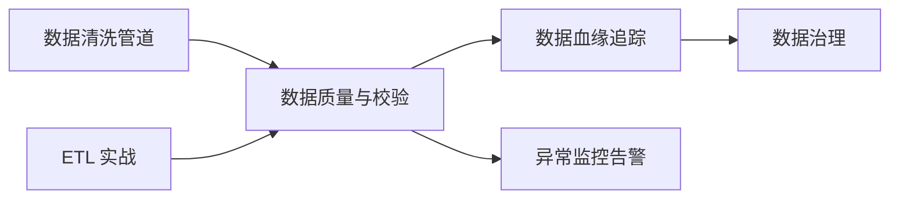
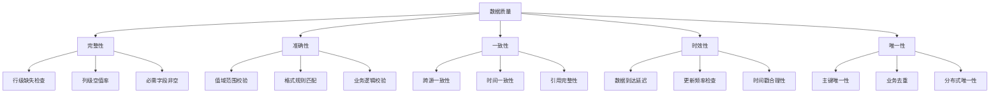
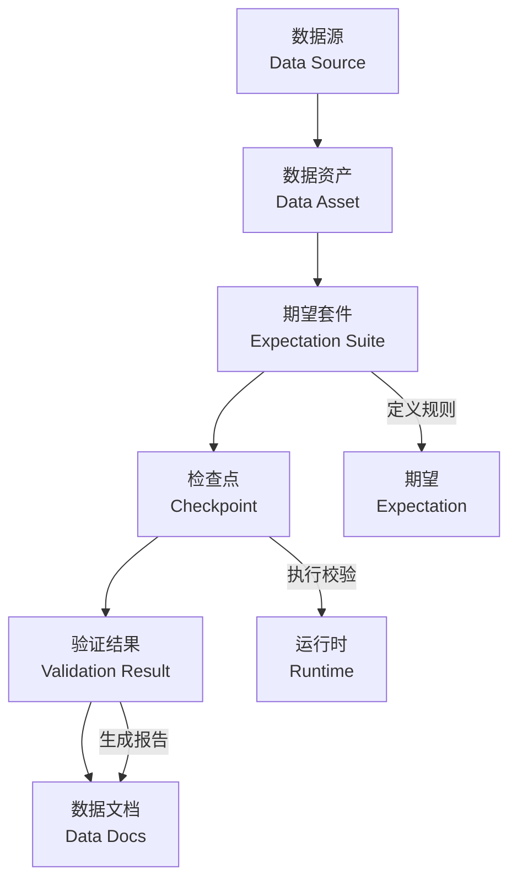
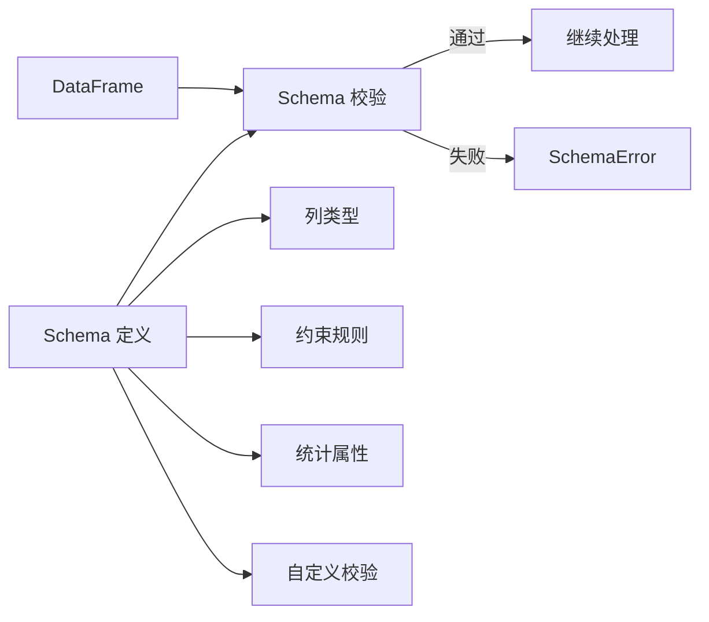
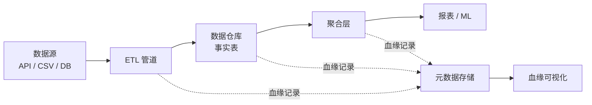
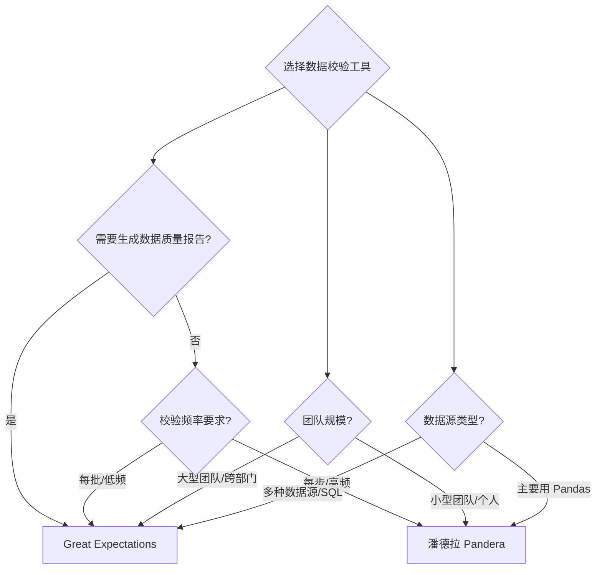
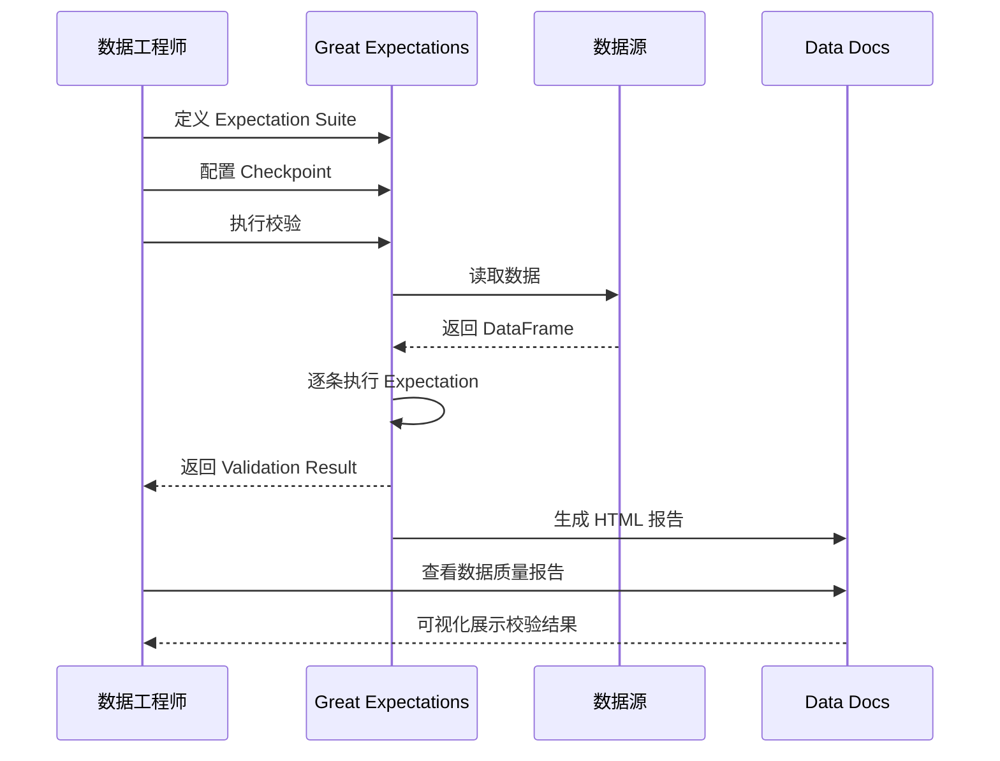

# 数据质量与校验

## 概述

### 是什么

数据质量与校验是指通过系统化的规则、工具和流程，确保数据在采集、转换、存储和使用的全生命周期中满足预期的完整性、准确性、一致性和时效性要求。它不是单一的检查步骤，而是一套贯穿数据管道的防御性工程实践。

### 为什么

“垃圾进，垃圾出”（Garbage In, Garbage Out）是数据工程中最残酷的定律。一次上游字段类型变更没有被感知，就可能导致整个下游报表计算错误；一个空值比例的悄然攀升，就可能导致机器学习模型输出荒谬的预测。数据质量问题的修复成本随发现时间呈指数增长——在数据入口处发现只需 1 分钟，到了业务决策层可能已经造成不可逆的损失。建立数据校验体系，意味着你能在数据出问题的第一时间捕获并阻断，而非等到业务方投诉。

### 怎么做

本文将从数据质量的五个核心维度出发，深入讲解 Great Expectations 和 Pandera 两大主流校验框架的实战用法，介绍数据血缘追踪的概念与方法，并通过对比分析和实战场景帮助你选择合适的技术方案。

### 知识定位



::: info 阅读建议
本文假设你已熟悉 Pandas DataFrame 的基本操作和 ETL 管道的基本概念。如果对 Mermaid 图中的前置节点不熟悉，建议先阅读 [数据清洗管道实战](01-数据清洗管道实战) 再进入正文。
:::

## 数据质量维度

数据质量不是单一指标，而是由多个维度共同定义的。理解这些维度是设计校验规则的基础。

### 五大核心维度

1. **完整性（Completeness）**：数据是否存在缺失。包括行级缺失（记录丢失）和列级缺失（字段为空）。
2. **准确性（Accuracy）**：数据值是否反映真实世界。例如年龄不能为负数，邮编必须符合格式。
3. **一致性（Consistency）**：同一事实在不同数据源或不同时间点是否一致。例如订单表的总金额与明细表的汇总金额是否匹配。
4. **时效性（Timeliness）**：数据是否在预期的时间窗口内到达并可用。例如每日凌晨的增量数据是否在早上 8 点前完成加载。
5. **唯一性（Uniqueness）**：数据中不应存在重复记录。例如用户 ID 不应出现重复。



### 维度详解与校验方法

#### 完整性

完整性是最基础的质量维度。缺失数据不仅直接影响分析结果，还可能引发下游处理的异常。

```python
# Python 3.10+
import pandas as pd
import numpy as np

# 模拟一份数据
df = pd.DataFrame({
    "user_id": [1, 2, 3, 4, 5],
    "name": ["Alice", "Bob", None, "Diana", "Eve"],
    "age": [25, np.nan, 30, -1, 28],
    "email": ["a@x.com", "b@x.com", "c@x.com", None, "e@x.com"],
})

# 检查每列的空值率
null_ratio = df.isnull().mean()
print("=== 各列空值率 ===")
print(null_ratio)
# user_id    0.0
# name       0.2
# age        0.2
# email      0.2

# 检查必需字段是否完整
required_columns = ["user_id", "name", "email"]
for col in required_columns:
    null_count = df[col].isnull().sum()
    if null_count > 0:
        print(f"[完整性告警] 必需字段 '{col}' 存在 {null_count} 个空值")
```

#### 准确性

准确性校验确保数据值落在合理的范围内，并且符合业务规则。

```python
# Python 3.10+
import re

# 值域范围校验
age_invalid = df[(df["age"] < 0) | (df["age"] > 150)]
if not age_invalid.empty:
    print(f"[准确性告警] 发现 {len(age_invalid)} 条年龄异常记录:")
    print(age_invalid[["user_id", "age"]])

# 格式规则校验
email_pattern = r"^[a-zA-Z0-9_.+-]+@[a-zA-Z0-9-]+\.[a-zA-Z0-9-.]+$"
invalid_emails = df[
    df["email"].notna() & ~df["email"].str.match(email_pattern)
]
if not invalid_emails.empty:
    print(f"[准确性告警] 发现 {len(invalid_emails)} 条邮箱格式异常记录")

# 业务逻辑校验：订单金额应 >= 0
orders = pd.DataFrame({
    "order_id": [101, 102, 103],
    "amount": [99.9, -5.0, 200.0],
})
negative_orders = orders[orders["amount"] < 0]
if not negative_orders.empty:
    print(f"[准确性告警] 发现 {len(negative_orders)} 条负金额订单")
```

#### 一致性

一致性校验通常需要跨表或跨系统比对，是最复杂也最容易被忽略的维度。

```python
# Python 3.10+
# 订单汇总表
order_summary = pd.DataFrame({
    "order_id": [1, 2, 3],
    "total_amount": [100.0, 200.0, 300.0],
})

# 订单明细表
order_details = pd.DataFrame({
    "order_id": [1, 1, 2, 2, 3, 3],
    "item_amount": [60.0, 40.0, 150.0, 50.0, 300.0, 10.0],  # order_id=3 不一致
})

# 跨表一致性校验
detail_sum = order_details.groupby("order_id")["item_amount"].sum().reset_index()
detail_sum.columns = ["order_id", "detail_total"]

merged = order_summary.merge(detail_sum, on="order_id")
inconsistent = merged[~np.isclose(merged["total_amount"], merged["detail_total"])]
if not inconsistent.empty:
    print("[一致性告警] 汇总金额与明细不一致:")
    print(inconsistent)
```

#### 时效性

时效性关注数据是否按时到达和更新，常用于监控数据管道的 SLA。

```python
# Python 3.10+
from datetime import datetime, timedelta

# 检查数据是否在 SLA 时间窗口内到达
data_loaded_at = datetime(2026, 6, 6, 9, 30, 0)  # 实际加载完成时间
sla_deadline = datetime(2026, 6, 6, 8, 0, 0)      # SLA 要求时间

if data_loaded_at > sla_deadline:
    delay = data_loaded_at - sla_deadline
    print(f"[时效性告警] 数据加载延迟 {delay}，超出 SLA 要求")

# 检查数据时间戳是否合理（不应是未来时间）
df_with_ts = pd.DataFrame({
    "event_id": [1, 2, 3],
    "event_time": [
        datetime(2026, 6, 5, 10, 0),
        datetime(2026, 6, 6, 14, 0),
        datetime(2026, 12, 31, 0, 0),  # 未来时间，异常
    ],
})

now = datetime.now()
future_events = df_with_ts[df_with_ts["event_time"] > now]
if not future_events.empty:
    print(f"[时效性告警] 发现 {len(future_events)} 条未来时间记录")
```

#### 唯一性

唯一性校验确保数据中不存在重复记录，是数据去重和主键约束的基础。

```python
# Python 3.10+
# 主键唯一性检查
users = pd.DataFrame({
    "user_id": [1, 2, 2, 3, 4],  # user_id=2 重复
    "name": ["Alice", "Bob", "Bob2", "Carol", "Dave"],
})

duplicates = users[users.duplicated(subset=["user_id"], keep=False)]
if not duplicates.empty:
    print(f"[唯一性告警] 发现 {len(duplicates)} 条主键重复记录:")
    print(duplicates)

# 业务去重：同一用户同一日内应只有一条记录
daily_events = pd.DataFrame({
    "user_id": [1, 1, 2, 2, 3],
    "event_date": ["2026-06-05", "2026-06-05", "2026-06-05", "2026-06-06", "2026-06-05"],
    "event_count": [3, 5, 1, 2, 4],
})

dup_business = daily_events[daily_events.duplicated(subset=["user_id", "event_date"], keep=False)]
if not dup_business.empty:
    print(f"[唯一性告警] 发现 {len(dup_business)} 条业务重复记录")
```

## Great Expectations 实战

Great Expectations（GX）是目前最流行的开源数据质量框架，通过声明式的 Expectation（期望）定义数据应该满足的规则，自动生成数据质量文档和报告。

### 核心概念



| 概念 | 说明 |
| --- | --- |
| **Expectation** | 对数据的一条断言规则，如"age 列的值应在 0-150 之间" |
| **Expectation Suite** | 一组 Expectation 的集合，通常对应一个数据表的完整校验规则 |
| **Checkpoint** | 将数据源与 Expectation Suite 绑定并执行校验的运行配置 |
| **Validation Result** | 校验执行后的结果，包含每条 Expectation 的通过/失败状态 |
| **Data Docs** | 自动生成的 HTML 数据质量报告，可视化展示校验结果 |

### 安装与初始化

```bash
# 安装 Great Expectations
pip install great_expectations

# 初始化项目目录（会创建 gx/ 目录）
great_expectations init
```

### 定义 Expectation Suite

```python
# Python 3.10+
# 文件名: gx_expectation_suite.py
"""定义用户表的 Expectation Suite"""
import great_expectations as gx
from great_expectations.core import ExpectationSuite

# 获取或创建 Expectation Suite
context = gx.get_context()

suite = context.suites.add(ExpectationSuite(name="user_table_suite"))

# 添加期望规则

# 1. 完整性：user_id 列不能有空值
suite.add_expectation(
    gx.expectations.ExpectColumnValuesToNotBeNull(column="user_id")
)

# 2. 唯一性：user_id 列值唯一
suite.add_expectation(
    gx.expectations.ExpectColumnValuesToBeUnique(column="user_id")
)

# 3. 准确性：age 列值在 0-150 之间
suite.add_expectation(
    gx.expectations.ExpectColumnValuesToBeBetween(
        column="age", min_value=0, max_value=150
    )
)

# 4. 格式校验：email 列匹配邮箱正则
suite.add_expectation(
    gx.expectations.ExpectColumnValuesToMatchRegex(
        column="email", regex=r"^[a-zA-Z0-9_.+-]+@[a-zA-Z0-9-]+\.[a-zA-Z0-9-.]+$"
    )
)

# 5. 行数检查：表至少有 1 条记录
suite.add_expectation(
    gx.expectations.ExpectTableRowCountToBeGreaterThan(min_value=0)
)

# 6. 列存在性检查
suite.add_expectation(
    gx.expectations.ExpectTableColumnsToMatchSet(
        column_set=["user_id", "name", "age", "email"],
        exact_match=True,
    )
)

# 7. 空值率阈值：name 列空值率不超过 5%
suite.add_expectation(
    gx.expectations.ExpectColumnValuesToNotBeNull(
        column="name", mostly=0.95
    )
)

print(f"Expectation Suite '{suite.name}' 已创建，共 {len(suite.expectations)} 条规则")
```

### 使用 Checkpoint 执行校验

```python
# Python 3.10+
# 文件名: gx_checkpoint.py
"""使用 Checkpoint 执行数据校验并生成报告"""
import great_expectations as gx
import pandas as pd

# 创建上下文
context = gx.get_context()

# 准备测试数据
df = pd.DataFrame({
    "user_id": [1, 2, 3, 4, 5],
    "name": ["Alice", "Bob", None, "Diana", "Eve"],
    "age": [25, -1, 30, 200, 28],  # 包含异常值
    "email": ["a@x.com", "invalid", "c@x.com", "d@x.com", "e@x.com"],
})

# 创建数据源和数据资产
data_source = context.data_sources.add_pandas(name="pandas_source")
data_asset = data_source.add_dataframe_asset(name="user_asset")
batch_definition = data_asset.add_batch_definition_whole_dataframe("user_batch")

# 获取之前定义的 Expectation Suite
suite = context.suites.get("user_table_suite")

# 创建验证定义
validation = gx.ValidationDefinition(
    name="user_validation",
    data=batch_definition,
    suite=suite,
)
validation = context.validation_definitions.add(validation)

# 执行校验
result = validation.run(batch_parameters={"dataframe": df})

# 查看结果
print(f"校验状态: {'通过' if result.success else '失败'}")
print(f"总规则数: {result.results.__len__()}")

for idx, vr in enumerate(result.results, 1):
    status = "PASS" if vr.success else "FAIL"
    expectation_type = vr.expectation_config.type
    print(f"  规则 {idx}: [{status}] {expectation_type}")
```

### 生成 Data Docs

```python
# Python 3.10+
# 文件名: gx_data_docs.py
"""配置和生成 Data Docs 数据质量报告"""
import great_expectations as gx

context = gx.get_context()

# 配置 Data Docs 站点（本地 HTML）
context.data_docs.add_site(
    name="local_site",
    class_name="SiteBuilder",
    store_backend={
        "class_name": "FilesystemStoreBackend",
        "base_directory": "uncommitted/data_docs/local_site/",
    },
)

# 构建文档
context.build_data_docs()

print("Data Docs 已生成，请查看 gx/uncommitted/data_docs/local_site/index.html")
```

::: tip Data Docs 的价值
Data Docs 最大的价值在于**可共享**。它将校验结果以可视化 HTML 页面的形式呈现，非技术背景的数据消费者（业务分析师、产品经理）也能快速理解数据质量状况，而不需要阅读代码或日志。
:::

## Pandera 数据校验

Pandera 是一个轻量级的 DataFrame 校验库，通过声明式 Schema 定义 DataFrame 的列类型、约束和统计属性，在 ETL 管道中实现"类型安全"。

### 核心概念



### 安装

```bash
pip install pandera
```

### 基础 Schema 定义

```python
# Python 3.10+
# 文件名: pandera_basic.py
"""Pandera Schema 基础用法"""
import pandera as pa
from pandera import Column, Check, Index
import pandas as pd

# 定义 Schema
user_schema = pa.DataFrameSchema({
    "user_id": Column(
        int,
        checks=[
            Check.ge(1, error="user_id 必须为正整数"),  # 大于等于 1
            Check(lambda s: s.is_unique, error="user_id 必须唯一"),
        ],
        nullable=False,
        description="用户唯一标识",
    ),
    "name": Column(
        str,
        checks=Check.str_length(min_value=1, error="姓名不能为空字符串"),
        nullable=True,  # 允许空值
        description="用户姓名",
    ),
    "age": Column(
        int,
        checks=Check.in_range(0, 150, error="年龄必须在 0-150 之间"),
        nullable=True,
        description="用户年龄",
    ),
    "email": Column(
        str,
        checks=Check.str_matches(
            r"^[a-zA-Z0-9_.+-]+@[a-zA-Z0-9-]+\.[a-zA-Z0-9-.]+$",
            error="邮箱格式不合法",
        ),
        nullable=True,
        description="用户邮箱",
    ),
})

# 合法数据
valid_df = pd.DataFrame({
    "user_id": [1, 2, 3],
    "name": ["Alice", "Bob", "Carol"],
    "age": [25, 30, 28],
    "email": ["a@x.com", "b@y.com", "c@z.com"],
})

validated = user_schema.validate(valid_df)
print("校验通过!")

# 非法数据会抛出 SchemaError
invalid_df = pd.DataFrame({
    "user_id": [1, 1],       # 重复
    "name": ["", "Bob"],     # 空字符串
    "age": [25, -5],         # 负数
    "email": ["a@x.com", "invalid"],  # 格式错误
})

try:
    user_schema.validate(invalid_df, lazy=True)
except pa.errors.SchemaErrors as err:
    print("=== 校验失败详情 ===")
    for error in err.schema_errors:
        print(f"  - {error}")
```

### 高级用法：多列联合校验与自定义校验器

```python
# Python 3.10+
# 文件名: pandera_advanced.py
"""Pandera 高级用法：多列校验与自定义校验器"""
import pandera as pa
from pandera import Column, Check, DataFrameSchema
import pandas as pd

# 自定义校验器：订单金额应大于 0
def check_positive_amount(df: pd.DataFrame) -> pd.Series:
    """检查 amount 列是否全为正数"""
    return df["amount"] > 0

# 多列联合校验：结束时间应晚于开始时间
def check_time_order(df: pd.DataFrame) -> pd.Series:
    """检查 end_time 是否晚于 start_time"""
    return df["end_time"] > df["start_time"]

order_schema = DataFrameSchema(
    columns={
        "order_id": Column(int, checks=Check.ge(1), nullable=False),
        "amount": Column(float, nullable=False),
        "start_time": Column("datetime64[ns]", nullable=False),
        "end_time": Column("datetime64[ns]", nullable=False),
        "status": Column(
            str,
            checks=Check.isin(["pending", "paid", "shipped", "cancelled"]),
            nullable=False,
        ),
    },
    # DataFrame 级别的校验
    checks=[
        Check(check_positive_amount, error="订单金额必须为正数"),
        Check(check_time_order, error="结束时间必须晚于开始时间"),
    ],
    # 严格模式：不允许出现 Schema 中未定义的列
    strict=True,
    # 强制类型转换
    coerce=True,
)

# 测试
valid_orders = pd.DataFrame({
    "order_id": [1, 2, 3],
    "amount": [99.9, 200.0, 50.5],
    "start_time": pd.to_datetime(["2026-06-05 10:00", "2026-06-05 11:00", "2026-06-05 12:00"]),
    "end_time": pd.to_datetime(["2026-06-05 11:00", "2026-06-05 12:00", "2026-06-05 13:00"]),
    "status": ["paid", "pending", "shipped"],
})

validated = order_schema.validate(valid_orders)
print("订单数据校验通过!")
```

### 使用 Class Schema（dataclass 风格）

```python
# Python 3.10+
# 文件名: pandera_class_schema.py
"""使用 Class Schema 定义更清晰的校验规则"""
import pandera as pa
from pandera import Column, Check
import pandas as pd
from typing import Optional

class ProductSchema(pa.SchemaModel):
    """产品数据 Schema"""
    product_id: pa.typing.Series[int] = pa.Field(
        ge=1, description="产品唯一标识"
    )
    name: pa.typing.Series[str] = pa.Field(
        str_length_min=1, description="产品名称"
    )
    price: pa.typing.Series[float] = pa.Field(
        ge=0, le=100000, description="产品价格（0-100000）"
    )
    category: pa.typing.Series[str] = pa.Field(
        isin=["电子", "服装", "食品", "家居"], description="产品类别"
    )
    stock: pa.typing.Series[int] = pa.Field(
        ge=0, description="库存数量"
    )

    class Config:
        strict = True
        coerce = True

# 使用
products = pd.DataFrame({
    "product_id": [1, 2, 3],
    "name": ["手机", "T恤", "零食"],
    "price": [4999.0, 99.0, 15.5],
    "category": ["电子", "服装", "食品"],
    "stock": [100, 500, 2000],
})

validated = ProductSchema.validate(products)
print("产品数据校验通过!")
```

::: tip Class Schema 的优势
Class Schema 使用 Python 类型注解语法定义校验规则，与 `dataclass` 和 `pydantic` 的风格一致，IDE 自动补全支持更好，团队协作时可读性更强。推荐在正式项目中使用 Class Schema 替代字典式定义。
:::

## 数据血缘追踪

数据血缘（Data Lineage）描述了数据从源头到终点的完整流转路径，包括数据经过了哪些转换、流向了哪些下游系统。它是数据治理和问题排查的关键基础设施。

### 核心概念



### 血缘追踪的层次

| 层次 | 说明 | 示例 |
| --- | --- | --- |
| **列级血缘** | 追踪单个字段的来源和转换 | `report.total_amount` 来源于 `orders.amount` 的 SUM |
| **表级血缘** | 追踪数据表之间的依赖关系 | `dws_order` 依赖 `ods_order` 和 `ods_user` |
| **系统级血缘** | 追踪跨系统的数据流向 | MySQL -> Kafka -> Spark -> Hive |

### Python 中的血缘追踪实践

```python
# Python 3.10+
# 文件名: lineage_tracking.py
"""简单的数据血缘追踪实现"""
from dataclasses import dataclass, field
from datetime import datetime
from typing import Any
import hashlib
import json


@dataclass
class LineageNode:
    """血缘节点：表示一个数据源或数据产物"""
    name: str
    node_type: str  # "source", "transform", "target"
    schema_info: dict[str, str] = field(default_factory=dict)
    metadata: dict[str, Any] = field(default_factory=dict)


@dataclass
class LineageEdge:
    """血缘边：表示数据流转关系"""
    source: str
    target: str
    transform: str = ""
    timestamp: str = field(default_factory=lambda: datetime.now().isoformat())


class LineageTracker:
    """简单的血缘追踪器"""

    def __init__(self) -> None:
        self._nodes: dict[str, LineageNode] = {}
        self._edges: list[LineageEdge] = []

    def add_node(self, node: LineageNode) -> None:
        """注册血缘节点"""
        self._nodes[node.name] = node

    def add_edge(self, edge: LineageEdge) -> None:
        """注册血缘边"""
        self._edges.append(edge)

    def get_upstream(self, node_name: str) -> list[str]:
        """获取指定节点的所有上游"""
        return [e.source for e in self._edges if e.target == node_name]

    def get_downstream(self, node_name: str) -> list[str]:
        """获取指定节点的所有下游"""
        return [e.target for e in self._edges if e.source == node_name]

    def get_full_lineage(self, node_name: str, direction: str = "upstream") -> list[str]:
        """递归获取完整血缘链"""
        visited: set[str] = set()
        result: list[str] = []

        def _traverse(name: str) -> None:
            if name in visited:
                return
            visited.add(name)
            if direction == "upstream":
                parents = self.get_upstream(name)
            else:
                parents = self.get_downstream(name)
            for parent in parents:
                _traverse(parent)
                result.append(parent)

        _traverse(node_name)
        return result

    def to_dict(self) -> dict[str, Any]:
        """导出为字典"""
        return {
            "nodes": [
                {"name": n.name, "type": n.node_type, "schema": n.schema_info}
                for n in self._nodes.values()
            ],
            "edges": [
                {"source": e.source, "target": e.target, "transform": e.transform}
                for e in self._edges
            ],
        }


# 使用示例
tracker = LineageTracker()

# 注册数据源
tracker.add_node(LineageNode("api_orders", "source", {"columns": ["order_id", "amount", "user_id"]}))
tracker.add_node(LineageNode("api_users", "source", {"columns": ["user_id", "name", "region"]}))
tracker.add_node(LineageNode("raw_orders", "transform", {"columns": ["order_id", "amount", "user_id"]}))
tracker.add_node(LineageNode("raw_users", "transform", {"columns": ["user_id", "name", "region"]}))
tracker.add_node(LineageNode("dws_order_user", "transform", {"columns": ["order_id", "amount", "user_name", "region"]}))
tracker.add_node(LineageNode("report_daily_sales", "target", {"columns": ["date", "region", "total_amount"]}))

# 注册血缘关系
tracker.add_edge(LineageEdge("api_orders", "raw_orders", "API 采集"))
tracker.add_edge(LineageEdge("api_users", "raw_users", "API 采集"))
tracker.add_edge(LineageEdge("raw_orders", "dws_order_user", "JOIN + 清洗"))
tracker.add_edge(LineageEdge("raw_users", "dws_order_user", "JOIN + 清洗"))
tracker.add_edge(LineageEdge("dws_order_user", "report_daily_sales", "聚合统计"))

# 查询血缘
print("report_daily_sales 的上游:", tracker.get_upstream("report_daily_sales"))
print("完整上游链:", tracker.get_full_lineage("report_daily_sales"))
print("api_orders 的下游:", tracker.get_downstream("api_orders"))
```

::: warning 实际项目中的血缘追踪
上面的代码展示了血缘追踪的核心逻辑，但在生产环境中，建议使用专业工具：
- **Apache Atlas**：Hadoop 生态的元数据和血缘管理平台
- **OpenLineage**：开放标准的血缘协议，与 Airflow/dbt/Spark 深度集成
- **DataHub**：LinkedIn 开源的现代数据目录和血缘平台
- **Marquez**：WeWork 开源的血缘收集和可视化工具
:::

## Great Expectations vs Pandera 对比

| 对比维度 | Great Expectations | Pandera |
| --- | --- | --- |
| **定位** | 全面的数据质量平台 | 轻量级 DataFrame 校验库 |
| **学习曲线** | 较陡，概念多（Suite/Checkpoint/Data Docs） | 较平，Schema 定义直觉化 |
| **校验粒度** | 表级、列级、行级、跨表 | 列级、行级、DataFrame 级 |
| **报告生成** | 内置 Data Docs，自动生成 HTML 报告 | 无内置报告，需配合其他工具 |
| **数据源支持** | Pandas、Spark、SQL 数据库 | 主要面向 Pandas（也支持 Spark） |
| **集成生态** | Airflow、Spark、AWS、GCP 等深度集成 | 与 Pandas 生态无缝结合 |
| **自定义校验** | 通过自定义 Expectation 实现 | 通过 Python 函数/CHECK 实现 |
| **性能开销** | 较重，适合批处理场景 | 轻量，可在管道中高频调用 |
| **适用场景** | 企业级数据质量平台、审计合规 | ETL 管道中的实时校验、快速迭代 |
| **配置方式** | YAML/Python 混合配置 | 纯 Python Schema 定义 |
| **统计剖析** | 内置 Profiler 自动生成期望 | 不支持 |
| **版本** | GX v0.18+ (Fluent API) | v0.19+ |



## 实战场景

### 场景一：使用 Pandera 验证 ETL 管道输入输出

在 ETL 管道中，数据的输入和输出都应经过校验，确保“进来的数据是对的，出去的数据也是对的”。

```python
# Python 3.10+
# 文件名: etl_with_pandera.py
"""使用 Pandera 在 ETL 管道的每个阶段进行数据校验"""
import pandera as pa
from pandera import Column, Check, DataFrameSchema
import pandas as pd
from datetime import datetime


# ========== Schema 定义 ==========

# 输入层：原始订单数据的 Schema
raw_order_schema = DataFrameSchema(
    columns={
        "order_id": Column(int, Check.ge(1), nullable=False),
        "user_id": Column(int, Check.ge(1), nullable=False),
        "product_id": Column(int, Check.ge(1), nullable=False),
        "quantity": Column(int, Check.ge(1), nullable=False),
        "unit_price": Column(float, Check.ge(0), nullable=False),
        "order_time": Column("datetime64[ns]", nullable=False),
    },
    strict=True,
    coerce=True,
)

# 输出层：聚合后销售报表的 Schema
sales_report_schema = DataFrameSchema(
    columns={
        "date": Column(str, Check.str_matches(r"^\d{4}-\d{2}-\d{2}$"), nullable=False),
        "product_id": Column(int, Check.ge(1), nullable=False),
        "total_quantity": Column(int, Check.ge(0), nullable=False),
        "total_revenue": Column(float, Check.ge(0), nullable=False),
        "avg_unit_price": Column(float, Check.ge(0), nullable=False),
        "order_count": Column(int, Check.ge(0), nullable=False),
    },
    strict=True,
    coerce=True,
)


# ========== ETL 管道 ==========

def extract() -> pd.DataFrame:
    """提取：从数据源获取原始数据"""
    return pd.DataFrame({
        "order_id": [1, 2, 3, 4, 5],
        "user_id": [101, 102, 101, 103, 102],
        "product_id": [1, 2, 1, 3, 2],
        "quantity": [2, 1, 3, 1, 5],
        "unit_price": [49.9, 199.0, 49.9, 89.5, 199.0],
        "order_time": pd.to_datetime([
            "2026-06-05 10:00", "2026-06-05 11:00",
            "2026-06-05 14:00", "2026-06-05 16:00",
            "2026-06-05 17:00",
        ]),
    })


def transform(df: pd.DataFrame) -> pd.DataFrame:
    """转换：按日期和产品聚合"""
    df = df.copy()
    df["date"] = df["order_time"].dt.strftime("%Y-%m-%d")
    df["revenue"] = df["quantity"] * df["unit_price"]

    report = df.groupby(["date", "product_id"]).agg(
        total_quantity=("quantity", "sum"),
        total_revenue=("revenue", "sum"),
        avg_unit_price=("unit_price", "mean"),
        order_count=("order_id", "count"),
    ).reset_index()

    return report


def load(df: pd.DataFrame) -> None:
    """加载：写入目标存储"""
    print(f"写入 {len(df)} 条聚合记录到数据仓库")
    print(df.to_string())


def run_etl() -> None:
    """运行 ETL 管道，每个阶段都有校验"""
    # 1. 提取并校验输入
    raw = extract()
    print("[ETL] 提取原始数据，执行输入校验...")
    try:
        raw = raw_order_schema.validate(raw, lazy=True)
        print(f"[ETL] 输入校验通过，共 {len(raw)} 条记录")
    except pa.errors.SchemaErrors as err:
        print(f"[ETL] 输入数据校验失败: {err}")
        raise

    # 2. 转换
    print("[ETL] 执行数据转换...")
    transformed = transform(raw)

    # 3. 校验输出
    print("[ETL] 执行输出校验...")
    try:
        transformed = sales_report_schema.validate(transformed, lazy=True)
        print(f"[ETL] 输出校验通过，共 {len(transformed)} 条记录")
    except pa.errors.SchemaErrors as err:
        print(f"[ETL] 输出数据校验失败: {err}")
        raise

    # 4. 加载
    load(transformed)
    print("[ETL] 管道执行完成")


if __name__ == "__main__":
    run_etl()
```

::: tip ETL 校验的两道防线
在 ETL 管道中，输入校验防止"脏数据"进入转换逻辑，输出校验防止"错误结果"写入下游存储。两道防线缺一不可——输入校验保护你的代码，输出校验保护你的数据消费者。
:::

### 场景二：使用 Great Expectations 构建数据质量报告

```python
# Python 3.10+
# 文件名: gx_quality_report.py
"""使用 Great Expectations 构建完整的数据质量报告"""
import great_expectations as gx
from great_expectations.core import ExpectationSuite
import pandas as pd
import numpy as np


def create_quality_report() -> None:
    """构建数据质量报告的完整流程"""

    # ========== 1. 准备数据 ==========
    np.random.seed(42)
    df = pd.DataFrame({
        "transaction_id": range(1, 1001),
        "user_id": np.random.randint(1, 200, 1000),
        "amount": np.random.exponential(100, 1000).round(2),
        "status": np.random.choice(
            ["completed", "pending", "cancelled", "refunded"],
            1000,
            p=[0.7, 0.15, 0.1, 0.05],
        ),
        "created_at": pd.date_range("2026-06-01", periods=1000, freq="h"),
    })

    # 故意注入一些数据质量问题
    df.loc[10:15, "amount"] = -1 * df.loc[10:15, "amount"]  # 负金额
    df.loc[50:55, "user_id"] = None  # 空值
    df.loc[100, "transaction_id"] = df.loc[99, "transaction_id"]  # 重复 ID

    # ========== 2. 初始化 GX ==========
    context = gx.get_context()

    # ========== 3. 定义 Expectation Suite ==========
    suite = context.suites.add(ExpectationSuite(name="transaction_quality_suite"))

    # 唯一性
    suite.add_expectation(
        gx.expectations.ExpectColumnValuesToBeUnique(column="transaction_id")
    )

    # 完整性
    suite.add_expectation(
        gx.expectations.ExpectColumnValuesToNotBeNull(column="transaction_id")
    )
    suite.add_expectation(
        gx.expectations.ExpectColumnValuesToNotBeNull(column="user_id", mostly=0.99)
    )
    suite.add_expectation(
        gx.expectations.ExpectColumnValuesToNotBeNull(column="amount")
    )

    # 准确性
    suite.add_expectation(
        gx.expectations.ExpectColumnValuesToBeBetween(
            column="amount", min_value=0, max_value=10000
        )
    )

    # 一致性
    suite.add_expectation(
        gx.expectations.ExpectColumnValuesToBeInSet(
            column="status",
            value_set=["completed", "pending", "cancelled", "refunded"],
        )
    )

    # 行数合理性
    suite.add_expectation(
        gx.expectations.ExpectTableRowCountToBeBetween(min_value=500, max_value=5000)
    )

    # ========== 4. 创建数据源并执行校验 ==========
    data_source = context.data_sources.add_pandas(name="tx_pandas_source")
    data_asset = data_source.add_dataframe_asset(name="tx_asset")
    batch_definition = data_asset.add_batch_definition_whole_dataframe("tx_batch")

    validation = gx.ValidationDefinition(
        name="tx_validation",
        data=batch_definition,
        suite=suite,
    )
    validation = context.validation_definitions.add(validation)

    # ========== 5. 运行校验 ==========
    result = validation.run(batch_parameters={"dataframe": df})

    # ========== 6. 输出报告摘要 ==========
    total = len(result.results)
    passed = sum(1 for r in result.results if r.success)
    failed = total - passed

    print("=" * 60)
    print("        数据质量报告摘要")
    print("=" * 60)
    print(f"  数据集: 交易记录表 (1000 行)")
    print(f"  校验时间: {pd.Timestamp.now().isoformat()}")
    print(f"  总规则数: {total}")
    print(f"  通过: {passed}")
    print(f"  失败: {failed}")
    print(f"  通过率: {passed / total * 100:.1f}%")
    print(f"  整体状态: {'PASS' if result.success else 'FAIL'}")
    print("=" * 60)

    # 失败规则详情
    if failed > 0:
        print("\n=== 失败规则详情 ===")
        for vr in result.results:
            if not vr.success:
                expectation_type = vr.expectation_config.type
                kwargs = vr.expectation_config.kwargs
                print(f"  [FAIL] {expectation_type}")
                print(f"         参数: {kwargs}")
                if hasattr(vr, "result") and vr.result:
                    unexpected = vr.result.get("unexpected_count", "N/A")
                    print(f"         异常数: {unexpected}")


if __name__ == "__main__":
    create_quality_report()
```



## 常见陷阱

| 常见错误 | 正确做法 |
| --- | --- |
| 只在管道末端做校验，脏数据已经污染了中间结果 | 在管道的入口、关键转换点、出口三处设置校验，形成多层防御 |
| 空值率阈值设为 0（要求 100% 非空），导致正常的稀疏数据被拦截 | 根据业务实际设定合理的 `mostly` 阈值（如 0.95），允许少量缺失 |
| 校验规则太严格，把正常数据变体当异常拦截（如拒绝所有含小数的整数列） | 区分"必须满足的约束"和"建议关注的告警"，设置不同严重等级 |
| Expectation Suite 一次定义后不再更新，上游 schema 变更后校验失效 | 将 Suite 纳入版本控制，上游变更时同步更新 Expectation |
| Pandera Schema 中忘记设置 `coerce=True`，字符串"123"无法通过整数校验 | 明确设置 `coerce=True` 或在传入前手动做类型转换 |
| 血缘追踪只记录表级关系，排查问题时无法定位到具体列 | 尽可能记录列级血缘，至少对关键指标字段追踪到上游来源列 |
| 用 `try/except` 吞掉 SchemaError，校验形同虚设 | 校验失败应明确记录并告警，而非静默忽略 |
| Great Expectations 的 Data Docs 从未被人查看，校验结果被遗忘 | 将 Data Docs 集成到团队日常流程中，如 Slack/邮件通知、每日站会通报 |
| 在生产环境使用 `strict=True` 但未同步更新 Schema，新列导致校验失败 | 使用 `strict="filter"` 过滤多余列，或在添加新列时同步更新 Schema |
| 对大数据集逐行校验，性能无法接受 | 使用 Pandera 的 `sample` 参数采样校验，或 GX 的批量校验模式 |

::: danger 特别注意
"校验形同虚设"是最危险的陷阱——代码里有校验逻辑，但失败时被静默处理或忽略，给团队一种"数据质量有保障"的虚假安全感。校验失败时必须明确告警、阻断或记录，绝不能静默吞掉错误。
:::

## 最佳实践速查表

### 要做的

::: tip
**在管道入口和出口都设置校验**：入口校验拦截脏数据，出口校验保护下游消费者。两道防线缺一不可。
:::

::: tip
**为校验规则添加描述和业务上下文**：每条 Expectation 或 Check 都应附上 `description`，说明"为什么这条规则重要"。半年后你回来看代码时会感谢自己。
:::

::: tip
**将 Schema/Expectation 纳入版本控制**：校验规则就是数据的契约，应与代码一起在 Git 中管理。规则变更应走 Code Review 流程。
:::

::: tip
**设置合理的告警阈值而非绝对零容忍**：用 `mostly=0.95` 替代"必须 100% 非空"，用范围检查替代精确值匹配。数据是模糊的，校验规则应容忍合理的波动。
:::

::: tip
**校验失败时自动告警**：将校验结果接入 Slack/钉钉/邮件通知，确保数据质量问题被及时感知。沉默的校验等于没有校验。
:::

::: tip
**记录数据血缘**：至少对核心数据表记录表级血缘，对关键业务指标记录列级血缘。问题发生时，血缘是排查的路线图。
:::

### 避免的

::: warning
**避免只校验一次就永远信任**：数据质量不是一次性检查，而是持续监控。上游系统随时可能变更，定期执行校验是必要的。
:::

::: warning
**避免校验规则与业务逻辑脱节**：校验规则应由数据工程师和业务方共同定义。仅凭工程师直觉设定的规则，可能遗漏业务上最重要的异常。
:::

::: warning
**避免在全量数据上执行复杂的逐行校验**：对百万级数据逐行正则匹配，性能无法接受。采样校验 + 统计摘要校验是更务实的方案。
:::

::: danger
**不要把数据校验当作可有可无的"锦上添花"**：数据校验是数据管道的"安全带"，不是"装饰品"。没有校验的管道，就像没有刹车的高速列车——速度再快，也无法应对意外。
:::

## 术语表

| 术语 | 定义 |
| --- | --- |
| **数据质量** | 数据满足其预期用途的程度，由完整性、准确性、一致性、时效性、唯一性等维度综合衡量。 |
| **完整性** | 数据是否存在缺失的维度。包括记录级缺失（行丢失）和字段级缺失（值为空）。 |
| **准确性** | 数据值是否真实反映现实世界的维度。通常通过值域范围、格式规则和业务逻辑来校验。 |
| **一致性** | 同一事实在不同数据源或不同时间点是否保持一致的维度。跨表校验是常见的一致性检查方式。 |
| **时效性** | 数据是否在预期时间窗口内到达并可用的维度。常用于监控数据管道 SLA。 |
| **唯一性** | 数据中不应存在重复记录的维度。主键唯一性是最基本的唯一性约束。 |
| **Expectation** | Great Expectations 中对数据的一条断言规则，如"某列值应在指定范围内"。 |
| **Expectation Suite** | 一组 Expectation 的集合，通常对应一个数据表的完整校验规则集。 |
| **Checkpoint** | Great Expectations 中将数据源与 Expectation Suite 绑定并执行校验的运行配置。 |
| **Data Docs** | Great Expectations 自动生成的 HTML 数据质量报告，可视化展示校验结果。 |
| **Schema** | Pandera 中对 DataFrame 结构和约束的声明式定义，包括列类型、校验规则和元数据。 |
| **SchemaError** | Pandera 校验失败时抛出的异常，包含所有校验失败的详细信息。 |
| **数据血缘** | 描述数据从源头到终点的完整流转路径，包括经过的转换和流向的下游系统。 |
| **列级血缘** | 追踪单个字段的来源和转换的血缘粒度，如"报表字段 A 来源于源表字段 B 的聚合"。 |
| **Profiler** | Great Expectations 中的自动剖析工具，可自动分析数据集并生成建议的 Expectation Suite。 |
| **mostly** | Great Expectations 和 Pandera 中的容差参数，如 `mostly=0.95` 表示允许 5% 的记录不满足规则。 |
| **coerce** | Pandera 中的类型强制转换参数，设为 `True` 时自动将数据转为 Schema 定义的类型。 |
| **OpenLineage** | 开放标准的数据血缘协议，定义了血缘事件的规范格式，与 Airflow/dbt/Spark 深度集成。 |

::: info 参考
更多通用术语定义请参见《全局术语说明》（治理文档，已移出正文区）。
:::

## 延伸阅读

### 站内相关

- [数据清洗管道实战](01-数据清洗管道实战) — 数据校验的上游：清洗管道中的质量把控
- [Airflow 任务调度](02-Airflow任务调度) — 将数据校验集成到 Airflow DAG 中实现自动化
- [完整 ETL 实战](04-完整ETL实战) — 端到端管道中校验的最佳插入点
- [数据分析全流程](../02-数据处理与分析/01-数据分析全流程) — 数据质量的下游：分析与可视化

### 外部权威资源

- [Great Expectations 官方文档](https://docs.greatexpectations.io/docs/)
- [Pandera 官方文档](https://pandera.readthedocs.io/)
- [OpenLineage 官方规范](https://openlineage.io/docs/)
- [Apache Atlas 元数据管理](https://atlas.apache.org/)
- [DataHub 开源数据目录](https://datahubproject.io/)
- [Data Quality Fundamentals - O'Reilly](https://www.oreilly.com/library/view/data-quality-fundamentals/9781098122038/)
- [The Data Engineering Cookbook - Andreas Kretz](https://leanpub.com/dataengineeringcookbook)

## 版本差异（数据科学栈 → 当前版本）

| 库 | 本文编写时 | 当前稳定版 | 升级要点 |
|----|-----------|-----------|---------|
| Python | 3.8-3.12 | 3.14 | 3.12+ 起性能显著提升；3.14 PEP 649/750 |
| NumPy | 1.x/2.0 | 2.5.x | `np.float_` 等别名移除；NEP 50 类型提升 |
| Pandas | 1.x/2.x | 3.0.x | Copy-on-Write 默认开启；`inplace` 行为变化；字符串 dtype 变化 |
| Matplotlib | 3.x | 3.x 稳定版 | API 兼容，样式更新 |
| Seaborn | 0.12/0.13 | 0.13.x | API 稳定 |
| scikit-learn | 1.x | 1.9.x | API 稳定，新算法持续加入 |

> 本文讲解的数据分析流程（读取→清洗→分析→可视化）与核心 API 在最新版本中成立；升级时重点关注 Pandas 3.0 的 Copy-on-Write 与 NumPy 2.x 的类型变化。
