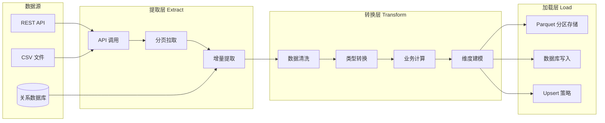
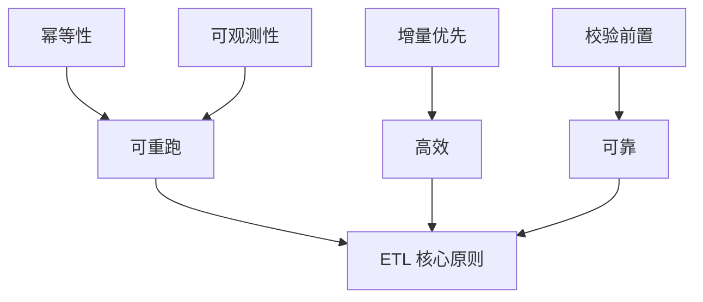
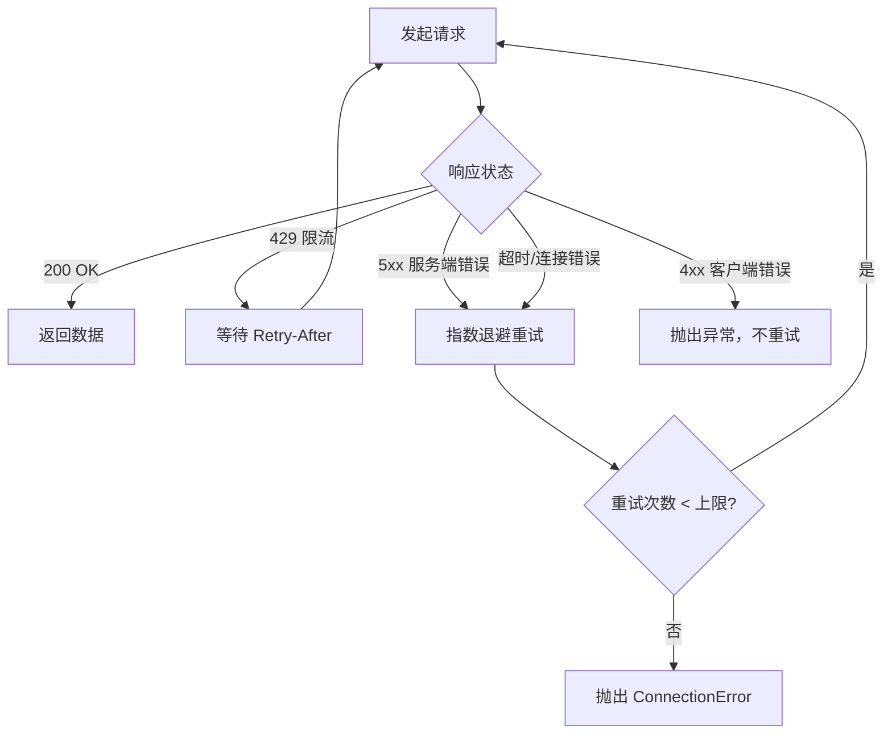
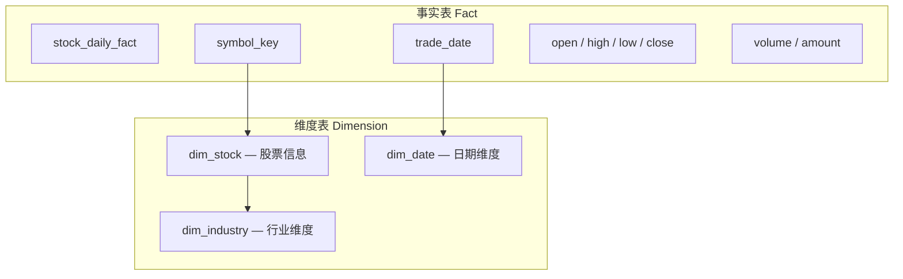
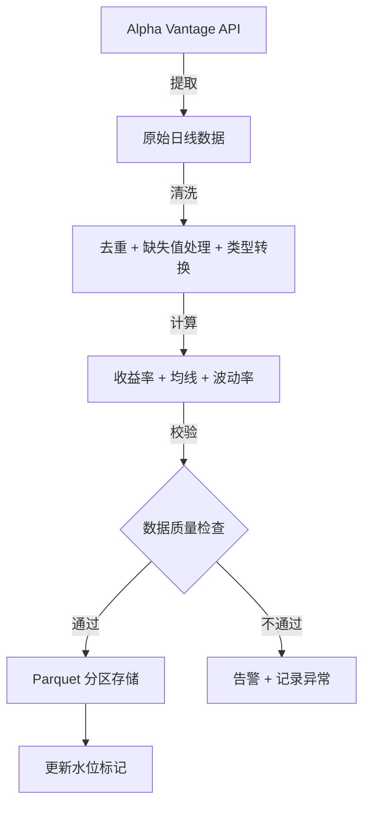
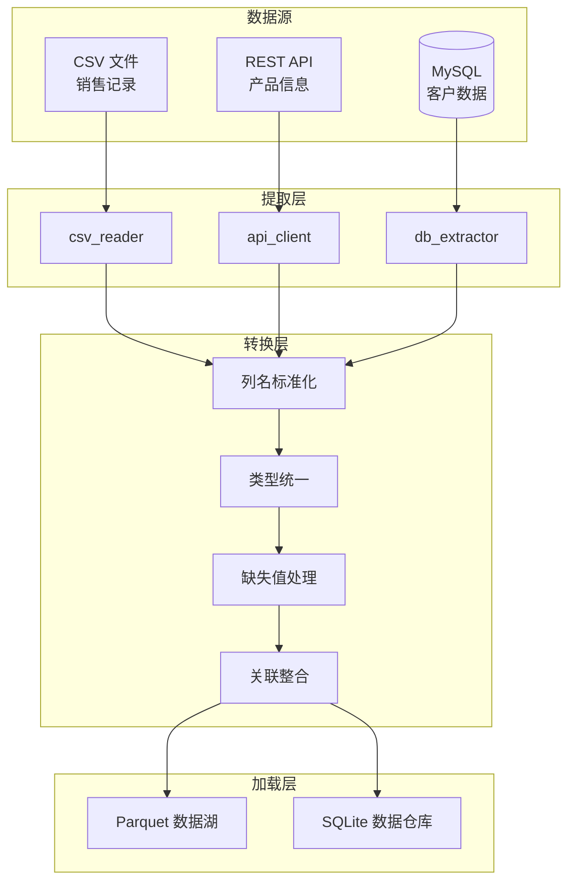

# 完整 ETL 实战

**ETL（Extract-Transform-Load）是数据工程的核心范式。** 它将分散的原始数据经过提取、清洗、转换，最终加载到目标存储，为下游分析和决策提供可靠的数据基础。

> 阅读提示

- 如果你只想快速搭建一个 API → Parquet 管道，直接看 [场景一](#场景一股票数据采集管道)
- 如果你想了解多源数据如何整合，跳到 [场景二](#场景二多源数据整合管道)
- 如果你想理解 ETL 架构设计原则，从 [ETL 架构设计](#etl-架构设计) 开始
- 本文所有代码基于 **Python 3.10+**，依赖 `pandas`、`pyarrow`、`requests`、`sqlalchemy`

## ETL 架构设计

### 整体流程



### 分层职责

| 层次 | 职责 | 关键技术 | 输出 |
|------|------|---------|------|
| 提取层 | 从数据源获取原始数据 | requests、分页、增量标记 | Raw DataFrame |
| 转换层 | 清洗、校验、计算、建模 | pandas、pyarrow、验证规则 | Clean DataFrame |
| 加载层 | 持久化到目标存储 | pyarrow、sqlalchemy、upsert | Parquet / DB 表 |
| 监控层 | 日志、统计、告警 | logging、结构化日志 | 运行报告 |

### 设计原则



- **幂等性**：同一管道多次运行产生相同结果，不会重复写入
- **可观测性**：每一步都有日志和统计，出问题可追溯
- **增量优先**：优先增量提取，避免全量拉取浪费资源
- **校验前置**：数据在进入转换层之前先做基本校验，尽早拦截脏数据

## 数据提取层

数据提取是 ETL 的第一步，负责从各种数据源获取原始数据。提取层只负责"拿数据"，不做业务逻辑处理。

### API 调用封装

```python
import requests
from dataclasses import dataclass, field
from typing import Any


@dataclass
class APIConfig:
    """API 连接配置"""
    base_url: str
    timeout: int = 30
    max_retries: int = 3
    retry_delay: float = 1.0
    headers: dict[str, str] = field(default_factory=dict)


class APIClient:
    """通用 API 客户端，内置重试与错误处理"""

    def __init__(self, config: APIConfig) -> None:
        self.config = config
        self.session = requests.Session()
        self.session.headers.update(config.headers)

    def get(self, endpoint: str, params: dict[str, Any] | None = None) -> dict:
        """GET 请求，自动重试"""
        url = f"{self.config.base_url}{endpoint}"
        last_error = None

        for attempt in range(1, self.config.max_retries + 1):
            try:
                resp = self.session.get(
                    url, params=params, timeout=self.config.timeout
                )
                resp.raise_for_status()
                return resp.json()

            except requests.exceptions.HTTPError as e:
                last_error = e
                if resp.status_code == 429:  # 限流
                    import time
                    wait = float(resp.headers.get("Retry-After", self.config.retry_delay * attempt))
                    time.sleep(wait)
                elif resp.status_code >= 500:  # 服务端错误，重试
                    import time
                    time.sleep(self.config.retry_delay * attempt)
                else:  # 4xx 客户端错误，不重试
                    raise

            except (requests.exceptions.ConnectionError,
                    requests.exceptions.Timeout) as e:
                last_error = e
                import time
                time.sleep(self.config.retry_delay * attempt)

        raise ConnectionError(
            f"API 请求失败，已重试 {self.config.max_retries} 次: {last_error}"
        )

    def close(self) -> None:
        self.session.close()

    def __enter__(self):
        return self

    def __exit__(self, *args):
        self.close()
```

### 分页拉取

大多数 API 返回数据有分页限制，需要自动翻页获取全量数据。

```python
from typing import Generator
import pandas as pd


def fetch_paginated(
    client: APIClient,
    endpoint: str,
    page_size: int = 100,
    max_pages: int | None = None,
    page_param: str = "page",
    size_param: str = "per_page",
    data_key: str = "data",
    total_key: str = "total",
) -> pd.DataFrame:
    """
    分页拉取 API 数据，自动翻页直到获取全部记录

    Args:
        client: API 客户端
        endpoint: API 端点
        page_size: 每页记录数
        max_pages: 最大页数（防止无限循环）
        page_param: 页码参数名
        size_param: 每页数量参数名
        data_key: 响应中数据列表的键名
        total_key: 响应中总记录数的键名

    Returns:
        合并后的 DataFrame
    """
    all_records: list[dict] = []
    page = 1

    while True:
        params = {page_param: page, size_param: page_size}
        response = client.get(endpoint, params=params)

        records = response.get(data_key, [])
        if not records:
            break

        all_records.extend(records)

        # 判断是否还有下一页
        total = response.get(total_key, 0)
        if len(all_records) >= total:
            break

        if max_pages and page >= max_pages:
            break

        page += 1

    return pd.DataFrame(all_records)
```

### 增量提取

增量提取只拉取上次运行之后新增或修改的数据，避免全量拉取。

```python
import json
from datetime import datetime, date
from pathlib import Path


class IncrementalTracker:
    """增量提取状态追踪器"""

    def __init__(self, state_dir: str = ".etl_state") -> None:
        self.state_dir = Path(state_dir)
        self.state_dir.mkdir(exist_ok=True)

    def get_last_extract_time(self, source_name: str) -> datetime | None:
        """获取上次提取时间"""
        state_file = self.state_dir / f"{source_name}_state.json"
        if state_file.exists():
            with open(state_file) as f:
                state = json.load(f)
                last_time = state.get("last_extract_time")
                if last_time:
                    return datetime.fromisoformat(last_time)
        return None

    def save_extract_time(self, source_name: str, extract_time: datetime) -> None:
        """保存本次提取时间"""
        state_file = self.state_dir / f"{source_name}_state.json"
        state = {"last_extract_time": extract_time.isoformat()}
        with open(state_file, "w") as f:
            json.dump(state, f, indent=2)

    def get_watermark(self, source_name: str, key: str) -> str | None:
        """获取水位标记（如最大 ID、最大时间戳）"""
        state_file = self.state_dir / f"{source_name}_state.json"
        if state_file.exists():
            with open(state_file) as f:
                state = json.load(f)
                return state.get("watermarks", {}).get(key)
        return None

    def save_watermark(self, source_name: str, key: str, value: str) -> None:
        """保存水位标记"""
        state_file = self.state_dir / f"{source_name}_state.json"
        state = {}
        if state_file.exists():
            with open(state_file) as f:
                state = json.load(f)
        state.setdefault("watermarks", {})[key] = value
        with open(state_file, "w") as f:
            json.dump(state, f, indent=2)


def incremental_extract(
    client: APIClient,
    endpoint: str,
    tracker: IncrementalTracker,
    source_name: str,
    since_param: str = "since",
    since_format: str = "%Y-%m-%d",
) -> pd.DataFrame:
    """增量提取：只拉取上次之后的数据"""
    last_time = tracker.get_last_extract_time(source_name)

    params: dict[str, Any] = {}
    if last_time:
        params[since_param] = last_time.strftime(since_format)

    response = client.get(endpoint, params=params)
    records = response.get("data", [])

    # 更新提取时间
    now = datetime.now()
    tracker.save_extract_time(source_name, now)

    return pd.DataFrame(records)
```

### 错误重试策略



```python
import time
import random
from functools import wraps
from typing import Callable, TypeVar

T = TypeVar("T")


def retry_with_backoff(
    max_retries: int = 3,
    base_delay: float = 1.0,
    max_delay: float = 60.0,
    exponential_base: float = 2.0,
    jitter: bool = True,
    retryable_exceptions: tuple = (
        requests.exceptions.ConnectionError,
        requests.exceptions.Timeout,
        requests.exceptions.HTTPError,
    ),
) -> Callable:
    """
    指数退避重试装饰器

    Args:
        max_retries: 最大重试次数
        base_delay: 基础延迟（秒）
        max_delay: 最大延迟（秒）
        exponential_base: 指数底数
        jitter: 是否添加随机抖动
        retryable_exceptions: 可重试的异常类型
    """
    def decorator(func: Callable[..., T]) -> Callable[..., T]:
        @wraps(func)
        def wrapper(*args, **kwargs) -> T:
            last_error = None
            for attempt in range(max_retries + 1):
                try:
                    return func(*args, **kwargs)
                except retryable_exceptions as e:
                    last_error = e
                    if attempt == max_retries:
                        raise
                    delay = min(
                        base_delay * (exponential_base ** attempt),
                        max_delay,
                    )
                    if jitter:
                        delay *= random.uniform(0.5, 1.5)
                    time.sleep(delay)
            raise last_error  # type: ignore
        return wrapper
    return decorator


# 使用示例
@retry_with_backoff(max_retries=3, base_delay=2.0)
def fetch_stock_data(symbol: str, date: str) -> dict:
    """获取股票数据（自动重试）"""
    resp = requests.get(
        f"https://api.example.com/stocks/{symbol}",
        params={"date": date},
        timeout=30,
    )
    resp.raise_for_status()
    return resp.json()
```

## 数据转换层

转换层是 ETL 的核心，负责将原始数据清洗、校验、计算后变成可用的分析数据。

### 清洗规则

```python
import pandas as pd
import numpy as np
import re
from typing import Any


class DataCleaner:
    """数据清洗管道"""

    def __init__(self, df: pd.DataFrame) -> None:
        self.df = df.copy()
        self.clean_log: list[dict] = []

    def remove_duplicates(self, subset: list[str] | None = None) -> "DataCleaner":
        """去重"""
        before = len(self.df)
        self.df = self.df.drop_duplicates(subset=subset, keep="last")
        removed = before - len(self.df)
        self.clean_log.append({
            "step": "remove_duplicates",
            "before": before,
            "after": len(self.df),
            "removed": removed,
        })
        return self

    def handle_missing(
        self,
        strategy: dict[str, str] | None = None,
        drop_threshold: float = 0.8,
    ) -> "DataCleaner":
        """
        处理缺失值

        Args:
            strategy: 列级策略 {"col": "fill_mean"|"fill_median"|"fill_zero"|"drop"}
            drop_threshold: 缺失率超过此值的行直接删除
        """
        strategy = strategy or {}

        # 删除缺失率过高的行
        missing_rate = self.df.isnull().sum(axis=1) / len(self.df.columns)
        before = len(self.df)
        self.df = self.df[missing_rate < drop_threshold]

        # 按列策略处理
        for col, method in strategy.items():
            if col not in self.df.columns:
                continue
            if method == "fill_mean":
                self.df[col] = self.df[col].fillna(self.df[col].mean())
            elif method == "fill_median":
                self.df[col] = self.df[col].fillna(self.df[col].median())
            elif method == "fill_zero":
                self.df[col] = self.df[col].fillna(0)
            elif method == "drop":
                self.df = self.df.dropna(subset=[col])

        self.clean_log.append({
            "step": "handle_missing",
            "before": before,
            "after": len(self.df),
        })
        return self

    def trim_strings(self) -> "DataCleaner":
        """去除字符串列的前后空白"""
        str_cols = self.df.select_dtypes(include=["object"]).columns
        for col in str_cols:
            self.df[col] = self.df[col].str.strip()
        return self

    def remove_outliers(
        self,
        columns: list[str],
        method: str = "iqr",
        factor: float = 1.5,
    ) -> "DataCleaner":
        """
        移除异常值

        Args:
            columns: 要处理的数值列
            method: "iqr" 或 "zscore"
            factor: IQR 倍数或 Z-score 阈值
        """
        before = len(self.df)
        for col in columns:
            if col not in self.df.columns:
                continue
            if method == "iqr":
                q1 = self.df[col].quantile(0.25)
                q3 = self.df[col].quantile(0.75)
                iqr = q3 - q1
                lower = q1 - factor * iqr
                upper = q3 + factor * iqr
                self.df = self.df[(self.df[col] >= lower) & (self.df[col] <= upper)]
            elif method == "zscore":
                z_scores = np.abs(
                    (self.df[col] - self.df[col].mean()) / self.df[col].std()
                )
                self.df = self.df[z_scores <= factor]

        self.clean_log.append({
            "step": "remove_outliers",
            "method": method,
            "before": before,
            "after": len(self.df),
        })
        return self

    def standardize_column_names(self) -> "DataCleaner":
        """标准化列名：小写、下划线分隔"""
        self.df.columns = [
            re.sub(r"[^a-z0-9]", "_", col.lower()).strip("_")
            for col in self.df.columns
        ]
        # 合并连续下划线
        self.df.columns = [re.sub(r"_+", "_", col) for col in self.df.columns]
        return self

    def result(self) -> pd.DataFrame:
        """返回清洗后的 DataFrame"""
        return self.df

    def get_log(self) -> list[dict]:
        """获取清洗日志"""
        return self.clean_log
```

### 类型转换

```python
from datetime import datetime


class TypeConverter:
    """数据类型转换器"""

    @staticmethod
    def to_datetime(
        df: pd.DataFrame,
        columns: list[str],
        format: str | None = None,
        errors: str = "coerce",
    ) -> pd.DataFrame:
        """
        将列转换为 datetime 类型

        Args:
            errors: "coerce" 将无效值设为 NaT, "raise" 抛出异常
        """
        df = df.copy()
        for col in columns:
            df[col] = pd.to_datetime(df[col], format=format, errors=errors)
        return df

    @staticmethod
    def to_numeric(
        df: pd.DataFrame,
        columns: list[str],
        downcast: str = "float",
        errors: str = "coerce",
    ) -> pd.DataFrame:
        """将列转换为数值类型"""
        df = df.copy()
        for col in columns:
            df[col] = pd.to_numeric(df[col], errors=errors, downcast=downcast)
        return df

    @staticmethod
    def to_category(
        df: pd.DataFrame,
        columns: list[str],
        min_cardinality: int = 0,
    ) -> pd.DataFrame:
        """
        将低基数字符串列转为 category 类型以节省内存

        Args:
            min_cardinality: 基数低于此值的列才转换
        """
        df = df.copy()
        for col in columns:
            if df[col].nunique() <= min_cardinality or min_cardinality == 0:
                df[col] = df[col].astype("category")
        return df

    @staticmethod
    def to_string(df: pd.DataFrame, columns: list[str]) -> pd.DataFrame:
        """将列转换为字符串类型（确保 ID 列不会被当作数值）"""
        df = df.copy()
        for col in columns:
            df[col] = df[col].astype(str)
        return df
```

### 业务计算

```python
class BusinessCalculator:
    """业务计算层：在清洗后的数据上执行业务逻辑"""

    @staticmethod
    def calc_return(df: pd.DataFrame, price_col: str = "close") -> pd.DataFrame:
        """计算日收益率"""
        df = df.copy()
        df["daily_return"] = df[price_col].pct_change()
        df["cumulative_return"] = (1 + df["daily_return"]).cumprod() - 1
        return df

    @staticmethod
    def calc_moving_average(
        df: pd.DataFrame,
        price_col: str = "close",
        windows: list[int] | None = None,
    ) -> pd.DataFrame:
        """计算移动平均线"""
        df = df.copy()
        windows = windows or [5, 10, 20, 60]
        for w in windows:
            df[f"ma_{w}"] = df[price_col].rolling(window=w).mean()
        return df

    @staticmethod
    def calc_volatility(
        df: pd.DataFrame,
        return_col: str = "daily_return",
        window: int = 20,
    ) -> pd.DataFrame:
        """计算波动率（年化）"""
        df = df.copy()
        df["volatility"] = df[return_col].rolling(window=window).std() * np.sqrt(252)
        return df

    @staticmethod
    def add_date_dimensions(df: pd.DataFrame, date_col: str = "date") -> pd.DataFrame:
        """添加日期维度列"""
        df = df.copy()
        df["year"] = df[date_col].dt.year
        df["month"] = df[date_col].dt.month
        df["day"] = df[date_col].dt.day
        df["weekday"] = df[date_col].dt.dayofweek  # 0=周一, 6=周日
        df["quarter"] = df[date_col].dt.quarter
        df["is_month_start"] = df[date_col].dt.is_month_start
        df["is_month_end"] = df[date_col].dt.is_month_end
        return df
```

### 维度建模



```python
class DimensionBuilder:
    """维度建模：从扁平数据构建星型模型"""

    @staticmethod
    def build_date_dimension(
        start_date: str,
        end_date: str,
    ) -> pd.DataFrame:
        """构建日期维度表"""
        dates = pd.date_range(start_date, end_date, freq="D")
        dim = pd.DataFrame({"date_key": dates})
        dim["year"] = dim["date_key"].dt.year
        dim["month"] = dim["date_key"].dt.month
        dim["day"] = dim["date_key"].dt.day
        dim["quarter"] = dim["date_key"].dt.quarter
        dim["weekday"] = dim["date_key"].dt.dayofweek
        dim["weekday_name"] = dim["date_key"].dt.day_name()
        dim["is_weekend"] = dim["weekday"].isin([5, 6])
        dim["is_month_start"] = dim["date_key"].dt.is_month_start
        dim["is_month_end"] = dim["date_key"].dt.is_month_end
        dim["year_month"] = dim["date_key"].dt.strftime("%Y-%m")
        return dim

    @staticmethod
    def build_stock_dimension(raw_df: pd.DataFrame) -> pd.DataFrame:
        """构建股票维度表"""
        dim = raw_df[["symbol", "name", "industry", "list_date"]].copy()
        dim = dim.drop_duplicates(subset=["symbol"])
        dim["symbol_key"] = range(1, len(dim) + 1)
        dim["is_active"] = True
        return dim

    @staticmethod
    def build_fact_table(
        raw_df: pd.DataFrame,
        stock_dim: pd.DataFrame,
    ) -> pd.DataFrame:
        """构建事实表，关联维度键"""
        fact = raw_df.merge(
            stock_dim[["symbol", "symbol_key"]],
            on="symbol",
            how="left",
        )
        fact["date_key"] = fact["date"]
        # 只保留事实列和维度键
        fact_cols = ["symbol_key", "date_key", "open", "high", "low", "close",
                      "volume", "amount", "daily_return", "volatility"]
        return fact[fact_cols]
```

## 数据加载层

加载层负责将转换后的数据持久化到目标存储。核心考量是写入性能、数据格式和更新策略。

### Parquet 分区存储

Parquet 是列式存储格式，天然支持分区裁剪和高效压缩，是数据湖/数据仓库的首选格式。

```python
import pyarrow as pa
import pyarrow.parquet as pq
from pathlib import Path


class ParquetWriter:
    """Parquet 分区写入器"""

    def __init__(self, base_dir: str, partition_cols: list[str] | None = None) -> None:
        self.base_dir = Path(base_dir)
        self.partition_cols = partition_cols or []

    def write(
        self,
        df: pd.DataFrame,
        table_name: str,
        compression: str = "snappy",
        engine: str = "pyarrow",
    ) -> Path:
        """
        写入 Parquet 文件，支持分区

        Args:
            df: 要写入的 DataFrame
            table_name: 表名（目录名）
            compression: 压缩算法 (snappy, gzip, zstd, none)
            engine: 写入引擎

        Returns:
            写入路径
        """
        output_dir = self.base_dir / table_name
        output_dir.mkdir(parents=True, exist_ok=True)

        if self.partition_cols:
            # 分区写入：每个分区值一个子目录
            pq.write_to_dataset(
                pa.Table.from_pandas(df),
                root_path=str(output_dir),
                partition_cols=self.partition_cols,
                compression=compression,
            )
        else:
            # 非分区写入
            file_path = output_dir / "data.parquet"
            df.to_parquet(file_path, compression=compression, engine=engine)

        return output_dir

    def read_partition(
        self,
        table_name: str,
        filters: list[tuple] | None = None,
    ) -> pd.DataFrame:
        """
        读取 Parquet 分区数据，支持谓词下推

        Args:
            table_name: 表名
            filters: 过滤条件，如 [("year", "=", 2024), ("month", "=", 1)]

        Returns:
            过滤后的 DataFrame
        """
        output_dir = self.base_dir / table_name
        return pq.read_table(
            str(output_dir),
            filters=filters,
        ).to_pandas()

    def get_partition_stats(self, table_name: str) -> dict:
        """获取分区统计信息"""
        output_dir = self.base_dir / table_name
        if not output_dir.exists():
            return {"exists": False}

        parquet_files = list(output_dir.rglob("*.parquet"))
        total_size = sum(f.stat().st_size for f in parquet_files)

        return {
            "exists": True,
            "file_count": len(parquet_files),
            "total_size_mb": round(total_size / 1024 / 1024, 2),
            "partitions": [
                str(p.relative_to(output_dir).parent)
                for p in parquet_files
            ],
        }
```

### 数据库写入

```python
from sqlalchemy import create_engine, text
from sqlalchemy.engine import Engine


class DatabaseWriter:
    """数据库写入器"""

    def __init__(self, connection_string: str) -> None:
        self.engine: Engine = create_engine(connection_string, pool_pre_ping=True)

    def write_append(
        self,
        df: pd.DataFrame,
        table_name: str,
        chunk_size: int = 10000,
    ) -> int:
        """追加写入"""
        rows_before = self._count_rows(table_name)
        df.to_sql(
            table_name,
            self.engine,
            if_exists="append",
            index=False,
            chunksize=chunk_size,
            method="multi",
        )
        rows_after = self._count_rows(table_name)
        return rows_after - rows_before

    def write_replace(
        self,
        df: pd.DataFrame,
        table_name: str,
        chunk_size: int = 10000,
    ) -> int:
        """全量替换写入"""
        df.to_sql(
            table_name,
            self.engine,
            if_exists="replace",
            index=False,
            chunksize=chunk_size,
        )
        return len(df)

    def upsert(
        self,
        df: pd.DataFrame,
        table_name: str,
        key_columns: list[str],
        chunk_size: int = 5000,
    ) -> dict:
        """
        Upsert 写入：存在则更新，不存在则插入

        Args:
            df: 要写入的数据
            table_name: 目标表名
            key_columns: 唯一键列名列表
            chunk_size: 批量大小

        Returns:
            {"inserted": n, "updated": m}
        """
        inserted = 0
        updated = 0

        with self.engine.begin() as conn:
            for i in range(0, len(df), chunk_size):
                chunk = df.iloc[i : i + chunk_size]

                for _, row in chunk.iterrows():
                    # 检查记录是否存在
                    where = " AND ".join(
                        f"{col} = :{col}" for col in key_columns
                    )
                    check_sql = text(
                        f"SELECT COUNT(*) FROM {table_name} WHERE {where}"
                    )
                    params = {col: row[col] for col in key_columns}
                    exists = conn.scalar(check_sql, params) > 0

                    if exists:
                        # 更新
                        set_clause = ", ".join(
                            f"{col} = :{col}"
                            for col in df.columns
                            if col not in key_columns
                        )
                        update_sql = text(
                            f"UPDATE {table_name} SET {set_clause} WHERE {where}"
                        )
                        conn.execute(update_sql, row.to_dict())
                        updated += 1
                    else:
                        # 插入
                        cols = ", ".join(df.columns)
                        placeholders = ", ".join(f":{col}" for col in df.columns)
                        insert_sql = text(
                            f"INSERT INTO {table_name} ({cols}) VALUES ({placeholders})"
                        )
                        conn.execute(insert_sql, row.to_dict())
                        inserted += 1

        return {"inserted": inserted, "updated": updated}

    def _count_rows(self, table_name: str) -> int:
        """统计表行数"""
        with self.engine.connect() as conn:
            result = conn.scalar(text(f"SELECT COUNT(*) FROM {table_name}"))
            return result or 0
```

### Upsert 策略对比

| 策略 | 实现方式 | 适用场景 | 性能 | 复杂度 |
|------|---------|---------|------|--------|
| Append Only | 直接追加 | 日志型数据、不可变记录 | 最快 | 最低 |
| Replace | 全量替换 | 小表、全量刷新 | 中等 | 低 |
| Upsert (逐行) | 逐条检查+更新/插入 | 小批量更新 | 慢 | 中 |
| Upsert (临时表) | 临时表 + MERGE/JOIN | 大批量更新 | 快 | 高 |
| Upsert (ON CONFLICT) | PostgreSQL 原生语法 | PostgreSQL 专用 | 最快 | 中 |

```python
def upsert_via_temp_table(
    engine: Engine,
    df: pd.DataFrame,
    target_table: str,
    key_columns: list[str],
    temp_table: str = "_temp_upsert",
) -> dict:
    """
    通过临时表实现高效 Upsert（适用于大批量）

    原理：先将数据写入临时表，再通过 SQL MERGE/JOIN 批量更新
    """
    # 1. 写入临时表
    df.to_sql(temp_table, engine, if_exists="replace", index=False)

    # 2. 执行 MERGE（以 PostgreSQL 为例）
    with engine.begin() as conn:
        # 删除目标表中已存在的记录
        key_match = " AND ".join(
            f"t.{col} = s.{col}" for col in key_columns
        )
        delete_sql = text(f"""
            DELETE FROM {target_table} t
            USING {temp_table} s
            WHERE {key_match}
        """)
        delete_result = conn.execute(delete_sql)

        # 插入临时表所有数据
        insert_sql = text(f"""
            INSERT INTO {target_table}
            SELECT * FROM {temp_table}
        """)
        insert_result = conn.execute(insert_sql)

        # 清理临时表
        conn.execute(text(f"DROP TABLE IF EXISTS {temp_table}"))

    return {
        "deleted_and_replaced": delete_result.rowcount,
        "inserted": insert_result.rowcount,
    }
```

## 管道监控与日志

没有监控的 ETL 管道是"黑箱"——出了问题无从排查。结构化日志和运行统计是可观测性的基础。

### 结构化日志

```python
import logging
import json
import sys
from datetime import datetime
from typing import Any


class JSONFormatter(logging.Formatter):
    """JSON 格式日志格式化器"""

    def format(self, record: logging.LogRecord) -> str:
        log_entry = {
            "timestamp": datetime.fromtimestamp(record.created).isoformat(),
            "level": record.levelname,
            "logger": record.name,
            "message": record.getMessage(),
            "module": record.module,
            "line": record.lineno,
        }

        # 附加自定义字段
        if hasattr(record, "etl_context"):
            log_entry["etl_context"] = record.etl_context

        if record.exc_info and record.exc_info[1]:
            log_entry["exception"] = {
                "type": record.exc_info[0].__name__,
                "message": str(record.exc_info[1]),
            }

        return json.dumps(log_entry, ensure_ascii=False)


def setup_etl_logger(
    name: str = "etl",
    level: int = logging.INFO,
    log_file: str | None = None,
) -> logging.Logger:
    """配置 ETL 日志器"""
    logger = logging.getLogger(name)
    logger.setLevel(level)

    # 控制台输出（JSON 格式）
    console_handler = logging.StreamHandler(sys.stdout)
    console_handler.setFormatter(JSONFormatter())
    logger.addHandler(console_handler)

    # 文件输出（可选）
    if log_file:
        file_handler = logging.FileHandler(log_file, encoding="utf-8")
        file_handler.setFormatter(JSONFormatter())
        logger.addHandler(file_handler)

    return logger
```

### 运行统计

```python
from dataclasses import dataclass, field
from contextlib import contextmanager
import time


@dataclass
class StepStats:
    """单步统计"""
    step_name: str
    start_time: datetime = field(default_factory=datetime.now)
    end_time: datetime | None = None
    duration_seconds: float = 0.0
    input_rows: int = 0
    output_rows: int = 0
    status: str = "running"
    error: str | None = None


@dataclass
class PipelineStats:
    """管道运行统计"""
    pipeline_name: str
    run_id: str
    start_time: datetime = field(default_factory=datetime.now)
    end_time: datetime | None = None
    total_duration_seconds: float = 0.0
    steps: list[StepStats] = field(default_factory=list)
    status: str = "running"

    def summary(self) -> dict:
        """生成运行摘要"""
        return {
            "pipeline": self.pipeline_name,
            "run_id": self.run_id,
            "status": self.status,
            "start_time": self.start_time.isoformat(),
            "end_time": self.end_time.isoformat() if self.end_time else None,
            "total_duration_seconds": round(self.total_duration_seconds, 2),
            "steps": [
                {
                    "name": s.step_name,
                    "status": s.status,
                    "duration_seconds": round(s.duration_seconds, 2),
                    "input_rows": s.input_rows,
                    "output_rows": s.output_rows,
                    "error": s.error,
                }
                for s in self.steps
            ],
        }


class PipelineMonitor:
    """管道监控器"""

    def __init__(self, pipeline_name: str, run_id: str | None = None) -> None:
        import uuid
        self.stats = PipelineStats(
            pipeline_name=pipeline_name,
            run_id=run_id or str(uuid.uuid4())[:8],
        )
        self.logger = setup_etl_logger("etl.monitor")

    @contextmanager
    def step(self, step_name: str, input_rows: int = 0):
        """步骤上下文管理器，自动计时和记录"""
        step_stats = StepStats(step_name=step_name, input_rows=input_rows)
        self.stats.steps.append(step_stats)

        self.logger.info(
            f"开始执行步骤: {step_name}",
            extra={"etl_context": {"step": step_name, "action": "start"}},
        )

        try:
            yield step_stats
            step_stats.status = "success"
            self.logger.info(
                f"步骤完成: {step_name} (耗时 {step_stats.duration_seconds:.2f}s)",
                extra={"etl_context": {"step": step_name, "action": "complete"}},
            )
        except Exception as e:
            step_stats.status = "failed"
            step_stats.error = str(e)
            self.logger.error(
                f"步骤失败: {step_name} — {e}",
                extra={"etl_context": {"step": step_name, "action": "failed"}},
            )
            raise
        finally:
            step_stats.end_time = datetime.now()
            step_stats.duration_seconds = (
                step_stats.end_time - step_stats.start_time
            ).total_seconds()

    def finish(self, status: str = "success") -> dict:
        """完成管道运行，返回统计摘要"""
        self.stats.end_time = datetime.now()
        self.stats.total_duration_seconds = (
            self.stats.end_time - self.stats.start_time
        ).total_seconds()
        self.stats.status = status

        summary = self.stats.summary()
        self.logger.info(
            f"管道运行完成: {self.stats.pipeline_name}",
            extra={"etl_context": {"action": "pipeline_complete", "summary": summary}},
        )
        return summary
```

### 异常告警

```python
class AlertManager:
    """简单告警管理器"""

    def __init__(self, webhook_url: str | None = None) -> None:
        self.webhook_url = webhook_url
        self.logger = setup_etl_logger("etl.alert")

    def send_alert(
        self,
        level: str,
        pipeline: str,
        message: str,
        details: dict | None = None,
    ) -> None:
        """发送告警"""
        alert_data = {
            "level": level,  # warning, error, critical
            "pipeline": pipeline,
            "message": message,
            "timestamp": datetime.now().isoformat(),
            "details": details or {},
        }

        self.logger.warning(
            f"[{level.upper()}] {pipeline}: {message}",
            extra={"etl_context": {"alert": alert_data}},
        )

        # 发送到 Webhook（如企业微信、钉钉、Slack）
        if self.webhook_url:
            try:
                requests.post(
                    self.webhook_url,
                    json=alert_data,
                    timeout=10,
                )
            except requests.exceptions.RequestException as e:
                self.logger.error(f"告警发送失败: {e}")

    def check_data_quality(
        self,
        df: pd.DataFrame,
        pipeline: str,
        rules: dict[str, Any],
    ) -> list[str]:
        """
        数据质量检查，不达标则告警

        Args:
            rules: {"min_rows": 100, "max_null_rate": 0.1, "required_cols": [...]}
        """
        violations: list[str] = []

        if "min_rows" in rules and len(df) < rules["min_rows"]:
            violations.append(
                f"行数不足: 期望 >= {rules['min_rows']}, 实际 {len(df)}"
            )

        if "max_null_rate" in rules:
            for col in df.columns:
                null_rate = df[col].isnull().mean()
                if null_rate > rules["max_null_rate"]:
                    violations.append(
                        f"列 {col} 缺失率过高: {null_rate:.2%} > {rules['max_null_rate']:.2%}"
                    )

        if "required_cols" in rules:
            missing = set(rules["required_cols"]) - set(df.columns)
            if missing:
                violations.append(f"缺少必要列: {missing}")

        for v in violations:
            self.send_alert("warning", pipeline, v)

        return violations
```

## 实战场景

### 场景一：股票数据采集管道

从公开 API 采集股票日线数据，经过清洗、计算技术指标，最终以 Parquet 格式按年月分区存储。



```python
"""
完整端到端 ETL 管道：股票数据采集

数据流: Alpha Vantage API → 清洗 → 技术指标计算 → Parquet 分区存储
"""
import pandas as pd
from pathlib import Path
from datetime import datetime


class StockETLPipeline:
    """股票数据 ETL 管道"""

    def __init__(
        self,
        api_key: str,
        data_dir: str = "data/stock",
        state_dir: str = ".etl_state",
    ) -> None:
        self.api_config = APIConfig(
            base_url="https://www.alphavantage.co",
            headers={"User-Agent": "ETL-Pipeline/1.0"},
        )
        self.client = APIClient(self.api_config)
        self.api_key = api_key
        self.writer = ParquetWriter(data_dir, partition_cols=["year", "month"])
        self.tracker = IncrementalTracker(state_dir)
        self.monitor = PipelineMonitor("stock_daily_etl")
        self.alert = AlertManager()
        self.logger = setup_etl_logger("etl.stock")

    def extract(self, symbol: str, output_size: str = "compact") -> pd.DataFrame:
        """提取层：从 API 获取股票日线数据"""
        with self.monitor.step("extract", input_rows=0) as step:
            response = self.client.get(
                "/query",
                params={
                    "function": "TIME_SERIES_DAILY",
                    "symbol": symbol,
                    "outputsize": output_size,
                    "apikey": self.api_key,
                },
            )

            # 解析 API 响应
            time_series = response.get("Time Series (Daily)", {})
            if not time_series:
                raise ValueError(f"未获取到 {symbol} 的数据")

            records = []
            for date_str, values in time_series.items():
                records.append({
                    "date": date_str,
                    "open": float(values.get("1. open", 0)),
                    "high": float(values.get("2. high", 0)),
                    "low": float(values.get("3. low", 0)),
                    "close": float(values.get("4. close", 0)),
                    "volume": int(values.get("5. volume", 0)),
                })

            df = pd.DataFrame(records)
            step.output_rows = len(df)
            self.logger.info(f"提取 {symbol} 数据: {len(df)} 条")
            return df

    def transform(self, df: pd.DataFrame, symbol: str) -> pd.DataFrame:
        """转换层：清洗 + 类型转换 + 业务计算"""
        with self.monitor.step("transform", input_rows=len(df)) as step:
            # 1. 清洗
            cleaner = DataCleaner(df)
            df = (
                cleaner
                .standardize_column_names()
                .remove_duplicates(subset=["date"])
                .handle_missing(strategy={"close": "fill_median", "volume": "fill_zero"})
                .trim_strings()
                .result()
            )

            # 2. 类型转换
            df = TypeConverter.to_datetime(df, ["date"])
            df = TypeConverter.to_numeric(df, ["open", "high", "low", "close", "volume"])

            # 3. 业务计算
            df = BusinessCalculator.calc_return(df, "close")
            df = BusinessCalculator.calc_moving_average(df, "close", [5, 20, 60])
            df = BusinessCalculator.calc_volatility(df, "daily_return", 20)

            # 4. 添加维度列
            df["symbol"] = symbol
            df["year"] = df["date"].dt.year
            df["month"] = df["date"].dt.month

            # 5. 排序
            df = df.sort_values("date").reset_index(drop=True)

            step.output_rows = len(df)
            self.logger.info(f"转换完成: {len(df)} 条, 清洗日志: {cleaner.get_log()}")
            return df

    def load(self, df: pd.DataFrame, symbol: str) -> Path:
        """加载层：写入 Parquet 分区存储"""
        with self.monitor.step("load", input_rows=len(df)) as step:
            table_name = f"stock_{symbol.lower()}"
            output_path = self.writer.write(df, table_name)

            # 更新水位标记
            max_date = df["date"].max()
            self.tracker.save_watermark(
                f"stock_{symbol}", "max_date", max_date.isoformat()
            )

            step.output_rows = len(df)
            self.logger.info(f"写入完成: {output_path}")
            return output_path

    def validate(self, df: pd.DataFrame, symbol: str) -> bool:
        """数据质量校验"""
        violations = self.alert.check_data_quality(
            df,
            pipeline=f"stock_{symbol}",
            rules={
                "min_rows": 10,
                "max_null_rate": 0.05,
                "required_cols": ["date", "close", "volume"],
            },
        )
        return len(violations) == 0

    def run(self, symbol: str, output_size: str = "compact") -> dict:
        """运行完整管道"""
        self.logger.info(f"启动 ETL 管道: {symbol}")
        try:
            # Extract
            raw_df = self.extract(symbol, output_size)

            # Transform
            clean_df = self.transform(raw_df, symbol)

            # Validate
            if not self.validate(clean_df, symbol):
                self.logger.warning(f"数据质量校验未通过，但仍继续加载")

            # Load
            output_path = self.load(clean_df, symbol)

            return self.monitor.finish("success")

        except Exception as e:
            self.alert.send_alert(
                "error",
                f"stock_{symbol}",
                f"ETL 管道失败: {e}",
            )
            return self.monitor.finish("failed")


# 使用示例
if __name__ == "__main__":
    pipeline = StockETLPipeline(api_key="<YOUR_API_KEY>")
    result = pipeline.run("AAPL")
    print(f"管道运行结果: {result}")
```

### 场景二：多源数据整合管道

将 CSV 文件、API 数据和数据库数据整合到统一数据仓库。



```python
"""
多源数据整合 ETL 管道

数据流: CSV + API + DB → 清洗整合 → Parquet 数据湖 + SQLite 数据仓库
"""
import pandas as pd
from pathlib import Path


class MultiSourceETLPipeline:
    """多源数据整合管道"""

    def __init__(self, config: dict) -> None:
        self.config = config
        self.monitor = PipelineMonitor("multi_source_etl")
        self.alert = AlertManager()
        self.logger = setup_etl_logger("etl.multi_source")
        self.parquet_writer = ParquetWriter(
            config.get("data_lake_dir", "data/lake"),
            partition_cols=["year", "month"],
        )
        self.db_writer = DatabaseWriter(
            config.get("warehouse_db", "sqlite:///data/warehouse.db")
        )

    # ---- 提取层 ----

    def extract_csv(self, file_path: str) -> pd.DataFrame:
        """从 CSV 提取销售数据"""
        with self.monitor.step("extract_csv") as step:
            df = pd.read_csv(file_path, encoding="utf-8")
            step.input_rows = 0
            step.output_rows = len(df)
            self.logger.info(f"CSV 提取: {file_path}, {len(df)} 行")
            return df

    def extract_api(self, endpoint: str) -> pd.DataFrame:
        """从 API 提取产品数据"""
        with self.monitor.step("extract_api") as step:
            with APIClient(APIConfig(base_url=self.config["api_base_url"])) as client:
                df = fetch_paginated(client, endpoint, page_size=200)
            step.output_rows = len(df)
            self.logger.info(f"API 提取: {endpoint}, {len(df)} 行")
            return df

    def extract_db(self, query: str) -> pd.DataFrame:
        """从数据库提取客户数据"""
        with self.monitor.step("extract_db") as step:
            engine = create_engine(self.config["source_db"])
            df = pd.read_sql(query, engine)
            step.output_rows = len(df)
            self.logger.info(f"DB 提取: {len(df)} 行")
            return df

    # ---- 转换层 ----

    def harmonize_columns(self, dfs: dict[str, pd.DataFrame]) -> dict[str, pd.DataFrame]:
        """统一各数据源的列名规范"""
        with self.monitor.step("harmonize_columns") as step:
            total_rows = 0
            for source, df in dfs.items():
                cleaner = DataCleaner(df)
                dfs[source] = cleaner.standardize_column_names().trim_strings().result()
                total_rows += len(dfs[source])
            step.output_rows = total_rows
            return dfs

    def unify_types(self, dfs: dict[str, pd.DataFrame]) -> dict[str, pd.DataFrame]:
        """统一数据类型"""
        with self.monitor.step("unify_types") as step:
            for source, df in dfs.items():
                # 日期列统一
                date_cols = [c for c in df.columns if "date" in c]
                if date_cols:
                    dfs[source] = TypeConverter.to_datetime(df, date_cols)
                # 金额列统一
                amount_cols = [c for c in df.columns if any(
                    k in c for k in ["amount", "price", "cost", "revenue"]
                )]
                if amount_cols:
                    dfs[source] = TypeConverter.to_numeric(
                        dfs[source], amount_cols, downcast="float"
                    )
            step.output_rows = sum(len(df) for df in dfs.values())
            return dfs

    def integrate(self, dfs: dict[str, pd.DataFrame]) -> pd.DataFrame:
        """关联整合多源数据"""
        with self.monitor.step("integrate") as step:
            sales_df = dfs.get("sales", pd.DataFrame())
            product_df = dfs.get("products", pd.DataFrame())
            customer_df = dfs.get("customers", pd.DataFrame())

            # 销售数据关联产品信息
            if not sales_df.empty and not product_df.empty:
                merged = sales_df.merge(
                    product_df,
                    left_on="product_id",
                    right_on="id",
                    how="left",
                    suffixes=("", "_product"),
                )
            else:
                merged = sales_df

            # 关联客户信息
            if not merged.empty and not customer_df.empty:
                merged = merged.merge(
                    customer_df,
                    left_on="customer_id",
                    right_on="id",
                    how="left",
                    suffixes=("", "_customer"),
                )

            # 添加日期维度
            if "order_date" in merged.columns:
                merged["year"] = merged["order_date"].dt.year
                merged["month"] = merged["order_date"].dt.month
                merged["quarter"] = merged["order_date"].dt.quarter

            # 计算业务指标
            if "quantity" in merged.columns and "unit_price" in merged.columns:
                merged["total_amount"] = merged["quantity"] * merged["unit_price"]

            step.output_rows = len(merged)
            self.logger.info(f"整合完成: {len(merged)} 行, {len(merged.columns)} 列")
            return merged

    # ---- 加载层 ----

    def load_to_lake(self, df: pd.DataFrame, table_name: str) -> Path:
        """写入数据湖（Parquet）"""
        with self.monitor.step("load_to_lake", input_rows=len(df)) as step:
            path = self.parquet_writer.write(df, table_name)
            step.output_rows = len(df)
            return path

    def load_to_warehouse(self, df: pd.DataFrame, table_name: str) -> int:
        """写入数据仓库（数据库）"""
        with self.monitor.step("load_to_warehouse", input_rows=len(df)) as step:
            rows = self.db_writer.write_replace(df, table_name)
            step.output_rows = rows
            return rows

    # ---- 管道入口 ----

    def run(self) -> dict:
        """运行多源整合管道"""
        self.logger.info("启动多源数据整合管道")
        try:
            # 1. 提取
            dfs = {}
            if "csv_path" in self.config:
                dfs["sales"] = self.extract_csv(self.config["csv_path"])
            if "api_endpoint" in self.config:
                dfs["products"] = self.extract_api(self.config["api_endpoint"])
            if "db_query" in self.config:
                dfs["customers"] = self.extract_db(self.config["db_query"])

            # 2. 转换
            dfs = self.harmonize_columns(dfs)
            dfs = self.unify_types(dfs)
            integrated_df = self.integrate(dfs)

            # 3. 校验
            self.alert.check_data_quality(
                integrated_df,
                pipeline="multi_source",
                rules={"min_rows": 1, "max_null_rate": 0.2},
            )

            # 4. 加载
            self.load_to_lake(integrated_df, "sales_integrated")
            self.load_to_warehouse(integrated_df, "sales_integrated")

            return self.monitor.finish("success")

        except Exception as e:
            self.alert.send_alert("error", "multi_source", f"管道失败: {e}")
            return self.monitor.finish("failed")


# 使用示例
if __name__ == "__main__":
    config = {
        "csv_path": "data/raw/sales_2024.csv",
        "api_base_url": "https://api.example.com",
        "api_endpoint": "/products",
        "source_db": "mysql://<YOUR_USER>:<YOUR_PASSWORD>@localhost/customers",
        "data_lake_dir": "data/lake",
        "warehouse_db": "sqlite:///data/warehouse.db",
    }
    pipeline = MultiSourceETLPipeline(config)
    result = pipeline.run()
    print(f"管道运行结果: {result}")
```

## 常见陷阱

| 陷阱 | 现象 | 原因 | 解决方案 |
|------|------|------|----------|
| 不做增量提取 | 每次全量拉取，API 限流、耗时过长 | 未记录上次提取水位 | 使用 `IncrementalTracker` 记录水位标记 |
| 忽略 API 限流 | 429 Too Many Requests | 请求频率超过 API 限制 | 读取 `Retry-After` 头，自动退避 |
| 不处理分页 | 只拿到第一页数据 | 未自动翻页 | `fetch_paginated` 自动翻页直到数据结束 |
| 缺失值未处理 | 下游计算报 NaN 或结果异常 | 原始数据存在空值 | `handle_missing` 按列策略填充或删除 |
| 重复数据 | 同一记录出现多次 | API 重试、数据源重复 | `remove_duplicates` 去重，指定唯一键 |
| 类型不一致 | 日期是字符串、金额是文本 | 数据源类型不统一 | `TypeConverter` 统一转换 |
| Parquet 不分区 | 查询慢，读取全量数据 | 未按查询维度分区 | 按年/月分区，利用谓词下推 |
| Upsert 无唯一键 | 数据重复插入 | 未定义 key_columns | 明确指定业务唯一键 |
| 日志不可结构化 | 无法搜索和统计 | 用 print 或纯文本日志 | JSON 格式日志，附加 etl_context |
| 管道不幂等 | 重跑产生重复数据 | 追加写入无去重 | 使用 Upsert 或先删后写 |
| 不校验数据质量 | 脏数据进入下游 | 跳过校验环节 | `AlertManager.check_data_quality` 前置校验 |
| 忽略编码问题 | CSV 读取乱码 | 文件编码与读取编码不一致 | 尝试 utf-8、gbk、latin1 依次检测 |

### 陷阱详解：Parquet 分区粒度选择

```python
# ❌ 分区粒度过细：每个日期一个分区，产生大量小文件
writer = ParquetWriter("data/stock", partition_cols=["date"])
# 结果: data/stock/table/date=2024-01-01/..., date=2024-01-02/..., ...
# 问题: 文件数爆炸，元数据开销大，查询反而变慢

# ❌ 分区粒度过粗：不分区，无法裁剪
writer = ParquetWriter("data/stock", partition_cols=[])
# 结果: data/stock/table/data.parquet  (单文件 10GB)
# 问题: 查询单月数据也要读全量

# ✅ 合理分区：按年月分区，平衡文件数和裁剪效率
writer = ParquetWriter("data/stock", partition_cols=["year", "month"])
# 结果: data/stock/table/year=2024/month=01/..., year=2024/month=02/..., ...
# 查询 WHERE year=2024 AND month=01 只读对应分区
```

**分区选择原则**：

| 数据规模 | 推荐分区 | 单分区大小 |
|---------|---------|-----------|
| < 1GB | 不分区或按年 | 整体文件 |
| 1GB - 100GB | 按年月 | 100MB - 1GB |
| 100GB - 10TB | 按年月日 | 128MB - 1GB |
| > 10TB | 按年月日 + 哈希分桶 | 128MB - 512MB |

## 最佳实践速查表

| 场景 | 推荐做法 | 避免 |
|------|---------|------|
| API 提取 | 指数退避重试 + 分页 + 增量 | 无重试 + 只取第一页 + 全量拉取 |
| 数据清洗 | 管道式链式调用 + 记录清洗日志 | 直接修改原 DataFrame + 无日志 |
| 类型转换 | 统一转换器 + errors="coerce" | 逐列手动转换 + 忽略异常 |
| 缺失值 | 按列策略（均值/中位数/零值） | 全局 dropna 或统一填充 |
| 去重 | 指定业务唯一键 + keep="last" | 不去重或全列去重 |
| 存储 | Parquet + 合理分区 + Snappy 压缩 | CSV 存储 + 不分区 |
| 更新 | Upsert（临时表方式） | 逐行 SELECT + INSERT/UPDATE |
| 日志 | JSON 结构化 + etl_context | print + 纯文本 |
| 监控 | PipelineMonitor + 步骤计时 | 无统计 + 黑箱运行 |
| 告警 | 数据质量校验 + Webhook 通知 | 出了问题才知道 |
| 幂等 | Upsert 或先删后写 | 纯追加写入 |
| 配置 | 环境变量 / 配置文件 | 硬编码在代码中 |

## 术语表

| 术语 | 英文 | 定义 |
|------|------|------|
| ETL | Extract-Transform-Load | 数据从源系统提取、转换、加载到目标系统的过程 |
| 增量提取 | Incremental Extract | 只提取自上次运行以来新增或修改的数据 |
| 水位标记 | Watermark | 记录上次提取位置（时间戳或 ID），用于增量提取 |
| 幂等性 | Idempotency | 同一操作执行多次产生相同结果，不会重复写入 |
| 谓词下推 | Predicate Pushdown | 查询引擎将过滤条件下推到存储层，只读取匹配的数据 |
| 分区裁剪 | Partition Pruning | 查询时跳过不相关的分区，减少 I/O |
| Parquet | Apache Parquet | 开源列式存储格式，支持高效压缩和分区 |
| Upsert | Update or Insert | 记录存在则更新，不存在则插入 |
| 星型模型 | Star Schema | 一个事实表 + 多个维度表的数据仓库建模方式 |
| 事实表 | Fact Table | 存储业务事件度量值（如销售额、交易量）的表 |
| 维度表 | Dimension Table | 存储业务实体的描述属性（如产品名、客户信息）的表 |
| 数据湖 | Data Lake | 以原始格式存储大量结构化和非结构化数据的系统 |
| 数据仓库 | Data Warehouse | 经过清洗和建模的结构化数据存储，面向分析 |
| 指数退避 | Exponential Backoff | 重试间隔按指数增长（1s, 2s, 4s, ...），避免雪崩 |
| Snappy | Snappy | 高速压缩算法，压缩比适中，适合 Parquet |
| 结构化日志 | Structured Logging | 以 JSON 等结构化格式输出日志，便于搜索和分析 |

## 延伸阅读

### 官方文档

- [Apache Parquet 文档](https://parquet.apache.org/documentation/latest/)
- [PyArrow 文档](https://arrow.apache.org/docs/python/)
- [Pandas IO 工具](https://pandas.pydata.org/docs/user_guide/io.html)
- [SQLAlchemy 文档](https://docs.sqlalchemy.org/)

### 数据工程框架

- [Apache Airflow](https://airflow.apache.org/) — 工作流调度平台
- [Prefect](https://www.prefect.io/) — 现代 Python 工作流编排
- [Dagster](https://dagster.io/) — 数据资产编排平台
- [Great Expectations](https://greatexpectations.io/) — 数据质量验证

### 推荐阅读

- 本系列：[数据清洗管道实战](01-数据清洗管道实战) — Pandas 清洗管道与数据验证
- 本系列：[Airflow 任务调度](02-Airflow任务调度) — DAG 编写与调度配置
- 本系列：[数据质量与校验](03-数据质量与校验) — Great Expectations 与数据血缘
- 本站：[数据分析全流程](../02-数据处理与分析/01-数据分析全流程) — ETL 的下游：分析与可视化
- 本站：[数据库操作](../../09-进阶核心/03-数据库/01-关系型数据库) — ETL 的存储层

## 版本差异（数据科学栈 → 当前版本）

| 库 | 本文编写时 | 当前稳定版 | 升级要点 |
|----|-----------|-----------|---------|
| Python | 3.8-3.12 | 3.14 | 3.12+ 起性能显著提升；3.14 PEP 649/750 |
| NumPy | 1.x/2.0 | 2.5.x | `np.float_` 等别名移除；NEP 50 类型提升 |
| Pandas | 1.x/2.x | 3.0.x | Copy-on-Write 默认开启；`inplace` 行为变化；字符串 dtype 变化 |
| Matplotlib | 3.x | 3.x 稳定版 | API 兼容，样式更新 |
| Seaborn | 0.12/0.13 | 0.13.x | API 稳定 |
| scikit-learn | 1.x | 1.9.x | API 稳定，新算法持续加入 |

> 本文讲解的数据分析流程（读取→清洗→分析→可视化）与核心 API 在最新版本中成立；升级时重点关注 Pandas 3.0 的 Copy-on-Write 与 NumPy 2.x 的类型变化。
