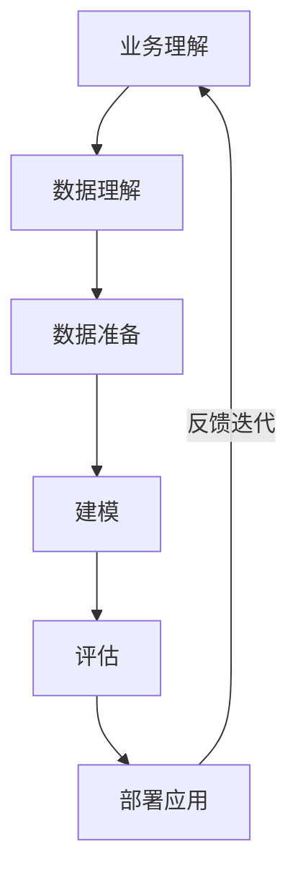
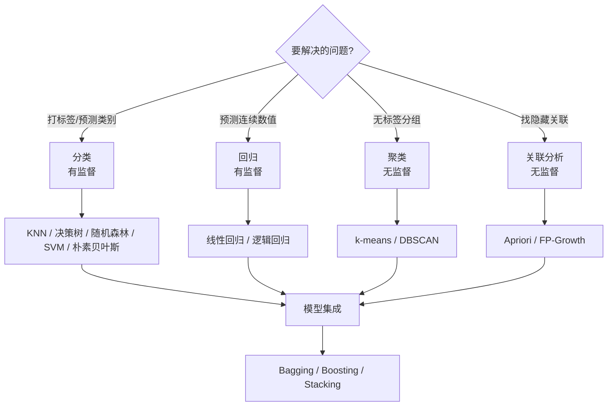

# 数据挖掘导论与流程

## 什么是数据挖掘？

如果非要给数据挖掘一个定义的话，那么**数据挖掘就是寻找数据中隐含的知识并用于产生商业价值**。也就是说，它是在数据中（尤其是在大量的数据中）找到一些有价值，甚至是非常有价值的东西的一种手段。

技术与商业就像一对双生子，在互相促进中不断演进发展，随之而来的就是各大公司业务突飞猛进，很多新模式也涌现出来，使得数据量激增。面对数以千万甚至上亿、不同形式的数据，很难再用纯人工或纯统计的方法从成千上万的变量中找到其隐含的价值。数据挖掘就提供了一系列框架、工具和方法，可以处理不同类型的大量数据，并使用复杂的算法部署去探索数据中的模式。

数据挖掘的产生动因主要有以下 3 点：

- **海量数据。** 随着互联网技术的发展，数据的生产、收集和存储越来越方便，海量数据因此产生。
- **维度众多。** 在一个多维度的数据中，每增加一个维度都会增加数据分析的复杂程度。
- **问题复杂。** 通常用数据挖掘解决的问题都比较复杂，很难用规则或简单的统计给出结果，而这恰恰是数据挖掘所擅长的。

## 数据挖掘解决哪几类问题？

### 1. 分类问题

分类问题是最常见的问题。比如新闻网站判断一条新闻是社会新闻还是时政新闻，就是分类问题——对已知类别的数据进行学习，为新的内容标注一个类别。

### 2. 聚类问题

聚类与分类不同，聚类的类别预先是不清楚的，目标就是要去发现这些类别。**聚类算法比较适合不确定的类别场景**。比如捡了一大堆不同的树叶回来，可以根据大小、形状、纹路、边缘等特征给树叶划分成几个较小的堆，每一堆属于同一种类。

### 3. 回归问题

回归问题可以看作高中学过的解线性方程组。它的最大特点是生成的结果是连续的，而不像分类和聚类生成的是离散结果。比如用回归方法预测房价（y），假设只跟面积（x）有关，构建的方程式就是 ax+b=y。

### 4. 关联问题

关联问题最常见的场景是**推荐**，比如购物时选中一个商品后往往会推荐其他商品组合，这种功能就可以使用关联挖掘来实现。

> 四大问题的具体算法（KNN、决策树、K-Means、线性回归、Apriori、TF-IDF 等）见 [数据挖掘算法合集](/docs/python/数据科学/06-算法与数据挖掘/01-数据挖掘算法合集)。

## 数据挖掘怎么做？—— CRISP-DM 流程

数据挖掘也是有方法论的。应用最多的 **CRISP-DM**（Cross-industry Standard Process for Data Mining，跨行业数据挖掘标准流程）方法论如下：

下面按流程逐步讲解每一环节的工作要点、常见误区与工程经验。

### 一、业务理解：明确要解决的问题

在开始任何挖掘工作前，先确保对**业务及其数据**有充分理解。数据挖掘归根到底要解决业务问题，脱离业务去做价值有限。

1. **避免对业务的轻视**：要像业务专家一样思考，在需求阶段与业务方充分沟通，发现偏差及时调整。
2. **明白可以为与不可以为**：技术绝非万能。数据不完美（真实性、完整性欠缺）、业务条件不完美（跨团队协作、周期有限），因此只能在有限资源下提供最大化方案。
3. **明确业务背景与目标**：以「自媒体作者贡献度评级」为例，业务背景是标题党泛滥，目标是对作者分级让有深度的评高、标题党降级，数据收集就要围绕这个点展开。
4. **把握数据**：对数据的认知分四个层级——是否有数据、有多少数据、是什么样的数据、是否有标签（有监督任务每条数据需标注）。

### 二、数据理解与准备：处理出干净的数据

数据准备是整个过程中**最耗时、最重要**的环节。原始数据存在不准确、格式多样、特征缺失、标准不统一等问题，需逐步加工到满足算法要求。

1. **找到数据**：数据分散在各业务部门、不同数据库中（MySQL、HBase、Hive、ES、Redis、图数据库等），收集后最好用统一 id 整合。
2. **数据探索（数据变多）**：对数据做分析、预处理、转换以构建更多特征。此阶段重在**升维**，发现异常值、偏差、缺失等问题。
3. **数据清洗（数据变少）**：包含 5 方面——缺失值处理（删除/补充/不处理）、异常值处理、数据偏差处理（均衡/补充）、数据标准化（统一单位维度）、特征选择（降维排除不相关维度）。
4. **构建训练集与测试集**：均衡数据直接随机抽样切分；非均衡数据用分层抽样。切分方法：留出法、交叉验证法、自助法。

> 数据准备不是一次性完成。模型训练、评估出现问题时，往往要**回到数据准备环节反复迭代**。

### 三、数据建模：选择适合需求的算法

算法很多，但要解决的问题有共同类型。先明确问题类型，再对应算法族。

- **分类**：给数据打明确标签，有监督。分二分类、多分类、多标签分类。
- **聚类**：无监督，没有已标注结果，仅根据数据特征分组。小组间有四种关系：互斥、相交、层次、模糊。
- **回归**：输出连续值，与分类相似但区别在输出（离散 vs 连续），二者可相互转化。
- **关联**：无监督，在已有数据中寻找相关模式，常用于销售分析、推荐系统。
- **模型集成**：实际问题常需多模型提升效果——Bagging（随机森林）、Boosting（XGBoost）、Stacking。

各算法原理与代码实现见 [数据挖掘算法合集](/docs/python/数据科学/06-算法与数据挖掘/01-数据挖掘算法合集)。

### 四、模型评估：确认模型是否达标

以「识别小猪图片」二分类为例，用 1000 张已标注图片测试，得到混淆矩阵：

| 样本 1000 份 | 模型预测：是 | 模型预测：否 |
| --- | --- | --- |
| 人工标注：是 | 745（TP） | 55（FN） |
| 人工标注：否 | 25（FP） | 175（TN） |

**核心评估指标**：

- **准确率（Accuracy）**：(TP+TN)/(TP+FP+FN+TN)=0.92，预测正确占比。
- **精确率（Precision）**：TP/(TP+FP)=0.9675，预测为「是」中正确比例。
- **召回率（Recall）**：TP/(TP+FN)=0.93，该类别数据中预测正确比例。
- **F 值**：精确率与召回率的调和平均。
- **ROC 曲线与 AUC**：调整判定概率阈值得到多组混淆矩阵，AUC 越大模型越稳定。

**泛化能力：过拟合与欠拟合**：

- **过拟合**：训练集好、测试集差，模型「死记硬背」。
- **欠拟合**：训练集和测试集都差，模型没学到基本规律。

处理方式：重新整理数据，分析数据量、维度、准确性，调整数据重训。

其他评估维度：模型速度、鲁棒性、可解释性。评估数据处理可用随机抽样、交叉验证、自助法消减随机误差。

### 五、模型应用：让模型解决业务需求

模型评估达标后进入应用环节，涵盖**部署、监控与迭代**：

1. **模型部署**：离线批量（定时任务，适合每日报表）、在线实时（API 服务，适合推荐/风控）。
2. **模型监控**：上线后模型效果会随数据分布变化而衰减（数据漂移），需持续监控准确率与业务指标，设置阈值告警。
3. **模型迭代**：业务需求变化或数据更新时，回到数据准备与建模环节重训。**数据挖掘是持续迭代的过程**，而非一次性项目。

## 总结

本章走通了数据挖掘从概念到落地的完整路径：

1. **导论**：数据挖掘定义、产生动因（海量/维度多/问题复杂）、四大问题类型（分类/聚类/回归/关联）。
2. **流程（CRISP-DM）**：业务理解 → 数据理解与准备（最耗时）→ 数据建模（识别问题类型选算法）→ 模型评估（混淆矩阵、准确率/精确率/召回率/F/AUC）→ 模型应用（部署/监控/迭代）。

算法原理与代码见 [数据挖掘算法合集](/docs/python/数据科学/06-算法与数据挖掘/01-数据挖掘算法合集)，实战项目见 [数据挖掘实践](/docs/python/数据科学/06-算法与数据挖掘/02-数据挖掘实践)。

## 版本差异（数据科学栈 → 当前版本）

| 库 | 本文编写时 | 当前稳定版 | 升级要点 |
|----|-----------|-----------|---------|
| Python | 3.8-3.12 | 3.14 | 3.12+ 起性能显著提升；3.14 PEP 649/750 |
| NumPy | 1.x/2.0 | 2.5.x | `np.float_` 等别名移除；NEP 50 类型提升 |
| Pandas | 1.x/2.x | 2.3.x | CoW 可经选项开启（3.0 起将默认）；`inplace` 将移除；`str` dtype 将为默认 |
| Matplotlib | 3.x | 3.x 稳定版 | API 兼容，样式更新 |
| Seaborn | 0.12/0.13 | 0.13.x | API 稳定 |
| scikit-learn | 1.x | 1.9.x | API 稳定，新算法持续加入 |

> 本文讲解的数据分析流程（读取→清洗→分析→可视化）与核心 API 在最新版本中成立；升级时重点关注 Pandas 3.0 的 Copy-on-Write 与 NumPy 2.x 的类型变化。
