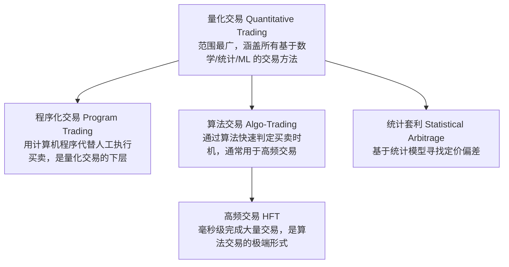
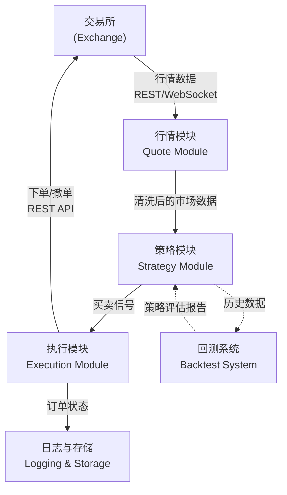
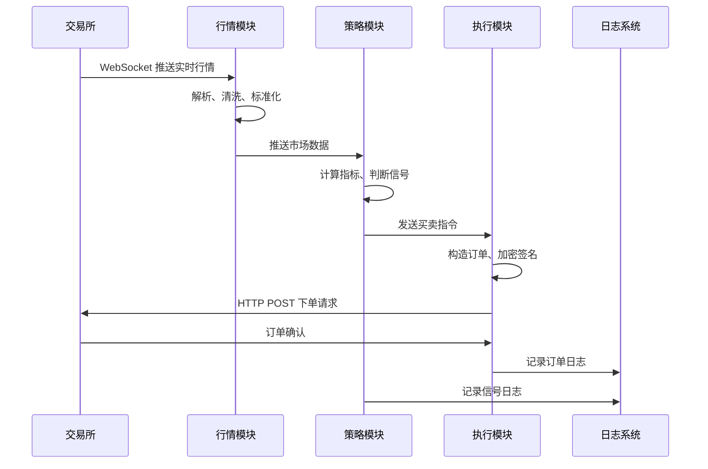
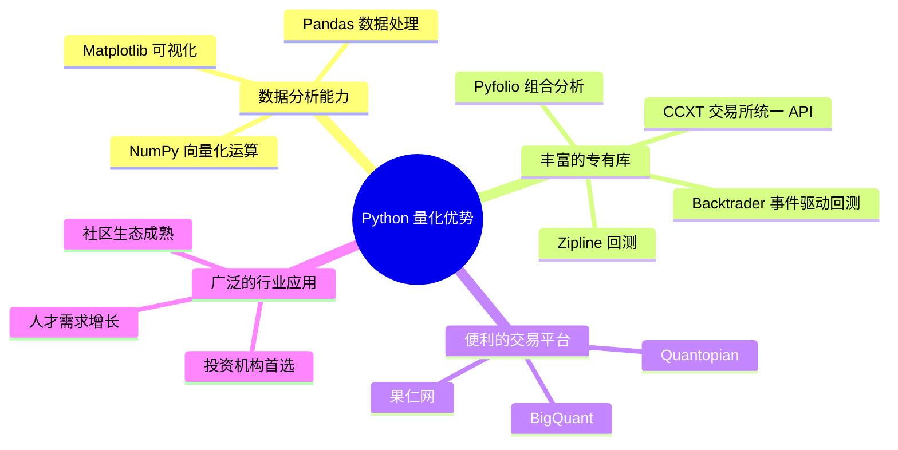
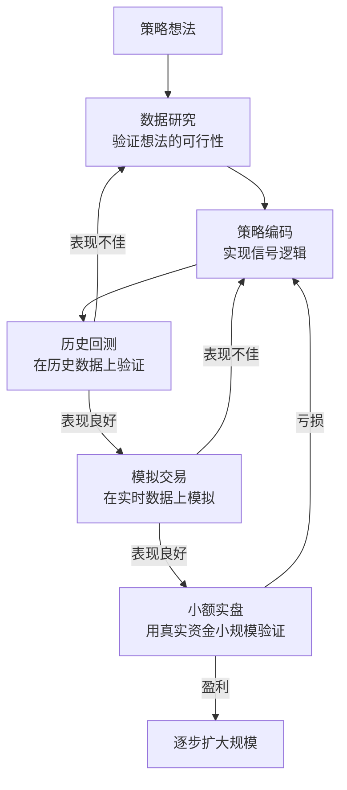

# 量化交易入门

量化交易（Quantitative Trading）是使用数学、统计和机器学习方法，系统性地寻找买卖时机并自动执行交易的领域。随着数据处理技术的发展和交易模型的成熟，从现金股票到数字货币，越来越多的市场正在朝自动化方向迈进。

本文从**概念辨析、系统架构、Python 生态、市场特点**四个维度，为 Python 开发者建立量化交易的系统性认知。

> 阅读提示

- 如果你只想知道"量化交易和程序化交易有什么区别"，直接看[核心概念辨析](#核心概念辨析)
- 如果你想理解一个交易系统由哪些模块组成，直接看[交易系统架构](#交易系统架构)
- 代码示例依赖 `requests`、`pandas`、`matplotlib`，建议在 Jupyter Notebook 中同步运行

## 核心概念辨析

量化交易领域有五个容易混淆的术语。它们不是同义词，而是**不同层次的抽象**：



| 术语 | 英文 | 一句话定义 | 关键特征 |
|------|------|-----------|---------|
| 量化交易 | Quantitative Trading | 使用数学/统计/ML 方法寻找买卖时机 | 涵盖范围最广，是统称 |
| 程序化交易 | Program Trading | 用计算机程序代替交易员执行买卖 | 关注执行层面，大单拆分 |
| 算法交易 | Algo-Trading | 通过算法快速判定买卖时间点 | 自动化决策，常用于高频 |
| 高频交易 | High Frequency Trading | 毫秒级完成大量交易 | 对延迟极度敏感，通常用 C++ |
| 统计套利 | Statistical Arbitrage | 基于统计模型寻找定价偏差 | 均值回归、配对交易等策略 |

> 实用建议：**不确定用哪个词时，用"量化交易"即可**——它的涵盖范围最大，不会出错。

## 交易系统架构

### 核心模块

一个基本的量化交易系统由四个核心模块组成：



### 模块职责详解

| 模块 | 输入 | 输出 | 核心职责 |
|------|------|------|---------|
| **行情模块** | 交易所行情接口 | 标准化市场数据 | 获取实时行情、处理数据格式、维护 OrderBook 缓存 |
| **策略模块** | 市场数据 | 买卖信号 | 计算技术指标、根据策略逻辑生成买卖决策 |
| **执行模块** | 买卖信号 | 订单请求 | 封装订单请求、管理 API 认证、监督订单执行状态 |
| **回测系统** | 历史数据 + 策略 | 策略评估报告 | 模拟历史交易、计算收益率/夏普比率/最大回撤 |
| **日志存储** | 所有模块事件 | 持久化记录 | 记录交易流水、存储行情数据、支持离线分析 |

### 数据流图



## Python 在量化交易中的优势

### 四大核心优势



### 数据分析实战：获取并绘制 BTC 价格曲线

```python
import matplotlib.pyplot as plt
import pandas as pd
import requests

# 通过 HTTP 抓取 BTC 历史价格数据（OHLC 格式）
# 注：早期课程使用的 api.cryptowat.ch 已于 2023 年随 Cryptowatch 停运而关闭，
# 这里改用其官方推荐的迁移目标——Kraken 公共行情 API
interval = '60'  # 时间粒度：60 分钟 = 1 小时
resp = requests.get(
    'https://api.kraken.com/0/public/OHLC',
    params={'pair': 'XBTUSD', 'interval': interval}
)
data = resp.json()

# 转换为 Pandas DataFrame（Kraken 返回字段：时间戳、开、高、低、收、VWAP、量、笔数）
result = data['result']
pair_key = [k for k in result if k != 'last'][0]
df = pd.DataFrame(
    result[pair_key],
    columns=[
        'CloseTime', 'OpenPrice', 'HighPrice',
        'LowPrice', 'ClosePrice', 'VWAP', 'Volume', 'Count'
    ]
)

# 将时间戳转为可读格式，价格转为数值类型（API 返回的是字符串）
df['CloseTime'] = pd.to_datetime(df['CloseTime'], unit='s')
for col in ['OpenPrice', 'HighPrice', 'LowPrice', 'ClosePrice']:
    df[col] = df[col].astype(float)

print(df.head())
print(f"\n数据范围: {df['CloseTime'].min()} ~ {df['CloseTime'].max()}")
print(f"共 {len(df)} 条记录")

# 绘制 BTC 价格曲线
df.set_index('CloseTime')['ClosePrice'].plot(
    figsize=(14, 7),
    title='BTC/USD 价格走势 (Kraken 交易所)',
    ylabel='价格 (USD)',
    grid=True
)
plt.tight_layout()
plt.show()
```

### 量化交易常用库速查

| 库 | 用途 | 推荐指数 |
|------|------|---------|
| NumPy | 数值计算、向量化运算 | ⭐⭐⭐⭐⭐ |
| Pandas | 数据处理、时间序列分析 | ⭐⭐⭐⭐⭐ |
| Matplotlib / Plotly | 数据可视化 | ⭐⭐⭐⭐⭐ |
| CCXT | 统一访问 100+ 交易所 API | ⭐⭐⭐⭐ |
| Zipline | 事件驱动回测框架 | ⭐⭐⭐⭐ |
| Backtrader | 功能全面的回测框架 | ⭐⭐⭐⭐ |
| TA-Lib | 技术分析指标库 | ⭐⭐⭐ |
| Pyfolio | 投资组合分析 | ⭐⭐⭐ |

## 数字货币市场特点

与传统股票市场相比，数字货币市场有其独特性，这些特性直接影响量化策略的设计：

| 特性 | 股票市场 | 数字货币市场 | 对策略的影响 |
|------|---------|------------|------------|
| 交易时间 | 有开盘/收盘限制 | 7×24 小时不间断 | 需要全天候运行，不能有"收盘后"的假设 |
| 交易所数量 | 每支股票在少数交易所 | 同币种在数十个交易所同时交易 | 存在跨交易所套利机会 |
| 市场联动 | 相对独立 | 全球市场紧密联动 | 局部事件（如政策变化）会瞬间影响所有市场 |
| 波动性 | 相对稳定（日波动 1-3%） | 极高（日波动 5-20% 常见） | 止损策略必须更加严格 |
| 监管 | 成熟、严格 | 碎片化、快速演变 | 合规风险需要持续关注 |
| 手续费 | 较低（万分之一级别） | 较高（千分之一到千分之三） | 高频策略必须考虑手续费摩擦 |

### 波动性对比

```python
import numpy as np

# 模拟日收益率对比
# 股票典型日波动率: ~1.5%
# 比特币典型日波动率: ~5-8%
stock_daily_vol = 0.015
btc_daily_vol = 0.06

# 年化波动率 (假设 252 个交易日)
stock_annual_vol = stock_daily_vol * np.sqrt(252)
btc_annual_vol = btc_daily_vol * np.sqrt(365)  # 数字货币全年交易

print(f"股票年化波动率:   {stock_annual_vol:.1%}")
print(f"比特币年化波动率: {btc_annual_vol:.1%}")
print(f"比特币波动是股票的 {btc_annual_vol/stock_annual_vol:.1f} 倍")
```

## 量化交易平台

### 平台对比

| 平台 | 类型 | 市场 | 特点 |
|------|------|------|------|
| Quantopian | 在线回测平台 | 美股 | 基于 Zipline，社区策略分享，已停止运营但代码开源 |
| BigQuant | 在线平台 | A 股/期货 | 拖拽式策略开发 + Python 编程，国内用户友好 |
| 果仁网 | 在线平台 | A 股 | 面向散户投资者，策略模板丰富 |
| VnPy | 开源框架 | A 股/期货/数字货币 | 国内最流行的开源量化框架，对接 CTP 等国内接口 |
| FreqTrade | 开源框架 | 数字货币 | 用 Python 编写的加密货币交易机器人 |

### 自建 vs 平台对比

| 维度 | 使用在线平台 | 自建系统 |
|------|------------|---------|
| 上手难度 | 低（注册即用） | 高（需搭建全套基础设施） |
| 灵活性 | 受限（平台限制） | 完全自由 |
| 数据源 | 平台提供 | 需自行对接 |
| 执行延迟 | 依赖平台 | 可优化到极致 |
| 成本 | 免费或订阅费 | 服务器 + 开发时间 |
| 适用阶段 | 学习、策略验证 | 实盘交易、高频策略 |

## 策略开发流程



> **关键原则**：回测赚钱 ≠ 实盘赚钱。回测中常见的陷阱包括：未来函数（使用了当时未知的数据）、过度拟合（参数过多导致只拟合历史噪声）、忽略交易成本（手续费、滑点）。

## 常见问题

**Q: 高频交易和中低频交易，哪个更适合使用 Python？**

A: 中低频交易更适合 Python。Python 的优势在于快速开发和数据分析，劣势在于执行速度。高频交易（毫秒级）通常使用 C++，因为 Python 的解释器开销和 GIL 限制不适合微秒级延迟要求。中低频策略（分钟级/小时级），Python 的生态系统（Pandas、NumPy）提供了巨大的生产力优势。

**Q: 量化交易需要多少启动资金？**

A: 数字货币市场门槛较低，几百美元即可开始（但需注意最小交易量限制）。股票市场因 A 股至少 1 手（100 股）的要求，建议至少 1-5 万元。量化交易重点不是初始资金，而是策略的长期正期望值。

**Q: 量化交易能稳定盈利吗？**

A: 量化交易不是"稳赚不赔"的魔法。它只是用系统化的方法替代情绪化决策。长期盈利的前提是：策略有真正的统计优势（而非过拟合）、严格的风险管理、持续的策略迭代。大多数量化基金的年化收益率在 10-30% 之间，且伴随着显著的回撤。

## 术语表

| 术语 | 英文 | 定义 |
|------|------|------|
| 量化交易 | Quantitative Trading | 使用数学、统计和机器学习方法系统性寻找交易机会的领域 |
| 程序化交易 | Program Trading | 用计算机程序执行交易，替代人工下单 |
| 算法交易 | Algo-Trading | 通过算法自动判定买卖时机并执行 |
| 高频交易 | High Frequency Trading | 在极短时间内完成大量交易的策略，对延迟要求极高 |
| 回测 | Backtesting | 用历史数据模拟策略执行，评估策略表现 |
| 夏普比率 | Sharpe Ratio | 风险调整后的收益率指标，衡量每单位风险获得的超额回报 |
| 最大回撤 | Max Drawdown | 策略净值从峰值到谷底的最大跌幅 |
| 滑点 | Slippage | 预期成交价与实际成交价之间的差额 |
| 市价单 | Market Order | 以当前市价立即成交的订单 |
| 限价单 | Limit Order | 指定价格，只有达到该价格才成交的订单 |

## 延伸阅读

- [Pandas 与 NumPy 策略回测](/docs/python/数据科学/07-量化金融/02-Pandas与NumPy策略回测) — 用 Pandas 搭建向量化回测框架
- [RESTful 与 Socket 交易执行](/docs/python/数据科学/07-量化金融/05-RESTful与Socket交易执行) — 通过 API 实现自动化下单
- [行情数据对接与 WebSocket](/docs/python/数据科学/07-量化金融/07-行情数据对接与WebSocket) — 实时行情数据抓取

## 版本差异（数据科学栈 → 当前版本）

| 库 | 本文编写时 | 当前稳定版 | 升级要点 |
|----|-----------|-----------|---------|
| Python | 3.8-3.12 | 3.14 | 3.12+ 起性能显著提升；3.14 PEP 649/750 |
| NumPy | 1.x/2.0 | 2.5.x | `np.float_` 等别名移除；NEP 50 类型提升 |
| Pandas | 1.x/2.x | 2.3.x | CoW 可经选项开启（3.0 起将默认）；`inplace` 将移除；`str` dtype 将为默认 |
| Matplotlib | 3.x | 3.x 稳定版 | API 兼容，样式更新 |
| Seaborn | 0.12/0.13 | 0.13.x | API 稳定 |
| scikit-learn | 1.x | 1.9.x | API 稳定，新算法持续加入 |

> 本文讲解的数据分析流程（读取→清洗→分析→可视化）与核心 API 在最新版本中成立；升级时重点关注 Pandas 3.0 的 Copy-on-Write 与 NumPy 2.x 的类型变化。
