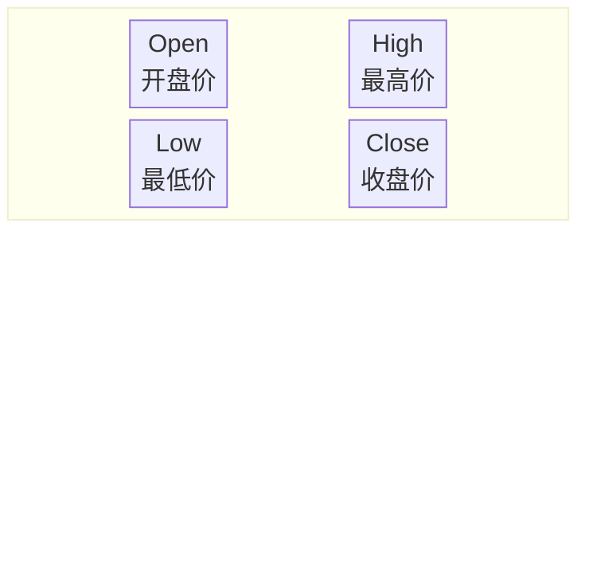
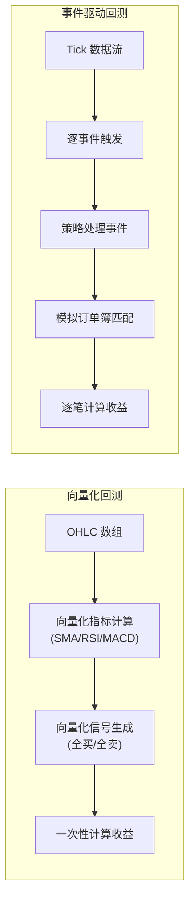
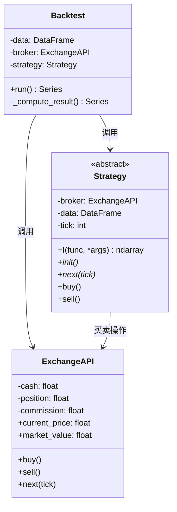
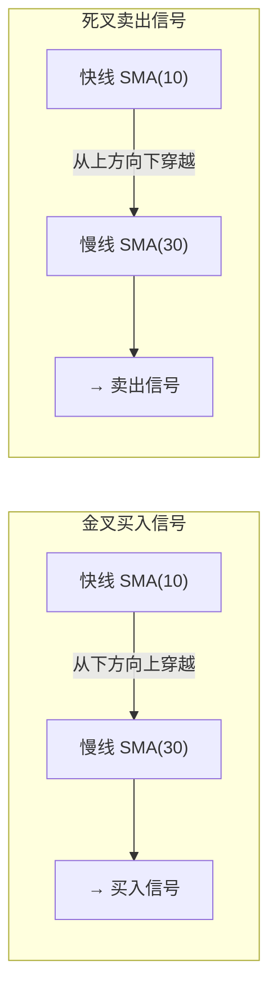
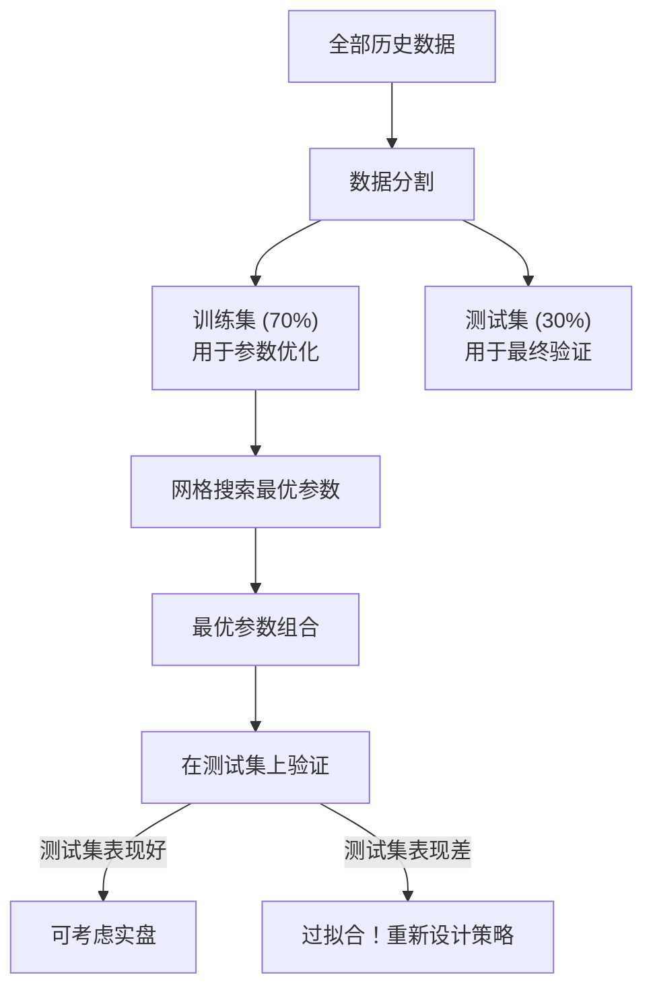

# Pandas 与 NumPy 策略回测

回测（Backtesting）是量化策略开发的核心环节——用历史数据模拟策略执行，评估其表现。本文从**数据格式、回测框架设计、策略实现、模拟交易到性能评估**，用 Pandas 和 NumPy 从零搭建一个完整的向量化回测系统。

> 阅读提示

- 如果你只想了解回测的核心概念，直接看[回测框架分类](#回测框架分类)和[性能评估指标](#性能评估指标)
- 如果你想动手搭建回测系统，建议按顺序阅读，每段代码都可以直接运行
- 本文代码依赖 `pandas`、`numpy`，建议在 Jupyter Notebook 中同步实验

## 数据基础：OHLCV

### K 线（蜡烛图）

K 线是金融领域最通用的价格表示方式。每个"蜡烛"记录了给定时间段内的四个关键价格：



| 字段 | 英文 | 含义 | 计算方式 |
|------|------|------|---------|
| **O** | Open | 开盘价 | 时间段内的第一个成交价 |
| **H** | High | 最高价 | 时间段内的最高成交价 |
| **L** | Low | 最低价 | 时间段内的最低成交价 |
| **C** | Close | 收盘价 | 时间段内的最后一个成交价 |
| **V** | Volume | 成交量 | 时间段内的总成交量 |

### 从 Tick 到 K 线

K 线数据是通过聚合底层 tick 数据生成的：

```
Tick 数据（每笔交易） → 分钟 K 线 → 小时 K 线 → 日 K 线 → 周 K 线
```

以小时 K 线为例：从 10:00 开始积累 tick 数据，以第一个交易作为 Open，11:00 前的最后一笔作为 Close，这一小时内的最高/最低成交价作为 High/Low，总成交量作为 Volume。

### 数据读取与校验

```python
import pandas as pd
import numpy as np
from os import path


def assert_msg(condition, msg):
    """自定义断言，抛出带信息的异常"""
    if not condition:
        raise Exception(msg)


def read_file(filename):
    """读取 CSV 格式的 OHLCV 数据并返回 DataFrame"""
    filepath = path.join(path.dirname(__file__), filename)

    # 判定文件是否存在
    assert_msg(path.exists(filepath), f"文件不存在: {filepath}")

    # 读取 CSV 文件
    df = pd.read_csv(
        filepath,
        index_col=0,              # 第一列作为索引（通常是日期）
        parse_dates=True          # 自动解析日期（pandas 2.x 起自动推断格式，无需 infer_datetime_format）
    )

    # 验证必要列存在
    required_cols = {'Open', 'High', 'Low', 'Close'}
    missing = required_cols - set(df.columns)
    assert_msg(len(missing) == 0, f"缺少必要列: {missing}")

    # 验证无缺失值
    assert_msg(
        not df[['Open', 'High', 'Low', 'Close']].max().isnull().any(),
        'OHLC 数据包含缺失值，请清洗后再使用'
    )

    # 确保按时间升序排列
    if not df.index.is_monotonic_increasing:
        df = df.sort_index()

    return df


# 使用示例
# BTCUSD = read_file('BTCUSD_GEMINI.csv')
# print(BTCUSD.head())
```

## 回测框架分类

### 两种回测范式

| 维度 | 向量化回测 | 事件驱动回测 |
|------|----------|------------|
| **原理** | 对 OHLC 数组进行向量运算，一次性计算所有信号 | 针对每个 tick/orderbook 变动生成事件，逐个处理 |
| **速度** | 快（利用 NumPy 向量化） | 慢（逐事件循环） |
| **精度** | 粗糙（只用 OHLC，忽略盘口深度） | 精细（可模拟真实市场微观结构） |
| **灵活性** | 低（策略受限于 OHLC 数据） | 高（可处理任意复杂逻辑） |
| **代表框架** | 自建 Pandas 回测 | Zipline、Backtrader、PyAlgoTrade |
| **适用场景** | 策略初筛、参数优化 | 实盘前最终验证 |



> 本文选择向量化回测——它是学习回测原理的最佳起点，也是快速验证策略想法的实用工具。

## 回测框架设计

### 架构概览

回测框架由三个核心类组成：



### Backtest 主类

```python
from numbers import Number


class Backtest:
    """
    向量化回测引擎。

    参数:
        data:           OHLCV 历史数据
        strategy_type:  策略类（Strategy 的子类）
        broker_type:    交易所模拟类（ExchangeAPI 的子类）
        cash:           初始资金
        commission:     手续费率（如 0.002 表示千分之二）
    """

    def __init__(self,
                 data: pd.DataFrame,
                 strategy_type: type,
                 broker_type: type,
                 cash: float = 10000,
                 commission: float = .0):
        # 类型校验
        assert_msg(issubclass(strategy_type, Strategy),
                   'strategy_type 必须是 Strategy 的子类')
        assert_msg(issubclass(broker_type, ExchangeAPI),
                   'broker_type 必须是 ExchangeAPI 的子类')
        assert_msg(isinstance(commission, Number),
                   'commission 必须是数值类型')

        data = data.copy(False)

        # 如果没有 Volume 列，填充 NaN
        if 'Volume' not in data:
            data['Volume'] = np.nan

        # 验证 OHLC 数据格式
        required = {'Open', 'High', 'Low', 'Close', 'Volume'}
        assert_msg(
            len(data.columns & required) == 5,
            f"数据格式不正确，至少需要包含: {required}"
        )

        # 初始化交易所和策略
        self._data = data
        self._broker = broker_type(data, cash, commission)
        self._strategy = strategy_type(self._broker, self._data)
        self._results = None

    def run(self):
        """运行回测，迭代历史数据并返回结果"""
        strategy = self._strategy
        broker = self._broker

        # 策略初始化（计算指标）
        strategy.init()

        # 回测主循环
        start = 100  # 跳过前 100 条数据（留给指标计算足够的 warm-up）
        end = len(self._data)

        for i in range(start, end):
            broker.next(i)       # 更新市场价格到第 i 时刻
            strategy.next(i)     # 策略根据第 i 时刻的市场做决策

        # 计算并返回结果
        self._results = self._compute_result(broker)
        return self._results

    def _compute_result(self, broker):
        """汇总回测结果"""
        result = pd.Series(dtype=float)
        result['初始市值'] = broker.initial_cash
        result['结束市值'] = broker.market_value
        result['收益'] = broker.market_value - broker.initial_cash
        result['收益率'] = (broker.market_value / broker.initial_cash - 1)
        return result
```

### 策略抽象基类

```python
import abc
from typing import Callable


class Strategy(metaclass=abc.ABCMeta):
    """
    策略抽象基类。所有具体策略必须继承此类并实现 init() 和 next()。

    使用方式:
        class MyStrategy(Strategy):
            def init(self):
                # 计算指标
                self.sma = self.I(SMA, self.data.Close, 20)

            def next(self, tick):
                # 根据指标决定买卖
                if 买入条件:
                    self.buy()
                elif 卖出条件:
                    self.sell()
    """

    def __init__(self, broker, data):
        self._indicators = []
        self._broker = broker
        self._data = data
        self._tick = 0

    def I(self, func: Callable, *args) -> np.ndarray:
        """
        计算指标向量。指标是一个与历史数据等长的数组。

        示例:
            self.sma = self.I(utils.SMA, self.data.Close, 20)
        """
        value = func(*args)
        value = np.asarray(value)
        assert_msg(
            value.shape[-1] == len(self._data.Close),
            f'指标长度 ({value.shape[-1]}) 必须与数据长度 ({len(self._data.Close)}) 相同'
        )
        self._indicators.append(value)
        return value

    @property
    def tick(self):
        return self._tick

    @abc.abstractmethod
    def init(self):
        """初始化策略。在回测开始时调用一次，用于计算指标。"""
        pass

    @abc.abstractmethod
    def next(self, tick):
        """
        步进函数。在每个时间点调用，根据当前市场状态决定买卖。

        参数:
            tick: 当前时间索引，data[tick] 可访问当前市场数据
        """
        pass

    def buy(self):
        """买入信号：用全部现金按市价买入"""
        self._broker.buy()

    def sell(self):
        """卖出信号：卖出全部持仓"""
        self._broker.sell()

    @property
    def data(self):
        return self._data
```

## 交易策略：移动均线交叉

### SMA 原理

简单移动平均（Simple Moving Average, SMA）是对价格序列的平滑处理：

$$SMA_t = \frac{1}{n}\sum_{i=0}^{n-1} Price_{t-i}$$

- **小窗口 SMA**（如 10）：反应快，紧跟价格变化
- **大窗口 SMA**（如 30）：反应慢，代表长期趋势

### 交叉信号



### 工具函数

```python
def SMA(values, n):
    """计算简单移动平均"""
    return pd.Series(values).rolling(n).mean()


def crossover(series1, series2) -> bool:
    """
    检测 series1 是否在最后一个位置从下方向上穿越 series2。

    判断逻辑:
        series1[-2] < series2[-2]  # 前一刻: series1 在 series2 下方
        series1[-1] > series2[-1]  # 当前刻: series1 在 series2 上方
        → 发生了上穿
    """
    return series1[-2] < series2[-2] and series1[-1] > series2[-1]
```

### 策略实现

```python
class SmaCross(Strategy):
    """移动均线交叉策略"""

    # 小窗口 SMA 的窗口大小（快线）
    fast = 10

    # 大窗口 SMA 的窗口大小（慢线）
    slow = 20

    def init(self):
        # 预计算历史上每个时刻的快线和慢线
        self.sma1 = self.I(SMA, self.data.Close, self.fast)
        self.sma2 = self.I(SMA, self.data.Close, self.slow)

    def next(self, tick):
        # 快线上穿慢线 → 金叉 → 买入
        if crossover(self.sma1[:tick], self.sma2[:tick]):
            self.buy()

        # 慢线上穿快线 → 死叉 → 卖出
        elif crossover(self.sma2[:tick], self.sma1[:tick]):
            self.sell()

        # 否则持仓不动
        else:
            pass
```

## 模拟交易引擎

### ExchangeAPI 实现

```python
class ExchangeAPI:
    """
    模拟交易所，负责维护账户状态和执行模拟交易。

    简化假设:
        - 使用 Close 价格作为当前市价
        - 买卖使用全部资金/仓位
        - 市场容量足够大，订单立即完全成交
    """

    def __init__(self, data, cash, commission):
        assert_msg(cash > 0, f"初始现金必须大于 0，当前: {cash}")
        assert_msg(
            0 <= commission <= 0.05,
            f"手续费率应在 0~5% 之间，当前: {commission}"
        )
        self._initial_cash = cash
        self._data = data
        self._commission = commission
        self._position = 0.0   # 当前持仓数量
        self._cash = cash       # 当前现金
        self._i = 0             # 当前时间索引

    # ---- 属性 ----
    @property
    def cash(self):
        return self._cash

    @property
    def position(self):
        return self._position

    @property
    def initial_cash(self):
        return self._initial_cash

    @property
    def current_price(self):
        """当前市场价格（使用 Close 价格）"""
        return self._data.Close[self._i]

    @property
    def market_value(self):
        """当前总市值 = 现金 + 持仓市值"""
        return self._cash + self._position * self.current_price

    # ---- 交易操作 ----
    def buy(self):
        """
        用当前账户全部现金，按市价买入。

        买入数量 = 现金 / (价格 × (1 + 手续费率))
        """
        self._position = float(
            self._cash / (self.current_price * (1 + self._commission))
        )
        self._cash = 0.0

    def sell(self):
        """
        卖出当前账户全部持仓。

        卖出收益 = 持仓数量 × 价格 × (1 - 手续费率)
        """
        self._cash += float(
            self._position * self.current_price * (1 - self._commission)
        )
        self._position = 0.0

    def next(self, tick):
        """推进到下一个时间点"""
        self._i = tick
```

### 手续费的影响

手续费看似微不足道，但对高频策略有毁灭性影响：

```python
# 模拟手续费对策略收益的影响
# 假设每次交易手续费率为千分之三 (0.3%)

# 如果每天交易 1 次，一年 365 次
daily_trades = 1
annual_trades = 365
commission_rate = 0.003

# 每次买卖都要交手续费（买入 + 卖出 = 2 次）
annual_commission_cost = (1 + commission_rate) ** (annual_trades * 2) - 1
print(f"年化手续费损耗: {annual_commission_cost:.1%}")
# 典型输出: 年化手续费损耗: ~800%

# 结论：高频策略必须严格控制交易频率和手续费
```

## 回测运行与结果分析

### 运行回测

```python
def main():
    # 读取数据
    BTCUSD = read_file('BTCUSD_GEMINI.csv')

    # 手续费率为 0 的回测（理想情况）
    print("=" * 40)
    print("手续费率: 0%")
    print("=" * 40)
    ret_no_fee = Backtest(BTCUSD, SmaCross, ExchangeAPI,
                           cash=10000.0, commission=0.00).run()
    print(ret_no_fee)

    # 手续费率为千分之三的回测（接近真实情况）
    print("\n" + "=" * 40)
    print("手续费率: 0.3%")
    print("=" * 40)
    ret_with_fee = Backtest(BTCUSD, SmaCross, ExchangeAPI,
                            cash=10000.0, commission=0.003).run()
    print(ret_with_fee)


if __name__ == '__main__':
    main()
```

### 典型输出与分析

> 以下输出为在某段历史行情数据（BTCUSD_GEMINI 示例数据，未随文提供）上运行得到的**示例结果**，仅用于说明手续费对收益的量级影响，实际数值取决于数据区间与参数，不可直接复现。

```
========================================
手续费率: 0%
========================================
初始市值     10000.000000
结束市值    576361.772884
收益        566361.772884
收益率           56.636177

========================================
手续费率: 0.3%
========================================
初始市值     10000.000000
结束市值      2036.562001
收益        -7963.437999
收益率           -0.796344
```

这个对比揭示了回测中最关键的教训：

| 观察 | 分析 |
|------|------|
| 零手续费收益惊人（57 倍） | 说明策略信号本身有一定有效性 |
| 加入手续费后直接亏损 80% | 手续费摩擦吃掉了所有利润 |
| 为什么差距这么大？ | SMA 交叉策略交易频率高，每次买卖都交手续费，复利损耗巨大 |

### 回测的局限性

回测结果需要谨慎解读，因为存在以下简化假设：

| 简化假设 | 现实情况 | 影响 |
|---------|---------|------|
| 订单立即完全成交 | 可能存在部分成交或无法成交 | 高估策略容量 |
| 不影响市场价格 | 大单会推动价格 | 高估收益 |
| 使用 Close 价格 | 实际成交价可能偏离 Close | 忽略滑点 |
| 无限市场深度 | 盘口深度有限 | 忽略流动性风险 |

> **核心原则**：回测永远赚钱 ≠ 实盘能赚钱。永远在实盘前用模拟交易（Paper Trading）验证。

## 性能评估指标

### 核心指标

| 指标 | 公式 | 含义 | 好策略的标准 |
|------|------|------|------------|
| 总收益率 | `(最终资产/初始资产) - 1` | 策略整体盈利能力 | > 0（正收益） |
| 年化收益率 | `(1+总收益率)^(365/交易天数) - 1` | 标准化到年度 | > 无风险利率 |
| 夏普比率 | `√252 × 日均收益 / 收益标准差` | 风险调整后收益 | > 1.0 可接受，> 2.0 优秀 |
| 最大回撤 | `min((净值-历史峰值)/历史峰值)` | 最大亏损幅度 | < 20%（取决于风险偏好） |
| 胜率 | `盈利交易数 / 总交易数` | 交易准确率 | > 50%（但非绝对，低胜率+高盈亏比也可盈利） |
| 盈亏比 | `平均盈利 / 平均亏损` | 盈利质量 | > 1.5 |

### 计算示例

```python
def compute_metrics(portfolio_values, trades, risk_free_rate=0.03):
    """
    计算策略的核心性能指标。

    参数:
        portfolio_values: 每个时间点的总市值序列
        trades: 交易记录列表 [{'type': 'buy', 'price': ..., 'date': ...}, ...]
        risk_free_rate: 无风险利率（默认 3%）
    """
    values = pd.Series(portfolio_values)
    returns = values.pct_change().dropna()

    # 总收益率
    total_return = values.iloc[-1] / values.iloc[0] - 1

    # 年化收益率
    days = len(returns)
    annual_return = (1 + total_return) ** (365 / days) - 1

    # 夏普比率
    excess_returns = returns - risk_free_rate / 365
    sharpe = np.sqrt(365) * excess_returns.mean() / returns.std() \
        if returns.std() > 0 else 0

    # 最大回撤
    cumulative = (1 + returns).cumprod()
    running_max = cumulative.expanding().max()
    drawdown = (cumulative - running_max) / running_max
    max_drawdown = drawdown.min()

    # 胜率
    if trades:
        # 配对买卖来计算每笔交易的盈亏
        winning_trades = 0
        for i in range(0, len(trades) - 1, 2):
            if i + 1 < len(trades):
                buy = trades[i]
                sell = trades[i + 1]
                if sell['price'] > buy['price']:
                    winning_trades += 1
        win_rate = winning_trades / (len(trades) // 2) if len(trades) >= 2 else 0
    else:
        win_rate = 0

    return {
        '总收益率': f'{total_return:.2%}',
        '年化收益率': f'{annual_return:.2%}',
        '夏普比率': f'{sharpe:.2f}',
        '最大回撤': f'{max_drawdown:.2%}',
        '胜率': f'{win_rate:.2%}',
        '交易次数': len(trades)
    }
```

## 策略优化要点

### 参数优化

```python
# 网格搜索最优 SMA 窗口组合
results = []
for fast in range(5, 31, 5):
    for slow in range(fast + 10, 61, 10):
        # 动态修改策略参数
        SmaCross.fast = fast
        SmaCross.slow = slow

        ret = Backtest(BTCUSD, SmaCross, ExchangeAPI,
                       cash=10000.0, commission=0.002).run()

        results.append({
            'fast': fast,
            'slow': slow,
            'return': ret['收益率']
        })

# 找出最优参数组合
best = max(results, key=lambda x: x['return'])
print(f"最优参数: fast={best['fast']}, slow={best['slow']}")
print(f"最优收益率: {best['return']:.2%}")
```

### 过拟合防范

| 方法 | 说明 |
|------|------|
| **样本外测试** | 将数据分为训练集（70%）和测试集（30%），只在训练集上优化参数 |
| **交叉验证** | 在多个不重叠的时间段上验证策略稳定性 |
| **简化策略** | 参数越少越好——参数越多，过拟合风险越大 |
| **向前分析** | 用滚动窗口：每次用过去 N 天数据优化参数，在未来 M 天测试 |



## 常见问题

**Q: 为什么回测结果很好但实盘亏损？**

A: 最常见的原因：① 过拟合（参数太多，只拟合了历史噪声）；② 未来函数（策略使用了当时未知的数据）；③ 忽略交易成本（手续费、滑点、市场冲击）；④ 生存偏差（只用了现在还活着的股票/币种）。

**Q: 向量化回测和事件驱动回测怎么选？**

A: 策略初筛阶段用向量化回测（快，可以快速验证大量想法），实盘前验证用事件驱动回测（准，模拟真实市场微观结构）。

**Q: 手续费率设多少合适？**

A: 数字货币交易所通常 0.1%-0.3%（千分之一到千分之三），股票通常 0.01%-0.03%（万分之一到万分之三）。始终使用略高于实际费率的数值做保守估计。

## 术语表

| 术语 | 英文 | 定义 |
|------|------|------|
| K 线 | Candlestick / OHLCV | 记录开盘价、最高价、最低价、收盘价和成交量的价格表示方式 |
| SMA | Simple Moving Average | 简单移动平均，对过去 N 个价格求算术平均 |
| 金叉 | Golden Cross | 短期均线上穿长期均线，通常被视为买入信号 |
| 死叉 | Death Cross | 短期均线下穿长期均线，通常被视为卖出信号 |
| 向量化回测 | Vectorized Backtesting | 对 OHLC 数组进行向量运算的一次性回测方式 |
| 事件驱动回测 | Event-Driven Backtesting | 逐事件处理、模拟真实市场微观结构的回测方式 |
| 过拟合 | Overfitting | 策略参数过多，只拟合了历史噪声而无法泛化到未来 |
| 滑点 | Slippage | 预期成交价与实际成交价之间的差额 |

## 延伸阅读

- [量化交易入门](/docs/python/数据科学/07-量化金融/01-量化交易入门) — 交易系统架构与基本概念
- [行情数据对接与 WebSocket](/docs/python/数据科学/07-量化金融/07-行情数据对接与WebSocket) — 原始行情数据获取
- [RESTful 与 Socket 交易执行](/docs/python/数据科学/07-量化金融/05-RESTful与Socket交易执行) — 自动化下单实战

## 版本差异（数据科学栈 → 当前版本）

| 库 | 本文编写时 | 当前稳定版 | 升级要点 |
|----|-----------|-----------|---------|
| Python | 3.8-3.12 | 3.14 | 3.12+ 起性能显著提升；3.14 PEP 649/750 |
| NumPy | 1.x/2.0 | 2.5.x | `np.float_` 等别名移除；NEP 50 类型提升 |
| Pandas | 1.x/2.x | 2.3.x | CoW 可经选项开启（3.0 起将默认）；`inplace` 将移除；`str` dtype 将为默认 |
| Matplotlib | 3.x | 3.x 稳定版 | API 兼容，样式更新 |
| Seaborn | 0.12/0.13 | 0.13.x | API 稳定 |
| scikit-learn | 1.x | 1.9.x | API 稳定，新算法持续加入 |

> 本文讲解的数据分析流程（读取→清洗→分析→可视化）与核心 API 在最新版本中成立；升级时重点关注 Pandas 3.0 的 Copy-on-Write 与 NumPy 2.x 的类型变化。
