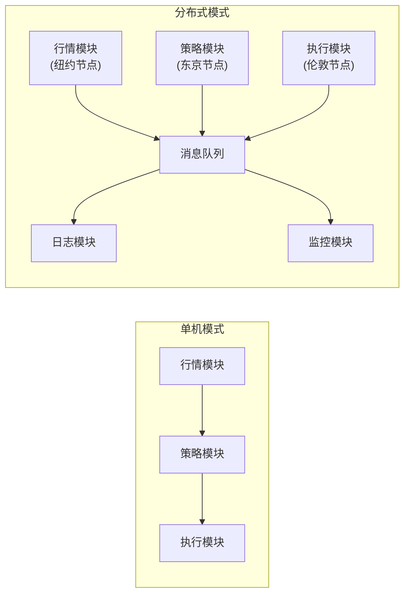
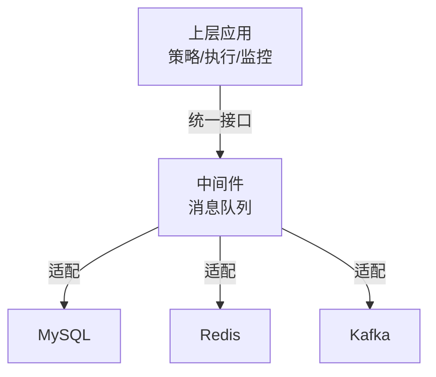
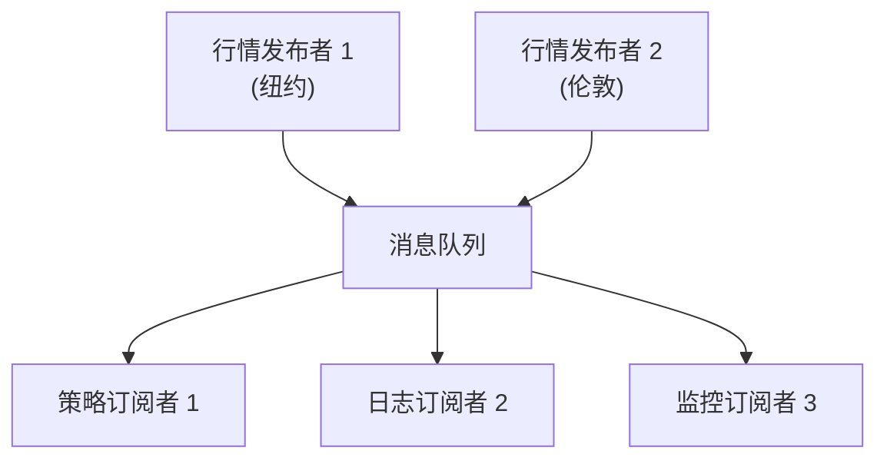
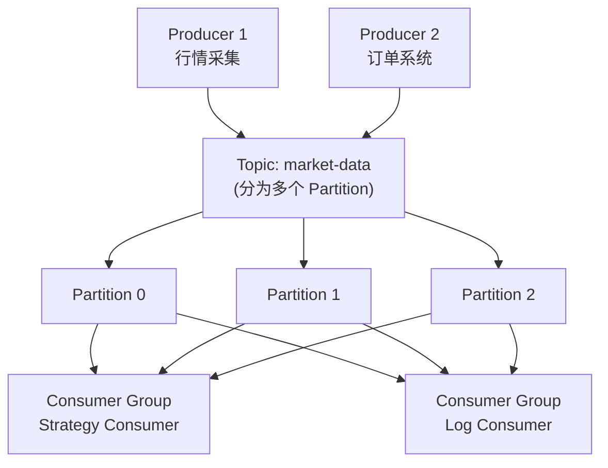
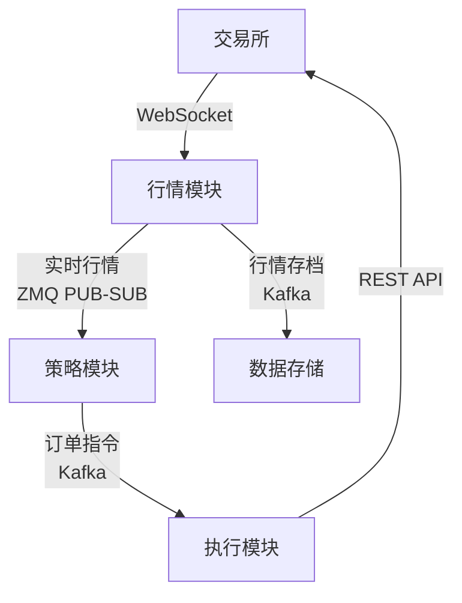
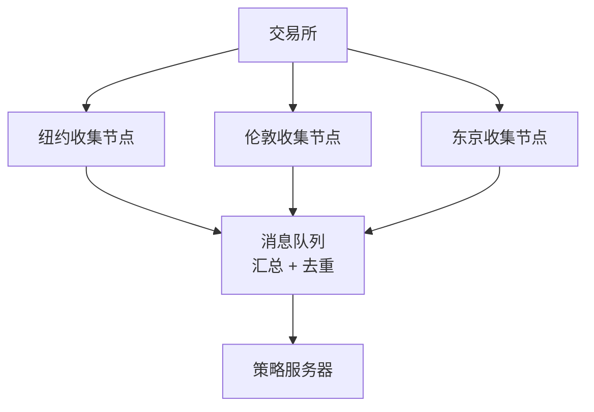

# Kafka 与 ZMQ 消息队列

当量化交易系统从单机走向分布式时，模块间的通信方式就成为了架构的核心问题。消息队列是解决这个问题的标准答案——它实现了模块间的**解耦**、**异步**和**可靠**通信。

> 阅读提示

- 如果你只想了解"ZMQ 和 Kafka 怎么选"，直接看[ZMQ vs Kafka 对比](#zmq-vs-kafka-对比)
- 如果你想动手写代码，[ZMQ PUB-SUB 实战](#zmq-pub-sub-实战)提供了完整可运行的示例

## 为什么需要消息队列？

### 从单机到分布式



单机模式下，模块之间直接调用。分布式模式下，模块分散在不同机器上，需要消息队列作为通信中枢。

### 中间件的概念

中间件是连接底层技术和上层应用的组件——**让使用者不必关心底层实现，只需调用统一接口**。



**中间件哲学**：没有什么事情是加一层解决不了的；如果有，那就加两层。

## 消息队列的核心特性

### 发布-订阅模式（Pub-Sub）



| 特性 | 说明 |
|------|------|
| **时序性** | 严格 FIFO（先进先出），丢入 `1, 2, 3`，取出也是 `1, 2, 3` |
| **解耦** | 发布者和订阅者之间无直接依赖，互相不知道对方的存在 |
| **可靠性** | 内置消息持久化、去重和重试机制 |
| **可扩展** | 新增订阅者不影响现有系统和业务 |

## ZMQ：轻量级消息队列

ZMQ（ZeroMQ）是一个高性能异步消息库，提供三种通信模式：

| 模式 | 说明 | 适用场景 |
|------|------|---------|
| REQ-REP | 请求-应答 | RPC 调用，类似 HTTP |
| PUB-SUB | 发布-订阅 | 行情数据广播 |
| PUSH-PULL | 推送-拉取 | 并行任务分发 |

### ZMQ PUB-SUB 实战

```python
# ============ 订阅者 1 (sub1.py) ============
import zmq


def run():
    context = zmq.Context()
    socket = context.socket(zmq.SUB)
    socket.connect('tcp://127.0.0.1:6666')
    # 空字符串 = 不过滤任何消息，接收全部
    socket.setsockopt_string(zmq.SUBSCRIBE, '')

    print('订阅者 1 已启动')
    while True:
        msg = socket.recv()
        print(f"订阅者 1 收到: {msg}")


if __name__ == '__main__':
    run()


# ============ 订阅者 2 (sub2.py) ============
import zmq


def run():
    context = zmq.Context()
    socket = context.socket(zmq.SUB)
    socket.connect('tcp://127.0.0.1:6666')
    # 只订阅以 'BTC' 开头的消息
    socket.setsockopt_string(zmq.SUBSCRIBE, 'BTC')

    print('订阅者 2 已启动 (仅接收 BTC)')
    while True:
        msg = socket.recv()
        print(f"订阅者 2 收到: {msg}")


if __name__ == '__main__':
    run()


# ============ 发布者 (pub.py) ============
import time
import zmq


def run():
    context = zmq.Context()
    socket = context.socket(zmq.PUB)
    # 注意：PUB 用 bind，SUB 用 connect
    # 同一个地址端口 bind 只能有一个，connect 可以有多个
    socket.bind('tcp://*:6666')

    cnt = 1
    while True:
        time.sleep(1)
        # 发送 BTC 行情
        socket.send_string(f'BTC price:{50000 + cnt * 100}')
        # 发送 ETH 行情
        socket.send_string(f'ETH price:{3000 + cnt * 10}')
        print(f'发布者发送第 {cnt} 条')
        cnt += 1


if __name__ == '__main__':
    run()
```

### 运行顺序

```
1. 先启动所有订阅者 (sub1.py, sub2.py)
2. 再启动发布者 (pub.py)
```

**为什么必须先启动订阅者？** ZMQ 的 PUB-SUB 模式中，订阅者连接到发布者时需要时间来建立连接。如果先启动发布者，早期的消息会在订阅者连接之前发送出去，导致消息丢失。

### ZMQ 关键设计点

| 设计决策 | 原因 |
|---------|------|
| PUB 用 `bind`，SUB 用 `connect` | bind 只能有一个（发布者独占端口），connect 可以有多个 |
| `setsockopt_string(zmq.SUBSCRIBE, '')` | 空字符串 = 接收所有消息；指定前缀 = 按主题过滤 |
| `socket.recv()` 是阻塞的 | 没有新消息时，订阅者会阻塞等待 |

## Kafka：工业级消息队列

### Kafka 核心概念



| 概念 | 说明 |
|------|------|
| Topic | 消息的逻辑分类（如 `market-data`、`orders`） |
| Producer | 消息生产者，向 Topic 发送消息 |
| Consumer | 消息消费者，从 Topic 读取消息 |
| Consumer Group | 消费者组，组内消费者分摊 Partition |
| Broker | Kafka 服务器节点 |
| Partition | Topic 的分片，实现并行处理和水平扩展 |

### ZMQ vs Kafka 对比

| 维度 | ZMQ | Kafka |
|------|-----|-------|
| 本质 | 消息库（library），嵌入应用进程 | 消息平台（platform），独立部署的集群 |
| 持久化 | 无内置持久化（消息在内存中） | 磁盘持久化，可回溯历史消息 |
| 吞吐量 | 高 | 极高（百万条/秒） |
| 运维复杂度 | 低（只需安装 Python 包） | 高（需部署和管理 Kafka 集群） |
| 适用场景 | 实时数据流、低延迟广播 | 大规模数据管道、事件溯源、日志收集 |
| 消息回溯 | 不支持 | 支持（可按 offset 重新消费） |
| 典型用户 | 实时行情推送 | 订单日志、用户行为分析 |

### 量化交易系统中的选择



| 场景 | 选择 | 原因 |
|------|------|------|
| 实时行情推送 | ZMQ | 低延迟、轻量级、部署简单 |
| 订单指令传递 | Kafka | 必须持久化、不可丢失、可回溯 |
| 日志收集 | Kafka | 大量数据、需要持久化和后续分析 |
| 模块间 RPC 调用 | ZMQ REQ-REP | 简单的请求-应答模式 |

## 分布式架构中的消息队列

### Single Point Failure 问题

```
❌ 单机监听交易所的风险:

行情模块 (单节点) ──── 交易所
        ↓
   这台机器故障/网络中断
        ↓
   整个交易系统暴露于风险中
```

### 多机冗余方案



**优点**：消除 Single Point Failure
**缺点**：增加数十到数百毫秒延迟（等待多个节点数据 + 消息队列处理）
**适用**：低频策略、波段策略（延迟换稳定性）；不适用高频策略

## 常见问题

**Q: 把 time.sleep(1) 放在 while 循环最后 vs 最前面有区别吗？**

A: 放在循环最后，第一次迭代时没有延迟，会立即发送第一条消息。放在循环最前面，第一次迭代会先 sleep 1 秒再发送。对于订阅者来说，放在最后意味着第一条消息更快到达。

**Q: 多个发布者怎么用 ZMQ？**

A: 每个发布者 bind 到不同的端口，订阅者连接到多个端口。或者使用 ZMQ 的 proxy 模式（XPUB/XSUB）来汇聚多个发布者的消息。

**Q: ZMQ 和 RabbitMQ 有什么区别？**

A: RabbitMQ 是一个完整的消息代理（broker），需要独立部署和运维。ZMQ 只是一个库，直接嵌入应用进程，没有中心化的 broker。ZMQ 更轻量但功能更少，RabbitMQ 更重但提供更多企业级特性（管理界面、消息确认、持久化等）。

## 术语表

| 术语 | 英文 | 定义 |
|------|------|------|
| 消息队列 | Message Queue | 临时存放消息的容器，支持发布-订阅、点对点等通信模式 |
| Pub-Sub | Publish-Subscribe | 发布-订阅模式：发布者发送消息到主题，订阅者接收感兴趣的消息 |
| FIFO | First In First Out | 先进先出，队列的核心顺序保证 |
| Single Point Failure | SPOF | 单一故障点：系统中的一个组件故障会导致整个系统不可用 |
| 中间件 | Middleware | 连接底层技术和上层应用的组件层 |

## 延伸阅读

- [行情数据对接与 WebSocket](/docs/python/数据科学/07-量化金融/07-行情数据对接与WebSocket) — 行情数据源头
- [MySQL 日志与数据存储](/docs/python/数据科学/07-量化金融/04-MySQL日志与数据存储) — 消息的最终归宿
- [量化交易入门](/docs/python/数据科学/07-量化金融/01-量化交易入门) — 系统架构全貌