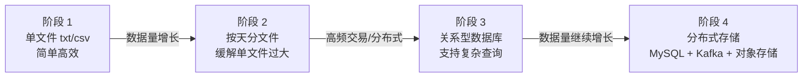
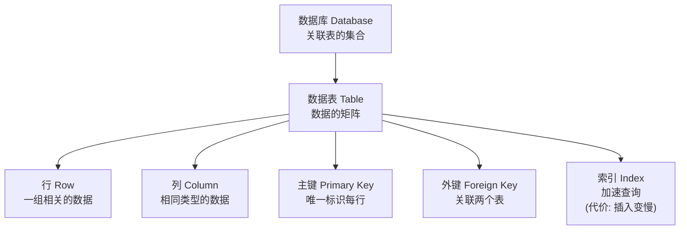
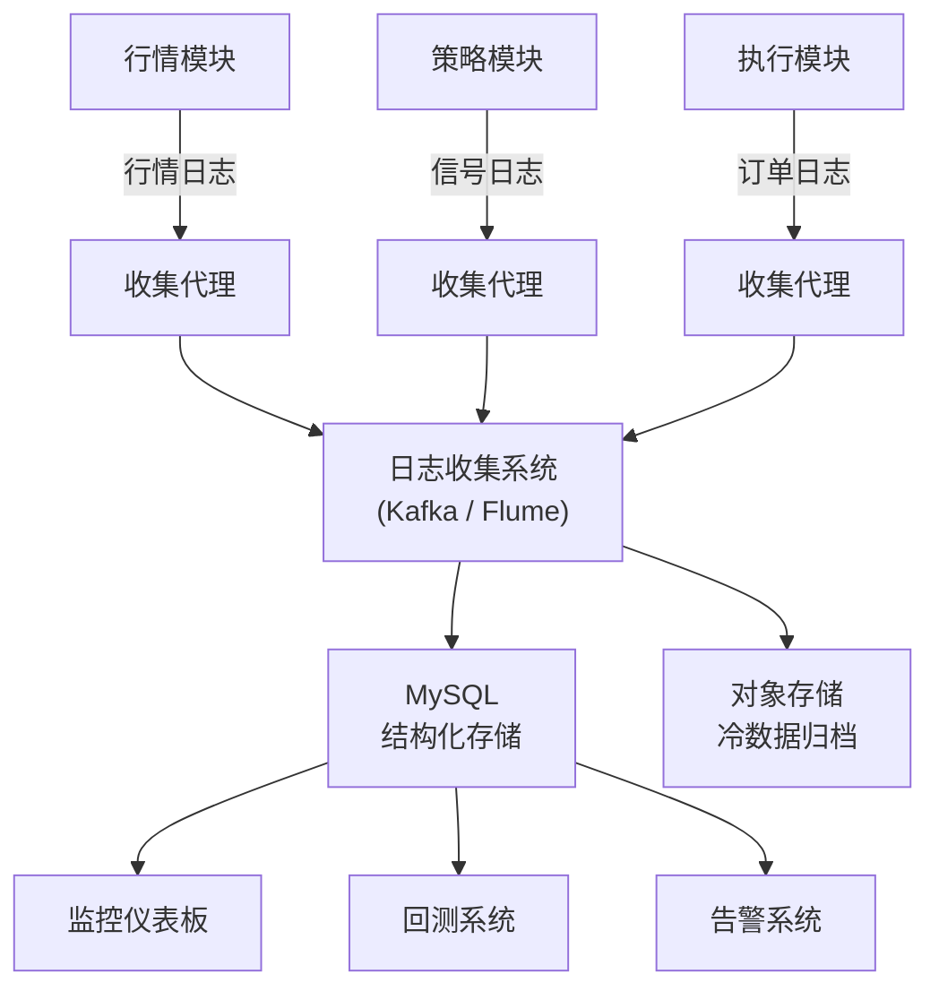
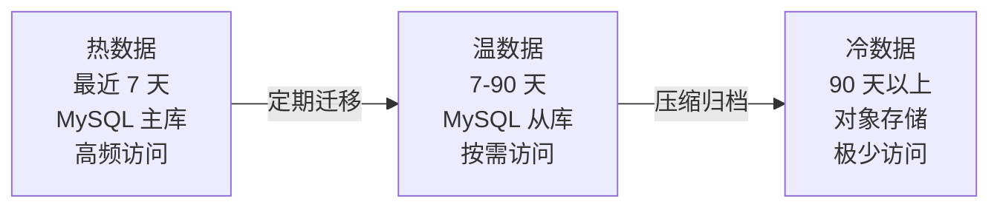

# MySQL 日志与数据存储

量化交易系统的数据是核心资产——行情数据、策略信号、订单记录、仓位快照，每一条都可能影响未来的策略决策。本文从**存储演进、Python 数据库操作、表结构设计到分布式日志架构**，系统讲解量化交易的数据存储方案。

> 阅读提示

- 如果你只想了解"Python 怎么操作 MySQL"，直接看[Python 操作 MySQL](#python-操作-mysql)
- 如果你在搭建分布式日志系统，建议从[分布式日志系统](#分布式日志系统)开始
- 本文代码依赖 `mysqlclient` 和 `peewee`

## 数据存储需求演进



| 阶段 | 存储方式 | 优势 | 瓶颈 |
|------|---------|------|------|
| 单文件 | `orderbook.txt` | 简单、零依赖 | 文件变大后检索困难 |
| 按天分文件 | `2024-01-01.csv` | 缓解单文件过大 | 跨天查询需要读取多个文件 |
| 关系型数据库 | MySQL/PostgreSQL | SQL 查询、索引加速 | 单机容量和性能上限 |
| 分布式存储 | Kafka + MySQL + 对象存储 | 水平扩展、冷热分离 | 运维复杂度 |

## MySQL 快速入门

### 核心概念



| 概念 | 说明 | 类比 |
|------|------|------|
| 数据库 | 关联表的集合 | Excel 文件 |
| 数据表 | 数据的矩阵 | Excel 中的 Sheet |
| 行 | 一组相关的数据 | Sheet 中的一行 |
| 列 | 相同类型的数据字段 | Sheet 中的一列 |
| 主键 | 唯一标识每行的列 | 身份证号 |
| 外键 | 关联两个表的列 | 引用另一个表的行 |
| 索引 | 加速查询的排序结构 | 书的目录 |

## Python 操作 MySQL

### 方式一：mysqlclient（原生 SQL）

```python
import MySQLdb


def test_mysqlclient():
    """使用 mysqlclient 操作 MySQL"""

    # 1. 连接数据库
    conn = MySQLdb.connect(
        host='localhost',
        port=3306,
        user='your_username',
        passwd='your_password',
        db='mysql'
    )

    # 2. 创建游标
    # 游标的作用：将集合操作转换为逐行访问
    cur = conn.cursor()

    # 3. 创建表
    cur.execute('''
        CREATE TABLE IF NOT EXISTS price (
            timestamp TIMESTAMP NOT NULL,
            BTCUSD DECIMAL(11,2),
            PRIMARY KEY (timestamp)
        )
    ''')

    # 4. 插入数据
    cur.execute('''
        INSERT INTO price VALUES(
            '2019-07-14 14:12:17',
            11234.56
        )
    ''')

    # 5. 提交更改
    conn.commit()

    # 6. 查询数据
    cur.execute('''
        SELECT BTCUSD
        FROM price
        WHERE timestamp > NOW() - INTERVAL 60 MINUTE
    ''')

    # 7. 获取结果
    results = cur.fetchall()
    for row in results:
        print(f"BTC/USD: {row[0]}")

    # 8. 关闭连接
    conn.close()


test_mysqlclient()
```

**为什么需要游标（Cursor）？**

SQL 查询的结果是包含多个记录的集合，存储在内存的一块区域中。游标允许你**逐行访问**这些记录，而不是一次性加载所有数据。这对于结果集很大的查询尤其重要。

### 方式二：peewee ORM

```python
from peewee import *


# 连接数据库
db = MySQLDatabase(
    'mysql',
    user='your_username',
    passwd='your_password'
)


class Price(Model):
    """价格数据模型 —— 一个 Python class 映射一张数据库表"""
    timestamp = DateTimeField(primary_key=True)
    BTCUSD = FloatField()

    class Meta:
        database = db


def test_peewee():
    """使用 peewee ORM 操作 MySQL"""

    # 1. 创建表（如果不存在）
    db.connect()
    db.create_tables([Price], safe=True)

    # 2. 插入数据 —— 像操作 Python 对象一样
    price = Price(
        timestamp='2019-06-07 13:17:18',
        BTCUSD=12345.67
    )
    price.save()

    # 3. 查询数据 —— 用 Python 语法，不用写 SQL
    recent_prices = (Price
                     .select()
                     .where(Price.timestamp > '2019-06-01')
                     .order_by(Price.timestamp.desc())
                     .limit(10))

    for p in recent_prices:
        print(f"{p.timestamp}: BTC/USD = {p.BTCUSD}")

    db.close()


test_peewee()
```

### 两种方式的对比

| 维度 | mysqlclient | peewee ORM |
|------|------------|-----------|
| 使用方式 | 手写 SQL 语句 | Python 对象操作 |
| 性能 | 更快（无 ORM 开销） | 略有开销 |
| 类型安全 | SQL 字符串，运行时才发现错误 | Python 类型检查，编译期发现错误 |
| 可读性 | SQL 与 Python 混写 | 纯 Python，风格统一 |
| 数据库迁移 | 手动管理 | 自动生成 |
| 适用场景 | 复杂查询、性能敏感 | 常规 CRUD、快速开发 |
| 学习成本 | 需要懂 SQL | Python 开发者友好 |

## 量化交易数据表设计

### 核心表结构

```sql
-- ============ 行情数据表 ============
CREATE TABLE market_data (
    id BIGINT AUTO_INCREMENT PRIMARY KEY,
    symbol VARCHAR(10) NOT NULL COMMENT '交易对',
    `open` DECIMAL(15, 2) COMMENT '开盘价',
    high DECIMAL(15, 2) COMMENT '最高价',
    low DECIMAL(15, 2) COMMENT '最低价',
    `close` DECIMAL(15, 2) COMMENT '收盘价',
    volume DECIMAL(20, 8) COMMENT '成交量',
    `timestamp` DATETIME NOT NULL COMMENT 'K线时间',
    INDEX idx_symbol_time (symbol, `timestamp`)
) COMMENT 'OHLCV 行情数据';


-- ============ 交易记录表 ============
CREATE TABLE trades (
    id BIGINT AUTO_INCREMENT PRIMARY KEY,
    order_id VARCHAR(64) UNIQUE COMMENT '交易所订单ID',
    symbol VARCHAR(10) COMMENT '交易对',
    side ENUM('buy', 'sell') COMMENT '买卖方向',
    order_price DECIMAL(15, 2) COMMENT '下单价格',
    price DECIMAL(15, 2) COMMENT '成交价格',
    amount DECIMAL(15, 8) COMMENT '成交数量',
    fee DECIMAL(15, 8) COMMENT '手续费',
    status VARCHAR(20) COMMENT '订单状态',
    created_at DATETIME COMMENT '创建时间',
    executed_at DATETIME COMMENT '成交时间',
    INDEX idx_created (created_at),
    INDEX idx_symbol_status (symbol, status)
) COMMENT '交易记录';


-- ============ 持仓快照表 ============
CREATE TABLE positions (
    id BIGINT AUTO_INCREMENT PRIMARY KEY,
    symbol VARCHAR(10) COMMENT '交易对',
    amount DECIMAL(15, 8) COMMENT '持仓数量',
    avg_price DECIMAL(15, 2) COMMENT '平均成本',
    updated_at DATETIME COMMENT '更新时间',
    UNIQUE KEY uk_symbol (symbol)
) COMMENT '当前持仓快照';
```

### 日志分析 SQL 示例

```sql
-- 每日盈亏（PnL）计算
SELECT
    DATE(executed_at) as trade_date,
    SUM(CASE WHEN side = 'sell'
        THEN amount * price
        ELSE -amount * price
    END) as pnl
FROM trades
WHERE status = 'filled'
GROUP BY DATE(executed_at)
ORDER BY trade_date DESC;


-- 滑点分析（price 为成交价，order_price 为下单价）
SELECT
    symbol,
    COUNT(*) as trade_count,
    AVG(ABS(price - order_price) / order_price) * 100
        as avg_slippage_pct
FROM trades
WHERE status = 'filled'
GROUP BY symbol;


-- 胜率统计：将每笔卖出与其前一笔成交（买入）配对，卖出额更高记为盈利
-- 简化假设：同一 symbol 的成交按买入→卖出交替出现；需 MySQL 8.0+（窗口函数）
SELECT
    symbol,
    COUNT(*) as closed_trades,
    SUM(is_win) as winning_trades,
    ROUND(AVG(is_win) * 100, 2) as win_rate_pct
FROM (
    SELECT
        symbol,
        side,
        CASE
            WHEN side = 'sell'
             AND amount * price > LAG(amount * price) OVER (
                 PARTITION BY symbol ORDER BY executed_at)
            THEN 1 ELSE 0
        END as is_win
    FROM trades
    WHERE status = 'filled'
) t
WHERE side = 'sell'
GROUP BY symbol;
```

## 分布式日志系统

### 架构设计



### 日志分析的两类场景

| 类型 | 说明 | 典型用途 | 数据要求 |
|------|------|---------|---------|
| **离线分析** | 基于历史数据的批量分析 | PnL 报告、回测、策略评估 | 全量数据，T+1 即可 |
| **在线分析** | 基于实时数据的即时分析 | 风控告警、异常检测 | 低延迟，秒级 |

**离线分析典型场景**：
- 每日/每周/每月的盈亏报告
- 最大回撤、夏普比率等策略指标统计
- 回测系统读取历史数据进行策略验证

**在线分析典型场景**：
- 数据系统异常停止 → 表没有更新 → 触发告警
- 交易系统连接故障 → 订单状态超阈值 → 触发告警
- 仓位出现预期外的大幅变动 → 触发告警（oncall）

### 数据生命周期管理



> 越是久远的数据，越应该使用粗粒度存储，被调用的概率也越低。

## 常见问题

**Q: 量化交易的数据量不大，为什么还需要数据库？**

A: 量化交易的数据量"不大"是相对的。分钟级 K 线确实不大，但 tick 级数据（每秒数百条）积累起来非常可观。更重要的是，数据库提供的**索引查询、事务保证、并发访问**是文件系统无法替代的。当回测系统需要"查询 2019 年 3 月所有 BTC 价格在 5000-6000 之间的交易日"时，数据库的优势就体现出来了。

**Q: mysqlclient 和 peewee 怎么选？**

A: 简单项目用 peewee（开发快、代码少），复杂查询用 mysqlclient（SQL 更灵活）。大型项目推荐 SQLAlchemy（生态最完整，但学习曲线更陡）。

**Q: 回测系统频繁读取数据库，如何优化？**

A: ① 建立合适的索引（时间列 + 交易对列）；② 使用连接池（避免频繁创建/销毁连接）；③ 缓存热点数据（Redis 缓存最近的 K 线数据）；④ 批量读取而非逐条查询。

## 术语表

| 术语 | 英文 | 定义 |
|------|------|------|
| RDBMS | Relational Database Management System | 关系型数据库管理系统，基于关系模型（表、行、列） |
| ORM | Object-Relational Mapping | 用 Python 对象映射数据库表，避免手写 SQL |
| 游标 | Cursor | 允许逐行访问 SQL 查询结果集的机制 |
| 索引 | Index | 对列值排序的结构，加速查询但减慢插入 |
| PnL | Profit and Loss | 盈亏，交易的核心指标 |
| 滑点 | Slippage | 预期成交价与实际成交价之间的差额 |

## 延伸阅读

- [Kafka 与 ZMQ 消息队列](/docs/python/数据科学/07-量化金融/03-Kafka与ZMQ消息队列) — 日志的传输管道
- [Django 量化监控平台](/docs/python/数据科学/07-量化金融/06-Django量化监控平台) — 数据的前端展示
- [量化交易入门](/docs/python/数据科学/07-量化金融/01-量化交易入门) — 交易系统架构全貌