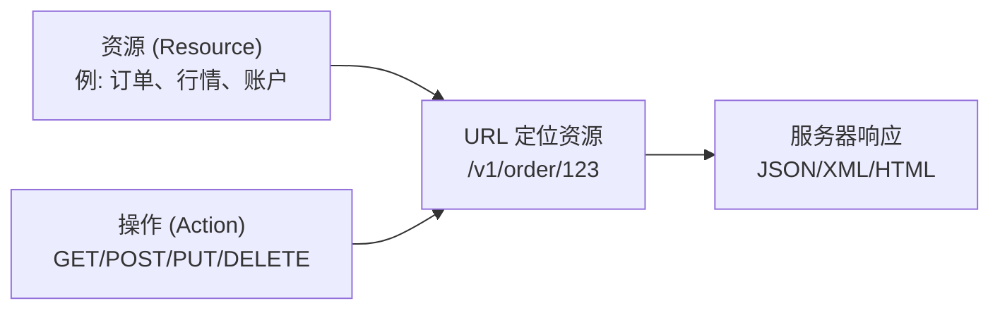
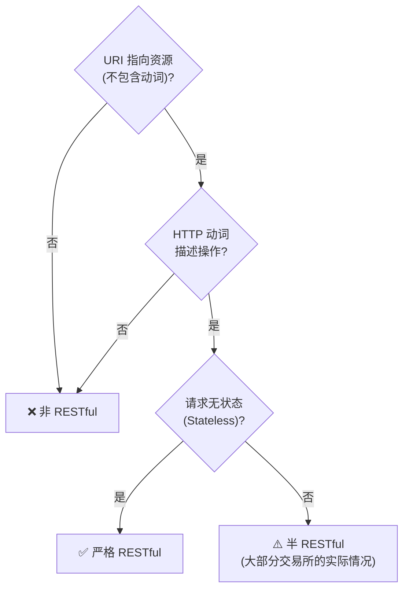
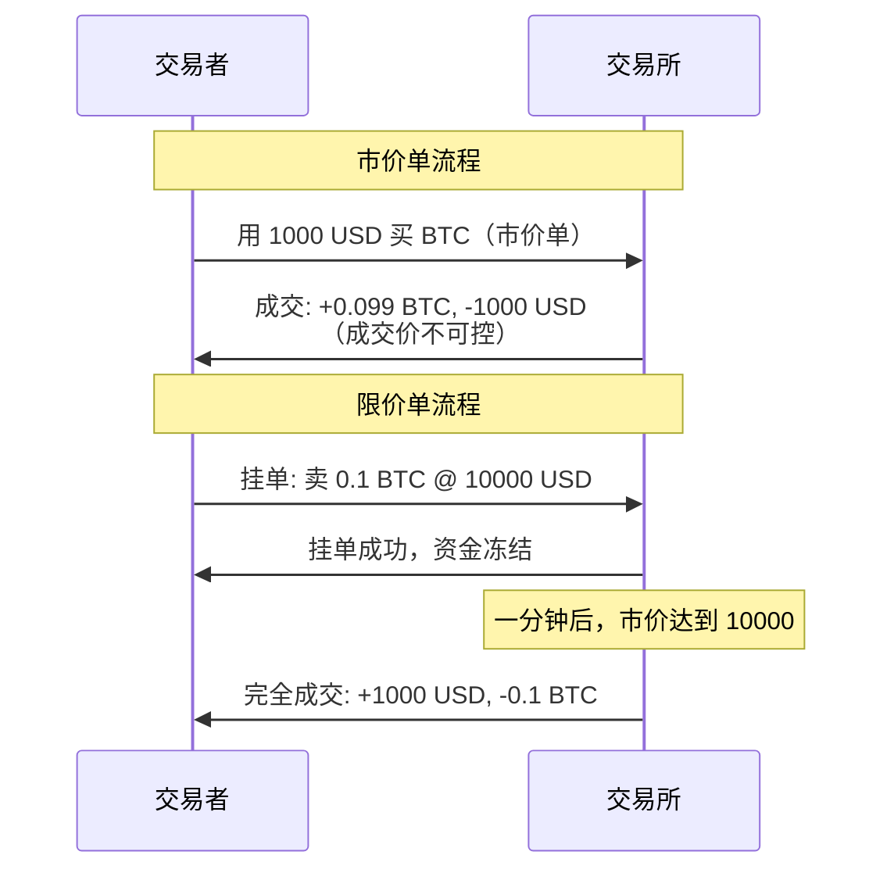
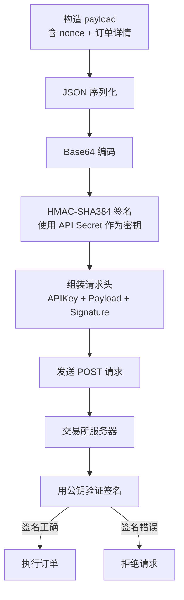
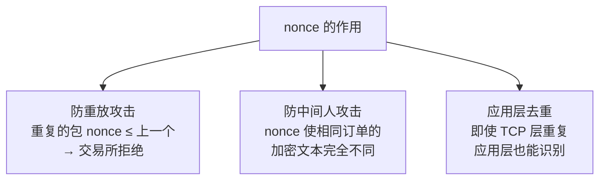
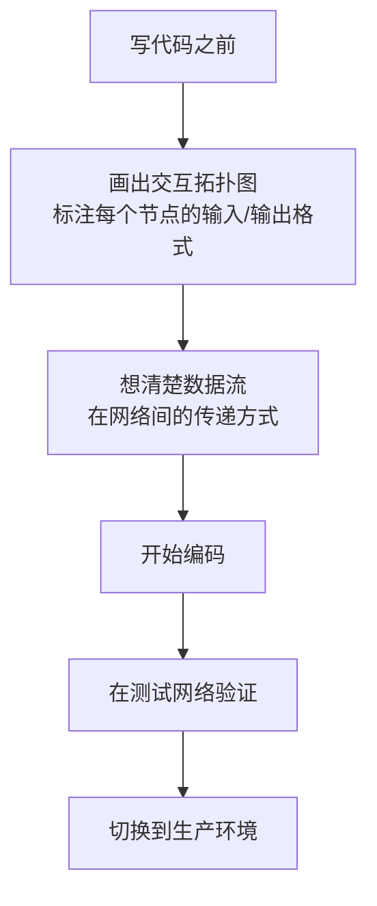

# RESTful 与 Socket 交易执行

量化交易系统的执行层负责将策略信号转化为实际的买卖订单。本文以 Gemini 交易所为例，从 **RESTful API 设计原理、认证机制、订单构造到网络编程要点**，完整讲解如何通过 Python 实现自动化下单。

> 阅读提示

- 如果你只关心"怎么用代码下单"，可以直接跳到[实战：通过 API 下单](#实战通过-api-下单)
- 如果你想理解 RESTful 的设计哲学和 nonce 的安全原理，建议按顺序阅读
- 所有代码示例基于 Gemini Sandbox 测试网络，无需真实资金即可运行

## RESTful API 基础

### 什么是 REST

REST（REpresentational State Transfer）的本质是**通过 URL 定位资源，用 HTTP 动词描述操作**：



| HTTP 动词 | 操作 | 示例 | 幂等性 |
|-----------|------|------|--------|
| GET | 读取资源 | `GET /v1/pubticker/btcusd` | 是 |
| POST | 创建资源 | `POST /v1/order/new` | 否 |
| PUT | 更新资源 | `PUT /v1/order/status` | 是 |
| DELETE | 删除资源 | `DELETE /v1/order/123` | 是 |

### RESTful 的判断标准

一个严格的 RESTful 接口需要同时满足三个条件：



```text
# ✅ RESTful: URI 指向资源，动词用 HTTP method
GET  https://api.gemini.com/v1/pubticker/btcusd

# ❌ 非 RESTful: URI 包含动词
POST https://api.restful.cn/accounts/delete/:username

# ✅ 改进后: 动词移到 HTTP method
DELETE https://api.rest.cn/accounts/:username
```

### 实际中的"REST 接口"

大部分交易所的接口并非严格 RESTful，但都满足**无状态**要求。以 Gemini 的取消订单接口为例：

```
POST https://api.gemini.com/v1/order/cancel
```

它不够 RESTful 的地方：
- 动词设计不准确，使用 `POST` 而非 `DELETE`
- URI 包含 `cancel` 动词
- 订单 ID 在参数列表而非 URI 中

> 实用原则：**不要纠结于"RESTful"的严格定义，把握住核心——一个 HTTP 请求完成一次完整操作**。

## 交易所核心概念

### 撮合机制

交易所是一个买方和卖方之间的撮合平台。参与者分为两种角色：

| 角色 | 英文 | 行为 | 市场作用 |
|------|------|------|---------|
| 挂单者 | Maker | 挂出买单或卖单，等待别人来成交 | 提供流动性 |
| 吃单者 | Taker | 主动吃掉已有的挂单 | 消耗流动性 |

**交易所的盈利模式**：对每笔成交收取手续费。无论价格涨跌，只要有人交易，交易所就有收入。

### 订单类型

| 订单类型 | 英文 | 参数 | 成交方式 | 风险 |
|---------|------|------|---------|------|
| 市价单 | Market Order | 方向 + 数量 | 立即以当前市价成交 | 价格不可控，滑点风险 |
| 限价单 | Limit Order | 方向 + 数量 + 限价 | 达到指定价格时成交 | 可能无法成交 |



## 实战：通过 API 下单

### 环境准备

1. 注册 [Gemini Sandbox](https://exchange.sandbox.gemini.com/) 账号（测试网络，免费获得虚拟币）
2. 在 User Settings → API Settings 中生成 API Key 和 Secret
3. **注意**：Key 和 Secret 只显示一次，关闭窗口后无法找回

### 完整下单代码

```python
import requests
import json
import base64
import hmac
import hashlib
import datetime
import time


# ============ 配置 ============
base_url = "https://api.sandbox.gemini.com"
endpoint = "/v1/order/new"
url = base_url + endpoint

gemini_api_key = "account-xxxxx"
gemini_api_secret = "xxxxx".encode()


# ============ 构造 nonce ============
# nonce 必须是单调递增的整数
# 使用当前时间的毫秒数作为 nonce 是常见做法
t = datetime.datetime.now()
payload_nonce = str(int(time.mktime(t.timetuple()) * 1000))


# ============ 构造订单 payload ============
payload = {
    "request": "/v1/order/new",
    "nonce": payload_nonce,
    "symbol": "btcusd",
    "amount": "5",
    "price": "3633.00",
    "side": "buy",
    "type": "exchange limit",
    "options": ["maker-or-cancel"]  # 只做 Maker，不做 Taker
}


# ============ 加密签名 ============
# 1. JSON 序列化
encoded_payload = json.dumps(payload).encode()

# 2. Base64 编码
b64 = base64.b64encode(encoded_payload)

# 3. HMAC-SHA384 签名
signature = hmac.new(gemini_api_secret, b64, hashlib.sha384).hexdigest()


# ============ 构造请求头 ============
request_headers = {
    'Content-Type': "text/plain",
    'Content-Length': "0",
    'X-GEMINI-APIKEY': gemini_api_key,
    'X-GEMINI-PAYLOAD': b64,
    'X-GEMINI-SIGNATURE': signature,
    'Cache-Control': "no-cache"
}


# ============ 发送请求 ============
response = requests.post(url, data=None, headers=request_headers)
new_order = response.json()
print(json.dumps(new_order, indent=2))
```

### 认证流程详解



### nonce 的安全原理

**nonce** 是一个单调递增的整数，在网络通信中扮演多重安全角色：



| 安全问题 | 没有 nonce | 有 nonce |
|---------|-----------|---------|
| 重复包 | 同一个订单可能被执行两次 | 交易所拒绝 nonce 重复的请求 |
| 中间人攻击 | 攻击者可以重放截获的包 | 每个包的加密文本不同，无法重放 |
| 丢包恢复 | 不确定包是否到达 | 可以安全地重发（使用新 nonce） |

> **不能用 timestamp 代替 nonce**：同一毫秒内可能有多个请求，timestamp 无法保证单调递增的唯一性。而 nonce 要求严格递增，每发一个请求 nonce 必须增加。

## 网络编程要点

### HTTP 请求结构

```python
# requests.post 的三个核心参数
response = requests.post(
    url,                    # API 端点地址
    data=None,              # 请求体（Gemini 的 data 为空，信息在 headers 中）
    headers=request_headers # 请求头（包含认证信息）
)
```

### 请求头关键字段

| 字段 | 值 | 说明 |
|------|-----|------|
| `Content-Type` | `text/plain` | 内容类型 |
| `Content-Length` | `0` | 内容长度（body 为空） |
| `X-GEMINI-APIKEY` | API Key | 账户标识 |
| `X-GEMINI-PAYLOAD` | Base64(payload) | 订单信息的 Base64 编码 |
| `X-GEMINI-SIGNATURE` | HMAC-SHA384 签名 | 用 Secret 对 payload 的签名 |
| `Cache-Control` | `no-cache` | 禁止缓存 |

### 网络编程最佳实践



| 原则 | 说明 |
|------|------|
| 先画图再写代码 | 在草稿纸上画出交互拓扑图，标注输入输出格式 |
| 理解数据流 | 知道包是怎样在网络间传递的 |
| 注意细节 | `keep-alive`、超时设置、重试策略等细节容易被忽略但往往是 bug 源头 |
| 测试网络先行 | 永远先在 Sandbox 环境测试，确认无误后再切换到生产环境 |

## 常见问题

**Q: 为什么 Gemini 的 data 参数为空？**

A: Gemini 选择将订单信息放在 HTTP Headers 中（`X-GEMINI-PAYLOAD`），而不是 HTTP Body 中。这是一种设计选择——header 中的信息经过加密签名，安全性更高，且避免了 body 被中间代理缓存或篡改的风险。

**Q: 如果网络中断，如何知道订单是否已经提交成功？**

A: 使用新的 nonce 重新发送订单请求。由于 nonce 是递增的，如果上一个请求已经成功，交易所会因为 nonce 重复而拒绝重发的请求。此时你可以查询订单状态来确认。**关键原则**：宁可重发被拒绝，也不要遗漏订单。

**Q: REST 和 WebSocket 在交易中各用于什么场景？**

A: REST 用于**低频的、一次性的操作**（下单、撤单、查询账户），WebSocket 用于**高频的、持续的数据流**（行情订阅、订单状态推送）。两者在交易系统中互补使用。

## 术语表

| 术语 | 英文 | 定义 |
|------|------|------|
| REST | REpresentational State Transfer | 一种通过 URL 定位资源、HTTP 动词描述操作的接口设计风格 |
| 无状态 | Stateless | 每个请求独立，不需要服务器在会话中保存中间状态 |
| nonce | Number used ONCE | 单调递增的整数，用于防重放攻击和请求去重 |
| HMAC | Hash-based Message Authentication Code | 基于哈希的消息认证码，用于验证消息完整性和真实性 |
| Maker | Maker | 挂单者，提供流动性，通常手续费更低 |
| Taker | Taker | 吃单者，消耗流动性，通常手续费更高 |
| 滑点 | Slippage | 预期成交价与实际成交价之间的差额 |

## 延伸阅读

- [量化交易入门](01-量化交易入门) — 交易系统架构与基本概念
- [行情数据对接与 WebSocket](07-行情数据对接与WebSocket) — WebSocket 实时行情获取
- [Django 量化监控平台](06-Django量化监控平台) — 交易监控面板搭建
