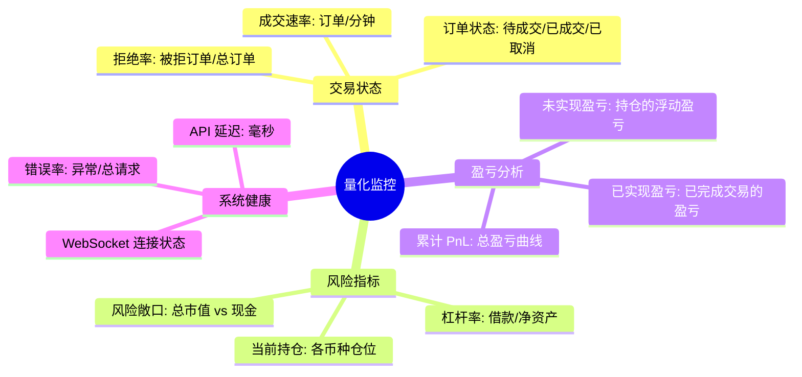
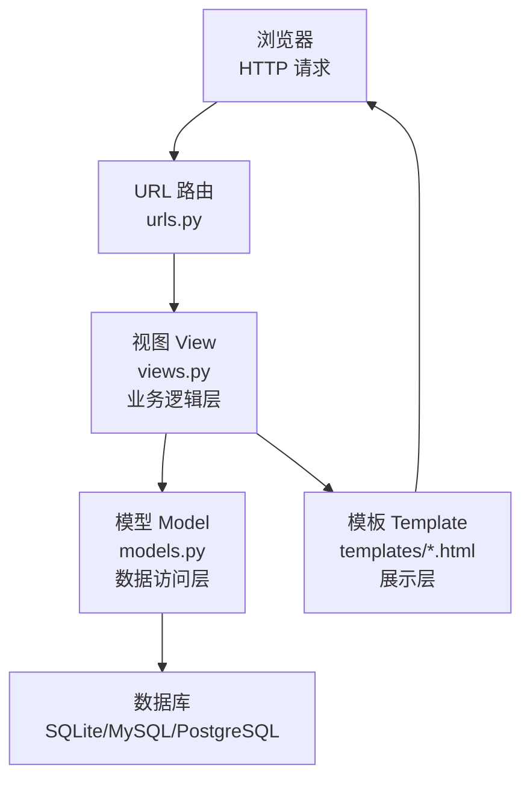
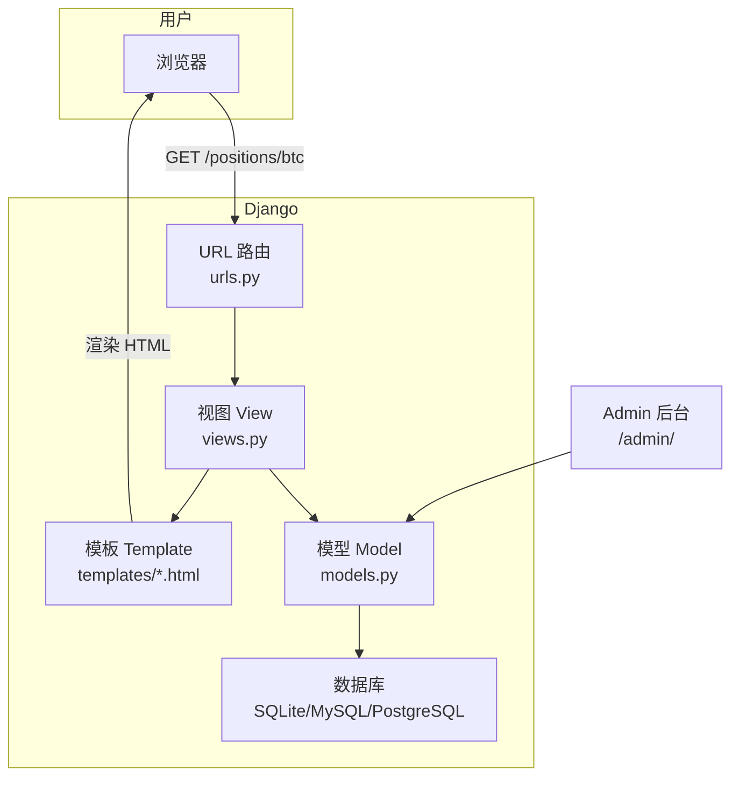
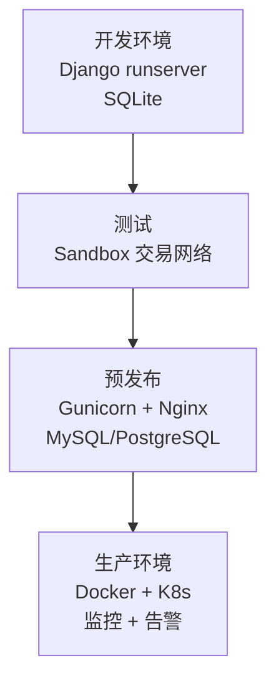

# Django 量化交易监控平台

监控系统是量化交易的最后一道防线——它让你在策略异常、仓位偏离、系统故障时第一时间获知并响应。本文使用 Django 框架，从零搭建一个交易监控 Web 平台。

> 阅读提示

- 如果你只关心"怎么做"，可以直接跳到[搭建监控平台](#搭建监控平台)
- 如果你想理解 Django 的 MVC 架构思想，建议从[MVC 架构](#mvc-架构)开始
- 本文代码基于 Django 5.2 LTS（当前长期支持版），Python 3.10+；旧版 Django 2.2/Python 3.7 代码在文末版本差异小节有对照说明

## 监控系统概述

### 监控什么？

一个量化交易监控系统需要追踪的关键指标：



### 为什么需要监控？

| 没有监控 | 有监控 |
|---------|-------|
| 策略跑飞了数小时才发现 | 异常触发告警，数分钟内响应 |
| 手动登录交易所查看持仓 | 监控面板一键查看所有信息 |
| 月底才知道盈亏 | 实时 PnL，随时掌握 |
| 故障后被动排查 | 主动发现，防患于未然 |

## Django 简介

Django 是 Python 最流行的 Web 框架之一，采用 **MVC（Model-View-Controller）** 架构思想——Django 官方称之为 **MVT**（Model-View-Template），由框架本身充当 Controller：



| 组件 | 文件 | 职责 |
|------|------|------|
| Model | `models.py` | 定义数据结构，映射数据库表 |
| View | `views.py` | 处理 HTTP 请求，实现业务逻辑 |
| Template | `templates/*.html` | 渲染 HTML 页面，展示数据 |
| URLConf | `urls.py` | URL 路由映射 |

## 搭建监控平台

### 步骤 1：创建项目

```bash
# 安装 Django
pip install Django
django-admin --version
# 输出示例: 5.2.x

# 创建项目
django-admin startproject TradingMonitor
cd TradingMonitor/

# 初始化数据库
python manage.py migrate

# 创建管理员账户
python manage.py createsuperuser
# Username: admin
# Password: ******

# 启动开发服务器
python manage.py runserver
# 访问 http://127.0.0.1:8000 验证
```

### 项目结构

```
TradingMonitor/
├── manage.py                      # 项目管理命令行工具
├── db.sqlite3                     # 默认数据库（开发环境）
└── TradingMonitor/                # 项目 Python 包
    ├── __init__.py                # 声明为 Python 包
    ├── settings.py                # 全局配置
    ├── urls.py                    # URL 路由入口
    ├── wsgi.py                    # WSGI 部署配置
    ├── models.py                  # 数据模型（待创建）
    ├── views.py                   # 视图逻辑（待创建）
    ├── migrations/                # 数据库迁移记录
    │   └── __init__.py
    └── templates/                 # HTML 模板（待创建）
        ├── dashboard.html
        └── positions.html
```

### 步骤 2：定义 Model

```python
# TradingMonitor/models.py
from django.db import models


class Position(models.Model):
    """交易仓位模型"""
    asset = models.CharField(max_length=10)
    timestamp = models.DateTimeField()
    amount = models.DecimalField(max_digits=10, decimal_places=3)

    class Meta:
        ordering = ['-timestamp']  # 默认按时间倒序

    def __str__(self):
        return f'{self.asset}: {self.amount} @ {self.timestamp}'


class TradingOrder(models.Model):
    """交易订单模型"""
    SIDE_CHOICES = [
        ('buy', '买入'),
        ('sell', '卖出'),
    ]
    STATUS_CHOICES = [
        ('pending', '待成交'),
        ('filled', '已成交'),
        ('cancelled', '已取消'),
        ('rejected', '已拒绝'),
    ]

    symbol = models.CharField(max_length=10)
    side = models.CharField(max_length=4, choices=SIDE_CHOICES)
    price = models.DecimalField(max_digits=15, decimal_places=2)
    amount = models.DecimalField(max_digits=15, decimal_places=8)
    status = models.CharField(
        max_length=10, choices=STATUS_CHOICES, default='pending'
    )
    created_at = models.DateTimeField(auto_now_add=True)
    executed_at = models.DateTimeField(null=True, blank=True)

    class Meta:
        ordering = ['-created_at']
        indexes = [
            models.Index(fields=['symbol', 'status']),
            models.Index(fields=['created_at']),
        ]

    def __str__(self):
        return f'{self.side} {self.symbol} @ {self.price} [{self.status}]'
```

**ORM 的核心优势**：用 Python class 描述数据库表，无需手动编写 SQL。

| 操作 | 原始 SQL | Django ORM |
|------|---------|-----------|
| 查询 | `SELECT * FROM position WHERE asset='btc'` | `Position.objects.filter(asset='btc')` |
| 插入 | `INSERT INTO position VALUES (...)` | `Position(asset='btc', ...).save()` |
| 筛选排序 | `SELECT ... ORDER BY timestamp DESC` | `Position.objects.filter(...).order_by('-timestamp')` |

### 步骤 3：设计 View

```python
# TradingMonitor/views.py
from django.shortcuts import render
from django.db.models import Sum, Count, Q
from .models import Position, TradingOrder


def dashboard(request):
    """监控仪表板主页面"""
    # 最新持仓
    positions = Position.objects.all()[:20]

    # 订单统计
    order_stats = TradingOrder.objects.aggregate(
        total_orders=Count('id'),
        filled_orders=Count('id', filter=Q(status='filled')),
        total_buy=Sum('amount', filter=Q(side='buy', status='filled')),
        total_sell=Sum('amount', filter=Q(side='sell', status='filled')),
    )

    # 最近订单
    recent_orders = TradingOrder.objects.all()[:20]

    context = {
        'positions': positions,
        'stats': order_stats,
        'recent_orders': recent_orders,
    }
    return render(request, 'dashboard.html', context)


def render_positions(request, asset):
    """按资产查看持仓历史"""
    positions = Position.objects.filter(asset=asset)
    context = {'asset': asset, 'positions': positions}
    return render(request, 'positions.html', context)
```

### 步骤 4：设计 Template

```html
<!-- TradingMonitor/templates/positions.html -->
<!DOCTYPE html>
<html lang="zh-CN">
<head>
    <meta charset="UTF-8">
    <title>Positions for {{ asset }}</title>
    <style>
        table { border-collapse: collapse; width: 100%; }
        th, td { border: 1px solid #ddd; padding: 8px; text-align: left; }
        th { background-color: #4CAF50; color: white; }
        tr:nth-child(even) { background-color: #f2f2f2; }
    </style>
</head>
<body>
    <h1>{{ asset|upper }} 持仓历史</h1>

    <table>
        <thead>
            <tr>
                <th>时间</th>
                <th>持仓量</th>
            </tr>
        </thead>
        <tbody>
            
            <tr>
                <td>{{ position.timestamp|date:"Y-m-d H:i:s" }}</td>
                <td>{{ position.amount }}</td>
            </tr>
            
            <tr>
                <td colspan="2">暂无数据</td>
            </tr>
            
        </tbody>
    </table>

    <p>共 {{ positions|length }} 条记录</p>
</body>
</html>
```

**Django 模板的关键语法**：

| 语法 | 含义 | 示例 |
|------|------|------|
| `{{ variable }}` | 输出变量的值 | `{{ asset }}` → `btc` |
| `` | 循环迭代 | `` |
| `` | 条件判断 | `` |
| `{{ value\|filter }}` | 过滤器（格式化） | `{{ timestamp\|date:"Y-m-d" }}` |
| `` | 循环为空时 | `无数据` |

### 步骤 5：配置 URL 路由

```python
# TradingMonitor/urls.py
from django.contrib import admin
from django.urls import path
from . import views

urlpatterns = [
    path('admin/', admin.site.urls),
    path('', views.dashboard, name='dashboard'),
    path('positions/<str:asset>', views.render_positions, name='positions'),
]
```

### 步骤 6：修改 Settings

```python
# TradingMonitor/settings.py

# 注册应用
INSTALLED_APPS = [
    'django.contrib.admin',
    'django.contrib.auth',
    'django.contrib.contenttypes',
    'django.contrib.sessions',
    'django.contrib.messages',
    'django.contrib.staticfiles',
    'TradingMonitor',  # 添加我们的 app
]

# 配置模板目录
TEMPLATES = [
    {
        'BACKEND': 'django.template.backends.django.DjangoTemplates',
        'DIRS': [os.path.join(BASE_DIR, 'TradingMonitor/templates')],
        'APP_DIRS': True,
        # ... 其他配置
    },
]
```

### 步骤 7：数据库迁移

```bash
# 根据 Model 生成迁移文件
python manage.py makemigrations
# 输出: Migrations for 'TradingMonitor':
#   TradingMonitor/migrations/0001_initial.py
#     - Create model Position

# 应用到数据库
python manage.py migrate
# 输出: Applying TradingMonitor.0001_initial... OK
```

### 步骤 8：运行

```bash
python manage.py runserver
```

访问 `http://127.0.0.1:8000/positions/btc` 查看持仓页面。

## Django Admin 管理界面

Django 自带强大的后台管理系统，无需额外编码：

```python
# TradingMonitor/admin.py
from django.contrib import admin
from .models import Position, TradingOrder


@admin.register(Position)
class PositionAdmin(admin.ModelAdmin):
    list_display = ['asset', 'amount', 'timestamp']
    list_filter = ['asset']
    search_fields = ['asset']
    date_hierarchy = 'timestamp'


@admin.register(TradingOrder)
class TradingOrderAdmin(admin.ModelAdmin):
    list_display = ['symbol', 'side', 'price', 'amount', 'status', 'created_at']
    list_filter = ['symbol', 'side', 'status']
    search_fields = ['symbol']
    date_hierarchy = 'created_at'
```

访问 `http://127.0.0.1:8000/admin/` 即可使用。

## MVC 架构全景



| 概念 | Django 实现 | 数据流 |
|------|-----------|--------|
| Model | `models.py` 中的 Python class | 定义数据 → 迁移到数据库 |
| View | `views.py` 中的函数 | 接收请求 → 查询 Model → 渲染 Template |
| Template | `templates/*.html` | 接收 context 数据 → 生成 HTML |
| Controller | `urls.py` + Django 框架本身 | URL 路由分发 |

## 开源监控插件

| 插件 | 用途 | 特点 |
|------|------|------|
| Graphite | 存储时间序列数据，通过 Django Web 应用图形化展示 | 专为时序数据设计 |
| Grafana | 通用仪表板 | 支持多种数据源（含 Graphite），界面美观 |
| Scout | 监控 Django/Flask 应用性能 | 自动检测视图、SQL 查询、模板 |
| Sentry | 错误监控 | 实时错误追踪和告警 |

## 从开发到部署



## 常见问题

**Q: Django vs Flask 怎么选？**

A: Django 是"全包含"框架（ORM、Admin、认证、模板一应俱全），适合快速搭建功能完整的 Web 应用。Flask 是"微框架"，只提供核心功能，其他靠插件，更灵活但需要更多决策。量化监控平台推荐 Django——Admin 后台可以直接当管理界面用。

**Q: 为什么需要 makemigrations 和 migrate？**

A: `makemigrations` 是根据 Model 的 Python 代码生成迁移脚本（纯文本的数据库变更指令）。`migrate` 是将迁移脚本实际应用到数据库。这个两步流程让你可以在版本控制中追踪数据库 schema 的演进历史。

**Q: 生产环境怎么部署 Django？**

A: 不要用 `python manage.py runserver`（这是开发服务器，单线程、无安全保障）。生产环境使用 Gunicorn/uWSGI + Nginx 反向代理，数据库使用 PostgreSQL/MySQL。

## 术语表

| 术语 | 英文 | 定义 |
|------|------|------|
| MVC | Model-View-Controller | 将应用分为数据层、展示层和控制层的架构模式 |
| ORM | Object-Relational Mapping | 用 Python 对象操作数据库，无需写 SQL |
| 迁移 | Migration | 数据库 schema 的版本控制机制 |
| 上下文 | Context | 从 View 传递给 Template 的变量字典 |

## 延伸阅读

- [RESTful 与 Socket 交易执行](05-RESTful与Socket交易执行) — 交易执行层实战
- [量化交易入门](01-量化交易入门) — 交易系统架构全貌
- [MySQL 日志与数据存储](04-MySQL日志与数据存储) — 数据库选型与数据存储

## 版本差异（Django → 5.2 LTS）

| 特性 | 本文编写时 | 当前（Django 5.2 LTS） |
|------|-----------|------------------------|
| 版本基线 | Django 2.x/3.x | 5.2 为当前 LTS（长期支持到 2028）；要求 Python 3.10+（5.x） |
| 异步支持 | 部分 | 5.x 全面支持异步 ORM（`aget`/`afirst` 等）与 ASGI |
| 时区 | 需配置 | 默认启用 `USE_TZ=True`；`zoneinfo` 取代 pytz |
| 表单/认证 | — | 5.x 强化密码哈希（PBKDF2→scrypt 默认，5.1 起） |
| 生产部署 | Heroku | 推荐 ASGI（Daphne/Uvicorn）+ 白名单；Heroku 已停止免费计划 |
| 数据库 | SQLite/MySQL | 5.x 支持 PostgreSQL 全特性；4.2 起支持 `STORAGES` 配置 |

> 本文讲解的 MVT 架构、Model/View/Template 核心模式在 Django 5.2 中完全成立；升级注意 Python 3.10+、异步 ORM、`USE_TZ` 与部署方式变化。
