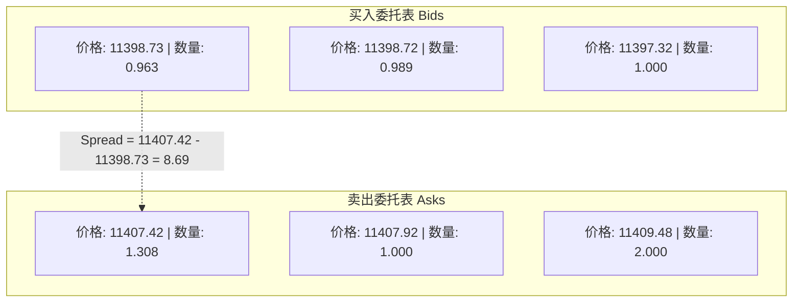
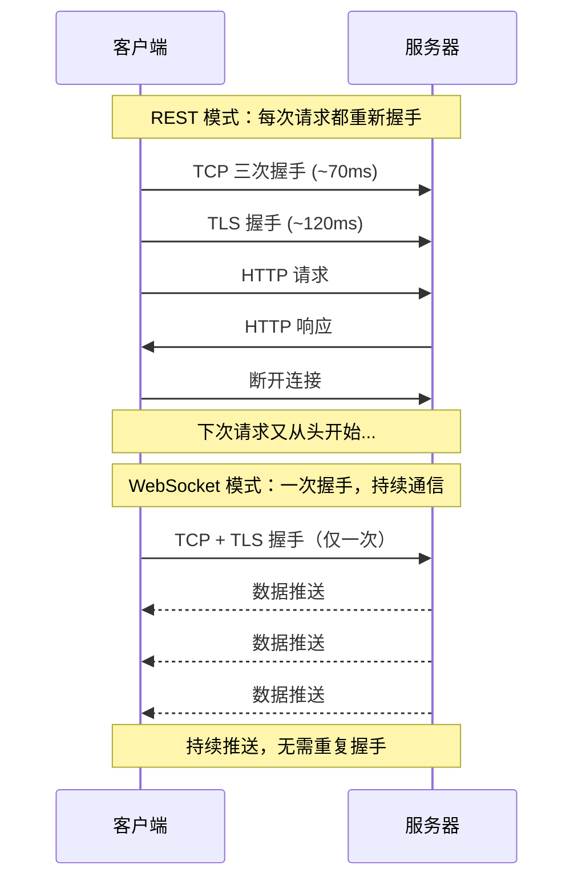
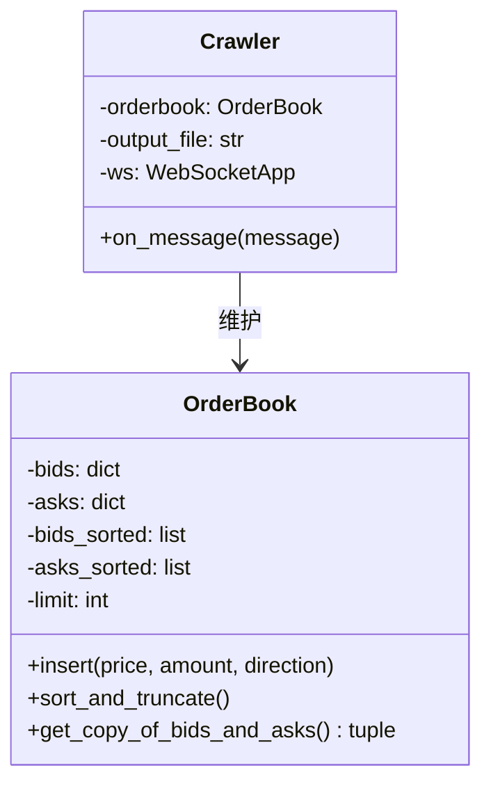
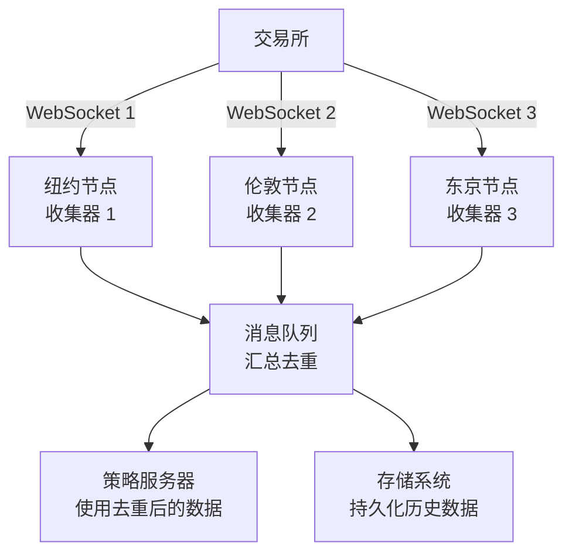

# 行情数据对接与 WebSocket

行情数据的实时性和有效性直接影响策略的盈亏。本文从**行情数据类型、撮合原理、WebSocket vs REST 对比到 OrderBook 爬虫实现**，完整讲解实时行情数据的获取和处理。

> 阅读提示

- 如果你只关心"为什么 WebSocket 比 REST 快"，直接看[WebSocket vs REST](#websocket-vs-rest)
- 如果你想理解行情数据的本质，建议从[行情数据类型](#行情数据类型)开始
- 所有代码可直接运行，依赖 `websocket-client`

## 行情数据类型

### 撮合原理

交易所维护买入和卖出两个委托表，按价格排序：



撮合规则：

1. **最高买入价 < 最低卖出价** → 无交易（常态），委托表价格永不交叉
2. **最高买入价 ≥ 最低卖出价** → 撮合发生，按最优价格成交
3. 新订单如果价格优于所有已有订单，直接从最优价格开始"吃"，直到完全成交

### 两种行情数据

| 类型 | 英文 | 内容 | 更新频率 |
|------|------|------|---------|
| 委托账本 | Order Book | 所有未成交的买卖委托，按价格分层 | 实时（每次委托变化） |
| 活动行情 | Tick Data | 每次撮合的交易记录（价格 + 数量） | 实时（每次成交） |

**Spread** = 最低卖出价 - 最高买入价。Spread 越小，说明交易所越活跃、流动性越好。

## WebSocket vs REST

### 延迟对比

```python
import requests
import timeit


def get_orderbook():
    """通过 REST 接口获取 orderbook"""
    orderbook = requests.get(
        "https://api.gemini.com/v1/book/btcusd"
    ).json()


# 测试 REST 接口延迟
n = 10
latency = timeit.timeit(
    'get_orderbook()',
    setup='from __main__ import get_orderbook',
    number=n
) / n
print(f'REST 平均延迟: {latency * 1000:.2f} ms')
# 典型输出（美国东海岸服务器）: ~200 ms
```

### 延迟来自哪里？

```bash
# 测量 TCP 和 SSL 握手的耗时
curl -w "TCP: %{time_connect}s, SSL: %{time_appconnect}s\n" \
     -so /dev/null https://www.gemini.com
# TCP handshake: 0.072s
# SSL handshake: 0.119s
# 握手总耗时: ~0.2s —— 占了总延迟的一大半！
```



### 全面对比

| 特性 | REST | WebSocket |
|------|------|-----------|
| 通信模式 | 请求 → 响应（单工） | 全双工双向 |
| 连接生命周期 | 每次请求新建 → 用完即断 | 一次握手 → 持久连接 |
| 服务器推送 | 不支持（需客户端轮询） | 原生支持 |
| 每次请求延迟 | ~200ms（含握手） | < 1ms（无握手） |
| 状态管理 | 简单、无状态 | 需处理连接状态和重连 |
| 适用场景 | 下单、撤单、查询账户 | 行情订阅、订单状态推送 |
| Python 库 | `requests` | `websocket-client` |

## WebSocket 实战

### 基础示例：全双工通信

```python
import websocket
import threading
import time


def on_message(ws, message):
    """收到服务器消息时调用"""
    print(f'Received: {message}')


def on_open(ws):
    """连接建立时调用"""
    def send_messages():
        for i in range(5):
            time.sleep(0.01)
            ws.send(f"{i}")
            print(f'Sent: {i}')
        time.sleep(1)
        ws.close()
        print("WebSocket closed")

    # 在独立线程中发送消息（不阻塞接收）
    threading.Thread(target=send_messages).start()


ws = websocket.WebSocketApp(
    "wss://echo.websocket.org/",
    on_message=on_message,
    on_open=on_open
)
ws.run_forever()

# 输出:
# Sent: 0
# Sent: 1
# Received: 0
# Sent: 2
# Received: 1
# ...
```

> 关键观察：**发送和接收是同时进行的**——这就是全双工。与 REST 的"发一个请求，等一个响应，再发下一个"完全不同。

### Gemini 行情订阅

```python
import ssl
import websocket
import json


# 全局计数器
count = 5


def on_message(ws, message):
    global count
    data = json.loads(message)
    print(f"事件类型: {data['type']}, "
          f"sequence: {data.get('socket_sequence', 'N/A')}")
    count -= 1
    # 接收 5 次消息后关闭连接
    if count == 0:
        ws.close()


ws = websocket.WebSocketApp(
    "wss://api.gemini.com/v1/marketdata/btcusd?top_of_book=true&offers=true",
    on_message=on_message
)
ws.run_forever(sslopt={"cert_reqs": ssl.CERT_NONE})

# 输出（服务器主动推送，客户端没有发送任何请求！）:
# 事件类型: update, sequence: 0
# 事件类型: update, sequence: 1
# 事件类型: update, sequence: 2
# ...
```

> 关键观察：**客户端没有发送任何请求，服务器却源源不断地推送数据**——这正是 WebSocket 相比 REST 的核心优势。

## OrderBook 爬虫实现

### 架构设计



### 完整代码

```python
import copy
import json
import ssl
import time
import websocket


class OrderBook:
    """委托账本数据结构"""

    BIDS = 'bid'
    ASKS = 'ask'

    def __init__(self, limit=20):
        self.limit = limit
        self.bids = {}           # {price: amount}
        self.asks = {}
        self.bids_sorted = []    # [(price, amount), ...]
        self.asks_sorted = []

    def insert(self, price, amount, direction):
        """
        插入或更新一条委托数据。

        关键逻辑: amount == 0 表示该价位已清空，需要删除
        """
        target = self.bids if direction == self.BIDS else self.asks
        if amount == 0:
            target.pop(price, None)
        else:
            target[price] = amount

    def sort_and_truncate(self):
        """排序并截取前 limit 条"""
        # bids 从高到低排序
        self.bids_sorted = sorted(
            self.bids.items(), reverse=True
        )[:self.limit]
        # asks 从低到高排序
        self.asks_sorted = sorted(
            self.asks.items()
        )[:self.limit]
        # 回写字典
        self.bids = dict(self.bids_sorted)
        self.asks = dict(self.asks_sorted)

    def get_copy_of_bids_and_asks(self):
        """
        深拷贝返回排序后的数据。

        为什么用深拷贝？
        如果直接返回引用，下一次 sort_and_truncate() 会修改
        已返回的数据，造成潜在的 bug。
        """
        return (
            copy.deepcopy(self.bids_sorted),
            copy.deepcopy(self.asks_sorted)
        )


class Crawler:
    """WebSocket 行情爬虫"""

    def __init__(self, symbol, output_file):
        self.orderbook = OrderBook(limit=10)
        self.output_file = output_file

        # 注意：on_message 是类方法，需要 lambda 包装传递 self
        self.ws = websocket.WebSocketApp(
            f'wss://api.gemini.com/v1/marketdata/{symbol}',
            on_message=lambda ws, msg: self.on_message(msg)
        )
        self.ws.run_forever(sslopt={'cert_reqs': ssl.CERT_NONE})

    def on_message(self, message):
        """处理收到的行情更新"""
        data = json.loads(message)

        # 处理每个变更事件
        for event in data['events']:
            price = float(event['price'])
            amount = float(event['remaining'])  # 注意：用 remaining 而非 delta
            direction = event['side']
            self.orderbook.insert(price, amount, direction)

        # 排序和截取
        self.orderbook.sort_and_truncate()

        # 持久化到文件
        with open(self.output_file, 'a+') as f:
            bids, asks = self.orderbook.get_copy_of_bids_and_asks()
            output = {
                'bids': bids,
                'asks': asks,
                'ts': int(time.time() * 1000)
            }
            f.write(json.dumps(output) + '\n')


if __name__ == '__main__':
    crawler = Crawler(symbol='BTCUSD', output_file='BTCUSD.txt')
```

### 实现要点

| 要点 | 说明 |
|------|------|
| **初始数据** | WebSocket 建立连接后的第一条消息包含当前时刻的完整 OrderBook |
| **增量更新** | 后续消息只包含变化部分（哪些价位的数量变了），基于初始数据修改 |
| **amount=0 的处理** | 当某个价位的 amount 变为 0 时，表示该价位已清空，需从字典中删除 |
| **深拷贝** | 返回排序数据时使用 `copy.deepcopy()`，避免后续排序影响已返回的引用 |
| **lambda 包装** | `on_message` 是类方法时，需要用 lambda 包装以正确传递 `self` |

### 输出示例

```json
{
  "bids": [[11398.73, 0.963], [11398.72, 0.989], [11397.32, 1.0]],
  "asks": [[11407.42, 1.308], [11407.92, 1.0], [11409.48, 2.0]],
  "ts": 1562558996535
}
```

## WebSocket 的工程设计考量

### 丢包和断连处理

虽然 WebSocket 基于 TCP（理论上可靠），但实际中仍可能遇到断连：

| 问题 | 解决方案 |
|------|---------|
| 网络断开 | 实现自动重连（指数退避） |
| 消息丢失（sequence 不连续） | 检测 socket_sequence 跳过，重新订阅完整快照 |
| 初始数据不完整 | 重连后第一条消息包含完整 OrderBook，基于它重建本地状态 |
| 交易所端异常 | 多机多网络冗余订阅，汇总去重 |

### 分布式冗余架构



> 代价：多个节点汇总去重会增加几十到数百毫秒的延迟。对于高频策略不可接受，但低频/波段策略完全值得——换来了系统的稳定性和架构的解耦性。

## 常见问题

**Q: WebSocket 会丢包吗？**

A: WebSocket 基于 TCP，理论上不会丢包。但实际中可能因网络断开导致连接中断。对于 OrderBook 爬虫，如果丢包，本地订单簿会出现偏差。解决方法是监控 `socket_sequence` 的连续性，发现跳号时重新订阅完整快照。

**Q: REST 和 WebSocket 应该分别用于什么场景？**

A: REST 用于低频的一次性操作（下单、查询账户），WebSocket 用于高频的持续数据流（行情订阅）。一个好的量化交易系统会同时使用两者。

**Q: 为什么 Gemini 的 WebSocket API 不需要 API Key？**

A: Public 接口（如行情数据）是公开的，任何人可以订阅。Private 接口（如订单状态变更通知）需要 API Key 认证，能收到属于自己账户的私有事件。

## 术语表

| 术语 | 英文 | 定义 |
|------|------|------|
| OrderBook | Order Book | 委托账本，记录所有未成交的买卖委托 |
| Tick | Tick Data | 每笔成交的交易记录 |
| Spread | Bid-Ask Spread | 最低卖价与最高买价之间的差额 |
| 全双工 | Full-Duplex | 通信双方可以同时发送和接收数据 |
| 单工 | Simplex / Half-Duplex | 通信只能在一个方向上进行，或轮流进行 |
| 撮合 | Matching | 交易所将买卖双方的订单配对成交的过程 |

## 延伸阅读

- [RESTful 与 Socket 交易执行](05-RESTful与Socket交易执行) — RESTful API 下单实战
- [量化交易入门](01-量化交易入门) — 交易系统架构总览
- [Kafka 与 ZMQ 消息队列](03-Kafka与ZMQ消息队列) — 分布式消息传递

## 版本差异（爬虫技术栈 → 当前版本）

| 库 | 本文编写时 | 当前稳定版 |
|----|-----------|-----------|
| `requests` | 2.28/2.31 | 2.32.x |
| `Scrapy` | 1.x/2.0 | 2.13.x（API 稳定，截至 2026-09） |
| `httpx` | 0.24 | 0.28.x |
| `Playwright` | 1.3x | 1.6x（Python 版） |
| `lxml`/`BeautifulSoup` | 旧版 | 保持稳定 |
| Python | 3.8-3.12 | 3.14（推荐） |

> 本文讲解的爬虫原理（HTTP、解析、反爬、存储）与核心 API 在最新版本中成立；注意 Python 3.9 及以下已 EOL，新项目使用 3.13/3.14。
