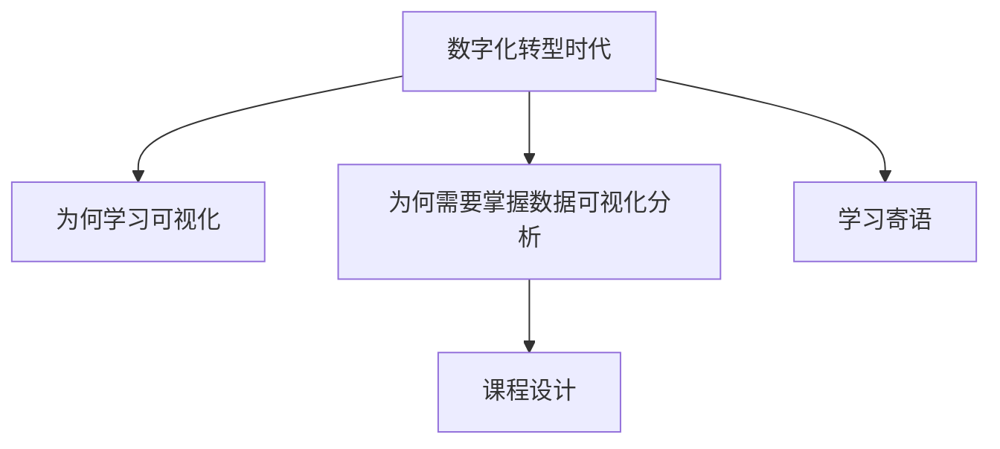

# 掌握数字化转型时代的必备技能

### 为什么你要学习数据可视化分析？

我们都知道，伴随大数据的发展，当今已经是一个数字化的世界，企业的**业务运营、主营业务增长和商业模式创新**，都需要依赖数字化转型，而**数据分析**是企业实现数字化转型中最重要的一环。历经数十年的信息化建设，各个企业其实已经积累了大量的数据，建立起了数据平台和数据体系，数据基础设施日益完善，如何发现、挖掘和利用好这些数据，从而呈现业务、发现异常、分析问题、定位原因，并且进一步赋能业务成为各项工作的关键。

而这其中，数据可视化分析作为数据分析的新型实现手段和方法，成为不容忽视的一环，数据可视化分析的应用随处可见，比如：

- 指挥中心：交通部门通过数据可视化，监测并预测拥堵情况，为交通优化提供合理策略。

- 个人账单：支付宝年度账单，让用户更直观地了解自己的购物、饮食等消费习惯。

- 疫情地图：让疫情传播链条和地区分布情况一目了然。

- 报表平台：企业通过数据可视化发现企业盈亏，从而调整自己的运营策略和发展方向。

相较于生涩的统计数字，**数据可视化报告和报表因其直观、可视化的呈现特点，成为连接数据分析师和企业管理者、业务运营人员、商业分析师、市场营销人员最好的纽带**。这点我们很好理解，那么什么是数据可视化分析呢？

数据可视化分析，是通过构建数据可视化图表，展示数据特征，从中发现数据信息的过程。它包括两个步骤：数据可视化呈现和数据分析洞察。

数据可视化分析，是数据分析师必须掌握的一项**核心技能**。但在不同企业中，执行数据可视化分析动作的角色或岗位会有不同：

- 比如设立数据可视化分析师，并且配备相应的技术人员；

- 比如设立数据可视化开发工程师，可见企业对于数据可视化分析的重视；

- 同时，数据可视化分析能力，也是业务运营人员（包括流量运营、内容运营、交易运营等）、商业分析师和企业管理人员的必备能力。

这类市场需求信息，我们可以通过拉勾网的平台搜索功能查看到，如下图所示。由于数据可视化存在的巨大商业价值，相关人才供不应求，无论一线互联网企业，还是传统企业都在大量招聘，而且薪资待遇也比较感人。

*图来自拉勾招聘网站*

### 你为什么需要这门课？

在从业过程中，以及目前各大公司的招聘 JD 描述中我们都可以看到，从事可视化分析的同学，一般都要求是计算机、统计学、数学、经济学等相关专业，必须具备一定的数学和统计学基础，但并不是每一个相关专业的同学，都能够拿到数据分析相关的职位，成为一个优秀的、高级别的数据分析师，为什么呢？最主要的原因是：因为缺乏系统化的训练，并不具备数据可视化分析体系化的知识结构和基于数据解决业务问题的完整思路。

而这也说明两个问题：

- **没有那么难，人人都能学，发展空间很大**，既可以探索数据挖掘、算法职位，也可以做产品经理、业务运营，或者将其内化为个人决策能力和成长路径的一部分。

- **看似简单，但你做好了也不容易**，如果你掌握的更多是单点知识，很难建立可复用的可视化分析思维，面对业务需求时（特别是急需求时）往往思路凌乱、没有头绪，无法发现数据的深层价值，更不能驱动业务方案。

对于一些初学者而言，缺少实战经验则是从掌握理论知识到实践应用之间需要跨越的鸿沟。拥有基础知识，但没有业务场景和实践机会，会导致无法系统化地完成整个项目。

### 课程设计

我大约有 5 年的时间主要基于互联网广告投放数据，并进行数据化营销分析和数据可视化报表设计，并通过不断地总结和沉淀，逐渐沉淀出一套基于工程实践的、完整的方法体系，希望通过这些内容分享给你。

课程合计 4 个模块，共 15 课时：

- **模块一，基础理论篇。** 体系化地梳理数据可视化的概念、建设目标、工作方法、操作流程和关键技术，帮你建立完整的数据分析思维，掌握整体的数据可视化分析方法论。

- **模块二，环境部署篇。** 通过数据可视化框架 PyEcharts 的安装部署、快速入门，让你掌握数据可视化的开发环境安装、部署方法，快速进入数据可视化的世界中来。了解了这个模块你就可以快速看到可视化效果，得到即时反馈，了解程序对你的切实帮助。

- **模块三，典型案例篇。** 基于一个简化的影片租赁数据可视化业务场景，通过 6 大实战案例、7 大操作步骤，从不同维度为你剖析整个数据分析工作过程，并详述数据可视化 6 大常用图表呈现设计和分析方法，希望能够让你触类旁通，在实际工作中具备举一反三的能力。

- **模块四，数据发布篇。** 整合主流前端框架 Bootstrap + Flask + Python + MySQL，融合 6 大数据可视化图表案例，发布为一个完整的网站，实现从知识单点到系统建设的转型，带你实现从菜鸟到熟手的能力进阶。

### 学习寄语

数据能力，将是未来必备的能力之一，它可以从战略、战术和业务上为不同角色的从业者赋能。因此适合所有从事数据相关工作的人，掌握数据可视化分析的思维、方法、流程和关键技术，能够增加自己的核心竞争力。

---

---

## 版本差异（数据科学栈 → 当前版本）

| 库 | 本文编写时 | 当前稳定版 | 升级要点 |
|----|-----------|-----------|---------|
| Python | 3.8-3.12 | 3.14 | 3.12+ 起性能显著提升；3.14 PEP 649/750 |
| NumPy | 1.x/2.0 | 2.5.x | `np.float_` 等别名移除；NEP 50 类型提升 |
| Pandas | 1.x/2.x | 2.3.x | CoW 可经选项开启（3.0 起将默认）；`inplace` 将移除；`str` dtype 将为默认 |
| Matplotlib | 3.x | 3.x 稳定版 | API 兼容，样式更新 |
| Seaborn | 0.12/0.13 | 0.13.x | API 稳定 |
| scikit-learn | 1.x | 1.9.x | API 稳定，新算法持续加入 |

> 本文讲解的数据分析流程（读取→清洗→分析→可视化）与核心 API 在最新版本中成立；升级时重点关注 Pandas 3.0 的 Copy-on-Write 与 NumPy 2.x 的类型变化。
