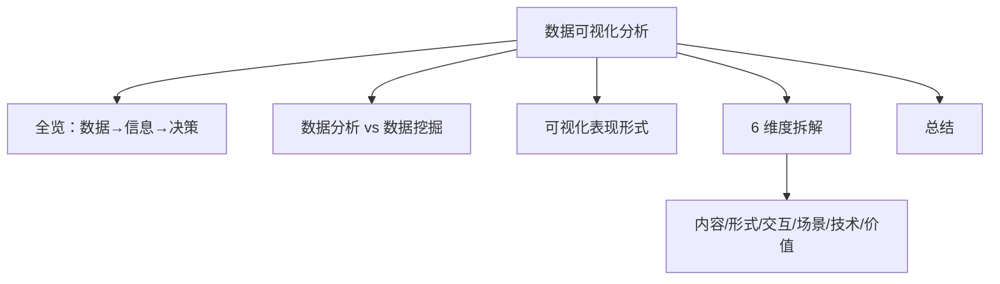

# 概念解析：什么是数据可视化分析

在本文，我将对数据分析、数据挖掘、数据可视化和数据可视化分析这 4 个概念进行剖析、对比，借此让你对数据可视化分析建立一个直观的认知，更好地区分开数据分析和数据挖掘，了解各自的知识体系。明确各自的区分和差异后，你在工作中，可以依据具体的业务场景，来选择适合的工作方法和技术体系。

### 数据可视化分析全览

在介绍几个概念之前，我们先来看一个关于数据可视化分析的典型案例，通过直观的、可视化的案例对其建立一个整体印象。最常见的场景之一就是数据仪表盘，如下图所示：

*数据仪表盘图*

图中包含了数据指标卡、折线图、饼图和表格等，这些都是我们经常使用的，后面也将会详细讲解每种图的设计和使用方法。

数据可视化分析包括**数据可视化呈现（制作可视化图表）**和**数据分析洞察（基于图表识别信息）** 两个过程。在实际的工作和业务场景中，通常用于**发现业务运营过程中出现的问题，以及进行辅助决策**，比如可以：

- 通过数据指标卡的同环比数据，发现当前指标是否出现波动：

- 通过折线图发现指标的发展和变化趋势；

- 通过柱状图发现指标之间的对比关系；

- 通过饼状图发现指标之间的比例关系。

数据可视化分析包括业务监控、运营分析系统和即席查询系统（临时性的 SQL 需求），并以数据报表、数据仪表盘、可视化数据大屏等形式呈现数据内容，以便直观地呈现数据指标。

直观地了解了数据可视化分析后，你是否会对它产生以下 4 个疑问：

- 如何构建一个完整的数据可视化分析系统，用于实现业务监控和运营分析呢？

- 实现数据可视化分析需要掌握哪些能力？

- 如何实现数据的可视化呈现？

- 如何基于呈现的数据可视化图表，进行数据分析和业务洞察呢？

在接下来这整个课程中，我将围绕上述 4 个问题，逐个知识点、逐类常用图表，以案例的方式来介绍数据可视化分析系统的设计和使用；课程的最后，我还会以一个完整的 Web 站点的方式，带你实现一个完整的数据可视化分析项目。

### 数据分析和数据挖掘的区别

通常情况下，我们所说的数据分析是指狭义的数据分析，它和数据挖掘合起来才是一个完整的数据分析过程，即广义的数据分析。因此，在学习数据可视化分析之前，先弄清楚数据分析和数据挖掘的概念很有必要。

数据科学诞生于英文的世界，其实翻译过来：

- 数据挖掘（[Data Mining](https://en.wikipedia.org/wiki/Data_mining)）是基于机器学习算法模型，挖掘数据背后隐藏知识的过程；

- 数据分析（[Data Analysis](https://en.wikipedia.org/wiki/Data_analysis)）是利用统计学，发现数据规律的过程。

相较于数据挖掘，数据分析更加直观，利用的是数据的浅层特征（可以直接发现）；而数据挖掘是必须借助机器学习算法模型，才能够发现数据背后的知识。

通过上面简短的分析，你应该已经看出二者的部分差异了，但这还不够明确。接下来，我用一张图来带你详细拆解下狭义数据分析和数据挖掘的差异，以及各个维度的对比。

*数据分析和数据挖掘对比图*

图中红色和蓝色分别代表了狭义数据分析和数据挖掘相关的内容。接下来我将结合图中的 6 个方面，为你逐个剖析它们的差异。

#### 狭义数据分析

- **数据资源**，数据分析的对象，即数据资源，一般都是数值数据。

- **工作方法**，基于统计分析，主要采用指标监控、趋势分析、对比分析和组成分析等常用方法。比如，可以通过数据指标卡来监控业务指标的完成情况；还可以通过同环比，发现业务指标是否超出了设定的波动范围。

- **工作流程**，一般分为 7 个步骤，包括业务理解、指标定义、维度定义、呈现设计、代码设计、数据发布和分析洞察，如下图所示。这部分内容我将结合第三部分的第一个实战案例进行详细讲解，并贯穿本课程实战部分的始终。

*数据分析工作流程图*

- **业务场景**包括宏观决策、业务监控、运营分析和即席查询等。

- **输出结果**是计算之后的各种指标，比如均值、方差、最大值、最小值、关联系数等，通常以数据可视化报表或数据分析报告的形式存在。

- **工具平台**，常用平台的开源版本有 Redash、Metabase、Superset，商业版本有 PowerBI、Quick BI、网易有数等。推荐你使用开源版本 Redash，其最核心的特点是用户接口设计的直观，容易操作。

#### 数据挖掘

- **数据资源**，除了数值数据之外，还包括多种形式，比如文本数据、语音数据、视频数据等。举个例子，淘宝或京东的商品评论数据就是一个典型的文本数据，这类数据可以通过情感识别的算法模型，进行用户情感评价。

- **工作方法**，基于机器学习和人工智能，发现数据潜藏的价值，主要采用决策树算法、逻辑回归算法、神经网络算法、贝叶斯分类算法、聚类算法、关联分析算法等算法模型。比如，用户分类画像问题，就可以通过聚类算法来处理。

- **工作流程**，有一个行业标准过程模型，即 CRISP-DM，它把该流程分为了 6 个环节，包括业务理解、数据理解、数据准备、数据建模、模型评估和模型发布，如下图所示：

*数据挖掘工作流程图*

- **业务场景**，包括分类问题、聚类问题、关联分析、回归预测和异常检测等。比如，基于历史交易数据进行交易量预测的问题，就是一个典型的回归预测问题。

- **输出结果**，是训练好的数据模型和输入数据训练的结果，比如，分类标签、聚类结果、关联系数和回归结果等。还可以基于训练好的分类模型，输入新的数据样本，从而获得该样本的分类标签。

- **工具平台**，数据挖掘的则是机器学习和深度学习方面的库，比如 SKlearn、TensorFlow、PyTorch、Caffe2、SparkML 等。

在这里讲述数据分析和数据挖掘的概念与区别，只是为了帮你梳理清楚这二者之间的区别，为你建立起一个完整的数据分析世界观，从而为学习本课程的内容扫清不必要的障碍。接下来我就继续讲解数据可视化的内容，也是本课程的重点内容。

### 数据可视化及其表现形式

[数据可视化](https://en.wikipedia.org/wiki/Data_visualization)起源于 1960 年计算机图形学，是利用图表呈现数据内容的一种方法。数据可视化的概念中，有一个关键信息——数据可视化研究的对象是数据可视化的表现形式。

那么什么是数据可视化的表现形式呢？其实就是各种点、线、面和体的图表，比如散点图、折线图、柱状图、漏斗图等。不同的图表为你展现的数据信息是不同的，比如：

- 折线图，展现指标随着时间变化趋势的场景；

- 柱状图，展现多个指标下的数据变化对比情况的场景。

常用的数据可视化图表有 16 种，如下图所示：

*常用的数据可视化图表*

这部分内容我将在第三部分“实战案例篇”进行详细讲解，并且在后面的案例中我也会告诉你，它们适用的业务场景，所以在本文我就不一一赘述了。但是我希望你可以在本文中对它们建立一个初步的印象，带着自己的疑问和见解去学习下一部分。

### 6 个维度拆解数据可视化分析

数据可视化分析是利用数据可视化呈现能力，进行数据分析的一种方法，通过可视化呈现的图表，发现有用的信息，得出数据结论和辅助宏观决策。简单来说，就是把枯燥的数字变成各种各样的图表，更好地帮助你发现其中有价值的信息。数据可视化分析是实现广义数据分析的一种模式，具有与狭义数据分析相同的体系结构，并且在某些方面，拓展了数据可视化的内容。

由于后面的课时我会针对这个过程从多个维度进行呈现，所以在这里我就不详细讲解了。为了方便你与上面两个概念进行对比，我依旧会从 6 个方面为你拆解数据可视化分析的内容。

### 总结

本文详细介绍了数据分析、数据挖掘、数据可视化和数据可视化分析的概念和体系结构，旨在让你对数据可视化分析有一个明确的认知。明确了它们的概念，再回到本文一开始提到的业务案例，你是否已经有了明确的答案呢？不妨结合讲述的知识体系，尝试寻找答案。

---

---

## 版本差异（数据科学栈 → 当前版本）

| 库 | 本文编写时 | 当前稳定版 | 升级要点 |
|----|-----------|-----------|---------|
| Python | 3.8-3.12 | 3.14 | 3.12+ 起性能显著提升；3.14 PEP 649/750 |
| NumPy | 1.x/2.0 | 2.5.x | `np.float_` 等别名移除；NEP 50 类型提升 |
| Pandas | 1.x/2.x | 2.3.x | CoW 可经选项开启（3.0 起将默认）；`inplace` 将移除；`str` dtype 将为默认 |
| Matplotlib | 3.x | 3.x 稳定版 | API 兼容，样式更新 |
| Seaborn | 0.12/0.13 | 0.13.x | API 稳定 |
| scikit-learn | 1.x | 1.9.x | API 稳定，新算法持续加入 |

> 本文讲解的数据分析流程（读取→清洗→分析→可视化）与核心 API 在最新版本中成立；升级时重点关注 Pandas 3.0 的 Copy-on-Write 与 NumPy 2.x 的类型变化。
