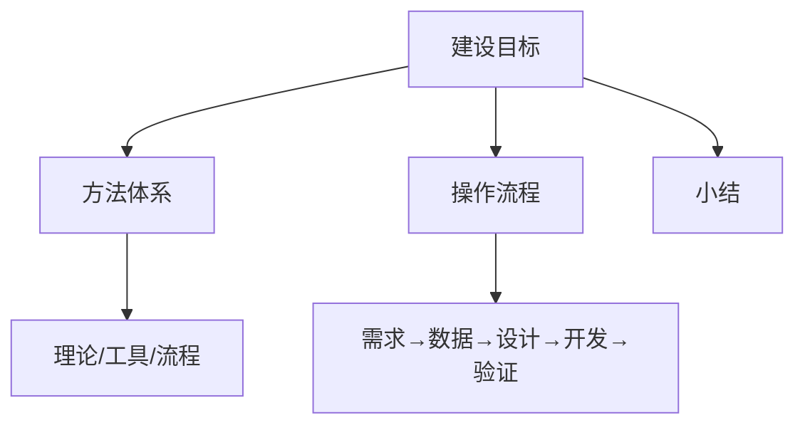

# 建设方法：数据可视化分析的庖丁之术

前文，我介绍了数据可视化分析的基本概念，通过对比的方式，讲述了数据可视化分析的概念定义和知识体系，相信你对数据可视化分析已经有了一个基本的了解。本文，我将给大家分享数据可视化分析的方法论，内容包括：建设目标、工作方法和建设流程。希望你在学完这个课时之后，能够掌握数据可视化分析的建设目标、方法体系和操作流程，并且能够吸收和学会运用。

*数据可视化分析方法论结构图*

### 建设目标

在讲解“建设目标”之前，我先讲讲数据可视化分析，它是数据分析的一种模式，通过强调数据内容的呈现方式、可视化数据内容，以数据的视觉特征来描述数据背后的特征。

数据可视化分析的输入数据，既可以是经过简单处理的原始数据，也可以是机器学习算法模型处理过后的输出结果，比如线性回归数据或聚类特征数据。它的处理过程，包括清洗、转换、加工、可视化图表设计和可视化图表发布。

数据可视化分析的内容输出是可视化的，支持动态交互的可视化图表；它的结果输出是基于数据可视化特征，发现的数据洞察结论。这里需要提醒你的是，数据可视化的内容输出并不等同于结果输出，因为数据可视化的内容输出只是数据分析的一个过程。基于可视化输出的内容，需要介入人工/机器的洞察之后的数据结论，综合之后才是数据可视化分析的最终结果。

接下来我们来讲讲建设目标，它是为业务服务的，用来解决数据化运营、数据化营销、数据化决策等企业数字化转型面临的业务数据化问题。建设目标是围绕业务问题解决的过程，分为 4 个环节：呈现业务、发现问题、分析问题、定位原因。

*数据可视化分析之建设目标图*

#### 1.呈现业务

数据可视化分析的首要目标是通过将数据以可视化图表的形式真实、完整地呈现业务现状，为发现业务问题打好基础，包括实时的业务数据、数据历史的变化趋势、数据的空间分布和数据构成分布等，在系统建设层面，呈现业务对应的业务系统，往往是业务运营监控系统。通常情况下，我们看到的类似天猫双12数据大屏，公安、交通指挥中心的数据大屏等，都是呈现业务的典型案例。

#### 2.发现异常

了解了业务后，就要对相关数据进行多维度的监控，发现数据的异常，包括对比差异、时间变化趋势、空间分布和构成结构上的异常等，都属于异常。这一环节可以人工完成，也可以系统自动完成，一般的数据可视化系统都会集成异常数据监控能力。

#### 3.分析问题

分析问题往往需要人工介入，基于业务现象和异常的表现，通过时间维度、空间维度、结构维度和关系维度，分析引起异常的可能原因，并进行逐一验证。分析问题通常以人工 + 系统的方式完成，系统提供分析问题所需要的功能，人工通过该功能进行操作来验证问题的原因。

#### 4.定位原因

定位原因是一个比较复杂的系统工程，不止需要人工介入，还要基于数据表现，制定对应的产品和运营策略，通过A/B测试的模式，来验证假设，对于分析问题过程中的推论进行业务验证，从而发现根本原因。例如，当你发现商品的价格因素可能是导致销量下降的原因的时候，可以通过适当的降价/促销等营销活动，来验证这个假设是否成立。

上述四个方面既是数据可视化分析的建设目标，同时也是基于数据可视化分析，解决业务问题的四个步骤，在逻辑上具有前后依赖关系。从系统建设和使用视角而言，则是业务监控、数据化运营、数据化营销和数据化决策的过程。构建数据可视化分析体系，可以有效支撑业务运营决策，从而优化现有业务过程模型。

以上就是建设目标的 4 个过程，你在实际的工作过程中，也可以结合着自己的业务场景、面临的问题来回顾和补充完善这些内容。下面我们就来讲讲数据可视化的方法体系。

### 方法体系

数据可视化分析是数据分析业务活动和数据可视化呈现技术的结合，该工作并不是从零开始的原创型活动，因此在开展该工作时，我们有许多可以借鉴和参考的方法。基于过往对实践的总结，以及跨行业领域的经验参考，我梳理出了一条关于数据可视化分析工作的方法论，该方法论体系结构如下图所示：

*数据可视化分析方法体系图*

数据可视化分析的常用工作方法包括专家法、参照法、归纳法和混合法 4 种。

- **专家法**是一种自上而下、整体规划的方法，适合具有行业领域专家的情况。在这种情况下， 依赖行业领域专家的经验，我们可以构建起体系化的数据可视化分析体系。

- **参照法**是一种通过参照和对标行业标准，适配自身业务，构建数据可视化分析体系的方法。该方法适合自身没有行业领域专家，但是有行业内最佳实践或者标准规范的团队。

- **归纳法**也是一种自下而上的工作方法，通过归纳和总结自身业务特点，不断抽象和提炼公共模型，逐步建设数据可视化分析体系的过程。该方法适用于既无行业专家，也没有经验丰富的团队的情况，是诸多方法中投入成本最高的，但很多时候，却不得不采取的一种方法。

- **混合法**是数据可视化分析体系建设到一定阶段之后的必然选择。一方面通过归纳法实践，有了可供参考的模式，形成了可供参照的规范；另外一方面，团队成员在实践中逐步了解业务、了解技术、了解数据，从而成为该细分领域的专家。

数据可视化分析的工作方法的选择，与企业环境、团队约束、行业发展有着密切的依赖关系，需要基于各自的现状进行取舍。无论选择哪种工作方法，数据可视化分析的基本原则是不变的，即**围绕业务进行分析**，服务于业务、解决业务问题，是该工作必须坚持的核心原则。

明确了数据可视化分析的目的，我们就要开始工作了。

### 操作流程

数据可视化分析的操作流程并没有一个行业标准和规范，不过基于实践经验的总结，同时参考跨领域的行业标准和规范 CRISP-DIM，我们设计出了数据可视化分析的操作流程，共分为 7 个步骤，如下图所示：

*数据可视化分析操作流程图*

#### 1.业务理解

业务理解是进行数据可视化分析的起点。一个不了解业务的人，无法参与到数据可视化分析的工作中来；拒绝了解业务的人，没有权力参与数据可视化分析的工作。

在业务理解上，你需要做到：

- 系统地掌握业务流程，包括业务流、数据流和资金流等；

- 深刻理解业务规则，是解读业务的前提；

- 识别业务活动，是输出业务指标和分析维度的关键；

#### 2.定义指标

定义指标是数据可视化分析中的第 2 个步骤。指标是说明总体综合数量特征的概念， 一个完整的指标一般由指标名称和指标数值两部分组成，它体现了事物质的规定性、量的规定性两个方面的特点。定义指标的过程是基于业务活动、抽取和提炼可度量因子的过程。

完整的指标定义过程包括：

- **业务口径**，指标的业务逻辑，比如订单已定量 = 订单净已定量 + 订单已退量， 这一过程赋予了业务指标业务含义；

- **计算逻辑**，业务指标的技术口径，对应完整的 SQL 查询语句和对应的聚合逻辑；

- **审批流程**，确保指标全局唯一性的保障机制，通过审核机制一方面可以确保指标的逻辑正确，另外一方面可以避免指标的重复建设；

- **权限控制**，对于指标使用范围的限定和约束，可以有效约束核心指标数据的使用边界，是保障数据安全的一种手段。

完成指标定义的范例如下图所示：

*指标定义图*

#### 3.定义维度

定义维度是数据可视化分析的第 3 个步骤，维度是分析问题和查看指标的不同视角，指标和维度共同构成数据可视化分析的内容框架。常见的分析维度包括对比维度、分布维度、构成维度和关系维度等，一个完整的关于维度和常用图表的关系如下图所示：

*常见维度图*

#### 4.设计呈现

设计呈现是数据可视化分析的第 4 个步骤，基于已定义的指标和维度，设计页面布局、选择可视图表、设计主题样式和数据交互模式，进行数据可视化呈现的过程。该步骤的核心在于可视化图表的选择，常见的可视化图表包括：折线图、柱状图、散点图等，每个图表适用的场景不同，我会在后面课时中具体讲解。常见图表呈现效果如下图所示：

*Echarts 可视化图表*

#### 5.程序设计

程序设计是数据可视化分析的第 5 个步骤。程序设计的过程是数据可视化分析工作从设计到研发的转换阶段，需要完成**数据理解、数据准备、图表设计和数据验证**工作。伴随数据可视化分析平台技术的发展，无代码开发平台的功能越来越完善，如 Redash、Metabase、Superset 等。

这使得没有代码开发基础和开发资源的团队，在该环节，有了新的选择。他们可以选择可视化数据分析平台，进行无代码开发、程序设计的工作，可以替换为图表设计的工作。可视化分析平台 Redash 的操作界面如下图所示：

*数据可视化分析平台图*

#### 6.数据发布

数据发布是数据可视化分析的第 6 个步骤，数据发布的目的是把程序设计阶段的输出结果，通过工具化和线上化的手段进行共享。上述 5 个步骤，都是服务于第 6 个步骤的。数据发布面向不同的用户群体，发布不同的数据内容，包括个人客户、部门客户、业务线客户和集团客户。数据发布的最终输出形式，往往以 Web 站点的方式对外进行，包括数据看板、仪表盘和数据大屏等。典型的数据发布案例如下图所示：

*数据发布图*

#### 7.分析洞察

分析洞察是数据可视化分析的最后一个步骤，前面 6 个步骤，完成的是数据呈现业务的问题。该步骤是建立在数据发布基础之上的，基于构建的数据可视化图表，进行问题发现、问题分析和定位原因的过程。虽然分析洞察是数据可视化分析工作的最后一个环节，但不是数据分析工作的最后一个步骤，得出的结论，需要应用到运营策略、营销策略中去，才能够产生最后的价值。

以某单一产品的销售情况为例。某一个时间节点，总销量下降，我们可以在商品销量趋势图中看到明显的转折点，通过商品销量的构成维度、地区分布维度及对比维度，可以发现该商品销量下降的情况是：某个时间节点，某个地区的销量下降导致的总销量异常，发现问题发生的地方。尔后，调整产品运营、营销策略验证具体原因，从而解决相关问题。

### 小结

本文主要介绍了数据可视化分析的建设目标、方法体系和操作流程。通过本文的学习，希望你能够了解：

- 数据可视化分析旨在解决业务数据化过程中面临的诸多问题；

- 数据可视化分析工作并非从零开始，需要借鉴可参考的分析方法，让其成为我们的助力；

- 基于实践经验的总结，沉淀出了数据可视化分析的一套完整的操作流程，可以作为我们进行数据可视化分析工作的推进步骤。

---

---

## 版本差异（数据科学栈 → 当前版本）

| 库 | 本文编写时 | 当前稳定版 | 升级要点 |
|----|-----------|-----------|---------|
| Python | 3.8-3.12 | 3.14 | 3.12+ 起性能显著提升；3.14 PEP 649/750 |
| NumPy | 1.x/2.0 | 2.5.x | `np.float_` 等别名移除；NEP 50 类型提升 |
| Pandas | 1.x/2.x | 2.3.x | CoW 可经选项开启（3.0 起将默认）；`inplace` 将移除；`str` dtype 将为默认 |
| Matplotlib | 3.x | 3.x 稳定版 | API 兼容，样式更新 |
| Seaborn | 0.12/0.13 | 0.13.x | API 稳定 |
| scikit-learn | 1.x | 1.9.x | API 稳定，新算法持续加入 |

> 本文讲解的数据分析流程（读取→清洗→分析→可视化）与核心 API 在最新版本中成立；升级时重点关注 Pandas 3.0 的 Copy-on-Write 与 NumPy 2.x 的类型变化。
