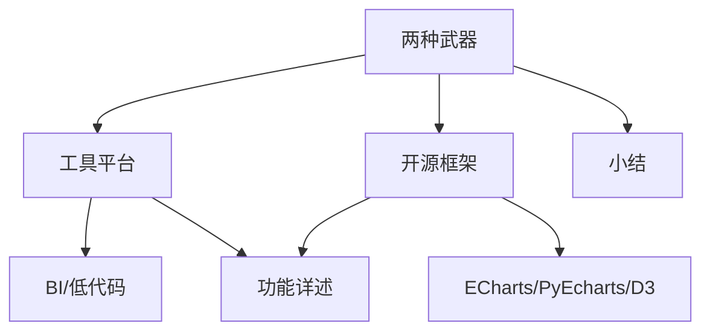

# 技术框架：数据可视化分析的两种武器

数据可视化分析有两类主要技术：**工具平台**和**开发框架**。

数据可视化技术完整的知识结构如下图所示：

*本节知识结构图*

主流的数据可视化分析工具、数据可视化开源框架分别有哪些？本文对数据可视化技术资源做一个全局的认知。同时，重点介绍一款开源的数据可视化分析工具：Redash，包括：**Redash 的官方网站**、**源码资源**、**安装部署**和**功能模块**。

### 工具平台

数据可视化分析有很多现成的、可以直接使用的工具平台，这些工具平台包括开源版本和商业版本，**常用的开源数据可视化分析工具平台**包括：Redash、Metabase 和 Superset，**常用的商业数据可视化分析工具平台**包括：PowerBI、Tableau、QuickBI、Sugar 和网易有数等。这些工具平台提供的功能通常包括：数据源管理、即席查询、数据可视化和仪表盘等核心功能。

我将以开源框架 Redash 作为分析对象，介绍数据可视化分析平台提供的业务能力。

#### 运行演示

在介绍 Redash 相关的功能之前，我们首先来看一下 Redash 运行之后的样子。

Redash 提供的核心功能有 4 个：

- 数据源管理

- SQL 即席查询

- 数据可视化

- 数据仪表盘

数据源管理，是 SQL 即席查询、数据可视化和数据仪表盘设计等功能的前置条件，也是使用 Redash 的第一步。我们首先来看，数据源管理的功能界面：

*数据源管理*

创建数据源之后，就可以基于配置好的数据源，进行 SQL 即席查询。Redash 的 SQL 查询功能操作界面如下图所示：

*SQL 即席查询*

Redash 支持对 SQL 查询结果进行可视化展现，通过可视化图表的方式，呈现数据特征，如下图所示：

*数据可视化*

Redash 生成的图表，可以组织到一个称为仪表盘的页面，核心指标、相关的图表都可以通过该页面呈现，起到相关内容聚合的作用。

*数据仪表盘*

以上内容介绍了数据可视化分析工具 Redash 核心功能的运行演示界面，其目的是让大家对于 Redash 的核心功能有一个初步的了解。接下来，我将带你了解 Redash。

#### 官方网站

Redash 是一个开源项目，它有一个自己官方网站，地址为：[https://redash.io/](https://redash.io/)，其中会有一些开放源码。官网提供的主要内容是相关的用户手册和学习环境。

*Redash 官方网站*

Redash 官方提供了一个免费的 Redash 学习环境，可以通过注册账号，获得试用，具体的注册方法和需要完善的信息如下图所示：

*注册 Redash 账号*

注册完成以后，你可以获得一个免费的 Redash 的学习环境。注册登录后的界面如下图所示：

*Redash 学习环境*

通过 Redash 官方提供的学习环境，我们可以拥有一个真实的，可以直接体验 Redash 功能的工作空间。同时结合用户使用教程，我们可以快速掌握 Redash 的核心功能。具体的用户帮助手册链接地址为：[https://redash.io/help/user-guide/getting-started](https://redash.io/help/user-guide/getting-started)。

该页面提供了 Redash 核心功能的使用说明，包括：快速入门、数据源管理、数据查询、数据可视化、仪表盘设计、权限管理和接口管理等模块，具体的帮助功能入口页面如下图所示：

*用户帮助页面*

到这里，我们就获得了 Redash 的学习环境和相关的用户使用手册信息。接下来我将继续介绍，如何安装和部署 Redash 的开发环境。

#### 源码资源

Redash 是一个开源的、免费的数据可视化分析的工具，介绍 Redash 的安装部署之前，我们首先来看一下 Redash 的源码资源，其中包括 2 个项目：

- Redash 的程序源码，地址为[https://github.com/getredash](https://github.com/getredash)；

- Redash 的安装脚本，地址为[https://github.com/getredash/setup](https://github.com/getredash/setup)。

Redash 的程序源码，包括前端程序和后端相应程序，源码的目录结构如下图所示：

*Redash 源码结构*

Redash 的源码支持多种安装方式，其中最为便捷的方式是基于 Docker 的模式。同时，Redash 的作者提供了一个完整的安装脚本，我们可以使用这个脚本进行全自动化的安装。该脚本主要支持的是**Ubuntu 18.04 版本**，AWS、GCE 等平台的安装，可以参照用户手册进行。Redash 安装脚本项目内容结构如下图所示：

*Redash 安装脚本源码结构*

通过脚本，我们可以实现基于 Docker 模式下的，Redash 环境的自动安装。

以上，我介绍了 Redash 的源码资源和安装脚本的基本情况。如果你想要了解如何基于 Redash 构建开发环境，并进行二次开发，定制自己的数据可视化分析平台，可以进一步查阅官方文档中的开发者指南。

接下来，我再介绍一下 Redash 的安装方法。

#### 安装步骤

Redash 的安装部署，最简单的方式是通过脚本安装。

我们的实验环境，是一个干净的 Ubuntu 18.04 环境，具体的安装步骤包括三步：

- 下载脚本项目；

- 执行安装脚本；

- 结果验证。

安装脚本项目就是前面我们在源码资源中所介绍的开源项目，可以通过指令：**`git clone https://github.com/getredash/setup.git`** 下载到本地，然后**进入项目根目录**，并**对 setup.sh 脚本文件，赋予程序执行权限：`cd setup && chmod +x setup.sh`**。接下来通过**调用：`sudo ./setup.sh` 执行安装脚本**。

项目的安装过程中，会默认完成三件事情：安装 docker、下载 redash 映像文件，配置和启动。安装过程的执行界面如下图所示：

*Redash 安装脚本执行*

项目安装完成以后，无须任何额外操作，即可以通过浏览器访问，**默认端口 5000**，默认访问页面为账号注册页面。具体的访问界面截图如下所示：

*Redash 运行界面*

关于 Redash 的安装部署，需要特别强调的是，基于脚本的安装方式，因为运行时间较长，期间会因为网络原因导致下载失败，所以需要进行多次重复执行。

### 功能详述

Redash 提供的核心功能包括：**数据源管理**、**SQL 查询**、**数据可视化**和**数据仪表盘**这 4 个部分，其功能结构如下：

*Redash 核心功能*

**数据源管理**提供**主流数据源的连接和配置**。Redash 支持当前主流的关系型数据库、非关系型数据和文档数据，具有独立的数据源管理功能，可以实现自定义数据源的连接和使用。

Redash 支持的数据源清单，可以在帮助文档中查看，详细的地址为：[https://redash.io/help/data-sources/querying/supported-data-sources](https://redash.io/help/data-sources/querying/supported-data-sources)。完整的数据源类型清单如下表所示：

| 数据源 | 云托管 | 自管 |
| --- | --- | --- |
| Amazon Athena | ✓ | ✓ |
| Amazon DynamoDB | ✓ | ✓ |
| Amazon Redshift | ✓ | ✓ |
| Axibase Time Series Database | ✓ | ✓ |
| Cassandra | ✓ | ✓ |
| ClickHouse | ✓ | ✓ |
| CockroachDB | ✓ | ✓ |
| CSV | ✓ | |
| Databricks | ✓ | ✓ |
| DB2 by I | ✓ | ✓ |
| Druid | ✓ | ✓ |
| Elasticsearch | ✓ | ✓ |
| Google Analytics | ✓ | ✓ |
| Google BigQuery | ✓ | ✓ |
| Google Spreadsheets | ✓ | ✓ |
| Graphite | ✓ | ✓ |
| Greenplum | | ✓ |
| Hive | ✓ | ✓ |
| Impala | ✓ | ✓ |
| InfluxDB | ✓ | ✓ |
| JIRA | ✓ | ✓ |
| JSON | ✓ | ✓ |
| Apache Kylin | ✓ | ✓ |
| OmniSciDB (Formerly MapD) | | ✓ |
| MemSQL | ✓ | ✓ |
| Microsoft Azure Data Warehouse / Synapse | ✓ | ✓ |
| Microsoft Azure SQL Database | ✓ | ✓ |
| Microsoft SQL Server | ✓ | ✓ |
| MongoDB | ✓ | ✓ |
| MySQL | ✓ | ✓ |
| Oracle | ✓ | ✓ |
| PostgreSQL | ✓ | ✓ |
| Presto | ✓ | ✓ |
| Prometheus | ✓ | ✓ |
| Python | | ✓ |
| Qubole | ✓ | ✓ |
| Rockset | ✓ | ✓ |
| Salesforce | ✓ | ✓ |
| ScyllaDB | ✓ | ✓ |
| Shell Scripts | | ✓ |
| Snowflake | ✓ | ✓ |
| SQLite | | ✓ |
| TreasureData | ✓ | ✓ |
| Vertica | ✓ | ✓ |
| Yandex AppMetrica | ✓ | ✓ |
| Yandex Metrica | ✓ | ✓ |

Redash 对我们日常数据可视化分析工作中，常用的数据源都提供了连接支持能力，包括：MySQL、Oracle、Hive、Spark、Presto 等。

建立完数据连接之后，我们就可以进行数据 SQL 查询了。Redash 支持主流数据源，也集成了多种数据源的 SQL 标准和规范，你可以按照相关数据源的语法规范，书写 SQL 语句。同时，Redash SQL 查询功能提供了语法高亮、自动格式化、变量支持、历史记录保存、自动补全等功能。SQL 查询的输出结果，默认以表格形式输出，并支持翻页功能。

SQL 查询输出的数据结果，除了支持以表格的形式输出之外，也支持数据可视化，我们可以通过图表可视化配置功能，进行结果数据的可视化呈现设计，查询结果数据可视化的配置界面如下图所示：

*图表设置*

上图中，左侧部分是**图表属性设置参数**，右侧部分是**实时的数据预览功能**。通过图表可视化，我们可以直观地发现数据所具有的特征。一个数据查询结果，可以通过多个图表进行可视化呈现，设计出的可视化图表，也可以保存下来，并且发布出去，以供后续环节使用。

发布后的数据图表，可以作为数据仪表盘的一部分，整合到一个页面进行呈现，即**数据仪表盘**。数据仪表盘是业务主题相关的数据图表的集中呈现，通常情况下，我们把同一业务主题的可视化图表，整合到同一个页面进行呈现。数据仪表盘支持创建、保存和发布，发布后的数据仪表盘，可以在多个用户之间共享。

### 开源框架

数据可视化分析有很多现成的、可以直接复用的开源技术框架，其中常用的**前端 JavaScript 图表可视化框架**有 ECharts、Highcharts、D3.js；**Python 数据处理开源框架**有 NumPy、Pandas、Matplotlib；**Python 机器学习框架**有 scikit-learn（Sklearn）、TensorFlow、PyTorch。

通过这些框架，我们可以实现类似 Redash 提供的数据可视化呈现能力，而事实上，Redash 的实现就是基于这些技术进行的。

关于如何基于这些开源框架，构建数据可视化图表，我将在“模块二：环境部署篇”“模块三：实战案例篇”进行逐个图表的，逐项功能的详细介绍，在此不做赘述。

### 小结

本节内容，介绍了主流的数据可视化分析技术，包括工具平台和开源框架，并且详细介绍了开源的数据可视化分析工具 Redash 的官方资源、安装部署和功能模块。

在学习本文之前，你可能会疑惑：通过本文的学习，是否可以掌握数据仪表盘的设计？但在学完之后，相信你已经掌握了基于数据可视化工具平台 Redash 设计仪表盘的思路和方法。如何基于开源框架，自己动手构建数据仪表盘的内容，我会在课程的后续部分进行介绍。

---

---

## 版本差异（数据科学栈 → 当前版本）

| 库 | 本文编写时 | 当前稳定版 | 升级要点 |
|----|-----------|-----------|---------|
| Python | 3.8-3.12 | 3.14 | 3.12+ 起性能显著提升；3.14 PEP 649/750 |
| NumPy | 1.x/2.0 | 2.5.x | `np.float_` 等别名移除；NEP 50 类型提升 |
| Pandas | 1.x/2.x | 2.3.x | CoW 可经选项开启（3.0 起将默认）；`inplace` 将移除；`str` dtype 将为默认 |
| Matplotlib | 3.x | 3.x 稳定版 | API 兼容，样式更新 |
| Seaborn | 0.12/0.13 | 0.13.x | API 稳定 |
| scikit-learn | 1.x | 1.9.x | API 稳定，新算法持续加入 |

> 本文讲解的数据分析流程（读取→清洗→分析→可视化）与核心 API 在最新版本中成立；升级时重点关注 Pandas 3.0 的 Copy-on-Write 与 NumPy 2.x 的类型变化。
