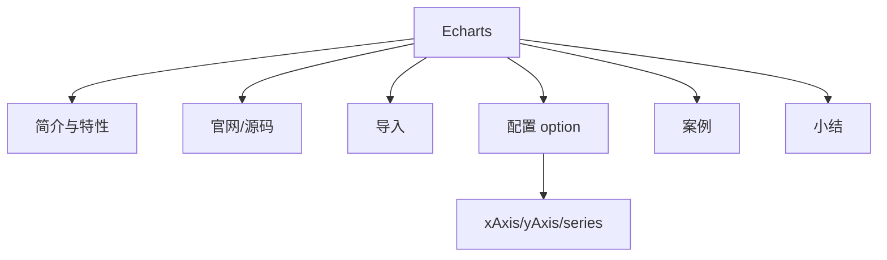

# 图表组件：Echart 数据可视化图表基础

本文是课程的第二个模块，环境部署篇的第一个课时。在第一部分的基础理论篇，我向你介绍了数据可视化分析的概念定义、方法体系和关键技术。接下来，我会带你了解基于开源框架，如何部署数据可视化分析的开发环境，内容包括：图表组件、框架搭建和快速入门。

作为模块二的第一个课时，我们先来看看图表组件。

### Echarts 简介

Echarts 是一个**开源的**、**免费的**、**成熟的**、**商业级图表可视化框架**，是 Apache 开源社区的顶级项目之一，也是国内使用最多和最为广泛的可视化图表框架之一。 数据可视化图表框架并没有一个统一的行业标准，比较常见的有 D3、Highcharts 等，Echarts 因其图表丰富、主题多样美观大方、开源免费、文档资料健全，逐渐成为国内用户的首选，是事实上的行业标准。

### Echarts 特性

Echarts 的特性，从实践者的视角而言，主要体现在图表类型、主题样式、源码开源、文档教程和技术社区这五个方面。

- **图表类型丰富**：Echarts 提供了常规的折线图、柱状图、散点图、饼图、K 线图，用于统计的盒形图，用于地理数据可视化的地图、热力图、线图，用于关系数据可视化的关系图、旭日图，多维数据可视化的平行坐标，还有用于 BI 的漏斗图，仪表盘。**Echarts 支持几乎所有的主流图表**，并且**支持图与图之间的混搭**。图表类型的丰富程度，代表了图表可视化呈现能力的强弱，在这一点上，Echarts 表现得十分优异。

- **主题样式美观**：Echarts 提供了丰富的图表主题样式，并且提供了主题样式的定制和拓展能力。默认情况下，Echarts 支持两种主题：light 和 dark，其他样式需要手动下载，在配置后方可使用。

- **源码开源免费**：Echarts 遵循开源协议 Apache 2.0，可以免费应用到商业场景。这也是 Echarts 得到广泛应用的一个主要原因。

- **文档教程完备**：Echarts 具有丰富的用户文档资源，包括教程、案例等，这些文档可以有效地降低使用者的学习门槛。

- **技术社区活跃**：一个开源项目的技术社区活跃程度，一方面代表该项目的受欢迎程度，另一方面则代表该项目的生存状态。Echarts 的技术社区具有非常高的社区活跃度，说明 Echarts 项目欣欣向荣。

### Echarts 官网

Echarts 官方网站的内容结构如下图所示：


*Echarts 官方网站*

**Echarts 官方网站提供了完备的用户学习手册**，包括文件导入、基础概念、图表使用、参数设置等。通过 Echarts 的官方文档，可以很快掌握 Echarts，这也是 Echarts 被广泛使用的原因之一。Echarts 官方用户学习手册页面截图如下图所示：


*Echarts 官方教程*

**Echarts 官方网站还提供了丰富的案例教程**，分为**页面源码**和**图表预览**两项核心功能，可以作为 Echarts 各图表组件的配置参考。Echarts 案例教程页面截图如下图所示：


*Echarts 案例教程*

**Echarts 官方网站提供的案例，囊括了全部的图表对象**，通过这些案例，我们可以了解不同的可视化图表的配置参数，同时也可以预览其运行效果。以柱状图为例，其参数配置和运行效果如下所示：


上图中，左侧部分是页面图表对象的参数，右侧部分是该图表的预览效果。

通过这些案例，我们可以快速掌握各个图表的配置方法。同时，这些案例也可以通过下载按钮，直接下载到本地，进行复用。

### Echarts 源码

我在前面提到过，Echarts 是一个开源项目，其源码资源托管在 GitHub，源码地址为：[https://github.com/apache/echarts](https://github.com/apache/echarts)（Echarts 毕业于 Apache 孵化器，现仓库名为 apache/echarts，早期资料中的 incubator-echarts 已重定向至此），Echarts 源码结构如下图所示：


*Echarts 源码结构*

上图中，src 目录存储了 Echarts 图表框架的全部核心组件源码，dist 目录存储了编译后的发布对象，theme 目录存储了主题样式相关的文件，build 目录存储了编译相关的配置文件，extension 目录为拓展功能，test 目录存储了各个图表组件的测试文件。

Echarts 源码可以自己安装，也可以使用预编译的文件，基于源码安装的时候，需要执行的操作指令如下所示：

```bash
# Install the dependencies from NPM:
npm install
# If intending to build and get all types of the "production" files:
npm run release
# The same as `node build/build.js --release`
# If only intending to get `dist/echarts.js`, which is usually
# enough in dev or running the tests:
npm run build
# The same as `node build/build.js`
# Get the same "production" files as `node build/build.js`, while
# watching the editing of the source code. Usually used in dev.
npm run watch
# The same as `node build/build.js -w`
# Check the manual:
npm run help
# The same as `node build/build.js --help`
```

Echarts 源码文件中，预先编译好的文件位于 dist 文件夹下面，具体文件内容如下图所示：


*Echarts 文件下载*

Echarts 图表组件库文件，包括三个版本：完整版、标准版和精简版。三个版本的特点如下所示。

- 完整版：文件名为 echarts/dist/echarts.js，体积最大，包含所有的图表和组件。

- 标准版：文件名为 echarts/dist/echarts.common.js，体积适中，包含常用的图表和组件。

- 精简版：文件名为 echarts/dist/echarts.simple.js，体积最小，仅包含最常用的图表和组件。

### Echarts 导入

使用 Echarts 图表组件库之前，需要引入对应的 JavaScript 库文件。文件的引入方式有本地引入和远程引入。**本地引入是需要把 Echarts 库文件下载到本地服务器**，具体的引入方式如下所示：

```html
<!DOCTYPE html>
<html>
<head>
    <meta charset="utf-8">
    <!-- 引入 ECharts 文件 -->
    <script src="echarts.min.js"></script>
</head>
</html>
```

采用本地方式引入 Echarts 文件的时候，需要注意文件目录，必须与 echarts.min.js 实际所在的位置保持一致。

介绍完本地引入后，我们再来看看远程引入。**远程引入是通过网络方式，引入第三方提供的 Echarts 文件**。早期用得最多的是由百度提供的 Echarts 库文件（echarts.baidu.com，现已迁移至 Apache 官方站点 echarts.apache.org），引入方式如下所示：

```html
<head>
  <meta charset="utf-8">
  <!-- 引入 echarts.js -->
  <script src="https://cdn.jsdelivr.net/npm/echarts/dist/echarts.min.js"></script>
</head>
```

以上，我介绍了 Echarts 文件引入的方式，这类引入方式属于标准的 JavaScript 库文件引入，差异只在于引入的目标文件和路径不同。

了解了文件的引入方式，接下来，我们看一下 Echarts 图表的参数配置。

### Echarts 配置

Echarts 的配置主要是图表的参数设置，内容包括图表的标题、图例、工具箱、提示框、数据、主题样式等，配置好的参数，最终会体现在可视化的图表中。一个典型的图表参数的呈现区域，如下图所示：


*Echarts 图表参数*

上图中，我们可以看到 Echarts 图表的配置项和各配置项图表元素具体的位置，包括：标题配置项、图例配置项、工具箱配置项、缩放区域配置项、提示框配置项等。这些配置项都是通过 Echarts 图表参数进行设置的。

学习了 Echarts 的源码、导入、参数和配置之后，我们来通过一个案例，了解具体的配置方法。

### Echarts 案例

Echarts 图表开发的过程主要分为四个步骤：**Echarts 文件引入**、**HTML DOM 对象声明**、**图表对象初始化**和**参数设置**。我们先来看一下案例运行之后的效果，然后再逐步拆解，还原过程。下图是一个柱状图的 Echarts 呈现效果（案例基于 Echarts 4.3.0 编写，截至 2026-09 主流版本为 5.x，本案例的引入、初始化与配置方法在 5.x 下同样适用）：


*Echarts 柱状图案例*

要想实现以上的柱状图，首先需要**在源码中，引入 Echarts 库文件**，具体的代码如下所示：

```html
<head>
  <meta charset="utf-8">
  <!-- 引入 echarts.js -->
  <script src="https://cdn.jsdelivr.net/npm/echarts@4.3.0/dist/echarts.min.js"></script>
</head>
```

引入文件完成以后，就可以使用 Echarts 图表组件里面定义的图表对象了，接下来，需要**定义一个 HTML DOM 对象，用来作为 Echarts 图表元素的容器**，源码如下所示：

```html
<div id="container" style="height: 100%"></div>
```

**对象声明就是声明一个带有 ID 属性的占位符 DIV，占位符名称为："container"，并且赋予了一个高度属性**。接下来，我们需要完成的工作是**Echarts 对象绑定**，绑定的代码只有一行，如下所示：

```javascript
var dom = document.getElementById("container");
```

上述代码，实现了页面元素"container" 与 JavaScript 变量 dom 之间的关系绑定，完成对象绑定后，对于变量操作，可以直接作用到对应的页面对象上，接下来要做的，就是 Echarts 的参数配置，这一步包括**图表对象初始化**和**参数设置**，两部分内容，具体的代码如下所示：

```javascript
<script type="text/javascript">
  var dom = document.getElementById("container");
  var myChart = echarts.init(dom);
  var app = {};
  option = null;
  option = {
      xAxis: {
          type: 'category',
          data: ['Mon', 'Tue', 'Wed', 'Thu', 'Fri', 'Sat', 'Sun']
      },
      yAxis: {
          type: 'value'
      },
      series: [{
          data: [120, 200, 150, 80, 70, 110, 130],
          type: 'bar',
          showBackground: true,
          backgroundStyle: {
              color: 'rgba(220, 220, 220, 0.8)'
          }
      }]
  };
  if (option && typeof option === "object") {
      myChart.setOption(option, true);
  }
</script>
```

上述代码中，**首先声明了一个变量 dom**，完成页面元素与 JavaScript 变量之间的关联，**然后创建一个 Echarts 图表对象 myChart**，并进行初始化。**接下来进行 myChart 图表对象的参数设置**，其中 option 是图表的参数对象，其中 xAxis、yAxis 代表坐标轴 x 和 y 轴的设置，series 代表的是图表的数值系列。此处为了简化程序的复杂度，我们把 option 属性参数写成了固定内容，实际工作中，需要根据业务需求进行数据内容的替换。配置完成 option 参数之后，myChart 对象需要执行一次设置操作 setOption，一个完整的配置过程就结束了。

通过以上的操作，我们完成了一个 Echarts 基本的图表对象的创建工作，通过浏览器就可以直接预览图表内容。该文件完整的代码结构如下所示：

```html
<!DOCTYPE html>
<html style="height: 100%">
   <head>
       <meta charset="utf-8">
       <!-- 引入 echarts.js -->
       <script src="https://cdn.jsdelivr.net/npm/echarts@4.3.0/dist/echarts.min.js"></script>
   </head>
   <body style="height: 100%; margin: 0">
       <div id="container" style="height: 100%"></div>
       <script type="text/javascript">
        var dom = document.getElementById("container");
        var myChart = echarts.init(dom);
        var app = {};
        option = null;
        option = {
            xAxis: {
                type: 'category',
                data: ['Mon', 'Tue', 'Wed', 'Thu', 'Fri', 'Sat', 'Sun']
            },
            yAxis: {
                type: 'value'
            },
            series: [{
                data: [120, 200, 150, 80, 70, 110, 130],
                type: 'bar',
                showBackground: true,
                backgroundStyle: {
                    color: 'rgba(220, 220, 220, 0.8)'
                }
            }]
        };
        ;
        if (option && typeof option === "object") {
            myChart.setOption(option, true);
        }
       </script>
   </body>
</html>
```

### 小结

本文系统地介绍了 Echarts 图表组件框架的特性、官方资源、源码结构、使用方法，并且给出了一个完整的示例程序。案例部分讲述的是使用固定的 Echarts 数据参数，嵌入到一个 HTML 页面。实际的工作中，图表的数据通常来自动态的数据库表查询，并且需要进行前后端程序的交互。基于 Echarts 图表的动态设计，我将在以后介绍给大家。

上次有个同学问到“关于数据可视化分析，什么可以推荐的书籍和材料吗？”为避免有些同学没有看到，我在这里把这个问题展示了出来，同时对我当时的回答做了一些补充：

“最好的学习资料，其实是相应的开源工具或者框架的用户手册或者说明文档，市面上关于数据可视化分析的图书很多，但是具有实战指导意义的图书至今没有见到过，更多的是在讲技术本身的层面，而没有和业务场景结合。因此暂无可以推荐的内容。不过，我可以给你两点学习上的建议：

- 系统性的看一下 Echarts、PyEcharts 官方网站的案例部分（学习数据呈现）；

- 结合数据可视化分析洞察的方法，应用到自己的业务场景进行适配。

---

---




## 版本差异（数据科学栈 → 当前版本）

| 库 | 本文编写时 | 当前稳定版 | 升级要点 |
|----|-----------|-----------|---------|
| Python | 3.8-3.12 | 3.14 | 3.12+ 起性能显著提升；3.14 PEP 649/750 |
| NumPy | 1.x/2.0 | 2.5.x | `np.float_` 等别名移除；NEP 50 类型提升 |
| Pandas | 1.x/2.x | 2.3.x | CoW 可经选项开启（3.0 起将默认）；`inplace` 将移除；`str` dtype 将为默认 |
| Matplotlib | 3.x | 3.x 稳定版 | API 兼容，样式更新 |
| Seaborn | 0.12/0.13 | 0.13.x | API 稳定 |
| scikit-learn | 1.x | 1.9.x | API 稳定，新算法持续加入 |

> 本文讲解的数据分析流程（读取→清洗→分析→可视化）与核心 API 在最新版本中成立；升级时重点关注 Pandas 3.0 的 Copy-on-Write 与 NumPy 2.x 的类型变化。
