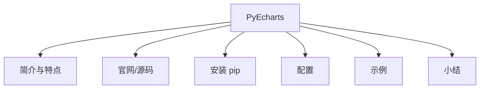

# 框架搭建：PyEchart 数据可视化环境

在上一个小节，我介绍了 Echarts 图表可视化组件基础，了解了 Echarts 和静态页面结合的基本使用方法。本节我们来看一下，如何使用 Python 开发基于 Echarts 的图表组件，这里面需要用到 Echarts 的 Python 语言定制版本 PyEcharts 框架。我们来看一下 PyEcharts 的官方网站、培训教程、源码资源和安装部署。

### PyEcharts 简介

**Python 是一门富有表现力的开发语言，是数据科学和人工智能在学习和科研场景下的首选语言**。Python 语言的主要特点包括以下几个方面。

- **简单、易学**：Python 语言的语法规则、数据类型相对简单易学，可以快速入门。

- **开源、免费**：Python 语言是一个基于 C/C++的开源的项目，可以免费使用。

- **跨平台支持**：Python 语言支持主流的操作系统：Windows、Linux、Mac、iOS、安卓等，Python 程序可以在各个平台之间实现无缝迁移。

- **资源丰富**：Python 语言具有丰富的开发资源库，可以直接复用，尤其是在数据科学和人工智能方面，资源尤为丰富。

- **可扩展性**：Python 语言支持跨语言开发，比如 C/C++程序混合编程。

通过上一个小节，我们了解到：Echarts 是一个开源的、免费的、成熟的、商业级的图表可视化框架，它基于 JavaScript 语言开发，是国内使用最多和最为广泛的可视化图表框架之一。而 PyEcharts 则是 Echarts 数据可视化框架，在 Python 开发语言环境下的实现版本，借助 PyEcharts，开发者可以使用 Python 语言直接生成可视化图表。

### PyEcharts 特点

PyEcharts 作为 Echarts 的 Python 开发语言定制版本，一方面继承了 Echarts 图表可视化框架的特性，另外一方面，其作为一个开源项目，也具备自己的特性。这两个方面结合构成了 PyEcharts 的五个特点。

- **基于 Python 语言设计**：这是 PyEcharts 最大的特点，Python 语言入门简单，适合学生使用；同时它又有丰富的资源并支持跨平台开发，也适合科研人员研究使用。因此，Python 具有非常广泛的用户基础。PyEcharts 基于 Python 语言开发，也很好地继承了 Python 的这一特点。

- **图表类型丰富**： 虽然 PyEcharts 没有继承 Echarts 的全部图表，但是它也提供了最常用的 30 多种图表类型（具体数量与 PyEcharts 的版本相关，而且在持续更新中）。这些可用的图表已足以满足日常的数据可视化的呈现需求。

- **源码开源免费**：PyEcharts 是一个开源项目，可以免费用于商业用途。

- **文档教程健全**：PyEcharts 提供了相对完备的文档教程和示例程序，可以有效降低学习门槛。

- **Web 集成方便**：PyEcharts 可以很轻松地和 Flask、Django 等 Web 框架整合，以 Web 页面的方式呈现，便于跨团队、跨部门、跨地域的合作和分享。

### PyEcharts 官网

PyEcharts 官方网站，提供了丰富的学习资源，包括：文档、教程和案例。官方网站地址为[https://pyecharts.org/#/](https://pyecharts.org/#/)


*PyEcharts 官方网站*

PyEcharts 提供了丰富的文档教程，学员可以通过官方教程，快速地掌握它的使用方法和技巧。PyEcharts 官方教程页面如下图所示：


*PyEcharts 官方教程*

PyEcharts 除官方教程之外，还有一个案例演示平台：[https://gallery.pyecharts.org/#/](https://gallery.pyecharts.org/)，学员可以通过该平台，查看 PyEcharts 支持的所有图表组件的演示案例，包括源码、配置方法、图表预览等。PyEcharts 案例演示平台如下图所示：


*PyEcharts-Gallery*

### PyEcharts 源码

PyEcharts 是一个开源项目，其源码资源托管在 GitHub，源码地址：[https://github.com/pyecharts/pyecharts](https://github.com/pyecharts/pyecharts)，PyEcharts 源码结构如下图所示：


*PyEcharts 源码结构*

### PyEcharts 安装

使用 PyEcharts 图表组件库之前，需要安装对应的 PyEcharts 库文件，安装的方式非常简单，只需要执行指令：pip install pyecharts 即可。安装完成以后可以通过：pip show pyecharts 指令查看安装结果信息，如下图所示：


*文件安装*

PyEcharts 安装完成以后，可以通过 import 指令直接引入库中的组件对象，不过需要注意的是：**PyEcharts 的大版本 v0.5x 和 v1.x 之间，引入方式不同，因为后续 v0.5x 版本不再维护，我们后续所有的示例程序的版本都是基于 v1.0x**（截至 2026-09，PyEcharts 最新版本为 2.1.0，2.x 沿用 v1.x 的引入方式，本文示例在 2.x 下同样适用）。以柱状图为例，我们需要导入的对象如下所示：

```python
from pyecharts import options as opts
from pyecharts.charts import Bar
from pyecharts.commons.utils import JsCode
from pyecharts.globals import ThemeType
```

上面的代码中，opts 为配置参数、Bar 为柱状图组件、JsCode 为代码段对象、ThemeType 为图表主题样式对象。

### PyEcharts 配置

PyEcharts 的配置主要是图表的参数设置，内容包括图表的提示框组件参数、图例组件参数、工具箱组件参数、X 轴组件参数、Y 轴组件参数、数据缩放组件参数、视图效果组件参数和主题样式参数，配置好的参数最终体现在可视化的图表中，一个典型的图表参数与页面呈现图表地对应关系，如下图所示：


*PyEcharts 图表参数*

上图的左侧部分，以红色字体标注出来的图表元素是 PyEcharts 图表的配置项类型，右侧部分代表的是各个配置项在代码中对应的标识符号。在**04 课时**，我们学习了 Echarts 的参数配置内容，可以发现，PyEcharts 的配置参数和图表呈现元素之间的映射关系，与 Echarts 完全相同，差异点只在于实现语言。基于 PyEcharts 配置参数的具体方法，我会在**06 课时**，给大家做详细的介绍。

### PyEcharts 示例

了解了 PyEcharts 文件引入和配置参数之后，我们来看一个具体的案例，通过案例学习一下 PyEcharts 图表设计的方法。

PyEcharts 图表开发的过程主要分为四个步骤：**PyEcharts 图表组件引入**、**图表对象声明**、**图表对象参数设置**、**图表对象渲染**。首先我们来看一下案例运行之后的效果，然后我们再逐步拆解实现过程。下图是一个基于 PyEcharts 实现的柱状图的呈现效果：


*PyEcharts 柱状图案例*

首先是图表组件引入。**要想实现以上的柱状图，需要在源码中，引入 PyEcharts 柱状图组件**，具体的代码如下所示：

```python
from pyecharts.charts import Bar
```

**然后是完成图表对象的声明**，具体代码如下所示：

```
bar = Bar()
```

上述代码通过类 Bar 声明了一个柱状图图表组件的实例对象：bar。完成对象的声明以后，**接下来需要进行参数配置**，具体的代码如下所示：

```python
# 参数设置：x 轴数据
bar.add_xaxis(["衬衫", "羊毛衫", "雪纺衫", "裤子", "高跟鞋", "袜子"])
# 参数设置：y 轴数据
bar.add_yaxis("商家 A", [5, 20, 36, 10, 75, 90])
```

上述代码分别设置了柱状图图表对象的 x 轴数据和 y 轴数据。**参数设置完成以后，就是最后一步：图表对象渲染。图表对象的渲染只需要一行代码**，具体的代码如下所示：

```python
# 图表渲染：默认文件名：render.html,默认路径：当前目录
bar.render()
```

PyEcharts 图表组件的渲染，在不添加任何参数的情况下，默认会在 Python 程序文件当前目录下，生成一个名为：render.html 的 HTML 页面文件。如下图所示：


*渲染文件*

该页面文件的源码结构如下所示：

```html
<!DOCTYPE html>
<html>
<head>
    <meta charset="UTF-8">
    <title>Awesome-pyecharts</title>
            <script type="text/javascript" src="https://assets.pyecharts.org/assets/echarts.min.js"></script>
</head>
<body>
    <div id="8e37f723c1d747c584bfcae32007d042" class="chart-container" style="width:900px; height:500px;"></div>
    <script>
        var chart_8e37f723c1d747c584bfcae32007d042 = echarts.init(
            document.getElementById('8e37f723c1d747c584bfcae32007d042'), 'white', {renderer: 'canvas'});
        var option_8e37f723c1d747c584bfcae32007d042 = {
            "animation": true,
            "animationThreshold": 2000,
            "animationDuration": 1000,
            "animationEasing": "cubicOut",
            "animationDelay": 0,
            "animationDurationUpdate": 300,
            "animationEasingUpdate": "cubicOut",
            "animationDelayUpdate": 0,
            "color": [
                "#c23531",
                "#2f4554",
                "#61a0a8",
                "#d48265",
                "#749f83",
                "#ca8622",
                "#bda29a",
                "#6e7074",
                "#546570",
                "#c4ccd3",
                "#f05b72",
                "#ef5b9c",
                "#f47920",
                "#905a3d",
                "#fab27b",
                "#2a5caa",
                "#444693",
                "#726930",
                "#b2d235",
                "#6d8346",
                "#ac6767",
                "#1d953f",
                "#6950a1",
                "#918597"
            ],
            "series": [
                {
                    "type": "bar",
                    "name": "\u5546\u5bb6A",
                    "data": [
                        5,
                        20,
                        36,
                        10,
                        75,
                        90
                    ],
                    "barCategoryGap": "20%",
                    "label": {
                        "show": true,
                        "position": "top",
                        "margin": 8
                    }
                }
            ],
            "legend": [
                {
                    "data": [
                        "\u5546\u5bb6A"
                    ],
                    "selected": {
                        "\u5546\u5bb6A": true
                    }
                }
            ],
            "tooltip": {
                "show": true,
                "trigger": "item",
                "triggerOn": "mousemove|click",
                "axisPointer": {
                    "type": "line"
                },
                "textStyle": {
                    "fontSize": 14
                },
                "borderWidth": 0
            },
            "xAxis": [
                {
                    "show": true,
                    "scale": false,
                    "nameLocation": "end",
                    "nameGap": 15,
                    "gridIndex": 0,
                    "inverse": false,
                    "offset": 0,
                    "splitNumber": 5,
                    "minInterval": 0,
                    "splitLine": {
                        "show": false,
                        "lineStyle": {
                            "width": 1,
                            "opacity": 1,
                            "curveness": 0,
                            "type": "solid"
                        }
                    },
                    "data": [
                        "\u886c\u886b",
                        "\u7f8a\u6bdb\u886b",
                        "\u96ea\u7eba\u886b",
                        "\u88e4\u5b50",
                        "\u9ad8\u8ddf\u978b",
                        "\u889c\u5b50"
                    ]
                }
            ],
            "yAxis": [
                {
                    "show": true,
                    "scale": false,
                    "nameLocation": "end",
                    "nameGap": 15,
                    "gridIndex": 0,
                    "inverse": false,
                    "offset": 0,
                    "splitNumber": 5,
                    "minInterval": 0,
                    "splitLine": {
                        "show": false,
                        "lineStyle": {
                            "width": 1,
                            "opacity": 1,
                            "curveness": 0,
                            "type": "solid"
                        }
                    }
                }
            ]
        };
        chart_8e37f723c1d747c584bfcae32007d042.setOption(option_8e37f723c1d747c584bfcae32007d042);
    </script>
</body> 
</html>
```

*页面源码*

通过以上渲染完成以后的代码，对比**04 课时**，Echarts 与 HTML 结合生成的图表页面的源码，我们可以发现 PyEcharts 图表组件的渲染过程，其实是生成 HTML 和 JavaScript Echarts 静态页面的过程，内容包括：**Echarts 文件引入**、**HTML DOM 对象声明**、**图表对象初始化**和**参数设置**。PyEcharts 通过渲染函数 render()，实现了从 Python 程序到浏览器默认能够识别的 HTML 和 JavaScript 脚本程序的转化。

通过以上操作，我们完成了一个 PyEcharts 基本的图表对象的创建工作，通过浏览器即可以直接预览渲染生成的页面文件的内容。该程序完整的代码结构如下所示：

```python
from pyecharts.charts import Bar
# 柱状图对象声明
bar = Bar()
# 参数设置：x 轴数据
bar.add_xaxis(["衬衫", "羊毛衫", "雪纺衫", "裤子", "高跟鞋", "袜子"])
# 参数设置：y 轴数据
bar.add_yaxis("商家 A", [5, 20, 36, 10, 75, 90])

# 图表渲染：默认文件名：render.html,默认路径：当前目录
bar.render()
```

### 小结

本文介绍了 PyEcharts 图表组件的官方网站、源码资源、安装方式、配置方法和实例程序。通过以上内容的学习，我想你应该掌握了 PyEcharts 开发环境的安装方法。

依照惯例，我会在这里将一些共性的问题展示出来，以便你能更好地理解这门课的内容。

**问题 1**：**老师，我很好奇，大数据和 AI 的区别是什么呀？大数据，再深化下去，并和其他很多方面整合，才是 AI 吗？大数据的话，需要的编程语言、技术栈、框架等，都是需要些什么的呢？**

这是一个相对复杂的问题，了解这个之前需要明确两点：**一是你从哪个视角来看**，是业务视角还是技术视角；**二是你是否具备关于 AI 和大数据的完整的知识体系**。

**从业务视角**，大数据也好，AI 也好，都是手段，不是目标，**业务用户关注的是最终提供给终端用户的服务能力**；

**从技术视角**，大数据特指四个层次的东西：分布式存储和计算、数据仓库、工具平台（类似 redash）、数据应用（报表、BI）；AI 特指：神经网络模型、深度学习框架（TF、PyTorch、Caffe 等）、拟人化能力（语音识别、机器视觉、NLP、知识图谱等）。

综上所述，二者是不同方向上的两条技术线，彼此有交集，有依赖，也相互独立，可以共同构建业务服务能力，对外输出。

**问题 2**：**老师，可以在 Windows 系统下安装 redash 吗？或者说 Windows 系统下有什么可视化工具吗？**

Windows 安装是可以的，Redash7.0 实际部署成功过，不过用的 python2.7，相对比较复杂。Celery4.x 以后的版本不支持在 windows 上运行，需要特殊处理。GitHub 上直接下载的源码，如果使用 python3.x 版本调试，但需要修正大量的代码，这就比较考验个人的代码调试和错误处理能力了。

**问题 3：Redash 展现的图表可以随着数据的变化而变化吗？**

Redash 的仪表盘支持定时刷新机制，可以满足这个需求。如下图所示：


---

---




## 版本差异（数据科学栈 → 当前版本）

| 库 | 本文编写时 | 当前稳定版 | 升级要点 |
|----|-----------|-----------|---------|
| Python | 3.8-3.12 | 3.14 | 3.12+ 起性能显著提升；3.14 PEP 649/750 |
| NumPy | 1.x/2.0 | 2.5.x | `np.float_` 等别名移除；NEP 50 类型提升 |
| Pandas | 1.x/2.x | 2.3.x | CoW 可经选项开启（3.0 起将默认）；`inplace` 将移除；`str` dtype 将为默认 |
| Matplotlib | 3.x | 3.x 稳定版 | API 兼容，样式更新 |
| Seaborn | 0.12/0.13 | 0.13.x | API 稳定 |
| scikit-learn | 1.x | 1.9.x | API 稳定，新算法持续加入 |

> 本文讲解的数据分析流程（读取→清洗→分析→可视化）与核心 API 在最新版本中成立；升级时重点关注 Pandas 3.0 的 Copy-on-Write 与 NumPy 2.x 的类型变化。
