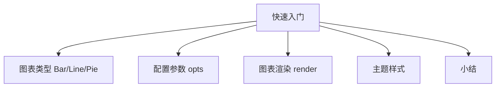

# PyEchart 开发快速入门

本文是课程“**模块二：环境部署篇**”的第三课，也是最后一个课时。

在上一个小节，我介绍了 PyEcharts 图表可视化框架，带你了解了它的官方网站、文档教程、源码资源、参数配置和安装部署。通过一个最简单的示例程序，我向你演示了 PyEcharts 生成可视化图表的过程。但仅仅掌握这些内容还是不够的，要使用 PyEcharts，我们还需要更多的知识。本文我会带你学习如何使用 PyEcharts 来构建可视化图表，并掌握其常用的图表类型、参数项配置、图表渲染和主题样式的设置方法。

### PyEcharts 图表类型

我们先来看 PyEcharts 图表类型。PyEcharts 支持的图表类型有 30 多种，具体的图表数量和版本相关，需要结合具体的版本，通过 PyEcharts 源码文件最终确定。记录 PyEcharts 支持图表类型的源码文件地址为：[https://github.com/pyecharts/pyecharts/blob/master/pyecharts/globals.py](https://github.com/pyecharts/pyecharts/blob/master/pyecharts/globals.py)，我们使用的 PyEcharts v1.6.2 版本支持的图表类型如下图所示（截至 2026-09 最新版本为 2.1.0，图表类型更多，分类方式一致）：


*PyEcharts v1.6.2 支持的图表类型*

基于 PyEcharts 官方指导教程的分类方式，图表共分为 5 种类型：基本图表、直角坐标系图表、地理位置图表、树型图表和 3D 图表。具体的图表类型和分类关系如下图所示：


*PyEcharts 图表分类*

上图中，橙色标注的图表类型是我会在课程的“**模块三**”讲到的内容，其他的图表可以参照我们的课程，结合官方教程学习。了解了 PyEcharts 的图表类型之后，我们来看一下如何导入图表对象。图表对象导入的源码如下所示：

```python
from pyecharts.charts import Bar
```

上述代码中，从 pyecharts.charts 模块导入了图表对象 Bar。通过这段代码，我们可以导入前面讲到的全部图表类型，只需要替换图表对象的类型名称即可。具体的图表类型导入时的图表名称如下图所示：


*导入图表名称*

**导入图表类型以后，声明一个图表对象，再进行相应的参数设置，就可以生成一个可视化图表了**。这部分内容，我接下来会做详细的介绍。

### PyEcharts 配置参数

#### 概述

我在“**04 | 图表组件：Echarts 数据可视化图表基础**”一文中简单介绍了 PyEcharts 的参数配置项和图表元素之间的映射关系：


*PyEcharts 图表配置项*

这里，我将详细介绍具体的配置项的参数设置方法。**PyEcharts 配置项分全局配置项和系列配置项，其中全局配置项作用域为整个图表**（与具体需要呈现的数据内容无关），**可以理解为静态部分**；**系列配置项作用范围为基于数据动态绘制的部分**。首先我们来看一下 PyEcharts 常用的全局配置项和功能列表：

| 序号 | 类 | 名称 | 主要功能 |
| --- | --- | --- | --- |
| 1 | pyecharts.options.InitOpts | 初始化配置项 | 尺寸、主题样式 |
| 2 | pyecharts.options.ToolboxOpts | 工具箱配置项 | 是否显示、位置、工具项 |
| 3 | pyecharts.options.TitleOpts | 标题栏配置项 | 标题、副标题、链接 |
| 4 | pyecharts.options.LegendOpts | 图例配置项 | 设置图例参数 |
| 5 | pyecharts.options.DataZoomOpts | 区域缩放配置项 | 控制图表缩放 |
| 6 | pyecharts.options.TooltipOpts | 提示框配置项 | 鼠标滑过后弹出的提示信息 |
| 7 | pyecharts.options.VisualMapOpts | 视觉映射配置项 | |
| 8 | pyecharts.options.AxisOpts | 坐标轴配置项 | X 轴参数、Y 轴参数 |

了解了各配置项的类、名称、功能和位置之后，我们结合一个具体的案例，来看一下各个配置项的配置方法。我会采用上一小节的案例源码，通过逐步添加新的配置项和展示呈现效果的方式来做详细的介绍。由于各配置项的使用方法基本相同，我只重点介绍其中的两个：**初始化配置项**和**标题配置项**，其他部分你可以参考官方教程，结合我介绍的方法进行配置。

#### 初始化配置项

图表的初始化配置项，负责图表对象的尺寸、渲染风格、主题样式和图表背景颜色等的设置。首先我们来看一下初始化配置项的详细参数说明，如下图所示：


*初始化配置项参数*

我们重点看一下，Python 程序中是如何配置这些参数的。上述内容出自官方的用户手册说明文档，地址为[https://pyecharts.org/#/zh-cn/global_options](https://pyecharts.org/#/zh-cn/global_options)，截图如下：


*初始化配置项教程*

接下来，我们通过一个案例，来具体了解初始化配置项的设置。首先来看一下案例执行之后的效果，初始化配置项的设置效果如下所示：


*初始化配置项示例*

上图中，我们实现了图片宽度、高度、背景色和主题样式设置。完整的实现代码如下：

```python
from pyecharts import options as opts
from pyecharts.charts import Bar
from pyecharts.faker import Faker

from pyecharts.globals import ThemeType

c = (
    Bar(init_opts=opts.InitOpts(theme=ThemeType.LIGHT,
                                width="1024px",
                                height="600px",

                                bg_color="#d9d6c3"
                                ))
    .add_xaxis(Faker.choose())
    .add_yaxis("商家 A", Faker.values())
    .add_yaxis("商家 B", Faker.values())
    .render("demo_bar_01.html")
)
```

上述代码中，**我们通过 opts.InitOpts 类声明了一个初始化配置项对象 init_opts，初始化配置项参数按照 key = value 的方式，进行了赋值操作**。其中：theme 代表主题样式，可选的范围我会在本课后面的“主题样式”小节进行详细介绍；width 和 height 分别代表图表对象在网页中的宽度和高度；bg_color 代表图表背景颜色，具体的色值，可以根据自己的需要选择。

#### 标题配置项

标题配置项，**负责配置图表对象的标题内容**，包括主标题文本、主标题链接、主标题链接打开方式；副标题文本、副标题链接、副标题链接打开方式；标题元素的位置和边距等。首先我们看一下标题配置项的参数说明，详细的参数说明如下图所示：


*标题配置项参数*

关于上述标题配置项的各个参数，图中已经作了详细的注释和说明，我们不做过多的介绍。和初始化配置项一样，我们来看一下 Python 程序中是如何配置的。上述内容出自官方的用户手册说明文档，地址：[https://pyecharts.org/#/zh-cn/global_options](https://pyecharts.org/#/zh-cn/global_options)，截图如下：


*标题配置项教程*

标题配置项的主要参数是：标题文本、标题链接、标题跳转方式、副标题文本、副标题链接、副标题跳转方式、标题位置和标题样式，对应的参数名称详见标题配置项参数。接下来，我们通过一个案例，来具体了解标题配置项的设置。首先来看一下案例执行之后的效果，标题栏配置项的设置效果如下所示：


*标题配置项示例*

上图中，我们实现了主标题文本、主标题链接、主标题打开方式、副标题文本、副标题链接、副标题链接打开方式、标题位置的设置。完整的实现代码如下所示：

```python
from pyecharts import options as opts
from pyecharts.charts import Bar
from pyecharts.faker import Faker

c = (
    Bar()
    .add_xaxis(Faker.choose())
    .add_yaxis("商家 A", Faker.values())
    .add_yaxis("商家 B", Faker.values())
    .set_global_opts(
        title_opts=opts.TitleOpts(title="图表标题",
                                  title_link="www.baidu.com",
                                  title_target="blank",
                                  subtitle="图表副标题",
                                  subtitle_link="www.baidu.com",
                                  subtitle_target="blank",
                                  pos_left="left",
                                  # pos_right="",
                                  # pos_bottom="40",
                                  padding=[5, 10, 5, 10])   # 上右下左
    )
    .render("demo_bar_02.html")
)
```

上述代码中，**我们通过 opts.TitleOpts 类声明了一个标题配置项对象，标题配置项参数按照 key = value 的方式，进行了赋值操作**。其中：title、title_link、title_target 定义了主标题文本、主标题链接、主标题打开方式；subtitle、subtitle_link、subtitle_target 定义了副标题文本、副标题链接和副标题打开方式，其他参数可以参照官方提供的用户手册关于标题配置项的参数进行设定。

### PyEcharts 图表渲染

PyEcharts 图表渲染支持两种模式：HTML 页面模式和图片文件模式。默认情况下，PyEcharts 图表渲染，是在当前文件夹下，生成一个名称为：render.html 的 HTML 文件，具体的渲染语句如下：

```python
# 默认模式
bar.render()
```

默认模式之外，我们可以给 render( )函数一个包含路径信息的文件名参数，然后生成的图表文件将以该路径为保存路径，以该文件名为名称。具体的渲染语句如下：

```python
# 指定文件名（可以包括路径）
bar.render("mycharts.html")
```

以上两种方式生成的都是 HTML 页面，PyEcharts 图表渲染也支持渲染为图片，但渲染为图片的时候需要额外的第三方程序包支持，包名：snapshot-selenium（依赖 selenium），可以通过执行：`pip install snapshot-selenium` 执行安装。渲染为图片的时候，需要用的函数为：make_snapshot，该函数具体参数如下图所示：


*Make_snapshot 具体参数*

Make_snapshot 函数必选参数包括**传入 HTML 文件路径**和**输出图片路径**，我们可以通过一个案例的方式，学习其具体的使用方法。案例源码如下：

```python
from pyecharts.charts import Bar

# 导出图片，需要引入以下对象
from pyecharts.render import make_snapshot
from snapshot_selenium import snapshot

bar = Bar()
bar.add_xaxis(["衬衫", "羊毛衫", "雪纺衫", "裤子", "高跟鞋", "袜子"])
bar.add_yaxis("商家 A", [5, 20, 36, 10, 75, 90])
# render 会生成本地 HTML 文件，默认会在当前目录生成 render.html 文件
# 也可以传入路径参数，如 bar.render("mycharts.html")
# 默认模式
bar.render()
# 指定路径
bar.render("mycharts.html")

# 渲染成图片 
make_snapshot(snapshot, bar.render(), "bar0.png")
```

上述程序演示了 PyEcharts 的 3 种渲染方式：默认情况下生成 render.html 文件；设置参数的情况下，在指定目录下，生成了 mycharts.html 文件；调用函数 make_snapshot 生成了图片文件 bar0.png。

### PyEcharts 主题样式

PyEcharts 提供了超过 15 种的主题样式，具体的样式数量会因为版本的不同而有差异，你可以通过主题样式的源码文件查看，具体的源码文件地址为：[https://github.com/pyecharts/pyecharts/blob/master/pyecharts/globals.py](https://github.com/pyecharts/pyecharts/blob/master/pyecharts/globals.py)。该文件定义了 PyEcharts 当前版本支持的主题样式的名字，具体主题样式类型，以该文件内容为准。我们当前使用的版本 v1.6.2，支持的主题样式共 15 种，具体的样式名称如下图所示：


*主题样式类型*

每一种主题样式的图表效果，可以在 PyEcharts 实例程序的官方站点中查看，地址为[https://pyecharts.org/#/zh-cn/themes](https://pyecharts.org/#/zh-cn/themes)。**主题样式可以根据自己的业务场景和个人偏好选择，但要遵循一个基本的原则：美观大方、颜色鲜明、对比清晰**。我个人比较喜欢的几个主题展示图表展示效果如下：


*主题样式-Light*


*主题样式-Dark*


*主题样式-chalk*


*主题样式-shine*

了解了主题样式的类型，结合上文中讲到的配置参数，你就可以设置自己喜欢的主题样式了。

### 小结

本节我们介绍了基于 PyEcharts 图表可视化框架进行图表开发快速入门相关的知识，内容包括 PyEcharts 图表类型、图表配置、图表渲染和主题样式。

**图表类型部分**，我介绍了 PyEcharts 支持的图表类型清单，同时介绍了各种图表类的导入方法；**图表配置部分**，我重点介绍了初始化配置项和标题配置项的接口说明和配置方法，希望你能够掌握配置的思路，结合官方文档，触类旁通，能够掌握其他配置项的使用方法；**图表渲染部分**，我介绍 PyEcharts 图表对象渲染的两类输出，三种方法；**主题样式部分**，则是介绍了 PyEcharts 支持的主题样式清单和设置方法。

在课程的最后，我会展现一些共性的问题，希望能对你学习本门课程有所帮助。

有位学员问我该如何着手搭建一个可视化报表，日常又应该如何去训练这个技能。我想也许不止他一个人有这样的疑惑，所以我把我的回答放在了这里，希望有同样疑惑的同学也能看到。

**这里面涉及的是一个工作思路和方法论的问题，即如何构建一个企业级的数据报表体系。需要具备的完整知识体系包括几个方面。**

- **业务建模：业务过程、业务逻辑、业务活动（通过业务建模，了解到底哪些业务主题需要构建可视化的报表）；**

- **指标定义：明确各个业务活动，需要哪些衡量指标（例如：业绩指标、人效指标、财务指标等）；**

- **维度定义：时间维度、对比维度、分布维度、组成维度等；**

- **创建可视化报表；**

- **分析和洞察。**

以上内容我们会在课程“**模块三：典型案例篇**”详细介绍，敬请期待。

---

---




## 版本差异（数据科学栈 → 当前版本）

| 库 | 本文编写时 | 当前稳定版 | 升级要点 |
|----|-----------|-----------|---------|
| Python | 3.8-3.12 | 3.14 | 3.12+ 起性能显著提升；3.14 PEP 649/750 |
| NumPy | 1.x/2.0 | 2.5.x | `np.float_` 等别名移除；NEP 50 类型提升 |
| Pandas | 1.x/2.x | 2.3.x | CoW 可经选项开启（3.0 起将默认）；`inplace` 将移除；`str` dtype 将为默认 |
| Matplotlib | 3.x | 3.x 稳定版 | API 兼容，样式更新 |
| Seaborn | 0.12/0.13 | 0.13.x | API 稳定 |
| scikit-learn | 1.x | 1.9.x | API 稳定，新算法持续加入 |

> 本文讲解的数据分析流程（读取→清洗→分析→可视化）与核心 API 在最新版本中成立；升级时重点关注 Pandas 3.0 的 Copy-on-Write 与 NumPy 2.x 的类型变化。
