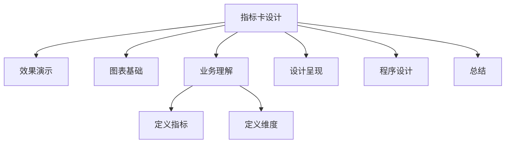

# 案例 1：实时数据监控指标卡设计

上一节，我介绍了 PyEcharts 框架开发环境部署。从本节开始，我们进入数据可视化分析的**模块三：典型案例篇**。

本部分内容共 6 个小节，每个小节对应一个业务场景，按照实践中对图表的使用顺序排序，提供一个相对独立、功能完整的数据可视化分析案例，6 个案例共同构成一个完整的数据可视化分析体系。

每一个案例，我都会按照在数据可视化分析方法体系中介绍的数据可视化分析的操作流程进行说明。本文，我会介绍 6 个案例中的第一个，该案例在整个数据可视化分析过程模型中的位置如下图所示：


*图 1：章节内容定位*

上图中，**橙色部分是我在本文将要介绍的内容：实时监控数据指标卡**。实时监控数据指标常用于呈现业务，用于发现业务问题。将它与同环比、时间进度和任务目标结合，可以直观地反映业务指标是否处于一个合理的波动范围。

数据可视化分析案例的部分，我会采用前面的操作流程，分步骤实施，逐项介绍常用的可视化图表的设计和使用方法，通过不断的重复，希望能够帮你建立一个固定的建设套路和思维模式。


*图 2：操作流程*

### 效果演示

**实时数据监控指标卡可以用来呈现核心的业务指标，通过呈现实时的指标值，结合指标的同比和环比变化情况，判断该指标是否处于正常的波动范围之内**。影片租赁系统的实时数据监控指标卡，运行效果如下图所示：


*图 3：实时数据指标卡*

### 图表基础

数据指标卡多用于业务实时监控，旨在监控业务核心指标的实时变化情况，如日订单量、日总交易额、日新增注册用户数等。

**通常情况下，一个业务主题领域（domain）下面的实时数据指标卡数量不会太多**，实时指标的价值在于对当前业务现状的呈现。数据指标卡的基本使用是一个数值和数值说明，如下图所示：


*图 4：基本数据指标卡*

**为了增强数据指标开发表现能力，会增加该指标的同比和环比数据，用于辅助说明该指标是否处于正常的波动范围，当前的指标值环比昨日，同比上周/上月某一天是增加了还是减少了**。增加了同环比的拓展数据指标卡，如下图所示：


*图 5：拓展数据指标卡*

**数据指标卡作为一个单一的数据项，为了突出实时情况下，某一个核心指标的当前状态，很多时候，我们不止需要了解当前的值和同环比变化情况，还要快速跳转到该指标的历史变化趋势上**。因此，我们需要进行数据指标卡和历史趋势数据的联动。该项功能的实现，通常是一页面跳转，或者弹出对话框的方式实现。


*图 6：拓展指标卡*

### 业务理解

业务理解环节，我们需要从**业务流程**、**业务规则**、**业务活动**和**总线矩阵**这 4 个方面梳理。为了简化业务，避免专业的业务领域知识成为学习的门槛，我选择了比较简单的影片租赁业务场景。影片租赁业务的业务活动主要包括租赁活动、支付活动和归还活动。具体的业务过程模型如下图所示：


*图 7：业务过程模型*

通过对影片租赁业务过程模型的梳理，我们可以发现影片租赁业务的主要业务活动。对业务活动分析之后，我们可以定义需要监控的核心指标。

### 定义指标

**实时数据监控需要监控的是核心业务指标**。对于影片租赁业务而言，需要监控的核心指标就是交易数据：每天的实时的收入、交易量和库存数，共 3 个主要的业务活动。具体需要考虑的指标为：订单量、交易额和库存量。本案例中，我选择了订单量作为我们分析的指标。关于以上三个指标定义如下表所示：


*表 1：指标定义*

交易额和库存量的计算逻辑可以参考订单量生成。

### 定义维度

实时数据监控指标卡通常用于呈现业务和发现问题，因此除了核心指标的实时数值之外，通常需要结合指标的同比、环比、时间进度和任务目标完成状态等因素。因此，实时数据监控指标卡，需要考虑的分析维度主要是时间维度和对比维度。

### 设计呈现

**数据指标卡的设计，需要考虑页面布局、卡片设计、主题样式，尤其是字体、字号和颜色的设计**。数据指标卡，通常作为数据仪表盘的一部分存在，它的呈现设计一方面包括指标内容的设计，另外一方面也包括页面布局的设计。通常情况下，数据指标卡，位于数据仪表盘的顶部，横向并行排列，超出部分另起一行。一个典型的数据指标卡的布局设计呈现案例，如下图所示：


*图 8：页面布局*

影片租赁业务实时业务监控指标卡的结构包括：指标、同比、环比和超级链接。具体的结构示例如下图所示：


*图 9：数据指标卡设计*

### 程序设计

#### 数据理解

影片租赁交易数据的实时监控核心指标，位于影片租金交易业务模型中的交易、支付和库存主题。实时监控核心指标涉及的相关主题在业务模型中的位置如下图所示：


*图 10：数据主题*

租赁交易数据记录了详细的交易订单数据，每行记录是一条租赁交易信息，字段包括：交易 ID、交易时间、库存 ID、客户 ID、归还时间、店员 ID 和更新日期。具体的字段结构和数据样本如下图所示：


*图 11：交易订单数据*

支付交易数据记录了详细的订单支付数据，每行记录是一条支付记录，字段包括：支付 ID、客户 ID、店员 ID、交易 ID、金额、支付时间和更新时间。具体的字段结构和数据样本如下图所示：


*图 12：订单支付数据*

库存数据记录了当前各门店的影片库存情况，具体的字段结构和数据样本如下图所示：


*图 13：库存商品数据*

#### 数据准备

实时数据监控会呈现实时的交易量、库存量和交易额，关注的是当前时间节点下实时的指标情况。通过分析订单、支付和库存原始数据的库表结构和数据内容，可以发现当前数据并不能够满足我们的业务需求。因此，需要对原始数据进行加工和处理。

对于订单量、交易额和库存量指标，我们需要按照日期统计交易量，并设定一个时间阈值（数据刷新频率），定时刷新数据。

针对订单量指标，我们需要按照“日”聚合数据，并使用当天的订单量数据作为数据指标卡的数值。但是当前“日”交易明细数据表中，交易时间的字段是精确到分钟的，所以需要将交易时间列，转换成需要排序的年-月-日格式，然后生成新的交易日汇总报表。新交易日报的结构如下图所示：


*图 14：订单交易日报*

具体的处理方式为：基于当前订单支付明细数据，创建一个新的订单支付日汇总数据表，详细的 SQL 脚本如下：

```sql
DROP TABLE IF EXISTS dm_payment_day;
CREATE TABLE dm_payment_day (SELECT DATE_FORMAT(payment_date,'%Y-%m-%d') as 日期,  SUM(amount) as 金额  FROM payment GROUP BY 日期 ORDER BY 日期 DESC);
```

#### 图表设计

##### 概述

完成了数据准备工作之后，接下来，我们需要进行的工作就是图表程序设计。因为数据指标卡的图表组件不是 PyEcharts 支持的类型，因此我们引入 Bootstrap 前端框架中定义的 Cards 组件。

**图表设计包括前端模板设计和后台服务程序设计两部分，前端模板设计完成 Bootstrap 组件库的导入、指标卡元素占位符声明和指标卡图表元素渲染，后台服务程序完成路由设计、业务逻辑和数据逻辑设计**。

完整的程序设计流程如下图所示：


*图 15：程序设计流程*

**特别提示**：数据指标卡的程序设计后台部分，需要使用到 Flask 框架，Flask 框架相关的内容是我在“**模块四：数据发布篇**”才会介绍到的东西。**数据指标卡在工程实践中是构建数据可视化分析体系的第一步**，所以我并没有因为 Flask 相关技术的问题而调整课程的顺序。这部分内容，对于没有 Flask 基础的同学，可以等学完了“**模块四**”的知识之后再来进行代码调试。

##### 模板设计

**数据指标卡的程序设计，包括引入 Bootstrap4 框架、声明指标卡对象和配置指标卡参数**。我们引入 Bootstrap4 框架中的 Card 类，作为我们可视化呈现的图表元素。Bootstrap4 的导入可以通过直接导入相应的 bootstrap 文件进行，一个典型的指标卡设置程序如下：

```html
<!DOCTYPE html>
<html>
<head>
  <title>Bootstrap 实例</title>
  <meta charset="utf-8">
  <meta name="viewport" content="width=device-width, initial-scale=1">
  <link rel="stylesheet" href="https://cdn.jsdelivr.net/npm/bootstrap@4.3.1/dist/css/bootstrap.min.css">
  <script src="https://cdn.jsdelivr.net/npm/jquery@3.2.1/dist/jquery.min.js"></script>
  <script src="https://cdn.jsdelivr.net/npm/popper.js@1.15.0/umd/popper.min.js"></script>
  <script src="https://cdn.jsdelivr.net/npm/bootstrap@4.3.1/dist/js/bootstrap.min.js"></script>
</head>
<body>

<div class="container">
  <div class="card">
    <div class="card-body" align = 'center'>
      <h4 class="card-title">598</h4>
      <p class="card-text">交易量</p>
      <a href="#" class="card-link">同比：+11%</a>
      <a href="#" class="card-link">环比：-12%</a>
    </div>
  </div>
  <br/>
  <div class="card">
    <div class="card-body" align = 'center'>
      <h4 class="card-title">2523.01</h4>
      <p class="card-text">交易额</p>
      <a href="#" class="card-link">同比：+11%</a>
      <a href="#" class="card-link">环比：-12%</a>
    </div>
  </div>
</div>
</body>
</html>
```

上述代码可以生成一个静态的、数值固定的数据指标卡，实际业务场景中，其中的数值部分可以通过设置变量的方式，从后台数据库中实时读取。

##### 后台设计

实时业务监控指标卡的后台响应程序设计包括：**接口设计**、**路由设计**、**业务逻辑**、**数据逻辑**这 4 部分内容。**接口定义了前端的页面的调度请求地址，路由设计提供了服务器端的业务逻辑和访问接口的映射关系，业务逻辑定义了前端请求的响应逻辑，数据逻辑执行数据库表的查询操作**。

**实时数据监控指标卡的数据逻辑程序，负责从数据准备环节生成的数据日报中查询交易量、交易额和库存量指标，并返回给调用程序**。交易量指标查询代码如下：

```python
# 交易量查询
def order_sum_query():
    # 连接到数据库
    connection = pymysql.connect(host='localhost',
                                 port=3306,
                                 user='root',
                                 password='密码',
                                 db='sakila',
                                 charset='utf8',
                                 cursorclass=pymysql.cursors.DictCursor)
    try:
        with connection.cursor() as cursor:
            # SQL 查询语句：简化程序只返回第一行
            sql = "SELECT * FROM dm_rental_day ORDER BY 日期 DESC limit 1 "

            try:
                # 执行SQL语句，返回影响的行数
                row_count = cursor.execute(sql)
                # 获取所有记录列表
                results = cursor.fetchall()
                for row in results:
                    # 此处不可以用索引访问：row[0]
                    orderdate = row["日期"]
                    ordersum = row["订单量"]
                    # 打印结果
                    print("日期：%s,订单量：%d" % (orderdate, ordersum))
                    return ordersum
            except:
                print("错误：数据查询操作失败")
    finally:
        connection.close()
```

**交易额（支付）指标查询代码如下**：

```python
# 交易额查询
def pay_sum_query():
    # 连接到数据库
    connection = pymysql.connect(host='localhost',
                                 port=3306,
                                 user='root',
                                 password='密码',
                                 db='sakila',
                                 charset='utf8',
                                 cursorclass=pymysql.cursors.DictCursor)
    try:
        with connection.cursor() as cursor:
            # SQL 查询语句：简化程序只返回第一行
            sql = "SELECT * FROM dm_payment_day ORDER BY 日期 DESC limit 1"

            try:
                # 执行SQL语句，返回影响的行数
                row_count = cursor.execute(sql)
                # 获取所有记录列表
                results = cursor.fetchall()
                for row in results:
                    orderdate = row["日期"]
                    paysum = row["金额"]
                    # 打印结果
                    print("日期：%s,交易额：%s" % (orderdate, paysum))
                    return paysum
            except:
                print("错误：数据查询操作失败")
    finally:
        connection.close()
```

上述两个程序分别实现了从订单交易日报表（dm_rental_day）读取当日订单量、从订单支付日汇总表（dm_payment_day）读取当日交易额的数据，供业务逻辑调用的功能。

**实时数据监控指标卡的业务逻辑程序，负责响应用户实时指标的查询请求，调用数据逻辑程序，基于数据逻辑查询的结果，业务逻辑程序组装出实时指标数据并返回给前端页面**。业务逻辑代码如下：

```python
# 01. 实时指标监控
def rt_index_base():
    paysum = pay_sum_query()  # 交易额
    ordersum = order_sum_query()   # 订单量
    inventsum = inventory_sum_query()  # 库存量

    cur = {'paysum' : paysum, 'ordersum': ordersum, 'inventsum': inventsum} 
    return cur
```

实时指标监控业务逻辑设计完成以后，**接下来，我们需要定义的是路由和接口设计**，Flask 的路由设计非常简单，只需要一个装饰器调用即可，具体的代码如下：

```python
# 01. 实时指标监控
@app.route("/")
def index():
   cur = rt_index_base()
   return render_template("dashboard.html", curnumber=cur)
```

上述程序，通过**调用 Flask 的装饰器 @app.route 实现了路由的映射，index 函数实现了业务逻辑的调用，render_template 实现了页面的渲染和参数的传递**。至此，我们完成了数据指标卡程序的设计，程序运行后即可查看数据指标运行效果。

这里我补充一点：在 Python + Flask 后台程序运行过程中，如果想要实时修改 Python 代码之后，立即生效，需要设置 Debug 模式。具体设置方法如下图所示：


*图 16：程序调试技巧*

#### 数据验证

实时业务指标监控的数据验证，可以通过同环比的对比进行检查。当同环比出现较大的偏差的时候，要么是数据有问题，要么是业务出现了异常情况。然后，我们可以进一步地排查数据。通常的数据验证策略是：首先判定指标是否符合业务预期，其次判定趋势是否合理，最后判定组成结构和分布是否合理。

#### 数据发布

实时数据监控指标卡，通常作为 Dashboard 页面的最突出的一部分，通常以网页的形式呈现。本环节只考虑实时数据监控指标卡的发布，发布后的页面如下图所示：


*图 17：数据指标卡页面*

#### 分析洞察

实时业务指标监控的分析方法是通过数据对比维度做出的判断，而判断的基本逻辑是基于环比昨日，或者同比上周/上月某一天的数据，判断当日数据是否符合预期。如果当日实时数据的同环比情况超过一定的阈值，则可以判定当日的数据偏离了正常的轨道，此时需要引入其他的数据内容进行判断。相关内容我会在后续的内容中介绍。

### 总结

本节内容我介绍了实时监控数据指标卡的设计和使用方法。数据指标卡是我们构建数据可视化分析体系的第一个步骤，通过数据指标卡，我们可以实现业务呈现和问题发现这两个功能。那么，发现业务问题以后，我们又该如何处理呢？我会在接下来的课时向你介绍。

课程的最后，请不要忘了“定义指标”这一小节里的作业。欢迎你在评论区分享你的心得。

---

---




## 版本差异（数据科学栈 → 当前版本）

| 库 | 本文编写时 | 当前稳定版 | 升级要点 |
|----|-----------|-----------|---------|
| Python | 3.8-3.12 | 3.14 | 3.12+ 起性能显著提升；3.14 PEP 649/750 |
| NumPy | 1.x/2.0 | 2.5.x | `np.float_` 等别名移除；NEP 50 类型提升 |
| Pandas | 1.x/2.x | 2.3.x | CoW 可经选项开启（3.0 起将默认）；`inplace` 将移除；`str` dtype 将为默认 |
| Matplotlib | 3.x | 3.x 稳定版 | API 兼容，样式更新 |
| Seaborn | 0.12/0.13 | 0.13.x | API 稳定 |
| scikit-learn | 1.x | 1.9.x | API 稳定，新算法持续加入 |

> 本文讲解的数据分析流程（读取→清洗→分析→可视化）与核心 API 在最新版本中成立；升级时重点关注 Pandas 3.0 的 Copy-on-Write 与 NumPy 2.x 的类型变化。
