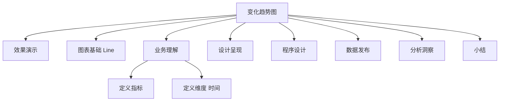

# 案例 2：历史数据变化趋势图设计

在 07 课时，我介绍了案例 1：PyEcharts 实时数据监控指标卡的设计和使用。接下来，我们进入案例 2：历史数据变化趋势图设计。该案例在整个数据可视化分析构成模型中的位置如下图所示：


*图 1：章节内容定位*

上图中，橙色部分是我们本节将要进行介绍的内容：历史数据变化趋势图。

实时监控数据指标卡用于呈现业务和发现业务问题，一旦发现指标异常，就需要引入多个不同的维度，对问题进行分析和判断。

时间维度，即该指标的历史趋势，是要首先考虑的。**历史趋势分析问题的价值在于：一方面，进一步判断该异常是否在合理的范围之内；另外一方面，判断该异常是否具有周期性的特征**。同时，**历史数据变化趋势图，也可以用于发展趋势预测**。

数据可视化分析的案例部分，我们采用前面的操作流程，分步骤实施，逐项介绍常用的可视化图表的设计和使用方法。通过不断重复，希望大家能够建立起一个固定的建设套路和思维模式。


*图 2：操作流程*

### 效果演示

历史数据变化趋势图，通过数据可视化的方式，呈现业务指标的历史变化趋势；通过业务指标曲线的平滑程度和总体变化趋势，呈现该指标是否异常和指标的总体变化趋势。以影片租赁系统为例，其订单历史变化趋势图的运行效果如下图所示：


*图 3：订单历史变化趋势图*

### 图表基础

**历史数据变化趋势图，多用于监控历史数据趋势，旨在反映目标业务指标随时间变化的历史趋势**，如订单历史变化趋势、交易额历史变化趋势、商品库存历史变化趋势等。

通常情况下，历史数据变化趋势图的价值在于，**对历史业务状态的呈现**，以及**基于历史状态趋势判断当前实时数据是否符合预期**，**基于线性回归预测下一个阶段的指标变化**等。一个最基本的历史数据变化趋势图，在 Echarts 标准图表中，通常以基本折线图的形式呈现。其基本形态是一个二维坐标轴，横轴代表时间，纵轴代表指标值。如下图所示：


*图 4：基本折线图*

**为了增强基本折线图的表现能力，尤其是强调数据量随时间变化的程度，引起人们对总值趋势的注意，历史数据变化趋势图也会采用面积图的形式**。

面积图是在折线图的基础之上形成的。它会使用颜色或者纹理填充折线图中的折线与自变量坐标轴之间的区域，这样一个填充区域我们叫作面积。颜色的填充可以更好地突出趋势信息。

需要注意的是**颜色要带有一定的透明度**，透明度可以很好地帮助使用者观察不同序列之间的重叠关系，没有透明度的面积会导致不同序列之间相互遮盖，会导致可以被观察到的信息减少。一个典型的面积图结构如下所示：


*图 5：面积图*

**基本折线图和面积图，除了展示某个指标发展的趋势，还可以用来比较多个不同的指标的数据序列**。通过对比同时间段多个不同指标的值，可以分析哪一种指标的数据表现更好。一个典型的多指标折线图结构如下所示：


*图 6：多指标折线图*

### 业务理解

业务理解环节，我们需要从**业务流程**、**业务规则**、**业务活动**和**总线矩阵**这 4 个方面进行梳理。

为了简化业务，避免专业的业务领域知识成为学习的门槛，聚焦数据可视化分析本身，我选择了比较简单的影片租赁业务场景。影片租赁业务的业务活动主要包括租赁活动、支付活动和归还活动。具体的业务过程模型如下图所示：


*图 7：业务过程模型*

### 定义指标

历史数据变化趋势图，可以用来呈现任何需要的、具有时间序列特征的指标。具体的指标可以基于业务需求选择。

影片租赁业务共涉及 3 个主要的业务活动，具体需要考虑的指标为：订单量、交易额、库存量。本案例中，我们选择订单量作为我们分析的指标。关于以上 3 个指标定义如下表所示：

| 指标名称 | 业务逻辑 | 计算逻辑 |
| --- | --- | --- |
| 订单量 | 当日出租影片的数量和 | SELECT * FROM dm_rental_day ORDER BY 日期 ASC |
| 交易额 | 当日出租影片的收入和 |  |
| 库存量 | 当日库存影片的数量和 |  |

*表 1：指标定义*

### 定义维度

历史数据变化趋势的核心是：**呈现指标随时间变化的趋势**。因此，通常情况下，只需要考虑时间维度，而且在时间维度中，只考虑时间段，而非时间点。

时间维度是有粒度的，常用时间粒度包括：秒、分钟、5 分钟、15 分钟、小时、日、周、月、季和年。时间粒度可以基于业务需求进行选择，本案例中，我们选择日作为时间维度的粒度。

### 设计呈现

历史数据变化趋势图的设计需要考虑页面布局、主题样式，尤其是折线样式的设计。历史数据变化趋势图通常作为数据仪表盘的一部分存在，它的呈现设计一方面包括图表呈现，另外一方面也包括页面布局。

**通常情况下，历史数据变化趋势图，位于数据仪表盘数据指标卡的下方，单图成行或者横向并行排列，超出的部分另起一行**。一个典型的历史数据变化趋势图的布局设计呈现案例如下所示，其中包括**时间序列**和**指标数据序列**。


*图 8：页面布局*

### 程序设计

#### 数据理解

影片租赁交易数据实时监控核心指标，位于影片租赁交易业务模型中的交易、支付和库存主题。实时监控核心指标涉及的相关主题在业务模型中的位置如下图所示：


*图 9：数据主题*

租赁交易数据记录了详细的交易订单数据，每行记录是一条租赁交易信息，字段包括：交易 ID、交易时间、库存 ID、客户 ID、归还时间、店员 ID、更新日期。具体的字段结构和数据样本如下图所示：


*图 10：交易订单数据*

支付交易数据记录了详细的订单支付数据，每行记录是一条支付记录，字段包括：支付 ID、客户 ID、店员 ID、交易 ID、金额、支付时间、更新时间。具体的字段结构和数据样本如下图所示：


*图 11：订单支付数据*

库存数据记录了当前各门店的影片库存情况，具体的字段结构和数据样本如下图所示：


*图 12：库存商品数据*

#### 数据准备

按照我在 07 课时中介绍的，我们按照“日”将数据聚合，并使用当天的订单量数据作为数据指标卡的数值。但是当前“日”交易明细数据表中，交易时间的字段是精确到分钟的，所以需要将交易时间列，转换成需要排序的年-月-日格式，然后生成新的交易日汇总报表。新交易日报的结构如下图所示：


*图 13：订单交易日报*

具体的处理方式是基于当前订单量明细数据，创建一个新的订单量日汇总数据表。详细的 SQL 脚本如下所示：

```sql
DROP TABLE IF EXISTS dm_rental_day;
CREATE TABLE dm_rental_day (SELECT DATE_FORMAT(rental_date,'%Y-%m-%d') as 日期,  COUNT(rental_id) as 订单量 FROM rental GROUP BY 日期 ORDER BY 日期 DESC);
```

针对交易额指标，我们需要按照日进行数据聚合，并使用当天的交易额数据，作为数据指标卡的数值。但是当前日订单明细数据表中支付时间的字段是精确到分钟的，因此需要将支付时间列，转换成需要排序的年月日格式，并生成新的支付日汇总报表。支付日报的结构如下图所示：


*图 14：订单支付日报*

具体的处理方式为：基于当前订单支付明细数据，创建一个新的订单支付日汇总数据表，详细的 SQL 脚本如下所示：

```sql
DROP TABLE IF EXISTS dm_payment_day;
CREATE TABLE dm_payment_day (SELECT DATE_FORMAT(payment_date,'%Y-%m-%d') as 日期,  SUM(amount) as 金额  FROM payment GROUP BY 日期 ORDER BY 日期 DESC);
```

#### 图表设计

##### 概述

上一节我们引入了 Bootstrap 实现了数据指标卡，本节开始，我会教你如何采用 PyEcharts 框架生成单页面的可视化图表。

图表设计包括数据查询和图表创建两个部分。**数据查询实现与 MySQL 数据库建立连接、读取数据和格式化输出；图表创建包括文件导入、对象声明、参数配置和页面渲染**。完整的程序设计流程如下图所示：


*图 15：程序设计流程*

##### 数据查询

历史变化趋势图的数据查询程序，负责从数据准备中生成的订单交易日报表（dm_rental_day）中，按日查询租赁的影片量，并返回给调用程序。日订单量查询代码如下：

```python
from pyecharts import options as opts
import pymysql.cursors
from pyecharts.charts import Line

def order_sum_query():
    # 连接到数据库
    connection = pymysql.connect(host='<YOUR_DB_HOST>',
                                 port=3306,
                                 user='root',
                                 password='<YOUR_DB_PASSWORD>',
                                 db='sakila',
                                 charset='utf8',
                                 cursorclass=pymysql.cursors.DictCursor)
    try:
        with connection.cursor() as cursor:
            # SQL 查询语句
            sql = "SELECT * FROM dm_rental_day ORDER BY 日期 DESC"

            try:
                # 执行 SQL 语句，返回影响的行数
                row_count = cursor.execute(sql)
                # 获取所有记录列表
                results = cursor.fetchall()
                dataX = []
                dataY = []
                for row in results:
                    # 此处不可以用索引访问：row[0]
                    dataX.append(row["日期"])
                    dataY.append(row["订单量"])
                # 打印结果
                print("日期：%s,订单量：%s" % (dataX, dataY))
                return dataX, dataY
            except:
                print("错误：数据查询操作失败")
    finally:
        connection.close()
```

以上步骤只是完成了数据查询，并且返回对应的日期和订单量。接下来，我们看一下如何创建图表 PyEcharts 图表元素。

##### 图表创建

历史变化趋势图的图表创建程序设计，我们引入了 PyEcharts 框架中的图表类，作为我们可视化呈现的图表元素。PyEcharts 图表程序设计部分需要完成 4 个步骤：**文件导入**、**对象声明**、**参数配置**和**页面渲染**。具体的图表创建程序如下所示：

```python
# 文件导入
from pyecharts import options as opts
import pymysql.cursors
from pyecharts.charts import Line
# 执行主函数
if __name__ == '__main__':
    print(order_sum_query())
# 数据查询
    dataX, dataY = order_sum_query()
# 对象声明
    line = Line()
    line.add_xaxis(dataX)
    line.add_yaxis("订单量", dataY, is_smooth=True)
    line.set_global_opts(
        title_opts=opts.TitleOpts(title="日订单量历史数据趋势图"),
        yaxis_opts=opts.AxisOpts(
            type_="value",
            axistick_opts=opts.AxisTickOpts(is_show=True),
            splitline_opts=opts.SplitLineOpts(is_show=True),
        ),
        xaxis_opts=opts.AxisOpts(type_="category", boundary_gap=False)
    )
    line.render( )
```

以上程序，会创建一个折线图，生成一个 HTML 页面文件。该折线图的数据来自数据查询部分输出的数据。

#### 数据验证

**历史数据趋势图会通过折线图的曲线变化，呈现指标数据的变化情况**。历史数据趋势图的数据验证方法主要是检查数据离异点和总体趋势变化情况。如果发现某个时间点，特定指标发生了剧烈的变化，则需要进一步通过指标拆解的方式，查看引起数据异常的具体原因。

### 数据发布

历史数据变化趋势图，通常作为 Dashboard 页面的一部分，和指标卡一起构成仪表盘，通常以网页的形式呈现。本环节结合上一小节介绍的实时监控指标卡，一起发布，发布后的页面如下图所示：


*图 16：历史数据变化趋势图页面*

### 分析洞察

**历史数据变化趋势图的分析方法，是通过数据可视化曲线的平滑程度和总体变化趋势进行判断**。判断的基本逻辑是：**是否有异常点出现**，**变化趋势是平滑向上还是平滑向下**。以订单历史数据变化趋势图为例，其变化趋势如下图所示：


*图 17：分析洞察*

通过上图我们可以发现两点：

- 随着时间变化，订单量逐月增加。

- 每隔一段时间，总有一天订单量会发生异常。

承接上一个案例介绍的指标卡内容，会发现 2005.08.16、2005.07.26、2005.07.05 等几个时间点的日交易量，环比数据会发生较大的波动。

通过趋势图，我们可以得出同样的结论，并能够发现该异常数据具有一定的时间间隔的特征。通过查看日历，发现以上几个数据异常时间点，都发生在周二。


*图 18：日历查询*

要想发现数据异常的具体原因，这时候就可以和店员确认， 2005 年 7~8 月份的星期二发生了什么。

### 小结

本节内容，我介绍了历史数据变化趋势图的相关情况，包括业务理解、指标设计、维度设计、图表设计、数据验证、数据发布和分析洞察共 7 个方面。希望通过本节内容的学习，你能够掌握历史数据变化趋势图的使用场景、设计方法和图表的使用方法。

历史数据变化趋势图，可以通过引入时间维度可以帮助我们分析业务问题，但是通常情况下，这样做还不够，我们还需要引入更多的维度来分析异常指标。

---

---




## 版本差异（数据科学栈 → 当前版本）

| 库 | 本文编写时 | 当前稳定版 | 升级要点 |
|----|-----------|-----------|---------|
| Python | 3.8-3.12 | 3.14 | 3.12+ 起性能显著提升；3.14 PEP 649/750 |
| NumPy | 1.x/2.0 | 2.5.x | `np.float_` 等别名移除；NEP 50 类型提升 |
| Pandas | 1.x/2.x | 2.3.x | CoW 可经选项开启（3.0 起将默认）；`inplace` 将移除；`str` dtype 将为默认 |
| Matplotlib | 3.x | 3.x 稳定版 | API 兼容，样式更新 |
| Seaborn | 0.12/0.13 | 0.13.x | API 稳定 |
| scikit-learn | 1.x | 1.9.x | API 稳定，新算法持续加入 |

> 本文讲解的数据分析流程（读取→清洗→分析→可视化）与核心 API 在最新版本中成立；升级时重点关注 Pandas 3.0 的 Copy-on-Write 与 NumPy 2.x 的类型变化。
