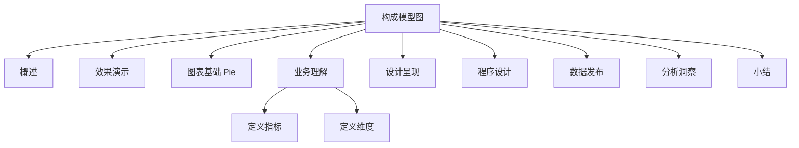

# 案例 3：订单商品构成模型图设计

### 概述

上一小节，我介绍了案例 2：PyEcharts 历史数据变化趋势图的设计和使用。接下来，让我们进入数据分析与可视化精讲的案例 3：订单商品构成模型图设计和使用。本小节是我们 6 个案例中的第三个案例，该案例在整个数据可视化分析构成模型中的位置如下所示：


*图 1：章节内容定位*

上图中，橙色部分是本节我要介绍的内容：订单商品构成模型图。

实时监控数据指标卡用于呈现业务和发现业务问题，通常呈现的是业务的整体特征，一旦发生问题和异常，则需要引入多个不同的维度，对问题进行分析和判断。

**构成维度就是我们需要考虑的维度之一，即该指标的构成元素模型**。指标的构成元素模型，其价值在于，**从目标指标的构成结构上，发现各构成元素的构成比例，从而发现对目标指标影响最大的构成元素**。

数据可视化分析案例部分，我们采用前面的操作流程，分步骤实施，逐项介绍常用的可视化图表的设计和使用方法。通过不断的重复，希望能让你建立一个固定的建设套路和思维模式。


*图 2：操作流程*

### 效果演示

订单商品构成模型，**通过数据可视化的方式，直观展示出商品的种类以及每一种类的商品数量占全部商品数量的比例**。

本案例我们仍采用影片租赁数据为切入点，影片类型、影片评价等级、影片租赁时长、影片租赁价格是影片的 4 种属性，我们采用环形图展示不同属性下，各类别影片数量占全部影片数量的占比情况。图中每个颜色代表一种类别，每个分块的弧长代表该类别的占比大小，所有分块数据总和为 100%。

本案例中租赁订单商品的构成分布图，在 Redash 运用环形图展示运行效果如下所示：


*图 3：订单商品构成分析看板*

上图中，我从商品类型、商品等级、租赁时长和租赁价格这 4 个方面，对商品构成进行了可视化呈现，四者实现技术和方法完全相同。因此，本案例中，我们只选择商品类型构成图来具体阐述，从数据模型到数据可视化呈现分析的过程。其他部分可以参考这种方式，自行完成。

### 图表基础

**订单商品构成模型，可用于展示不同类型的商品占全部商品的比例情况，旨在直观地展示出各种类型商品属性的比例分布**，如商品类型构成、商品等级构成、商品价格构成。

一个基本的商品构成图，在 Echarts 标准图表库中，通常采用基本饼状图或环形图来呈现，其基本形态是一个圆形，可以用不同的颜色填充，每一种颜色代表一种类型、每一种颜色的面积代表数量占比，一个典型的基本饼状图如下所示：


*图 4：基本饼状图*

环形图是基本饼状图的一种变形，同样可以用来展示某种事务类型的构成分布。与基本饼状图的呈现形态不同，环形图的内部是空心的。一个基本的环形图呈现形式如下所示：


*图 5：基本环形图*

饼状图和环形图，除了可以单独使用，还可以以组合图表的形式出现。这样的组合不仅能展示每种商品类型的比例，还能更加详细地展示每一种商品类型的子类型产品的比例，能让你更加详细地了解商品类型的组成分布。

组合图形的中心的饼状图，是由不同颜色的商品类型填充的，最外侧的环形图，则是所属类型下的子商品类型的比例。Echarts 标准图表库中常见的一种组合图如下所示：


*图 6：基本组合饼图*

### 业务理解

业务理解环节，我们需要从业务流程、业务规则、业务活动和总线矩阵四个方面进行梳理。影片租赁业务的业务活动主要包括租赁活动、支付活动和归还活动。具体的业务过程模型如下图所示：


*图 7：业务过程模型*

订单构成模型图考虑的是交易环节，即影片租赁环节，商品的构成问题，通过订单构成过程模型，我们可以发现哪些影片更受客户欢迎，可以辅助商家建设商品体系。

### 定义指标

商品构成分布图，可以用来呈现任何有需要的、具有明显分组特征的数据。

具体的指标选择，可以基于业务需求进行选择。本案例对应的影片租赁业务涉及 3 个业务指标：订单量、交易额、库存量。本案例中，我们仍然以订单量的构成类型作为分析的指标，重点考查租赁出去的商品构成比例情况。


*表 1：指标定义*

### 定义维度

订单商品构成模型的核心是呈现出每种类型的订单量占全部订单量的比例。因此我们需要从订单影片的类型、订单影片的等级、订单影片的租赁时长和订单影片的价格这 4 个维度去考虑订单量的构成情况，并基于此进行可视化呈现的设计。

### 设计呈现

订单商品模型的构成同样需要考虑页面布局和主题样式，一方面包含图表呈现，另外一方面也包括页面布局的设计。一个典型的订单商品构成图的布局设计呈现案例，如下所示：


*图 8：影片类型分布图*

### 程序设计

#### 数据理解

影片类型构成图数据位于影片租赁业务模型中的影片语言、类型、演员和影片简介分析。相关指标涉及的相关主题在业务模型中的位置如下图所示：


*图 9：数据主题*

影片信息表记录了每一部影片的详细信息，每行记录是一部影片信息简介，包含的字段有：影片 ID、标题、影片信息简介、上映日期、最后更新日期等字段。具体的字段结构和数据样本如下图所示：


*图 10：影片基本信息表*

类型数据记录了影片全部的类型，包含的字段有影片类型 ID、对应的类型名称，以及最后更新日期。详情如下图所示：


*图 11：影片类型名称表*

影片数据类型数据记录了租赁的每一部影片的类型，包含的字段有影片 ID、类型 ID、更新日期。详情见下图：


*图 12：影片类型数据表*

租赁交易数据记录了详细的交易订单数据，每一行记录是一条租赁交易信息，字段包括：交易 ID、交易时间、库存 ID、归还时间、店员 ID、更新日期。具体的字段结构和数据样本如下图所示：


*图 13：交易订单数据情况*

库存数据记录了当前各门店的影片库存情况，具体的字段和数据样本如下图所示：


*图 14：库存商品数据*

#### 数据准备

订单商品构成图需要关注各种类型的商品数量。通过分析影片表、类型表、支付和库存原始数据的库表结构和数据内容，我们发现当前的数据并不能满足我们的业务需求，因此我们需要对原始数据进行加工处理。对于租赁影片的类型，我们需要按照影片的不同类型分组统计。

具体的处理方式如下：第一步基于当前的数据表，创建一个包含所有租赁影片的信息表，包含影片类型、影片时长、影片租赁价格、影片评价信息等字段，详情见下图所示：


*图 15：影片基本信息数据*

基本 SQL 脚本如下：

```sql
##########影片信息表###################
DROP TABLE
IF
    EXISTS film_information_full;
CREATE TABLE film_information_full (
  SELECT c1.*,
         c2.category_id,
                c2.category_name 
    FROM(
      SELECT
        b1.日期,
        b2.* 
      FROM
        (
        SELECT
            a1.*,
            a2.film_id 
        FROM
            ( SELECT rental_id, inventory_id, DATE_FORMAT( rental_date, '%Y-%m-%d' ) AS 日期 FROM rental ) a1
            LEFT JOIN ( SELECT inventory_id, film_id FROM inventory ) a2 ON a1.inventory_id = a2.inventory_id 
        ) b1
        LEFT JOIN (
        SELECT
            a3.*,
            a4.NAME 
        FROM
            ( SELECT film_id, language_id, rental_duration, rental_rate, length, replacement_cost, rating FROM film ) a3
            LEFT JOIN ( SELECT language_id, NAME FROM LANGUAGE ) a4 ON a4.language_id = a3.language_id 
        ) b2 ON b2.film_id = b1.film_id 
    ) c1
    LEFT JOIN (
    SELECT
        a5.*,
        a6.category_name 
    FROM
        ( SELECT film_id, category_id FROM film_category ) a5
        LEFT JOIN ( SELECT category_id, NAME AS category_name FROM category ) a6 ON a5.category_id = a6.category_id 
    ) c2 ON c1.film_id = c2.film_id 
    );
```

基于此数据表，我们可以按照不同的分组对数据进行加工混合，并使用不同种类的汇总数据作为数据组，生成我们图表所需要的数据，分组汇总的数据如下所示：


*图 16：各类型的影片订单量*

具体的 SQL 脚本如下所示：

```sql
select category_name,count(*)  as 电影类型
from film_information_full
group by category_name
order by category_name
```

#### 图表设计

##### 概述

上一节我介绍了历史数据变化趋势图，它可以呈现随时间变化的数据，并且通过 PyEcharts 框架进行程序设计。

本小节，我们引入环形图用来呈现订单商品的构成元素，其程序设计流程与上一节保持一致。图表设计包括数据查询和图表创建两部分，**数据查询实现与 MySQL 数据库建立连接、读取数据和格式化输出；图表创建则包括文件导入、对象声明、参数配置和页面渲染**。完整的程序设计流程如下图所示：


*图 17：程序设计流程*

##### 数据查询

订单商品构成模型的数据模型程序，负责从数据准备中生成的影片信息表中，查询不同类型的影片订单量，并返回给调用程序。不同类型的订单量查询代码如下：

```python
from pyecharts.charts import Pie
from pyecharts import options as opts
import pymysql.cursors
# 交易订单量查询
def order_category_sum_query():
    # 连接到数据库
    connection = pymysql.connect(host='127.0.0.1',
                                 port=3306,
                                 user='账号',
                                 password='密码',
                                 db='sakila',
                                 charset='utf8',
                                 cursorclass=pymysql.cursors.DictCursor)
    try:
        with connection.cursor() as cursor:
            # SQL 查询语句：
            sql = "select category_name,count(*)  as 电影类型 from film_information_full group by category_name "
            try:
                # 执行SQL语句，返回影响的行数
                row_count = cursor.execute(sql)
                # 获取所有记录列表
                results = cursor.fetchall()
                dataX = []
                dataY = []
                for row in results:
                    # 此处不可以用索引访问：row[0]
                    dataX.append(row["category_name"])
                    dataY.append(row["电影类型"])
                return dataX, dataY
            except:
                print("错误：数据查询操作失败")
    finally:
        connection.close()
```

订单商品构成模型，采用 PyEcharts 图表库中，环形图进行绘制，具体的程序代码如下：

```python
# 执行主函数
if __name__ == '__main__':
    print(order_category_sum_query())
    dataX, dataY = order_category_sum_query()
    data_pair = [list(z) for z in zip(dataX, dataY)]
    pie = Pie()
    pie.add("", data_pair)
    pie.set_global_opts(
        title_opts=opts.TitleOpts(title="商品类型构成图"),
        legend_opts=opts.LegendOpts(
            orient="vertical",
            pos_top="15%",
            pos_right="-4.5%"),
    )
    pie.set_series_opts(label_opts=opts.LabelOpts(formatter="{b}: {c} ({d}%)",
                        position="outside",
                        background_color="#eee",
                        border_color="#aaa",
                        border_width=1,
                        border_radius=4
                     ))
    pie.render('pie.html')
```

以上程序，通过数据模型调用查询数据，引入 Echarts 组件，获取 Echarts 图表配置参数，实现 Echarts 图表动态渲染。

#### 数据验证

用每一种类型的影片数量填充环形图，填充环形图的大小代表每一种类型的影片数据占全部影片数量的比例。影片构成类型数据的验证方法，主要是通过判断呈现的图表特征是否与实际的业务逻辑保持一致。

### 数据发布

订单商品构成图，配置完成以后，最终以网页的形式发布，发布后的页面如下所示：


*图 18：影片类型分布图*

### 分析洞察

订单商品构成模型的分析方法是通过环形图所占比例的大小判断：被租赁的影片都有哪几种类型，哪种类型的影片所占比例更多。订单商品构成模型图如下所示：


*图 19：影片类型分布图*

通过上图我们可以发现：

- 租赁的影片订单中一共有 16 种影片类型，且每种类型的影片占全部影片的比例分布较为均匀，占全部影片的比例在 5%以上。

- 运动类、动物类、动作类影片租赁占比较高，分别占全部租赁影片的 7.35%、7.27%、6.93%；而恐怖类、旅游类、音乐类的影片租赁占比较少，分别占 5.17%、5.22%、5.27%。

### 小结

本节内容介绍了订单商品构成模型的相关情况，包括业务理解、指标设计、维度设计、图表设计、数据验证、数据发布和分析洞察七个方面。希望通过本节内容的学习，你能够掌握订单商品构成模型的使用场景、设计方法和图表的使用方法。

通过引入构成维度，可以帮助我们找到目标指标的主要影响元素，但是通常情况下，这样做还不够，我们需要引入更多的维度分析指标。

---

---




## 版本差异（数据科学栈 → 当前版本）

| 库 | 本文编写时 | 当前稳定版 | 升级要点 |
|----|-----------|-----------|---------|
| Python | 3.8-3.12 | 3.14 | 3.12+ 起性能显著提升；3.14 PEP 649/750 |
| NumPy | 1.x/2.0 | 2.5.x | `np.float_` 等别名移除；NEP 50 类型提升 |
| Pandas | 1.x/2.x | 2.3.x | CoW 可经选项开启（3.0 起将默认）；`inplace` 将移除；`str` dtype 将为默认 |
| Matplotlib | 3.x | 3.x 稳定版 | API 兼容，样式更新 |
| Seaborn | 0.12/0.13 | 0.13.x | API 稳定 |
| scikit-learn | 1.x | 1.9.x | API 稳定，新算法持续加入 |

> 本文讲解的数据分析流程（读取→清洗→分析→可视化）与核心 API 在最新版本中成立；升级时重点关注 Pandas 3.0 的 Copy-on-Write 与 NumPy 2.x 的类型变化。
