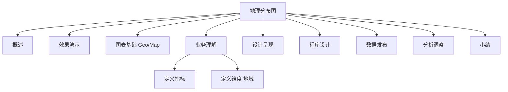

# 案例 4：客户地理位置分布图设计

### 概述

在上一个小节，我介绍了**案例 3：PyEcharts 订单商品构成模型图**的设计和使用。接下来，我们将进入本课程模块三的 10 课时**案例 4：客户地理位置分布图**设计和使用。本小节是我们 6 个案例中的第 4 个案例，该案例在整个构成模型中的位置如下：


*图 1：章节内容定位*

上图中，红色部分是我将要在本节介绍的内容：客户地理位置分布图设计和使用。

数据指标卡可以用来监控业务指标的波动范围是否符合预期，历史数据变化趋势用于预测未来，订单商品构成模型用于发现核心元素，**客户地理位置分布一方面可以评估客户营销的效果，另外一方面可以辅助寻找最有价值的客户地理分布，从而辅助决策营销策略的优化和调整**。

数据可视化分析案例部分，我会采用前面的操作流程，分步骤实施，逐项介绍常用的可视化图表的设计和使用方法。通过不断的重复，希望能让你建立一个固定的建设套路和思维模式。


*图 2：操作流程*

### 效果演示

客户地理位置分布图是通过数据可视化的方式，直观地展示出客户的分布区域，以及每一个区域内的影片租赁次数。本节案例我采用租赁影片的客户的地理位置信息为切入点，通过地图的方式来展示租赁影片的客户大多数是来自哪些国家/地区的，到底哪几个国家/地区的租赁次数最多。

图 3 为最终效果图，图中红色的圆点代表租赁影片的客户所在的国家/地区，不同的颜色代表租赁影片的次数，其中红色为租赁影片最多的客户所在的国家/地区。


*图 3：客户地理位置信息分布图*

### 图表基础

**我们可以通过客户地理位置信息分布图，直观地看出客户分布情况以及数量的多少，以及不同区域间客户数量的对比**。

根据统计维度的层级不同，可以展示不同层级下的客户位置信息分布情况，比如从全球层面来看每个国家的客户数量、某个国家的客户数量、某个国家的某个地区的客户数量，层层对比下可以找出客户数量的分布在每个层级的分布情况以及差异。在 Echarts 图表中，全球地图的基本形式如下：


*图 4：世界地图*

世界地图可以查看全球每个国家和地区的数量。此外，我们还可以展示出某一个国家的客户分布数量，比如中国主要分布在哪几个省份，哪些省份的哪些城市分布数量最多。在 Echarts 中，展示形式如下：


*图 5：中国地图*

更进一步，我们可以用地图展示某一个省的客户数分布数量，从而进一步分析在这个省份地的内部，哪些区域较为密集，哪些城市客户数量较多，哪些城市客户数量较少，哪些区域没有客户。在 Echarts 中，展示的形式如下：


*图 6：广东省地图*

本节案例，我将以全球层级的视角来分析每一个国家/地区的影片租赁次数分布情况，对比分析每个国家的租赁次数。

### 业务理解

业务理解环节，我会带你从业务流程、业务规则、业务活动和总线矩阵这 4 个方面进行梳理。影片租赁业务的业务活动主要包括租赁活动、支付活动和归还活动。具体的业务过程模型如下：


*图 7：业务过程模型*

客户地理位置分布图设计，需要考虑的是参与影片租赁交易的客户的家庭地址，其中影片租借、归还和支付属于一次完整的交易，涉及的客户是同一个对象。因此我们只需要考虑影片租赁活动的客户信息即可。

### 定义指标

客户地理位置信息分布图能够呈现每个区域的影片租赁次数，具体的指标可以基于我们的业务需求进行选择。对应影片租赁业务的业务活动，我采用了影片租赁次数作为指标。如下表所示：

| 指标名称 | 业务逻辑 | 计算逻辑 |
| --- | --- | --- |
| 影片租赁次数 | 租赁影片的次数 | select country,count(distinct rental_id) as rental_count from customer_address group by country |

*表 1：指标定义*

说明：该指标按 `count(distinct rental_id)` 统计每个国家/地区的租赁次数；如需统计客户数量，应改用 `count(distinct customer_id)`。

### 定义维度

客户地理位置分布图核心是**呈现出不同国家/地区客户数量的分布情况**。我们可以从地理位置这一维度来看客户数量。本案例中地理位置信息维度有 3 个层级，分别为国家、地区、城市。我们选择从国家（地区）角度来看客户的分布情况。

### 设计呈现

客户地理位置信息分布图的构成同样需要考虑页面布局和主题样式。一个典型的客户地理位置信息分布图的布局设计呈现案例，如下：


*图 8：客户地理位置信息分布图*

### 程序设计

#### 数据理解

客户地理位置分布图的相关指标在业务模型中的位置如下：


*图 9：数据主题*

地理信息表记录了每一个地址的详细信息，包含的字段有地址 ID、地址、地区、所属城市 ID、所在地邮编、电话、经纬度信息、最后更新日期。具体的字段结构和数据样本如下：


*图 10：地址信息表*

城市信息表记录了城市 ID、对应的城市名称、城市所属的国家/地区、最后更新日期。详情如下：


*图 11：城市信息表*

国家/地区信息表记录了国家/地区的 ID、国家/地区的名称、最后更新日期。详情如下：


*图 12：国家/地区信息表*

顾客基本信息表记录了每一位顾客的基本信息，包括顾客 ID、门店 ID、顾客姓名、顾客邮箱、地址 ID、是否活跃、创建日期、最后更新日期。具体字段如下：


*图 13：顾客基本信息表*

租赁交易数据记录了详细的交易订单数据，每行记录是一条租赁交易信息，字段包括：交易 ID、交易时间、库存 ID、客户 ID、归还时间、店员 ID，更新日期。具体的字段结构和数据样本如下：


*图 14：影片租赁交易信息记录表*

#### 数据准备

客户地理位置分布图，需要关注的是每个国家/地区的租赁次数及其差异点。我们需要知道租赁影片的客户基本信息。通过对租赁交易信息记录表分析得出的数据并不能满足我们的需求，因此我们需要对原始数据加工处理。对于租赁次数，我们需要按照国家/地区、城市分组汇总。

要进行汇总，我们需要**基于当前的数据表，创建一个包含所有客户信息的表**，包含租赁 ID、租赁日期、库存 ID、归还日期、员工 ID、顾客 ID、地址 ID、详细地址、地区、城市 ID、城市名称、经纬度信息、国家 ID，国家名称。详情如下：


*图 15：租赁客户基本信息数据*

SQL 脚本如下：

```sql
DROP TABLE IF EXISTS customer_address;
CREATE TABLE customer_address(
SELECT c2.rental_id,
       c2.rental_date,
             c2.inventory_id,
             c2.return_date,
             c2.staff_id,
       c1.*
FROM(SELECT * from rental ) c2
LEFT JOIN (
SELECT b1.customer_id,b1.address_id,b1.address,b1.district,b1.city_id,b1.location,b1.city,b1.country_id ,b1.country
FROM (
SELECT a1.*,
             a2.city,
             a2.country_id,
             a3.country,
             a4.customer_id
FROM address a1,
     city a2,
         country a3,
         customer a4
WHERE a1.city_id =a2.city_id 
AND a2.country_id = a3.country_id
AND a1.address_id = a4.address_id
ORDER BY a1.address_id
)b1 ) c1  ON c2.customer_id = c1.customer_id);
```

**基于此数据表，我们就可以按照不同的分组对数据进行加工混合，并使用不同种类的汇总数据作为数据组，生成我们图表所需要的数据**。分组汇总的数据如下：


*图 16：各国家/地区的影片租赁次数*

具体的 SQL 脚本如下：

```sql
select country,count(distinct rental_id) as rental_count  from customer_address
group by country
```

#### 图表设计

##### 概述

图表设计包含数据查询、Echarts 图表元素库的引入、图表渲染。数据模型是基于具体的业务需求构建的租赁影片信息表，我会依据此模型查询数据，并将查询的数据返回给引入的图表中，调整图表配置的其他参数完成图表的渲染功能，从而完整的呈现出图表。完整的设计流程如下：


*图 17：程序设计流程*

##### 数据查询

在这里，我引入 PyEcharts 框架中的图表类，作为我们可视化呈现的图表元素。同样的，图表设计包括**数据查询**和**图表创建**两部分。

**数据查询实现与 MySQL 数据库建立连接、读取数据和格式化输出；图表创建包括文件导入、对象声明、参数配置和页面渲染**。不同地区的影片租赁次数查询代码如下：

```python
from pyecharts import options as opts
import pymysql.cursors
from pyecharts.charts import Map
# 不同国家/地区影片租赁次数
def customer_sum_query():
    # 连接到数据库
    connection = pymysql.connect(host='<YOUR_DB_HOST>',
                                 port=3306,
                                 user='root',
                                 password='<YOUR_DB_PASSWORD>',
                                 db='sakila',
                                 charset='utf8',
                                 cursorclass=pymysql.cursors.DictCursor)
    try:
        with connection.cursor() as cursor:
            # SQL 查询语句
            sql = "select country,count(distinct rental_id) as rental_count  from customer_address group by country "

            try:
                # 执行SQL语句，返回影响的行数
                row_count = cursor.execute(sql)
                # 获取所有记录列表
                results = cursor.fetchall()
                dataX = []
                dataY = []
                for row in results:
                    # 此处不可以用索引访问：row[0]
                    dataX.append(row["country"])
                    dataY.append(row["rental_count"])
                return dataX, dataY
            except:
                print("错误：数据查询操作失败")
    finally:
        connection.close()
```

以上步骤只是完成了 PyEcharts 图表的数据查询，**接下来我们需要绑定和渲染 PyEcharts 图表元素**，客户地理位置信息分布图的绑定和渲染程序如下所示：

```python
# 执行主函数
if __name__ == '__main__':
    print(customer_sum_query())
    dataX, dataY = customer_sum_query()
    map = Map(init_opts=opts.InitOpts(width="1200px", height="600px"))
    map.add("", [list(z) for z in zip(dataX, dataY)], "world")
    map.set_series_opts(label_opts=opts.LabelOpts(is_show=False))
    map.set_global_opts(title_opts=opts.TitleOpts(title="客户地理位置分布图"),
                        visualmap_opts=opts.VisualMapOpts(max_=1600, split_number=8, is_piecewise=True)
                        )
    map.render("customer_address.html")
```

以上程序，通过数据模型调用查询数据，引入 PyEcharts 组件，获取 PyEcharts 图表配置参数，实现 PyEcharts 图表动态渲染。

#### 数据验证

用不同地区的租赁次数填充城市的颜色，颜色越深代表租赁次数越多。填充完成后会根据颜色展示客户的分布情况，我们可以根据业务情况判断，展示出来的内容是否与实际相符。

### 数据发布

客户地理位置信息分布图，完成图表渲染后，以网页的形式发布，发布的形式如下：


*图 18：客户地理位置信息分布图*

### 分析洞察

客户地理位置信息分布图的分析方法是：**通过红色圆点的数量来观察客户分布的城市个数和密集程度，通过不同的颜色来渲染不同地区的租赁次数**。

以图 18 为例，我们通过图 18 可以得到以下结论：

**不同区域的客户分布密集程度不同。** 客户在欧洲地区分布较为密集，其次是亚洲地区、非洲地区，而北美洲、南美洲、大洋洲客户密集程度较低。

租赁影片的客户一共来自世界 108 个国家/地区，其中欧洲地区有法国、西班牙、瑞士等 30 个国家；非洲地区有苏丹、利比亚、阿尔及利亚等 28 个国家；亚洲和其他洲则一共有 50 个国家。

**不同国家的租赁次数差异较大。** 亚洲地区，印度、中国的租赁次数最多，分别有 1576、1426 次；其次是北美的美国和墨西哥，以及南美的巴西，分别有 968、825、798 次；其他国家的租赁次数则较少。

### 小结

本节内容介绍了客户地理位置分布的相关情况，包括业务理解、指标设计、维度设计、图表设计、数据验证、数据发布和分析洞察等 7 个方面。希望通过本节内容的学习，你能够掌握地理位置信息的使用场景、设计方法和图表的使用方法。

---

---




## 版本差异（数据科学栈 → 当前版本）

| 库 | 本文编写时 | 当前稳定版 | 升级要点 |
|----|-----------|-----------|---------|
| Python | 3.8-3.12 | 3.14 | 3.12+ 起性能显著提升；3.14 PEP 649/750 |
| NumPy | 1.x/2.0 | 2.5.x | `np.float_` 等别名移除；NEP 50 类型提升 |
| Pandas | 1.x/2.x | 2.3.x | CoW 可经选项开启（3.0 起将默认）；`inplace` 将移除；`str` dtype 将为默认 |
| Matplotlib | 3.x | 3.x 稳定版 | API 兼容，样式更新 |
| Seaborn | 0.12/0.13 | 0.13.x | API 稳定 |
| scikit-learn | 1.x | 1.9.x | API 稳定，新算法持续加入 |

> 本文讲解的数据分析流程（读取→清洗→分析→可视化）与核心 API 在最新版本中成立；升级时重点关注 Pandas 3.0 的 Copy-on-Write 与 NumPy 2.x 的类型变化。
