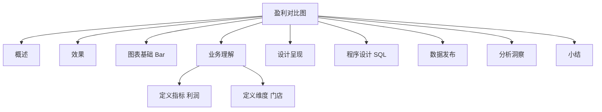

# 案例 5：门店盈利能力对比图设计

### 概述

上一小节，我介绍了客户地理位置分布图和 PyEcharts 地图的设计和使用方法。本小节，我会介绍另外一种图表：门店盈利能力对比图。本节内容在整个案例部分的位置如下图所示：


*图 1：章节内容定位*

上图中，橙色部分是我会在本节介绍的内容：门店盈利能力对比分析。客户地理位置分布是从空间分布维度，描述客户的空间分布情况，门店盈利能力则是从对比维度，描述不同门店之间经营状况的差异。

数据可视化分析案例部分，我会采用前面的操作流程，分步骤实施，逐项介绍常用的可视化图表的设计和使用方法。通过不断的重复，希望能让你建立一个固定的建设套路和思维模式。


*图 2：操作流程*

### 效果

**门店盈利能力对比分析，通过可视化的方式，直观地展示出每一个门店的盈利能力及其历史趋势变化**。

本案例我以对外出租影片的门店的营业额（每个订单的订单金额）为切入点，通过柱状图的形式，展示不同门店在不同时间节点的订单金额变化情况。如图 3 所示，以时间为横坐标，宽度相同的条形的高度代表门店的营业额，不同的颜色代表不同的门店。


*图 3：门店盈利能力对比分析图*

### 图表基础

**柱状图，又称为长条图、柱形统计图，以宽度相同的条形的高度代表变量值的大小，通常只适用于一个变量，用来展示一个变量中的项目的数值。其最主要的特点是能使人们一眼看出各个数据的大小，且易于比较数据之间的差异**。

柱状图的变形和延伸表现形式图表有簇状条形图和堆积条形图等，二者有时也被称为：簇状图和堆积图，或者簇型柱状图和堆积柱状图。

在 Echarts 图表中，要展示一个变量的不同组之间的数值变化情况可以采用图 4 的形式。从图 4 中，我们可以直观地看到商家 A 的每一个分组下的数值大小及不同分组之间的差异情况。


*图 4：基本柱状图*

**基本柱状图，通常用来展示一个项目的不同构成成分之间的数值分布。对于 2 个或 2 个以上的项目间的数值分布情况，通常我们可以采用簇状柱形图的形式。簇状图一般按照对比维度字段进行切分，并列呈现，采用不同的颜色来对比维度间的关系，适合分析对比组内的各项数据**。

Echarts 中簇状图的呈现形式如下：


*图 5：簇状柱形图*

**堆积柱形图，把不同项目堆积形成条形图，每一根柱子上的值分别代表不同的数据大小，各层的数据总和代表整根柱子的高度。可以形象地展示出每一个类别下对比维度的数组大小**。

Echarts 中，堆积柱状图的呈现形式如下：


*图 6：堆积柱形图*

### 业务理解

业务理解环节，我会带你从业务流程、业务规则、业务活动和总线矩阵这 4 个方面进行梳理。影片租赁业务的业务活动主要包括租赁活动、支付活动和归还活动。具体的业务过程模型如下：


*图 7：业务过程模型*

门店盈利能力对比分析，需要考虑的分析对象是门店，需要考虑的是支付环节的月度汇总营业额。通过对比分析盈利能力，可以为我们评判门店的经营状况，优化门店的经营模式提供数据支持。

### 定义指标

门店盈利对比分析可以用来展示每个门店的营业额，指标的选择基于我们的业务需求。在影片租赁场景中，客户在门店租赁影片的时候需要向门店支付相应的租金，门店收取租金（营业额）的多少代表门店的营业能力。


*表 1：指标定义*

### 定义维度

门店盈利对比分析的核心是：**展示各个时间节点下各门店的盈利情况**。因此我们需要考虑时间维度，并且只考虑时间维度中的时间段，而非时间点。

时间维度是有粒度的，常用时间粒度包括：秒、分钟、5 分钟、15 分钟、小时、日、周、月、季和年。时间粒度可以基于业务需求选择。本案例中，我选择月作为时间维度的粒度。

### 设计呈现

门店盈利能力对比分析图的构成需要页面布局、主题样式，尤其是展示样式的选择。本案例中，我确定以簇状图的形式展现各门店在不同时间节点下的营业额数值，基本形式如图 8 所示：


*图 8：门店营业能力分析图*

### 程序设计

#### 数据理解

门店营业能力对比分析，位于影片租赁业务模型中的门店、租赁、支付模块：


*图 9：数据主题*

支付交易数据记录了详细的订单支付数据，每行记录是一条支付记录，字段包括：支付 ID、客户 ID、店员 ID、交易 ID、金额、支付时间、更新时间。具体的字段和数据样本如下：


*图 10：订单支付数据*

店员信息表记录了店员 ID、店员姓名、地址 ID、店员照片、店员邮箱、所属商店 ID、状态、用户名、密码、最后更新日期，详情如下：


*图 11：店员信息表*

#### 数据准备

**要分析门店盈利能力，需要关注的是各个门店的营业额**。我们知道客户在租赁影片时为影片支付的租金，但是无法知道对应的门店每天所收取的租金有多少。因此，当前的数据形式不能满足我们的需求，我们需要对数据进行加工处理。对于门店营业额，我们需要按照门店分类，汇总每个门店当月的营业额。

具体的处理方式如下：**第一步，基于当前的数据表，创建一个含有门店营业额的汇总表**，包含门店的 ID、支付日期、营业额；**第二步，把数据表的行转换成列**，以便于我们绘制图表时调用数据；**第三步，基于创建的数据表进行数据查询**。

**第一步各门店营业额的基本信息表包含门店 ID、日期、门店营业额**，结果如下所示：


*图 12：门店营业额*

基本 SQL 脚本如下：

```
##########第一部分，查询各月各门店销售量##############
SELECT
    b1.store_id,
    SUBSTR( b1.payment_date, 1, 7 ) AS payment_date,
    SUM( b1.amount ) AS store_amount 
FROM
    (
SELECT
    a1.staff_id,
    a1.amount,
    a1.payment_date,
    a2.store_id 
FROM
    payment a1,
    staff a2 
WHERE
    a1.staff_id = a2.staff_id 
    ) b1 
GROUP BY
    b1.store_id,
    SUBSTR( b1.payment_date, 1, 7 )
```

**第二步，我们在查询数据时需要对数据形式进行转化**，把每个商店每一行的数据转化为“列”数据，便于我们代入图表，赋予图表数值。查询结果数据形式如下所示：


*图 13：各门店营业额*

具体的 SQL 脚本如下所示：

```
#########把每一行数据转换为每一列数据，展示每个月两商店销售数量####

DROP TABLE IF EXISTS month_store_amount;
CREATE TABLE month_store_amount(
SELECT c1.payment_date,
    MAX( CASE WHEN c1.store_id = 1 THEN c1.store_amount ELSE 0 END ) AS A,
    MAX( CASE WHEN c1.store_id = 2 THEN c1.store_amount ELSE 0 END ) AS B 
FROM (

SELECT 
    b1.store_id,
    SUBSTR( b1.payment_date, 1, 7 ) AS payment_date,
    sum( b1.amount ) AS store_amount 
FROM 
(
SELECT 
a1.staff_id,
a1.amount,
a1.payment_date,
a2.store_id
FROM
payment a1,
staff  a2
WHERE a1.staff_id = a2.staff_id ) b1
GROUP BY b1.store_id,
        SUBSTR( b1.payment_date, 1, 7 )
) c1
GROUP BY c1.payment_date);
```

#### 图表设计

##### 概述

图表设计包括数据查询和图表创建两部分，数据查询需要与 MySQL 数据库建立连接、读取数据和格式化输出；图表创建包括文件导入、对象声明、参数配置和页面渲染。完整的程序设计流程如下：


*图 14：程序设计流程*

##### 数据查询

门店盈利能力对比分布数据查询程序，负责从数据准备中生成的不同日期下门店盈利能力的表中，查询门店的营业额，然后返回给调用程序。不同门店的营业额查询代码如下：

```python
from pyecharts import options as opts
import pymysql.cursors
from pyecharts.charts import Bar

# 不同门店的营业额
def month_store_query():
    #
    connection = pymysql.connect(host='<YOUR_DB_HOST>',
                                 port=3306,
                                 user='root',
                                 password='<YOUR_DB_PASSWORD>',
                                 db='sakila',
                                 charset='utf8',
                                 cursorclass=pymysql.cursors.DictCursor)
    try:
        with connection.cursor() as cursor:
            # SQL 查询语句
            sql = "select * from month_store_amount "
            try:
                # 执行 SQL 语句，返回影响的行数
                row_count = cursor.execute(sql)
                # 获取所有记录列表
                results = cursor.fetchall()
                dataX = []
                dataY1 = []
                dataY2 = []
                for row in results:
                    # 此处不可以用索引访问：row[0]
                    dataX.append(row["payment_date"])
                    dataY1.append(row["A"])
                    dataY2.append(row["B"])
                return dataX, dataY1, dataY2
            except:
                print("错误：数据查询操作失败")
    finally:
        connection.close()
```

**上述代码只是完成了 PyEcharts 图表的数据查询**。接下来，我们需要绑定和渲染 PyEcharts 图表元素，门店盈利能力的绑定和渲染程序如下所示：

```python
# 执行主函数
if __name__ == '__main__':
    print(month_store_query())
    dataX, dataY1, dataY2 = month_store_query()
    bar = Bar()
    bar.add_xaxis(dataX)
    bar.add_yaxis("A", dataY1)
    bar.add_yaxis("B", dataY2)
    bar.set_global_opts(xaxis_opts=opts.AxisOpts(type_="category"),
                        yaxis_opts=opts.AxisOpts(type_="value"),
                        title_opts={"text":"商店盈利能力分析图","subtext":"单位（美元）"})
    bar.render('store_amount.html')
```

以上代码，**将查询得到的门店营业额数据绑定到柱状图对象，并通过渲染函数生成 store_amount.html 页面文件，实现门店盈利能力对比图的呈现**。

#### 数据验证

门店盈利能力对比分析图的构造，用不同颜色的柱形代表不同的门店，柱形的高度代表营业额的多少。我们可以通过图形清楚地看到在不同时间节点上，各门店的营业额，从而完成对门店盈利能力的分析。相关的数据验证，我们只需要与门店的实际收入进行比对即可。

### 数据发布

门店盈利对比分析，完成图表渲染后，以网页的形式发布，发布的形式如下：


*图 15：门店盈利能力对比分析*

### 分析洞察

门店盈利能力对比分析，分析方法是：**通过不同时间节点下柱形的高度看出每个门店的营业额能力，同时也可以看出每个门店的营业额差异以及这种差异的趋势**。

通过图 15，我们可以得到以下结论：

- **2005 年，两个门店的营业额呈现逐渐上升的趋势。增长趋势显著，且门店 B 的增长速度高于门店 A 的增长速度**。从图中我们可以看到，2005 年 8 月份，门店 A 的营业额为 1422.55 美元，是同年 5 月份的 3 倍；2005 年 8 月门店 B 的营业额 1512.49 美元是 5 月份营业额 353.22 美元的 4.28 倍。

- **2005 年 5 月和 6 月，门店 A 的营业额高于门店 B 的营业额；从 7 月份开始，门店 B 的营业额高于门店 A 的营业额，且在 2006 年的 2 月份也是如此**。得到这条结论后，我们可以重点关注一下从 5 月份起，门店 B 是否采取了一些营销策略，比如降低影片租金、丰富了影片的类型等活动来提升营业额。

- **2005 年至 2006 年期间，两门店营业额的差距逐渐缩小**。2005 年 5 月份，两门店的营业额差距为 127.59 美元；从 6 月份开始，两门店的营业额差距均保持在 100 美元以内，且每个门店营业额增长的趋势也逐渐趋于平缓。

通过对比分析，我们可以评判门店的经营状况，并为优化门店的经营模式提供依据。

### 小结

本节我介绍了门店盈利能力对比分析的相关情况，包括业务理解、指标设计、维度设计、图表设计、数据验证、数据发布和分析洞察共 7 个方面。希望通过本节内容的学习，你能够掌握门店盈利能力对比的使用场景、设计方法和图表的使用。

门店盈利能力对比分析只是从单一维度进行了门店的量化评估。有时候，我们还需要从多维视角，分析和评判门店的竞争优势。

---

---




## 版本差异（数据科学栈 → 当前版本）

| 库 | 本文编写时 | 当前稳定版 | 升级要点 |
|----|-----------|-----------|---------|
| Python | 3.8-3.12 | 3.14 | 3.12+ 起性能显著提升；3.14 PEP 649/750 |
| NumPy | 1.x/2.0 | 2.5.x | `np.float_` 等别名移除；NEP 50 类型提升 |
| Pandas | 1.x/2.x | 2.3.x | CoW 可经选项开启（3.0 起将默认）；`inplace` 将移除；`str` dtype 将为默认 |
| Matplotlib | 3.x | 3.x 稳定版 | API 兼容，样式更新 |
| Seaborn | 0.12/0.13 | 0.13.x | API 稳定 |
| scikit-learn | 1.x | 1.9.x | API 稳定，新算法持续加入 |

> 本文讲解的数据分析流程（读取→清洗→分析→可视化）与核心 API 在最新版本中成立；升级时重点关注 Pandas 3.0 的 Copy-on-Write 与 NumPy 2.x 的类型变化。
