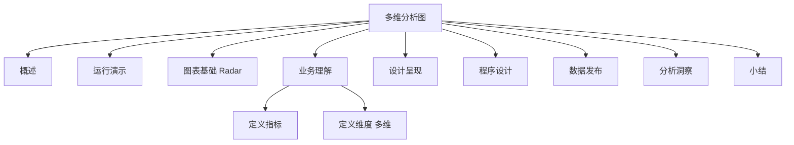

# 案例 6：竞争优势多维分析图设计

### 概述

上一小节，我介绍了**案例 5：门店盈利能力对比图**的设计和使用，掌握了如何基于对比维度，进行多个项目的对比分析。本节内容，我介绍**案例 6：竞争优势多维分析图**的设计和使用，本节内容在整个案例部分的位置如下所示：


*图 1：章节内容定位*

上图中，橙色部分是我本节要讲的内容：竞争优势多维分析。门店盈利能力对比分析，是从对比维度，描述不同门店之间，经营状况的差异。对比的维度是从单一维度进行分析，但是很多情况下，评判一个事务的状况，我们需要从多个不同的维度进行分析。我在本节内容介绍的竞争优势多维分析图就是用来解决这个问题的。

数据可视化分析案例部分，我会采用前面的操作流程，分步骤实施，逐项介绍常用的可视化图表的设计和使用方法。通过不断的重复，希望能让你建立一个固定的建设套路和思维模式。


*图 2：操作流程*

### 运行演示

竞争优势多维分析图，通过数据可视化的方式，直观地展示每一个竞争因素的分布情况。本节案例，我会采用每个门店的订单量、订单金额、客户数量、影片类型四个因素，全面综合地分析两个门店的竞争优势，并通过雷达图的形式展示出来。门店竞争优势多维分析图运行演示实例如下所示：


*图 3：门店竞争优势分析图*

### 图表基础

通过雷达图的形式，可以直观地比较出，各个门店不同维度的情况。

**雷达图，又称蜘蛛网图，通常适用于三个或者更多维度的变量。雷达图以在同一点开始的轴上显示的三个，或者更多个变量的二维图表的形式，来展示多元数据**。

其中轴的相对位置和角度通常是无意义的。雷达图的每个变量都有一条从中心向外发射的轴线，所有轴之间夹角相等，同时每个轴都有相同的刻度。轴到轴的刻度用网格连接作为辅助元素，连接每个变量在其各自的轴线的数据点成一条多边形。一个典型的雷达图的表现形式如下图所示：


*图 4：基本雷达图*

**雷达图通常用来查看哪些变量具有相似的值、变量之间是否有异常值、变量在数据集内分布的高低，以及排名、评估、评论等数据的展示**。

雷达图的常见的类型有将每个数据点连接成的多边形，可以比较直观地展示出每一个变量的数据点情况，当参与比较的项目比较多的时候可以采用面积图的形式来展现每一个项目下每个变量的数据情况。

雷达图使用需要注意以下 3 点：

- **一个雷达图包含的是多边形的数量是有限的**。如果有五个以上的项目需要评估，无论是轮廓还是填充区域，都会产生覆盖和混乱，导致数据难以阅读，图形不能有效地传达出信息。

- **变量的个数需要控制**。变量太多会产生太多的轴，也会使图表变得混乱。因此要控制变量的个数，让雷达图能够简洁有效地呈现数据。

- **雷达图很难展示出变量的具体数值**。由于径向距离很难判断，即使有网格线的参考，还是很难直观地比较图表内的具体数值。若要具体表现出数值，建议使用折线图。

通常情况下，雷达图的表现形式还可以拓展，比如我们可以用不同的颜色来填充多边形，从而更直观地展示出某个项目的各个变量值。一个典型的填充的雷达图如下所示：


*图 5：填充的雷达图*

### 业务理解

业务理解环节，我会带你从业务流程、业务规则、业务活动和总线矩阵这 4 个方面进行梳理。影片租赁业务的业务活动主要包括租赁活动、支付活动和归还活动。具体的业务过程模型如下所示：


*图 6：业务过程模型*

门店竞争优势多维分析涉及门店、交易、客户等业务活动，通过引入不同的分析维度：门店营业额、门店订单量、门店客户数和门店商品类型数，实现对于门店经营状况的多维分析。

### 定义指标

**竞争优势多维分析，可以用来比较影响各个门店的业务要素的数据情况**。本案例中我们选择门店的订单金额、订单数量、顾客数量、影片类型数，来看下各个门店的优势与不足之处。


*图 7：指标定义*

### 定义维度

门店竞争优势分析的核心是：**展示各个时间节点下各门店的竞争优势，然后加以分析**。因此我们需要考虑时间维度，并且是时间维度中的时间段，而非时间点。

时间维度是有粒度的，常用时间粒度包括：秒、分钟、5 分钟、15 分钟、小时、日、周、月、季和年。时间粒度可以基于业务需求选择。本案例中，我选择“年”作为时间维度的粒度。

### 设计呈现

门店竞争优势多维分析图的构成需要页面布局、主题样式，尤其是展示样式的选择。本案例中，我确定以雷达图的形式展现各门店在 2005 年各项指标中的数据情况，展示的基本形式如下图 8 所示：


*图 8：门店营业能力分析图*

### 程序设计

#### 数据理解

支付交易数据记录了详细的订单支付数据，每行记录是一条支付记录，字段包括：支付 ID、客户 ID、店员 ID、交易 ID、金额、支付时间、更新时间。具体的字段和数据样本如下：


*图 9：订单支付数据*

店员信息表记录了店员 ID、店员姓名、地址 ID、店员照片、店员邮箱、所属商店 ID、状态、用户名、密码、最后更新日期，详情如下：


*图 10：店员信息表*

租赁交易数据记录了详细的交易订单数据，每行记录是一条租赁交易信息，字段包括：交易 ID、交易时间、库存 ID、客户 ID、归还时间、店员 ID，更新日期。具体的字段结构和数据样本如下：


*图 11：租赁交易信息*

库存数据记录了当前各门店的影片库存情况，具体的字段结构和数据样本如下：


*图 12：库存数据*

影片数据类型数据记录了租赁的每一部影片的类型，包含的字段有影片 ID、类型 ID、更新日期。详情如下：


*图 13：影片类型表*

#### 数据准备

竞争优势多维分析，首先需要关注的是影响各门店业绩的因素有哪些。

本案例中，门店订单金额、门店订单数量、门店顾客数量、门店影片类型这 4 项是我评估各门店业绩情况的数据基础。通过分析原数据，我发现当前的数据结构不能满足分析需要，因此我对数据进行加工处理，构造一个包含在特定时间节点下，各门店的 4 个因素的数据表现。

具体的处理方式如下：**第一步，基于当前的数据表，创建一个含有门店订单金额、门店订单数量、门店顾客数量、门店影片类型的数据表**；**第二步，把数据表形式进行列转行的转换**，以便于我们绘制图表调用数据，**第三步，基于创建的数据表进行数据查询**。

**第一步，各门店的评估因素基本信息表**，包含门店 ID、时间、门店订单金额、门店顾客数量、门店订单量、门店影片类型，结果如下所示：


*图 14：门店各项数据*

基本 SQL 脚本如下：

```sql
##########第一部分，构造各门店各年评估因素表##########
DROP TABLE IF EXISTS store_compare;
CREATE TABLE store_compare (
SELECT b1.store_id,
       b1.payment_date,
       sum(b1.amount) as store_amount,
       count(distinct b1.customer_id) as store_customer,
       count(b1.rental_id) as store_order,
       count(distinct b2.category_id) as store_category
FROM(
  SELECT
    a1.staff_id,
    a1.amount,
    a1.rental_id,
    a1.customer_id,
    SUBSTR( a1.payment_date, 1, 4 ) AS payment_date,
    a2.store_id
  FROM
    payment a1,
    staff a2
  WHERE a1.staff_id = a2.staff_id) b1
LEFT JOIN(
  SELECT
    a3.rental_id,
    a3.inventory_id,
    a4.store_id,
    a4.film_id,
    a5.category_id
  FROM
    rental a3,
    inventory a4,
    film_category a5
  WHERE a3.inventory_id = a4.inventory_id
    AND a4.film_id = a5.film_id
) b2 ON b1.rental_id = b2.rental_id
GROUP BY b1.store_id,
         b1.payment_date);
```

**第二步，我们在查询数据时需要对数据形式进行转化，把每一个商店每一列的数据转化为行数据**，便于我们代入图表中赋予图表数值。查询结果数据形式如下所示：


*图 15：数据形式转换*

具体的 SQL 脚本如下所示：

```sql
#########把每一行数据转换为每一列数据，展示各年两商店评估因素#####

DROP TABLE IF EXISTS store_all;
CREATE TABLE store_all(
SELECT 'store_amount' AS category,
       payment_date,
       MAX(case store_id when 1 then store_amount else 0 end) as A,
       MAX(case store_id when 2 then store_amount else 0 end) as B
FROM store_compare
GROUP BY payment_date
UNION ALL
SELECT 'store_order' AS category,
       payment_date,
       MAX(case store_id when 1 then store_order else 0 end) as A,
       MAX(case store_id when 2 then store_order else 0 end) as B
FROM store_compare
GROUP BY payment_date
UNION ALL
SELECT 'store_customer' AS category,
       payment_date,
       MAX(case store_id when 1 then store_customer else 0 end) as A,
       MAX(case store_id when 2 then store_customer else 0 end) as B
FROM store_compare
GROUP BY payment_date
UNION ALL
SELECT 'store_category' AS category,
       payment_date,
       MAX(case store_id when 1 then store_category else 0 end) as A,
       MAX(case store_id when 2 then store_category else 0 end) as B
FROM store_compare
GROUP BY payment_date);
```

#### 图表设计

##### 概述

图表设计包括数据查询和图表创建两部分。**数据查询**实现与 MySQL 数据库建立连接、读取数据和格式化输出；**图表创建**包括文件导入、对象声明、参数配置和页面渲染。完整的程序设计流程如下：


*图 16：程序设计流程*

##### 数据查询

竞争优势多维分析数据查询程序负责从数据库中，查询门店的多维数据，然后返回给调用程序。具体的数据查询代码如下：

```python
from pyecharts import options as opts
import pymysql.cursors
from pyecharts.charts import Radar

# 不同门店的多维数据
def store_query():
    # 连接到数据库
    connection = pymysql.connect(host='127.0.0.1',
                                 port=3306,
                                 user='root',
                                 password='密码',
                                 db='sakila',
                                 charset='utf8',
                                 cursorclass=pymysql.cursors.DictCursor)
    try:
        with connection.cursor() as cursor:
            # SQL 查询语句
            sql = "select * from store_all "

            try:
                # 执行 SQL 语句，返回影响的行数
                row_count = cursor.execute(sql)
                # 获取所有记录列表
                results = cursor.fetchall()
                data1 = []
                data2 = []
                data3 = []
                for row in results:
                    # 此处不可以用索引访问：row[0]
                    data1.append(row["A"])
                    data2.append(row["B"])
                    data3.append(row["category"])
                return data1, data2, data3
            except:
                print("错误：数据查询操作失败")
    finally:
        connection.close()
```

以上步骤只是完成了 PyEcharts 图表的数据查询，接下来我们需要绑定和渲染 PyEcharts 图表元素，门店竞争优势的绑定和渲染程序如下所示：

```python
# 执行主函数
if __name__ == '__main__':
    print(store_query())
    data1, data2, data3 = store_query()
    radar = Radar(init_opts=opts.InitOpts(width="1280px", height="720px", bg_color="#CCCCCC"))
    radar.add_schema(schema=[
        opts.RadarIndicatorItem(name="门店订单金额", max_=34000),
        opts.RadarIndicatorItem(name="门店订单量", max_=10000),
        opts.RadarIndicatorItem(name="门店顾客数", max_=10000),
        opts.RadarIndicatorItem(name="门店商品类型", max_=10000),
    ],
    splitarea_opt=opts.SplitAreaOpts(
        is_show=True, areastyle_opts=opts.AreaStyleOpts(opacity=1)
    ),
    textstyle_opts=opts.TextStyleOpts(color="#fff"),
    )
    radar.add(series_name="A 商店",
              data=[list(data1)],
              linestyle_opts=opts.LineStyleOpts(color="#CD0000")
              )
    radar.add(series_name="B 商店",
              data=[list(data2)],
              linestyle_opts=opts.LineStyleOpts(color="#5CACEE")
              )
    radar.set_series_opts(label_opts=opts.LabelOpts(is_show=False))
    radar.set_global_opts(
        title_opts=opts.TitleOpts(title="门店竞争优势多维分析"), legend_opts=opts.LegendOpts()
    )
    radar.render('radar.html')
```

以上代码，**将查询得到的门店多维数据绑定到雷达图对象，并通过渲染函数生成 radar.html 页面文件，实现门店竞争优势多维分析图的呈现**。

#### 数据验证

竞争优势多维分析的构造，我选择分析 2005 年两个门店的各项数据。每一个轴，代表一个需要分析的数据，每一个多边形轮廓代表一个门店的实际情况。

我们可以清楚地看出不同门店的各项数据的情况，同时也可以多方面全方位地对比分析两个门店间的差异。这些数据的正确与否，可以通过对比门店的实际经营情况，进行交叉验证。

### 数据发布

竞争优势多维分析，完成图表渲染后，以网页的形式发布。发布的形式如下图所示：


*图 17：门店竞争优势多维分析*

### 分析洞察

门店竞争优势多维分析图，具体的分析方法是：**通过判断门店的某一个维度的指标，是否明显低于/高于另外一个门店，来逐项对比各项维度**。**我们还可以，分析单个门店在各项数据上的表现情况**。

通过上图我们可以得到如下结论：

2005 年，两个门店的各项数据表现情况基本一致。门店 1 的订单量高于门店 2 的订单量，门店 2 的订单金额高于门店 1 的订单金额；在门店顾客数量和影片类型数方面，门店 1 和门店 2 数据表现相同。

### 小结

本节内容介绍了竞争优势多维对比分析的相关情况，包括业务理解、指标设计、维度设计、图表设计、数据验证、数据发布和分析洞察等七个方面。希望通过本节内容的学习，你能够掌握门店竞争优势多维分析的使用场景、设计方法和图表的使用方法。下一个部分，我将给大家介绍，如何把**模块三**的 6 个案例，整合成一个完整的数据可视化系统。

---

---




## 版本差异（数据科学栈 → 当前版本）

| 库 | 本文编写时 | 当前稳定版 | 升级要点 |
|----|-----------|-----------|---------|
| Python | 3.8-3.12 | 3.14 | 3.12+ 起性能显著提升；3.14 PEP 649/750 |
| NumPy | 1.x/2.0 | 2.5.x | `np.float_` 等别名移除；NEP 50 类型提升 |
| Pandas | 1.x/2.x | 2.3.x | CoW 可经选项开启（3.0 起将默认）；`inplace` 将移除；`str` dtype 将为默认 |
| Matplotlib | 3.x | 3.x 稳定版 | API 兼容，样式更新 |
| Seaborn | 0.12/0.13 | 0.13.x | API 稳定 |
| scikit-learn | 1.x | 1.9.x | API 稳定，新算法持续加入 |

> 本文讲解的数据分析流程（读取→清洗→分析→可视化）与核心 API 在最新版本中成立；升级时重点关注 Pandas 3.0 的 Copy-on-Write 与 NumPy 2.x 的类型变化。
