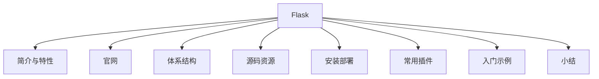

# Flask Web 框架基础

### 概述

在**模块三：典型案例篇**，我介绍了 PyEcharts 图表设计的典型案例，带你了解了 PyEcharts 常用图表的设计和使用方法。在讲解过程中，各个案例输出的都是一个单独的图表页面，并没有组成一个完整的报表体系。接下来我要介绍的内容，是课程的**模块四：数据发布篇**。

**数据发布篇是以模块三的典型案例为基础，整合 6 大案例的输出结果，最终生成一个完整的数据报表系统**。数据发布篇的内容包括：Python Flask Web 框架基础、PyEcharts 与 Flask 框架集成、PyEcharts 与 Flask 集成案例三部分内容。本节是模块四的第一个课时：Python Flask Web 框架基础。完整的知识结构图如下：


*图 1：知识结构图*

### Flask 简介

**Flask 是一个用 Python 语言开发的、轻量级的、可扩展的 Web 应用程序框架**，它基于 Werkzeug WSGI 工具包和 Jinja2 模板引擎进行封装和拓展。Werkzeug WSGI 提供了路由处理、请求和响应封装，Jinja2 则提供模板文件处理。

Flask 是 Python 语言三大主流开发框架之一，另外两个分别为 Django 和 Pyramid。

### Flask 主要特性

Flask 具有**轻量级**和**模块化设计**的特点，因此只需要几个扩展，就可以轻松地将其转换为需要的 Web 框架。Flask 的设计使用简单且易于拓展，其初衷就是为各种复杂的 Web 应用程序构建坚实的基础，让开发者可以自由地插入任何扩展，也可以自由地构建自己的模块。其主要特性包括 4 个方面：

- **轻量级的体系结构**：核心功能框架提供路由请求处理、请求和响应封装和模板引擎。

- **基于插件的拓展体系**：核心功能之外，一切皆插件。Flask 还具有丰富的插件资源，如 ORM、表单、权限等。

- **完善的用户文档体系**：从安装部署、项目创建、路由设置到视图设计，Flask 提供了完善的用户文档教程，使用者可以非常轻松地获取相关的资料，并且实现快速入门。

- **技术社区活跃**：作为一个开源项目，其技术社区的活跃程度，一方面代表该项目的受欢迎程度，另一方面则代表该项目的生存状态。Flask 的技术社区具有非常高的社区活跃度，表明了该项目欣欣向荣。

### Flask 官方网站

[Flask 官方网站](https://dormousehole.readthedocs.io/en/latest/)提供了丰富的学习资源，包括：文档、教程和案例。官方网站的内容结构如下所示：


*图 2：Flask 官方网站*

Flask 官方网站提供了完备的用户学习手册，包括安装部署、基础概念、快速入门、模板文件等。通过 Flask 的官方文档，你可以很快掌握 Flask 的使用，这也是 Flask 被广泛应用的原因之一。Flask 官方用户学习手册的网址为：[https://flask.palletsprojects.com/](https://flask.palletsprojects.com/)，页面截图如下：


*图 3：Flask 用户教程*

Flask 中文社区的力量同样非常强大，他们完成了 Flask 英文教程的翻译工作，并将其共享。我们同样可以找到对应的[Flask 的中文操作教程](https://dormousehole.readthedocs.io/en/latest/)。页面截图如下图所示：


*图 4：Flask 中文教程*

### Flask 体系结构

学习 Flask 的体系结构，首先需要了解 Flask 的工作流程，Flask 的工作流程如下所示：


*图 5：Flask 工作流程*

我们可以看到：客户端（通常为浏览器）发送 HTTP 请求，web 服务器在一个网络地址的指定端口上等待接收；一旦收到，会将请求通过 WSGI 交给 application 应用处理，application 应用就是 Flask 框架编写的应用；应用服务器对消息处理后，再通过 WSGI 返回 HTTP 响应给 Web 服务器，由服务器发送给客户端。

通过上述过程，我们可以发现 Flask 核心部分的体系结构，具体的内容如下所示：


*图 6：Flask 体系结构*

**路由处理模块负责客户端请求的分发**；**请求处理负责客户端 HTTP 请求的接收和自定义业务逻辑的调度**；**自定义业务逻辑是基于 Flask 框架，用户自定义的业务处理程序**；**模板引擎是执行页面渲染时用到的基本框架**；**拓展插件用于拓展基本 Flask 框架的处理能力**，如数据库访问插件 Flask-SQLAlchemy，它是对数据库访问操作的抽象，让开发者不用直接和 SQL 语句打交道；通过 Python 对象操作数据库，在舍弃一些性能开销的同时，换来的是开发效率的较大提升，和多源异构数据源的支持。

### Flask 源码资源

Flask 是一个开源项目，其源码资源托管在 GitHub，源码地址：[https://github.com/pallets/flask/](https://github.com/pallets/flask/) 。Flask 源码结构如下所示：


*图 7：Flask 源码资源*

上图中，src/flask 目录是 Flask 框架源码程序，examples 目录是示例程序，docs 目录是文档文件，test 目录是测试用例。

### Flask 安装部署

**Flask 是一个标准的 Python 程序**，其安装部署非常简单。通常它支持两种安装方式：**pip 资源库安装**和**源码安装**。pip 资源库的安装方式，可以直接通过指令 `pip install -U flask` 完成安装。安装完成以后可以通过：`pip show flask`，查看安装结果。命令执行结果如下所示：


*图 8：Flask 安装验证*

通过上述指令的执行输出结果，我们可以看到 Flask 已经安装完成，当前版本 v0.12.4（示例截图为早期版本；截至 2026-09，Flask 最新版本为 3.1.x），图中可以看到它的源码地址、作者信息、开源协议和组件需求。

基于源码的安装方式也非常简单，我们只需要从 GitHub 下载源码到本地目录，解压缩以后，进入根目录，执行安装指令：`python setup.py install`（现代环境更推荐直接使用 `pip install .`）。安装完成后，可以通过同样的方法查看是否安装成功。

### Flask 常用插件

Flask 的主要特点之一就是插件拓展机制，我们可以通过 Flask 的安装资源库，查找可用的 Flask 插件资源，查询地址为：[https://pypi.org/search/?c=Framework+%3A%3A+Flask](https://pypi.org/search/?c=Framework+%3A%3A+Flask)。查询页面如下：


*图 9：Flask 插件资源*

Flask 插件资源库具有丰富的插件资源，当前可用该插件资源数 800+，足以证明其活跃度和用户使用规模。实践中 Flask 常用的插件资源和功能，我整理了一个清单：


上述插件可以直接使用到我们的项目开发中，通过插件集成，可以快速地构建一个完整的 Web 应用程序，从而避免重复的造轮子的工作。

### Flask 入门示例

#### 概述

了解了 Flask 的常用插件，我们接下来通过一个案例的方式，学习一下 Flask 的使用方法。

Flask 应用程序的开发，通常包括 6 个步骤：**导入模块**、**声明对象**、**路由设置**、**业务逻辑处理**、**数据逻辑处理**和**服务启动**。具体的流程如下图所示：


*图 10：Flask 程序设计流程*

上图中，**导入模块环节**负责导入 Flask 应用程序需要类和函数；**对象声明环节**声明一个 Flask Application 应用对象；**路由设置环节**定义一个服务接口，接受来自客户端的数据请求；**业务逻辑处理环节**定义服务于客户端请求的业务逻辑处理，包括数据访问、加工处理和图表页面渲染等；**数据逻辑处理环节**定义数据库访问操作；**服务启动环节**启动定义好的 Flask Application 应用程序。

了解了 Flask 程序设计的流程，接下来我们看一个最小规格的 Flask 示例程序，通过这样的一个示例程序，我们了解一下 Flask 应用程序的基本结构。一个典型的 Flask 应用程序源码如下所示：

```python
# 01.导入文件
from flask import Flask
# 02.创建对象
app = Flask(__name__)

# 03.路由设置
@app.route('/')
# 04.业务逻辑
def hello():
    return '欢迎来到：Python Flask Web 框架基础理论'

# 05. 服务启动
if __name__ == '__main__':
    app.run()
```

上述示例程序导入了 Flask 模块，声明了一个 Flask 应用程序对象，通过调用 Flask 构造函数进行初始化，使用当前模块（__name__）的名称作为参数。

通过调用 route()函数设置路由。

Flask 类的 route()函数是一个装饰器，它告诉应用程序哪个 URL 应该调用那个相关的函数。本例中实现的是路由“/”和函数 hello()的绑定。

通过调用 Flask 的 run()方法，在本地服务器启动一个 Flask 应用程序。Flask 应用服务器启动以后，我们在浏览器中输入地址：http://127.0.0.1:5000/ 后，返回一个字符串：“欢迎来到：Python Flask Web 框架基础理论”。程序运行后的截图如下所示：


*图 11：Flask 示例程序*

了解了一个最基本的 Flask 应用程序的结构之后，我们就可以基于实际业务需要，进行应用服务器功能的扩展了。接下来，我们来重点看一下 Flask 模板使用。

#### Flask 模板

在前面的示例程序中，**客户端请求业务响应函数，其主要作用是生成客户端请求的响应，返回一个字符串，这是最简单使用场景**。

**实际上，业务响应函数有两个作用**：**业务逻辑处理和响应内容生成**。工程实践时，在大型 Web 应用中，把业务逻辑、表现内容放在一起，会增加代码的复杂度和维护成本，因此通常采用 MVC 的架构模式，其中 M 代表模型，负责数据逻辑处理；V 代表视图，负责表现内容的处理；C 代表控制，负责业务逻辑的处理。

**模板是用来衔接视图表现和控制逻辑的一种实现方式**。它是一个包含响应文本的文件，包括静态内容和动态内容两部分，动态内容以变量的方式存在，它负责告诉模板引擎其具体的值，这个值需要从数据中动态地获取。

模板实现了静态内容和动态内容的结合。设计完模板以后，使用真实值替换变量，再返回最终得到的字符串内容的过程，就是页面渲染的过程。

**我们可以通过使用模板，实现展示逻辑和控制逻辑的解耦**。

Flask 模板的使用包括 3 个步骤：**模板设计**、**业务逻辑设计**和**模板渲染**。一个典型的模板设计案例如下所示：

```html
<!DOCTYPE html>
<html lang="en">
<head>
    <meta charset="UTF-8">
    <title>Flask 模板演示示例</title>
</head>
<body>
  Flask 模板 HTML 内容：
  <br />{{ my_str }}
  <br />{{ my_int }}
</body>
</html>
```

上述模板就是一个普通 HTML 文件，通过{{}}嵌入变量内容，渲染时变量内容会被替换成实际值。与之对应，我们需要一个业务逻辑程序，其代码如下所示：

```python
from flask import Flask, render_template
app = Flask(__name__)
@app.route('/')
def index():
    # 变量
    my_str = '我是字符串变量'
    my_int = 8888
    return render_template('hello.html',
                           my_str=my_str,
                           my_int=my_int
                           )
if __name__ == '__main__':
    app.run(debug=True)
```

上述程序为 index()函数，即业务逻辑处理函数。该函数中声明了一个字符串变量和一个整数变量，并通过函数 render_template()进行了模板渲染。

以上程序执行以后的输出结果如下所示：


*图 12：Flask 模板运行演示*

### 小结

本小节，我介绍了 Flask Web 框架的主要特性、官方网站、源码资源、体系结构、安装部署和常用插件，并通过一个示例程序演示了 Flask 的基本应用。

---

---




## 版本差异（数据科学栈 → 当前版本）

| 库 | 本文编写时 | 当前稳定版 | 升级要点 |
|----|-----------|-----------|---------|
| Python | 3.8-3.12 | 3.14 | 3.12+ 起性能显著提升；3.14 PEP 649/750 |
| NumPy | 1.x/2.0 | 2.5.x | `np.float_` 等别名移除；NEP 50 类型提升 |
| Pandas | 1.x/2.x | 2.3.x | CoW 可经选项开启（3.0 起将默认）；`inplace` 将移除；`str` dtype 将为默认 |
| Matplotlib | 3.x | 3.x 稳定版 | API 兼容，样式更新 |
| Seaborn | 0.12/0.13 | 0.13.x | API 稳定 |
| scikit-learn | 1.x | 1.9.x | API 稳定，新算法持续加入 |

> 本文讲解的数据分析流程（读取→清洗→分析→可视化）与核心 API 在最新版本中成立；升级时重点关注 Pandas 3.0 的 Copy-on-Write 与 NumPy 2.x 的类型变化。
