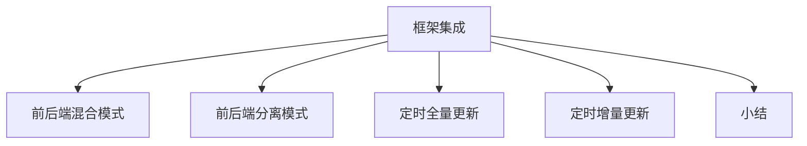

# PyEchart & Flask 框架集成

### 概述

上一节，我介绍了“**模块四：数据发布篇**”的第一课，Python Flask Web 框架基础理论，带你了解了 Flask 框架的主要特性、源码资源、安装部署和基本使用方法。

接下来，我会介绍该部分的第二节，**PyEcharts & Flask 框架集成**，包括 PyEcharts 与 Flask 框架整合的两种方法和数据刷新机制。完整的知识结构如下图所示：


*图 1：章节知识结构图*

PyEcharts 与 Flask 整合的方式有两种：前后端混合模式和前后端分离模式。

**前后端混合模式**是指前端页面设计和后台服务响应设计糅合在一起，页面内容的渲染由后台程序控制；**前后端分离模式**是指前端页面设计和后台服务响应设计解耦，各自独立开发，互不干扰，最后通过接口调用的方式，进行数据交互。

PyEcharts 和 Flask 整合后，发布的 Web 应用涉及数据刷新机制的问题，目前支持的方式包括两种：定时全量刷新和定时增量刷新。

**定时全量刷新**是指 PyEcharts 图表数据，执行定时全量的重新读取和图表内容的重新渲染；**定时增量刷新**是指 PyEcharts 图表数据，执行定时指定数据项的重新读取和图表项的重新渲染。

我会在下面对这 4 个内容一一介绍。

### 前后端混合模式

#### 操作流程

PyEcharts 与 Flask 框架整合的前后端混合模式，其操作流程如下图所示：


*图 2：前后端混合模式操作流程*

**创建项目环节**会创建一个空白的 Flask 项目，**复制模板环节**会复制 PyEcharts 模板文件到 Flask 项目模板文件目录 templates，**渲染图表环节**通过后台程序，基于 PyEcharts 模板文件，渲染可视化图表。

我们依次来看。

#### 创建项目

**创建项目的方式同普通 Flask 项目的创建一样，我们只需要创建一个空白的文件夹即可**。**考虑到模板的默认访问目录，我们需要在空白文件夹下，创建一个 templates 文件夹，用来存放 PyEcharts 模板文件**。创建项目完成之后的文件结构如下图所示：


*图 3：创建空白项目*

#### 复制模板

**复制模板指复制 PyEcharts 模板文件到新创建的 Flask 空白项目模板文件夹中**。具体的操作方式分为 2 个步骤：

- 找到 PyEcharts 模板文件；

- 复制 PyEcharts 模板文件到 Flask 空白项目的 templates 文件夹。

查找 PyEcharts 模板文件的路径，可以通过 pip show pyecharts 指令，查询其安装位置。具体的操作指令执行界面如下图所示：


*图 4：PyEcharts 安装目录查询*

通过上述指令我们可以看到 PyEcharts 的安装目录位于：d:\program files\python36\lib\site-packages，我们可以通过文件管理器打开该目录。对应的模板文件如下图所示：


*图 5：PyEcharts 模板文件*

复制上述文件到新创建的 Flask 项目模板文件夹下，默认文件夹名称为 templates。复制后的目录结构如下图所示：


*图 6：项目模板文件*

#### 渲染图表

**前后端混合模式的图表渲染，是 Flask 应用创建过程和 PyEcharts 图表创建过程的整合**。一个简单的示例程序如下：


*图 7：渲染图表*

上图中，首先创建了一个 Flask 应用对象，设定了默认模板目录为 templates，然后定义了一个图表生成函数，接下来通过业务响应函数 index，调用图表生成函数 bar_base()，最后通过 Flask 函数 Markup()进行图表渲染。

#### 路由设置

PyEcharts 与 Flask 整合之后的路由设置方式，完全采用的是 Flask 的路由设置方式，没有任何区别。相关内容参见“**13 | Flask Web 框架基础**”。

#### 运行演示

PyEcharts 与 Flask 整合之后，可以通过启动 Flask 应用程序的方式直接启动服务，然后通过浏览器进行访问。上述示例程序运行效果如下图所示：


*图 8：PyEcharts 与 Flask 整合案例运行演示*

通过上述内容，我们可以看到 PyEcharts 与 Flask 框架整合，影响到只是业务响应环节，在这一部分，进行 PyEcharts 图表生成，并调用 Flask 模板渲染函数进行页面渲染，其他部分相比标准的 Flask 应用程序，没有任何区别。

### 前后端分离模式

#### 操作流程

PyEcharts 与 Flask 框架整合的前后端分离模式，其操作流程如下图所示：


*图 9：前后端分离模式*

**创建项目环节**会创建一个空白的 Flask 项目，**复制模板环节**会复制 PyEcharts 模板文件到 Flask 项目模板文件目录 templates，**前端页面设计环节**设计需要展示的页面布局，**图表渲染环节**配置 PyEcharts 图表参数，**路由设计环节**设计客户端请求路由。

创建路由和复制模板环节的操作方式与前后端混合模式完全一样，我就不再赘述，接下来的介绍会从前端页面设计开始。

#### 前端页面设计

**前端页面设计导入 Echarts 图表库文件，声明图表对象占位符，绑定页面元素，访问远程接口，完成图表对象的参数设置和渲染**。

```html
<!DOCTYPE html>
<html>
<head>
    <meta charset="UTF-8">
    <title>Awesome-pyecharts</title>
    <script src="https://cdn.jsdelivr.net/npm/jquery@3.0.0/dist/jquery.min.js"></script>
    <script type="text/javascript" src="https://assets.pyecharts.org/assets/echarts.min.js"></script>
</head>
<body>
    <div id="bar" style="width:1000px; height:600px;"></div>
    <script>
        $(
            function () {
                var chart = echarts.init(document.getElementById('bar'), 'white', {renderer: 'canvas'});
                $.ajax({
                    type: "GET",
                    url: "http://127.0.0.1:5000/barChart",
                    dataType: 'json',
                    success: function (result) {
                        chart.setOption(result);
                    }
                });
            }
        )
    </script>
</body>
</html>
```

#### 服务接口设计

**服务接口设计是针对前端页面的数据请求设计，该接口请求的数据为 Echarts 的图表配置参数**。

```python
from random import randrange

from flask import Flask
from pyecharts import options as opts
from pyecharts.charts import Bar

app = Flask(__name__)


def bar_base() -> Bar:
    c = (
        Bar()
        .add_xaxis(["衬衫", "羊毛衫", "雪纺衫", "裤子", "高跟鞋", "袜子"])
        .add_yaxis("商家 A", [randrange(0, 100) for _ in range(6)])
        .add_yaxis("商家 B", [randrange(0, 100) for _ in range(6)])
        .set_global_opts(title_opts=opts.TitleOpts(title="Bar-基本示例", subtitle="Flask 整合：前后端分离模式"))
    )
    return c

# 图表参数服务接口
@app.route("/barChart")
def get_bar_chart():
    c = bar_base()
    return c.dump_options_with_quotes()
```

当浏览器页面打开地址：http://127.0.0.1:5000/ 时，页面脚本会主动调用服务器端接口: http://127.0.0.1:5000/barChart，获取图表组件配置参数，并进行页面渲染。

#### 路由设计

PyEcharts 与 Flask 整合：前后端分离模式，路由设置包括两部分：

- 页面路由请求；

- 数据路由请求。

页面路由请求完成页面内容的渲染，数据路由请求完成图表参数的传递。上述示例程序，完整的路由设置如下所示：

```python
# 数据服务接口：图表
@app.route("/barChart")
def get_bar_chart():
    c = bar_base()
    return c.dump_options_with_quotes()

# 首页渲染
@app.route("/")
def index():
    return render_template("index.html")
```

页面路由设置了页面根目录的访问方式，同时绑定了业务响应函数：index()，该函数以模板页面为参数，执行了页面渲染。数据路由设置了图表数据请求的响应接口，并绑定了业务响应函数 get_bar_chart()。

#### 运行演示

PyEcharts 与 Flask 整合之后，无论是前后端混合模式还是前后端分离模式，都可以通过启动 Flask 应用程序的方式直接启动服务，然后通过浏览器进行访问。程序运行效果如下图所示：


*图 10：前后端分离模式运行演示*

PyEcharts 与 Flask 整合的前后端分离模式，首先是前端页面和后台服务程序之间的解耦，彼此之间约定好数据服务接口，即可执行前后端的各自独立开发。

**前后端分离的开发模式，是目前主流的开发模式，可以实现并行开发，从而加快项目的开发进展**。

实际业务需求中，我们经常需要定时刷新页面数据，尤其是在一些实时监控业务场景下，定时刷新数据成为一个常规需求。

接下来，我们来看 PyEcharts 和 Flask 整合后，如何实现页面数据的刷新。

### 定时全量更新

**定时全量更新是前端页面发起的，周期性更新整个图表内容的刷新方式，更新的内容包括整个图表的配置参数**。

**实现原理是在前端页面调用 HTML 定时器函数：setInterval()，重新发起图表配置参数的接口调用**。

定时全量更新模式下，后台应用程序不需要做出调整，只需要在前端页面增加基于定时器的调度函数。

```html
<!DOCTYPE html>
<html>
<head>
    <meta charset="UTF-8">
    <title>Awesome-pyecharts</title>
    <script src="https://cdn.jsdelivr.net/npm/jquery@3.0.0/dist/jquery.min.js"></script>
    <script type="text/javascript" src="https://assets.pyecharts.org/assets/echarts.min.js"></script>
</head>
<body>
    <div id="bar" style="width:1000px; height:600px;"></div>
    <script>
        var chart = echarts.init(document.getElementById('bar'), 'white', {renderer: 'canvas'});
        $(
            function () {
                fetchData(chart);
                setInterval(fetchData, 2000);
            }
        );
        function fetchData() {
            $.ajax({
                type: "GET",
                url: "http://127.0.0.1:5000/barChart",
                dataType: 'json',
                success: function (result) {
                    chart.setOption(result);
                }
            });
        }
    </script>
</body>
</html>
```

上述程序中，通过 HTML 函数 setInterval()，设置了一个定时器对象，每隔 2 秒钟，重新调用一次图表对象渲染函数 fetchData()，实现定时全量更新图表对象。

定时全量更新程序执行的效果，无法从一张图中直观体现出来，你可以自己运行程序后，看动态效果。我们通过相隔 5 秒钟的两张截图（图 11、图 12）来看：


*图 11：定时全量更新图一*


*图 12：定时全量更新图二*

通过以上示例程序，我们可以看到**定时全量更新图表是通过前端页面设置定时器函数，定时重新访问图表配置参数接口实现的**。

### 定时增量更新

**定时增量刷新是前端页面发起的、周期性更新整个图表内容的刷新方式，更新的内容只包括图表的数据部分**。

**实现的原理是在前端页面调用 HTML 定时器函数：setInterval()，重新发起图表配置数据项参数的接口调用**。

定时增量更新模式下，需要前台页面和后台应用程序同时做出调整。一方面需要前端页面增加基于定时器的调度函数，另外一方面需要后台应用程序设置单独的增量数据服务接口。一个定时增量更新完整的前端页面示例程序如下所示：

```html
<!DOCTYPE html>
<html>
<head>
    <meta charset="UTF-8">
    <title>Awesome-pyecharts</title>
    <script src="https://cdn.jsdelivr.net/npm/jquery@3.0.0/dist/jquery.min.js"></script>
    <script type="text/javascript" src="https://assets.pyecharts.org/assets/echarts.min.js"></script>

</head>
<body>
    <div id="bar" style="width:1000px; height:600px;"></div>
    <script>
        var chart = echarts.init(document.getElementById('bar'), 'white', {renderer: 'canvas'});
        var old_data = [];
        $(
            function () {
                fetchData(chart);
                setInterval(getDynamicData, 2000);
            }
        );
        // 图表渲染：初始全量获取配置参数
        function fetchData() {
            $.ajax({
                type: "GET",
                url: "http://127.0.0.1:5000/lineChart",
                dataType: "json",
                success: function (result) {
                    chart.setOption(result);
                    old_data = chart.getOption().series[0].data;
                }
            });
        }
        // 增量数据：定时重置数据属性
        function getDynamicData() {
            $.ajax({
                type: "GET",
                url: "http://127.0.0.1:5000/lineDynamicData",
                dataType: "json",
                success: function (result) {
                    old_data.push([result.name, result.value]);
                    chart.setOption({
                        series: [{data: old_data}]
                    });
                }
            });
        }

    </script>
</body>
</html>
```

上述程序定义了一个 HTML 定时器，每隔 2 秒钟，刷新一次。刷新的过程是：重新设置 Echarts 图表对象的数据属性，其他属性如标题、工具栏、提示框等参数维持不变。

相应的，我们需要在后台应用程序中，增加 Echarts 图表配置项的数据属性查询的数据服务接口。与上述前端页面程序相对应的，后台应用服务器程序的完整的源码结构如下所示：

```python
# 定时增量数据更新示例
from random import randrange
from flask.json import jsonify
from flask import Flask, render_template
from pyecharts import options as opts
from pyecharts.charts import Line
# 01-创建一个 Flask 应用
app = Flask(__name__, static_folder="templates")

# 02-图表对象配置项参数设置
def line_base() -> Line:
    line = (
        Line()
        .add_xaxis(["{}".format(i) for i in range(10)])
        .add_yaxis(
            series_name="",
            y_axis=[randrange(50, 80) for _ in range(10)],
            is_smooth=True,
            label_opts=opts.LabelOpts(is_show=False),
        )
        .set_global_opts(
            title_opts=opts.TitleOpts(title="动态数据"),
            xaxis_opts=opts.AxisOpts(type_="value"),
            yaxis_opts=opts.AxisOpts(type_="value"),
        )
    )
    return line

# 页面-路由设置
@app.route("/")
def index():
    return render_template("index.html")

# 数据-图表配置属性参数：路由设置
@app.route("/lineChart")
def get_line_chart():
    c = line_base()
    return c.dump_options_with_quotes()

idx = 9

# 数据-图表数据属性配置项更新：路由设置
@app.route("/lineDynamicData")
def update_line_data():
    global idx
    idx = idx + 1
    return jsonify({"name": idx, "value": randrange(50, 80)})

# 主函数
if __name__ == "__main__":
    app.run()
```

上述程序中，共声明了 3 个服务接口：页面渲染服务接口、Echarts 图表参数配置查询接口和 Echarts 图表数据项配置参数更新接口，并且绑定了对应的业务响应函数。

定时增量更新案例程序执行以后的效果，我们同样需要在页面上才可以看到动态效果。在此，我只截取一个页面，呈现具体的动态执行的效果。你可以自行执行应用程序查看。定时增量更新程序运行以后的效果如下所示：


*图 13：定时增量更新程序运行执行演示*

### 小结

本小节，我带你了解了 PyEcharts 与 Flask Web 框架的两种整合方式和两种数据刷新机制，案例部分采用了 PyEcharts 的官方示例程序。下一节，我向你介绍 PyEcharts 和 Flask Web 框架整合的实战案例，结合**模块三**的 6 大案例，生成一个完整的可视化报表系统。

---

---




## 版本差异（数据科学栈 → 当前版本）

| 库 | 本文编写时 | 当前稳定版 | 升级要点 |
|----|-----------|-----------|---------|
| Python | 3.8-3.12 | 3.14 | 3.12+ 起性能显著提升；3.14 PEP 649/750 |
| NumPy | 1.x/2.0 | 2.5.x | `np.float_` 等别名移除；NEP 50 类型提升 |
| Pandas | 1.x/2.x | 2.3.x | CoW 可经选项开启（3.0 起将默认）；`inplace` 将移除；`str` dtype 将为默认 |
| Matplotlib | 3.x | 3.x 稳定版 | API 兼容，样式更新 |
| Seaborn | 0.12/0.13 | 0.13.x | API 稳定 |
| scikit-learn | 1.x | 1.9.x | API 稳定，新算法持续加入 |

> 本文讲解的数据分析流程（读取→清洗→分析→可视化）与核心 API 在最新版本中成立；升级时重点关注 Pandas 3.0 的 Copy-on-Write 与 NumPy 2.x 的类型变化。
