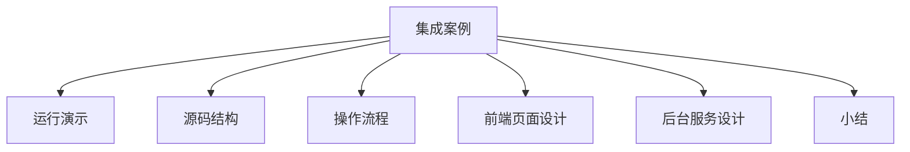

# PyEchart & Flask 集成案例

### 概述

上一节，我基于 PyEcharts 的官方案例，学习了 PyEcharts 与 Flask 整合的两种方法和数据刷新的两种实现机制。本节我会结合**模块三：典型案例篇**中的实际案例，带你了解如何基于 PyEcharts + Flask + Bootstrap，生成一个完整的数据可视化系统。本节内容的知识结构如下图所示：


*图 1：章节知识结构*

PyEcharts 与 Flask 框架整合实战案例的介绍，我将其分为两部分，前端页面设计和后台服务设计，其中又各有 4 项内容。

通过上一个小节，我们了解到 PyEcharts 与 Flask 的整合方法，有前端混合模式和前后端分离模式两种。本节内容，我会采用前后端分离模式，带你生成一个完整的数据可视化系统。

前端页面设计部分，我们需要解决的问题是主题模板选择、导航菜单设计、图表元素设计和图表事件设计；后台应用设计部分，我们需要完成的操作包括：服务接口设计、页面请求响应设计、数据请求响应设计和异常请求处理设计。

### 运行演示

PyEcharts 与 Flask 框架整合以后，结合**模块三**的实战案例，我们可以整合出一个完整的数据可视化系统。系统运行以后的效果如下图所示：


*图 2：客户地理位置分布图*


*图 3：历史数据变化趋势*


*图 4：订单商品构成模型*

上述截图分别呈现了实时指标监控、历史数据变化趋势、客户地理位置分布和订单商品构成。我们通过一个页面导航的方式，把它们组织在一起，形成了一个完整的数据可视化系统。接下来，我将带你学习如何实现这个数据可视化系统。

### 源码结构

数据可视化分析系统的开发过程，我会采用前后端分离的开发模式，融合**模块三**的 6 个实战案例。其完整的源码结构如下图所示：


*图 5：数据可视化系统源码结构*

如上图所示，整个数据可视化系统的源码位于 Flask 项目下，文件夹包括：apps、data、model、static 和 templates。其中 apps 是业务逻辑处理模块文件目录，data 是数据库操作脚本文件目录，model 是数据库查询模块文件目录，static 是资源文件目录，templates 是模板文件目录。

### 操作流程

数据可视化系统的开发流程包括**创建一个空白项目**，**复制 PyEcharts 模板文件到项目 templates 文件目录**，**前端页面设计**，**后台应用设计**和**前后端联调**五大步骤。

完成一个图表页面的开发之后，我们会重新回到前端页面设计环节，通过循环实现新的图表页面。数据可视化系统完整的开发流程，如下图所示：


*图 6：数据可视化系统开发流程*

我们可以看到，数据可视化系统开发的流程首先需要创建一个 Flask 项目，并且创建相应的文件目录结构。合理的源码组织，有助于我们管理源码、理解源码，Flask 项目的创建和模块四的第一小节：**13 | Flask Web 框架基础**保持一致。具体的创建过程，可以参考该节的内容。

创建完空白 Flask 项目之后，我们需要复制 PyEcharts 的模板文件到 Flask 项目的 templates 文件夹。具体的方法我在“**14 | PyEcharts & Flask 框架集成**”中已经做过详细的介绍。

完成 PyEcharts 模板复制之后，我们接下来需要做的操作是，前端页面的设计和后台应用的设计，设计方法参考“**14 课时**”的 PyEcharts 与 Flask 整合前后端分离模式的操作方法。

前端页面程序和后台应用程序设计完成以后，我们需要进行前后端的联合调试，一方面确保数据接口的联通，另外一方面验证功能和数据的正确性。

### 前端页面设计

#### 主题模板选择

**构建基于网页的 Web 类应用系统，如果有漂亮、美观的界面，主题分明的配色方案，清晰明了的内容组织，可以给观看者带来良好的用户体验**。

**为了实现这样的效果，我们需要引入主题模板**。主题模板定义了页面的组件元素、样式和配色。本案例中，为了实现比较美观的呈现效果，我选择 Bootstrap 的主题样式模板：Matrix Admin 开源免费版本。其官方网站和下载地址如下图所示：


*图 7：Bootstrap 主题样式文件*

Matrix Admin 分为开源版本和商业版本，开源版本的下载地址为：[http://matrixadmin.wrappixel.com/matrix-admin-package-full.zip](http://matrixadmin.wrappixel.com/matrix-admin-package-full.zip)。Matrix Admin 文件解压以后的目录结构如下图所示：


*图 8：Matrix Admin 文件目录结构*

上图中左侧是 Matrix Admin 的文件目录，共分为 3 个文件夹：assets、dist 和 html。其中 assets 是第三方资源依赖文件目录，dist 存储的是页面资源文件，html 存储的是示例程序。Matrix Admin 示例程序可以直接通过浏览器查看，运行效果如下：


*图 9：Matrix Admin 运行演示*

上述示例程序展现了该主题模板支持的页面元素、配色方案和主题样式。我们可以通过复用其页面元素、配色方案和主题样式，结合 PyEcharts 图表设置，设计我们自己的数据可视化系统。

#### 页面导航设计

**页面导航用于在各个业务模块之间进行内容切换，是多页面内容组织的一种有效方式。页面导航栏的使用，可以有效地将页面内容按照类型分组**。

数据可视化系统中，按照图表类型组织内容，除实时监控数据指标卡外，一个图表类型对应一个业务场景。设计完成之后的页面导航栏，如下图所示：


*图 10：数据可视化页面导航栏*

页面导航栏用到了 Matrix Admin 主题模板中的页面元素组件。实现上述页面导航栏的源码如下所示：


*图 11：导航栏页面实现源码*

上述代码，声明了一个页面导航栏，共包括 6 个导航菜单项，每一个导航菜单项有相应的主题样式、超级链接地址、菜单标题和折叠状态。

#### 图表元素设计

完成导航栏菜单的设计之后，我们接下来看具体的图表页面的设计。**图表页面的设计包括页面元素设计和图表事件设计**，我们先来看一下图表元素设计。以历史数据变化趋势图为例，图表元素设计的实现代码如下所示：

```html
<!-- 图表可视化组件 -->
<!--================================================== -->
<div class="row"  >
    <div class="col-md-12">
        <div class="card">
            <div class="card-body">
                <div class="row">
                    <!-- column -->
                    <div class="col-lg-12">
                        <div class="flot-chart" >
                            <div class="flot-chart-content" style="text-align:center;" id="map"></div>
                        </div>
                    </div>
                    <!-- column -->
                </div>
            </div>
        </div>
    </div>
</div>
```

上述代码，声明了一个带有 ID 的占位符 div 元素，该元素通过图表事件，实现了与 PyEcharts 图表对象的绑定。

#### 图表事件设计

**定义完图表元素之后，我们接下来需要设计的是页面图表响应事件**。通过图表响应事件，我们实现了页面图表元素和 PyEcharts 图表对象之间的绑定，并且为图表对象的参数获取设置了远程访问接口。历史数据变化趋势图的图表事件设计源码如下所示：

```html
<!-- 历史数据变化趋势图 -->
<script>
    $(
        function () {
            var chart = echarts.init(document.getElementById('map'), 'white', {renderer: 'canvas'});
            $.ajax({
                type: "GET",
                url: "http://127.0.0.1:5000/histChart",
                dataType: 'json',
                success: function (result) {
                    chart.setOption(result);
                }
            });
        }
    )
</script>
```

图表事件源码实现了图表对象和页面指定 ID 元素的绑定，并且通过 ajax 技术，调用服务器端接口程序：http://127.0.0.1:5000/histChart，实现了与服务器端程序的图表配置参数数据交互。

### 后台服务设计

#### 服务接口设计

**服务接口设计包括页面请求接口和数据请求接口，页面请求接口是浏览器对应的该页面的访问地址，数据请求接口对应的是图表对象的数据请求地址**。如下图所示：


*图 12：服务接口类型*

#### 页面请求接口设计

历史数据变化趋势图的页面请求接口定义如下：

```python
# 01. 页面数据请求服务
@app.route("/")
def index():
    cur = rt_index_base()
    # return render_template("dashboard.html", curnumber=cur)
    return render_template("index3.html", curnumber=cur)
```

上述程序设置页面请求路由的同时，定义了该页面请求的业务响应逻辑，通过调用实时数据监控指标查询函数，获取实时数据监控指标，并以参数的形式传递给页面渲染函数，从而进行页面渲染。

#### 数据请求接口设计

数据请求接口设计，同样以历史数据变化趋势图为例，其数据请求接口设计源码如下所示：

```python
# 02. 图表数据查询
@app.route("/histChart")
def get_hist_order_chart():
    c = hist_order_base()
    return c.dump_options_with_quotes()
```

上述程序定义了一个图表数据查询接口，包括请求响应地址和业务响应逻辑两部分内容。请求响应地址与前端页面设计部分的图表事件设计相对应，具体的数据查询函数名称为 hist_order_base()，返回的内容为图表对象的配置参数，包括数据部分和非数据部分。其函数实现如下所示：

```python
# 01. 订单量历史数据变化趋势
def hist_order_base():
    dataX, dataY  = order_sum_query()
    # 订单数据
    c = (
        Line(init_opts=opts.InitOpts(theme=ThemeType.LIGHT))
        .add_xaxis(dataX)
        .add_yaxis("订单量", dataY, is_smooth=True)
        .set_global_opts(
            title_opts=opts.TitleOpts(title="日订单量历史数据趋势图"),
            yaxis_opts=opts.AxisOpts(
                type_="value",
                axistick_opts=opts.AxisTickOpts(is_show=True),
                splitline_opts=opts.SplitLineOpts(is_show=True),
            ),
            xaxis_opts=opts.AxisOpts(type_="category", boundary_gap=False),
        )
    )
    return c
```

上述程序实现了图表对象的参数设置，并且调用数据库查询函数，获取了订单历史数据，其实现函数为 order_sum_query()。该函数从数据库中读取数据内容，并返回给调用函数。该函数的代码实现如下所示：

```python
# 订单量查询
def order_sum_query():
    # 连接到数据库
    connection = pymysql.connect(host='localhost',
                                 port=3306,
                                 user='root',
                                 password='密码',
                                 db='sakila',
                                 charset='utf8',
                                 cursorclass=pymysql.cursors.DictCursor)
    try:
        with connection.cursor() as cursor:
            # SQL 查询语句：按日期升序返回全部历史数据
            sql = "SELECT * FROM dm_rental_day ORDER BY 日期 ASC"
            try:
                # 执行SQL语句，返回影响的行数
                row_count = cursor.execute(sql)
                # 获取所有记录列表
                results = cursor.fetchall()
                dataX = []
                dataY = []
                for row in results:
                    # 此处不可以用索引访问：row[0]
                    dataX.append(row["日期"])
                    dataY.append(row["订单量"])
                return dataX, dataY
            except:
                print("错误：数据查询操作失败")
    finally:
        connection.close()
```

#### 异常处理接口设计

一个线上系统，在某些特定的情况下，会出现一些异常，比如网页不存在、网络不可用等特殊情况。默认浏览器提供的异常页面并不友好，原因是无法准确地反馈给用户具体的错误原因。因此，针对常见错误和异常，我们需要自己设计异常提示程序。

Flask 提供了常见异常捕获的函数和方法，通过调用该函数，可以自定义指定错误码的响应程序。具体的调用方式如下所示：

```python
# 403 错误
@app.errorhandler(403)
def miss(e):
    return render_template('error-403.html'), 403

# 404 错误
@app.errorhandler(404)
def page_not_found(e):
    return render_template('error-404.html'), 404

# 500 错误
@app.errorhandler(500)
def error(e):
    return render_template('error-500.html'), 500
```

上述程序中，我们通过在函数声明前添加装饰器的调用，实现了对于异常错误码的捕获，并且绑定了相应的异常处理函数。当对应错误码的网络访问异常发生时，会调用对应的异常处理函数，渲染对应的异常提示页面。一个自定义的异常提示页面如下图所示：


*图 13：自定义异常处理*

### 小结

本小节，我结合了前面全部的内容，并整合了相关案例，基于 Python + Flask + PyEcharts + Bootstrap 生成了一个完整的数据可视化系统。因为大部分内容我都介绍过，因此我把重点放在了如何串联各个知识点上。

我通过一个实例：历史数据变化趋势图页面设计，讲解了一个完整的数据可视化系统的设计流程，你可以通过这个范例，举一反三，生成其他内容。完整的项目源码，我放到了开源的代码托管平台 Github 上，具体地址：[https://github.com/zhangziliang04/datastudio](https://github.com/zhangziliang04/datastudio)，你可以自行下载学习。

---

---




## 版本差异（数据科学栈 → 当前版本）

| 库 | 本文编写时 | 当前稳定版 | 升级要点 |
|----|-----------|-----------|---------|
| Python | 3.8-3.12 | 3.14 | 3.12+ 起性能显著提升；3.14 PEP 649/750 |
| NumPy | 1.x/2.0 | 2.5.x | `np.float_` 等别名移除；NEP 50 类型提升 |
| Pandas | 1.x/2.x | 2.3.x | CoW 可经选项开启（3.0 起将默认）；`inplace` 将移除；`str` dtype 将为默认 |
| Matplotlib | 3.x | 3.x 稳定版 | API 兼容，样式更新 |
| Seaborn | 0.12/0.13 | 0.13.x | API 稳定 |
| scikit-learn | 1.x | 1.9.x | API 稳定，新算法持续加入 |

> 本文讲解的数据分析流程（读取→清洗→分析→可视化）与核心 API 在最新版本中成立；升级时重点关注 Pandas 3.0 的 Copy-on-Write 与 NumPy 2.x 的类型变化。
