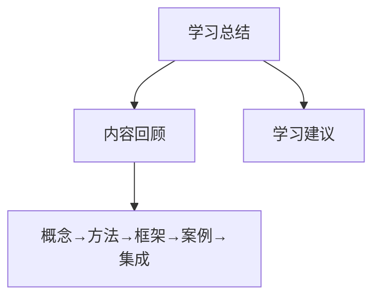

# 数据可视化分析学习经验总结和心得体会

### 内容回顾

本系列内容分为四个部分。

- **基础理论篇**：阐述概念定义、工作方法和关键技术，这一部分**重在筑基、拓展视野和格局**。

- **环境部署篇**：讲解需要使用的技术框架、开发环境的安装部署和快速入门，这一部分**重在准备**，是案例部分的先导。

- **典型案例篇**：贯穿数据可视化分析流程，共分为 6 个案例，也是 6 个业务场景，这一部分**重在练习、掌握流程和方法**。

- **数据发布篇**：整合全部知识点，带你搭建一个入门级的数据可视化系统，这一部分**重在体验和串联全部知识点**，将前面学到知识融为一体。

### 学习建议

关于学习方法，给大家 3 个建议：聚焦、动手、迁移。

**聚焦**：在一个点上持续投入时间和精力，集中发力，做到单点突破，然后再进行知识的横向拓展。

**动手**：你应该听过“能动手就别吵吵”这句话，用在 IT 类知识的学习上非常适合。亲自动手，跑通程序，跑通数据可视化分析的操作过程，你将得到不一样的体验。

**迁移**：学习的过程，其实你修的是别人的法，悟的是别人的道，能否真正为我所用，变成自己的能力，还需要一个步骤：**知识迁移**。知识迁移其实就是把学到的内容应用到自己的实际工作中，你要学的是思路和方法，要学会灵活运用，而不是把知识学死了。

---

---

## 版本差异（数据科学栈 → 当前版本）

| 库 | 本文编写时 | 当前稳定版 | 升级要点 |
|----|-----------|-----------|---------|
| Python | 3.8-3.12 | 3.14 | 3.12+ 起性能显著提升；3.14 PEP 649/750 |
| NumPy | 1.x/2.0 | 2.5.x | `np.float_` 等别名移除；NEP 50 类型提升 |
| Pandas | 1.x/2.x | 2.3.x | CoW 可经选项开启（3.0 起将默认）；`inplace` 将移除；`str` dtype 将为默认 |
| Matplotlib | 3.x | 3.x 稳定版 | API 兼容，样式更新 |
| Seaborn | 0.12/0.13 | 0.13.x | API 稳定 |
| scikit-learn | 1.x | 1.9.x | API 稳定，新算法持续加入 |

> 本文讲解的数据分析流程（读取→清洗→分析→可视化）与核心 API 在最新版本中成立；升级时重点关注 Pandas 3.0 的 Copy-on-Write 与 NumPy 2.x 的类型变化。
