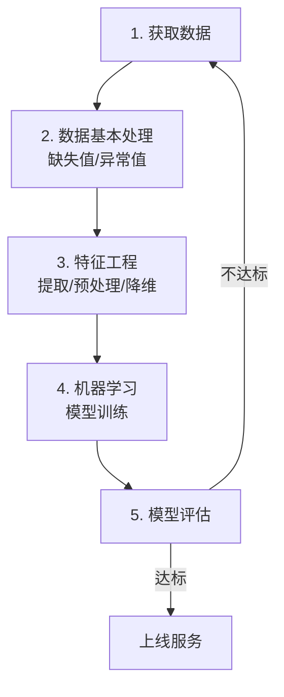

# 机器学习工作流程

## 学习目标

- 了解机器学习的定义
- 知道机器学习的工作流程
- 掌握获取到的数据集的特性

## 1 什么是机器学习

机器学习是从**数据**中**自动分析获得模型**，并利用**模型**对未知数据进行预测。

## 2 机器学习工作流程

- 机器学习工作流程总结

  - **1. 获取数据**
  - **2. 数据基本处理**
  - **3. 特征工程**
  - **4. 机器学习（模型训练）**
  - 5. 模型评估
    - 结果达到要求，上线服务
    - 没有达到要求，重新上面步骤

### 2.1 获取到的数据集介绍

**数据简介**

- 在数据集中一般：
  - 一行数据我们称为一个**样本**
  - 一列数据我们称为一个**特征**
  - 有些数据有**目标值（标签值）**，有些数据没有目标值（例如电影类型就是一个数据集的目标值）

- **数据类型构成：**
  - 数据类型一：特征值 + 目标值（目标值是连续的和离散的）
  - 数据类型二：只有特征值，没有目标值

- **数据分割：**
  - 机器学习一般的数据集会划分为两个部分：
    - 训练数据：用于训练，**构建模型**
    - 测试数据：在模型检验时使用，用于**评估模型是否有效**
  - 划分比例：
    - 训练集：70% / 80% / 75%
    - 测试集：30% / 20% / 25%

### 2.2 数据基本处理

即对数据进行缺失值、去除异常值等处理。

### 2.3 特征工程

#### 2.3.1 什么是特征工程

特征工程（Feature Engineering）是使用**专业背景知识和技巧处理数据**，**使得特征能在机器学习算法上发挥更好的作用的过程**。

- 意义：会直接影响机器学习的效果

#### 2.3.2 为什么需要特征工程

> 机器学习领域的大神 Andrew Ng（吴恩达）老师说："Coming up with features is difficult, time-consuming, requires expert knowledge. 'Applied machine learning' is basically feature engineering."
>
> 注：业界广泛流传：数据和特征决定了机器学习的上限，而模型和算法只是逼近这个上限而已。

#### 2.3.3 特征工程包含内容

- 特征提取
- 特征预处理
- 特征降维

#### 2.3.4 特征工程类别介绍

- **特征提取**
  - 将任意数据（如文本或图像）转换为可用于机器学习的数字特征

- **特征预处理**
  - 通过**一些转换函数**将特征数据**转换成更加适合算法模型**的特征数据过程

- **特征降维**
  - 指在某些限定条件下，**降低随机变量（特征）个数**，得到**一组"不相关"主变量**的过程

### 2.4 机器学习

**选择合适的算法对模型进行训练**（具体内容见算法分类章节）。

### 2.5 模型评估

**对训练好的模型进行评估**（具体内容见模型评估章节）。

## 机器学习流程总览

数据集构成：
- 样本 = 一行数据，特征 = 一列数据
- 数据类型：特征值 + 目标值 / 仅特征值
- 划分：训练集 70%–80%，测试集 20%–30%

## 3 小结

- 机器学习定义【掌握】
  - 机器学习是从**数据**中**自动分析获得模型**，并利用**模型**对未知数据进行预测

- 机器学习工作流程总结【掌握】
  - **1. 获取数据**
  - **2. 数据基本处理**
  - **3. 特征工程**
  - **4. 机器学习（模型训练）**
  - 5. 模型评估
    - 结果达到要求，上线服务
    - 没有达到要求，重新上面步骤

- 获取到的数据集介绍【掌握】
  - 数据集中一行数据一般称为一个样本，一列数据一般称为一个特征
  - 数据集的构成：由特征值 + 目标值（部分数据集没有）构成
  - 为了模型的训练和测试，把数据集分为：训练数据（70%-80%）和测试数据（20%-30%）

- 特征工程包含内容【了解】
  - 特征提取
  - 特征预处理
  - 特征降维

## 版本差异（机器学习栈 → 当前版本）

| 库 | 本文编写时 | 当前稳定版 |
|----|-----------|-----------|
| scikit-learn | 1.x | 1.9.x（截至 2026-09） |
| TensorFlow | 2.x | 2.16+（2.x 持续更新） |
| PyTorch | 2.x | 2.x 最新 |
| XGBoost | 1.x/2.x | 3.x |
| Python | 3.8-3.12 | 3.14 |

> 本文讲解的机器学习概念（算法分类、工作流、评估）与 scikit-learn 核心 API 保持稳定；新特性以官方文档为准。
