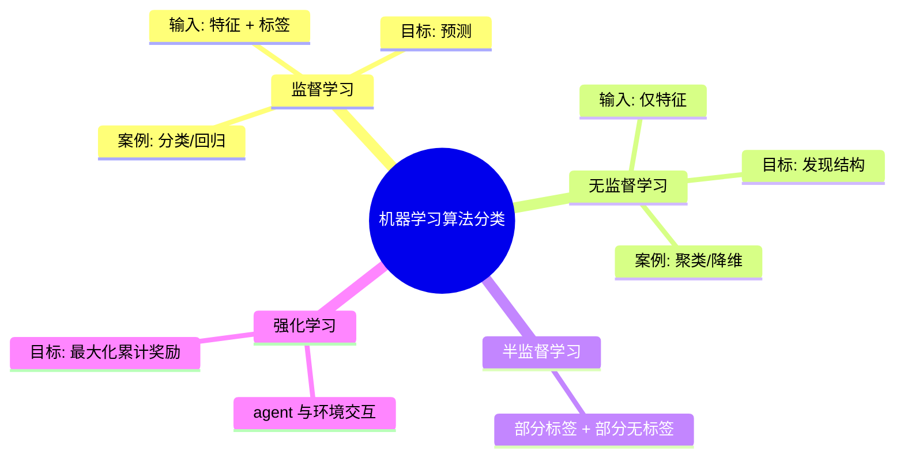

# 机器学习算法分类

## 学习目标

- 了解机器学习常用算法的分类

根据**数据集组成不同**，可以把机器学习算法分为：

- 监督学习
- 无监督学习
- 半监督学习
- 强化学习

## 1 监督学习

- 定义：
  - 输入数据是由输入特征值和目标值所组成。
    - 函数的输出可以是一个连续的值（称为回归）
    - 或是输出是有限个离散值（称作分类）

### 1.1 回归问题

例如：预测房价，根据样本集拟合出一条连续曲线。

### 1.2 分类问题

例如：根据肿瘤特征判断良性还是恶性，得到的结果是"良性"或者"恶性"，是离散的。

## 2 无监督学习

- 定义：
  - 输入数据是由输入特征值组成，没有目标值
    - 输入数据没有被标记，也没有确定的结果。样本数据类别未知
    - 需要根据样本间的相似性对样本集进行类别划分

举例：

有监督 vs 无监督算法对比：

## 3 半监督学习

- 定义：
  - 训练集同时包含有标记样本数据和未标记样本数据。

## 4 强化学习

- 定义：
  - 实质是决策（make decisions）问题，即自动进行决策，并且可以做连续决策。

举例：

小孩想要走路，但在这之前，他需要先站起来，站起来之后还要保持平衡，接下来还要先迈出一条腿，是左腿还是右腿，迈出一步后还要迈出下一步。

小孩就是 **agent**，他试图通过采取**行动**（即行走）来操纵**环境**（行走的表面），并且从**一个状态转变到另一个状态**（即他走的每一步），当他完成任务的子任务（即走了几步）时，孩子得到**奖励**（给巧克力吃），并且当他不能走路时，就不会给巧克力。

主要包含五个元素：agent, action, reward, environment, observation

强化学习的目标就是**获得最多的累计奖励**。

### 监督学习和强化学习的对比

|          | **监督学习**                                                 | **强化学习**                                                 |
| -------- | ------------------------------------------------------------ | ------------------------------------------------------------ |
| 反馈映射 | 输出的是输入与输出之间的关系，可以告诉算法什么样的输入对应着什么样的输出。 | 输出的是给机器的反馈 reward function，即用来判断这个行为是好是坏。 |
| 反馈时间 | 做了比较坏的选择会**立刻反馈给算法**。                       | 结果**反馈有延时**，有时候可能需要走了很多步以后才知道以前的某一步的选择是好还是坏。 |
| 输入特征 | 输入是**独立同分布**的。                                     | 面对的输入总是在变化，每当算法做出一个行为，它影响下一次决策的输入。 |

### 算法范式分类

## 5 小结

|                                               |         **In**         |  **Out**   |      **目的**      |       **案例**       |
| :-------------------------------------------- | :--------------------: | :--------: | :----------------: | :------------------: |
| **监督学习**（supervised learning）           |         有标签         |   有反馈   |      预测结果      |  猫狗分类 房价预测   |
| **无监督学习**（unsupervised learning）       |         无标签         |   无反馈   |    发现潜在结构    | "物以类聚，人以群分" |
| **半监督学习**（Semi-Supervised Learning）    | 部分有标签，部分无标签 |   有反馈   | 降低数据标记的难度 |                      |
| **强化学习**（reinforcement learning）        |   决策流程及激励系统   | 一系列行动 |   长期利益最大化   |        学下棋        |

## 版本差异（机器学习栈 → 当前版本）

| 库 | 本文编写时 | 当前稳定版 |
|----|-----------|-----------|
| scikit-learn | 1.x | 1.9.x（截至 2026-09） |
| TensorFlow | 2.x | 2.16+（2.x 持续更新） |
| PyTorch | 2.x | 2.x 最新 |
| XGBoost | 1.x/2.x | 3.x |
| Python | 3.8-3.12 | 3.14 |

> 本文讲解的机器学习概念（算法分类、工作流、评估）与 scikit-learn 核心 API 保持稳定；新特性以官方文档为准。
