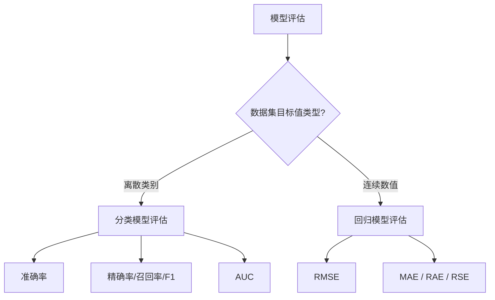

# 模型评估

## 学习目标

- 了解机器学习中模型评估的方法
- 知道过拟合、欠拟合发生情况

模型评估是模型开发过程不可或缺的一部分。它有助于发现表达数据的最佳模型和所选模型将来工作的性能如何。

按照**数据集的目标值不同**，可以把模型评估分为**分类模型评估和回归模型评估**。

### 评估类型划分

## 1 分类模型评估

- 准确率
  - 预测正确的数占样本总数的比例。
- 其他评价指标：精确率、召回率、F1-score、AUC 指标等

## 2 回归模型评估

**均方根误差（Root Mean Squared Error，RMSE）**

其他评价指标：

- 相对平方误差（Relative Squared Error，RSE）
- 平均绝对误差（Mean Absolute Error，MAE）
- 相对绝对误差（Relative Absolute Error，RAE）

## 3 拟合

模型评估用于评价训练好的模型的表现效果，其表现效果大致可以分为两类：过拟合、欠拟合。

在训练过程中，你可能会遇到如下问题：

**训练数据训练的很好啊，误差也不大，为什么在测试集上面有问题呢？**

当算法在某个数据集当中出现这种情况，可能就出现了拟合问题。

### 3.1 欠拟合

因为机器学习到的天鹅特征太少了，导致区分标准太粗糙，不能准确识别出天鹅。

**欠拟合（under-fitting）**：**模型学习的太过粗糙**，连**训练集中的样本数据特征关系都没有学出来**。

### 3.2 过拟合

机器已经基本能区别天鹅和其他动物了。然后，很不巧已有的天鹅图片全是白天鹅的，于是机器经过学习后，会认为天鹅的羽毛都是白的，以后看到羽毛是黑的天鹅就会认为那不是天鹅。

**过拟合（over-fitting）**：所建的机器学习模型或者是深度学习模型在训练样本中**表现得过于优越**，导致在**测试数据集中表现不佳**。

> 上述问题解答：训练数据训练的很好啊，误差也不大，为什么在测试集上面有问题呢？
> 答案：模型过拟合了训练数据，泛化能力不足。

## 4 小结

- 分类模型评估【了解】
  - 准确率
- 回归模型评估【了解】
  - RMSE — 均方根误差
- 拟合【知道】
  - 欠拟合
    - 学习到的东西太少
    - 模型学习的太过粗糙
  - 过拟合
    - 学习到的东西太多
    - 学习到的特征多，不好泛化

## 版本差异（机器学习栈 → 当前版本）

| 库 | 本文编写时 | 当前稳定版 |
|----|-----------|-----------|
| scikit-learn | 1.x | 1.9.x（截至 2026-09） |
| TensorFlow | 2.x | 2.16+（2.x 持续更新） |
| PyTorch | 2.x | 2.x 最新 |
| XGBoost | 1.x/2.x | 3.x |
| Python | 3.8-3.12 | 3.14 |

> 本文讲解的机器学习概念（算法分类、工作流、评估）与 scikit-learn 核心 API 保持稳定；新特性以官方文档为准。
