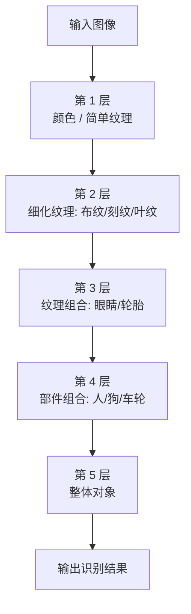

# 深度学习简介

## 学习目标

- 了解什么是深度学习

## 1 深度学习 — 神经网络简介

深度学习（Deep Learning）（也称为深度结构学习【Deep Structured Learning】、层次学习【Hierarchical Learning】或者是深度机器学习【Deep Machine Learning】）是一类算法集合，是机器学习的一个分支。

深度学习方法近年来，在会话识别、图像识别和对象侦测等领域表现出了惊人的准确性。

但是，"深度学习"这个词语很古老，它在 1986 年由 Dechter 在机器学习领域提出，然后在 2000 年由 Aizenberg 等人引入到人工神经网络中。而现在，由于 Alex Krizhevsky 在 2012 年使用卷积网络结构赢得了 ImageNet 比赛之后受到大家的瞩目。

卷积网络之父：Yann LeCun

- 深度学习演示
  - [链接：http://playground.tensorflow.org](http://playground.tensorflow.org)

## 2 深度学习各层负责内容

神经网络各层负责内容：

1 层：负责识别颜色及简单纹理

2 层：一些神经元可以识别更加细化的纹理，布纹，刻纹，叶纹等

3 层：一些神经元负责感受黑夜里的黄色烛光，高光，萤火，鸡蛋黄色等

4 层：一些神经元识别萌狗的脸，宠物形貌，圆柱体事物，七星瓢虫等的存在

5 层：一些神经元负责识别花，黑眼圈动物，鸟，键盘，原型屋顶等

## 3 小结

- 深度学习的发展源头——神经网络【了解】
- 多层神经网络，在最初几层是识别简单内容，后面几层是识别一些复杂内容【了解】

## 版本差异（机器学习栈 → 当前版本）

| 库 | 本文编写时 | 当前稳定版 |
|----|-----------|-----------|
| scikit-learn | 1.x | 1.9.x（截至 2026-09） |
| TensorFlow | 2.x | 2.16+（2.x 持续更新） |
| PyTorch | 2.x | 2.x 最新 |
| XGBoost | 1.x/2.x | 3.x |
| Python | 3.8-3.12 | 3.14 |

> 本文讲解的机器学习概念（算法分类、工作流、评估）与 scikit-learn 核心 API 保持稳定；新特性以官方文档为准。
