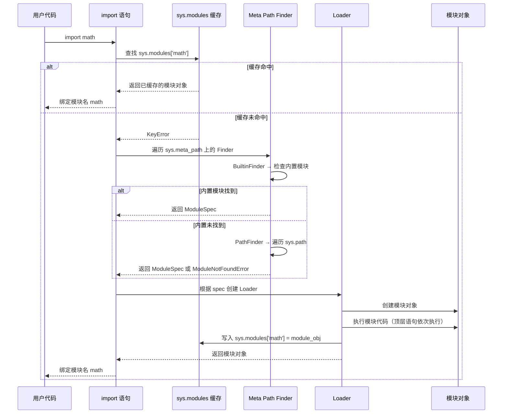
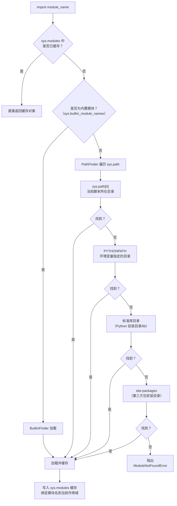
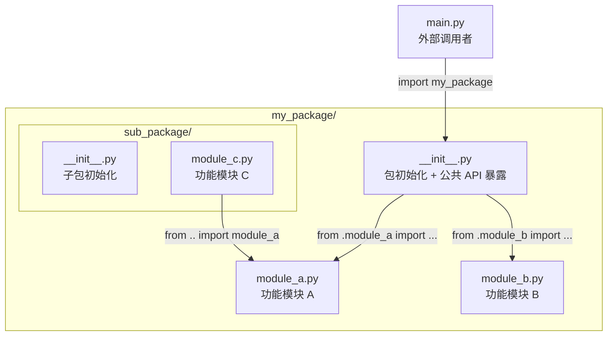
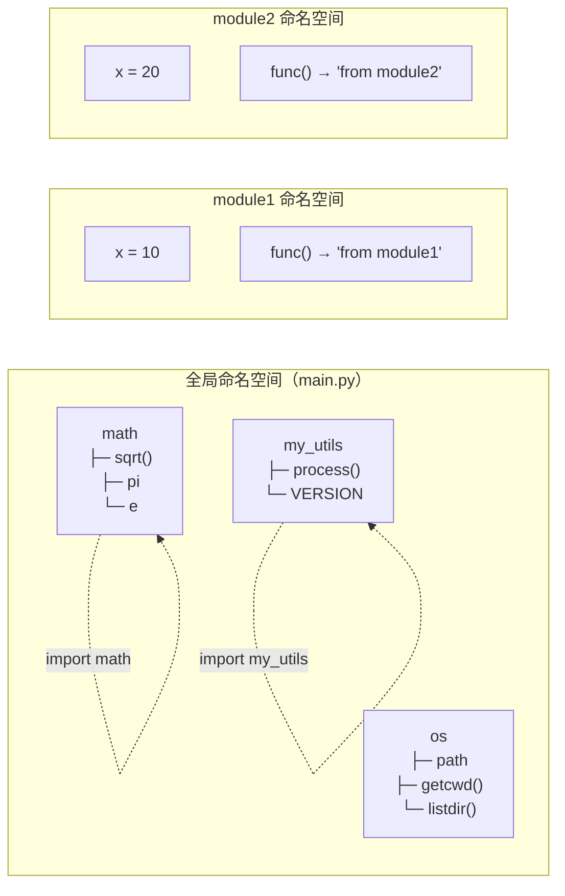

# Python 模块系统入门

> 本页系统讲解 Python 模块与包的核心概念、import 机制全流程、命名空间隔离、循环导入解决方案等，是理解 Python 工程化能力的基础。
>
> 建议先完成 [Python 文档导航总览](/docs/python/基础与入门/00-导航总览) 中的核心内容后再阅读本页。

## 前置阅读

- [标准模块速查](02-常用的标准模块)
- [Python 基础](/docs/python/基础与入门/00-导航总览)
- [工程化](/docs/python/工程化与运维/工程化/01-代码规范)

## 相关索引

- [标准模块速查](02-常用的标准模块)
- [数据分析库](04-数据分析库/01-NumPy数组与数据类型) — NumPy / Pandas / Matplotlib / Seaborn / PyEcharts
- [工程化](/docs/python/工程化与运维/工程化/01-代码规范)
- [爬虫](/docs/python/Web与爬虫/爬虫/01-爬虫概览与HTTP基础) / [数据科学](/docs/python/数据科学/index) / [Web 开发](/docs/python/数据科学/07-量化金融/05-RESTful与Socket交易执行)

---

## 一、模块是什么

**定义**：模块（Module）是一个包含 Python 定义和语句的 `.py` 文件。文件名即模块名（去掉 `.py` 后缀），模块内可以定义函数、类、变量，也可以包含可执行语句。

```python
# greetings.py —— 这就是一个模块，模块名为 greetings

def hello(name: str) -> str:
    """返回问候语"""                    # 定义函数
    return f"Hello, {name}"

version = "1.0"                         # 定义变量

class Greeter:                          # 定义类
    def __init__(self, lang: str):
        self.lang = lang

if __name__ == '__main__':              # 模块自测代码
    print(hello('world'))
```

## 二、为什么需要模块化

没有模块的世界——所有代码挤在一个文件里，函数名冲突、代码难以复用、维护噩梦。模块化解决的核心问题：

| 价值 | 说明 | 反面案例 |
|------|------|----------|
| **代码重用** | 一次定义多处使用，避免复制粘贴 | 多个项目各自维护一份相同的工具函数 |
| **命名空间隔离** | 模块内变量互不干扰 | 两个模块都定义了 `process()` 函数，后者覆盖前者 |
| **代码组织** | 按功能分割，结构清晰 | 单文件 5000 行，定位一个函数要翻屏几十次 |
| **易于维护** | 修改影响范围小，符合单一职责 | 改一个工具函数导致全局崩溃 |
| **便于分发** | 打包发布，供他人使用 | 只能靠 U 盘拷贝代码 |

::: tip 一句话总结
模块 = 代码的"容器"，让代码有组织、可复用、不冲突。
:::

## 三、import 机制全流程

当你写下 `import math` 时，Python 内部经历了一个完整的查找-加载-缓存流程。理解这个流程是排查所有导入问题的基础。

### 3.1 import 时序图



### 3.2 流程详解

```python
#!/usr/bin/env python3
"""演示 import 机制的内部流程"""

import sys

# ── 步骤 1：检查 sys.modules 缓存 ──────────────────────────────
# import 时 Python 首先查看 sys.modules 字典
# 如果模块已加载过，直接返回缓存对象，不会重复执行模块代码
print('math' in sys.modules)    # False（首次导入前）
import math
print('math' in sys.modules)    # True（导入后进入缓存）
print(sys.modules['math'])      # <module 'math' from ...>

# ── 步骤 2：Finder 查找模块 ────────────────────────────────────
# sys.meta_path 包含一系列 Finder 对象，依次尝试定位模块
for finder in sys.meta_path:
    print(finder)               # BuiltinFinder, FrozenFinder, PathFinder ...

# ── 步骤 3：Loader 加载并执行 ──────────────────────────────────
# Finder 找到模块后返回 ModuleSpec，Loader 据此创建模块对象并执行代码
# 执行后模块对象被缓存到 sys.modules

# ── 步骤 4：绑定模块名 ─────────────────────────────────────────
# 当前作用域中绑定模块名，指向缓存中的模块对象
print(math.pi)                  # 3.141592653589793
```

### 3.3 模块搜索路径流程图

当 Finder 在 `sys.path` 中搜索模块时，按以下顺序依次查找：



```python
#!/usr/bin/env python3
"""查看当前 Python 环境的模块搜索路径"""

import sys

print("=== sys.path 搜索路径（按优先级排列）===")
for i, path in enumerate(sys.path, 1):
    print(f"  {i}. {path}")

print("\n=== 内置模块列表（部分）===")
print(list(sys.builtin_module_names)[:10], "...")

# 分析模块加载耗时（命令行方式）
# python -X importtime your_script.py
# 输出示例：
# import time:       123 |         123 | math
# import time:       456 |         579 | numpy
```

## 四、import 语法对比

### 4.1 五种导入方式对比表

| 语法 | 命名空间 | 示例调用 | 适用场景 | 风险等级 |
|------|----------|----------|----------|----------|
| `import x` | `x.` 前缀 | `math.sqrt(9)` | 通用场景，命名空间最清晰 | 低 |
| `import x as y` | `y.` 前缀 | `np.array([1])` | 名称过长或避免冲突 | 低 |
| `from x import y` | 直接使用 `y` | `sqrt(9)` | 频繁使用某函数/类 | 中 |
| `from x import y as z` | 直接使用 `z` | `pd.DataFrame()` | 简化名称，社区约定别名 | 中 |
| `from x import *` | 污染当前命名空间 | `sqrt(9)` | 临时交互测试 | 高 |

### 4.2 完整可运行示例

```python
#!/usr/bin/env python3
"""五种 import 语法的完整对比示例"""

# ── 方式 1：import x ──────────────────────────────────────────
# 最安全的方式，命名空间完全隔离
import math                          # 导入整个 math 模块
print(math.sqrt(16))                 # 调用时必须带模块名前缀 → 4.0
print(math.pi)                       # → 3.141592653589793

# ── 方式 2：import x as y ─────────────────────────────────────
# 给模块起别名，社区有约定俗成的写法
import math as m                     # 别名 m 指向 math 模块对象
print(m.sqrt(16))                    # → 4.0
# 常见约定：import numpy as np / import pandas as pd

# ── 方式 3：from x import y ───────────────────────────────────
# 只导入需要的对象，直接使用，无需前缀
from math import sqrt, pi            # 只导入 sqrt 函数和 pi 常量
print(sqrt(16))                      # 直接调用，无需前缀 → 4.0
print(pi)                            # → 3.141592653589793

# ── 方式 4：from x import y as z ──────────────────────────────
# 导入特定对象并起别名
from math import pi as PI            # pi 在当前作用域叫 PI
print(PI)                            # → 3.141592653589793

# ── 方式 5：from x import * ──────────────────────────────────
# 导入模块所有公开名称，严重污染命名空间，不推荐
from math import *                   # math 中所有名称进入当前作用域
print(sqrt(16))                      # 能用，但不知道 sqrt 从哪来的
# 危险：可能覆盖同名的自定义函数！
```

### 4.3 `from x import *` 的陷阱演示

```python
#!/usr/bin/env python3
"""演示 from x import * 导致的名称覆盖问题"""

def sqrt(n):
    """自定义整数平方根"""
    return int(n ** 0.5)

print(sqrt(8))                       # → 2（使用自定义版本）

from math import *                   # math.sqrt 覆盖了自定义 sqrt
print(sqrt(8))                       # → 2.8284271247461903（被覆盖！）

# 结论：永远不要在生产代码中使用 from x import *
```

## 五、包与 `__init__.py`

### 5.1 什么是包

**包（Package）** 是包含 `__init__.py` 文件的目录，用于将多个相关模块组织成层次结构。包可以嵌套，形成树状目录。

::: info Python 3.3+ 的命名空间包
Python 3.3 引入了"命名空间包"（Namespace Package），允许没有 `__init__.py` 的目录也被视为包。但为了兼容性和明确性，**建议始终保留 `__init__.py`**。
:::

### 5.2 包结构架构图



### 5.3 完整包示例

**目录结构：**

```text
my_project/
├── main.py                       # 入口脚本
└── my_package/
    ├── __init__.py               # 包初始化，暴露公共 API
    ├── math_utils.py             # 数学工具模块
    └── string_utils.py           # 字符串工具模块
```

**`__init__.py` —— 包的门面：**

```python
# my_package/__init__.py
"""my_package - 一个工具函数包"""

from .math_utils import add, subtract       # 从子模块导入，提升到包级别
from .string_utils import greet             # 同上

__version__ = "1.0.0"                       # 包级别变量

__all__ = ['add', 'subtract', 'greet']      # 控制 from my_package import * 的范围
```

**`math_utils.py`：**

```python
# my_package/math_utils.py
"""数学工具函数模块"""

def add(a: float, b: float) -> float:
    """两数相加"""
    return a + b

def subtract(a: float, b: float) -> float:
    """两数相减"""
    return a - b

def _internal_helper(x: float) -> float:    # 下划线前缀表示内部函数
    """内部辅助函数，不建议外部直接调用"""
    return x * 2

# 模块内自测
if __name__ == '__main__':
    print(f"10 + 5 = {add(10, 5)}")
    print(f"10 - 5 = {subtract(10, 5)}")
```

**`string_utils.py`：**

```python
# my_package/string_utils.py
"""字符串工具函数模块"""

def greet(name: str) -> str:
    """返回问候语"""
    return f"你好, {name}!"

def capitalize_words(text: str) -> str:
    """将每个单词的首字母大写"""
    return ' '.join(word.capitalize() for word in text.split())

if __name__ == '__main__':
    print(greet("张三"))
    print(capitalize_words("hello world"))
```

**`main.py` —— 外部调用：**

```python
#!/usr/bin/env python3
"""演示包的两种导入方式"""

# 方式 1：通过包名间接使用（__init__.py 已做转发）
import my_package
print(my_package.add(5, 3))          # → 8
print(my_package.greet("Alice"))     # → 你好, Alice!
print(my_package.__version__)        # → 1.0.0

# 方式 2：直接导入子模块
from my_package.math_utils import add, subtract
print(add(10, 20))                   # → 30
print(subtract(10, 5))               # → 5

# 方式 3：利用 __init__.py 转发，直接导入包级名称
from my_package import add, greet
print(add(1, 2))                     # → 3
print(greet("Bob"))                  # → 你好, Bob!
```

### 5.4 `__all__` 的作用

`__all__` 是一个字符串列表，定义在模块或 `__init__.py` 中，控制 `from 模块 import *` 时导入哪些名称。

```python
# my_package/__init__.py

from .math_utils import add, subtract, _internal_helper
from .string_utils import greet, capitalize_words

__all__ = ['add', 'greet']           # import * 时只导入 add 和 greet
```

```python
#!/usr/bin/env python3
"""演示 __all__ 的效果"""

from my_package import *

print(add(1, 2))                     # OK，add 在 __all__ 中
print(greet("Alice"))                # OK，greet 在 __all__ 中

# print(subtract(5, 3))             # NameError! subtract 不在 __all__ 中
# print(capitalize_words("hi"))     # NameError! capitalize_words 不在 __all__ 中
```

| 场景 | 不定义 `__all__` | 定义 `__all__` |
|------|------------------|----------------|
| `from pkg import *` | 导入所有不以 `_` 开头的名称 | 只导入 `__all__` 列出的名称 |
| 代码提示 / 文档 | 不明确公共 API | 明确标记公共接口 |
| 代码可维护性 | 容易暴露内部实现 | 清晰的导出边界 |

## 六、绝对导入 vs 相对导入

### 6.1 对比表

| 特性 | 绝对导入 | 相对导入 |
|------|----------|----------|
| **语法** | `from my_package.module_a import func` | `from .module_a import func` |
| **基准** | 从项目根目录开始的完整路径 | 从当前模块所在包开始 |
| **可读性** | 路径清晰，一目了然 | 需要理解 `.` 和 `..` 的含义 |
| **可移植性** | 包重命名需修改所有导入 | 包重命名只需改一处 |
| **适用场景** | 跨包导入、外部调用者 | 包内部模块之间互相引用 |
| **运行方式** | 直接 `python main.py` 即可 | 必须用 `python -m` 运行 |

### 6.2 相对导入语法

```python
from . import module_a              # 导入同目录下的 module_a（当前包）
from .module_a import func_a        # 从同目录 module_a 导入 func_a
from .. import module_b             # 导入上级目录的 module_b（父包）
from ..subpackage import module_c   # 从父包的 subpackage 子包导入 module_c
from ... import top_level           # 上上级（不推荐超过两级）
```

### 6.3 完整示例

**目录结构：**

```text
my_app/
├── main.py
└── services/
    ├── __init__.py
    ├── auth.py
    └── database/
        ├── __init__.py
        └── queries.py
```

```python
# services/database/queries.py

# 绝对导入：从项目根目录写完整路径
from services.auth import validate_token       # 清晰但包重命名要改

# 相对导入：从当前位置出发
from ..auth import validate_token              # 包重命名不影响
from . import queries                          # 当前包内的模块
```

::: warning 相对导入的常见错误
直接运行包含相对导入的模块会报错：`ImportError: attempted relative import with no known parent package`。正确方式是使用 `-m` 参数：

```bash
# 错误
python services/database/queries.py

# 正确
python -m services.database.queries
```
:::

## 七、`__name__ == '__main__'` 的原理与最佳实践

### 7.1 原理

每个 Python 模块都有一个内置属性 `__name__`：

| 运行方式 | `__name__` 的值 | 说明 |
|----------|-----------------|------|
| `python my_module.py` | `'__main__'` | 作为主脚本直接运行 |
| `import my_module` | `'my_module'` | 被其他模块导入 |

### 7.2 最佳实践

```python
#!/usr/bin/env python3
# calculator.py
"""计算器模块 - 演示 __name__ 的最佳实践"""


def add(a: float, b: float) -> float:
    """加法"""
    return a + b


def subtract(a: float, b: float) -> float:
    """减法"""
    return a - b


def main():
    """主函数：处理命令行交互"""
    import argparse                                    # 延迟导入，仅命令行使用
    
    parser = argparse.ArgumentParser(description="简易计算器")
    parser.add_argument("a", type=float, help="第一个数")
    parser.add_argument("op", choices=["+", "-"], help="运算符")
    parser.add_argument("b", type=float, help="第二个数")
    args = parser.parse_args()
    
    if args.op == "+":
        print(f"{args.a} + {args.b} = {add(args.a, args.b)}")
    elif args.op == "-":
        print(f"{args.a} - {args.b} = {subtract(args.a, args.b)}")


if __name__ == '__main__':
    main()                     # 仅直接运行时执行，被导入时不执行
```

```bash
# 直接运行
python calculator.py 3 + 5
# 输出: 3.0 + 5.0 = 8.0

# 被导入时不会触发 main()
# import calculator → calculator.add(1, 2) → 3
```

::: tip 最佳实践要点
1. 将可执行逻辑封装在 `main()` 函数中，而非直接写在 `if __name__` 块里
2. `if __name__ == '__main__'` 只调用 `main()`，保持简洁
3. 仅在命令行使用的依赖（如 `argparse`）可在 `main()` 内延迟导入
4. 每个模块都应支持被安全导入而不产生副作用
:::

## 八、模块命名空间

### 8.1 命名空间图解



### 8.2 命名空间隔离演示

```python
#!/usr/bin/env python3
"""演示模块命名空间的隔离效果"""

# module1.py 的内容等价于：
import types
module1 = types.ModuleType('module1')
module1.x = 10
module1.func = lambda: "Hello from module1"

# module2.py 的内容等价于：
module2 = types.ModuleType('module2')
module2.x = 20
module2.func = lambda: "Hello from module2"

# 同名变量互不干扰
print(module1.x)                      # → 10
print(module2.x)                      # → 20

# 同名函数互不干扰
print(module1.func())                 # → Hello from module1
print(module2.func())                 # → Hello from module2
```

### 8.3 命名空间的三种作用域

| 作用域 | 生命周期 | 示例 |
|--------|----------|------|
| **内置命名空间** | 解释器启动到退出 | `len`、`print`、`int` |
| **全局命名空间** | 模块加载到解释器退出 | 模块顶层定义的函数、类、变量 |
| **局部命名空间** | 函数调用期间 | 函数内的局部变量 |

## 九、循环导入问题与解决方案

### 9.1 什么是循环导入

两个或多个模块互相导入对方，形成环形依赖，导致模块在尚未完全初始化时就被引用。

```python
# module_a.py
import module_b                       # 导入 module_b

def func_a():
    return module_b.func_b()          # 调用 module_b 的函数

# module_b.py
import module_a                       # 导入 module_a → 循环！

def func_b():
    return module_a.func_a()          # 调用 module_a 的函数
```

运行时的执行流程：

1. `import module_a` → 开始执行 `module_a.py`
2. `module_a.py` 中 `import module_b` → 开始执行 `module_b.py`
3. `module_b.py` 中 `import module_a` → 但 `module_a` 还没执行完！
4. Python 发现 `module_a` 已在 `sys.modules` 中（但只是部分初始化）→ 返回半成品
5. `module_b` 中访问 `module_a.func_a` → `AttributeError`！

### 9.2 四种解决方案

**方案 1：延迟导入（最常用）**

将 `import` 移到函数内部，让导入发生在调用时而非模块加载时：

```python
# module_a.py

def func_a():
    from module_b import func_b       # 延迟到调用时才导入
    return func_b()
```

**方案 2：提取公共部分到第三个模块**

将互相依赖的代码抽取到独立模块：

```text
# 重构前：a ↔ b（循环）
# 重构后：a → base ← b（无循环）

base.py    # 存放两者都需要的公共定义
module_a.py  # import base（不 import module_b）
module_b.py  # import base（不 import module_a）
```

**方案 3：只在函数中使用对方模块的属性**

模块级别 `import` 但不在顶层使用，只在函数体内访问：

```python
# module_a.py
import module_b                       # 顶层导入，但不立即使用

def func_a():
    return module_b.func_b()          # 函数内使用（此时 module_b 已加载完毕）
```

**方案 4：重新设计架构**

循环导入通常是架构问题的信号，应重新审视模块划分：

```python
# 不好的设计：Controller ↔ Model 循环依赖
# 好的设计：Controller → Model，Model 通过回调/事件通知 Controller
```

### 9.3 方案对比

| 方案 | 改动量 | 适用场景 | 缺点 |
|------|--------|----------|------|
| 延迟导入 | 小 | 快速修复，依赖关系简单 | 每次调用都有微小的 import 检查开销 |
| 提取公共模块 | 中 | 长期维护，架构清晰 | 需要重新规划模块结构 |
| 函数内访问属性 | 小 | 模块级导入但不立即使用 | 不够直观 |
| 重新设计架构 | 大 | 循环依赖复杂时 | 耗时但最彻底 |

## 十、模块相关关键字与内置函数

| 关键字/函数 | 作用 | 示例 |
|-------------|------|------|
| `import` | 导入整个模块 | `import math` |
| `from` | 从模块中导入指定对象 | `from math import pi` |
| `as` | 给导入的对象起别名 | `import numpy as np` |
| `dir()` | 返回模块/对象的所有属性名 | `dir(math)` |
| `help()` | 查看模块/函数的帮助文档 | `help(math.sqrt)` |
| `vars()` | 返回模块的 `__dict__` | `vars(math)` |
| `reload()` | 重新加载已导入的模块 | `importlib.reload(module)` |

```python
#!/usr/bin/env python3
"""模块相关内置函数演示"""

import math
from importlib import reload

# dir()：查看模块所有属性
print(dir(math))                      # ['__doc__', '__file__', 'acos', ...]

# help()：查看帮助文档
# help(math.sqrt)                    # 显示 sqrt 的详细说明

# vars()：查看模块命名空间字典
print(vars(math).keys())              # 等价于 math.__dict__.keys()

# reload()：重新加载模块（调试时有用）
# 注意：reload 参数必须是已导入的模块对象，不是字符串
my_module = __import__('math')        # 获取模块对象
reload(my_module)                     # 重新加载
```

## 十一、`__pycache__` 与字节码缓存

当 Python 首次导入一个模块时，会将编译后的字节码保存到 `__pycache__/` 目录下，文件名格式为 `module.cpython-3x.pyc`，下次导入时直接加载字节码，跳过编译步骤。

```python
#!/usr/bin/env python3
"""理解 __pycache__ 机制"""

import my_module                      # 首次导入：编译 → 保存 .pyc → 执行
import my_module                      # 再次导入：直接加载 .pyc（更快）

# 何时需要清理 __pycache__？
# 1. 修改了 Python 版本（字节码不兼容）
# 2. 修改了源文件的时间戳但内容没变（极少见）
# 3. 部署时为了减小体积

# 命令行清理
# find . -type d -name __pycache__ -exec rm -rf {} +
# 或
# pyclean .
```

| 场景 | 行为 |
|------|------|
| 首次 `import` | 编译源码 → 写入 `.pyc` → 执行 |
| 再次 `import` | 检查 `.pyc` 时间戳 → 若源码未修改则直接加载 `.pyc` |
| 源码已修改 | 重新编译 → 覆盖 `.pyc` |
| `__pycache__` 被删除 | 下次导入时重新创建 |

## 十二、标准库与第三方模块

Python 自带 300+ 标准库模块，完整目录见 [官方文档](https://docs.python.org/3/library/index.html)。第三方库托管在 [PyPI](https://pypi.org/)，使用 `pip` 安装后即可 `import`。

### 常用标准模块

| 模块 | 用途 | 模块 | 用途 |
|------|------|------|------|
| `os` | 操作系统接口 | `sys` | 解释器相关 |
| `json` | JSON 数据处理 | `re` | 正则表达式 |
| `datetime` | 时间日期处理 | `collections` | 扩展数据结构 |
| `hashlib` | 哈希摘要算法 | `itertools` | 迭代器工具 |
| `logging` | 日志系统 | `threading` | 多线程 |
| `pathlib` | 路径操作 | `csv` | CSV 文件读写 |
| `argparse` | 命令行参数解析 | `unittest` | 单元测试 |

### 常用第三方模块

| 模块 | 用途 | 模块 | 用途 |
|------|------|------|------|
| `requests` | HTTP 请求 | `beautifulsoup4` | HTML 解析 |
| `numpy` | 科学计算 | `pandas` | 数据分析 |
| `matplotlib` | 数据可视化 | `django` | Web 框架 |
| `flask` | 轻量 Web 框架 | `scrapy` | 爬虫框架 |
| `pillow` | 图像处理 | `openpyxl` | Excel 处理 |
| `celery` | 异步任务队列 | `pytest` | 测试框架 |

> NumPy、Pandas、Matplotlib、Seaborn、PyEcharts 等数据分析库的**深入教程**见 [数据分析库](04-数据分析库/01-NumPy数组与数据类型) 子专题。

## 十三、动态导入

有时需要根据变量或用户输入动态导入模块，使用 `importlib` 实现：

```python
#!/usr/bin/env python3
"""动态导入模块示例"""

import importlib

# ── 方式 1：import_module ────────────────────────────────────
module_name = "math"                              # 模块名可以是变量
mod = importlib.import_module(module_name)        # 等价于 import math
print(mod.sqrt(16))                               # → 4.0

# ── 方式 2：导入子模块 ───────────────────────────────────────
path_mod = importlib.import_module("os.path")     # 等价于 import os.path
print(path_mod.join("dir", "file.txt"))           # → dir/file.txt

# ── 方式 3：插件模式 ─────────────────────────────────────────
# 根据配置加载不同的数据库驱动
db_drivers = {
    "mysql": "pymysql",
    "postgres": "psycopg2",
    "sqlite": "sqlite3",
}

config = "sqlite"                                 # 可从配置文件读取
driver_name = db_drivers[config]
driver = importlib.import_module(driver_name)
print(f"已加载驱动: {driver_name}")

# ── 方式 4：安全导入（处理模块不存在的情况）────────────────────
def safe_import(module_name: str):
    """安全导入模块，不存在时返回 None"""
    try:
        return importlib.import_module(module_name)
    except ModuleNotFoundError:
        print(f"模块 {module_name} 未安装，请运行: pip install {module_name}")
        return None

optional = safe_import("nonexistent_module")      # → 模块 nonexistent_module 未安装...
```

## 十四、最佳实践对比表

| 实践 | 推荐做法 | 反面做法 | 原因 |
|------|----------|----------|------|
| 导入方式 | `import x` 或 `from x import y` | `from x import *` | 避免命名空间污染 |
| 导入顺序 | 标准库 → 第三方 → 本地，组间空行 | 随意排列 | PEP 8 规范，可读性好 |
| 包初始化 | 保留 `__init__.py`，暴露公共 API | 省略 `__init__.py` | 兼容性 + 明确性 |
| 包内导入 | 使用相对导入 | 使用绝对导入硬编码包名 | 包重命名时更灵活 |
| 模块测试 | `if __name__ == '__main__'` + `main()` | 顶层直接写测试代码 | 导入时不产生副作用 |
| 公共 API | 定义 `__all__` 列表 | 不定义 | 明确导出边界 |
| 循环依赖 | 提取公共模块或延迟导入 | 互相 import | 避免初始化顺序问题 |
| 运行包内模块 | `python -m pkg.module` | `python pkg/module.py` | 确保包上下文正确 |
| 惰性导入 | 函数内部 import 重量级模块 | 模块顶层 import 所有 | 减少冷启动时间 |
| 缓存调试 | `del sys.modules['x']` + `reload` | 重启解释器 | 调试更高效 |

## 十五、常见陷阱 / FAQ

### Q1: `ModuleNotFoundError` 怎么排查？

```python
#!/usr/bin/env python3
"""ModuleNotFoundError 排查清单"""

import sys

# 1. 检查模块是否已安装
# pip list | grep module_name

# 2. 检查模块是否在搜索路径中
for p in sys.path:
    print(p)                                    # 确认模块所在目录是否在其中

# 3. 检查是否在虚拟环境中
import os
print(sys.executable)                           # 确认使用的 Python 解释器路径
print(os.environ.get('VIRTUAL_ENV', '未激活虚拟环境'))

# 4. 常见原因：
# - 拼写错误：import maths → import math
# - 未安装：pip install module_name
# - 虚拟环境不对：确认在正确的 venv 中
# - 目录不在 sys.path 中：添加到 PYTHONPATH 或调整项目结构
```

### Q2: 循环导入怎么解决？

参见 [第九节：循环导入问题与解决方案](#九循环导入问题与解决方案)。核心思路：延迟导入或提取公共模块。

### Q3: `__pycache__` 是什么？能删吗？

可以安全删除。Python 下次导入时会自动重建。详见 [第十一节](#十一pycache-与字节码缓存)。

### Q4: 包和模块有什么区别？

| 概念 | 本质 | 示例 |
|------|------|------|
| **模块** | 单个 `.py` 文件 | `math.py`、`my_utils.py` |
| **包** | 含 `__init__.py` 的目录 | `my_package/` 目录 |
| **命名空间包** | 无 `__init__.py` 的目录（Python 3.3+） | 可被多个路径片段贡献 |

### Q5: 为什么相对导入报错 `attempted relative import with no known parent package`？

因为你直接运行了包内的模块（`python pkg/module.py`），此时该模块不知道自己属于哪个包。解决方法：

```bash
# 错误
python my_package/sub_package/module_b.py

# 正确
python -m my_package.sub_package.module_b
```

### Q6: `import x` 和 `from x import y` 有什么本质区别？

```python
import math                         # 在当前命名空间创建名称 math → 指向模块对象
# 使用：math.sqrt(9)

from math import sqrt               # 在当前命名空间创建名称 sqrt → 指向函数对象
# 使用：sqrt(9)

# 本质区别：绑定的对象不同
# import x 绑定的是模块对象
# from x import y 绑定的是模块内的属性对象
```

### Q7: 如何查看模块的源文件路径？

```python
import math
print(math.__file__)                # 模块源文件路径（内置模块无此属性）

import json
print(json.__file__)                # .../json/__init__.py
```

## 术语表

| 术语 | 英文 | 定义 |
|------|------|------|
| **模块** | Module | 一个 `.py` 文件，包含 Python 定义和语句 |
| **包** | Package | 包含 `__init__.py` 的目录，组织多个模块 |
| **命名空间包** | Namespace Package | 无 `__init__.py` 的包（Python 3.3+） |
| **命名空间** | Namespace | 名称到对象的映射，用于避免命名冲突 |
| **Finder** | Finder | `import` 机制中负责定位模块的组件 |
| **Loader** | Loader | `import` 机制中负责加载模块代码的组件 |
| **ModuleSpec** | ModuleSpec | 描述模块查找和加载信息的对象 |
| **`sys.modules`** | — | 字典，缓存已加载的模块对象 |
| **`sys.path`** | — | 列表，模块搜索路径 |
| **`sys.meta_path`** | — | 列表，存放 Meta Path Finder 对象 |
| **绝对导入** | Absolute Import | 使用完整模块路径的导入方式 |
| **相对导入** | Relative Import | 使用 `.` / `..` 表示相对位置的导入方式 |
| **延迟导入** | Lazy Import | 在函数内部导入，推迟到调用时才执行 |
| **循环导入** | Circular Import | 两个或多个模块互相导入对方 |
| **`__all__`** | — | 列表，定义 `from x import *` 导出的名称 |
| **`__pycache__`** | — | 目录，存放编译后的 `.pyc` 字节码文件 |
| **`__name__`** | — | 字符串，模块名；主脚本运行时为 `'__main__'` |
| **字节码** | Bytecode | Python 源码编译后的中间表示，存储在 `.pyc` 文件中 |
| **site-packages** | — | 第三方包的安装目录 |
| **PyPI** | Python Package Index | Python 官方第三方包仓库 |

## 延伸阅读

- [Python 官方文档 - 模块](https://docs.python.org/zh-cn/3/tutorial/modules.html) — 模块基础教程
- [Python 官方文档 - importlib](https://docs.python.org/zh-cn/3/library/importlib.html) — import 机制内部 API
- [PEP 328 — Imports: Multi-Line and Absolute/Relative](https://peps.python.org/pep-0328/) — 相对导入规范
- [PEP 420 — Implicit Namespace Packages](https://peps.python.org/pep-0420/) — 命名空间包规范
- [PEP 8 — Imports](https://peps.python.org/pep-0008/#imports) — 导入风格指南
- [Python 官方文档 - 标准库](https://docs.python.org/zh-cn/3/library/index.html) — 完整标准库目录
- [PyPI](https://pypi.org/) — Python 包索引
- [Real Python - Python Modules and Packages](https://realpython.com/python-modules-packages/) — 深入讲解

## 快速参考

### 导入语法速查表

| 语法 | 说明 | 使用场景 |
|------|------|----------|
| `import module` | 导入整个模块 | 通用场景，命名空间清晰 |
| `import module as alias` | 使用别名导入 | 名称过长或避免冲突 |
| `from module import name` | 导入特定对象 | 频繁使用某函数/类 |
| `from module import name as alias` | 别名导入特定对象 | 简化名称 |
| `from module import *` | 导入所有（不推荐） | 临时测试 |
| `from . import module` | 相对导入（同目录） | 包内部导入 |
| `from .. import module` | 相对导入（上级目录） | 包内部跨级导入 |

### 模块搜索顺序

```
1. sys.modules          → 已缓存模块
2. 内置模块              → built-in modules
3. sys.path[0]          → 当前脚本目录
4. PYTHONPATH           → 环境变量
5. 标准库目录            → Python 安装目录
6. site-packages        → 第三方包安装目录
```

### 常见错误与解决

| 错误 | 原因 | 解决方案 |
|------|------|----------|
| `ModuleNotFoundError` | 模块不存在或未安装 | `pip install module_name`；检查 `sys.path` |
| `ImportError` | 导入失败（通常是依赖问题） | 检查依赖、版本兼容性 |
| 循环导入 | 两个模块互相导入 | 重构代码或使用延迟导入 |
| `AttributeError` | 模块没有该属性 | 检查拼写、确认对象存在 |
| 相对导入失败 | 直接运行模块 | 使用 `python -m package.module` |

### 最佳实践检查清单

- [ ] 导入顺序：标准库 → 第三方库 → 本地模块，组间空行分隔
- [ ] 避免 `from module import *`，使用具体名称
- [ ] 包目录包含 `__init__.py`（Python 3.3+ 可选但建议保留）
- [ ] 使用 `if __name__ == "__main__":` 进行模块测试
- [ ] 为模块编写 docstring 说明功能
- [ ] 使用虚拟环境隔离项目依赖
- [ ] 使用 `requirements.txt` 或 `pyproject.toml` 管理依赖
- [ ] 定义 `__all__` 明确公共 API
- [ ] 包内使用相对导入，跨包使用绝对导入
- [ ] 用 `python -m` 运行包内模块

### 项目结构模板

```
my_project/
├── pyproject.toml        # 项目配置和依赖
├── README.md             # 项目说明
├── src/
│   └── my_package/
│       ├── __init__.py   # 包初始化，可暴露公共 API
│       ├── core.py       # 核心功能
│       ├── utils.py      # 工具函数
│       └── subpackage/   # 子包
│           ├── __init__.py
│           └── helpers.py
├── tests/                # 测试目录
│   ├── __init__.py
│   └── test_core.py
└── docs/                 # 文档目录
```

## 版本差异（标准库 → Python 3.14）

| 模块/特性 | 本文编写时 | Python 3.14 变化 |
|-----------|-----------|------------------|
| `datetime` | `utcnow()` / `utcfromtimestamp()` | 3.12 起弃用，改用 `datetime.now(tz=datetime.UTC)` / `fromtimestamp(ts, tz=datetime.UTC)`（aware 对象） |
| `asyncio` | 基础 API | 3.14 新增内省能力（`asyncio.Task`/`Future` 状态查询）；3.11 起推荐 `TaskGroup` + `asyncio.timeout()` |
| `typing` | 旧式 `List`/`Dict` | 3.9+ 内置泛型；3.10+ 联合类型 `X \| Y`；3.12 `type` 语句；3.14 PEP 649 延迟注解 |
| `importlib` | `imp` 模块 | `imp` 于 3.12 移除，统一使用 `importlib` |
| 压缩 | zlib/gzip/bz2/lzma | 3.14 新增 `zstandard` 标准库支持（PEP 784） |
| `pathlib` | 基础路径操作 | 3.12 新增 `Path.walk()`；`is_relative_to()` 自 3.9 起可用 |
| 废弃模块清理 | — | 3.13 移除 `cgi`、`telnetlib`、`crypt`、`audioop` 等已废弃模块 |

> 本文讲解的模块核心 API 与使用模式在 3.14 中保持稳定；注意上述弃用/移除项，升级时优先用标准库推荐的替代方案。
