# 标准模块速查与实战

> 本页是 Python 常用标准模块的**一站式速查与实战指南**，覆盖 datetime、time、random、json、re、itertools、functools、pathlib、typing 九大核心模块。每个模块均包含架构图、核心 API 表、最佳实践与常见陷阱。如需更深入的专业讲解，请跳转至各模块的独立文档。

## 前置阅读

- [Python 模块](01-Python模块) — 模块导入机制与包管理
- [标准库索引](03-内置模块/01-os模块) — 内置模块完整导航

---

## 一、标准库全景导航

### 1.1 标准库分类体系

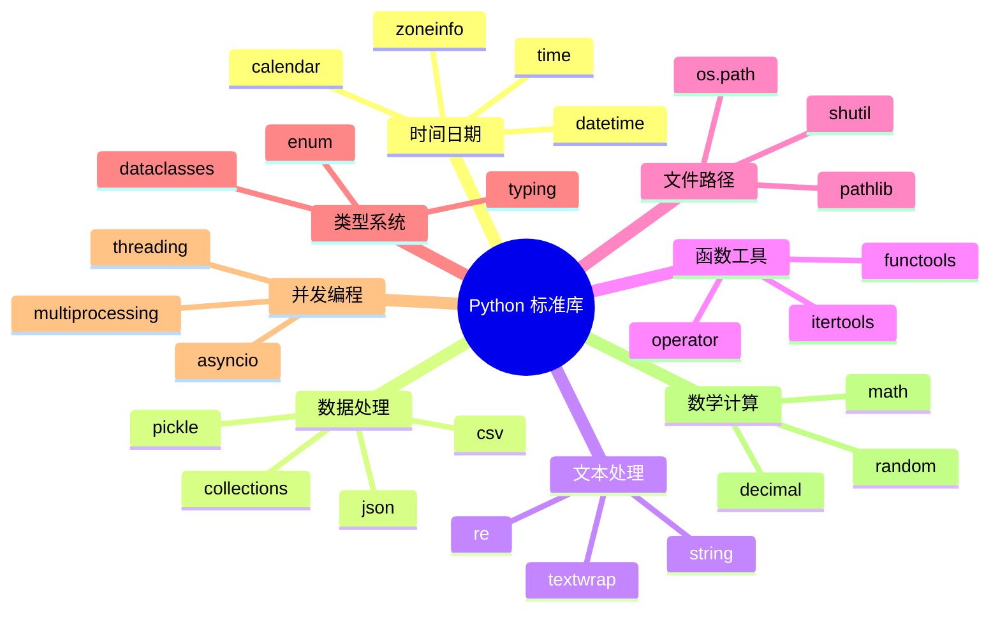

### 1.2 模块选型决策

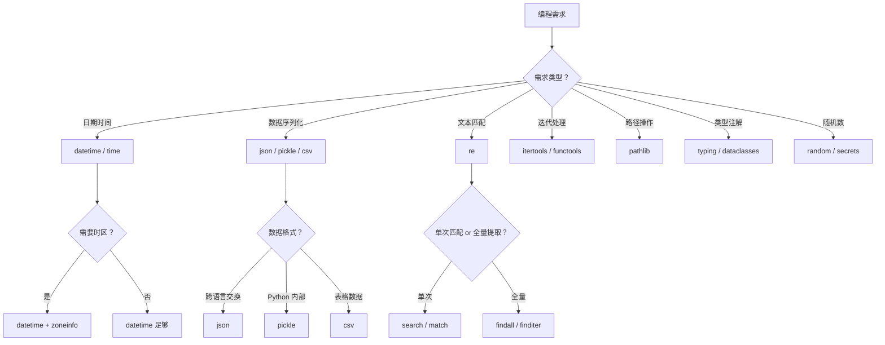

### 1.3 模块分类速查表

| 分类 | 模块 | 核心功能 | 典型场景 | 专业文档 |
|:-----|:-----|:---------|:---------|:---------|
| **时间日期** | `datetime` | 日期时间对象与运算 | 日志记录、定时任务、时区转换 | [时间模块](03-内置模块/07-时间模块) |
| | `time` | 时间戳、性能计时、休眠 | 性能测试、定时操作 | [时间模块](03-内置模块/07-时间模块) |
| **数学计算** | `random` | 伪随机数生成与采样 | 抽奖、测试数据、蒙特卡洛 | [数学与数值计算](03-内置模块/08-数学与数值计算) |
| **数据处理** | `json` | JSON 编解码 | 配置文件、API 通信 | [存储模块](03-内置模块/06-存储模块) |
| **文本处理** | `re` | 正则表达式匹配 | 数据验证、文本提取 | [数据解析](/docs/python/Web与爬虫/爬虫/02-数据解析全攻略) |
| **函数工具** | `itertools` | 迭代器构造与组合 | 数据流处理、排列组合 | [itertools](03-内置模块/12-itertools) |
| | `functools` | 高阶函数与装饰器工具 | 缓存、偏函数、类型分派 | [functools](03-内置模块/17-functools) |
| **文件路径** | `pathlib` | 面向对象路径操作 | 跨平台路径处理 | [pathlib](03-内置模块/05-pathlib模块) |
| **类型系统** | `typing` | 类型提示与静态检查 | 代码文档化、IDE 支持 | [typing](03-内置模块/19-typing模块) |

---

## 二、datetime 模块

### 2.1 datetime 体系架构

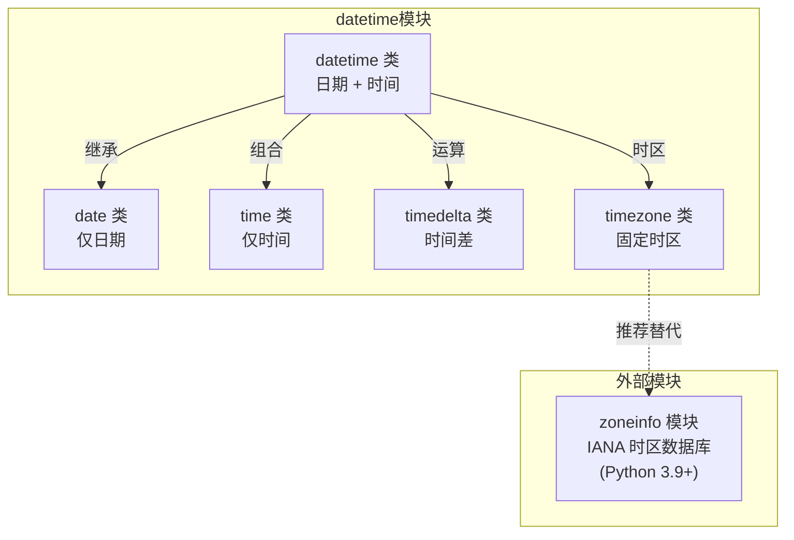

::: warning 核心概念：模块与类同名陷阱
`datetime` 既是**模块名**也是**类名**，这是初学者最常困惑的地方：

```python
import datetime

# 模块的方法
datetime.datetime.today()        # 两个 datetime！第一个是模块，第二个是类

# 推荐写法：从模块导入类
from datetime import datetime, timedelta, date, time

datetime.today()                 # 这里的 datetime 是类
date.today()                     # date 类
```
:::

### 2.2 核心对象创建与修改

```python
from datetime import datetime, date, time, timedelta, timezone

# ── 创建 datetime 对象 ──────────────────────────────
dt = datetime(2024, 1, 15, 10, 30, 0)     # 指定参数
now = datetime.now()                        # 当前本地时间
utc_now = datetime.now(timezone.utc)        # 当前 UTC 时间
today = datetime.today()                    # 当前时间（无时区信息）

# ── 从字符串解析 ──────────────────────────────────
dt = datetime.strptime('2024-01-15 10:30:00', '%Y-%m-%d %H:%M:%S')

# ── 从时间戳创建 ──────────────────────────────────
dt = datetime.fromtimestamp(1705305000)     # 本地时间
dt = datetime.utcfromtimestamp(1705305000)  # UTC 时间（已弃用，用下面方式）
dt = datetime.fromtimestamp(1705305000, tz=timezone.utc)

# ── 修改已有对象（返回新对象，原对象不变）─────────
dt = datetime(2024, 1, 15, 10, 30, 0)
new_dt = dt.replace(year=2025, hour=14)     # 2025-01-15 14:30:00
```

### 2.3 日期对象与字符串转换

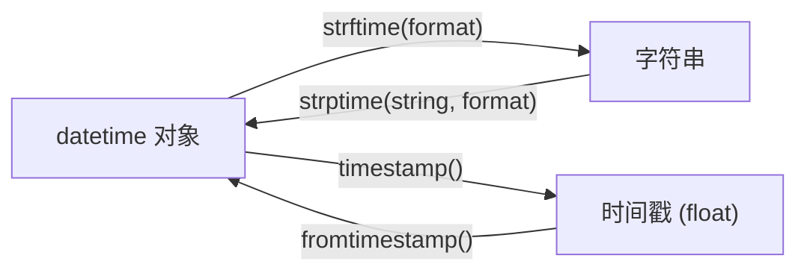

**strftime/strptime 格式化通配符完整表**：

| 通配符 | 含义 | 示例 | 通配符 | 含义 | 示例 |
|:------|:-----|:-----|:------|:-----|:-----|
| `%Y` | 四位年份 | 2024 | `%m` | 月份（补零） | 01-12 |
| `%y` | 两位年份 | 24 | `%d` | 日（补零） | 01-31 |
| `%H` | 24小时制 | 00-23 | `%I` | 12小时制 | 01-12 |
| `%M` | 分钟 | 00-59 | `%S` | 秒 | 00-59 |
| `%f` | 微秒 | 000000 | `%p` | AM/PM | AM |
| `%A` | 星期全名 | Monday | `%a` | 星期缩写 | Mon |
| `%B` | 月份全名 | January | `%b` | 月份缩写 | Jan |
| `%w` | 星期数字 | 0-6 | `%j` | 年内天数 | 001-366 |
| `%U` | 年内周数（周日始） | 00-53 | `%W` | 年内周数（周始） | 00-53 |
| `%Z` | 时区名 | CST | `%z` | 时区偏移 | +0800 |
| `%c` | 本地日期时间 | Mon Jan 15 10:30:00 2024 | `%x` | 本地日期 | 01/15/24 |
| `%%` | 百分号本身 | % | | | |

```python
from datetime import datetime

dt = datetime(2024, 1, 15, 10, 30, 0)

# datetime → 字符串
s1 = dt.strftime('%Y-%m-%d')              # '2024-01-15'
s2 = dt.strftime('%Y年%m月%d日 %H:%M')     # '2024年01月15日 10:30'
s3 = dt.isoformat()                        # '2024-01-15T10:30:00'（ISO 8601）

# 字符串 → datetime
dt1 = datetime.strptime('2024-01-15', '%Y-%m-%d')
dt2 = datetime.strptime('15/01/2024 10:30', '%d/%m/%Y %H:%M')
dt3 = datetime.fromisoformat('2024-01-15T10:30:00')  # Python 3.7+
```

### 2.4 时间运算与时区

```python
from datetime import datetime, timedelta, timezone
from zoneinfo import ZoneInfo  # Python 3.9+

# ── timedelta 运算 ─────────────────────────────────
now = datetime.now()
one_week_later = now + timedelta(weeks=1)
three_days_ago = now - timedelta(days=3)
two_hours_later = now + timedelta(hours=2)

# timedelta 的基本单位是 day 和 second
delta = timedelta(days=5, hours=3, minutes=30)
print(delta.days)              # 5
print(delta.seconds)           # 12600（3h30m = 12600s）
print(delta.total_seconds())   # 444600.0

# ── 两个 datetime 相减得到 timedelta ───────────────
dt1 = datetime(2024, 1, 15)
dt2 = datetime(2024, 6, 1)
diff = dt2 - dt1
print(diff.days)               # 138

# ── 时区处理（Python 3.9+ 推荐 zoneinfo）───────────
# 创建时区感知的 datetime
shanghai_tz = ZoneInfo('Asia/Shanghai')
newyork_tz = ZoneInfo('America/New_York')

dt_shanghai = datetime(2024, 1, 15, 10, 30, tzinfo=shanghai_tz)
dt_newyork = dt_shanghai.astimezone(newyork_tz)
print(dt_shanghai)  # 2024-01-15 10:30:00+08:00
print(dt_newyork)   # 2024-01-14 21:30:00-05:00
```

### 2.5 最佳实践与常见陷阱

| 推荐 ✅ | 不推荐 ❌ | 原因 |
|:--------|:----------|:-----|
| `from datetime import datetime` | `import datetime; datetime.datetime.now()` | 避免模块/类同名混淆 |
| `datetime.now(timezone.utc)` | `datetime.utcnow()` | `utcnow()` 返回 naive 对象，Python 3.12 已弃用 |
| `ZoneInfo('Asia/Shanghai')` | 手动计算 UTC+8 偏移 | 正确处理夏令时和历史变更 |
| `dt.isoformat()` 序列化 | 自定义格式存数据库 | ISO 8601 是国际标准，解析可靠 |
| 始终使用 aware datetime | 混用 naive 和 aware | naive datetime 缺少时区信息，跨时区必出 bug |

::: danger 常见陷阱
1. **Naive vs Aware 混用**：`datetime.now()` 返回 naive 对象，与 aware 对象运算会抛 `TypeError`
2. **strftime 平台差异**：`%Z` 在 Windows 上可能返回中文时区名，Linux 返回英文
3. **timedelta 不支持月/年**：因为月份天数不固定（28-31天），需用 `replace()` 或 `dateutil.relativedelta`
4. **时间戳精度**：`timestamp()` 方法在 naive datetime 上假设本地时区，可能产生意外结果
:::

→ **深入阅读**：[时间模块详解](03-内置模块/07-时间模块)

---

## 三、time 模块

### 3.1 time 模块架构

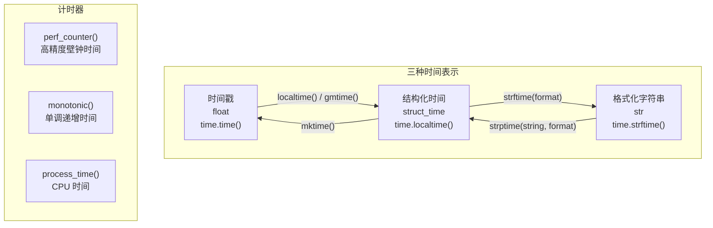

### 3.2 核心函数对比

| 函数 | 返回值 | 精度 | 是否受 NTP 跳变影响 | 适用场景 |
|:-----|:-------|:-----|:-------------------|:---------|
| `time.time()` | Unix 时间戳 (float) | 微秒 | ⚠️ 是 | 日志记录、时间戳存储 |
| `time.perf_counter()` | 高精度壁钟时间 | 纳秒 | ⚠️ 是 | 性能测量、代码计时 |
| `time.monotonic()` | 单调递增时间 | 纳秒 | ✅ 否 | 超时检测、间隔计算 |
| `time.process_time()` | 当前进程 CPU 时间 | 微秒 | N/A | CPU 密集度分析 |
| `time.thread_time()` | 当前线程 CPU 时间 | 微秒 | N/A | 线程级 CPU 分析 (3.7+) |

**计时器选型决策**：

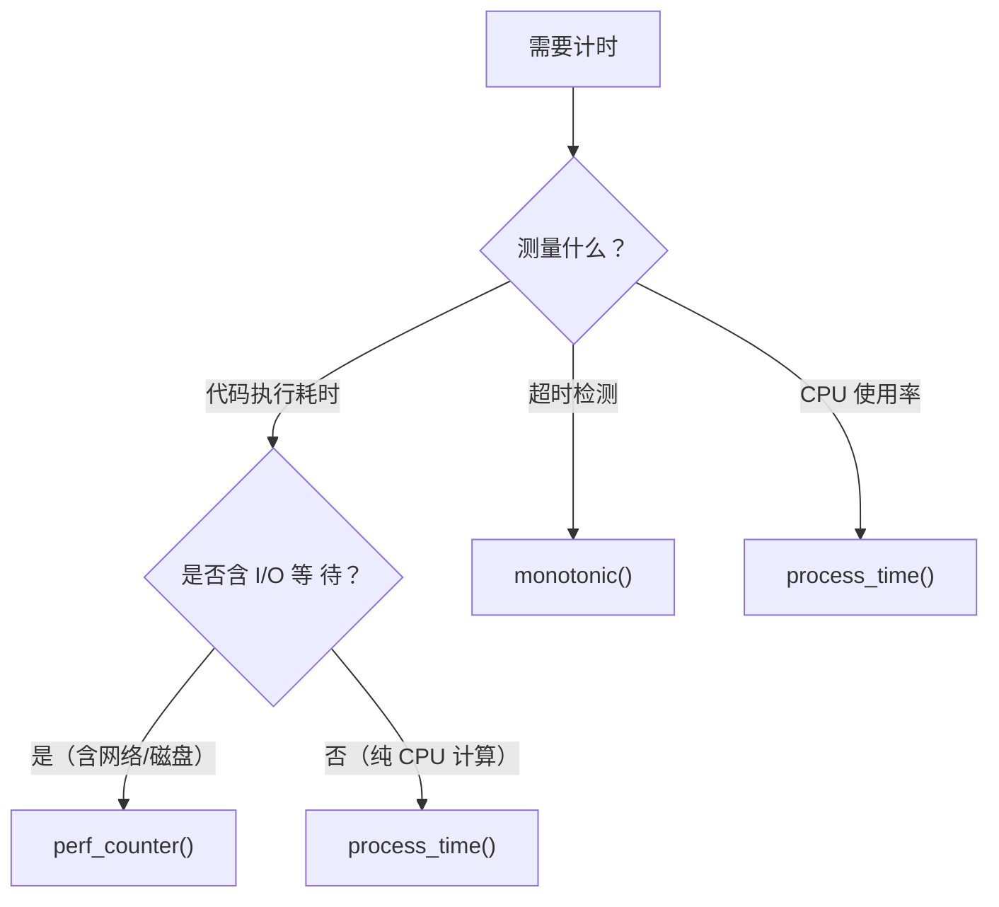

### 3.3 结构化时间（struct_time）

```python
import time

# 获取当前本地时间的 struct_time
t = time.localtime()
# time.struct_time(
#     tm_year=2024,    # 年
#     tm_mon=6,        # 月 (1-12)
#     tm_mday=6,       # 日 (1-31)
#     tm_hour=14,      # 时 (0-23)
#     tm_min=30,       # 分 (0-59)
#     tm_sec=0,        # 秒 (0-61，闰秒)
#     tm_wday=3,       # 星期 (0=周一 ... 6=周日)
#     tm_yday=158,     # 年内天数 (1-366)
#     tm_isdst=0       # 夏令时标志 (-1=未知, 0=否, 1=是)
# )

# struct_time ↔ 时间戳
ts = time.mktime(t)           # → 1717651800.0
t2 = time.localtime(ts)       # → struct_time

# struct_time ↔ 格式化字符串
s = time.strftime('%Y-%m-%d %H:%M:%S', t)    # → '2024-06-06 14:30:00'
t3 = time.strptime(s, '%Y-%m-%d %H:%M:%S')   # → struct_time
```

### 3.4 最佳实践与常见陷阱

```python
import time

# ✅ 正确的计时方式
start = time.perf_counter()
# ... 执行代码 ...
elapsed = time.perf_counter() - start
print(f"耗时: {elapsed:.4f}s")

# ✅ 正确的超时检测（不受系统时钟跳变影响）
deadline = time.monotonic() + 30  # 30秒超时
while time.monotonic() < deadline:
    # ... 执行任务 ...
    break

# ✅ 纳秒精度计时（Python 3.7+）
start_ns = time.perf_counter_ns()
# ... 执行代码 ...
elapsed_ns = time.perf_counter_ns() - start_ns
print(f"耗时: {elapsed_ns / 1_000_000:.2f}ms")
```

::: danger 常见陷阱
1. **`time.sleep()` 精度**：最小精度约 15ms（Windows），不适用于毫秒级定时
2. **`time.time()` 受 NTP 影响**：系统时钟校时会导致时间戳跳变，超时检测应用 `monotonic()`
3. **`time.localtime()` vs `time.gmtime()`**：前者转本地时区，后者转 UTC，混淆会导致时区偏差
4. **struct_time 的 tm_wday**：0 表示周一而非周日（与 `datetime.weekday()` 一致，但不同于 `isoweekday()`）
:::

→ **深入阅读**：[时间模块详解](03-内置模块/07-时间模块)

---

## 四、random 模块

### 4.1 随机数生成架构

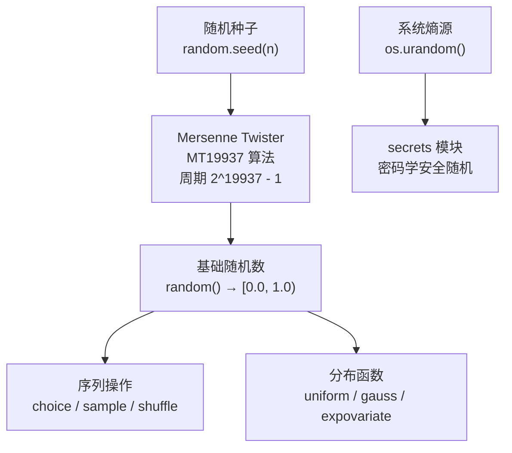

::: info Mersenne Twister 算法
Python 的 `random` 模块使用 MT19937 算法，周期长度为 2^19937 - 1，通过所有常用统计测试。但它是**伪随机数生成器（PRNG）**，不适合密码学场景。
:::

### 4.2 API 分类速查

| 分类 | 函数 | 说明 | 示例 |
|:-----|:-----|:-----|:-----|
| **基础随机** | `random()` | [0.0, 1.0) 浮点数 | `0.8947...` |
| | `uniform(a, b)` | [a, b] 范围浮点数 | `7.32` |
| | `randint(a, b)` | [a, b] 范围整数 | `5` |
| | `randrange(start, stop, step)` | 指定步长范围整数 | `10, 13, 16...` |
| **序列操作** | `choice(seq)` | 随机选一个元素 | `'b'` |
| | `choices(seq, k=n, weights=...)` | 有放回随机选 n 个 | `['a', 'a', 'b']` |
| | `sample(seq, k)` | 无放回随机选 k 个 | `['a', 'c']` |
| | `shuffle(seq)` | 原地打乱序列 | — |
| **分布函数** | `gauss(mu, sigma)` | 正态分布 | — |
| | `expovariate(lambd)` | 指数分布 | — |
| | `triangular(low, high, mode)` | 三角分布 | — |

### 4.3 随机种子与线程安全

```python
import random

# ── 随机种子：确保可复现 ────────────────────────────
random.seed(42)
print(random.random())   # 0.6394267984578837（每次运行相同）
print(random.randint(1, 10))  # 2

random.seed(42)          # 重置种子后序列重新开始
print(random.random())   # 0.6394267984578837（相同）

# ── 线程安全问题 ──────────────────────────────────
# random 模块的全局状态不是线程安全的！
# 多线程环境应使用独立的 Random 实例：
import threading

def worker(seed_val):
    local_rng = random.Random(seed_val)  # 每个线程独立实例
    print(local_rng.random())

threads = [threading.Thread(target=worker, args=(i,)) for i in range(4)]
for t in threads:
    t.start()
```

### 4.4 安全随机 vs 伪随机

```python
import random
import secrets

# ❌ 伪随机——不适合密码学
token = ''.join(random.choices('abcdefghijklmnopqrstuvwxyz0123456789', k=16))
# 可预测！知道种子就能重现

# ✅ 安全随机——密码学安全
token = secrets.token_urlsafe(16)      # 'xZ7vQk2mPn4bRt9w'
password = secrets.token_hex(16)        # 'a1b2c3d4e5f6...'（32个十六进制字符）
rand_int = secrets.randbelow(100)       # [0, 100) 安全随机整数
```

| 场景 | 使用 `random` | 使用 `secrets` |
|:-----|:-------------|:---------------|
| 测试数据生成 | ✅ | ❌ 杀鸡用牛刀 |
| 游戏随机事件 | ✅ | ❌ |
| 抽奖/模拟 | ✅ | ❌ |
| 密码/token 生成 | ❌ 可预测 | ✅ |
| CSRF nonce | ❌ | ✅ |
| 密钥派生 | ❌ | ✅ |

### 4.5 实战案例

```python
import random
from collections import Counter

# ── 加权随机（如抽奖概率）─────────────────────────────
prizes = ['一等奖', '二等奖', '三等奖', '谢谢参与']
weights = [1, 5, 20, 74]    # 概率权重（1% / 5% / 20% / 74%）

results = random.choices(prizes, weights=weights, k=10000)
print(Counter(results))
# Counter({'谢谢参与': 7400, '三等奖': 2000, '二等奖': 500, '一等奖': 100})

# ── 蒙特卡洛模拟：估算 π ──────────────────────────
def estimate_pi(n: int) -> float:
    """在单位正方形内随机投点，落在内切圆内的比例 ≈ π/4"""
    inside = 0
    for _ in range(n):
        x, y = random.random(), random.random()
        if x**2 + y**2 <= 1:
            inside += 1
    return 4 * inside / n

print(f"π ≈ {estimate_pi(1_000_000):.4f}")  # π ≈ 3.1416
```

::: danger 常见陷阱
1. **`random` 不是密码学安全的**：生成 token/密码/密钥必须用 `secrets` 模块
2. **多线程竞争**：`random` 的全局状态非线程安全，多线程应用使用独立 `Random()` 实例
3. **`shuffle()` 只支持可变序列**：对 tuple/str 需先转 list
4. **`sample()` 不修改原序列**：与 `shuffle()` 的原地修改行为不同
5. **种子设置时机**：在生产代码中不要固定种子，仅在测试/复现时使用
:::

→ **深入阅读**：[数学与数值计算](03-内置模块/08-数学与数值计算)

---

## 五、json 模块

### 5.1 JSON 处理架构

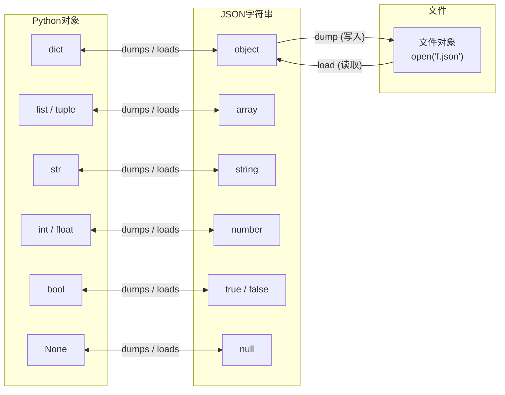

### 5.2 类型映射完整对照

| Python 类型 | JSON 类型 | 说明 | 边缘情况 |
|:-----------|:---------|:-----|:---------|
| `dict` | object | 键必须是字符串 | 非 str 键默认报错（`skipkeys=True` 跳过） |
| `list`, `tuple` | array | tuple 序列化为数组 | 反序列化后变为 list（丢失 tuple 信息） |
| `str` | string | — | — |
| `int` | number | — | 超大整数可能丢失精度（JavaScript 限制） |
| `float` | number | — | `NaN`/`Infinity` 默认报错（`allow_nan=True` 允许） |
| `bool` | true/false | — | — |
| `None` | null | — | — |
| `datetime` ❌ | — | 不支持 | 需自定义序列化 |
| `set` ❌ | — | 不支持 | 需转为 list |
| `bytes` ❌ | — | 不支持 | 需 base64 编码 |
| `Decimal` ❌ | — | 不支持 | 需转为 float 或 str |

### 5.3 API 详解

```python
import json

# ═══════════════════════════════════════════════════
# 核心四函数
# ═══════════════════════════════════════════════════

# 1. dumps：Python 对象 → JSON 字符串
json_str = json.dumps(
    obj,                   # 要序列化的对象
    indent=2,              # 缩进空格数（美化输出）
    ensure_ascii=False,    # 允许非 ASCII（中文不转义）
    sort_keys=True,        # 按键名排序
    separators=(',', ':'), # 自定义分隔符（紧凑输出）
    default=str,           # 不可序列化类型的回退函数
)

# 2. loads：JSON 字符串 → Python 对象
obj = json.loads(
    json_str,              # JSON 字符串
    object_hook=None,      # 自定义 dict 解码回调
    parse_float=float,     # 自定义浮点数解析（如用 Decimal）
    parse_int=int,         # 自定义整数解析
)

# 3. dump：Python 对象 → 写入文件
with open('data.json', 'w', encoding='utf-8') as f:
    json.dump(obj, f, indent=2, ensure_ascii=False)

# 4. load：从文件读取 → Python 对象
with open('data.json', 'r', encoding='utf-8') as f:
    obj = json.load(f)
```

### 5.4 自定义序列化

```python
import json
from datetime import datetime, date
from decimal import Decimal

# ── 方式 1：JSONEncoder 子类（推荐）──────────────────
class EnhancedEncoder(json.JSONEncoder):
    """支持 datetime/date/Decimal/set 的自定义编码器"""

    def default(self, obj):
        if isinstance(obj, datetime):
            return obj.isoformat()          # ISO 8601 格式
        if isinstance(obj, date):
            return obj.isoformat()
        if isinstance(obj, Decimal):
            return str(obj)                  # 避免浮点精度损失
        if isinstance(obj, set):
            return sorted(obj)               # 转为排序列表
        return super().default(obj)          # 其他类型抛 TypeError

# 使用
data = {
    'event': 'created',
    'timestamp': datetime.now(),
    'price': Decimal('19.99'),
    'tags': {'python', 'json'},
}
print(json.dumps(data, cls=EnhancedEncoder, ensure_ascii=False, indent=2))
# {
#   "event": "created",
#   "timestamp": "2024-06-06T14:30:00.123456",
#   "price": "19.99",
#   "tags": ["json", "python"]
# }

# ── 方式 2：object_hook 自定义解码 ──────────────────
def decode_datetime(dct):
    """自动识别 ISO 格式的时间字符串并转回 datetime"""
    for key, value in dct.items():
        if isinstance(value, str) and 'T' in value:
            try:
                dct[key] = datetime.fromisoformat(value)
            except ValueError:
                pass
    return dct

obj = json.loads(json_str, object_hook=decode_datetime)
```

### 5.5 性能对比

| 库 | 速度 | 安装 | 特点 |
|:----|:-----|:-----|:-----|
| `json`（标准库） | 基准 1× | 内置 | 稳定可靠，功能完整 |
| `orjson` | 5-10× | `pip install orjson` | 最快，支持 datetime/numpy，输出 bytes |
| `ujson` | 2-3× | `pip install ujson` | 较快，但不支持 `default` 参数 |
| `simdjson` | 3-5× | `pip install pysimdjson` | 仅解析快，序列化用标准库 |

```python
# orjson 用法示例
import orjson

data = {'name': '张三', 'age': 25}
json_bytes = orjson.dumps(data)          # 返回 bytes
json_str = json_bytes.decode('utf-8')    # 转为 str

# orjson 自动处理 datetime
from datetime import datetime
data = {'ts': datetime.now()}
json_bytes = orjson.dumps(data)          # 直接序列化，无需自定义 Encoder
```

::: danger 常见陷阱
1. **中文乱码**：`dumps` 默认 `ensure_ascii=True`，中文会转义为 `\uXXXX`；设置 `ensure_ascii=False` 解决
2. **日期不可序列化**：`datetime`/`date` 对象默认无法序列化，需自定义 `JSONEncoder`
3. **循环引用**：对象互相引用会导致 `ValueError`，需设计无环数据结构
4. **大文件内存**：`json.load()` 一次性加载整个文件，大 JSON（>100MB）考虑流式解析 `ijson`
5. **整数精度**：JavaScript 的 `Number` 安全整数范围是 ±2^53，超大 Python 整数传给 JS 可能丢失精度
:::

→ **深入阅读**：[存储模块详解](03-内置模块/06-存储模块)

---

## 六、re 模块

### 6.1 正则引擎架构

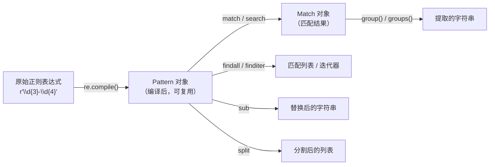

### 6.2 核心函数对比

| 函数 | 匹配范围 | 返回值 | 适用场景 |
|:-----|:---------|:-------|:---------|
| `re.match(pattern, string)` | 仅字符串**开头** | Match 或 None | 验证格式（如校验手机号） |
| `re.search(pattern, string)` | 字符串**任意位置**（第一个） | Match 或 None | 查找单个匹配 |
| `re.findall(pattern, string)` | 字符串**全部** | 列表（字符串或元组） | 提取所有匹配项 |
| `re.finditer(pattern, string)` | 字符串**全部** | Match 迭代器 | 大量匹配时节省内存 |
| `re.sub(pattern, repl, string)` | 字符串**全部** | 新字符串 | 替换/脱敏 |
| `re.split(pattern, string)` | 字符串**全部** | 列表 | 复杂分割 |

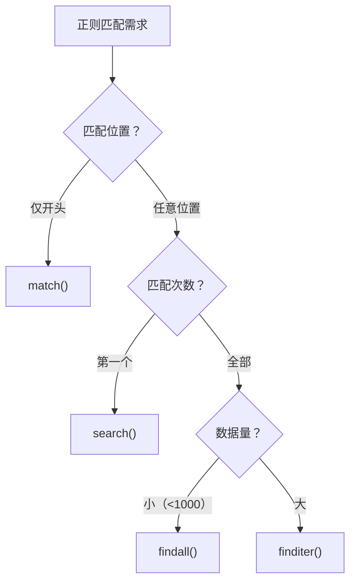

### 6.3 元字符完整参考

| 元字符 | 含义 | 示例 | 匹配 |
|:-------|:-----|:-----|:-----|
| `.` | 任意字符（除换行） | `a.c` | abc, a1c, a c |
| `^` | 字符串开头 | `^Hello` | Hello world |
| `$` | 字符串结尾 | `world$` | Hello world |
| `*` | 前一个 0 次或多次 | `ab*c` | ac, abc, abbc |
| `+` | 前一个 1 次或多次 | `ab+c` | abc, abbc |
| `?` | 前一个 0 次或 1 次 | `ab?c` | ac, abc |
| `{n}` | 恰好 n 次 | `a{3}` | aaa |
| `{n,m}` | n 到 m 次 | `a{2,4}` | aa, aaa, aaaa |
| `[]` | 字符集 | `[aeiou]` | a, e, i, o, u |
| `[^]` | 排除字符集 | `[^0-9]` | 非数字 |
| `|` | 或 | `cat|dog` | cat 或 dog |
| `()` | 捕获分组 | `(ab)+` | ab, abab |
| `\d` | 数字 `[0-9]` | `\d{3}` | 123 |
| `\w` | 单词字符 `[a-zA-Z0-9_]` | `\w+` | hello_1 |
| `\s` | 空白字符 | `\s+` | 空格/制表/换行 |
| `\b` | 单词边界 | `\bcat\b` | 独立的 cat |
| `(?P<name>...)` | 命名分组 | `(?P<year>\d{4})` | 按名称引用 |
| `(?:...)` | 非捕获分组 | `(?:ab)+` | 分组但不捕获 |
| `(?=...)` | 正向前瞻 | `\d+(?=元)` | 后面跟"元"的数字 |
| `(?!...)` | 负向前瞻 | `\d+(?!元)` | 后面不跟"元"的数字 |

### 6.4 常用标志

```python
import re

# re.IGNORECASE (re.I) - 忽略大小写
re.search(r'hello', 'HELLO', re.I)        # 匹配成功

# re.MULTILINE (re.M) - ^ 和 $ 匹配每行的开头和结尾
text = "第一行\n第二行\n第三行"
re.findall(r'^第\w+行', text, re.M)        # ['第一行', '第二行', '第三行']

# re.DOTALL (re.S) - . 也匹配换行符
re.search(r'a.*b', 'a\nb', re.S)          # 匹配成功

# re.VERBOSE (re.X) - 允许注释和空白，提高可读性
pattern = re.compile(r'''
    \d{3}      # 区号
    -?         # 可选的连字符
    \d{4}      # 前四位
    -?         # 可选的连字符
    \d{4}      # 后四位
''', re.X)
```

### 6.5 分组与命名分组

```python
import re

# ── 普通分组 ──────────────────────────────────────
date_pattern = r'(\d{4})-(\d{2})-(\d{2})'
match = re.match(date_pattern, '2024-01-15')
match.group(0)    # '2024-01-15'（完整匹配）
match.group(1)    # '2024'（年）
match.group(2)    # '01'（月）
match.groups()    # ('2024', '01', '15')

# ── 命名分组（推荐）──────────────────────────────
named_pattern = r'(?P<year>\d{4})-(?P<month>\d{2})-(?P<day>\d{2})'
match = re.match(named_pattern, '2024-01-15')
match.group('year')      # '2024'
match.groupdict()        # {'year': '2024', 'month': '01', 'day': '15'}

# ── 替换中引用分组 ─────────────────────────────────
# 隐藏手机号中间四位
phone = '13812345678'
hidden = re.sub(r'(\d{3})\d{4}(\d{4})', r'\1****\2', phone)
print(hidden)             # '138****5678'
```

### 6.6 编译与性能

```python
import re

# 频繁使用的正则表达式应编译为 Pattern 对象
# 内部缓存机制：re 模块会缓存最近 _MAXCACHE (64) 个编译结果
# 但显式编译更清晰，且避免缓存失效

# ✅ 编译一次，多次使用
phone_re = re.compile(r'1[3-9]\d{9}')
texts = ['手机: 13812345678', '电话: 18987654321']
for text in texts:
    match = phone_re.search(text)
    if match:
        print(match.group())

# ✅ 使用回调函数进行高级替换
def double_num(match):
    return str(int(match.group()) * 2)

result = re.sub(r'\d+', double_num, 'Hello 123 World 456')
print(result)  # 'Hello 246 World 912'
```

::: danger 常见陷阱
1. **贪婪 vs 非贪婪**：`.*` 是贪婪的（匹配尽可能多），`.*?` 是非贪婪的——抓取 HTML 内容时必须用非贪婪
2. **`re.DOTALL` 误用**：默认 `.` 不匹配 `\n`，用 `re.S` 会让 `.*` 匹配整个文件
3. **性能灾难**：嵌套量词如 `(a+)+` 会导致回溯爆炸，对长字符串可能卡死——使用原子分组或重写正则
4. **`match()` 只匹配开头**：很多人误以为 `match()` 会搜索任意位置，实际它等同于 `^pattern`
5. **Unicode 处理**：`\w` 在 Python 3 中匹配 Unicode 字母（含中文），如需仅 ASCII 可用 `[a-zA-Z0-9_]`
:::

→ **深入阅读**：[数据解析全攻略](/docs/python/Web与爬虫/爬虫/02-数据解析全攻略)

---

## 七、itertools 模块

### 7.1 itertools 架构分类

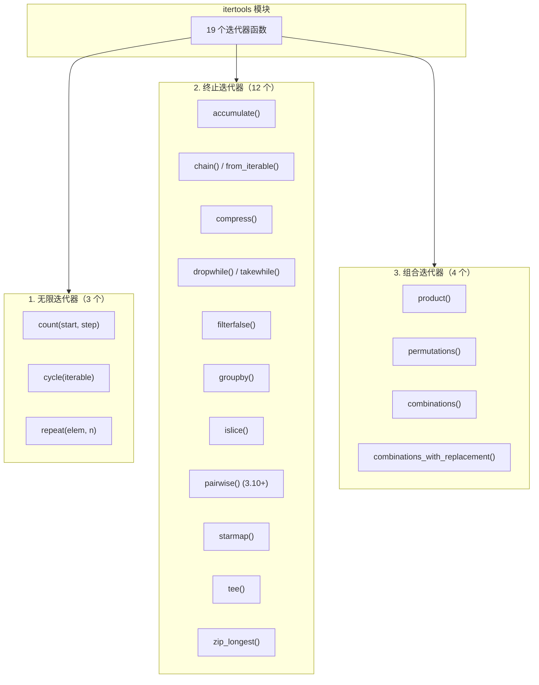

> **核心原则**：所有 itertools 函数都返回**惰性迭代器**——仅在需要时才产生下一个元素，内存占用极低。

### 7.2 核心函数速查

| 函数 | 输入 | 输出 | 典型场景 |
|:-----|:-----|:-----|:---------|
| `count(10, 2)` | 起始值, 步长 | 10, 12, 14, ... | 生成编号序列 |
| `cycle('ABC')` | 可迭代对象 | A, B, C, A, B, ... | 循环轮换（如交替颜色） |
| `repeat(10, 3)` | 元素, 次数 | 10, 10, 10 | 填充常量值 |
| `chain(a, b)` | 多个可迭代对象 | 拼接后的迭代器 | 合并多个列表/生成器 |
| `chain.from_iterable([[1,2],[3]])` | 嵌套可迭代 | 1, 2, 3 | 扁平化一层嵌套 |
| `groupby(data, key)` | 排序后的数据 | (key, group) 对 | 按键分组统计 |
| `islice(iter, start, stop)` | 迭代器, 切片参数 | 切片后的迭代器 | 对迭代器做切片 |
| `zip_longest(a, b, fillvalue)` | 多个迭代器 | 最长对齐的 zip | 长度不等的并行遍历 |
| `product(A, B)` | 多个可迭代对象 | 笛卡尔积 | 所有组合 |
| `permutations('ABC', 2)` | 可迭代对象, 长度 | 排列 | AB, AC, BA, BC, CA, CB |
| `combinations('ABC', 2)` | 可迭代对象, 长度 | 组合（无重复） | AB, AC, BC |
| `accumulate([1,2,3])` | 可迭代对象, 函数 | 累积结果 | 前缀和/累积乘积 |
| `pairwise('ABCD')` | 可迭代对象 | 相邻对 (3.10+) | AB, BC, CD |

### 7.3 迭代器管道组合模式

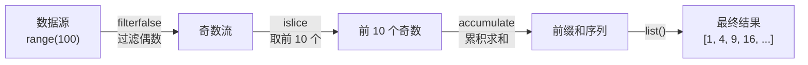

```python
import itertools
import operator

# ── 管道式处理：惰性计算，内存极低 ──────────────────
result = list(
    itertools.islice(                       # 第3步：取前 10 个
        itertools.accumulate(               # 第2步：累积求和
            itertools.filterfalse(          # 第1步：过滤偶数
                lambda x: x % 2 == 0,
                range(100)
            )
        ),
        10
    )
)
print(result)  # [1, 4, 9, 16, 25, 36, 49, 64, 81, 100]

# ── groupby：按键分组（必须先排序！）───────────────
data = [('a', 1), ('a', 2), ('b', 1), ('b', 2), ('a', 3)]
data.sort(key=lambda x: x[0])  # ⚠️ 必须先排序！

for key, group in itertools.groupby(data, key=lambda x: x[0]):
    print(key, list(group))
# a [('a', 1), ('a', 2)]
# b [('b', 1), ('b', 2)]
# a [('a', 3)]

# ── chain.from_iterable：优雅的扁平化 ──────────────
nested = [[1, 2, 3], [4, 5], [6, 7, 8, 9]]
flat = list(itertools.chain.from_iterable(nested))
print(flat)  # [1, 2, 3, 4, 5, 6, 7, 8, 9]

# ── product：笛卡尔积 ─────────────────────────────
suits = ['♠', '♥', '♦', '♣']
ranks = ['A', '2', '3', '4', '5', '6', '7', '8', '9', '10', 'J', 'Q', 'K']
deck = list(itertools.product(ranks, suits))
print(len(deck))  # 52（13 种点数 × 4 种花色）
```

::: danger 常见陷阱
1. **groupby 必须先排序**：`groupby` 只合并相邻的相同键，未排序的数据会导致同一键被拆成多组
2. **迭代器耗尽**：迭代器只能遍历一次，遍历后为空；需要多次遍历用 `list()` 转换或 `tee()` 复制
3. **tee 的内存代价**：`tee(iter, n)` 创建 n 个独立迭代器，但新元素会在内部缓存直到所有副本都消费——一个副本拖后腿，内存就涨
4. **islice 不支持负索引**：与列表切片不同，`islice(iter, -3)` 会抛异常
:::

→ **深入阅读**：[itertools 模块详解](03-内置模块/12-itertools)

---

## 八、functools 模块

### 8.1 functools 架构

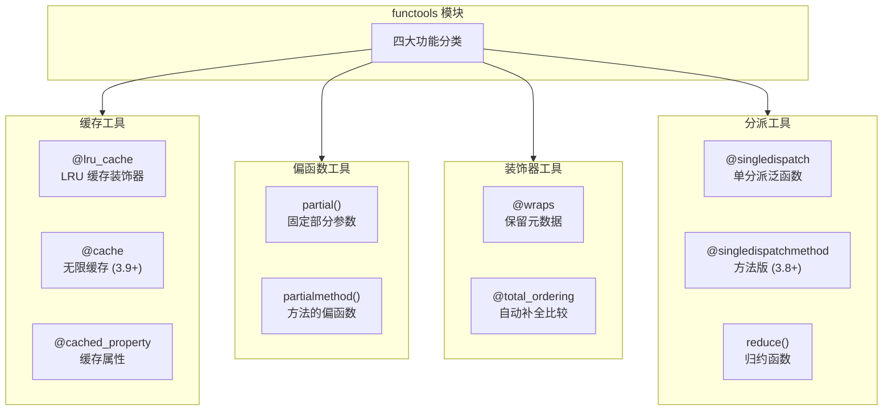

### 8.2 核心工具对比

| 工具 | 一句话说明 | 典型用途 | 使用频率 |
|:-----|:-----------|:---------|:---------|
| `@lru_cache` | LRU 策略缓存函数结果 | 递归优化、重复计算 | ⭐⭐⭐⭐⭐ |
| `@cache` | 无限缓存（3.9+） | 简单缓存场景 | ⭐⭐⭐ |
| `@cached_property` | 属性只计算一次后缓存 | 延迟计算、昂贵属性 | ⭐⭐⭐⭐ |
| `partial()` | 固定函数部分参数 | 回调函数、API 适配 | ⭐⭐⭐⭐ |
| `@wraps` | 保留被装饰函数的元数据 | 装饰器开发必备 | ⭐⭐⭐⭐⭐ |
| `@singledispatch` | 根据参数类型分派实现 | 类型重载 | ⭐⭐⭐ |
| `@total_ordering` | 只写 2 个方法补全 6 个比较 | 自定义排序 | ⭐⭐ |
| `reduce()` | 累积归约 | 累积计算 | ⭐⭐ |

### 8.3 lru_cache 深度讲解

```python
import functools
import time

# ── 基本用法 ──────────────────────────────────────
@functools.lru_cache(maxsize=128)
def fibonacci(n):
    if n < 2:
        return n
    return fibonacci(n-1) + fibonacci(n-2)

print(fibonacci(100))                   # 瞬间完成（无缓存时指数级慢）
print(fibonacci.cache_info())
# CacheInfo(hits=98, misses=101, maxsize=128, currsize=101)

# ── maxsize 选择策略 ─────────────────────────────
# maxsize=None  → 无限缓存，适合参数空间有限且命中率高的场景
# maxsize=128   → 默认值，适合大多数场景
# maxsize=2**n  → LRU 内部用双向链表，2 的幂次方性能更优

# ── cache_info 诊断 ──────────────────────────────
info = fibonacci.cache_info()
hit_rate = info.hits / (info.hits + info.misses) if info.hits + info.misses else 0
print(f"命中率: {hit_rate:.1%}")

# ── 线程安全 ──────────────────────────────────────
# lru_cache 是线程安全的：更新操作由 GIL 保护
# 但如果缓存函数本身有副作用，仍需自行加锁

# ── 清除缓存 ──────────────────────────────────────
fibonacci.cache_clear()
```

### 8.4 partial 与 wraps

```python
import functools

# ── partial：固定部分参数 ──────────────────────────
def power(base, exp):
    return base ** exp

square = functools.partial(power, exp=2)     # 固定 exp=2
cube = functools.partial(power, exp=3)       # 固定 exp=3
print(square(4))   # 16
print(cube(3))     # 27

# 实际应用：固定 API 参数
import json
json_utf8 = functools.partial(json.dumps, ensure_ascii=False, indent=2)
print(json_utf8({'name': '张三'}))
# {
#   "name": "张三"
# }

# ── wraps：保留被装饰函数的元数据 ──────────────────
def my_decorator(func):
    @functools.wraps(func)  # ← 必须！否则 __name__ 变成 'wrapper'
    def wrapper(*args, **kwargs):
        print("函数调用前")
        result = func(*args, **kwargs)
        print("函数调用后")
        return result
    return wrapper

@my_decorator
def greet(name):
    """问候函数"""
    return f"Hello, {name}!"

print(greet.__name__)   # 'greet'（不是 'wrapper'）
print(greet.__doc__)    # '问候函数'
```

### 8.5 singledispatch 类型分派

```python
import functools

@functools.singledispatch
def process(obj):
    """通用处理函数——根据第一个参数的类型自动分派"""
    raise NotImplementedError(f"不支持的类型: {type(obj)}")

@process.register
def _(obj: int):
    return f"处理整数: {obj * 2}"

@process.register
def _(obj: str):
    return f"处理字符串: {obj.upper()}"

@process.register
def _(obj: list):
    return f"处理列表: 长度 {len(obj)}"

print(process(10))          # '处理整数: 20'
print(process("hello"))     # '处理字符串: HELLO'
print(process([1, 2, 3]))   # '处理列表: 长度 3'
```

::: danger 常见陷阱
1. **lru_cache 内存泄漏**：缓存会持有参数和结果的引用，如果参数是大对象，可能导致内存持续增长——设置合理的 `maxsize`
2. **不可哈希参数**：`lru_cache` 要求参数可哈希，list/dict/set 会报 `TypeError`——用 `tuple` 替代
3. **wraps 不是装饰器万能药**：它只复制 `__name__`/`__doc__`/`__module__` 等，不复制函数签名——用 `inspect.signature()` 验证
4. **partial 的 `__wrapped__`**：`partial` 对象没有 `__wrapped__` 属性，无法直接获取原函数
:::

→ **深入阅读**：[functools 模块详解](03-内置模块/17-functools)

---

## 九、pathlib 模块

### 9.1 pathlib vs os.path 对比

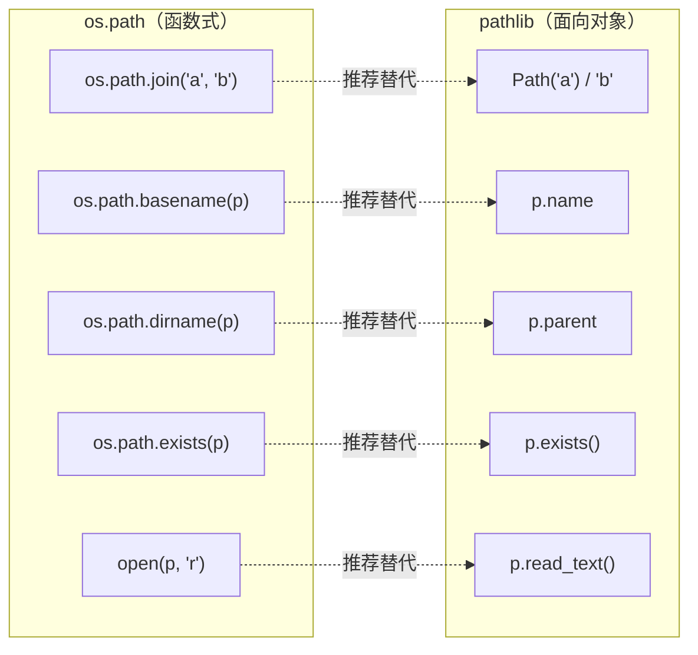

### 9.2 Path 类核心属性/方法

| 属性/方法 | 说明 | 示例 |
|:---------|:-----|:-----|
| `Path.cwd()` | 当前工作目录 | `/Users/docs` |
| `Path.home()` | 用户主目录 | `/Users/xiaoye` |
| `p.name` | 文件名（含扩展名） | `file.txt` |
| `p.stem` | 文件名（无扩展名） | `file` |
| `p.suffix` | 扩展名 | `.txt` |
| `p.suffixes` | 所有扩展名 | `['.tar', '.gz']` |
| `p.parent` | 父目录 | `/Users/docs` |
| `p.parents` | 所有父目录（迭代器） | 逐级向上 |
| `p.parts` | 路径各部分元组 | `('/', 'Users', 'docs', 'file.txt')` |
| `p.exists()` | 是否存在 | `True/False` |
| `p.is_file()` | 是否文件 | `True/False` |
| `p.is_dir()` | 是否目录 | `True/False` |
| `p.resolve()` | 绝对路径（解析符号链接） | 完整绝对路径 |
| `p.mkdir()` | 创建目录 | `parents=True, exist_ok=True` |
| `p.touch()` | 创建空文件 | — |
| `p.unlink()` | 删除文件 | `missing_ok=True` (3.8+) |
| `p.rmdir()` | 删除空目录 | — |
| `p.rename(target)` | 重命名/移动 | — |
| `p.iterdir()` | 遍历目录 | 返回 Path 迭代器 |
| `p.glob(pattern)` | 模式匹配 | `*.txt` |
| `p.rglob(pattern)` | 递归模式匹配 | `**/*.py` |
| `p.read_text()` | 读取文本文件 | 返回 `str` |
| `p.write_text()` | 写入文本文件 | — |
| `p.read_bytes()` | 读取二进制文件 | 返回 `bytes` |
| `p.write_bytes()` | 写入二进制文件 | — |

### 9.3 实战示例

```python
from pathlib import Path

# ── 路径拼接（使用 / 运算符，比 os.path.join 更直观）──
base = Path('/Users/docs')
data_dir = base / 'project' / 'data'
config = base / 'config' / 'app.json'

# ── 文件读写（一行代码完成）──────────────────────────
# 写入
Path('output.txt').write_text('Hello, World!', encoding='utf-8')

# 读取
content = Path('output.txt').read_text(encoding='utf-8')

# 追加（需用 open 方法）
with Path('output.txt').open('a', encoding='utf-8') as f:
    f.write('\nNew line')

# ── 目录遍历 ──────────────────────────────────────
# 遍历直接子项
for item in Path('data').iterdir():
    if item.is_file():
        print(f"文件: {item.name} ({item.stat().st_size} bytes)")
    elif item.is_dir():
        print(f"目录: {item.name}/")

# 递归查找所有 Python 文件
for py_file in Path('.').rglob('*.py'):
    print(py_file)

# ── 批量操作 ──────────────────────────────────────
# 查找并处理所有日志文件
for log_file in Path('logs').glob('*.log'):
    content = log_file.read_text()
    if 'ERROR' in content:
        error_log = Path('errors') / log_file.name
        error_log.parent.mkdir(parents=True, exist_ok=True)
        error_log.write_text(content)
```

::: danger 常见陷阱
1. **Path 对象不可哈希**：`Path` 对象不能作为 `dict` 的键或 `set` 的元素（Python 3.6 之前），3.6+ 已修复
2. **大文件 `read_text()` 内存**：一次性读取整个文件到内存，大文件（>100MB）应用 `open()` 逐行读取
3. **`write_text()` 覆盖写入**：默认清空文件再写入，追加内容需用 `open('a')`
4. **Windows 路径兼容**：`Path` 自动处理路径分隔符，但注意 Windows 盘符 `C:\` 的处理
5. **`glob` 结果排序**：`glob()` 返回的迭代器不保证顺序，需排序用 `sorted(Path('.').glob('*.py'))`
:::

→ **深入阅读**：[pathlib 模块详解](03-内置模块/05-pathlib模块)

---

## 十、typing 模块

### 10.1 类型系统架构

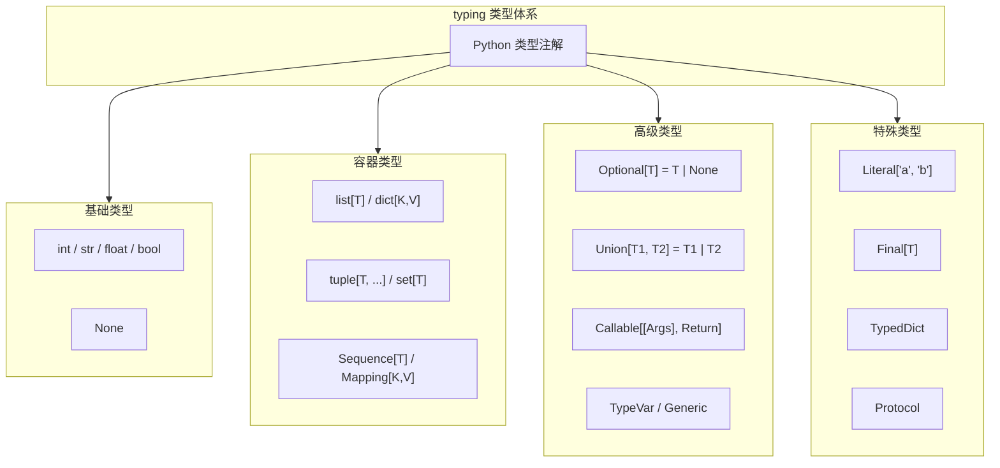

### 10.2 类型注解演进

| Python 版本 | 新增特性 | 示例 |
|:-----------|:---------|:-----|
| 3.5 | `typing` 模块首次引入 | `List[int]`, `Dict[str, int]` |
| 3.6 | 变量注解语法 | `x: int = 5` |
| 3.7 | `from __future__ import annotations` | 延迟求值注解 |
| 3.8 | `Protocol`, `TypedDict`, `Final` | 结构化子类型 |
| 3.9 | 内置泛型（PEP 585） | `list[int]` 替代 `List[int]` |
| 3.10 | `|` 联合语法（PEP 604） | `int | None` 替代 `Optional[int]` |
| 3.10 | `ParamSpec`, `Concatenate` | 更精确的可调用类型 |
| 3.11 | `Self`, `LiteralString` | 自引用类型 |
| 3.12 | `type` 语句（PEP 695） | `type Vector = list[float]` |

### 10.3 核心类型速查

```python
from typing import (
    Optional, Union, Callable, TypeVar, Generic,
    Protocol, TypeAlias, Final, Literal, TypedDict, Any, Never,
)

# ═══════════════════════════════════════════════════
# 基础类型注解
# ═══════════════════════════════════════════════════

# Python 3.9+ 使用内置泛型（推荐）
def process_items(
    items: list[str],           # 字符串列表
    mapping: dict[str, int],    # 字符串→整数的映射
    unique: set[int],           # 整数集合
    pair: tuple[str, int],      # 固定结构元组
) -> None:
    pass

# ═══════════════════════════════════════════════════
# Optional 与 Union
# ═══════════════════════════════════════════════════

# Python 3.10+ 新语法（推荐）
def find_user(user_id: int) -> str | None:
    users = {1: 'Alice', 2: 'Bob'}
    return users.get(user_id)

def process(value: int | str | float) -> str:
    return str(value)

# ═══════════════════════════════════════════════════
# Callable 可调用类型
# ═══════════════════════════════════════════════════

def apply_function(
    func: Callable[[int, int], int],  # 接受两个 int，返回 int
    a: int,
    b: int,
) -> int:
    return func(a, b)

# ═══════════════════════════════════════════════════
# TypeVar 与 Generic
# ═══════════════════════════════════════════════════

T = TypeVar('T')

def first_item(items: list[T]) -> T:
    """返回列表第一个元素，保持类型"""
    return items[0]

class Stack(Generic[T]):
    def __init__(self) -> None:
        self._items: list[T] = []

    def push(self, item: T) -> None:
        self._items.append(item)

    def pop(self) -> T:
        return self._items.pop()

# ═══════════════════════════════════════════════════
# Protocol 协议（结构化子类型）
# ═══════════════════════════════════════════════════

class SupportsLength(Protocol):
    def __len__(self) -> int: ...

def get_size(obj: SupportsLength) -> int:
    return len(obj)

# 任何有 __len__ 方法的类型都兼容
get_size([1, 2, 3])    # OK
get_size("hello")      # OK

# ═══════════════════════════════════════════════════
# Literal 与 TypedDict
# ═══════════════════════════════════════════════════

def set_mode(mode: Literal['read', 'write', 'append']) -> None:
    pass

set_mode('read')    # OK
# set_mode('delete')  # 类型检查错误！

class UserDict(TypedDict):
    name: str
    age: int
    active: bool

user: UserDict = {'name': 'Alice', 'age': 25, 'active': True}
```

::: danger 常见陷阱
1. **运行时不强制类型**：类型注解只是"提示"，Python 运行时不会检查类型——静态检查依赖 mypy/pyright
2. **`List` vs `list`**：Python 3.9+ 推荐使用小写 `list[int]`，大写 `List[int]` 仅在 3.8 及以下需要
3. **前向引用**：类定义中引用自身类型需用字符串 `'ClassName'`（3.7+ 开启 `annotations` 后自动处理）
4. **`Any` 是类型安全的逃生舱**：滥用 `Any` 会让类型检查形同虚设，应尽量用具体类型或泛型
5. **`Optional[T]` 不等于"可选参数"**：`Optional[T]` 等价于 `T | None`，表示值可能为 None；可选参数用默认值 `x: int = 0`
:::

→ **深入阅读**：[typing 模块详解](03-内置模块/19-typing模块)

---

## 十一、跨模块协作模式

实际开发中，标准库模块往往需要组合使用。以下是常见的协作模式：

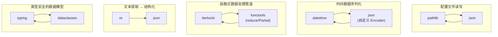

### 实战：pathlib + json 读写配置文件

```python
import json
from pathlib import Path
from datetime import datetime

class AppConfig:
    """类型安全的配置管理器"""

    CONFIG_PATH = Path('config.json')

    def __init__(self) -> None:
        self.config: dict = self._load()

    def _load(self) -> dict:
        """加载配置文件"""
        if not self.CONFIG_PATH.exists():
            return self._default_config()
        return json.loads(self.CONFIG_PATH.read_text(encoding='utf-8'))

    def _save(self) -> None:
        """保存配置文件"""
        self.CONFIG_PATH.write_text(
            json.dumps(self.config, ensure_ascii=False, indent=2),
            encoding='utf-8',
        )

    @staticmethod
    def _default_config() -> dict:
        return {
            'app_name': 'MyApp',
            'version': '1.0.0',
            'created_at': datetime.now().isoformat(),
            'debug': False,
        }

    def get(self, key: str, default=None):
        return self.config.get(key, default)

    def set(self, key: str, value) -> None:
        self.config[key] = value
        self._save()

# 使用
config = AppConfig()
print(config.get('app_name'))     # 'MyApp'
config.set('debug', True)          # 自动持久化
```

### 实战：itertools + functools 数据处理管道

```python
import itertools
import functools
import operator
from collections import Counter

# 统计文本中每个单词的词频，取前 N 个高频词
def top_words(text: str, n: int = 10) -> list[tuple[str, int]]:
    words = text.lower().split()
    word_counts = Counter(words)
    return word_counts.most_common(n)

# 使用 itertools 管道处理多文件
def process_files(directory: str, pattern: str = '*.txt') -> dict:
    from pathlib import Path

    # 管道：遍历文件 → 读取文本 → 统计词频 → 合并结果
    files = Path(directory).glob(pattern)
    all_words: list[str] = []

    for file_path in files:
        text = file_path.read_text(encoding='utf-8')
        words = text.lower().split()
        all_words.extend(words)

    # 使用 itertools + functools 进行高级统计
    total = len(all_words)
    unique = len(set(all_words))
    top = Counter(all_words).most_common(10)

    return {'total': total, 'unique': unique, 'top': top}
```

---

## 十二、最佳实践与常见陷阱汇总

### 12.1 导入顺序与分组规范

```python
# ═══════════════════════════════════════════════════
# PEP 8 推荐的导入分组（组间空一行）
# ═══════════════════════════════════════════════════

# 第1组：标准库
import json
import re
from datetime import datetime, timedelta
from pathlib import Path

# 第2组：第三方库
import requests
from bs4 import BeautifulSoup

# 第3组：本地模块
from myapp.config import settings
from myapp.utils import helper
```

### 12.2 标准库 vs 第三方库选型决策

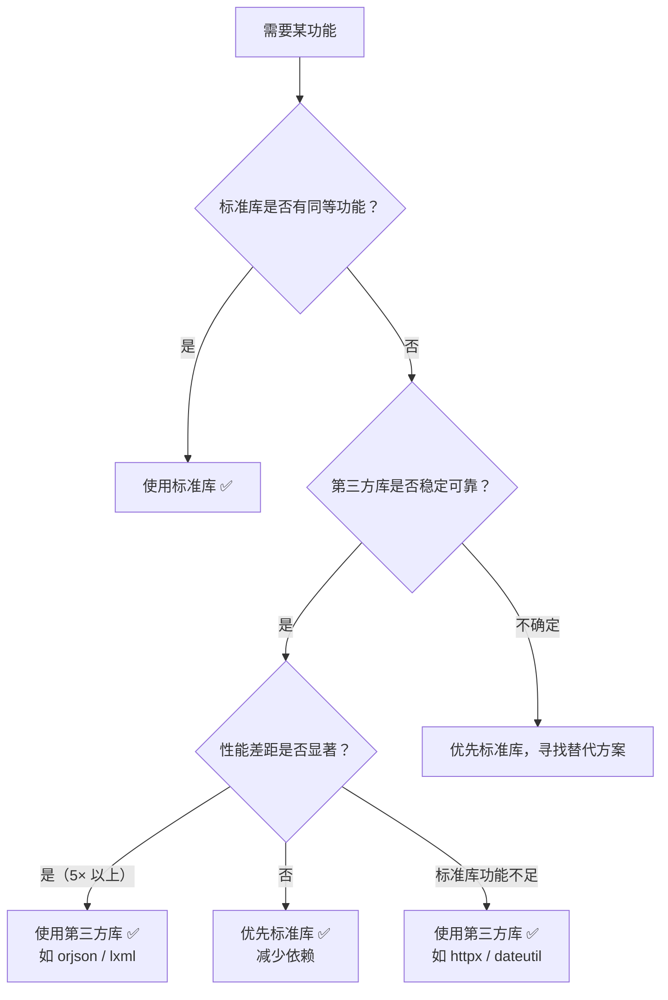

### 12.3 性能优化建议

| 模块 | 优化策略 | 效果 |
|:-----|:---------|:-----|
| `json` | 大文件用 `orjson` 或流式解析 `ijson` | 5-10× 提速 |
| `re` | 频繁使用的正则先 `compile` | 避免重复编译 |
| `functools` | 递归函数用 `@lru_cache` | 指数级 → 线性 |
| `itertools` | 大数据流用迭代器而非列表 | 内存降至 O(1) |
| `pathlib` | 小文件用 `read_text()`，大文件用 `open()` 逐行 | 避免大文件 OOM |
| `datetime` | 批量时间操作用 `pandas.Timestamp` | 向量化运算 |

### 12.4 常见陷阱 Top 10

| 排名 | 陷阱 | 模块 | 后果 | 解决方案 |
|:-----|:-----|:-----|:-----|:---------|
| 1 | `datetime.utcnow()` 返回 naive 对象 | datetime | 时区缺失导致 bug | `datetime.now(timezone.utc)` |
| 2 | `random` 用于生成密码/token | random | 可预测，安全风险 | 使用 `secrets` 模块 |
| 3 | `json.dumps` 中文转义 | json | `"张三"` 不可读 | `ensure_ascii=False` |
| 4 | `re.match()` 误认为全局搜索 | re | 只匹配开头，漏掉目标 | 用 `re.search()` |
| 5 | `groupby` 不排序直接分组 | itertools | 同键数据被拆成多组 | 先 `sort()` 再 `groupby()` |
| 6 | `lru_cache` 参数不可哈希 | functools | `TypeError` | 用 `tuple` 替代 `list` |
| 7 | 迭代器耗尽后继续使用 | itertools | 返回空结果 | 用 `list()` 缓存或 `tee()` 复制 |
| 8 | `time.time()` 受 NTP 跳变 | time | 超时检测失效 | 用 `time.monotonic()` |
| 9 | `Path.write_text()` 覆盖写入 | pathlib | 追加内容被清空 | 用 `open('a')` 模式 |
| 10 | 混用 naive/aware datetime | datetime | `TypeError` | 统一使用带时区的 datetime |

---

## 术语表

| 术语 | 英文 | 定义 |
|:-----|:-----|:-----|
| 时间戳 | Timestamp | 自 1970-01-01 00:00:00 UTC 以来的秒数（float） |
| Naive datetime | Naive datetime | 没有时区信息的 datetime 对象 |
| Aware datetime | Aware datetime | 带有时区信息的 datetime 对象 |
| 序列化 | Serialization | 将对象转换为可存储/传输的格式 |
| 反序列化 | Deserialization | 将存储/传输的格式还原为对象 |
| 正则表达式 | Regular Expression | 描述字符串匹配模式的形式语言 |
| 迭代器 | Iterator | 实现 `__iter__` 和 `__next__` 协议的惰性序列 |
| 惰性求值 | Lazy Evaluation | 仅在需要时才计算值的策略 |
| 偏函数 | Partial Function | 固定原函数部分参数后生成的新函数 |
| 类型注解 | Type Annotation | 为变量/函数添加类型信息的语法 |
| 类型变量 | TypeVar | 泛型编程中的类型占位符 |
| 协议 | Protocol | 基于结构的子类型（鸭子类型的静态版本） |
| LRU 缓存 | LRU Cache | 最近最少使用策略的缓存 |
| Mersenne Twister | Mersenne Twister | Python 默认的伪随机数生成算法 |

## 延伸阅读

### 站内链接

- [Python 模块详解](01-Python模块) — 模块导入机制与包管理
- [标准库索引](03-内置模块/01-os模块) — 内置模块完整导航
- [时间模块详解](03-内置模块/07-时间模块) — datetime/time/zoneinfo 深度讲解
- [存储模块详解](03-内置模块/06-存储模块) — json/pickle/csv 完整教程
- [itertools 模块](03-内置模块/12-itertools) — 迭代器工具箱
- [functools 模块](03-内置模块/17-functools) — 高阶函数工具
- [pathlib 模块](03-内置模块/05-pathlib模块) — 现代路径操作
- [typing 模块](03-内置模块/19-typing模块) — 类型注解支持
- [数学与数值计算](03-内置模块/08-数学与数值计算) — math/random/statistics

### 外部资源

- [Python 官方标准库文档](https://docs.python.org/zh-cn/3/library/index.html) — 最权威参考
- [Python Module of the Week](https://pymotw.com/3/) — 标准库深度教程
- [Real Python - Standard Library](https://realpython.com/python-standard-library/) — 实战教程

## 版本差异（标准库 → Python 3.14）

| 模块/特性 | 本文编写时 | Python 3.14 变化 |
|-----------|-----------|------------------|
| `datetime` | `utcnow()` / `utcfromtimestamp()` | 3.12 起弃用，改用 `datetime.now(tz=datetime.UTC)` / `fromtimestamp(ts, tz=datetime.UTC)`（aware 对象） |
| `asyncio` | 基础 API | 3.14 新增内省能力（`asyncio.Task`/`Future` 状态查询）；3.11 起推荐 `TaskGroup` + `asyncio.timeout()` |
| `typing` | 旧式 `List`/`Dict` | 3.9+ 内置泛型；3.10+ 联合类型 `X \| Y`；3.12 `type` 语句；3.14 PEP 649 延迟注解 |
| `importlib` | `imp` 模块 | `imp` 于 3.12 移除，统一使用 `importlib` |
| 压缩 | zlib/gzip/bz2/lzma | 3.14 新增 `zstandard` 标准库支持（PEP 784） |
| `pathlib` | 基础路径操作 | 3.12 新增 `Path.walk()`；`is_relative_to()` 自 3.9 起可用 |
| 废弃模块清理 | — | 3.13 移除 `cgi`、`telnetlib`、`crypt`、`audioop` 等已废弃模块 |

> 本文讲解的模块核心 API 与使用模式在 3.14 中保持稳定；注意上述弃用/移除项，升级时优先用标准库推荐的替代方案。
