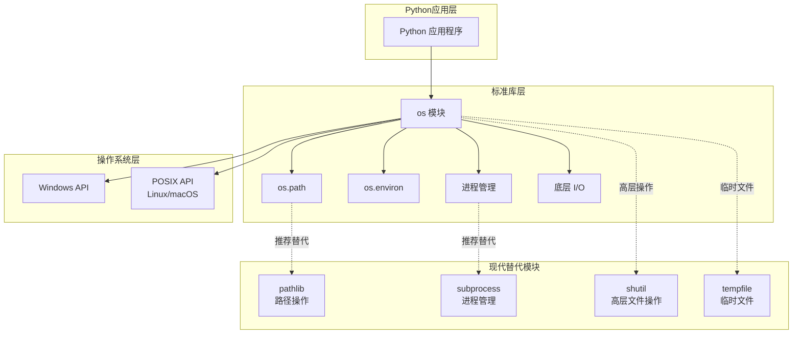
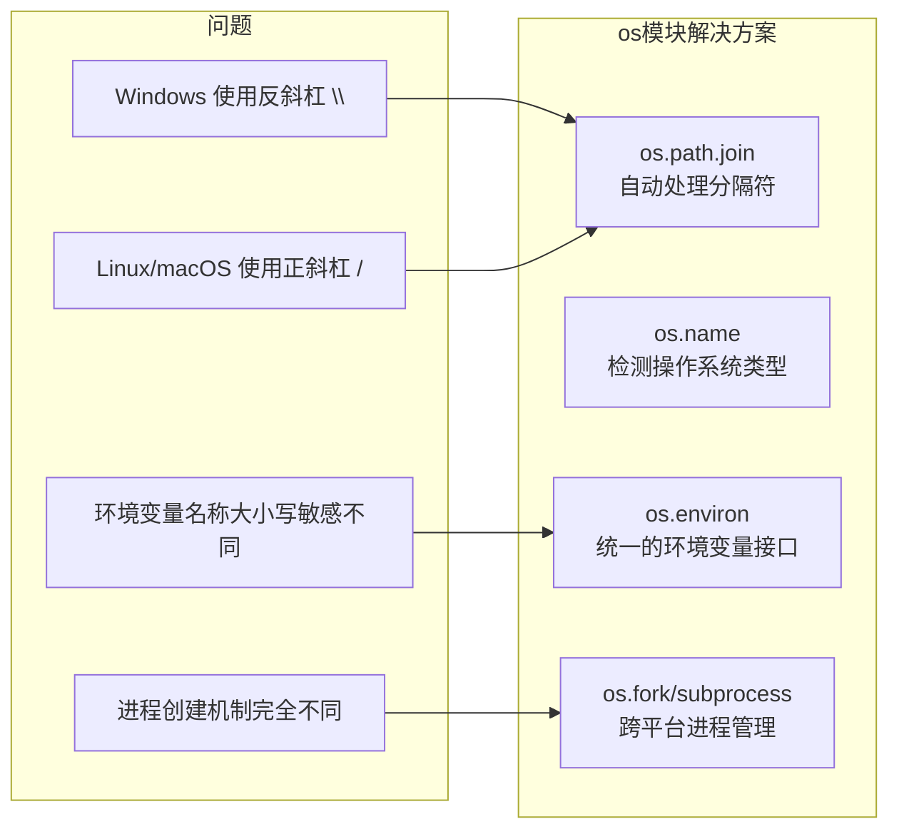
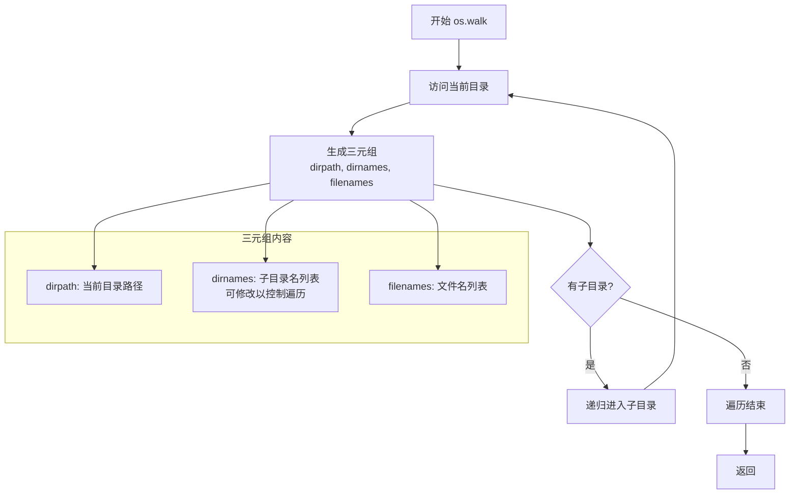
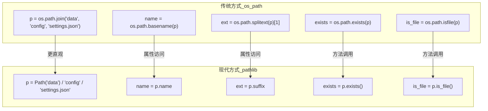
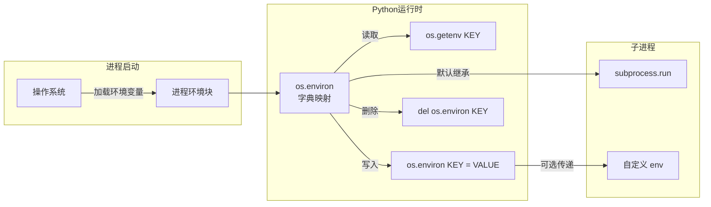
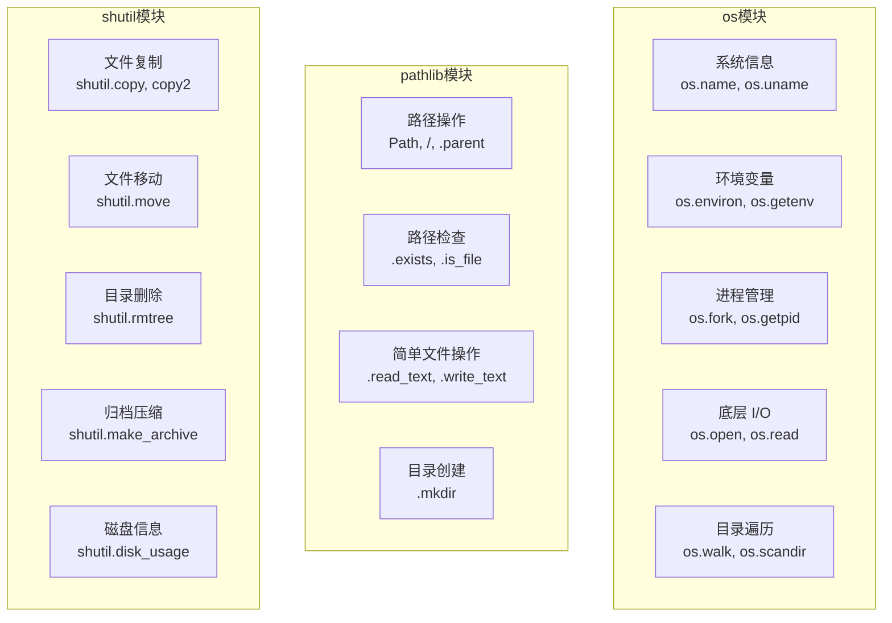

# os 模块：与操作系统交互的瑞士军刀

## 一、是什么：os 模块的核心定位

`os` 模块是 Python 标准库中用于与操作系统进行交互的核心模块。它提供了一种**可移植**的方式来使用操作系统的功能，如读取和写入文件、操作目录、管理进程和环境变量等。

### 1.1 os 模块在 Python 系统编程中的角色



**核心价值**：
- **跨平台抽象**：同一套代码可在 Windows、Linux、macOS 上运行
- **底层访问**：提供直接访问操作系统 API 的能力
- **不可或缺的场景**：环境变量管理、进程信息获取、底层文件描述符操作

### 1.2 os 模块功能分类总览

| 类别 | 核心功能 | 常用 API | 现代替代/推荐 | 使用频率 |
|:-----|:---------|:---------|:--------------|:---------|
| **系统信息** | 获取操作系统、进程、用户等信息 | `os.name`, `os.uname()`, `os.getpid()`, `os.getlogin()` | `platform` (更详细), `getpass` (更安全) | 中 |
| **环境变量** | 读取、设置和删除环境变量 | `os.environ`, `os.getenv()`, `os.putenv()` | - (不可替代) | 高 |
| **工作目录** | 查询和切换当前工作目录 | `os.getcwd()`, `os.chdir()` | `pathlib.Path.cwd()` | 高 |
| **路径操作** | 路径拼接、分割、规范化等 | `os.path.join()`, `os.path.basename()`, `os.path.abspath()` | **`pathlib` 模块** (强烈推荐) | 高 |
| **文件/目录** | 创建、删除、遍历、修改权限 | `os.listdir()`, `os.scandir()`, `os.walk()`, `os.makedirs()`, `os.remove()`, `os.chmod()` | `pathlib` (部分功能), `shutil` (高层操作) | 高 |
| **进程管理** | 执行外部命令、创建和管理子进程 | `os.system()`, `os.popen()`, `os.fork()`, `os.exec*` | **`subprocess` 模块** (强烈推荐) | 中 |
| **底层 I/O** | 基于文件描述符的底层文件操作 | `os.open()`, `os.read()`, `os.write()`, `os.close()` | - (特定场景使用) | 低 |

---

## 二、为什么：设计理念与使用场景

### 2.1 为什么需要 os 模块

**问题背景**：不同操作系统的 API 差异巨大



**核心设计理念**：
1. **可移植性**：一次编写，到处运行
2. **简洁性**：提供 Pythonic 的 API 封装底层系统调用
3. **完整性**：覆盖操作系统交互的主要场景

### 2.2 何时使用 os 模块

| 场景 | 推荐方案 | 原因 |
|:-----|:---------|:-----|
| 读取环境变量 | `os.getenv()` | 不可替代，标准方式 |
| 获取进程 ID | `os.getpid()` | 不可替代 |
| 目录遍历 | `os.walk()` 或 `pathlib.Path.rglob()` | `os.walk()` 更灵活，`pathlib` 更优雅 |
| 路径拼接 | `pathlib.Path /` | 面向对象，更直观 |
| 执行外部命令 | `subprocess.run()` | 更安全，功能更全 |
| 复制/移动文件 | `shutil.copy/move()` | 高层封装，更方便 |
| 底层文件操作 | `os.open/read/write` | 需要文件描述符时使用 |

---

## 三、怎么做：核心功能详解

### 3.1 系统与进程信息

```python
import os
import platform
import getpass

def demonstrate_system_info():
    """
    演示如何获取系统与进程信息。
    
    展示 os 模块与 platform 模块的配合使用。
    """
    print("=== 系统与进程信息 ===\n")
    
    # 1. 操作系统标识
    # os.name 返回简洁的操作系统标识符
    # 'posix' -> Linux/macOS/FreeBSD 等
    # 'nt' -> Windows
    # 'java' -> Jython
    print(f"os.name: {os.name}")
    
    # 2. 进程信息
    # getpid() 返回当前进程的唯一标识符
    # getppid() 返回父进程 ID（POSIX 系统可用）
    print(f"当前进程 ID (PID): {os.getpid()}")
    if hasattr(os, 'getppid'):
        print(f"父进程 ID (PPID): {os.getppid()}")
    
    # 3. 用户信息
    # getpass.getuser() 是跨平台获取用户名的推荐方式
    print(f"当前用户: {getpass.getuser()}")
    
    # 4. POSIX 系统详细信息
    # os.uname() 仅在 POSIX 系统上可用
    if hasattr(os, "uname"):
        uname_info = os.uname()
        print(f"系统名称: {uname_info.sysname}")
        print(f"主机名: {uname_info.nodename}")
        print(f"内核版本: {uname_info.release}")
        print(f"硬件架构: {uname_info.machine}")
    
    # 5. 使用 platform 模块获取更详细信息
    # platform 模块提供更友好的跨平台接口
    print("\n--- platform 模块补充信息 ---")
    print(f"操作系统: {platform.system()}")
    print(f"操作系统版本: {platform.version()}")
    print(f"Python 版本: {platform.python_version()}")
    print(f"CPU 架构: {platform.machine()}")

if __name__ == "__main__":
    demonstrate_system_info()
```

**输出示例（macOS）**：
```text
=== 系统与进程信息 ===

os.name: posix
当前进程 ID (PID): 12345
父进程 ID (PPID): 67890
当前用户: xiaoye
系统名称: Darwin
主机名: MacBook-Pro.local
内核版本: 23.5.0
硬件架构: arm64

--- platform 模块补充信息 ---
操作系统: Darwin
操作系统版本: Darwin Kernel Version 23.5.0...
Python 版本: 3.11.5
CPU 架构: arm64
```

### 3.2 工作目录管理

```python
import os
from pathlib import Path
from contextlib import contextmanager

@contextmanager
def pushd(new_dir):
    """
    安全临时切换目录的上下文管理器。
    
    使用 with 语句确保目录在代码块结束后自动恢复，
    即使发生异常也能正确恢复。
    
    Args:
        new_dir: 目标目录路径
        
    Example:
        with pushd("/tmp"):
            # 在这里工作目录是 /tmp
            pass
        # 退出后自动恢复原目录
    """
    previous_dir = os.getcwd()  # 保存当前目录
    os.chdir(new_dir)           # 切换到新目录
    try:
        yield                   # 执行 with 块内的代码
    finally:
        os.chdir(previous_dir)  # 无论如何都恢复原目录

def demonstrate_cwd_management():
    """
    演示工作目录的查询和安全切换。
    
    强调：os.chdir() 是全局状态修改，应谨慎使用。
    """
    print("\n=== 工作目录管理 ===\n")
    
    # 获取当前工作目录
    original_dir = os.getcwd()
    print(f"初始工作目录: {original_dir}")
    
    # 创建临时目录用于演示
    temp_dir = Path("./temp_demo_dir")
    temp_dir.mkdir(exist_ok=True)
    
    # 方式一：直接切换（不推荐，容易忘记恢复）
    print(f"\n--- 直接切换目录 ---")
    os.chdir(temp_dir)
    print(f"切换后，当前目录: {os.getcwd()}")
    os.chdir(original_dir)  # 必须手动恢复
    print(f"手动恢复后: {os.getcwd()}")
    
    # 方式二：使用上下文管理器（推荐）
    print(f"\n--- 使用上下文管理器（推荐）---")
    with pushd(temp_dir):
        print(f"在 with 块内，当前目录: {os.getcwd()}")
        # 在这里执行需要特定工作目录的操作
        Path("test.txt").write_text("Hello!")
        print(f"创建的文件: {list(Path('.').glob('*.txt'))}")
    # 退出 with 块后自动恢复
    print(f"退出 with 块后，当前目录: {os.getcwd()}")
    
    # 清理
    import shutil
    shutil.rmtree(temp_dir)
    print(f"\n已清理临时目录: {temp_dir}")

if __name__ == "__main__":
    demonstrate_cwd_management()
```

**最佳实践对比表**：

| 方式 | 优点 | 缺点 | 推荐场景 |
|:-----|:-----|:-----|:---------|
| `os.chdir()` 直接调用 | 简单直接 | 容易忘记恢复，异常时不安全 | 永久切换目录 |
| `pushd` 上下文管理器 | 自动恢复，异常安全 | 需要额外定义 | 临时切换目录 |
| `pathlib` 相对路径 | 无需切换目录 | 需要基于固定基准路径计算 | 大多数文件操作 |

### 3.3 目录遍历：os.walk 流程详解



```python
import os
from pathlib import Path
import shutil

def demonstrate_directory_traversal():
    """
    演示三种目录遍历方法及其适用场景。
    
    os.listdir(): 简单列表，适合小目录
    os.scandir(): 高效迭代，适合大目录
    os.walk(): 递归遍历，适合目录树
    """
    print("\n=== 目录遍历方法对比 ===\n")
    
    # 准备演示目录结构
    demo_dir = Path("demo_traversal")
    (demo_dir / "subdir1" / "nested").mkdir(parents=True, exist_ok=True)
    (demo_dir / "subdir2").mkdir(exist_ok=True)
    (demo_dir / "file1.txt").touch()
    (demo_dir / "file2.py").touch()
    (demo_dir / "subdir1" / "file3.log").touch()
    (demo_dir / "subdir1" / "nested" / "file4.txt").touch()
    print(f"创建演示目录结构:\n")
    
    # 显示目录树
    for line in demo_dir.rglob("*"):
        depth = len(line.relative_to(demo_dir).parts) - 1
        indent = "  " * depth
        prefix = "📁 " if line.is_dir() else "📄 "
        print(f"{indent}{prefix}{line.name}")
    
    # 方法一：os.listdir() - 返回列表
    print(f"\n--- 1. os.listdir() ---")
    print("特点: 返回文件名列表，不区分文件/目录，无递归")
    for name in os.listdir(demo_dir):
        full_path = os.path.join(demo_dir, name)
        file_type = "目录" if os.path.isdir(full_path) else "文件"
        print(f"  {name:<15} [{file_type}]")
    
    # 方法二：os.scandir() - 返回迭代器（推荐用于单层遍历）
    print(f"\n--- 2. os.scandir() [推荐用于单层遍历] ---")
    print("特点: 返回 DirEntry 迭代器，缓存 stat 信息，性能更高")
    with os.scandir(demo_dir) as entries:
        for entry in entries:
            # DirEntry 对象缓存了类型信息，无需额外系统调用
            file_type = "目录" if entry.is_dir() else "文件"
            size = entry.stat().st_size if entry.is_file() else "-"
            print(f"  {entry.name:<15} [{file_type}] 大小: {size}")
    
    # 方法三：os.walk() - 递归遍历
    print(f"\n--- 3. os.walk() [推荐用于递归遍历] ---")
    print("特点: 递归遍历整个目录树，返回 (dirpath, dirnames, filenames)")
    for dirpath, dirnames, filenames in os.walk(demo_dir):
        rel_path = Path(dirpath).relative_to(demo_dir)
        print(f"\n当前目录: {rel_path or '.'}")
        if dirnames:
            print(f"  子目录: {dirnames}")
        if filenames:
            print(f"  文件: {filenames}")
    
    # 高级技巧：修改 dirnames 控制遍历
    print(f"\n--- 4. 高级技巧：跳过特定目录 ---")
    skip_dirs = {"subdir2"}  # 要跳过的目录名集合
    for dirpath, dirnames, filenames in os.walk(demo_dir):
        # 原地修改 dirnames 可以控制后续遍历
        dirnames[:] = [d for d in dirnames if d not in skip_dirs]
        rel_path = Path(dirpath).relative_to(demo_dir)
        print(f"访问: {rel_path or '.'}")
    
    # 清理
    shutil.rmtree(demo_dir)
    print(f"\n已清理演示目录: {demo_dir}")

if __name__ == "__main__":
    demonstrate_directory_traversal()
```

**目录遍历方法对比表**：

| 方法 | 返回类型 | 递归支持 | 性能 | 适用场景 |
|:-----|:---------|:---------|:-----|:---------|
| `os.listdir()` | 列表 | 否 | 一般 | 小目录，简单遍历 |
| `os.scandir()` | 迭代器 | 否 | 高 | 大目录，需要文件属性 |
| `os.walk()` | 生成器 | 是 | 高 | 目录树遍历 |
| `Path.glob()` | 生成器 | 否 | 中 | 模式匹配 |
| `Path.rglob()` | 生成器 | 是 | 中 | 递归模式匹配 |

### 3.4 os.path vs pathlib：路径操作对比



**os.path 常用函数对比表**：

| 功能 | os.path 写法 | pathlib 写法 | 推荐度 |
|:-----|:-------------|:-------------|:-------|
| 路径拼接 | `os.path.join('a', 'b', 'c')` | `Path('a') / 'b' / 'c'` | pathlib |
| 获取文件名 | `os.path.basename(p)` | `p.name` | pathlib |
| 获取目录名 | `os.path.dirname(p)` | `p.parent` | pathlib |
| 获取扩展名 | `os.path.splitext(p)[1]` | `p.suffix` | pathlib |
| 获取主干名 | `os.path.splitext(p)[0]` | `p.stem` | pathlib |
| 检查存在 | `os.path.exists(p)` | `p.exists()` | pathlib |
| 是否为文件 | `os.path.isfile(p)` | `p.is_file()` | pathlib |
| 是否为目录 | `os.path.isdir(p)` | `p.is_dir()` | pathlib |
| 绝对路径 | `os.path.abspath(p)` | `p.resolve()` | pathlib |
| 规范化 | `os.path.normpath(p)` | `Path(p).resolve()` | pathlib |
| 文件大小 | `os.path.getsize(p)` | `p.stat().st_size` | os.path |
| 修改时间 | `os.path.getmtime(p)` | `p.stat().st_mtime` | os.path |
| 读取文件 | `open(p).read()` | `p.read_text()` | pathlib |
| 写入文件 | `open(p, 'w').write(s)` | `p.write_text(s)` | pathlib |
| 创建目录 | `os.makedirs(p)` | `p.mkdir(parents=True)` | pathlib |

```python
import os
from pathlib import Path
import time

def demonstrate_path_comparison():
    """
    对比 os.path 和 pathlib 的使用方式。
    
    结论：新项目推荐使用 pathlib，代码更简洁直观。
    """
    print("\n=== os.path vs pathlib 对比 ===\n")
    
    # 场景一：路径拼接
    print("--- 场景一：路径拼接 ---")
    # os.path 方式
    path_old = os.path.join('data', 'config', 'settings.json')
    print(f"os.path: os.path.join('data', 'config', 'settings.json')")
    print(f"  结果: {path_old}")
    
    # pathlib 方式
    path_new = Path('data') / 'config' / 'settings.json'
    print(f"pathlib: Path('data') / 'config' / 'settings.json'")
    print(f"  结果: {path_new}")
    
    # 场景二：路径属性提取
    print("\n--- 场景二：路径属性提取 ---")
    test_path = Path('/home/user/documents/report.pdf')
    
    print(f"路径: {test_path}")
    print(f"  父目录: {test_path.parent} (os.path.dirname)")
    print(f"  文件名: {test_path.name} (os.path.basename)")
    print(f"  主干名: {test_path.stem} (os.path.splitext[0])")
    print(f"  扩展名: {test_path.suffix} (os.path.splitext[1])")
    print(f"  所有后缀: {test_path.suffixes}")
    
    # 场景三：路径检查
    print("\n--- 场景三：路径检查 ---")
    # 创建临时文件演示
    temp_file = Path("temp_test.txt")
    temp_file.write_text("test content")
    
    print(f"文件: {temp_file}")
    print(f"  存在? {temp_file.exists()}")
    print(f"  是文件? {temp_file.is_file()}")
    print(f"  是目录? {temp_file.is_dir()}")
    print(f"  绝对路径: {temp_file.resolve()}")
    print(f"  文件大小: {temp_file.stat().st_size} 字节")
    print(f"  修改时间: {time.ctime(temp_file.stat().st_mtime)}")
    
    # 清理
    temp_file.unlink()
    
    # 场景四：批量操作
    print("\n--- 场景四：批量操作 ---")
    demo_dir = Path("demo_paths")
    demo_dir.mkdir(exist_ok=True)
    
    # 创建多个文件
    for i in range(3):
        (demo_dir / f"file{i}.txt").write_text(f"content {i}")
    
    # pathlib 的 glob 模式匹配
    print("使用 pathlib.glob() 查找文件:")
    for txt_file in demo_dir.glob("*.txt"):
        print(f"  {txt_file.name}")
    
    # 清理
    import shutil
    shutil.rmtree(demo_dir)
    print(f"\n已清理: {demo_dir}")

if __name__ == "__main__":
    demonstrate_path_comparison()
```

### 3.5 环境变量管理机制



```python
import os
import subprocess

def demonstrate_environment_variables():
    """
    演示环境变量的读取、设置、删除和传递给子进程。
    
    核心概念：
    1. os.environ 是进程启动时环境变量的快照
    2. 修改 os.environ 会影响当前进程和子进程
    3. 修改不会影响父进程或系统环境变量
    """
    print("\n=== 环境变量管理 ===\n")
    
    # 1. 安全读取环境变量（推荐方式）
    print("--- 1. 安全读取环境变量 ---")
    # os.getenv() 在变量不存在时返回 None 或默认值，不会抛异常
    home = os.getenv('HOME') or os.getenv('USERPROFILE')  # 跨平台
    print(f"用户主目录: {home}")
    
    # 提供默认值
    log_level = os.getenv('LOG_LEVEL', 'INFO')
    print(f"日志级别 (默认 INFO): {log_level}")
    
    # 不存在的变量
    missing = os.getenv('THIS_VAR_DOES_NOT_EXIST', '默认值')
    print(f"不存在的变量: {missing}")
    
    # 2. 使用 os.environ 字典（需要处理 KeyError）
    print("\n--- 2. 使用 os.environ 字典 ---")
    try:
        path_value = os.environ['PATH']
        print(f"PATH 前 50 字符: {path_value[:50]}...")
    except KeyError:
        print("PATH 环境变量不存在")
    
    # 检查变量是否存在
    if 'HOME' in os.environ:
        print(f"HOME 存在: {os.environ['HOME']}")
    
    # 3. 设置和修改环境变量
    print("\n--- 3. 设置和修改环境变量 ---")
    os.environ['MY_APP_VERSION'] = '2.0.0'
    os.environ['MY_DEBUG_MODE'] = 'true'
    print(f"设置 MY_APP_VERSION: {os.getenv('MY_APP_VERSION')}")
    print(f"设置 MY_DEBUG_MODE: {os.getenv('MY_DEBUG_MODE')}")
    
    # 4. 删除环境变量
    print("\n--- 4. 删除环境变量 ---")
    del os.environ['MY_DEBUG_MODE']
    print(f"删除后 MY_DEBUG_MODE: {os.getenv('MY_DEBUG_MODE', '已删除')}")
    
    # 5. 遍历所有环境变量
    print("\n--- 5. 遍历环境变量 (前 5 个) ---")
    for i, (key, value) in enumerate(os.environ.items()):
        if i >= 5:
            break
        # 截断过长的值
        display_value = value[:40] + "..." if len(value) > 40 else value
        print(f"  {key}: {display_value}")
    
    # 6. 传递环境变量给子进程
    print("\n--- 6. 传递环境变量给子进程 ---")
    # 方式一：子进程自动继承当前进程的环境变量
    # 方式二：自定义子进程的环境变量
    custom_env = {**os.environ, 'CUSTOM_VAR': 'custom_value'}
    # subprocess.run(['some_command'], env=custom_env)
    print("自定义子进程环境: subprocess.run(cmd, env=custom_env)")
    print(f"  custom_env 包含 CUSTOM_VAR: {'CUSTOM_VAR' in custom_env}")
    
    # 清理
    if 'MY_APP_VERSION' in os.environ:
        del os.environ['MY_APP_VERSION']

def demonstrate_env_best_practices():
    """
    演示环境变量的最佳实践。
    """
    print("\n=== 环境变量最佳实践 ===\n")
    
    # 实践一：使用 .env 文件管理配置（推荐使用 python-dotenv）
    print("--- 实践一：配置管理 ---")
    print("推荐使用 python-dotenv 库从 .env 文件加载配置:")
    print("""
    # .env 文件内容
    DATABASE_URL=postgresql://localhost/mydb
    SECRET_KEY=your-secret-key
    DEBUG=true
    
    # Python 代码
    from dotenv import load_dotenv
    load_dotenv()  # 加载 .env 文件
    database_url = os.getenv('DATABASE_URL')
    """)
    
    # 实践二：敏感信息处理
    print("\n--- 实践二：敏感信息处理 ---")
    print("敏感信息（密码、密钥）应通过环境变量传递，不要硬编码")
    api_key = os.getenv('API_KEY', '')
    if not api_key:
        print("警告: API_KEY 未设置，请配置环境变量")
    
    # 实践三：类型转换
    print("\n--- 实践三：类型转换 ---")
    # 环境变量都是字符串，需要手动转换类型
    debug_str = os.getenv('DEBUG', 'false')
    debug_bool = debug_str.lower() in ('true', '1', 'yes')
    print(f"DEBUG 字符串: '{debug_str}' -> 布尔值: {debug_bool}")
    
    port_str = os.getenv('PORT', '8080')
    port_int = int(port_str)
    print(f"PORT 字符串: '{port_str}' -> 整数: {port_int}")

if __name__ == "__main__":
    demonstrate_environment_variables()
    demonstrate_env_best_practices()
```

### 3.6 os vs pathlib vs shutil：职责划分



**os vs pathlib vs shutil 职责划分对比表**：

| 功能类别 | os 模块 | pathlib 模块 | shutil 模块 | 推荐选择 |
|:---------|:--------|:-------------|:------------|:---------|
| 系统信息 | `os.name`, `os.uname()` | - | - | os |
| 环境变量 | `os.environ`, `os.getenv()` | - | - | os |
| 进程信息 | `os.getpid()`, `os.getppid()` | - | - | os |
| 路径拼接 | `os.path.join()` | `Path / operator` | - | pathlib |
| 路径属性 | `os.path.basename()` 等 | `.name`, `.suffix` 等 | - | pathlib |
| 路径检查 | `os.path.exists()` 等 | `.exists()`, `.is_file()` | - | pathlib |
| 创建目录 | `os.makedirs()` | `Path.mkdir(parents=True)` | - | pathlib |
| 删除文件 | `os.remove()` | `Path.unlink()` | - | 均可 |
| 删除空目录 | `os.rmdir()` | `Path.rmdir()` | - | 均可 |
| 删除目录树 | - | - | `shutil.rmtree()` | shutil |
| 复制文件 | - | - | `shutil.copy()` | shutil |
| 移动文件 | `os.rename()` | `Path.rename()` | `shutil.move()` | shutil |
| 目录遍历 | `os.walk()` | `Path.rglob()` | - | 按需选择 |
| 文件读写 | `open()` | `Path.read_text()` | - | pathlib |
| 磁盘信息 | `os.statvfs()` (POSIX) | - | `shutil.disk_usage()` | shutil |
| 底层 I/O | `os.open/read/write` | - | - | os |

### 3.7 文件创建、删除与权限管理

```python
import os
import stat
from pathlib import Path
import time

def demonstrate_file_operations():
    """
    演示文件的创建、删除、重命名和权限管理。
    """
    print("\n=== 文件操作与权限管理 ===\n")
    
    base_dir = Path("demo_file_ops")
    base_dir.mkdir(exist_ok=True)
    
    # 1. 创建目录
    print("--- 1. 创建目录 ---")
    # os.makedirs() 递归创建
    nested_dir = base_dir / "level1" / "level2"
    os.makedirs(nested_dir, exist_ok=True)
    print(f"递归创建目录: {nested_dir}")
    
    # pathlib 方式
    another_dir = base_dir / "another"
    another_dir.mkdir(parents=True, exist_ok=True)
    print(f"pathlib 创建目录: {another_dir}")
    
    # 2. 创建文件
    print("\n--- 2. 创建文件 ---")
    file1 = base_dir / "file1.txt"
    file1.write_text("Hello, World!")
    print(f"创建文件: {file1}")
    
    # 3. 文件状态信息
    print("\n--- 3. 文件状态信息 (os.stat) ---")
    stat_info = os.stat(file1)
    print(f"  文件大小: {stat_info.st_size} 字节")
    print(f"  最后修改: {time.ctime(stat_info.st_mtime)}")
    print(f"  最后访问: {time.ctime(stat_info.st_atime)}")
    print(f"  权限模式: {oct(stat.S_IMODE(stat_info.st_mode))}")
    
    # 4. 权限检查
    print("\n--- 4. 权限检查 (os.access) ---")
    print(f"  存在? {os.access(file1, os.F_OK)}")
    print(f"  可读? {os.access(file1, os.R_OK)}")
    print(f"  可写? {os.access(file1, os.W_OK)}")
    print(f"  可执行? {os.access(file1, os.X_OK)}")
    
    # 5. 修改权限
    print("\n--- 5. 修改权限 (os.chmod) ---")
    # 设置为仅所有者可读写 (rw-------)
    new_mode = stat.S_IRUSR | stat.S_IWUSR  # 0o600
    os.chmod(file1, new_mode)
    print(f"修改权限为: {oct(new_mode)} (仅所有者读写)")
    new_stat = os.stat(file1)
    print(f"  当前权限: {oct(stat.S_IMODE(new_stat.st_mode))}")
    
    # 6. 重命名和移动
    print("\n--- 6. 重命名和移动 ---")
    renamed = base_dir / "renamed.txt"
    os.rename(file1, renamed)
    print(f"重命名: {file1.name} -> {renamed.name}")
    
    moved = another_dir / "moved.txt"
    os.rename(renamed, moved)
    print(f"移动: {renamed} -> {moved}")
    
    # 7. 删除
    print("\n--- 7. 删除操作 ---")
    os.remove(moved)
    print(f"删除文件: {moved}")
    
    os.rmdir(another_dir)
    print(f"删除空目录: {another_dir}")
    
    # 清理
    import shutil
    shutil.rmtree(base_dir)
    print(f"\n清理整个目录: {base_dir}")

if __name__ == "__main__":
    demonstrate_file_operations()
```

### 3.8 进程管理：os.system vs subprocess

```python
import os
import subprocess

def demonstrate_process_management():
    """
    对比 os.system 和 subprocess 模块的使用。
    
    结论：新代码应始终使用 subprocess 模块。
    """
    print("\n=== 进程管理对比 ===\n")
    
    # 1. os.system() - 不推荐
    print("--- 1. os.system() [不推荐] ---")
    print("缺点: 无法捕获输出，存在 Shell 注入风险")
    
    # 简单执行
    if os.name == 'nt':
        exit_code = os.system('dir > nul')
    else:
        exit_code = os.system('ls > /dev/null')
    print(f"os.system 返回退出码: {exit_code}")
    
    # 安全风险示例（不要在生产环境这样做！）
    print("\n安全风险: 直接拼接用户输入可能导致命令注入")
    user_input = "file.txt; rm -rf /"  # 恶意输入
    print(f"恶意输入: '{user_input}'")
    print("如果执行: os.system(f'cat {user_input}') 会删除文件！")
    
    # 2. subprocess.run() - 推荐
    print("\n--- 2. subprocess.run() [推荐] ---")
    print("优点: 安全、可捕获输出、可检查错误")
    
    # 安全地执行命令
    try:
        # 将命令和参数作为列表传递，防止注入
        if os.name == 'nt':
            cmd = ['cmd', '/c', 'dir']
        else:
            cmd = ['ls', '-la']
        
        result = subprocess.run(
            cmd,
            capture_output=True,  # 捕获 stdout 和 stderr
            text=True,            # 返回字符串而非字节
            check=True            # 非零退出码抛异常
        )
        print(f"命令: {' '.join(cmd)}")
        print(f"退出码: {result.returncode}")
        print(f"输出前 100 字符: {result.stdout[:100]}...")
        
    except FileNotFoundError as e:
        print(f"命令未找到: {e}")
    except subprocess.CalledProcessError as e:
        print(f"命令执行失败: 退出码 {e.returncode}")
        print(f"错误输出: {e.stderr}")
    
    # 3. 更复杂的 subprocess 用法
    print("\n--- 3. 高级 subprocess 用法 ---")
    
    # 设置超时
    try:
        result = subprocess.run(
            ['sleep', '1'],
            timeout=0.5  # 0.5 秒超时
        )
    except subprocess.TimeoutExpired:
        print("命令执行超时，已终止")
    
    # 传递输入
    result = subprocess.run(
        ['cat'],
        input="Hello from Python\n",
        capture_output=True,
        text=True
    )
    print(f"传递输入后输出: {result.stdout.strip()}")
    
    # 自定义环境变量
    custom_env = {**os.environ, 'MY_VAR': 'test'}
    result = subprocess.run(
        ['sh', '-c', 'echo $MY_VAR'] if os.name != 'nt' else ['cmd', '/c', 'echo %MY_VAR%'],
        env=custom_env,
        capture_output=True,
        text=True
    )
    print(f"自定义环境变量: {result.stdout.strip()}")

if __name__ == "__main__":
    demonstrate_process_management()
```

**进程管理方法对比表**：

| 方法 | 安全性 | 捕获输出 | 错误处理 | 超时支持 | 推荐度 |
|:-----|:-------|:---------|:---------|:---------|:-------|
| `os.system()` | 低（Shell 注入风险） | 否 | 仅退出码 | 否 | 不推荐 |
| `os.popen()` | 低 | 部分 | 否 | 否 | 不推荐 |
| `subprocess.run()` | 高 | 是 | 异常 + 退出码 | 是 | 强烈推荐 |
| `subprocess.Popen()` | 高 | 是 | 灵活 | 是 | 高级场景 |

### 3.9 底层文件 I/O（高级主题）

```python
import os

def demonstrate_low_level_io():
    """
    演示基于文件描述符的底层 I/O 操作。
    
    适用场景：
    1. 与需要文件描述符的 C 库交互
    2. 需要非阻塞 I/O 或其他特殊标志
    3. 性能敏感的批量文件操作
    
    注意：日常文件操作应使用内置 open() 函数。
    """
    print("\n=== 底层文件 I/O ===\n")
    
    file_path = "low_level_demo.txt"
    fd = -1  # 文件描述符初始化
    
    try:
        # 1. 打开文件
        # os.O_WRONLY: 只写模式
        # os.O_CREAT: 文件不存在则创建
        # os.O_TRUNC: 文件存在则截断
        # 0o644: 权限 (所有者读写，其他人只读)
        flags = os.O_WRONLY | os.O_CREAT | os.O_TRUNC
        mode = 0o644
        fd = os.open(file_path, flags, mode)
        print(f"打开文件，文件描述符: {fd}")
        
        # 2. 写入数据（必须是字节串）
        content = b"Hello, low-level I/O!\n"
        bytes_written = os.write(fd, content)
        print(f"写入 {bytes_written} 字节")
        
        # 3. 关闭文件
        os.close(fd)
        fd = -1
        print("关闭文件")
        
        # 4. 重新打开读取
        fd = os.open(file_path, os.O_RDONLY)
        print(f"\n重新打开读取，文件描述符: {fd}")
        
        # 5. 读取数据
        read_data = os.read(fd, 1024)
        print(f"读取内容: {read_data.decode('utf-8').strip()}")
        
        # 6. 文件指针操作
        os.lseek(fd, 0, os.SEEK_SET)  # 移动到开头
        print("文件指针移动到开头")
        
        first_bytes = os.read(fd, 5)
        print(f"读取前 5 字节: {first_bytes.decode()}")
        
    except OSError as e:
        print(f"系统错误: {e}")
    finally:
        # 确保关闭文件描述符
        if fd != -1:
            os.close(fd)
        # 清理文件
        if os.path.exists(file_path):
            os.remove(file_path)
            print(f"\n清理文件: {file_path}")

if __name__ == "__main__":
    demonstrate_low_level_io()
```

---

## 四、跨平台兼容性注意事项

### 4.1 跨平台兼容性检查清单

| 问题 | Windows | POSIX (Linux/macOS) | 解决方案 |
|:-----|:--------|:--------------------|:---------|
| 路径分隔符 | `\` | `/` | 使用 `os.path.join()` 或 `pathlib` |
| 行分隔符 | `\r\n` | `\n` | 使用 `os.linesep` 或让 Python 自动处理 |
| 环境变量大小写 | 不敏感 | 敏感 | 统一使用大写 |
| 文件权限 | 有限支持 | 完整支持 | 使用 `os.access()` 检查 |
| 符号链接 | 需要管理员权限 | 普通支持 | 使用 `os.path.islink()` 检查 |
| 进程创建 | `os.spawn*` | `os.fork()` | 使用 `subprocess` 模块 |
| 主目录 | `%USERPROFILE%` | `$HOME` | `Path.home()` |

```python
import os
from pathlib import Path

def demonstrate_cross_platform():
    """
    演示跨平台兼容性最佳实践。
    """
    print("\n=== 跨平台兼容性 ===\n")
    
    # 1. 路径分隔符
    print("--- 1. 路径分隔符 ---")
    # 错误方式：硬编码分隔符
    bad_path = "data/config/settings.json"  # 在 Windows 上可能有问题
    
    # 正确方式：使用 os.path.join 或 pathlib
    good_path = os.path.join("data", "config", "settings.json")
    better_path = Path("data") / "config" / "settings.json"
    print(f"os.path.join: {good_path}")
    print(f"pathlib: {better_path}")
    
    # 2. 获取系统特定信息
    print("\n--- 2. 系统特定信息 ---")
    print(f"路径分隔符 os.sep: {repr(os.sep)}")
    print(f"行分隔符 os.linesep: {repr(os.linesep)}")
    print(f"路径分隔符 os.pathsep: {repr(os.pathsep)}")
    
    # 3. 用户主目录
    print("\n--- 3. 用户主目录 ---")
    # 跨平台获取主目录
    home = Path.home()
    print(f"Path.home(): {home}")
    
    # 4. 检查功能可用性
    print("\n--- 4. 功能可用性检查 ---")
    features = ['fork', 'spawn', 'uname', 'getuid', 'symlink']
    for feature in features:
        available = hasattr(os, feature)
        print(f"  os.{feature}: {'可用' if available else '不可用'}")
    
    # 5. 条件执行
    print("\n--- 5. 条件执行 ---")
    if os.name == 'nt':
        print("Windows 系统")
        # Windows 特定代码
    elif os.name == 'posix':
        print("POSIX 系统 (Linux/macOS)")
        # POSIX 特定代码
    else:
        print(f"其他系统: {os.name}")

if __name__ == "__main__":
    demonstrate_cross_platform()
```

---

## 五、实战案例：日志归档与清理系统

```python
import os
import shutil
import time
from pathlib import Path
from datetime import datetime, timedelta

class LogArchiver:
    """
    日志归档与清理系统。
    
    功能：
    1. 将日志文件按日期归档到目录结构中
    2. 自动清理超过保留期的旧归档
    3. 支持压缩归档
    """
    
    def __init__(self, logs_dir="logs", archives_dir="archives", 
                 retention_days=7, compress=False):
        """
        初始化日志归档器。
        
        Args:
            logs_dir: 日志源目录
            archives_dir: 归档目标目录
            retention_days: 归档保留天数
            compress: 是否压缩归档
        """
        self.logs_dir = Path(logs_dir)
        self.archives_dir = Path(archives_dir)
        self.retention_days = retention_days
        self.compress = compress
        
    def setup(self):
        """创建必要的目录结构。"""
        self.logs_dir.mkdir(parents=True, exist_ok=True)
        self.archives_dir.mkdir(parents=True, exist_ok=True)
        print(f"日志目录: {self.logs_dir}")
        print(f"归档目录: {self.archives_dir}")
    
    def create_sample_logs(self):
        """创建示例日志文件用于演示。"""
        print("\n--- 创建示例日志 ---")
        
        # 创建不同日期的日志
        samples = [
            ("app_20260601.log", "2026-06-01 应用日志"),
            ("app_20260602.log", "2026-06-02 应用日志"),
            ("db_20260601.log", "2026-06-01 数据库日志"),
            ("system.log", "系统日志"),
        ]
        
        for filename, content in samples:
            log_file = self.logs_dir / filename
            log_file.write_text(f"{content}\n" * 100)
            print(f"  创建: {filename}")
        
        # 创建一个旧文件
        old_file = self.logs_dir / "old_archive.log"
        old_file.write_text("旧日志内容\n")
        # 修改时间为 8 天前
        old_time = time.time() - 8 * 24 * 3600
        os.utime(old_file, (old_time, old_time))
        print(f"  创建旧文件: old_archive.log (8 天前)")
    
    def archive_logs(self):
        """归档日志文件。"""
        print("\n--- 归档日志 ---")
        
        log_files = list(self.logs_dir.glob("*.log"))
        if not log_files:
            print("没有需要归档的日志文件")
            return
        
        for log_file in log_files:
            if not log_file.is_file():
                continue
            
            # 获取文件修改时间
            mtime = log_file.stat().st_mtime
            mod_date = datetime.fromtimestamp(mtime)
            
            # 构建归档路径: archives/YYYY/MM/DD/
            archive_path = (
                self.archives_dir / 
                str(mod_date.year) / 
                f"{mod_date.month:02d}" / 
                f"{mod_date.day:02d}"
            )
            archive_path.mkdir(parents=True, exist_ok=True)
            
            # 移动文件
            target = archive_path / log_file.name
            shutil.move(str(log_file), str(target))
            print(f"  归档: {log_file.name} -> {target.relative_to(self.archives_dir)}")
    
    def clean_old_archives(self):
        """清理过期的归档文件。"""
        print(f"\n--- 清理 {self.retention_days} 天前的归档 ---")
        
        cutoff_date = datetime.now() - timedelta(days=self.retention_days)
        print(f"截止日期: {cutoff_date.strftime('%Y-%m-%d %H:%M:%S')}")
        
        deleted_count = 0
        deleted_size = 0
        
        # 遍历所有归档文件
        for archive_file in self.archives_dir.rglob("*"):
            if not archive_file.is_file():
                continue
            
            mtime = datetime.fromtimestamp(archive_file.stat().st_mtime)
            if mtime < cutoff_date:
                file_size = archive_file.stat().st_size
                print(f"  删除: {archive_file.relative_to(self.archives_dir)} "
                      f"({mtime.strftime('%Y-%m-%d')})")
                archive_file.unlink()
                deleted_count += 1
                deleted_size += file_size
        
        # 清理空目录
        self._clean_empty_dirs()
        
        print(f"\n清理完成: 删除 {deleted_count} 个文件，"
              f"释放 {deleted_size / 1024:.2f} KB")
    
    def _clean_empty_dirs(self):
        """清理空目录。"""
        for dir_path in sorted(
            self.archives_dir.rglob("*"), 
            key=lambda p: len(p.parts), 
            reverse=True
        ):
            if dir_path.is_dir() and not any(dir_path.iterdir()):
                dir_path.rmdir()
                print(f"  删除空目录: {dir_path.relative_to(self.archives_dir)}")
    
    def show_status(self):
        """显示当前状态。"""
        print("\n--- 当前状态 ---")
        
        # 日志目录
        log_files = list(self.logs_dir.glob("*.log"))
        print(f"待归档日志: {len(log_files)} 个")
        
        # 归档目录
        archive_files = list(self.archives_dir.rglob("*.log"))
        total_size = sum(f.stat().st_size for f in archive_files if f.is_file())
        print(f"已归档文件: {len(archive_files)} 个，共 {total_size / 1024:.2f} KB")
        
        # 目录结构
        print("\n归档目录结构:")
        for item in sorted(self.archives_dir.rglob("*")):
            depth = len(item.relative_to(self.archives_dir).parts) - 1
            indent = "  " * depth
            if item.is_dir():
                print(f"{indent}📁 {item.name}/")
            else:
                print(f"{indent}📄 {item.name}")
    
    def cleanup_demo(self):
        """清理演示环境。"""
        print("\n--- 清理演示环境 ---")
        if self.logs_dir.exists():
            shutil.rmtree(self.logs_dir)
            print(f"删除: {self.logs_dir}")
        if self.archives_dir.exists():
            shutil.rmtree(self.archives_dir)
            print(f"删除: {self.archives_dir}")


def main():
    """运行日志归档演示。"""
    print("=" * 60)
    print("日志归档与清理系统演示")
    print("=" * 60)
    
    archiver = LogArchiver(
        logs_dir="demo_logs",
        archives_dir="demo_archives",
        retention_days=7
    )
    
    try:
        archiver.setup()
        archiver.create_sample_logs()
        archiver.show_status()
        archiver.archive_logs()
        archiver.show_status()
        archiver.clean_old_archives()
        archiver.show_status()
    finally:
        # 保留演示结果，注释下面这行
        archiver.cleanup_demo()


if __name__ == "__main__":
    main()
```

---

## 六、常见问题 FAQ

### Q1: pathlib 能完全替代 os.path 吗？

**答**：在绝大多数场景下可以，但有少数例外。

| 场景 | pathlib 支持 | 说明 |
|:-----|:-------------|:-----|
| 路径拼接 | 是 | `Path / operator` |
| 路径属性 | 是 | `.name`, `.suffix`, `.parent` |
| 路径检查 | 是 | `.exists()`, `.is_file()` |
| 文件读写 | 是 | `.read_text()`, `.write_text()` |
| 目录创建 | 是 | `.mkdir(parents=True)` |
| 文件大小/时间 | 部分 | 需要 `.stat().st_size` |
| 批量遍历 | 是 | `.glob()`, `.rglob()` |
| 符号链接处理 | 是 | `.resolve()`, `.symlink_to()` |

**建议**：新项目统一使用 pathlib，需要文件属性时配合 `.stat()` 方法。

### Q2: os.system 和 subprocess 应该用哪个？

**答**：始终使用 subprocess。

```python
# 错误方式 - os.system
os.system(f"cat {user_input}")  # Shell 注入风险！

# 正确方式 - subprocess
subprocess.run(['cat', user_input], check=True)  # 安全
```

**subprocess 的优势**：
1. **安全**：参数作为列表传递，防止 Shell 注入
2. **可控**：可以捕获输出、设置超时、检查退出码
3. **灵活**：支持异步执行、管道、自定义环境变量

### Q3: 环境变量修改能持久化吗？

**答**：不能。`os.environ` 的修改仅影响当前进程及其子进程。

```mermaid
graph TB
    subgraph 系统环境变量
        SYS[/etc/environment<br/>Windows 注册表]
    end
    
    subgraph 进程A
        A1[os.environ]
        A2["os.environ['X'] = '1'"]
    end
    
    subgraph 进程B_子进程
        B1[继承 A 的环境]
        B2["X = '1'"]
    end
    
    subgraph 进程C_独立进程
        C1[系统环境变量]
        C2["X 未设置"]
    end
    
    SYS --> A1
    A2 --> B1
    SYS --> C1
    
```

**持久化方案**：
- **临时**：修改 `os.environ`，影响当前进程和子进程
- **永久**：修改 shell 配置文件（`~/.bashrc`, `~/.zshrc`）或系统环境变量

### Q4: 如何安全地处理用户提供的文件路径？

**答**：使用 `Path.resolve()` 获取绝对路径，然后验证是否在允许的目录内。

```python
from pathlib import Path

def safe_path(user_input: str, base_dir: Path) -> Path:
    """
    安全地处理用户提供的路径。
    
    防止路径遍历攻击（如 ../../../etc/passwd）。
    """
    # 解析为绝对路径
    target = (base_dir / user_input).resolve()
    base_resolved = base_dir.resolve()
    
    # 检查是否在允许的目录内
    try:
        target.relative_to(base_resolved)
    except ValueError:
        raise ValueError(f"路径 {user_input} 超出允许范围")
    
    return target

# 使用示例
base = Path("/var/www/uploads")
try:
    safe = safe_path("../../../etc/passwd", base)  # 会抛出异常
except ValueError as e:
    print(f"安全检查失败: {e}")
```

### Q5: os.walk 和 pathlib.rglob 该用哪个？

**答**：根据需求选择。

| 需求 | 推荐方法 | 原因 |
|:-----|:---------|:-----|
| 需要控制遍历深度/跳过目录 | `os.walk()` | 可以修改 `dirnames` 列表 |
| 简单的递归模式匹配 | `Path.rglob()` | 代码更简洁 |
| 需要同时处理目录和文件 | `os.walk()` | 返回分开的列表 |
| 只需要文件 | `Path.rglob()` | 直接过滤 |

```python
# os.walk - 控制遍历
skip = {"node_modules", ".git", "__pycache__"}
for root, dirs, files in os.walk("."):
    dirs[:] = [d for d in dirs if d not in skip]  # 跳过特定目录
    for f in files:
        print(os.path.join(root, f))

# pathlib.rglob - 简洁遍历
for p in Path(".").rglob("*.py"):
    if "node_modules" not in p.parts:  # 手动过滤
        print(p)
```

---

## 术语表

| 术语 | 英文 | 解释 |
|:-----|:-----|:-----|
| 文件描述符 | File Descriptor | 操作系统用于标识打开文件的整数，POSIX 系统中 0/1/2 分别是 stdin/stdout/stderr |
| 环境变量 | Environment Variable | 进程运行时的配置信息，以键值对形式存储 |
| 工作目录 | Current Working Directory (CWD) | 进程当前所在的目录，所有相对路径基于此计算 |
| 路径规范化 | Path Normalization | 解析路径中的 `.` 和 `..`，消除冗余分隔符 |
| 符号链接 | Symbolic Link | 指向另一个文件或目录的特殊文件 |
| POSIX | Portable Operating System Interface | Unix-like 系统的标准接口规范 |
| Shell 注入 | Shell Injection | 将恶意命令注入到被执行的命令字符串中的安全漏洞 |
| TOCTOU | Time-of-Check to Time-of-Use | 检查和使用之间状态发生变化的竞争条件 |
| 进程 ID | Process ID (PID) | 操作系统分配给每个进程的唯一标识符 |
| 父进程 | Parent Process | 创建当前进程的进程 |
| 子进程 | Child Process | 由当前进程创建的新进程 |
| 归档 | Archive | 将文件按规则整理存储的过程 |
| 递归遍历 | Recursive Traversal | 遍历目录树的所有层级 |

---

## 延伸阅读

### 官方文档
- [os 模块官方文档](https://docs.python.org/3/library/os.html)
- [os.path 模块官方文档](https://docs.python.org/3/library/os.path.html)
- [pathlib 模块官方文档](https://docs.python.org/3/library/pathlib.html)
- [subprocess 模块官方文档](https://docs.python.org/3/library/subprocess.html)
- [shutil 模块官方文档](https://docs.python.org/3/library/shutil.html)

### 相关 PEP
- [PEP 428](https://peps.python.org/pep-0428/) - pathlib 面向对象文件系统路径
- [PEP 519](https://peps.python.org/pep-0519/) - 添加文件系统路径协议

### 推荐阅读
- 《Python Cookbook》第 13-16 章：文件与系统编程
- 《流畅的 Python》第 14 章：可迭代对象、迭代器和生成器（涉及 os.walk）
- [Real Python - Working With Files in Python](https://realpython.com/working-with-files-in-python/)

### 相关工具库
- [python-dotenv](https://github.com/theskumar/python-dotenv) - 从 .env 文件加载环境变量
- [watchdog](https://github.com/gorakhargosh/watchdog) - 文件系统事件监控
- [pathspec](https://github.com/cpburnz/python-pathspec) - Git 风格的模式匹配

---

## 七、总结与最佳实践速查

### 最佳实践速查表

| 场景 | 推荐做法 | 避免 |
|:-----|:---------|:-----|
| 路径操作 | 使用 `pathlib.Path` | 硬编码分隔符 |
| 环境变量 | 使用 `os.getenv(key, default)` | 直接访问 `os.environ[key]` |
| 执行命令 | 使用 `subprocess.run()` | 使用 `os.system()` |
| 目录遍历 | 使用 `os.walk()` 或 `Path.rglob()` | 递归调用 `os.listdir()` |
| 临时切换目录 | 使用上下文管理器 | 直接 `os.chdir()` 后忘记恢复 |
| 文件复制/移动 | 使用 `shutil` | 手动读写 |
| 敏感信息 | 通过环境变量传递 | 硬编码在代码中 |
| 用户路径输入 | 验证是否在允许范围内 | 直接使用用户输入 |

### 核心要点回顾

1. **os 模块不可替代的功能**：环境变量管理、进程信息、底层 I/O
2. **优先使用现代替代**：pathlib（路径）、subprocess（进程）、shutil（高层文件操作）
3. **跨平台兼容**：使用 `os.path.join()` 或 `pathlib`，检查功能可用性
4. **安全第一**：避免 Shell 注入，验证用户输入路径
5. **异常处理**：文件操作始终考虑 `FileNotFoundError`、`PermissionError`

```python
# 完整示例：综合使用各模块的最佳实践
import os
from pathlib import Path
import subprocess
import shutil

def best_practice_example():
    """展示综合使用 os、pathlib、subprocess、shutil 的最佳实践。"""
    
    # 1. 使用 pathlib 处理路径
    config_dir = Path.home() / ".myapp" / "config"
    config_file = config_dir / "settings.json"
    
    # 2. 安全创建目录
    config_dir.mkdir(parents=True, exist_ok=True)
    
    # 3. 使用 os.getenv 读取环境变量
    debug = os.getenv("MYAPP_DEBUG", "false").lower() == "true"
    
    # 4. 使用 pathlib 读写文件
    if not config_file.exists():
        config_file.write_text('{"version": "1.0"}')
    
    # 5. 使用 subprocess 执行命令
    result = subprocess.run(
        ["git", "status"],
        cwd=config_dir,
        capture_output=True,
        text=True
    )
    
    # 6. 使用 shutil 进行高层操作
    backup = config_dir / "backup"
    if backup.exists():
        shutil.rmtree(backup)
    shutil.copytree(config_dir, backup)
    
    print("最佳实践示例执行完成")

if __name__ == "__main__":
    best_practice_example()
```

## 版本差异（标准库 → Python 3.14）

| 模块/特性 | 本文编写时 | Python 3.14 变化 |
|-----------|-----------|------------------|
| `datetime` | `utcnow()` / `utcfromtimestamp()` | 3.12 起弃用，改用 `datetime.now(tz=datetime.UTC)` / `fromtimestamp(ts, tz=datetime.UTC)`（aware 对象） |
| `asyncio` | 基础 API | 3.14 新增内省能力（`asyncio.Task`/`Future` 状态查询）；3.11 起推荐 `TaskGroup` + `asyncio.timeout()` |
| `typing` | 旧式 `List`/`Dict` | 3.9+ 内置泛型；3.10+ 联合类型 `X \| Y`；3.12 `type` 语句；3.14 PEP 649 延迟注解 |
| `importlib` | `imp` 模块 | `imp` 于 3.12 移除，统一使用 `importlib` |
| 压缩 | zlib/gzip/bz2/lzma | 3.14 新增 `zstandard` 标准库支持（PEP 784） |
| `pathlib` | 基础路径操作 | 3.12+ 持续增强（`Path.walk()` 等）；`is_relative_to()` 自 3.9 起可用 |
| 往事清理 | — | 3.13 移除 `cgi`、`telnetlib`、`crypt`、`audioop` 等已废弃模块 |

> 本文讲解的模块核心 API 与使用模式在 3.14 中保持稳定；注意上述弃用/移除项，升级时优先用标准库推荐的替代方案。
