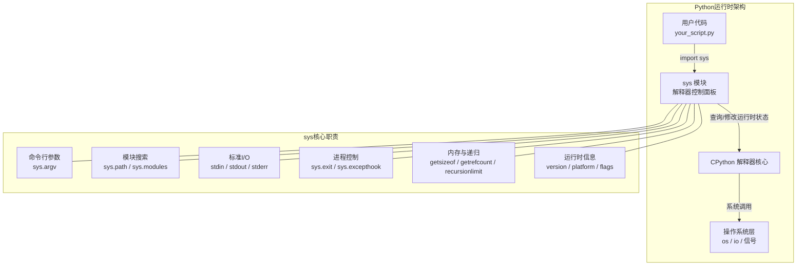
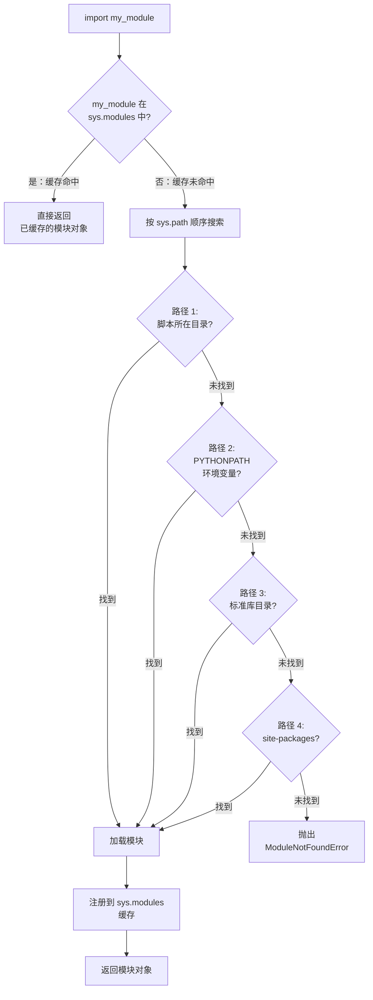
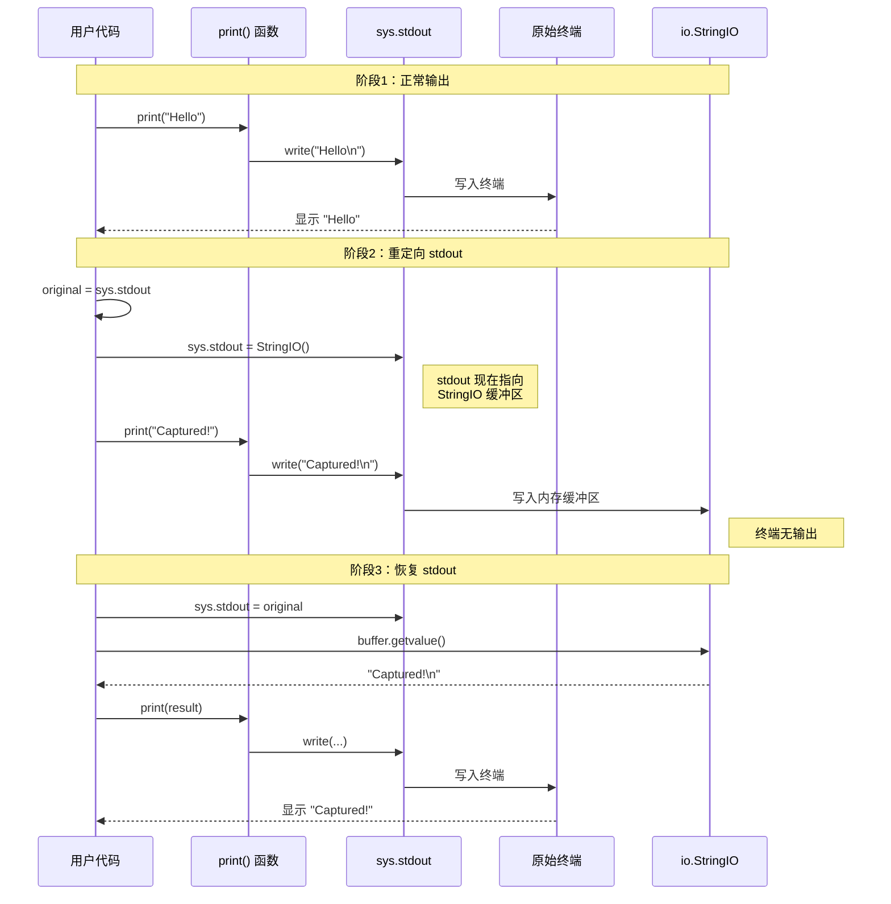

# sys 模块

`sys` 模块是 Python 与其解释器进行交互的核心接口。它提供了访问和修改解释器运行时环境多个方面的能力，包括命令行参数、模块搜索路径、标准 I/O 流、异常钩子、递归限制等。与 `os` 模块专注于操作系统交互（如文件系统、进程管理）不同，`sys` 模块聚焦于 Python 解释器本身。两者结合使用，可以构建出强大且具有高度系统意识的 Python 应用程序。

## 是什么：sys 模块在 Python 运行时中的角色

`sys` 模块是 Python 解释器的"控制面板"——它不是用来操作操作系统的，而是用来**观察和控制 Python 解释器自身**的。当你需要知道"Python 正在用什么版本运行""模块从哪里加载的""程序是怎么被调用的""递归深度够不够"这些关于**解释器运行时状态**的问题时，答案就在 `sys` 中。



### 为什么需要 sys 模块

| 场景 | 没有 sys | 有了 sys |
|------|---------|---------|
| 获取命令行参数 | 无法获取，脚本不知道自己被怎么调用 | `sys.argv` 一行搞定 |
| 知道 Python 版本 | 只能靠猜测或外部工具 | `sys.version_info` 精确到微版本 |
| 控制模块搜索路径 | 无法干预 import 行为 | `sys.path` 动态调整 |
| 捕获未处理异常 | 程序直接崩溃，无日志 | `sys.excepthook` 全局兜底 |
| 重定向输出 | 只能 print 到终端 | `sys.stdout` 可指向任意流 |
| 诊断内存问题 | 只能靠猜 | `sys.getsizeof` / `sys.getrefcount` 精确测量 |

### 怎么做：sys 核心属性速查表

| 功能分类 | 关键属性/函数 | 描述 |
|----------|-------------|------|
| **命令行参数** | `sys.argv` | 访问传递给 Python 脚本的命令行参数 |
| **解释器信息** | `sys.version`, `sys.version_info`, `sys.platform`, `sys.executable` | 获取 Python 版本、平台标识和解释器路径 |
| **模块与导入** | `sys.path`, `sys.modules`, `sys.builtin_module_names` | 管理模块搜索路径和检查已加载的模块 |
| **标准 I/O 流** | `sys.stdin`, `sys.stdout`, `sys.stderr` | 与标准输入、输出和错误流进行交互 |
| **进程控制** | `sys.exit()`, `sys.excepthook` | 终止程序、处理未捕获的异常 |
| **运行时环境** | `sys.getrecursionlimit()`, `sys.setrecursionlimit()` | 查询和设置最大递归深度 |
| **内存与调试** | `sys.getsizeof()`, `sys.getrefcount()` | 获取对象内存大小和引用计数 |
| **异常信息** | `sys.exc_info()` | 获取当前正在处理的异常的详细信息 |
| **运行时标志** | `sys.flags`, `sys.float_info`, `sys.hash_info` | 解释器启动标志和数值类型信息 |
| **高级调试** | `sys.setprofile()`, `sys.settrace()` | 用于性能分析和代码调试的底层钩子 |

---

## 1. sys.path：模块搜索机制

### 是什么

`sys.path` 是一个字符串列表，Python 解释器在执行 `import` 语句时，会按照这个列表的顺序依次搜索要导入的模块。它是 Python 导入系统的"寻路地图"。

### 为什么重要

理解 `sys.path` 是理解"为什么我的模块导入不了"的关键。90% 的 `ModuleNotFoundError` 都是因为 `sys.path` 中没有包含你的模块所在目录。

### 模块搜索流程



### 怎么做：检查和临时修改 sys.path

```python
import sys
import os

# ============================================================
# 1. 查看当前模块搜索路径
# ============================================================
print("--- 当前 sys.path ---")
for i, path in enumerate(sys.path):          # enumerate 给每条路径编号
    print(f"  [{i}] {path}")                  # 格式化输出，方便定位

# ============================================================
# 2. sys.path 的构成来源（按优先级从高到低）
# ============================================================
# 来源 1: 脚本所在目录（或交互模式下的当前目录）
# 来源 2: PYTHONPATH 环境变量中的目录
# 来源 3: Python 安装的标准库目录
# 来源 4: 第三方包的 site-packages 目录

# ============================================================
# 3. 临时添加搜索路径（仅当前进程有效）
# ============================================================
# 场景：项目结构如下
#   my_project/
#     main.py          <-- 你在这里
#     libs/
#       my_util.py     <-- 你想导入这个

current_dir = os.path.dirname(__file__)       # 获取当前脚本所在目录
lib_path = os.path.join(current_dir, 'libs')  # 拼接出 libs 目录的绝对路径

if lib_path not in sys.path:                  # 避免重复添加
    sys.path.insert(0, lib_path)              # insert(0, ...) 放到最前面，优先搜索

# 现在 import my_util 就能找到了
# import my_util

# ============================================================
# 4. 检查模块是否已加载
# ============================================================
print(f"\n--- 模块加载状态 ---")
print(f"'os' 已加载?     {'os' in sys.modules}")       # True，os 是常用内置模块
print(f"'json' 已加载?   {'json' in sys.modules}")     # 取决于之前是否 import 过
print(f"'requests' 已加载? {'requests' in sys.modules}") # 通常 False，除非已安装并导入
```

> **最佳实践**：在生产代码中直接修改 `sys.path` 是一种"代码异味"。它会使依赖关系变得不明确，并导致部署和维护困难。正确做法是使用虚拟环境 (`venv`)、相对导入或将项目打包安装 (`pip install -e .`)。

---

## 2. sys.argv：命令行参数处理

### 是什么

`sys.argv` 是一个字符串列表，包含了从命令行传递给 Python 脚本的所有参数。它是与命令行交互最基础的方式。

### 为什么重要

任何需要从外部传入配置的脚本（如指定文件名、设置模式、传递参数）都依赖命令行参数。`sys.argv` 是所有命令行处理的基础，即使你最终用 `argparse`，底层也是从 `sys.argv` 取值。

### 怎么做

```python
import sys

# ============================================================
# sys.argv 的结构
# ============================================================
# sys.argv[0]  → 脚本自身的名称（或路径）
# sys.argv[1:] → 传递给脚本的所有命令行参数
# sys.argv     → 完整列表

# 运行示例: python script.py arg1 "hello world" 123
# sys.argv = ['script.py', 'arg1', 'hello world', '123']
#             ^argv[0]    ^argv[1]  ^argv[2]      ^argv[3]

# ============================================================
# 示例 1：基础用法
# ============================================================
print(f"脚本名称: {sys.argv[0]}")
print(f"传递的参数: {sys.argv[1:]}")
print(f"参数数量: {len(sys.argv) - 1}")       # 减 1 是因为 argv[0] 是脚本名

# ============================================================
# 示例 2：带参数验证的脚本
# ============================================================
def main():
    """一个需要名字和年龄两个参数的脚本。"""
    # 检查参数数量是否足够
    if len(sys.argv) < 3:                      # 需要 argv[1] 和 argv[2]
        print(f"用法: {sys.argv[0]} <名字> <年龄>", file=sys.stderr)
        sys.exit(1)                            # 退出码 1 表示错误

    name = sys.argv[1]                         # 第一个参数：名字
    try:
        age = int(sys.argv[2])                 # 第二个参数：年龄（需转为整数）
        print(f"你好, {name}! 你明年将是 {age + 1} 岁。")
    except ValueError:                         # 年龄不是整数
        print(f"错误: 年龄必须是一个整数，收到: '{sys.argv[2]}'", file=sys.stderr)
        sys.exit(1)

# ============================================================
# 示例 3：简单的命令行工具框架
# ============================================================
def cli_tool():
    """一个支持子命令的简单 CLI 框架。"""
    if len(sys.argv) < 2:
        print("用法: tool.py <command> [args]")
        print("可用命令: greet, calc, info")
        sys.exit(1)

    command = sys.argv[1]                      # 子命令

    if command == "greet":
        name = sys.argv[2] if len(sys.argv) > 2 else "世界"
        print(f"你好, {name}!")
    elif command == "calc":
        if len(sys.argv) < 4:
            print("用法: tool.py calc <a> <b>", file=sys.stderr)
            sys.exit(1)
        a, b = int(sys.argv[2]), int(sys.argv[3])
        print(f"{a} + {b} = {a + b}")
    elif command == "info":
        print(f"Python: {sys.version}")
        print(f"平台: {sys.platform}")
    else:
        print(f"未知命令: {command}", file=sys.stderr)
        sys.exit(1)

if __name__ == "__main__":
    main()
```

> **最佳实践**：对于复杂的命令行应用，强烈建议使用 `argparse` 或 `click` 等库。它们提供了更健壮的参数解析、类型检查、帮助信息自动生成等功能。`sys.argv` 适合简单脚本，`argparse` 适合正式工具。

---

## 3. sys.stdin / stdout / stderr：标准 I/O 重定向机制

### 是什么

Python 进程启动时，解释器会自动创建三个标准 I/O 流对象，它们是程序与外部世界通信的三个"管道"。

| 流对象 | 默认指向 | 用途 | 典型使用 |
|--------|---------|------|---------|
| `sys.stdin` | 键盘输入 | 读取数据 | `input()`, 管道读取 |
| `sys.stdout` | 终端屏幕 | 正常输出 | `print()` |
| `sys.stderr` | 终端屏幕 | 错误/警告输出 | 异常回溯, 日志 |

### 为什么重要

- **stdout 与 stderr 分离**：正常输出和错误信息走不同的管道，可以分别重定向。例如 `python script.py > output.txt 2> error.log` 将正常输出和错误分别保存。
- **可替换性**：`sys.stdout` 和 `sys.stderr` 可以被替换为任何类文件对象，这是测试中捕获输出、日志系统中重定向输出的基础。

### 重定向机制时序图



### 怎么做

```python
import sys
import io
import contextlib

# ============================================================
# 示例 1：处理管道输入（stdin）
# ============================================================
def process_pipe_input():
    """从 stdin 逐行读取并处理，适合管道操作。"""
    # 常见用法: echo -e "hello\nworld" | python script.py
    # 或者: cat data.txt | python script.py
    for line in sys.stdin:                     # sys.stdin 是可迭代的，逐行读取
        processed = line.strip().upper()       # 去除首尾空白并转大写
        print(f"处理后: {processed}")           # 输出到 stdout

# ============================================================
# 示例 2：手动重定向 stdout（捕获 print 输出）
# ============================================================
def capture_stdout_manual():
    """手动重定向 sys.stdout 来捕获输出。"""
    def greet():
        print("Hello, World!")                 # 这个输出将被捕获

    string_io = io.StringIO()                  # 创建内存中的文本流
    original_stdout = sys.stdout               # 保存原始 stdout，必须恢复！

    try:
        sys.stdout = string_io                 # 重定向：stdout 指向内存流
        greet()                                # 调用函数，输出进入内存
    finally:
        sys.stdout = original_stdout           # 无论是否异常，都要恢复

    captured = string_io.getvalue()            # 获取捕获的内容
    print(f"捕获到的输出: '{captured.strip()}'")

# ============================================================
# 示例 3：使用 contextlib 更优雅地重定向（推荐）
# ============================================================
def capture_stdout_context():
    """使用 contextlib.redirect_stdout 上下文管理器。"""
    def greet():
        print("Hello from context!")

    f = io.StringIO()
    with contextlib.redirect_stdout(f):        # 上下文管理器自动保存和恢复
        greet()                                # 输出被重定向到 f

    captured = f.getvalue()
    print(f"捕获到的输出: '{captured.strip()}'")

# ============================================================
# 示例 4：同时重定向 stdout 和 stderr
# ============================================================
def capture_both():
    """同时捕获正常输出和错误输出。"""
    out_buffer = io.StringIO()
    err_buffer = io.StringIO()

    with contextlib.redirect_stdout(out_buffer), \
         contextlib.redirect_stderr(err_buffer):
        print("这是正常输出")                    # 进入 out_buffer
        print("这是错误信息", file=sys.stderr)   # 进入 err_buffer

    print(f"stdout: {out_buffer.getvalue().strip()}")
    print(f"stderr: {err_buffer.getvalue().strip()}")

# ============================================================
# 示例 5：stderr 的正确使用方式
# ============================================================
def proper_stderr_usage():
    """错误信息应该写到 stderr，而不是 stdout。"""
    # 错误做法：print("Error: file not found")
    #   → 错误信息混在正常输出中，管道处理时会污染数据

    # 正确做法：
    print("Error: file not found", file=sys.stderr)
    #   → 错误信息走 stderr，不影响 stdout 的管道处理

    # 这样做的好处：
    #   python script.py > result.txt 2> error.log
    #   → 正常结果和错误信息分别保存到不同文件

# ============================================================
# 示例 6：二进制数据的 I/O
# ============================================================
def binary_io():
    """处理二进制数据时使用 .buffer 属性。"""
    # sys.stdout 是文本流（TextIOWrapper），会自动编码
    # sys.stdout.buffer 是底层的二进制流（BufferedWriter），跳过编码
    import struct

    # 写入二进制数据到 stdout（适合管道传输）
    data = struct.pack('>I', 42)               # 打包为 4 字节大端整数
    sys.stdout.buffer.write(data)              # 直接写二进制，不经编码
    sys.stdout.buffer.flush()                  # 刷新缓冲区
```

---

## 4. sys.modules：模块缓存机制

### 是什么

`sys.modules` 是一个字典，键是模块名（字符串），值是已加载的模块对象。它是 Python 导入系统的**缓存层**——当一个模块被首次导入后，它的对象会被存入 `sys.modules`，后续的 `import` 语句直接从缓存中取，不再重新执行模块代码。

### 为什么重要

- **性能**：避免重复加载和执行同一个模块
- **单例保证**：整个进程中，同一个模块只有一个实例
- **调试**：可以查看哪些模块已加载，排查导入问题
- **热重载**：删除 `sys.modules` 中的条目可以强制重新导入（高级用法）

### 怎么做

```python
import sys

# ============================================================
# 1. 查看已加载的模块
# ============================================================
print(f"当前已加载模块数量: {len(sys.modules)}")

# 查看所有已加载模块的名称（按字母排序）
loaded = sorted(sys.modules.keys())
print(f"前 10 个模块: {loaded[:10]}")

# 检查特定模块是否已加载
print(f"'os' 已加载? {'os' in sys.modules}")         # True
print(f"'numpy' 已加载? {'numpy' in sys.modules}")   # 取决于是否 import 过

# ============================================================
# 2. 模块缓存的工作原理
# ============================================================
import json                                    # 首次导入 json
json_module_1 = sys.modules['json']           # 从缓存获取

import json                                    # 第二次导入——直接从缓存取
json_module_2 = sys.modules['json']

print(f"两次导入获取的是同一个对象? {json_module_1 is json_module_2}")
# True！这就是缓存的作用

# ============================================================
# 3. 强制重新导入模块（高级用法，慎用！）
# ============================================================
# 删除缓存条目后，下次 import 会重新执行模块代码
# del sys.modules['some_module']
# import some_module  # 会重新加载

# ⚠️ 警告：这可能导致难以调试的问题，因为其他已加载的模块
# 可能还持有旧模块对象的引用。生产代码请使用 importlib.reload()

# ============================================================
# 4. 使用 importlib.reload() 安全地重新加载（推荐）
# ============================================================
# import importlib
# importlib.reload(some_module)  # 安全地重新加载已导入的模块

# ============================================================
# 5. 统计已加载模块的分类
# ============================================================
def categorize_modules():
    """将已加载模块按来源分类。"""
    builtin_count = 0
    third_party_count = 0
    local_count = 0

    for name, mod in sys.modules.items():
        if mod is None:                         # 延迟导入的占位符
            continue
        if name in sys.builtin_module_names:
            builtin_count += 1
        elif 'site-packages' in getattr(mod, '__file__', '') or \
             'dist-packages' in getattr(mod, '__file__', ''):
            third_party_count += 1
        else:
            local_count += 1

    print(f"内置模块: {builtin_count}")
    print(f"第三方模块: {third_party_count}")
    print(f"其他模块: {local_count}")

categorize_modules()
```

---

## 5. sys.getrefcount / sys.getsizeof：内存管理

### 是什么

- `sys.getrefcount(obj)`：返回对象的**引用计数**，即当前有多少个引用指向该对象。这是 CPython 垃圾回收机制的核心数据。
- `sys.getsizeof(obj)`：返回对象自身占用的**内存字节数**。注意这是"浅大小"——只计算对象本身，不计算其引用的其他对象。

### 为什么重要

- **引用计数**是 CPython 内存管理的基础。当引用计数降为 0 时，对象会被立即回收。理解引用计数有助于排查内存泄漏。
- **内存大小**测量有助于优化数据结构的选择，特别是在处理大量数据时。

### 怎么做

```python
import sys

# ============================================================
# 1. sys.getrefcount：引用计数
# ============================================================
a = [1, 2, 3]                                  # 创建列表，引用计数 = 1
b = a                                          # b 也指向同一列表，引用计数 = 2
c = a                                          # c 也指向同一列表，引用计数 = 3

# 调用 getrefcount(a) 时，参数传递本身创建了一个临时引用
# 所以返回值 = 实际引用数 + 1（临时引用）+ 1（可能还有其他内部引用）
result = sys.getrefcount(a)
print(f"引用计数: {result}")
# 预期约为 4~5（3个变量 + 1个临时参数 + 可能的内部引用）

del b                                          # 删除 b，引用计数 -1
print(f"删除 b 后的引用计数: {sys.getrefcount(a)}")

del c                                          # 删除 c，引用计数 -1
print(f"删除 c 后的引用计数: {sys.getrefcount(a)}")

# ============================================================
# 2. sys.getsizeof：内存大小（浅测量）
# ============================================================
my_list = list(range(100))                     # 包含 100 个整数的列表
my_dict = {f"key_{i}": i for i in range(100)}  # 包含 100 个键值对的字典
my_set = set(range(100))                       # 包含 100 个整数的集合
my_tuple = tuple(range(100))                   # 包含 100 个整数的元组

print("--- 浅大小（仅容器本身）---")
print(f"list:   {sys.getsizeof(my_list)} 字节")
print(f"dict:   {sys.getsizeof(my_dict)} 字节")
print(f"set:    {sys.getsizeof(my_set)} 字节")
print(f"tuple:  {sys.getsizeof(my_tuple)} 字节")

# ============================================================
# 3. 深大小估算：容器 + 所有元素
# ============================================================
# getsizeof 只算"外壳"，不算"内容"
# 要估算总大小，需要递归计算所有元素

def deep_size(obj, seen=None):
    """递归估算对象的完整内存占用（字节）。"""
    if seen is None:
        seen = set()                            # 防止循环引用导致无限递归

    obj_id = id(obj)
    if obj_id in seen:                          # 已计算过的对象不再重复计算
        return 0
    seen.add(obj_id)

    size = sys.getsizeof(obj)                   # 对象自身的大小

    if isinstance(obj, dict):                   # 字典：递归计算所有键和值
        for k, v in obj.items():
            size += deep_size(k, seen)
            size += deep_size(v, seen)
    elif isinstance(obj, (list, tuple, set, frozenset)):
        # 列表/元组/集合：递归计算所有元素
        for item in obj:
            size += deep_size(item, seen)

    return size

print("\n--- 深大小（容器 + 所有元素）---")
print(f"list:   {deep_size(my_list)} 字节")
print(f"dict:   {deep_size(my_dict)} 字节")
print(f"set:    {deep_size(my_set)} 字节")
print(f"tuple:  {deep_size(my_tuple)} 字节")

# ============================================================
# 4. 不同数据结构的内存效率对比
# ============================================================
print("\n--- 存储 100 个整数，各容器内存对比 ---")
print(f"{'容器类型':<10} {'浅大小':>10} {'深大小':>10} {'每元素':>10}")
print("-" * 45)
for name, obj in [("list", my_list), ("tuple", my_tuple),
                   ("set", my_set), ("dict", my_dict)]:
    shallow = sys.getsizeof(obj)
    deep = deep_size(obj)
    per_elem = deep / 100
    print(f"{name:<10} {shallow:>10} {deep:>10} {per_elem:>10.1f}")
```

---

## 6. sys.setrecursionlimit / sys.getrecursionlimit：递归控制

### 是什么

Python 为了防止无限递归导致栈溢出崩溃，设置了最大递归深度限制。`sys.getrecursionlimit()` 返回当前限制，`sys.setrecursionlimit(n)` 可以修改它。

### 为什么重要

- 默认递归限制通常是 1000。对于正常的递归算法，这个限制足够了。
- 如果你的递归算法确实需要更深的调用栈，可以适当提高限制。
- 但**盲目提高限制是危险的**——它可能掩盖算法问题，并可能导致 C 层面的栈溢出，使整个进程崩溃。

### 怎么做

```python
import sys

# ============================================================
# 1. 查看和修改递归限制
# ============================================================
print(f"当前递归限制: {sys.getrecursionlimit()}")  # 通常为 1000

# 谨慎地临时修改递归限制
original_limit = sys.getrecursionlimit()
try:
    sys.setrecursionlimit(2000)                # 提高到 2000
    print(f"修改后的递归限制: {sys.getrecursionlimit()}")
    # ... 执行需要更深递归的代码 ...
finally:
    sys.setrecursionlimit(original_limit)      # 恢复原始限制

# ============================================================
# 2. 递归深度超限的演示
# ============================================================
def recursive_func(depth=0):
    """一个会递归到超限的函数。"""
    print(f"递归深度: {depth}", end="\r")       # \r 让输出在同一行刷新
    return recursive_func(depth + 1)           # 无限递归

# 取消下面的注释会触发 RecursionError
# try:
#     recursive_func()
# except RecursionError as e:
#     print(f"\n递归超限! 错误: {e}")

# ============================================================
# 3. 递归 vs 迭代的对比（推荐重构为迭代）
# ============================================================
# 递归版本：受递归深度限制
def factorial_recursive(n):
    """递归计算阶乘。"""
    if n <= 1:
        return 1
    return n * factorial_recursive(n - 1)      # 每次调用增加一层栈帧

# 迭代版本：不受递归深度限制（推荐）
def factorial_iterative(n):
    """迭代计算阶乘。"""
    result = 1
    for i in range(2, n + 1):                  # 只用一个栈帧
        result *= i
    return result

print(f"\n递归版 10! = {factorial_recursive(10)}")
print(f"迭代版 10! = {factorial_iterative(10)}")

# ============================================================
# 4. 获取当前实际递归深度
# ============================================================
import inspect

def show_call_depth(depth=0):
    """显示当前函数调用的实际栈深度。"""
    current_depth = len(inspect.stack())        # 获取当前调用栈的深度
    print(f"inspect 栈深度: {current_depth}, 参数 depth: {depth}")
    if depth < 5:                               # 只递归 5 层做演示
        show_call_depth(depth + 1)

show_call_depth()
```

---

## 7. sys.exc_info：异常信息

### 是什么

`sys.exc_info()` 返回一个三元组 `(type, value, traceback)`，包含当前正在处理的异常的完整信息。它主要用于在异常处理的外部获取异常详情，或在自定义异常钩子中记录异常。

### 为什么重要

- 在 `sys.excepthook` 自定义钩子中，`sys.exc_info()` 是获取异常信息的标准方式
- 在某些需要将异常信息传递到其他上下文的场景中（如日志系统、错误报告），`sys.exc_info()` 提供了完整的异常链

### 怎么做

```python
import sys
import traceback

# ============================================================
# 1. sys.exc_info 的基本用法
# ============================================================
try:
    result = 1 / 0                             # 故意触发 ZeroDivisionError
except ZeroDivisionError:
    exc_type, exc_value, exc_tb = sys.exc_info()
    # exc_type  → 异常类型：<class 'ZeroDivisionError'>
    # exc_value → 异常实例：division by zero
    # exc_tb    → 回溯对象：包含完整的调用栈信息

    print(f"异常类型: {exc_type.__name__}")
    print(f"异常信息: {exc_value}")
    print(f"回溯对象: {exc_tb}")

    # 使用 traceback 模块格式化完整的回溯信息
    tb_lines = traceback.format_exception(exc_type, exc_value, exc_tb)
    print("完整回溯:")
    print("".join(tb_lines))

# ============================================================
# 2. 在 except 块外部，sys.exc_info() 返回 (None, None, None)
# ============================================================
print(f"\n在 except 块外: {sys.exc_info()}")    # (None, None, None)

# ============================================================
# 3. 自定义 excepthook 中使用 exc_info
# ============================================================
import logging

logging.basicConfig(
    filename='error.log',
    level=logging.ERROR,
    format='%(asctime)s - %(levelname)s - %(message)s'
)

def custom_excepthook(exc_type, exc_value, exc_tb):
    """自定义全局异常钩子：记录日志 + 友好提示。"""
    # 格式化异常信息
    error_msg = "".join(traceback.format_exception(exc_type, exc_value, exc_tb))
    logging.error("未捕获的异常:\n%s", error_msg)  # 写入日志文件

    # 向用户显示友好的错误提示（不暴露技术细节）
    print(f"程序遇到错误，详情已记录到 error.log", file=sys.stderr)
    print(f"错误类型: {exc_type.__name__}", file=sys.stderr)

# 设置自定义钩子
sys.excepthook = custom_excepthook

# 以下未捕获的异常将触发 custom_excepthook
# result = 1 / 0

# ============================================================
# 4. exc_info 与 logging 模块配合
# ============================================================
# logging 模块内置支持 exc_info 参数
try:
    risky_operation = 1 / 0
except Exception:
    logging.error("操作失败", exc_info=True)   # exc_info=True 自动附加异常信息
    # 等价于:
    # logging.error("操作失败", exc_info=sys.exc_info())
```

---

## 8. sys.flags / sys.version / sys.platform：运行时信息

### 是什么

这些属性提供了 Python 解释器运行时的环境信息，对于编写跨平台、跨版本兼容的代码至关重要。

### 为什么重要

- **版本检查**：确保代码运行在兼容的 Python 版本上
- **平台适配**：根据操作系统执行不同的代码逻辑
- **调试报告**：在错误报告中包含环境信息，帮助定位问题
- **启动标志**：了解解释器的运行模式（优化模式、调试模式等）

### 怎么做

```python
import sys
import os

# ============================================================
# 1. sys.version / sys.version_info：Python 版本
# ============================================================
print("--- Python 版本信息 ---")
print(f"版本字符串: {sys.version}")
# 示例输出: 3.12.4 (main, Jun  6 2024, 18:26:44) [Clang 15.0.0 ...]

print(f"版本元组: {sys.version_info}")
# 示例输出: sys.version_info(major=3, minor=12, micro=4, releaselevel='final', serial=0)

# version_info 支持命名属性和索引访问
major = sys.version_info.major                  # 主版本号，如 3
minor = sys.version_info.minor                  # 次版本号，如 12
print(f"主版本: {major}, 次版本: {minor}")

# 版本检查的推荐方式（使用元组比较）
if sys.version_info < (3, 10):
    print("需要 Python 3.10+")
    sys.exit(1)

# ============================================================
# 2. sys.platform：操作系统平台
# ============================================================
print("\n--- 平台信息 ---")
print(f"平台标识: {sys.platform}")
# 'linux'   → Linux
# 'win32'   → Windows（包括 64 位）
# 'darwin'  → macOS

# 跨平台代码示例
def clear_screen():
    """根据平台执行不同的清屏命令。"""
    if sys.platform == "win32":
        os.system("cls")                        # Windows 清屏
    else:
        os.system("clear")                      # Linux/macOS 清屏

# 路径分隔符适配
def get_path_separator():
    """获取当前平台的路径分隔符。"""
    # 注意：推荐使用 os.path 或 pathlib，而不是手动拼接
    return "\\" if sys.platform == "win32" else "/"

# ============================================================
# 3. sys.executable：解释器路径
# ============================================================
print(f"\n解释器路径: {sys.executable}")
# 示例: /usr/bin/python3 或 C:\Python312\python.exe

# 用途：在脚本中启动子进程时，确保使用同一个 Python
# subprocess.run([sys.executable, 'other_script.py'])

# ============================================================
# 4. sys.flags：解释器启动标志
# ============================================================
print("\n--- 解释器启动标志 ---")
print(f"优化级别 (-O): {sys.flags.optimize}")       # 0=正常, 1=-O, 2=-OO
print(f"调试模式 (-d): {sys.flags.debug}")           # 0 或 1
print(f"交互模式: {sys.flags.interactive}")          # 是否在交互模式下运行
print(f"哈希随机化: {sys.flags.hash_randomization}") # 安全特性
print(f"隔离模式 (-I): {sys.flags.isolated}")        # 隔离模式
print(f"开发模式 (-X dev): {sys.flags.dev_mode}")    # 开发模式（3.7+）

# 优化模式的影响：
# -O: 移除 assert 语句和 __debug__ 条件代码
# -OO: 在 -O 基础上还移除 docstring

# ============================================================
# 5. sys.implementation：Python 实现信息
# ============================================================
print(f"\nPython 实现: {sys.implementation.name}")
# CPython → 'cpython'（最常见）
# PyPy   → 'pypy'
# Jython → 'jython'
# IronPython → 'ironpython'

# ============================================================
# 6. 生成环境诊断报告
# ============================================================
def diagnostic_report():
    """生成完整的环境诊断报告，适合在 bug report 中附带。"""
    print("=" * 60)
    print("Python 环境诊断报告")
    print("=" * 60)
    print(f"Python 版本:  {sys.version}")
    print(f"版本元组:     {sys.version_info}")
    print(f"实现:         {sys.implementation.name}")
    print(f"平台:         {sys.platform}")
    print(f"解释器路径:   {sys.executable}")
    print(f"递归限制:     {sys.getrecursionlimit()}")
    print(f"编码:         {sys.getdefaultencoding()}")
    print(f"文件系统编码: {sys.getfilesystemencoding()}")
    print(f"优化级别:     {sys.flags.optimize}")
    print(f"字节序:       {sys.byteorder}")           # 'little' 或 'big'
    print(f"已加载模块数: {len(sys.modules)}")
    print("=" * 60)

diagnostic_report()
```

---

## 9. 进程控制与退出

### 是什么

`sys.exit()` 和 `sys.excepthook` 提供了程序退出和全局异常处理的机制。

### 怎么做

```python
import sys
import atexit

# ============================================================
# 1. sys.exit()：正常退出
# ============================================================
# sys.exit(code) 会抛出 SystemExit 异常
# code=0 表示成功，非零表示错误
# 关键特性：try...finally 和 with 语句的清理代码**会**执行

def process_file(filename):
    """处理文件，失败时以错误码退出。"""
    try:
        with open(filename, 'r') as f:         # with 块确保文件关闭
            content = f.read()
            print(f"成功读取 {len(content)} 个字符")
    except FileNotFoundError:
        print(f"错误: 文件 '{filename}' 不存在", file=sys.stderr)
        sys.exit(1)                            # 退出码 1 = 错误
        # 注意：上面的 with 块和 try...finally 都会正常清理

# ============================================================
# 2. sys.exit() vs os._exit() 对比
# ============================================================
# sys.exit()      → 抛出 SystemExit，执行 finally 和 atexit
# os._exit()      → 立即终止进程，不执行任何清理
# os._exit() 只应在 fork() 后的子进程中使用

# ============================================================
# 3. atexit：注册退出时的清理函数
# ============================================================
def cleanup_database():
    """程序退出时关闭数据库连接。"""
    print("正在关闭数据库连接...")

def cleanup_temp_files():
    """程序退出时清理临时文件。"""
    print("正在清理临时文件...")

# 注册清理函数（按注册的逆序执行）
atexit.register(cleanup_temp_files)
atexit.register(cleanup_database)

# 使用装饰器语法注册
@atexit.register
def final_log():
    print("程序即将退出，记录最终日志。")

# ============================================================
# 4. sys.excepthook：全局异常钩子
# ============================================================
# 当异常未被捕获时，解释器调用 sys.excepthook
# 默认行为：打印回溯信息到 stderr
# 可以自定义，实现日志记录、错误报告等功能

import logging
import traceback

logging.basicConfig(
    filename='error.log',
    level=logging.ERROR,
    format='%(asctime)s - %(levelname)s - %(message)s'
)

def custom_excepthook(exc_type, exc_value, exc_tb):
    """自定义全局异常钩子。"""
    # 1. 记录到日志
    error_msg = "".join(traceback.format_exception(exc_type, exc_value, exc_tb))
    logging.error("未捕获的异常:\n%s", error_msg)

    # 2. 向用户显示友好提示
    print(f"\n程序遇到错误: {exc_type.__name__}: {exc_value}", file=sys.stderr)
    print("详情已记录到 error.log", file=sys.stderr)

    # 3. 确保钩子本身不会抛出异常
    # 如果钩子抛出异常，解释器会打印 "Error in sys.excepthook" 并使用默认钩子

sys.excepthook = custom_excepthook
```

---

## 最佳实践对比表

| 场景 | 推荐做法 | 不推荐做法 | 原因 |
|------|---------|-----------|------|
| 命令行参数 | `argparse` / `click` | 手动解析 `sys.argv` | 除非极简脚本，否则手动解析易出错、无帮助信息 |
| 修改模块搜索路径 | `pip install -e .` / 虚拟环境 | `sys.path.append()` | 隐式依赖，难以部署和维护 |
| 捕获 print 输出 | `contextlib.redirect_stdout()` | 手动赋值 `sys.stdout` | 上下文管理器自动恢复，更安全 |
| 错误信息输出 | `print(msg, file=sys.stderr)` | `print(msg)` 混到 stdout | stdout/stderr 分离是 Unix 哲学，便于管道处理 |
| 退出程序 | `sys.exit(code)` | `os._exit(code)` | `sys.exit` 执行清理，`os._exit` 立即终止 |
| 退出清理 | `atexit.register()` | 散落的 `try...finally` | atexit 集中管理，更健壮 |
| 递归深度不够 | 重构为迭代算法 | `sys.setrecursionlimit(10000)` | 提高限制可能掩盖问题，导致栈溢出崩溃 |
| 内存分析 | `tracemalloc` / `pympler` | `sys.getsizeof()` 逐个测量 | getsizeof 是浅测量，专业工具更准确 |
| 版本检查 | `sys.version_info >= (3, 8)` | 解析 `sys.version` 字符串 | 元组比较更可靠，不受字符串格式变化影响 |
| 平台判断 | `sys.platform` | `os.name` | `sys.platform` 更精确（区分 linux/darwin/win32） |
| 二进制输出 | `sys.stdout.buffer.write()` | `sys.stdout.write()` | 文本流会编码，二进制流直接传输 |

---

## 常见陷阱 / FAQ

### Q1：修改 sys.path 后为什么还是导入不了模块？

**可能原因**：
1. **路径顺序问题**：`sys.path.append()` 将路径放到末尾，如果同名的标准库模块存在，会优先被导入。使用 `sys.path.insert(0, path)` 将自定义路径放到最前面。
2. **路径不正确**：添加的是相对路径，但工作目录不是你预期的。始终使用 `os.path.abspath()` 转为绝对路径。
3. **缺少 `__init__.py`**：如果是包（目录），需要包含 `__init__.py` 文件（Python 3.3+ 支持隐式命名空间包，但显式声明更安全）。

```python
# 正确的临时添加方式
import os, sys
lib_path = os.path.abspath(os.path.join(os.path.dirname(__file__), 'libs'))
if lib_path not in sys.path:
    sys.path.insert(0, lib_path)              # insert(0, ...) 而非 append()
```

### Q2：重定向 stdout 后程序没有输出了，怎么办？

**最常见的原因**：忘记在 `finally` 块中恢复 `sys.stdout`，或者重定向代码抛出了异常导致恢复未执行。

```python
# 错误做法：没有 finally 保护
sys.stdout = io.StringIO()
do_something()                                 # 如果这里抛异常，stdout 永远回不来
sys.stdout = original_stdout                   # 这行不会执行！

# 正确做法：使用 try...finally 或 contextlib
original_stdout = sys.stdout
try:
    sys.stdout = io.StringIO()
    do_something()
finally:
    sys.stdout = original_stdout               # 无论如何都会恢复

# 更好的做法：使用上下文管理器
with contextlib.redirect_stdout(io.StringIO()):
    do_something()                             # 自动恢复
```

### Q3：为什么 sys.getrefcount() 的结果比我预期的多 1？

因为将对象作为参数传递给 `sys.getrefcount()` 函数本身就创建了一个对该对象的临时引用（函数的局部变量）。所以函数看到的引用计数总是比你代码中能直接看到的至少多一个。

```python
a = "hello"                                    # 引用计数 = 1 (变量 a)
# 调用 getrefcount(a) 时：
#   - 参数传递创建临时引用 → 引用计数 = 2
#   - 函数内部可能还有其他引用 → 可能更多
print(sys.getrefcount(a))                      # 输出通常 > 2
# 对于短字符串，CPython 有内部缓存（intern），引用计数可能更高
```

### Q4：sys.exit() 和 os._exit() 有什么区别？

| 特性 | `sys.exit()` | `os._exit()` |
|------|-------------|-------------|
| 机制 | 抛出 `SystemExit` 异常 | 直接调用 C 的 `_exit()` |
| `finally` 块 | 执行 | 不执行 |
| `atexit` 函数 | 执行 | 不执行 |
| `with` 语句清理 | 执行 | 不执行 |
| 可被捕获 | 是（`except SystemExit`） | 否 |
| 适用场景 | 正常退出 | `fork()` 后的子进程 |
| 推荐程度 | 推荐 | 仅特殊场景 |

### Q5：sys.getsizeof() 为什么不计算容器内元素的大小？

这是设计决策。`sys.getsizeof()` 只测量对象"外壳"的内存占用，因为：
1. **共享引用**：容器内的对象可能被多个容器引用，如果每个容器都计算，就会重复计算
2. **性能**：递归计算所有引用对象的成本很高
3. **循环引用**：容器可能包含循环引用，递归计算会无限循环

如需完整内存测量，使用 `pympler.asizeof()` 或 `tracemalloc` 模块。

### Q6：递归深度设多大才安全？

没有绝对的安全值，因为它取决于操作系统和 C 运行时的栈大小。一般建议：
- 默认值 1000 对大多数场景足够
- 如果确实需要更深，逐步增加（如 2000、3000），不要一步到位设为 10000+
- 更好的做法是**重构为迭代算法**，彻底消除递归深度限制
- 在 Linux 上，可以用 `ulimit -s` 查看和修改栈大小

### Q7：sys 和 os 模块有什么区别？

- **`sys`**：关注 Python **解释器**和其运行时环境。例如：命令行参数 (`sys.argv`)、Python 版本 (`sys.version`)、模块路径 (`sys.path`)、标准流 (`sys.stdout`)。
- **`os`**：关注**操作系统**。例如：文件操作 (`os.remove`)、目录操作 (`os.mkdir`)、环境变量 (`os.environ`)、进程管理 (`os.system`)。

简单记忆：**sys = Python 解释器，os = 操作系统**。

---

## 术语表

| 术语 | 英文 | 解释 |
|------|------|------|
| 解释器 | Interpreter | 执行 Python 代码的程序（如 CPython） |
| 运行时 | Runtime | 程序正在执行的状态，以及执行期间可用的服务和设施 |
| 标准流 | Standard Streams | stdin/stdout/stderr 三个预打开的 I/O 通道 |
| 引用计数 | Reference Count | 指向某个对象的引用数量，CPython 用它来决定何时回收内存 |
| 垃圾回收 | Garbage Collection (GC) | 自动回收不再使用的对象所占内存的机制 |
| 浅大小 | Shallow Size | 对象自身占用的内存，不包括其引用的其他对象 |
| 深大小 | Deep Size | 对象及其所有引用对象的完整内存占用 |
| 模块缓存 | Module Cache | `sys.modules` 字典，存储已加载的模块对象，避免重复导入 |
| 递归深度 | Recursion Depth | 函数调用自身的嵌套层数 |
| 栈溢出 | Stack Overflow | 递归调用过深，超出了调用栈的容量，导致程序崩溃 |
| 回溯 | Traceback | 异常发生时的函数调用链记录 |
| 异常钩子 | Exception Hook | `sys.excepthook`，处理未捕获异常的回调函数 |
| 退出码 | Exit Code | 程序退出时返回给操作系统的整数，0 表示成功，非零表示错误 |
| 上下文管理器 | Context Manager | 支持 `with` 语句的对象，自动管理资源的获取和释放 |
| 字节序 | Byte Order | 多字节数据在内存中的存储顺序（大端/小端） |
| site-packages | site-packages | Python 第三方包的默认安装目录 |
| PYTHONPATH | PYTHONPATH | 环境变量，指定额外的模块搜索目录 |
| 内建模块 | Builtin Module | 编译到解释器中的模块（如 `sys`、`builtins`），无需文件即可导入 |
| 命名空间包 | Namespace Package | Python 3.3+ 支持的无 `__init__.py` 的包，可跨多个目录分布 |

---

## 延伸阅读

| 资源 | 说明 |
|------|------|
| [Python 官方文档 - sys 模块](https://docs.python.org/3/library/sys.html) | 最权威的 sys 模块参考，包含所有属性和函数的详细说明 |
| [Python 官方文档 - argparse 模块](https://docs.python.org/3/library/argparse.html) | 命令行参数解析的推荐方案，比 sys.argv 更强大 |
| [Python 官方文档 - atexit 模块](https://docs.python.org/3/library/atexit.html) | 注册退出清理函数的标准方式 |
| [Python 官方文档 - importlib](https://docs.python.org/3/library/importlib.html) | 模块导入系统的编程接口，包含 reload() 等功能 |
| [Python 官方文档 - tracemalloc](https://docs.python.org/3/library/tracemalloc.html) | 精确的内存分配追踪工具，比 sys.getsizeof 更专业 |
| [PEP 302 -- New Import Hooks](https://peps.python.org/pep-0302/) | Python 导入钩子机制的设计文档 |
| [PEP 328 -- Imports: Multi-Line and Absolute/Relative](https://peps.python.org/pep-0328/) | 相对导入和绝对导入的设计文档 |
| [pympler](https://pympler.readthedocs.io/) | 第三方内存分析库，提供 asizeof() 等深大小测量工具 |
| [click](https://click.palletsprojects.com/) | 优雅的命令行工具创建库，比 argparse 更简洁 |
| [《流畅的 Python》第 12 章](https://book.douban.com/subject/34024808/) | 深入讲解 Python 导入系统的工作原理 |

## 版本差异（标准库 → Python 3.14）

| 模块/特性 | 本文编写时 | Python 3.14 变化 |
|-----------|-----------|------------------|
| `datetime` | `utcnow()` / `utcfromtimestamp()` | 3.12 起弃用，改用 `datetime.now(tz=datetime.UTC)` / `fromtimestamp(ts, tz=datetime.UTC)`（aware 对象） |
| `asyncio` | 基础 API | 3.14 新增内省能力（`asyncio.Task`/`Future` 状态查询）；3.11 起推荐 `TaskGroup` + `asyncio.timeout()` |
| `typing` | 旧式 `List`/`Dict` | 3.9+ 内置泛型；3.10+ 联合类型 `X \| Y`；3.12 `type` 语句；3.14 PEP 649 延迟注解 |
| `importlib` | `imp` 模块 | `imp` 于 3.12 移除，统一使用 `importlib` |
| 压缩 | zlib/gzip/bz2/lzma | 3.14 新增 `zstandard` 标准库支持（PEP 784） |
| `pathlib` | 基础路径操作 | 3.12+ 持续增强（`Path.walk()` 等）；`is_relative_to()` 自 3.9 起可用 |
| 往事清理 | — | 3.13 移除 `cgi`、`telnetlib`、`crypt`、`audioop` 等已废弃模块 |

> 本文讲解的模块核心 API 与使用模式在 3.14 中保持稳定；注意上述弃用/移除项，升级时优先用标准库推荐的替代方案。
