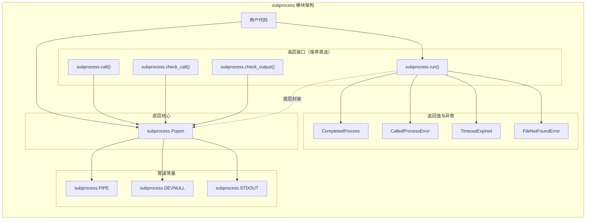
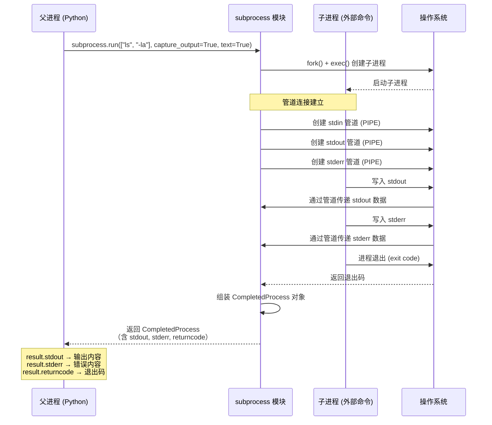
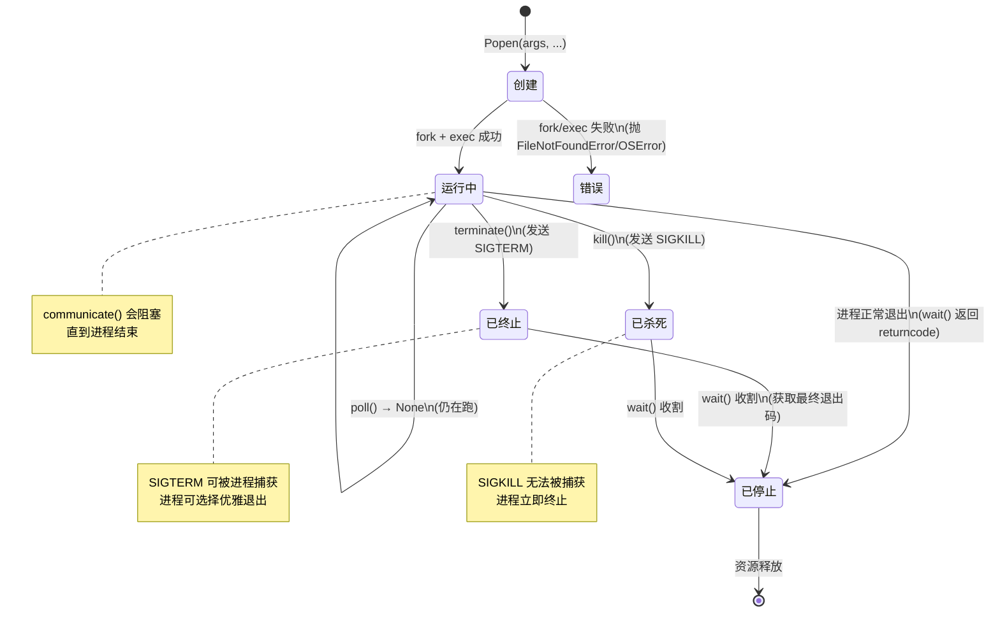
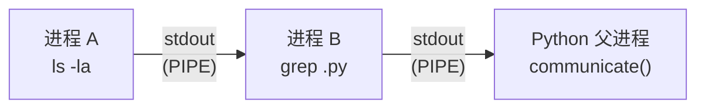
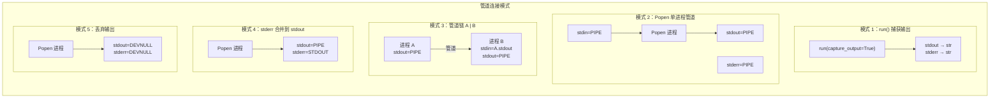
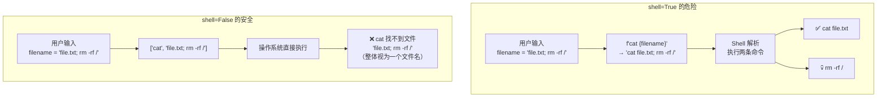

# `subprocess` 模块

## 是什么：进程管理的统一接口

`subprocess` 是 Python 标准库中用于**创建子进程、连接管道、获取返回状态**的模块。它取代了老旧的 `os.system()`、`os.spawn*()`、`os.popen*()` 等分散接口，提供了统一、安全、强大的进程管理能力。

**一句话定义**：`subprocess` = Python 调用外部程序的官方推荐方式。

## 为什么：旧接口的痛点与 subprocess 的解法

| 旧接口 | 痛点 | subprocess 的解法 |
|---|---|---|
| `os.system()` | 只能拿退出码，无法捕获输出 | `capture_output=True` 一步搞定 |
| `os.popen()` | 返回文件对象，无退出码，错误处理困难 | `CompletedProcess` 统一封装 stdout/stderr/returncode |
| `os.spawn*()` | 参数复杂，跨平台行为不一致 | `run()` / `Popen` 跨平台统一 |
| 上述所有 | 依赖 shell 解析，易命令注入 | 列表传参 + `shell=False` 天然防注入 |

**设计哲学**：一个模块覆盖所有子进程需求 —— 从简单的"跑一条命令"到复杂的"多进程管道链 + 实时交互"。

## 怎么做：从入门到精通

### 模块架构总览



---

## 1. 核心概念速查

| 概念 | 说明 | 类比 |
|---|---|---|
| **子进程 (Child Process)** | 由父进程创建的外部程序 | 你开了一家分店 |
| **CompletedProcess** | `run()` 返回的结果对象，含 stdout/stderr/returncode | 分店的经营报告 |
| **Popen 对象** | 代表一个正在运行的子进程，可精细控制 | 分店经理，你可以随时联络 |
| **管道 (Pipe)** | 进程间通信机制，A 的输出直接流入 B 的输入 | 传声筒 |
| **PIPE 常量** | 告诉 subprocess "给我建一根管道" | 接管传声筒的插头 |
| **DEVNULL 常量** | 丢弃输出，类似 `/dev/null` | 黑洞 |

---

## 2. `subprocess.run()` 执行流程

### 2.1 时序图



### 2.2 最简用法：执行一条命令

```python
import subprocess

# 执行 'ls -la' 命令
# args 传列表：第一个是命令，后面是参数
# 默认行为：stdout/stderr 直接打印到终端，run() 阻塞直到命令结束
result = subprocess.run(["ls", "-la"])

# returncode：0 表示成功，非 0 表示失败
print(f"命令执行完毕，退出码: {result.returncode}")
```

### 2.3 捕获输出：`capture_output=True`

```python
import subprocess

# capture_output=True：将 stdout 和 stderr 重定向到管道
# text=True：将字节流解码为字符串（否则返回 bytes）
result = subprocess.run(
    ["ls", "-la"],
    capture_output=True,  # 捕获 stdout + stderr
    text=True             # 以文本模式返回（等同于 encoding="utf-8"）
)

# result.stdout：标准输出（字符串）
# result.stderr：标准错误（字符串）
# result.returncode：退出码
print("--- STDOUT ---")
print(result.stdout)
print("--- STDERR ---")
print(result.stderr)
print(f"退出码: {result.returncode}")
```

### 2.4 错误处理：`check=True`

```python
import subprocess

# ---- FileNotFoundError：命令不存在 ----
try:
    subprocess.run(["non_existent_command"], check=True)
except FileNotFoundError as e:
    print(f"错误：命令未找到 - {e}")

# ---- CalledProcessError：命令执行失败（非零退出码） ----
try:
    # check=True：退出码非 0 时自动抛 CalledProcessError
    subprocess.run(
        ["ls", "/non_existent_directory"],
        check=True,
        capture_output=True,
        text=True
    )
except subprocess.CalledProcessError as e:
    print(f"错误：命令执行失败，退出码 {e.returncode}")
    print(f"STDERR: {e.stderr.strip()}")
    print(f"STDOUT: {e.stdout.strip()}")
```

### 2.5 完整参数签名速查

```python
subprocess.run(
    args,                  # 命令列表，如 ["ls", "-la"]
    *, 
    stdin=None,            # 子进程的标准输入来源
    input=None,            # 直接传入数据到 stdin（与 stdin 互斥）
    stdout=None,           # 子进程标准输出去向
    stderr=None,           # 子进程标准错误去向
    capture_output=False,  # = stdout=PIPE, stderr=PIPE 的快捷方式
    shell=False,           # 是否通过 shell 执行（⚠️ 安全风险）
    cwd=None,              # 子进程工作目录
    timeout=None,          # 超时秒数，超时抛 TimeoutExpired
    check=False,           # 非零退出码时抛 CalledProcessError
    encoding=None,         # 编码，如 "utf-8"
    errors=None,           # 编码错误处理策略，如 "replace"
    text=None,             # True = 文本模式（旧名 universal_newlines）
    env=None,              # 子进程环境变量字典
    **other_popen_kwargs   # 传递给 Popen 的其他参数
)
```

---

## 3. `subprocess.Popen` 生命周期

### 3.1 状态图



### 3.2 Popen 核心 API

```python
class subprocess.Popen:
    """底层子进程控制器。run() 的内部实现就是 Popen + communicate()。"""

    # ---- 构造参数（与 run() 大体相同，以下为重点差异） ----
    # stdin/stdout/stderr: 可设为 subprocess.PIPE 创建管道
    # bufsize: 管道缓冲区大小，-1=系统默认，0=无缓冲（二进制模式），1=行缓冲（文本模式）

    # ---- 核心属性 ----
    # .pid: 子进程 ID
    # .returncode: 退出码（未退出时为 None）

    # ---- 核心方法 ----
    # .poll()              → 检查是否退出，返回 returncode 或 None
    # .wait(timeout=None)  → 阻塞等待退出，超时抛 TimeoutExpired
    # .communicate(input=None, timeout=None) → 发送输入 + 读取全部输出 + 等待退出
    # .send_signal(sig)    → 发送信号
    # .terminate()         → 发 SIGTERM（优雅终止）
    # .kill()              → 发 SIGKILL（强制杀死）
```

### 3.3 实时输出处理：逐行读取

这是 `Popen` 最经典的使用场景 —— `run()` 只能等命令跑完才能拿到输出，而 `Popen` 可以边跑边读。

```python
import subprocess

# 启动子进程，将 stdout 重定向到管道
# bufsize=1 + text=True：启用行缓冲，readline() 每读到一行就返回
process = subprocess.Popen(
    ["ping", "-c", "5", "example.com"],
    stdout=subprocess.PIPE,   # 创建 stdout 管道
    stderr=subprocess.PIPE,   # 创建 stderr 管道
    text=True,                # 文本模式
    bufsize=1                 # 行缓冲（text 模式下生效）
)

print("--- 实时读取 stdout ---")
while True:
    # readline() 阻塞等待一行输出
    output = process.stdout.readline()

    # 两个退出条件：
    # 1. readline() 返回空字符串（管道已关闭）
    # 2. poll() 不再返回 None（进程已退出）
    if output == '' and process.poll() is not None:
        break
    if output:
        # strip() 去掉行尾换行
        print(output.strip())

# 确保进程已结束，获取最终退出码
return_code = process.wait()
print(f"\n进程已结束，退出码: {return_code}")
```

### 3.4 进程间通信：管道链



```python
import subprocess

# ---- 模拟 shell 的 'ls -la | grep .py' ----

# 第一步：启动 ls 进程，stdout 接管道
ls_process = subprocess.Popen(
    ["ls", "-la"],
    stdout=subprocess.PIPE,  # ls 的输出通过管道传出
    text=True
)

# 第二步：启动 grep 进程，stdin 接 ls 的 stdout 管道
grep_process = subprocess.Popen(
    ["grep", ".py"],
    stdin=ls_process.stdout,  # grep 的输入 = ls 的输出
    stdout=subprocess.PIPE,   # grep 的输出也接管道
    text=True
)

# 第三步：关闭 ls_process.stdout 的引用
# 原因：ls_process.stdout 被 grep_process 接管后，
# 父进程不再需要它。如果不关闭，ls 进程在 grep 还没读完时
# 可能无法正常退出（因为管道的写入端还有一个引用）
ls_process.stdout.close()

# 第四步：从管道链末端读取最终输出
# communicate() 会读取全部 stdout/stderr 并等待进程退出
output, errors = grep_process.communicate()
print(output)

# 第五步（可选）：检查两个进程的退出码
ls_exit = ls_process.wait()
grep_exit = grep_process.returncode
print(f"ls 退出码: {ls_exit}, grep 退出码: {grep_exit}")
```

### 3.5 进程生命周期管理：启动 → 监控 → 终止

```python
import subprocess
import time
import signal

# ---- 启动 ----
print("启动一个长时间运行的进程...")
process = subprocess.Popen(["sleep", "60"])
print(f"进程已启动，PID: {process.pid}")

# ---- 监控 ----
time.sleep(5)  # 等待 5 秒

if process.poll() is None:
    print("进程仍在运行。现在尝试终止它...")
    # ---- 优雅终止 (SIGTERM) ----
    # SIGTERM 是"请退出"信号，进程可以捕获它做清理工作
    process.terminate()
else:
    print("进程已经结束。")

# ---- 等待终止 ----
try:
    # 给进程 5 秒时间优雅退出
    exit_code = process.wait(timeout=5)
    print(f"进程已成功终止，退出码: {exit_code}")
except subprocess.TimeoutExpired:
    print("终止超时，进程拒绝退出，强制杀死！")
    # ---- 强制杀死 (SIGKILL) ----
    # SIGKILL 无法被捕获，操作系统直接终止进程
    process.kill()
    exit_code = process.wait()  # 仍需 wait() 收割僵尸进程
    print(f"进程已被强制杀死，退出码: {exit_code}")
```

### 3.6 三级进程链：`A | B | C`

```python
import subprocess

# ---- 模拟 'cat file.txt | sort | uniq -c' ----

# 进程 A：cat（读取文件内容）
p_cat = subprocess.Popen(
    ["cat", "/etc/hosts"],    # macOS/Linux 系统文件，一定存在
    stdout=subprocess.PIPE,
    text=True
)

# 进程 B：sort（排序）
p_sort = subprocess.Popen(
    ["sort"],
    stdin=p_cat.stdout,       # 输入来自 cat
    stdout=subprocess.PIPE,
    text=True
)

# 进程 C：uniq -c（去重并计数）
p_uniq = subprocess.Popen(
    ["uniq", "-c"],
    stdin=p_sort.stdout,      # 输入来自 sort
    stdout=subprocess.PIPE,
    text=True
)

# 关闭中间管道的父进程引用
p_cat.stdout.close()
p_sort.stdout.close()

# 从管道链末端读取
output, _ = p_uniq.communicate()
print(output)

# 等待所有进程结束
p_cat.wait()
p_sort.wait()
print(f"cat: {p_cat.returncode}, sort: {p_sort.returncode}, uniq: {p_uniq.returncode}")
```

---

## 4. 管道与进程间通信详解

### 4.1 管道连接全景图



### 4.2 五种管道模式代码对照

```python
import subprocess

# ---- 模式 1：run() 捕获输出（最常用） ----
result = subprocess.run(["ls"], capture_output=True, text=True)
print(result.stdout)

# ---- 模式 2：Popen 单进程管道（实时读取） ----
p = subprocess.Popen(["ls"], stdout=subprocess.PIPE, text=True)
for line in p.stdout:
    print(line.strip())
p.wait()

# ---- 模式 3：管道链（已在 3.6 节详述） ----
# 见 3.6 节

# ---- 模式 4：stderr 合并到 stdout ----
# 场景：不区分标准输出和错误，统一处理
result = subprocess.run(
    ["ls", "/nonexistent"],
    stdout=subprocess.PIPE,
    stderr=subprocess.STDOUT,  # stderr 合并到 stdout
    text=True
)
print(result.stdout)  # 包含 stdout + stderr

# ---- 模式 5：丢弃输出（静默执行） ----
# 场景：只关心命令是否成功，不关心输出
result = subprocess.run(
    ["ls"],
    stdout=subprocess.DEVNULL,  # 丢弃 stdout
    stderr=subprocess.DEVNULL,  # 丢弃 stderr
    check=True
)
print("命令执行成功")
```

---

## 5. API 对比表：run vs Popen vs os.system

| 维度 | `subprocess.run()` | `subprocess.Popen` | `os.system()` |
|---|---|---|---|
| **定位** | 高层便捷接口 | 底层精细控制 | 遗留接口，不推荐 |
| **阻塞行为** | 阻塞，等待子进程结束 | 非阻塞，立即返回 Popen 对象 | 阻塞 |
| **捕获输出** | `capture_output=True` | `stdout=PIPE` + `communicate()` | 无法捕获 |
| **获取退出码** | `result.returncode` | `process.wait()` 或 `process.returncode` | 返回值（但语义不明确） |
| **实时输出** | 不支持 | `process.stdout.readline()` 逐行读 | 不支持 |
| **管道链** | 不支持 | 手动连接 `stdin`/`stdout` | 依赖 `shell=True` |
| **超时处理** | `timeout` 参数 | `communicate(timeout=)` / `wait(timeout=)` | 无 |
| **错误处理** | `check=True` 抛异常 | 手动检查 `returncode` | 无 |
| **安全性** | 列表传参天然安全 | 列表传参天然安全 | 依赖 shell，易注入 |
| **进程信号** | 不支持 | `terminate()` / `kill()` / `send_signal()` | 不支持 |
| **并行多进程** | 不支持（阻塞） | 支持（创建多个 Popen 对象） | 不支持 |
| **适用场景** | 90% 的日常需求 | 实时交互、管道链、并行执行 | 遗留代码维护 |

**选择决策树**：

```
需要执行子进程？
├── 只需执行命令、拿结果 → subprocess.run()
├── 需要实时读取输出 → subprocess.Popen + stdout=PIPE
├── 需要管道链 (A | B | C) → subprocess.Popen（多实例）
├── 需要并行多个子进程 → subprocess.Popen（多实例）
└── 遗留代码中 os.system() → 迁移到 subprocess.run()
```

---

## 6. `shell=True` 的安全风险与命令注入防范

### 6.1 命令注入原理



### 6.2 攻击示范与防御

```python
import subprocess
import shlex

# ---- 攻击场景 ----
filename = "file.txt; rm -rf /"  # 恶意用户输入

# 危险！shell=True 会把分号解释为命令分隔符
# 实际执行：cat file.txt → rm -rf /
subprocess.run(f"cat {filename}", shell=True)  # 💀 命令注入！

# ---- 防御 1：列表传参（首选） ----
# shell=False（默认）时，filename 整体被视为一个参数
# cat 会尝试打开名为 "file.txt; rm -rf /" 的文件（当然不存在）
subprocess.run(["cat", filename])  # ✅ 安全

# ---- 防御 2：shlex.quote()（必须 shell=True 时） ----
# shlex.quote() 会在特殊字符外加引号，使其失去 shell 语法含义
quoted = shlex.quote(filename)
# quoted = "'file.txt; rm -rf /'"  → shell 把它当字符串，不当命令
subprocess.run(f"cat {quoted}", shell=True)  # ✅ 安全但非首选

# ---- 防御 3：shlex.split()（把命令字符串安全拆成列表） ----
cmd_string = "ls -la 'a directory with spaces'"
args = shlex.split(cmd_string)
# args = ['ls', '-la', 'a directory with spaces']
subprocess.run(args)  # ✅ 安全，无需 shell=True
```

### 6.3 什么时候才需要 `shell=True`？

| 场景 | 是否需要 shell=True | 替代方案 |
|---|---|---|
| 执行一条命令 + 参数 | 否 | `["cmd", "arg1"]` |
| 使用 shell 通配符 `*.py` | 否 | Python `glob.glob()` |
| 使用 shell 管道 `A \| B` | 否 | Popen 管道链（见 3.4/3.6） |
| 使用 shell 变量 `$HOME` | 否 | `os.environ["HOME"]` |
| 使用 shell 重定向 `> file` | 否 | `open("file", "w")` 作为 stdout |
| 需要 shell 内建命令（alias 等） | 可能需要 | 用 Python 等效功能替代 |
| 复杂的 shell 脚本（循环、条件） | 可能需要 | 重写为 Python 代码 |

**核心原则**：能用 `shell=False` 就用 `shell=False`。必须用 `shell=True` 时，**永远不要**将未净化的外部输入拼入命令字符串。

---

## 7. 超时处理与信号机制

### 7.1 超时处理

```python
import subprocess

# ---- run() 的 timeout 参数 ----
# 超时后，run() 会先 kill 子进程，再抛 TimeoutExpired
try:
    result = subprocess.run(
        ["sleep", "100"],
        timeout=3  # 3 秒超时
    )
except subprocess.TimeoutExpired as e:
    print(f"命令超时！已终止进程")
    # TimeoutExpired 携带 cmd / timeout / output / stderr，不含退出码
    print(f"超时设置: {e.timeout}s")
    # e.stdout / e.stderr：超时前已捕获的输出

# ---- Popen 的超时处理（更精细） ----
process = subprocess.Popen(["sleep", "100"])
try:
    exit_code = process.wait(timeout=3)
except subprocess.TimeoutExpired:
    print("等待超时，尝试优雅终止...")
    process.terminate()  # SIGTERM
    try:
        process.wait(timeout=2)  # 再给 2 秒
        print("进程已优雅退出")
    except subprocess.TimeoutExpired:
        print("进程拒绝退出，强制杀死")
        process.kill()  # SIGKILL
        process.wait()  # 必须收割僵尸进程
```

### 7.2 信号机制详解

```python
import subprocess
import signal
import os

# ---- 信号层次：从温和到暴力 ----
# SIGTERM (15)："请退出"，进程可捕获并做清理
# SIGINT  (2) ："Ctrl+C"，进程可捕获
# SIGKILL (9) ："强制终止"，进程无法捕获，OS 直接杀

process = subprocess.Popen(["sleep", "100"])

# 发送 SIGTERM（等同 process.terminate()）
process.send_signal(signal.SIGTERM)

# 等一下看进程是否退出
try:
    process.wait(timeout=3)
except subprocess.TimeoutExpired:
    # 发送 SIGKILL（等同 process.kill()）
    process.send_signal(signal.SIGKILL)
    process.wait()

# ---- 跨平台注意 ----
# Windows 上：
# - terminate() 调用 TerminateProcess()
# - kill() 与 terminate() 行为相同
# - send_signal() 仅支持 SIGTERM 和 SIGKILL
# POSIX 上：
# - terminate() 发送 SIGTERM
# - kill() 发送 SIGKILL
# - send_signal() 可发送任何信号
```

---

## 8. 实战案例

### 8.1 调用外部命令：Git 操作封装

```python
import subprocess
import shutil
from typing import Optional

def run_git(*args: str, cwd: Optional[str] = None) -> str:
    """安全的 Git 命令封装。

    Args:
        *args: Git 子命令和参数，如 "log", "--oneline", "-10"
        cwd: 工作目录

    Returns:
        命令的标准输出（已去除首尾空白）

    Raises:
        FileNotFoundError: Git 未安装
        CalledProcessError: Git 命令执行失败
    """
    # 先检查 git 是否可用
    if not shutil.which("git"):
        raise FileNotFoundError("Git 未安装或不在 PATH 中")

    result = subprocess.run(
        ["git", *args],       # 列表传参，安全
        capture_output=True,
        text=True,
        check=True,           # 非零退出码抛异常
        cwd=cwd,
        timeout=30            # 30 秒超时
    )
    return result.stdout.strip()

# 使用示例
try:
    # 查看最近 5 条提交
    log = run_git("log", "--oneline", "-5")
    print(log)

    # 查看当前分支
    branch = run_git("branch", "--show-current")
    print(f"当前分支: {branch}")
except subprocess.CalledProcessError as e:
    print(f"Git 命令失败: {e.stderr}")
```

### 8.2 实时输出处理：进度条监控

```python
import subprocess
import sys
import re

def run_with_progress(command: list[str], pattern: str = r"(\d+)%") -> None:
    """运行命令并实时显示进度。

    Args:
        command: 命令列表
        pattern: 匹配进度百分点的正则表达式
    """
    process = subprocess.Popen(
        command,
        stdout=subprocess.PIPE,
        stderr=subprocess.STDOUT,  # stderr 合并到 stdout
        text=True,
        bufsize=1                  # 行缓冲
    )

    last_percent = 0
    while True:
        line = process.stdout.readline()
        if line == '' and process.poll() is not None:
            break
        if line:
            # 尝试从输出中提取进度
            match = re.search(pattern, line)
            if match:
                percent = int(match.group(1))
                if percent > last_percent:
                    last_percent = percent
                    # 在同一行更新进度条
                    bar_len = 40
                    filled = int(bar_len * percent / 100)
                    bar = '█' * filled + '░' * (bar_len - filled)
                    sys.stdout.write(f"\r[{bar}] {percent}%")
                    sys.stdout.flush()
            else:
                # 非进度行，直接打印
                print(line.strip())

    process.wait()
    if last_percent > 0:
        print()  # 进度条换行
    print(f"完成，退出码: {process.returncode}")

# 使用示例：用 curl 下载（curl 会输出进度信息）
# run_with_progress(["curl", "-O", "https://example.com/largefile.zip"])
```

### 8.3 并行执行多个子进程

```python
import subprocess
import time
from concurrent.futures import ThreadPoolExecutor, as_completed

def ping_host(host: str, count: int = 3) -> dict:
    """Ping 指定主机并返回结果。"""
    try:
        result = subprocess.run(
            ["ping", "-c", str(count), "-W", "2", host],  # -W 2：Linux 下单次等待 2 秒（macOS 的 ping -W 单位是毫秒，跨平台脚本请以 timeout 参数兜底）
            capture_output=True,
            text=True,
            timeout=count * 3 + 2  # 合理超时
        )
        return {
            "host": host,
            "alive": result.returncode == 0,
            "output": result.stdout if result.returncode == 0 else result.stderr
        }
    except subprocess.TimeoutExpired:
        return {"host": host, "alive": False, "output": "超时"}
    except FileNotFoundError:
        return {"host": host, "alive": False, "output": "ping 命令不可用"}

# 并行 ping 多台主机
hosts = ["example.com", "google.com", "github.com", "nonexistent.test"]

start = time.time()
with ThreadPoolExecutor(max_workers=4) as executor:
    futures = {executor.submit(ping_host, h): h for h in hosts}
    for future in as_completed(futures):
        result = future.result()
        status = "✅ 在线" if result["alive"] else "❌ 离线"
        print(f"{result['host']}: {status}")

print(f"总耗时: {time.time() - start:.2f}s")
```

### 8.4 与子进程交互：问答式通信

```python
import subprocess

# 场景：子进程需要交互式输入（如确认提示）
# 使用 communicate() 一次性发送所有输入

# 模拟一个需要确认的命令
# 这里用 Python 脚本模拟交互式程序
script = """
name = input("请输入你的名字: ")
age = input("请输入你的年龄: ")
print(f"你好, {name}! 你 {age} 岁了。")
"""

process = subprocess.Popen(
    ["/usr/bin/env", "python3", "-c", script],
    stdin=subprocess.PIPE,
    stdout=subprocess.PIPE,
    stderr=subprocess.PIPE,
    text=True
)

# communicate() 一次性发送所有输入
# 注意：输入之间用换行分隔，模拟用户按回车
output, errors = process.communicate(input="张三\n25\n", timeout=10)
print(output)

# ---- 重要：communicate() 只能调用一次！ ----
# 如果需要多次交互，必须用 process.stdin.write() + process.stdout.read()
# 但这很容易死锁，推荐使用 pexpect 等第三方库
```

---

## 9. 最佳实践对比表

| 实践 | 推荐做法 | 反模式 | 原因 |
|---|---|---|---|
| **传参方式** | `["cmd", "arg1"]` 列表 | `"cmd arg1"` 字符串 + `shell=True` | 防命令注入 |
| **捕获输出** | `capture_output=True, text=True` | `stdout=PIPE, stderr=PIPE` 手动设置 | 更简洁 |
| **错误处理** | `check=True` + `try/except` | 手动检查 `returncode` | 自动抛异常，代码更清晰 |
| **超时保护** | 始终设置 `timeout` | 不设超时 | 防止程序永久阻塞 |
| **编码处理** | `text=True` 或 `encoding="utf-8"` | 默认二进制模式再手动 decode | 自动处理编码 |
| **实时输出** | `Popen` + `stdout=PIPE` + 逐行读 | `run()` 等全部跑完 | `run()` 是阻塞的 |
| **管道链** | 多个 `Popen` 连接 | `shell=True` + `\|` | 更安全、更可控 |
| **进程终止** | 先 `terminate()` → 等 → 再 `kill()` | 直接 `kill()` | 给进程清理机会 |
| **命令检查** | `shutil.which()` 预检 | 直接运行 | 避免 FileNotFoundError |
| **工作目录** | `cwd` 参数 | `os.chdir()` | 不影响父进程 |
| **环境变量** | `env=os.environ.copy()` 再修改 | 直接修改 `os.environ` | 不影响父进程 |
| **僵尸进程** | 必须 `wait()` 或 `communicate()` | 创建后不等待 | 避免资源泄漏 |

---

## 10. 常见陷阱与 FAQ

### Q1: `shell=True` 到底有多危险？

**非常危险**。任何来自外部的输入拼入 shell 命令字符串，都可能导致命令注入。攻击方式包括：

```python
# 攻击向量一览
user_input = "file.txt; rm -rf /"        # 命令分隔
user_input = "file.txt && rm -rf /"      # 条件执行
user_input = "$(rm -rf /)"               # 命令替换
user_input = "`rm -rf /`"                # 反引号替换
user_input = "file.txt | rm -rf /"       # 管道注入
user_input = "file.txt\nrm -rf /"        # 换行注入
```

**唯一安全的使用方式**：命令字符串完全由代码内部构造，不含任何外部输入。

### Q2: 超时后子进程真的被杀了吗？

**`run()` 的 timeout**：是的。超时后 `run()` 会先 `kill()` 子进程，再抛 `TimeoutExpired`。

**`Popen` 的 `wait(timeout=)` / `communicate(timeout=)`**：不是！超时只抛异常，**不会自动杀进程**。你必须手动处理：

```python
try:
    process.wait(timeout=5)
except subprocess.TimeoutExpired:
    process.kill()    # 必须手动 kill！
    process.wait()    # 必须收割！
```

### Q3: 子进程输出很大时会怎样？

如果子进程输出量很大（GB 级），`communicate()` 会把所有输出读入内存，可能导致 OOM。

**解决方案**：使用 `Popen` + 逐行/分块读取，流式处理：

```python
process = subprocess.Popen(
    ["large_output_command"],
    stdout=subprocess.PIPE,
    text=True
)

# 流式处理，不占大量内存
for line in process.stdout:
    process_line(line)  # 处理完即丢弃

process.wait()
```

**死锁陷阱**：如果同时往 `stdin` 写数据 + 从 `stdout` 读数据，不要用 `process.stdin.write()` + `process.stdout.read()`，容易死锁。应该用 `communicate(input=data)` 一次性交互。

### Q4: 为什么输出是乱码？

**原因**：子进程的编码与 Python 默认编码不一致。

```python
# ---- 问题：Windows 上很多命令输出 GBK 编码 ----
# 默认 text=True 使用 locale.getpreferredencoding()
# Windows 中文系统上是 GBK (cp936)

# ---- 解决方案 1：显式指定编码 ----
result = subprocess.run(
    ["some_command"],
    capture_output=True,
    encoding="gbk",        # 显式指定子进程的编码
    errors="replace"       # 无法解码的字符用 � 替代
)

# ---- 解决方案 2：二进制模式 + 手动解码 ----
result = subprocess.run(
    ["some_command"],
    capture_output=True
    # 不设 text=True，返回 bytes
)
try:
    text = result.stdout.decode("utf-8")
except UnicodeDecodeError:
    text = result.stdout.decode("gbk", errors="replace")

# ---- 解决方案 3：环境变量强制 UTF-8 ----
import os
env = os.environ.copy()
env["PYTHONIOENCODING"] = "utf-8"
env["LANG"] = "en_US.UTF-8"
result = subprocess.run(["some_command"], env=env, capture_output=True, text=True)
```

### Q5: 为什么 `shell=False` 时命令找不到？

`shell=False` 时，操作系统直接查找可执行文件。以下类型的"命令"不是独立可执行文件：

| 类型 | 示例 | 解决方案 |
|---|---|---|
| Shell 内建命令 | `cd`, `echo`, `export` | 用 Python 等效功能（`os.chdir` 等） |
| Shell 别名 | `ll`, `gs` | 用完整命令或 `shutil.which()` 查路径 |
| Shell 函数 | 自定义 `.bashrc` 函数 | 不可调用，改用 Python 实现 |
| 不在 PATH 的命令 | 自定义脚本 | 用绝对路径或 `shutil.which()` |

```python
import shutil
import subprocess

# 安全做法：先检查命令是否存在
git_path = shutil.which("git")
if git_path:
    subprocess.run([git_path, "--version"])
else:
    print("Git 未安装")
```

### Q6: `communicate()` 和手动读写管道有什么区别？

| 方式 | 优点 | 缺点 | 适用场景 |
|---|---|---|---|
| `communicate()` | 避免死锁，自动关闭管道 | 只能调用一次，全量读入内存 | 一次性交互 |
| 手动读写 | 可多次交互，可流式处理 | 容易死锁（需非常小心缓冲区） | 实时流式输出 |
| 第三方库 `pexpect` | 专为交互式会话设计 | 非标准库 | 复杂交互（SSH、REPL 等） |

### Q7: 如何在子进程中运行 Python 脚本？

```python
import subprocess
import sys

# 关键：用 sys.executable 确保使用同一个 Python 解释器
# 不要硬编码 "python" 或 "python3"
result = subprocess.run(
    [sys.executable, "my_script.py", "--arg", "value"],
    capture_output=True,
    text=True,
    check=True
)
print(result.stdout)
```

---

## 术语表

| 术语 | 英文 | 说明 |
|---|---|---|
| 子进程 | Child Process | 由父进程通过 fork+exec 创建的新进程 |
| 父进程 | Parent Process | 创建子进程的原始进程 |
| 退出码 | Exit Code / Return Code | 进程退出时返回给操作系统的整数，0=成功，非0=失败 |
| 管道 | Pipe | 操作系统提供的进程间通信机制，单向字节流 |
| fork | fork | POSIX 系统调用，创建当前进程的副本 |
| exec | exec | POSIX 系统调用，用新程序替换当前进程映像 |
| SIGTERM | Signal Terminate | 信号 15，请求进程优雅退出（可捕获） |
| SIGKILL | Signal Kill | 信号 9，强制终止进程（不可捕获） |
| SIGINT | Signal Interrupt | 信号 2，通常由 Ctrl+C 触发（可捕获） |
| 僵尸进程 | Zombie Process | 已退出但未被父进程 wait() 收割的进程，仍占用内核资源 |
| 命令注入 | Command Injection | 通过构造恶意输入，在 shell 中执行非预期命令 |
| 行缓冲 | Line Buffering | 每遇到换行符就刷新缓冲区的策略 |
| `CompletedProcess` | CompletedProcess | `run()` 返回的结果对象，封装 stdout/stderr/returncode |
| `Popen` | Popen | 代表正在运行的子进程的对象，提供精细控制接口 |
| `DEVNULL` | DEVNULL | 特殊常量，将输出重定向到空设备（丢弃） |
| `PIPE` | PIPE | 特殊常量，创建管道连接到父进程 |

---

## 延伸阅读

| 资源 | 说明 |
|---|---|
| [Python 官方文档 - subprocess](https://docs.python.org/3/library/subprocess.html) | 最权威的 API 参考 |
| [PEP 324 - subprocess 模块](https://peps.python.org/pep-0324/) | subprocess 模块的设计提案，了解设计动机 |
| [subprocess.run() 文档](https://docs.python.org/3/library/subprocess.html#subprocess.run) | run() 的完整参数说明 |
| [subprocess.Popen 文档](https://docs.python.org/3/library/subprocess.html#popen-constructor) | Popen 的完整构造函数和方法 |
| [shlex 模块](https://docs.python.org/3/library/shlex.html) | 安全的 shell 词法分析，`shlex.quote()` / `shlex.split()` |
| [pexpect 库](https://pexpect.readthedocs.io/) | 复杂交互式子进程的第三方方案 |
| [shutil.which()](https://docs.python.org/3/library/shutil.html#shutil.which) | 跨平台查找可执行文件路径 |
| [signal 模块](https://docs.python.org/3/library/signal.html) | Unix 信号处理 |
| [Linux 进程间通信](https://man7.org/linux/man-pages/man7/pipe.7.html) | pipe 系统调用的底层原理 |

## 版本差异（标准库 → Python 3.14）

| 模块/特性 | 本文编写时 | Python 3.14 变化 |
|-----------|-----------|------------------|
| `datetime` | `utcnow()` / `utcfromtimestamp()` | 3.12 起弃用，改用 `datetime.now(tz=datetime.UTC)` / `fromtimestamp(ts, tz=datetime.UTC)`（aware 对象） |
| `asyncio` | 基础 API | 3.14 新增内省能力（`asyncio.Task`/`Future` 状态查询）；3.11 起推荐 `TaskGroup` + `asyncio.timeout()` |
| `typing` | 旧式 `List`/`Dict` | 3.9+ 内置泛型；3.10+ 联合类型 `X \| Y`；3.12 `type` 语句；3.14 PEP 649 延迟注解 |
| `importlib` | `imp` 模块 | `imp` 于 3.12 移除，统一使用 `importlib` |
| 压缩 | zlib/gzip/bz2/lzma | 3.14 新增 `zstandard` 标准库支持（PEP 784） |
| `pathlib` | 基础路径操作 | 3.12+ 持续增强（`Path.walk()` 等）；`is_relative_to()` 自 3.9 起可用 |
| 往事清理 | — | 3.13 移除 `cgi`、`telnetlib`、`crypt`、`audioop` 等已废弃模块 |

> 本文讲解的模块核心 API 与使用模式在 3.14 中保持稳定；注意上述弃用/移除项，升级时优先用标准库推荐的替代方案。
