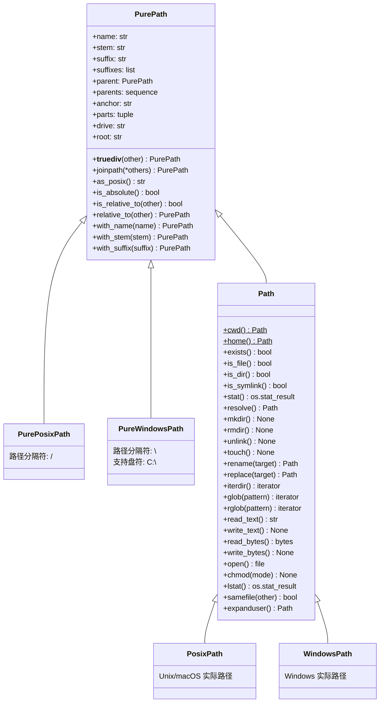
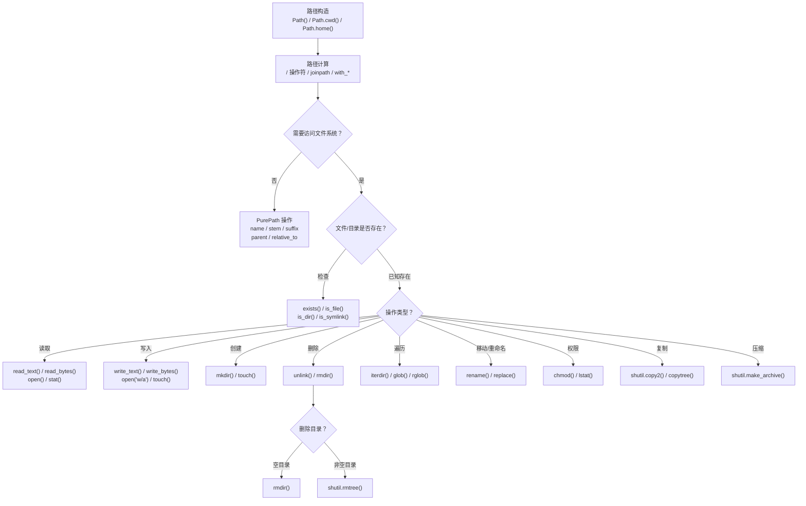
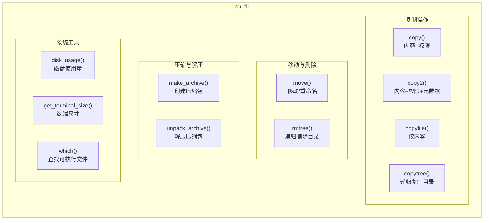

# 文件与目录操作（pathlib + shutil）

在现代 Python 开发中，`pathlib` 和 `shutil` 是处理文件系统操作的首选工具。`pathlib` 提供了面向对象的路径表示，而 `shutil` 则包含高级的文件和目录树操作。它们各司其职、协同配合，构成了 Python 文件操作的黄金组合。

## 为什么需要 pathlib 和 shutil？

在 Python 3.4 之前，`os.path` 模块是处理路径的主要方式，但它基于字符串，容易出错且可读性差。`pathlib` 的出现解决了这些痛点：

- **面向对象**：将路径和操作封装在 `Path` 对象中，代码更直观
- **类型安全**：避免了纯字符串操作带来的类型混淆（`str` vs 路径）
- **跨平台一致性**：自动处理不同操作系统（Windows, macOS, Linux）的路径分隔符
- **链式调用**：支持 `path.parent.joinpath("sibling")` 这样的流畅接口

`shutil` 模块则补充了 `pathlib` 未覆盖的高级功能，如递归复制/删除目录、压缩文件等，是 `pathlib` 的完美搭档。

## pathlib 架构总览

### 类继承体系

`pathlib` 的设计遵循"纯计算"与"实际操作"的分离原则。`PurePath` 系列只做路径字符串运算，不触碰文件系统；`Path` 系列继承 `PurePath` 并增加了 I/O 能力。



> **关键理解**：在 macOS/Linux 上，`Path("x")` 实际创建的是 `PosixPath`；在 Windows 上则是 `WindowsPath`。你无需关心这个细节——直接使用 `Path` 即可，Python 会自动选择正确的子类。

### Path 对象操作流程

一个典型的文件操作流程：从路径构造到最终执行 I/O，每一步都有对应的 `Path` 方法。



## shutil 核心功能架构

`shutil` 按功能域组织，覆盖了 `pathlib` 无法处理的高级操作。



## pathlib：面向对象的路径管理

### 创建 Path 对象

`Path` 对象是 `pathlib` 的基础。可以从字符串、当前工作目录或用户主目录创建它。

```python
from pathlib import Path

# 1. 从字符串创建相对路径
log_path = Path("logs/2025/app.log")

# 2. 获取当前工作目录（绝对路径）
cwd = Path.cwd()
print(f"当前目录: {cwd}")  # 例如: /Users/user/project

# 3. 获取用户家目录（绝对路径）
home = Path.home()
print(f"家目录: {home}")    # 例如: /Users/user

# 4. 使用 / 操作符拼接路径（推荐方式）
config_path = home / ".config" / "my_app"
print(f"配置路径: {config_path}")  # /Users/user/.config/my_app

# 5. 从多个部分构造路径
parts_path = Path("data", "raw", "measurements.csv")
print(f"多部分路径: {parts_path}")  # data/raw/measurements.csv
```

`/` 操作符的重载是 `pathlib` 最便捷的特性之一，它能智能地处理路径分隔——右侧的操作数会自动追加到左侧路径之后，无论左侧是否以分隔符结尾。

### PurePath vs. Path

`pathlib` 提供两种核心类：

- **`PurePath`**：纯计算路径。只处理路径字符串，不与文件系统交互。适用于在不访问磁盘的情况下进行路径解析和比较
- **`Path`**：继承自 `PurePath`，并增加了与文件系统交互的方法（如读写、创建、删除）

在实际应用中，绝大多数时候都直接使用 `Path`。`PurePath` 的典型场景是：在 CI/CD 流水线中解析 Windows 路径，但运行环境是 Linux。

```python
from pathlib import PurePath, Path

# PurePath 不会检查文件是否存在——它只做字符串运算
pure = PurePath("non_existent_file.txt")
# pure.exists()  # AttributeError! PurePath 没有此方法

# Path 可以与文件系统交互
real = Path("non_existent_file.txt")
print(f"文件是否存在: {real.exists()}")  # False（不会报错，返回布尔值）

# PurePath 的真正用途：跨平台路径解析
# 在 Linux 上解析 Windows 路径
from pathlib import PureWindowsPath
win_path = PureWindowsPath("C:/Users/Admin/AppData/Local/config.ini")
print(f"盘符: {win_path.drive}")   # C:
print(f"根目录: {win_path.root}")  # \
print(f"文件名: {win_path.name}")  # config.ini
```

### 路径属性与分解

`Path` 对象提供了丰富的属性来获取路径的各个部分。

```python
from pathlib import Path

p = Path("/usr/local/bin/python3.9")

print(f"完整路径: {p}")              # /usr/local/bin/python3.9
print(f"路径各部分: {p.parts}")       # ('/', 'usr', 'local', 'bin', 'python3.9')
print(f"文件名: {p.name}")           # python3.9
print(f"文件名(无后缀): {p.stem}")   # python3
print(f"文件后缀: {p.suffix}")       # .9（注意：只返回最后一个点之后的部分）
print(f"所有后缀: {p.suffixes}")     # ['.3', '.9']
print(f"父目录: {p.parent}")         # /usr/local/bin
print(f"路径锚点: {p.anchor}")       # /
print(f"驱动器: {p.drive}")          # （空字符串，Unix 无盘符）
print(f"根目录: {p.root}")           # /

# p.parents 是一个可索引序列
print(f"上一级: {p.parents[0]}")     # /usr/local/bin（等同于 p.parent）
print(f"上两级: {p.parents[1]}")     # /usr/local
print(f"上三级: {p.parents[2]}")     # /usr
```

> **注意**：`suffix` 只返回最后一个点之后的部分。对于 `python3.9`，`.9` 是后缀而非 `.3.9`。如果需要所有后缀，使用 `suffixes`。对于 `archive.tar.gz`，`suffix` 返回 `.gz`，`suffixes` 返回 `['.tar', '.gz']`。

### 路径操作与转换

#### 路径拼接与修改

除了 `/` 操作符，还可以使用 `joinpath` 和 `with_` 系列方法。

```python
from pathlib import Path

base_path = Path("data")

# 使用 joinpath 拼接（等价于 / 操作符，但适合动态参数列表）
raw_path = base_path.joinpath("raw", "measurements.txt")
print(raw_path)  # data/raw/measurements.txt

# 替换文件名（保留目录和后缀）
csv_path = raw_path.with_name("results.csv")
print(csv_path)  # data/raw/results.csv

# 替换后缀（保留目录和文件名主干）
json_path = csv_path.with_suffix(".json")
print(json_path)  # data/raw/results.json

# 替换文件名主干（保留目录和后缀）—— Python 3.9+
# backup_path = csv_path.with_stem("results_backup")
# print(backup_path)  # data/raw/results_backup.csv
```

#### 解析为绝对路径

`resolve()` 方法将相对路径转换为绝对路径，并解析所有符号链接和 `..` 组件。

```python
from pathlib import Path

# 假设当前目录是 /Users/user/project
p = Path("../scripts/run.sh")

# 解析为绝对路径（解析符号链接 + 规范化 ..）
abs_path = p.resolve()
print(abs_path)  # /Users/user/scripts/run.sh

# strict=True：如果路径不存在则抛出 FileNotFoundError
# abs_path = p.resolve(strict=True)
```

#### 构造相对路径

`relative_to()` 用于计算从某个基路径开始的相对路径。

```python
from pathlib import Path

full_path = Path("/etc/11-Nginx基础概述/sites-available/default")
base_path = Path("/etc/11-Nginx基础概述")

relative = full_path.relative_to(base_path)
print(relative)  # sites-available/default

# Python 3.9+：is_relative_to() 判断是否可以构造相对路径
print(full_path.is_relative_to(base_path))   # True
print(full_path.is_relative_to(Path("/opt"))) # False
```

### Path 常用方法分类表

| 分类 | 方法 | 说明 | 示例 |
|------|------|------|------|
| **路径组件** | `.name` | 文件名（含后缀） | `Path("a/b.txt").name` → `"b.txt"` |
| | `.stem` | 文件名（不含后缀） | `Path("a/b.txt").stem` → `"b"` |
| | `.suffix` | 最后一个后缀 | `Path("a.tar.gz").suffix` → `".gz"` |
| | `.suffixes` | 所有后缀列表 | `Path("a.tar.gz").suffixes` → `['.tar', '.gz']` |
| | `.parent` | 父目录 | `Path("a/b/c").parent` → `"a/b"` |
| | `.parents` | 所有上级目录序列 | `parents[0]` = parent |
| | `.parts` | 路径各部分元组 | `Path("/a/b").parts` → `('/', 'a', 'b')` |
| | `.anchor` | 盘符+根目录 | Unix: `"/"`, Win: `"C:\\"` |
| **判断** | `.exists()` | 路径是否存在 | — |
| | `.is_file()` | 是否为文件 | — |
| | `.is_dir()` | 是否为目录 | — |
| | `.is_symlink()` | 是否为符号链接 | — |
| | `.is_absolute()` | 是否为绝对路径 | — |
| | `.is_relative_to()` | 是否可构造相对路径 | 3.9+ |
| **遍历** | `.iterdir()` | 列出直接子项 | 不递归 |
| | `.glob(pattern)` | 模式匹配（当前层） | `"*.py"` |
| | `.rglob(pattern)` | 递归模式匹配 | 等价于 `"**/*.py"` |
| **读写** | `.read_text(enc)` | 读取文本 | 小文件专用 |
| | `.write_text(s, enc)` | 写入文本 | 覆盖写入 |
| | `.read_bytes()` | 读取二进制 | — |
| | `.write_bytes(b)` | 写入二进制 | — |
| | `.open(mode)` | 返回文件对象 | 大文件/追加 |
| **权限/元数据** | `.stat()` | 文件元数据 | 大小、时间等 |
| | `.lstat()` | 不跟随符号链接的 stat | — |
| | `.chmod(mode)` | 修改权限 | — |
| | `.samefile(other)` | 是否同一文件 | — |

## 文件与目录操作

### 文件读写

`Path` 对象提供了便捷的读写方法，无需手动 `open()` 和 `close()`。

```python
from pathlib import Path

conf = Path("config.toml")

# 写入文本（覆盖写入，文件不存在则创建）
conf.write_text("[server]\nhost = 'localhost'\n", encoding="utf-8")

# 读取文本（一次性读取全部内容）
content = conf.read_text(encoding="utf-8")
print(content)

# 写入二进制数据
conf.write_bytes(b"\xDE\xAD\xBE\xEF")

# 对于大文件或需要追加写入的场景，使用 open()
with conf.open("a", encoding="utf-8") as f:  # "a" = append 模式
    f.write("debug = true\n")

# 逐行读取大文件
with conf.open("r", encoding="utf-8") as f:
    for line in f:
        print(line.rstrip())  # rstrip() 去掉行末换行符
```

> **最佳实践**：始终显式指定 `encoding="utf-8"`，避免因系统默认编码不同（Windows 常为 GBK）导致的问题。

### 创建与删除

```python
from pathlib import Path

# 创建目录（递归创建，已存在不报错）
data_dir = Path("data/processed")
data_dir.mkdir(parents=True, exist_ok=True)

# 创建空文件（类似 touch 命令）
(data_dir / "empty.txt").touch()

# 删除文件
(data_dir / "empty.txt").unlink()
# Python 3.8+：文件不存在也不报错
# (data_dir / "empty.txt").unlink(missing_ok=True)

# 删除空目录（目录必须为空，否则抛出 OSError）
data_dir.rmdir()
# 注意：rmdir() 只能删除空目录！删除非空目录需要使用 shutil.rmtree()
```

### 遍历目录

`glob()`、`rglob()` 和 `iterdir()` 是三种目录遍历方式，各有适用场景。

```python
from pathlib import Path

project_dir = Path.cwd()

# 1. iterdir()：遍历直接子项（不递归，最轻量）
for entry in Path("docs").iterdir():
    if entry.is_file():
        print(f"文件: {entry.name}")
    elif entry.is_dir():
        print(f"目录: {entry.name}")

# 2. glob()：模式匹配当前目录
for py_file in project_dir.glob("*.py"):
    print(py_file)

# 3. rglob()：递归模式匹配（等价于 glob("**/*.py")）
for md_file in project_dir.rglob("*.md"):
    print(md_file)

# 4. glob() 支持通配符组合
for file in project_dir.glob("**/test_*.py"):  # 所有子目录中的 test_ 开头的 .py 文件
    print(file)

# 5. 排序遍历结果（glob 返回的是生成器，无序）
sorted_files = sorted(project_dir.glob("*.py"), key=lambda p: p.stat().st_mtime)
for f in sorted_files:
    print(f"修改时间排序: {f}")
```

### 文件元数据与权限

`stat()` 方法可以获取文件的详细信息，如大小、修改时间等。

```python
import stat
from datetime import datetime
from pathlib import Path

p = Path("README.md")
if not p.exists():
    p.touch()

info = p.stat()

print(f"文件大小: {info.st_size} bytes")
print(f"最后修改时间: {datetime.fromtimestamp(info.st_mtime)}")
print(f"最后访问时间: {datetime.fromtimestamp(info.st_atime)}")
print(f"创建时间: {datetime.fromtimestamp(info.st_ctime)}")  # Unix 上为元数据变更时间
print(f"inode 号: {info.st_ino}")
print(f"硬链接数: {info.st_nlink}")

# 修改文件权限（给所有者添加执行权限）
current_mode = info.st_mode
p.chmod(current_mode | stat.S_IXUSR)  # 等同于 chmod u+x

# 判断两个路径是否指向同一文件（即使路径字符串不同）
p2 = Path("./README.md")
print(f"同一文件: {p.samefile(p2)}")  # True
```

## shutil：高级文件与目录树操作

`shutil`（Shell Utilities）模块提供了 `pathlib` 无法处理的高级文件操作，特别是针对目录树和压缩文件的操作。

### 复制操作对比表

| 函数 | 复制内容 | 保留权限 | 保留元数据 | 适用场景 |
|------|---------|---------|-----------|---------|
| `shutil.copyfile(src, dst)` | 仅文件内容 | 否 | 否 | 只需数据，不要任何属性 |
| `shutil.copy(src, dst)` | 内容 + 权限 | 是 | 否 | 日常复制（默认选择） |
| `shutil.copy2(src, dst)` | 内容 + 权限 + 元数据 | 是 | 是 | **推荐**：完整复制，保留时间戳 |
| `shutil.copytree(src, dst)` | 递归复制整个目录 | 是 | 是 | 目录树复制 |

#### 复制文件

```python
import shutil
from pathlib import Path

src = Path("config.toml")
dst_dir = Path("backup")
dst_dir.mkdir(exist_ok=True)

# copy2：完整复制（推荐），保留修改时间等元数据
shutil.copy2(src, dst_dir)                    # 目标: backup/config.toml
shutil.copy2(src, dst_dir / "config.bak.toml")  # 目标: backup/config.bak.toml

# copy：只复制内容+权限，不保留时间戳
shutil.copy(src, dst_dir)                     # 修改时间会变成当前时间

# copyfile：只复制内容，连权限都不保留
shutil.copyfile(src, dst_dir / "config_noperm.toml")
```

#### 复制目录树

```python
import shutil
from pathlib import Path

# 递归复制 'docs' 目录到 'docs_backup'
# 默认情况下，目标目录 'docs_backup' 不能存在
shutil.copytree("docs", "docs_backup")

# Python 3.8+：dirs_exist_ok=True 允许目标目录已存在（合并目录）
shutil.copytree("src", "dist/src", dirs_exist_ok=True)

# 使用 ignore 参数过滤特定文件
def ignore_pycache(dirpath, filenames):
    """返回需要忽略的文件名集合"""
    return {name for name in filenames
            if name == "__pycache__" or name.endswith(".pyc")}

shutil.copytree("my_project", "release", ignore=ignore_pycache)

# 使用 shutil.ignore_patterns 快捷方式（更简洁）
shutil.copytree(
    "my_project", "release",
    ignore=shutil.ignore_patterns("*.pyc", "__pycache__", ".git")
)

# copy_function 参数：控制目录内文件的复制方式
shutil.copytree(
    "src", "dist",
    copy_function=shutil.copy2,  # 默认就是 copy2
    symlinks=True                # 保留符号链接（而非跟随复制内容）
)
```

### 移动与重命名

`shutil.move(src, dst)` 可以移动文件或目录，也兼具重命名的功能。

```python
import shutil
from pathlib import Path

# 1. 移动文件到另一个目录
shutil.move("config.toml", "backup/config.toml")

# 2. 重命名文件（源和目标在同一目录）
Path("old_name.txt").touch()
shutil.move("old_name.txt", "new_name.txt")

# 3. 移动整个目录
shutil.move("docs_backup", "归档/docs_backup")

# 4. 使用 Path.rename() 也可以重命名（但不会跨文件系统移动）
Path("new_name.txt").rename("final_name.txt")
```

> **关键区别**：`Path.rename()` 在跨文件系统时会失败，而 `shutil.move()` 会自动回退到"复制+删除"策略。因此跨分区移动时优先使用 `shutil.move()`。

### 删除操作

`shutil.rmtree()` 用于递归删除一个目录及其所有内容，功能强大但需谨慎使用。

```python
import shutil
from pathlib import Path

# 警告：这将永久删除 'archive' 目录及其所有内容！不可恢复！
# shutil.rmtree("archive")

# 更安全的使用方式：先确认再删除
target_dir = Path("archive")
if target_dir.exists() and target_dir.is_dir():
    print(f"准备删除目录: {target_dir.resolve()}")
    # shutil.rmtree(target_dir)

# Python 3.12+：onexc 参数替代了已弃用的 onerror
# 可以在删除失败时自定义处理逻辑
def handle_remove_error(func, path, exc):
    """处理删除失败的文件（如权限不足）"""
    import stat
    if isinstance(exc, PermissionError):
        # 尝试修改权限后重试
        Path(path).chmod(stat.S_IWUSR)
        func(path)

# shutil.rmtree("stubborn_dir", onexc=handle_remove_error)
```

### 压缩与解压

`shutil` 可以方便地创建和解压 `zip`、`tar` 等格式的压缩包。

```python
import shutil
from pathlib import Path

# 1. 创建压缩包
shutil.make_archive(
    base_name="release",   # 压缩包文件名（不含后缀）
    format="zip",          # 压缩格式：zip / tar / gztar / bztar / xztar
    root_dir="src"         # 要压缩的根目录
)
# 生成文件: release.zip

# 2. 指定 base_dir：只打包 root_dir 下的某个子目录
shutil.make_archive(
    base_name="docs_only",
    format="gztar",        # .tar.gz 格式
    root_dir="project",    # 根目录
    base_dir="docs"        # 只打包 project/docs 下的内容
)

# 3. 解压压缩包
shutil.unpack_archive("release.zip", "unpacked_release")

# 4. 查看支持的压缩格式
print(shutil.get_archive_formats())
# [('bztar', "tar.bz2"), ('gztar', "tar.gz"), ('tar', 'tar'), ('xztar', 'tar.xz'), ('zip', 'zip')]

# 5. 查看支持的解压格式
print(shutil.get_unpack_formats())
```

### 磁盘与终端信息

`shutil` 还提供了一些有用的系统工具函数。

```python
import shutil
from pathlib import Path

# 1. 获取磁盘使用情况
total, used, free = shutil.disk_usage("/")
print(f"磁盘总空间: {total // (2**30)} GiB")
print(f"已用空间: {used // (2**30)} GiB")
print(f"可用空间: {free // (2**30)} GiB")

# 2. 获取终端窗口大小（用于 CLI 工具适配）
width, height = shutil.get_terminal_size()
print(f"终端尺寸: {width}x{height}")

# 3. 查找可执行文件（类似 which 命令）
python_path = shutil.which("python3")
print(f"Python3 路径: {python_path}")  # 例如: /usr/bin/python3

# 4. 获取系统 CPU 核心数（用于并行处理）
import os
print(f"CPU 核心数: {os.cpu_count()}")
```

## pathlib vs. os.path 对比表

这是从 `os.path` 迁移到 `pathlib` 的完整 API 映射。新代码应一律使用 `pathlib`。

| 操作 | os.path（旧） | pathlib（新） | 优势说明 |
|------|-------------|-------------|---------|
| 当前目录 | `os.getcwd()` | `Path.cwd()` | 返回 Path 对象，非字符串 |
| 家目录 | `os.path.expanduser("~")` | `Path.home()` | 语义更清晰 |
| 拼接路径 | `os.path.join("a", "b", "c")` | `Path("a") / "b" / "c"` | `/` 操作符更直观 |
| 文件名 | `os.path.basename(p)` | `Path(p).name` | 属性访问，无需函数调用 |
| 目录名 | `os.path.dirname(p)` | `Path(p).parent` | 属性访问 |
| 后缀 | `os.path.splitext(p)[1]` | `Path(p).suffix` | 直接获取，无需解包 |
| 绝对路径 | `os.path.abspath(p)` | `Path(p).resolve()` | resolve 还解析符号链接 |
| 是否存在 | `os.path.exists(p)` | `Path(p).exists()` | 链式调用更流畅 |
| 是否为文件 | `os.path.isfile(p)` | `Path(p).is_file()` | — |
| 是否为目录 | `os.path.isdir(p)` | `Path(p).is_dir()` | — |
| 文件大小 | `os.path.getsize(p)` | `Path(p).stat().st_size` | stat 一次获取所有信息 |
| 相对路径 | `os.path.relpath(p, base)` | `Path(p).relative_to(base)` | — |
| 规范化 | `os.path.normpath(p)` | `Path(p).resolve()` | — |
| 通用格式 | `os.path.commonpath(list)` | —（pathlib 无直接等价，继续用 `os.path.commonpath()`） | commonpath 比 commonprefix 更安全 |

**可读性对比**：

```python
# os.path：嵌套函数调用，由内向外读
config = os.path.join(os.path.expanduser("~"), ".config", "myapp", "settings.toml")

# pathlib：链式操作，从左向右读
config = Path.home() / ".config" / "myapp" / "settings.toml"
```

**类型安全对比**：

```python
# os.path：字符串拼接，无类型保护（尾斜杠易产生双斜杠）
path = "/data/" + "/" + "file.txt"  # 产生 /data//file.txt

# pathlib：Path 对象，自动处理分隔符
path = Path("/data") / "file.txt"  # 始终正确: /data/file.txt
```

## 临时文件处理（tempfile）

在测试、数据处理等场景中，经常需要创建临时文件或目录。`tempfile` 模块提供了安全、自动清理的临时文件管理。

```python
import tempfile
from pathlib import Path

# 1. TemporaryFile：创建匿名临时文件（关闭后自动删除）
with tempfile.TemporaryFile(mode="w+", encoding="utf-8") as f:
    f.write("临时数据")
    f.seek(0)              # 回到文件开头
    content = f.read()
    print(f"临时文件内容: {content}")
# 文件在 with 块结束后自动删除

# 2. NamedTemporaryFile：创建有名字的临时文件
#    注意：Windows 上默认 delete=True 时不能在 with 块内打开第二次
with tempfile.NamedTemporaryFile(mode="w", suffix=".csv", delete=False, encoding="utf-8") as f:
    temp_path = Path(f.name)
    f.write("id,name\n1,Alice\n")
    print(f"临时文件路径: {temp_path}")
# 文件不会自动删除（delete=False），需要手动清理
# temp_path.unlink()

# 3. TemporaryDirectory：创建临时目录（退出后自动删除）
with tempfile.TemporaryDirectory() as tmpdir:
    tmp_path = Path(tmpdir)
    print(f"临时目录: {tmp_path}")
    # 在临时目录中创建文件
    (tmp_path / "test.txt").write_text("测试数据", encoding="utf-8")
    # 读取验证
    print((tmp_path / "test.txt").read_text(encoding="utf-8"))
# 目录及其所有内容在 with 块结束后自动删除

# 4. gettempdir()：获取系统临时目录路径
print(f"系统临时目录: {tempfile.gettempdir()}")

# 5. mkdtemp()：创建临时目录（需手动删除）
#    与 TemporaryDirectory 不同，不会自动清理
manual_tmp = Path(tempfile.mkdtemp(prefix="myapp_"))
print(f"手动管理临时目录: {manual_tmp}")
# 使用完毕后手动清理
# shutil.rmtree(manual_tmp)
```

> **最佳实践**：优先使用 `TemporaryDirectory` 和 `TemporaryFile` 的 `with` 语句形式，确保资源自动清理。只在需要将临时文件传递给外部程序时才使用 `NamedTemporaryFile(delete=False)`。

## 实战案例

### 实战 1：批量文件重命名

将目录下的文件按规则批量重命名，支持预览和回滚。

```python
from pathlib import Path
import re
import shutil
from datetime import datetime

def batch_rename(
    directory: str,
    pattern: str,        # 匹配模式（正则表达式）
    replacement: str,    # 替换模板
    dry_run: bool = True # 预览模式，不实际执行
) -> list[tuple[Path, Path]]:
    """
    批量重命名文件。

    Args:
        directory: 目标目录路径
        pattern: 正则表达式匹配模式
        replacement: 替换字符串（支持反向引用 \\1, \\2 等）
        dry_run: True = 只预览不执行，False = 实际执行

    Returns:
        列表，每项为 (原路径, 新路径) 的元组
    """
    dir_path = Path(directory)
    if not dir_path.is_dir():
        raise ValueError(f"{directory} 不是有效目录")

    rename_plan = []  # 记录重命名计划

    for file_path in sorted(dir_path.iterdir()):
        if not file_path.is_file():
            continue  # 跳过目录

        # 用正则表达式匹配文件名
        new_name = re.sub(pattern, replacement, file_path.name)
        if new_name == file_path.name:
            continue  # 无变化则跳过

        new_path = file_path.parent / new_name

        # 检查目标是否已存在
        if new_path.exists():
            print(f"⚠ 跳过（目标已存在）: {file_path.name} → {new_name}")
            continue

        rename_plan.append((file_path, new_path))

        if dry_run:
            # 预览模式：只打印，不执行
            print(f"[预览] {file_path.name} → {new_name}")
        else:
            # 执行模式：实际重命名
            file_path.rename(new_path)
            print(f"[执行] {file_path.name} → {new_name}")

    return rename_plan

# 使用示例：将 IMG_20250101_001.jpg → photo_20250101_001.jpg
if __name__ == "__main__":
    # 先预览
    plan = batch_rename(
        directory="photos",
        pattern=r"^IMG_(\d{8})_(\d{3})\.jpg$",
        replacement=r"photo_\1_\2.jpg",
        dry_run=True
    )
    print(f"\n共 {len(plan)} 个文件将被重命名")

    # 确认后执行
    # batch_rename("photos", r"^IMG_(\d{8})_(\d{3})\.jpg$", r"photo_\1_\2.jpg", dry_run=False)
```

### 实战 2：目录同步

将源目录的变更同步到目标目录（单向同步：源 → 目标）。

```python
from pathlib import Path
import shutil
import filecmp

def sync_directories(
    src: str,
    dst: str,
    delete_orphans: bool = False,
    ignore_patterns: list[str] | None = None
) -> dict:
    """
    单向同步目录：将 src 的变更同步到 dst。

    Args:
        src: 源目录
        dst: 目标目录
        delete_orphans: 是否删除 dst 中 src 没有的文件
        ignore_patterns: 要忽略的文件模式列表

    Returns:
        同步统计信息字典
    """
    src_path = Path(src)
    dst_path = Path(dst)

    if not src_path.is_dir():
        raise ValueError(f"源目录不存在: {src}")

    dst_path.mkdir(parents=True, exist_ok=True)

    stats = {"copied": 0, "updated": 0, "deleted": 0, "skipped": 0}

    # 构建忽略集合
    ignore_set = set(ignore_patterns or [])

    # 1. 同步源目录中的文件到目标
    for src_file in src_path.rglob("*"):
        # 检查是否需要忽略
        if any(src_file.match(p) for p in ignore_set):
            stats["skipped"] += 1
            continue

        rel_path = src_file.relative_to(src_path)
        dst_file = dst_path / rel_path

        if src_file.is_dir():
            # 确保目标目录存在
            dst_file.mkdir(parents=True, exist_ok=True)
        elif src_file.is_file():
            if not dst_file.exists():
                # 目标不存在：直接复制
                dst_file.parent.mkdir(parents=True, exist_ok=True)
                shutil.copy2(src_file, dst_file)
                print(f"  复制: {rel_path}")
                stats["copied"] += 1
            elif not filecmp.cmp(src_file, dst_file, shallow=False):
                # 内容不同：更新目标
                shutil.copy2(src_file, dst_file)
                print(f"  更新: {rel_path}")
                stats["updated"] += 1

    # 2. 删除目标中源没有的孤立文件
    if delete_orphans:
        for dst_file in dst_path.rglob("*"):
            rel_path = dst_file.relative_to(dst_path)
            src_file = src_path / rel_path

            if not src_file.exists():
                if dst_file.is_file():
                    dst_file.unlink()
                    print(f"  删除文件: {rel_path}")
                    stats["deleted"] += 1
                elif dst_file.is_dir():
                    shutil.rmtree(dst_file)
                    print(f"  删除目录: {rel_path}")
                    stats["deleted"] += 1

    return stats

# 使用示例
if __name__ == "__main__":
    result = sync_directories(
        src="project/src",
        dst="project/dist",
        delete_orphans=True,
        ignore_patterns=["*.pyc", "__pycache__", ".git"]
    )
    print(f"\n同步完成: {result}")
```

### 实战 3：文件搜索工具

递归搜索目录中符合条件（名称、大小、修改时间）的文件。

```python
from pathlib import Path
from datetime import datetime, timedelta
import fnmatch

def search_files(
    root_dir: str,
    name_pattern: str = "*",       # 文件名通配符模式
    min_size: int = 0,             # 最小文件大小（字节）
    max_size: int | None = None,   # 最大文件大小（字节）
    modified_after: datetime | None = None,  # 修改时间下限
    modified_before: datetime | None = None, # 修改时间上限
    file_type: str = "file",       # "file" / "dir" / "any"
) -> list[Path]:
    """
    按多条件搜索文件。

    Args:
        root_dir: 搜索根目录
        name_pattern: 文件名通配符（如 "*.py", "test_*"）
        min_size: 最小文件大小（字节）
        max_size: 最大文件大小（字节），None 表示无上限
        modified_after: 只返回此时间之后修改的文件
        modified_before: 只返回此时间之前修改的文件
        file_type: 筛选类型 "file" / "dir" / "any"

    Returns:
        符合条件的 Path 对象列表
    """
    root = Path(root_dir)
    if not root.is_dir():
        raise ValueError(f"目录不存在: {root_dir}")

    results = []

    for path in root.rglob(name_pattern):
        # 类型过滤
        if file_type == "file" and not path.is_file():
            continue
        if file_type == "dir" and not path.is_dir():
            continue

        # 大小过滤（仅对文件）
        if path.is_file():
            size = path.stat().st_size
            if size < min_size:
                continue
            if max_size is not None and size > max_size:
                continue

        # 修改时间过滤
        if modified_after is not None or modified_before is not None:
            mtime = datetime.fromtimestamp(path.stat().st_mtime)
            if modified_after is not None and mtime < modified_after:
                continue
            if modified_before is not None and mtime > modified_before:
                continue

        results.append(path)

    return sorted(results)

# 使用示例
if __name__ == "__main__":
    # 查找最近 7 天修改过的、大于 1KB 的 Python 文件
    recent = search_files(
        root_dir=".",
        name_pattern="*.py",
        min_size=1024,
        modified_after=datetime.now() - timedelta(days=7)
    )
    for f in recent:
        size_kb = f.stat().st_size / 1024
        mtime = datetime.fromtimestamp(f.stat().st_mtime).strftime("%Y-%m-%d %H:%M")
        print(f"  {mtime}  {size_kb:8.1f} KB  {f}")

    # 查找所有空目录
    empty_dirs = search_files(root_dir=".", file_type="dir")
    empty_dirs = [d for d in empty_dirs if not list(d.iterdir())]
    print(f"\n空目录: {len(empty_dirs)} 个")
```

## 最佳实践对比表

| 场景 | 推荐做法 | 不推荐做法 | 原因 |
|------|---------|-----------|------|
| 路径拼接 | `Path("a") / "b"` | `"a" + "/" + "b"` | 字符串拼接可能产生双斜杠，且不跨平台 |
| 读取小文件 | `Path("f").read_text(encoding="utf-8")` | `open("f").read()` | Path 方法自动关闭文件，且强制指定编码 |
| 读取大文件 | `Path("f").open(encoding="utf-8")` 逐行 | `Path("f").read_text()` | read_text 一次性加载全部内容到内存 |
| 复制文件 | `shutil.copy2()` | `shutil.copy()` | copy2 保留时间戳等元数据 |
| 复制目录 | `shutil.copytree(ignore=...)` | 手动递归遍历复制 | copytree 已处理各种边界情况 |
| 删除非空目录 | `shutil.rmtree()` | 手动递归删除 | rmtree 处理了权限、符号链接等复杂情况 |
| 临时文件 | `tempfile.TemporaryDirectory()` | 手动创建后清理 | with 语句保证自动清理 |
| 文件更新 | 写临时文件 → `replace()` | 直接覆盖原文件 | 原子替换，避免写入中断导致文件损坏 |
| 路径类型 | 统一使用 `Path` 对象 | 混用 `str` 和 `Path` | 类型一致，避免 `str` vs `Path` 混淆 |
| 编码声明 | 始终指定 `encoding="utf-8"` | 依赖系统默认编码 | Windows 默认编码为 GBK，会导致乱码 |

## 常见陷阱与 FAQ

### Q1: Path 的 `/` 操作符是怎么工作的？

`/` 操作符被重载为路径拼接。左侧必须是 `Path` 对象，右侧可以是 `Path`、`str` 或 `bytes`。它不是字符串拼接——会自动处理分隔符。

```python
from pathlib import Path

# 正确用法
p = Path("data") / "raw" / "file.csv"   # data/raw/file.csv
p = Path("data/") / "raw" / "file.csv"  # data/raw/file.csv（自动处理尾部斜杠）

# 常见错误：左侧是字符串
# "data" / "file.csv"  # TypeError: unsupported operand type(s) for /
# 必须确保左侧是 Path 对象
p = Path("data") / "file.csv"  # 正确

# 动态拼接多个部分
parts = ["data", "raw", "2025", "file.csv"]
p = Path(parts[0]).joinpath(*parts[1:])  # 等价于 Path("data") / "raw" / "2025" / "file.csv"
```

### Q2: 如何处理符号链接（symlink）？

`Path` 默认会跟随符号链接。如果需要操作链接本身，使用 `lstat()`、`is_symlink()` 等方法。

```python
from pathlib import Path

# 创建符号链接
link = Path("link_to_config")
target = Path("config.toml")
# link.symlink_to(target)  # 创建指向 target 的符号链接

# 检测符号链接
print(f"是否为符号链接: {link.is_symlink()}")  # True
print(f"链接指向: {link.resolve()}")            # 实际目标的绝对路径

# stat() 跟随链接，lstat() 不跟随
if link.is_symlink():
    target_info = link.stat()    # 目标文件的信息
    link_info = link.lstat()     # 链接文件本身的信息

# 解析链接指向的真实路径
real_path = link.resolve()       # 解析所有符号链接
real_path = link.resolve(strict=False)  # 目标不存在也不报错
```

### Q3: 遇到权限错误怎么办？

文件操作中常见的权限错误及解决方案。

```python
from pathlib import Path
import stat
import os

# 场景 1：删除只读文件
# Windows 上 unlink() 可能因只读属性而失败
p = Path("readonly.txt")
# 解决方案：先移除只读属性
p.chmod(stat.S_IWRITE)
p.unlink()

# 场景 2：rmtree 遇到权限不足的文件
import shutil
def remove_readonly(func, path, exc):
    """rmtree onexc 的错误处理回调（Python 3.12+）：移除只读属性后重试。

    注意 onexc 传入的是异常实例本身；若使用旧版 onerror（3.11-），
    第三个参数是 sys.exc_info() 三元组，需写成 exc_info[1]。
    """
    if isinstance(exc, PermissionError):
        os.chmod(path, stat.S_IWRITE)
        func(path)

# shutil.rmtree("stubborn_dir", onexc=remove_readonly)  # Python 3.12+
# shutil.rmtree("stubborn_dir", onerror=remove_readonly)  # Python 3.11 及更早

# 场景 3：创建目录时权限不足
try:
    Path("/opt/myapp").mkdir()
except PermissionError:
    print("需要管理员权限，请使用 sudo 或选择用户目录")
    # 回退到用户目录
    fallback = Path.home() / "myapp"
    fallback.mkdir(exist_ok=True)
```

### Q4: 大目录遍历性能优化？

对于包含大量文件的目录，遍历性能可能成为瓶颈。

```python
from pathlib import Path
import os
import time

# 方法 1：pathlib.glob() —— 最简洁，但生成器无序
# 适合：一般场景，代码可读性优先
for f in Path("large_dir").rglob("*.py"):
    pass

# 方法 2：os.scandir() —— 最快，返回 DirEntry 对象
# 适合：性能敏感场景，DirEntry 缓存了 is_file/is_dir 结果
with os.scandir("large_dir") as entries:
    for entry in entries:
        if entry.is_file() and entry.name.endswith(".py"):
            pass  # 不需要额外的 stat 调用

# 方法 3：os.walk() —— 经典递归遍历
# 适合：需要在遍历时修改目录结构（如删除文件）
for root, dirs, files in os.walk("large_dir"):
    for f in files:
        if f.endswith(".py"):
            full_path = Path(root) / f

# 性能对比（10 万文件目录，仅供参考）
# os.scandir()  >  os.walk()  >  pathlib.rglob()
# 差异通常在 10-30% 之间，磁盘 I/O 才是真正的瓶颈

# 优化建议：
# 1. 尽早过滤：在循环内用 is_file() / endswith() 过滤，减少后续处理
# 2. 避免重复 stat()：缓存 stat 结果，不要多次调用
# 3. 使用生成器：glob/rglob 返回生成器，不会一次性加载所有结果到内存
# 4. 并行处理：对子目录使用 concurrent.futures 并行遍历
```

### Q5: os.path 还能用吗？

可以，但强烈不推荐在新代码中使用。`pathlib` 提供了更优越的 API。维护旧代码时可能会遇到 `os.path`，但新项目应一律使用 `pathlib`。

### Q6: 如何处理 Windows 和 Linux 路径分隔符的差异？

`pathlib` 会自动处理。`Path("a/b")` 在 Windows 上会表示为 `a\b`，在 Linux/macOS 上是 `a/b`。你无需关心底层差异。这也是为什么应该用 `Path` 而非字符串拼接的原因之一。

### Q7: pathlib 和 shutil 哪个更快？

这不是一个公平的比较。`pathlib` 主要用于路径管理和基本 I/O，而 `shutil` 用于高级文件操作。它们各自在自己的领域内都经过了优化。性能瓶颈通常在磁盘 I/O，而不是库本身。

### Q8: 如何处理文件不存在的错误？

```python
from pathlib import Path

# 方法 1：Python 3.8+ 的 missing_ok 参数
p = Path("maybe_gone.txt")
p.unlink(missing_ok=True)  # 文件不存在也不报错

# 方法 2：try/except（推荐：EAFP 风格）
try:
    content = Path("config.toml").read_text(encoding="utf-8")
except FileNotFoundError:
    content = "[default]\n"  # 使用默认配置

# 方法 3：先检查（LBYL 风格，不推荐——存在竞态条件）
if Path("config.toml").exists():  # 检查和读取之间文件可能被删除！
    content = Path("config.toml").read_text(encoding="utf-8")
```

> **EAFP vs LBYL**：Python 推崇 EAFP（Easier to Ask Forgiveness than Permission）——先尝试操作，失败再处理异常。这比 LBYL（Look Before You Leap）更安全，避免了检查与操作之间的竞态条件（TOCTOU）。

## 术语表

| 术语 | 英文 | 说明 |
|------|------|------|
| 路径 | Path | 文件或目录在文件系统中的位置表示 |
| 绝对路径 | Absolute Path | 从根目录开始的完整路径，如 `/usr/local/bin/python` |
| 相对路径 | Relative Path | 相对于当前工作目录的路径，如 `../scripts/run.sh` |
| 符号链接 | Symlink / Symbolic Link | 指向另一个文件或目录的快捷方式（类似 Windows 快捷方式） |
| 硬链接 | Hard Link | 指向相同 inode 的另一个文件名（与原文件共享数据） |
| inode | Index Node | 文件系统中存储文件元数据的数据结构（权限、大小、时间戳等） |
| 纯路径 | PurePath | 只做路径字符串运算、不访问文件系统的 Path 子类 |
| 具体路径 | Concrete Path | 能与文件系统交互的 Path 子类（PosixPath / WindowsPath） |
| 元数据 | Metadata | 文件的附加信息，如大小、权限、修改时间、所有者等 |
| 通配符 | Glob Pattern | 文件名匹配模式，`*` 匹配任意字符，`?` 匹配单个字符 |
| 递归通配 | Recursive Glob | `**` 匹配任意层级的子目录，如 `**/*.py` |
| 原子操作 | Atomic Operation | 不可被中断的操作，要么完全执行，要么完全不执行 |
| TOCTOU | Time-of-Check to Time-of-Use | 检查与使用之间的竞态条件，是文件操作中的常见安全漏洞 |
| EAFP | Easier to Ask Forgiveness than Permission | Python 风格：先尝试操作，失败再处理异常 |
| LBYL | Look Before You Leap | 先检查条件再操作的风格（Python 中不推荐） |
| 目录树 | Directory Tree | 目录及其所有子目录和文件的层级结构 |
| 归档 | Archive | 将多个文件打包为一个文件（可能压缩），如 .zip / .tar.gz |

## 延伸阅读

- [pathlib 官方文档](https://docs.python.org/3/library/pathlib.html) — 完整 API 参考，包含所有方法和版本变更记录
- [shutil 官方文档](https://docs.python.org/3/library/shutil.html) — 高级文件操作参考
- [tempfile 官方文档](https://docs.python.org/3/library/tempfile.html) — 临时文件管理
- [PEP 428](https://peps.python.org/pep-0428/) — pathlib 的设计提案，理解其设计哲学
- [filecmp 官方文档](https://docs.python.org/3/library/filecmp.html) — 文件和目录比较
- [os.path 官方文档](https://docs.python.org/3/library/os.path.html) — 旧式路径操作（维护旧代码时参考）
- [10 Things You Didn't Know About pathlib](https://towardsdatascience.com/10-things-you-didnt-know-about-pathlib-efc37e4e4a24) — pathlib 进阶技巧

## 版本差异（标准库 → Python 3.14）

| 模块/特性 | 本文编写时 | Python 3.14 变化 |
|-----------|-----------|------------------|
| `datetime` | `utcnow()` / `utcfromtimestamp()` | 3.12 起弃用，改用 `datetime.now(tz=datetime.UTC)` / `fromtimestamp(ts, tz=datetime.UTC)`（aware 对象） |
| `asyncio` | 基础 API | 3.14 新增内省能力（`asyncio.Task`/`Future` 状态查询）；3.11 起推荐 `TaskGroup` + `asyncio.timeout()` |
| `typing` | 旧式 `List`/`Dict` | 3.9+ 内置泛型；3.10+ 联合类型 `X \| Y`；3.12 `type` 语句；3.14 PEP 649 延迟注解 |
| `importlib` | `imp` 模块 | `imp` 于 3.12 移除，统一使用 `importlib` |
| 压缩 | zlib/gzip/bz2/lzma | 3.14 新增 `zstandard` 标准库支持（PEP 784） |
| `pathlib` | 基础路径操作 | 3.12+ 持续增强（`Path.walk()` 等）；`is_relative_to()` 自 3.9 起可用 |
| 往事清理 | — | 3.13 移除 `cgi`、`telnetlib`、`crypt`、`audioop` 等已废弃模块 |

> 本文讲解的模块核心 API 与使用模式在 3.14 中保持稳定；注意上述弃用/移除项，升级时优先用标准库推荐的替代方案。
