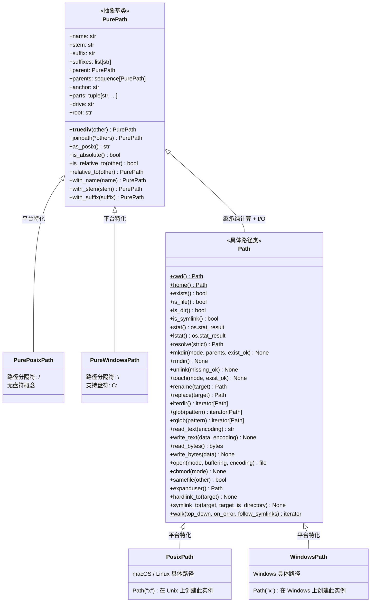
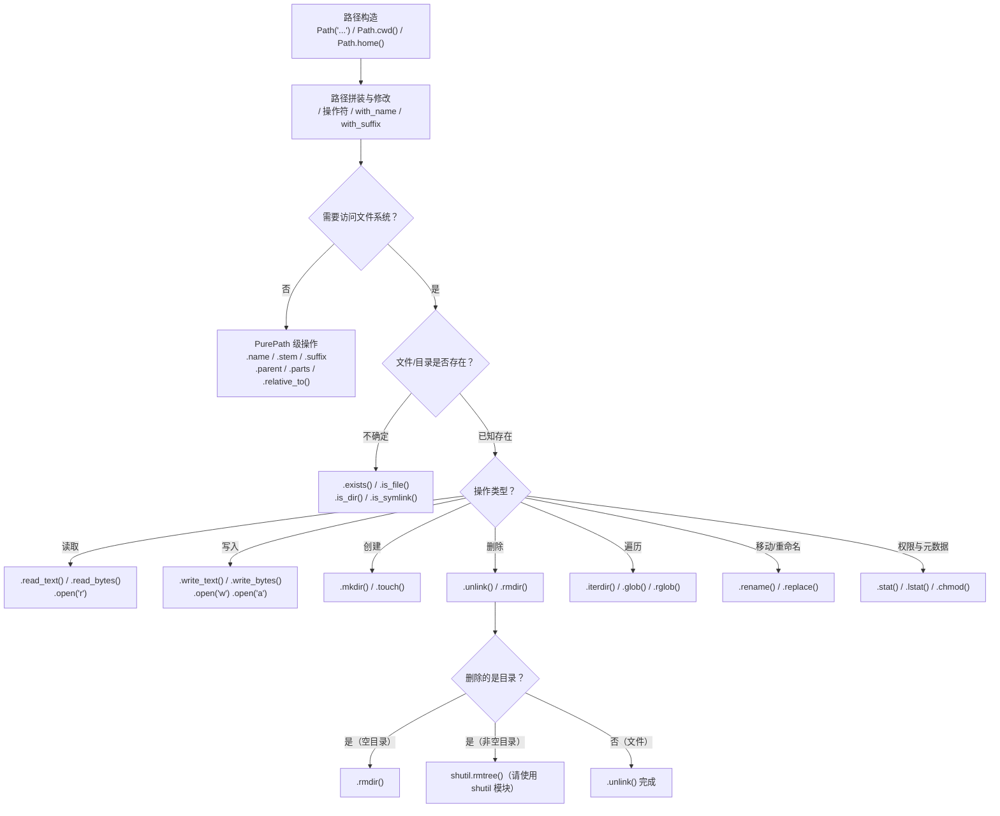

# pathlib 模块：面向对象的文件路径操作

`pathlib` 是 Python 3.4 引入的标准库模块，提供了一套**面向对象**的路径操作 API。它将路径从"字符串"升级为"对象"，将操作从"函数调用"转化为"方法调用"，彻底改变了 Python 开发者与文件系统交互的方式。自 Python 3.6 起，`pathlib` 已被官方推荐为处理文件路径的首选方式。

## 一、为什么用 pathlib 替代 os.path

Python 处理文件路径的方式经历了两个阶段：

| 阶段 | 模块 | 风格 | 痛点 |
|:-----|:-----|:-----|:-----|
| Python 1.x ~ 3.3 | `os.path` | 字符串 + 函数式 | 代码嵌套深、可读性差、易出错 |
| Python 3.4+ | `pathlib` | 面向对象 | — |

### 1.1 代码对比：字符串拼接 vs 面向对象

以下是同一个任务的两种写法——用 `os.path` 和 `pathlib` 分别实现。观察代码的阅读方向、嵌套层级和易错程度。

**需求**：读取用户配置目录下某个 JSON 配置文件，获取其所在目录，然后在同目录下创建一个 `.backup` 子目录。

::: code-group
```python [os.path（旧式风格）]
import os

# 由内向外读：先 expanduser，再 join，再 dirname
config_dir = os.path.dirname(
    os.path.join(
        os.path.expanduser("~"),
        ".config", "myapp", "settings.json"
    )
)
backup_dir = os.path.join(config_dir, ".backup")
os.makedirs(backup_dir, exist_ok=True)

# 检查文件是否存在
if os.path.isfile(
    os.path.join(config_dir, "settings.json")
):
    print("配置文件已就绪")
```

```python [pathlib（现代风格）]
from pathlib import Path

# 从左向右读：自然语序，无嵌套函数
config_path = Path.home() / ".config" / "myapp" / "settings.json"
backup_dir = config_path.parent / ".backup"
backup_dir.mkdir(parents=True, exist_ok=True)

# 检查文件是否存在——链式调用
if config_path.is_file():
    print("配置文件已就绪")
```
:::

**关键差异**：

| 维度 | `os.path` | `pathlib` |
|:-----|:----------|:----------|
| 阅读方向 | 由内向外（函数嵌套） | 从左向右（链式调用） |
| 路径表示 | `str` | `Path` 对象 |
| 分隔符处理 | 手动 `/` 或 `os.path.join()` | `/` 操作符自动处理 |
| 文件检查 | `os.path.isfile(str)` | `path.is_file()`（方法调用） |
| 创建目录 | `os.makedirs(str, exist_ok=True)` | `path.mkdir(parents=True, exist_ok=True)` |

### 1.2 类型安全：Path 对象 vs 字符串

`os.path` 将路径表示为 `str`，这意味着任何接受 `str` 的函数都可能误收非路径字符串，且路径之间的操作（拼接、比较）完全依赖字符串语义，极易出错。

```python
# === os.path：字符串陷阱 ===
import os

# 陷阱 1：双重斜杠
path = "/data" + "/" + "file.txt"      # "/data//file.txt" — 虽然 OS 通常能处理，但不规范

# 陷阱 2：尾部斜杠不一致
dir_a = "/home/user/project/"
dir_b = "/home/user/project"
print(dir_a == dir_b)                   # False — 字符串比较不相等

# 陷阱 3：路径拼接时忘记分隔符
base = "/home/user"
sub = "docs"
wrong = base + sub                      # "/home/userdocs" — 可怕的 bug！

# === pathlib：类型安全 ===
from pathlib import Path

# 自动处理分隔符
path = Path("/data") / "file.txt"       # PosixPath('/data/file.txt')

# 等价性判断（自动规范化）
dir_a = Path("/home/user/project/")
dir_b = Path("/home/user/project")
print(dir_a == dir_b)                   # True — Path 的 __eq__ 做了规范化

# 拼接永远正确
base = Path("/home/user")
sub = Path("docs")
correct = base / sub                    # PosixPath('/home/user/docs')
```

### 1.3 跨平台一致性

`pathlib` 自动根据操作系统选择正确的路径表示。同一个 `Path("data/file.txt")` 在 macOS/Linux 上使用 `/`，在 Windows 上使用 `\`。你不需要写任何平台判断代码。

```python
from pathlib import Path

# 同一行代码，跨平台运行
log_path = Path("logs") / "app.log"

# 在 macOS/Linux 上：logs/app.log
# 在 Windows 上：  logs\app.log
print(log_path)
```

---

## 二、Path 类继承体系

`pathlib` 的类设计遵循"纯计算"与"I/O 操作"的分离原则。理解这个继承体系有助于你把握各层级的能力边界。



> **关键理解**：在日常开发中，你只需要直接使用 `Path`。`Path("some/file")` 会自动创建 `PosixPath`（Unix/macOS）或 `WindowsPath`（Windows）实例。`PurePath` 系列的唯一用途是在不访问文件系统的场景下（如 CI 流水线中跨平台解析路径，或在 Unix 服务器上处理 Windows 路径字符串）。

---

## 三、Path 对象创建与基本操作

### 3.1 创建 Path 对象

`Path` 是 `pathlib` 的核心入口，有四种常用创建方式。

```python
# Python 3.10+
from pathlib import Path

# 1. 从字符串创建（相对路径或绝对路径）
log = Path("logs/2025/app.log")
config = Path("/etc/11-Nginx基础概述/11-Nginx基础概述.conf")

# 2. 获取当前工作目录
cwd = Path.cwd()
print(f"当前目录: {cwd}")                    # PosixPath('/Users/username/project')

# 3. 获取用户家目录
home = Path.home()
print(f"用户家目录: {home}")                  # PosixPath('/Users/username')

# 4. 从多个路径段构造
data_path = Path("data", "raw", "measurements.csv")
print(data_path)                              # data/raw/measurements.csv
```

### 3.2 / 运算符拼接路径

`/` 操作符是 `pathlib` 最具标志性的语法糖。左侧必须是 `Path` 对象，右侧可以是 `Path`、`str` 或任何实现了 `os.PathLike` 接口的对象。

```python
from pathlib import Path

base = Path.home()

# 链式拼接：自然从左向右阅读
config_dir = base / ".config" / "myapp"
print(config_dir)                             # /Users/username/.config/myapp

# 右侧可以是 Path 对象
sub = Path("subdir")
full = config_dir / sub / "settings.toml"
print(full)                                   # /Users/username/.config/myapp/subdir/settings.toml

# 自动处理尾部斜杠
p1 = Path("data/") / "file.txt"               # data/file.txt（不是 data//file.txt）
p2 = Path("data") / "/file.txt"               # /file.txt（右侧是绝对路径时会替换左侧！）

# 类型检查：左侧必须是 Path
# "data" / "file.txt"   # TypeError: unsupported operand type(s) for /
```

::: warning / 操作符的注意事项
- 左侧**必须**是 `Path` 对象，否则抛出 `TypeError`。
- 右侧如果是绝对路径（以 `/` 开头），则右侧会**替换**左侧（这是 POSIX 语义，与 `os.path.join` 行为一致）。
- 如果右侧是 `str`，`/` 返回新的 `Path` 对象；原 `Path` 对象不变（不可变性）。
:::

### 3.3 路径属性：name / suffix / stem / parent / parts

`Path` 对象提供了丰富的只读属性来分解路径的各个组成部分。

```python
from pathlib import Path

p = Path("/usr/local/bin/python3.12")

print(f"完整路径:     {p}")                  # /usr/local/bin/python3.12
print(f"路径各部分:   {p.parts}")            # ('/', 'usr', 'local', 'bin', 'python3.12')
print(f"文件名:       {p.name}")             # python3.12
print(f"文件名主干:   {p.stem}")             # python3
print(f"文件后缀:     {p.suffix}")           # .12
print(f"所有后缀:     {p.suffixes}")         # ['.3', '.12']
print(f"父目录:       {p.parent}")           # /usr/local/bin
print(f"祖父目录:     {p.parents[1]}")       # /usr/local
print(f"路径锚点:     {p.anchor}")           # /（Unix）或 C:\（Windows）
print(f"驱动器:       {p.drive}")            # （Unix 上为空字符串）
print(f"根目录:       {p.root}")             # /
```

**后缀处理的细微之处**：

```python
from pathlib import Path

# suffix 只返回最后一个点之后的部分
tar = Path("archive.tar.gz")
print(tar.suffix)       # .gz      ← 不是 .tar.gz！
print(tar.suffixes)     # ['.tar', '.gz']  ← 用 suffixes 获取所有后缀
print(tar.stem)         # archive.tar      ← stem 去掉最后一个 suffix

# 无后缀的文件
noext = Path("README")
print(noext.suffix)     # ''（空字符串）
print(noext.suffixes)   # []
print(noext.stem)       # README

# 隐藏文件（点文件）
hidden = Path(".gitignore")
print(hidden.name)      # .gitignore
print(hidden.stem)      # .gitignore  ← 注意：点不是后缀分隔符
print(hidden.suffix)    # ''          ← 空字符串
```

::: tip parents 是序列，不是列表
`p.parents` 返回一个 `_PathParents` 序列对象，支持索引访问和切片。`p.parents[0]` 等同于 `p.parent`，`p.parents[-1]` 是根目录。
:::

### 3.4 路径修改：with_name / with_suffix / with_stem

这些方法返回**新对象**，不会修改原 `Path`（不可变性）。

```python
from pathlib import Path

p = Path("/data/raw/measurements.txt")

# 替换文件名（保留目录结构）
csv = p.with_name("results.csv")
print(csv)              # /data/raw/results.csv

# 替换后缀（保留目录和文件名主干）
json = p.with_suffix(".json")
print(json)             # /data/raw/measurements.json

# 替换文件名主干（Python 3.9+）——保留目录和后缀
backup = p.with_stem("measurements_backup")
print(backup)           # /data/raw/measurements_backup.txt
```

---

## 四、目录遍历：iterdir / glob / rglob

### 4.1 方法对比

| 方法 | 递归深度 | 返回类型 | 典型用途 |
|:-----|:---------|:---------|:---------|
| `.iterdir()` | 仅直接子项 | 生成器 | 列出目录内容（类似 `ls`） |
| `.glob(pattern)` | 仅当前目录 | 生成器 | 当前目录的模式匹配 |
| `.rglob(pattern)` | 递归所有子目录 | 生成器 | 项目级搜索（如查找所有 `.py` 文件） |

### 4.2 iterdir()：列出目录内容

```python
from pathlib import Path

# 列出当前目录的内容
for entry in Path(".").iterdir():
    type_label = "📁" if entry.is_dir() else "📄"
    print(f"{type_label} {entry.name}")

# 过滤特定类型
py_files = [f for f in Path("src").iterdir() if f.suffix == ".py"]
print(f"找到 {len(py_files)} 个 Python 文件")
```

### 4.3 glob() 和 rglob()：模式匹配

```python
from pathlib import Path

project = Path("/home/user/myproject")

# glob()：当前目录下匹配
for py_file in project.glob("*.py"):
    print(py_file)                              # 仅当前目录的 .py 文件

# glob() 支持单层通配
for test_file in project.glob("tests/test_*.py"):
    print(test_file)                            # tests/ 下的 test_ 开头的 .py 文件

# rglob()：递归匹配所有子目录（等价于 glob("**/")）
for md_file in project.rglob("*.md"):
    print(md_file)                              # 所有子目录中的 .md 文件

# rglob 也等价于 glob("**/pattern")
for md_file in project.glob("**/*.md"):
    print(md_file)                              # 效果与 rglob("*.md") 相同

# 通配符规则（与 fnmatch 一致）
# *      — 匹配任意字符（不含路径分隔符）
# **     — 匹配任意层级目录
# ?      — 匹配任意单个字符
# [abc]  — 匹配字符集中的任意一个字符
# [!abc] — 匹配不在字符集中的任意一个字符
```

::: warning glob 返回的是生成器
`glob()` 和 `rglob()` 返回**生成器**，不会一次性将所有结果加载到内存。这意味着：
- 结果**无序**——如需排序，使用 `sorted(path.rglob("*.py"))`
- 生成器只能**遍历一次**——如需多次使用，先转为 `list`
- 遍历期间文件系统的变化**会影响结果**
:::

### 4.4 实战：按条件筛选文件

```python
from pathlib import Path
from datetime import datetime, timedelta

def find_recent_large_files(
    root: str,
    pattern: str = "*",
    min_size_mb: float = 1.0,
    days: int = 7
) -> list[Path]:
    """
    查找最近 N 天内修改过的大文件。

    Args:
        root: 搜索根目录
        pattern: 文件名通配符
        min_size_mb: 最小文件大小（MB）
        days: 最近天数

    Returns:
        按大小降序排列的匹配文件列表
    """
    root_path = Path(root)
    cutoff = datetime.now() - timedelta(days=days)
    min_bytes = int(min_size_mb * 1024 * 1024)
    results = []

    for f in root_path.rglob(pattern):
        if not f.is_file():
            continue
        stat = f.stat()
        if stat.st_size < min_bytes:
            continue
        mtime = datetime.fromtimestamp(stat.st_mtime)
        if mtime < cutoff:
            continue
        results.append((stat.st_size, f))

    # 按文件大小降序排列
    results.sort(key=lambda x: x[0], reverse=True)
    return [path for _, path in results]

# 使用示例
recent = find_recent_large_files(".", "*.log", min_size_mb=10, days=3)
for f in recent:
    size_mb = f.stat().st_size / (1024 * 1024)
    print(f"{size_mb:.1f} MB  {f}")
```

---

## 五、文件读写：read_text / write_text / read_bytes / write_bytes

`Path` 对象提供了便捷的读写方法，省去了手动 `open()` 和 `close()` 的繁琐。这些方法适合**小文件**（一次性读取全部内容到内存）。

### 5.1 文本文件读写

```python
from pathlib import Path

config = Path("config.toml")

# 写入文本（覆盖写入；文件不存在则创建；文件存在则清空后写入）
config.write_text("[server]\nhost = 'localhost'\nport = 8080\n", encoding="utf-8")

# 读取文本（一次性读取全部内容）
content = config.read_text(encoding="utf-8")
print(content)

# 追加写入需要使用 open()
with config.open("a", encoding="utf-8") as f:
    f.write("debug = true\n")

# 逐行读取大文件
with config.open("r", encoding="utf-8") as f:
    for line_no, line in enumerate(f, start=1):
        print(f"{line_no}: {line.rstrip()}")
```

### 5.2 二进制文件读写

```python
from pathlib import Path

data_file = Path("output.bin")

# 写入二进制数据
data_file.write_bytes(b"\x00\x01\x02\xFF\xFE")

# 读取二进制数据
raw = data_file.read_bytes()
print(f"文件大小: {len(raw)} 字节")            # 5
print(f"十六进制: {raw.hex()}")                # 000102fffe
```

### 5.3 路径操作流程总览

以下流程图涵盖了从路径构造到 I/O 操作的完整决策路径。



---

## 六、文件属性与判断：exists / is_file / is_dir / stat

### 6.1 存在性与类型判断

```python
from pathlib import Path

p = Path("/usr/local/bin/python3")

print(p.exists())           # True — 路径指向的文件或目录存在
print(p.is_file())          # True — 是普通文件
print(p.is_dir())           # False — 不是目录
print(p.is_symlink())       # False — 不是符号链接
print(p.is_absolute())      # True — 是绝对路径

# is_relative_to() — Python 3.9+
print(p.is_relative_to(Path("/usr")))           # True
print(p.is_relative_to(Path("/opt")))           # False

# is_socket / is_fifo / is_block_device / is_char_device
# 这些是 Unix 特定的文件类型判断
```

### 6.2 stat()：获取文件元数据

`stat()` 返回一个 `os.stat_result` 对象，包含文件的完整元数据。

```python
from pathlib import Path
from datetime import datetime
import stat as st

p = Path(__file__)  # 当前脚本文件
info = p.stat()

print(f"文件大小:      {info.st_size} 字节")
print(f"权限位(八进制): {oct(info.st_mode)}")
print(f"最后修改时间:   {datetime.fromtimestamp(info.st_mtime)}")
print(f"最后访问时间:   {datetime.fromtimestamp(info.st_atime)}")
print(f"inode 号:       {info.st_ino}")
print(f"硬链接数:       {info.st_nlink}")
print(f"所有者 UID:     {info.st_uid}")
print(f"所属组 GID:     {info.st_gid}")

# 权限判断
is_readable = bool(info.st_mode & st.S_IRUSR)     # 所有者可读？
is_writable = bool(info.st_mode & st.S_IWUSR)     # 所有者可写？
is_executable = bool(info.st_mode & st.S_IXUSR)   # 所有者可执行？
```

::: tip stat 与 lstat 的区别
- `.stat()`：如果路径是符号链接，返回**目标文件**的元数据（跟随链接）。
- `.lstat()`：返回**符号链接本身**的元数据（不跟随链接）。
- 先用 `.is_symlink()` 判断链接类型，再决定使用哪个方法。
:::

---

## 七、路径操作：resolve / relative_to / with_suffix / with_name

### 7.1 resolve()：解析为绝对路径

`resolve()` 将路径转换为绝对路径，并解析所有符号链接和 `..` 组件，返回规范化后的结果。

```python
from pathlib import Path

# 假设当前目录是 /home/user/project
p = Path("../scripts/run.sh")

# 解析为绝对路径
abs_path = p.resolve()
print(abs_path)                      # /home/user/scripts/run.sh

# strict=True：路径不存在则抛出 FileNotFoundError（Python 3.6+）
try:
    abs_path = p.resolve(strict=True)
except FileNotFoundError:
    print("路径不存在，无法严格解析")

# 解析符号链接
link = Path("link_to_config")
real = link.resolve()                # 返回链接目标的实际路径
```

::: warning resolve() 与 absolute() 的区别
`Path.absolute()` 只把相对路径转成绝对路径，**不解析**符号链接和 `..`。如果需要规范化的绝对路径，使用 `resolve()`。
:::

### 7.2 relative_to()：构造相对路径

```python
from pathlib import Path

full = Path("/etc/11-Nginx基础概述/sites-available/default")
base = Path("/etc/11-Nginx基础概述")

relative = full.relative_to(base)
print(relative)                      # sites-available/default

# 跨目录相对路径：relative_to() 无法产生带 .. 的路径
a = Path("/home/user/project/src/main.py")
b = Path("/home/user/project/tests/test_main.py")
try:
    a.relative_to(b.parent)
except ValueError:
    # ValueError：a 不在 b.parent 之下
    import os
    print(os.path.relpath(a, b.parent))  # ../src/main.py（需要跨分支时用 os.path.relpath）

# ValueError：路径不共享公共前缀时
try:
    Path("/opt/bin").relative_to(Path("/usr"))
except ValueError as e:
    print(f"错误: {e}")              # '...' is not in the subpath of '...'
```

### 7.3 with_suffix / with_name / with_stem：路径变换

```python
from pathlib import Path

p = Path("/data/images/photo.jpg")

# 替换后缀
webp = p.with_suffix(".webp")
print(webp)                          # /data/images/photo.webp

# 替换文件名（保留目录）
backup = p.with_name("photo_backup.jpg")
print(backup)                        # /data/images/photo_backup.jpg

# Python 3.9+：替换文件名主干
compress = p.with_stem("photo_compressed")
print(compress)                      # /data/images/photo_compressed.jpg
```

---

## 八、目录操作：mkdir / rmdir / unlink

### 8.1 创建目录和文件

```python
from pathlib import Path

# 创建单层目录（父目录必须存在）
Path("output").mkdir()

# 递归创建多层级目录（推荐写法）
data_dir = Path("data/processed/2025")
data_dir.mkdir(parents=True, exist_ok=True)
# parents=True — 自动创建所有不存在的父目录
# exist_ok=True — 目录已存在时不报错（不设置此参数则抛出 FileExistsError）

# 创建空文件（类似 Unix touch 命令）
(data_dir / ".gitkeep").touch()

# touch 的参数：
# mode=0o666 — 文件权限
# exist_ok=True — 文件存在时不报错（不设置则抛出 FileExistsError）
(data_dir / ".gitkeep").touch(mode=0o644, exist_ok=True)
```

### 8.2 删除文件和目录

```python
from pathlib import Path

# 删除文件
temp = Path("temp_file.txt")
temp.touch()
temp.unlink()                        # 文件不存在则抛出 FileNotFoundError

# Python 3.8+：文件不存在也不报错
temp.unlink(missing_ok=True)

# 删除空目录（目录必须为空，否则抛出 OSError）
empty_dir = Path("empty_dir")
empty_dir.mkdir(exist_ok=True)
empty_dir.rmdir()                    # 成功——目录为空且存在

# 注意：rmdir() 不能删除非空目录！
# 删除非空目录需要使用 shutil.rmtree()
# import shutil
# shutil.rmtree("non_empty_dir")
```

---

## 九、Python 3.12 新增：Path.walk() 方法

Python 3.12 为 `pathlib` 新增了 `Path.walk()` 方法。它提供了与 `os.walk()` 相同的递归目录遍历能力，但以面向对象的方式返回 `Path` 对象而非字符串元组。

### 9.1 基本用法

```python
# Python 3.12+
from pathlib import Path

project = Path(".")

# Path.walk() 自顶向下遍历目录树
for dirpath, dirnames, filenames in project.walk():
    print(f"目录: {dirpath}")
    for d in dirnames:
        print(f"  子目录: {d}")
    for f in filenames:
        print(f"  文件: {f}")
```

### 9.2 与 os.walk() 的对比

| 特性 | `os.walk()` | `Path.walk()` (3.12+) |
|:-----|:-----------|:----------------------|
| 路径类型 | `str` | `Path` 对象 |
| 控制遍历顺序 | `topdown=True/False` | `top_down=True/False` |
| 错误处理 | `onerror` 回调 | `on_error` 回调 |
| 跳过目录 | 修改 `dirnames` 列表 | 修改 `dirnames` 列表 |
| 符号链接 | 需手动处理 | `follow_symlinks=True/False` |

### 9.3 实战：用 walk() 计算目录大小

```python
# Python 3.12+
from pathlib import Path

def dir_size(path: str | Path) -> int:
    """递归计算目录中所有文件的总大小（字节）。"""
    root = Path(path)
    total = 0
    for dirpath, dirnames, filenames in root.walk():
        for fname in filenames:
            fp = dirpath / fname
            try:
                total += fp.stat().st_size
            except OSError:
                pass  # 跳过无法访问的文件
    return total

size = dir_size(".")
print(f"目录大小: {size / (1024**2):.2f} MB")
```

### 9.4 实战：用 walk() 清理缓存文件

```python
# Python 3.12+
from pathlib import Path

def clean_pycache(root: str | Path, dry_run: bool = True) -> int:
    """
    递归删除 __pycache__ 目录和 .pyc 文件。

    Args:
        root: 根目录
        dry_run: True=仅预览，False=实际执行删除

    Returns:
        被删除/将删除的文件数
    """
    root_path = Path(root)
    removed = 0

    for dirpath, dirnames, filenames in root_path.walk(top_down=True):
        # 处理 .pyc 文件
        for fname in filenames:
            if fname.endswith(".pyc"):
                file_path = dirpath / fname
                if dry_run:
                    print(f"[预览删除] {file_path}")
                else:
                    file_path.unlink(missing_ok=True)
                    print(f"[已删除] {file_path}")
                removed += 1

        # 处理 __pycache__ 目录——从 dirnames 中移除可避免遍历其内部
        if "__pycache__" in dirnames:
            pycache_path = dirpath / "__pycache__"
            if dry_run:
                print(f"[预览删除目录] {pycache_path}")
                dirnames.remove("__pycache__")  # 阻止 walk 进入此目录
            else:
                import shutil
                shutil.rmtree(pycache_path, ignore_errors=True)
                print(f"[已删除目录] {pycache_path}")
                dirnames.remove("__pycache__")
            removed += 1

    return removed

# 使用示例
print("=== 预览模式 ===")
count = clean_pycache(".", dry_run=True)
print(f"共 {count} 项将被清理\n")

# 确认后执行
# clean_pycache(".", dry_run=False)
```

---

## 十、常见陷阱与 FAQ

### 陷阱速查表

| 陷阱 | 错误示例 | 正确做法 | 原因 |
|:-----|:---------|:---------|:-----|
| **Path 与 str 混用** | `"data" / "file.txt"` | `Path("data") / "file.txt"` | `/` 的左操作数必须是 `Path` |
| **拼接绝对路径片段** | `Path("data") / "/abs"` | 避免右侧以 `/` 开头 | 右侧为绝对路径时会整体替换左侧 |
| **相对 vs 绝对混淆** | `Path("data").resolve()` 依赖 CWD | 明确使用 `Path.cwd() / "data"` | CWD 可能被意外修改 |
| **glob 不递归** | `p.glob("*.py")` 期望递归 | `p.rglob("*.py")` 或 `p.glob("**/*.py")` | `glob` 只搜索当前目录 |
| **rmdir 删非空目录** | `Path("dir").rmdir()` | `shutil.rmtree("dir")` | `rmdir` 要求目录为空 |
| **read_text 读大文件** | 用 `read_text()` 读 GB 级文件 | 用 `open()` 逐行读 | `read_text` 一次性加载到内存 |
| **忘记指定 encoding** | `read_text()` 不传 encoding | `read_text(encoding="utf-8")` | Windows 默认编码为 GBK |
| **exist_ok 误用** | `mkdir()` 重复执行 | `mkdir(parents=True, exist_ok=True)` | 未设置 `exist_ok` 时重复创建会抛异常 |
| **glob 结果无序** | 假设 `glob()` 返回有序结果 | `sorted(path.glob("*.py"))` | 生成器依赖文件系统顺序 |
| **Path 可变性理解错误** | `p = p / "x"` 后认为原 p 也变了 | 重新赋值或使用新变量 | Path 对象是不可变的 |

### Q1: 为什么 `"data" / "file.txt"` 报错？

`/` 操作符被 `PurePath.__truediv__` 重载，左侧必须是 `Path`（或 `PurePath`）实例。字符串没有实现此操作符。

```python
from pathlib import Path

# 错误
# path = "data" / "file.txt"   # TypeError

# 正确
path = Path("data") / "file.txt"

# 如果左侧是变量且类型不确定
def safe_join(base, *parts):
    """安全拼接——自动将 str 转为 Path。"""
    base = Path(base)  # 已经是 Path 的话这行无副作用
    for part in parts:
        base = base / part
    return base
```

### Q2: glob 的 `**` 模式如何正确使用？

```python
from pathlib import Path

# 以下三种写法等价——都递归匹配所有子目录中的 .py 文件
list(Path(".").rglob("*.py"))
list(Path(".").glob("**/*.py"))

# 但 glob("*.py") 只匹配当前目录，不递归！

# 限定递归深度（glob 本身不支持深度控制，需手动过滤）
max_depth = 2
results = [
    p for p in Path(".").rglob("*.py")
    if len(p.relative_to(".").parts) <= max_depth
]
```

### Q3: 如何安全地处理文件不存在？

```python
from pathlib import Path

config = Path("config.toml")

# 推荐方式：EAFP（先尝试，失败再处理）
try:
    content = config.read_text(encoding="utf-8")
except FileNotFoundError:
    content = "[default]\n"  # 使用默认配置
    config.write_text(content, encoding="utf-8")

# 不推荐：LBYL（先检查，再操作）——存在竞态条件
# if config.exists():          # ← 检查后、读取前文件可能被删除
#     content = config.read_text(encoding="utf-8")

# Python 3.8+ 的 missing_ok 参数
config.unlink(missing_ok=True)  # 删除文件，不存在也不报错
```

### Q4: Path 对象可以传给哪些标准库函数？

自 Python 3.6 起，绝大多数标准库函数都接受 `Path` 对象（因为它们实现了 `os.PathLike` 接口）。以下模块原生支持 `Path`：

- `open()` — Python 3.6+
- `os` 模块 — Python 3.6+
- `shutil` 模块 — Python 3.6+
- `sqlite3` — Python 3.6+
- `subprocess` — Python 3.7+
- `json.load()` / `json.dump()` — Python 3.6+（需要通过 `open()`）
- `zipfile` / `tarfile` — Python 3.6+

```python
from pathlib import Path
import json, shutil

p = Path("data.json")

# 直接传给 open
with open(p, "w", encoding="utf-8") as f:
    json.dump({"key": "value"}, f)

# 直接传给 shutil
shutil.copy(p, Path("backup") / "data.json")

# 更推荐：直接用 Path 的方法
p.write_text('{"key": "value"}\n', encoding="utf-8")
```

### Q5: 如何处理跨平台路径中的盘符？

```python
from pathlib import Path, PureWindowsPath

# 在 Unix 上解析 Windows 路径（不访问文件系统）
win_path = PureWindowsPath("C:/Users/Admin/AppData/Local/config.ini")
print(win_path.drive)    # C:
print(win_path.root)     # \
print(win_path.anchor)   # C:\
print(win_path.parts)    # ('C:\\', 'Users', 'Admin', 'AppData', 'Local', 'config.ini')

# 在 Windows 上创建本地路径
# Path("C:/Users")  # 自动成为 WindowsPath 实例

# as_posix()：将路径转为 POSIX 格式（斜杠统一）
print(win_path.as_posix())  # C:/Users/Admin/AppData/Local/config.ini
```

---

## 十一、最佳实践

| 场景 | 推荐做法 | 不推荐做法 | 原因 |
|:-----|:---------|:-----------|:-----|
| **路径拼接** | `Path("a") / "b" / "c"` | `os.path.join("a", "b", "c")` | 可读性更好，类型安全 |
| **读取小文件** | `Path("f").read_text(encoding="utf-8")` | `open("f").read()` | 自动关闭，强制指定编码 |
| **读取大文件** | `Path("f").open("r", encoding="utf-8")` 逐行读 | `Path("f").read_text()` | 避免一次性加载到内存 |
| **写入文件** | `p.write_text(content, encoding="utf-8")` | `open(str(p), "w").write(content)` | 更简洁 |
| **创建多级目录** | `p.mkdir(parents=True, exist_ok=True)` | `os.makedirs(str(p), exist_ok=True)` | 面向对象，不用手动转字符串 |
| **遍历目录** | `for f in p.rglob("*.py"):` | `os.walk()` + 字符串拼接 | 代码更简洁 |
| **删除非空目录** | `shutil.rmtree(path)` | 手动递归删除 | 处理了权限、符号链接等边缘情况 |
| **临时文件** | `tempfile.TemporaryDirectory()` | 手动创建后清理 | with 语句保证自动清理 |
| **路径规范化** | `p.resolve()` | `os.path.abspath(str(p))` | resolve 还解析符号链接 |
| **编码声明** | 始终指定 `encoding="utf-8"` | 依赖系统默认编码 | Windows 默认 GBK，导致乱码 |
| **新建代码** | 统一使用 `pathlib.Path` | 混用 `os.path` 和字符串 | 类型一致，代码统一 |

---

## 术语表

| 术语 | 英文 | 说明 |
|:-----|:-----|:-----|
| 路径 | Path | 文件或目录在文件系统中的位置表示 |
| 绝对路径 | Absolute Path | 从根目录开始的完整路径，如 `/usr/local/bin/python3` |
| 相对路径 | Relative Path | 相对于当前工作目录的路径，如 `../scripts/run.sh` |
| 符号链接 | Symlink / Symbolic Link | 指向另一个文件或目录的快捷方式 |
| 硬链接 | Hard Link | 指向相同 inode 的另一个文件名 |
| inode | Index Node | 文件系统中存储文件元数据的数据结构 |
| 纯路径 | PurePath | 只做路径字符串运算、不访问文件系统的 Path 子类 |
| 具体路径 | Concrete Path | 能与文件系统交互的 Path 子类（PosixPath / WindowsPath） |
| 元数据 | Metadata | 文件的附加信息：大小、权限、修改时间、所有者 |
| 通配符 | Glob Pattern | 文件名匹配模式，`*` 匹配任意字符，`?` 匹配单个字符 |
| 递归通配 | Recursive Glob | `**` 匹配任意层级的子目录 |
| 原子操作 | Atomic Operation | 不可被中断的操作，要么完全执行，要么完全不执行 |
| EAFP | Easier to Ask Forgiveness than Permission | Python 风格：先尝试操作，失败再处理异常 |
| LBYL | Look Before You Leap | 先检查条件再操作的风格（Python 中不推荐） |
| TOCTOU | Time-of-Check to Time-of-Use | 检查与使用之间的竞态条件，文件操作常见安全漏洞 |

---

## 延伸阅读

- [pathlib 官方文档](https://docs.python.org/3/library/pathlib.html) — 完整 API 参考，含所有方法的版本变更记录
- [PEP 428 — pathlib 设计提案](https://peps.python.org/pep-0428/) — 理解 pathlib 的设计哲学与历史背景
- [PEP 519 — 添加文件系统路径协议](https://peps.python.org/pep-0519/) — `os.PathLike` 接口，使 Path 对象能被标准库广泛接受
- [os.path 官方文档](https://docs.python.org/3/library/os.path.html) — 旧式路径操作（维护旧代码时参考）
- [shutil 官方文档](https://docs.python.org/3/library/shutil.html) — 高级文件操作（`pathlib` 的黄金搭档）
- [glob 模块文档](https://docs.python.org/3/library/glob.html) — Unix 风格通配符模式的完整规则
- [What's New in Python 3.12](https://docs.python.org/3/whatsnew/3.12.html#pathlib) — pathlib 新增的 `walk()` 方法和改进

## 版本差异（标准库 → Python 3.14）

| 模块/特性 | 本文编写时 | Python 3.14 变化 |
|-----------|-----------|------------------|
| `datetime` | `utcnow()` / `utcfromtimestamp()` | 3.12 起弃用，改用 `datetime.now(tz=datetime.UTC)` / `fromtimestamp(ts, tz=datetime.UTC)`（aware 对象） |
| `asyncio` | 基础 API | 3.14 新增内省能力（`asyncio.Task`/`Future` 状态查询）；3.11 起推荐 `TaskGroup` + `asyncio.timeout()` |
| `typing` | 旧式 `List`/`Dict` | 3.9+ 内置泛型；3.10+ 联合类型 `X \| Y`；3.12 `type` 语句；3.14 PEP 649 延迟注解 |
| `importlib` | `imp` 模块 | `imp` 于 3.12 移除，统一使用 `importlib` |
| 压缩 | zlib/gzip/bz2/lzma | 3.14 新增 `zstandard` 标准库支持（PEP 784） |
| `pathlib` | 基础路径操作 | 3.12+ 持续增强（`Path.walk()` 等）；`is_relative_to()` 自 3.9 起可用 |
| 往事清理 | — | 3.13 移除 `cgi`、`telnetlib`、`crypt`、`audioop` 等已废弃模块 |

> 本文讲解的模块核心 API 与使用模式在 3.14 中保持稳定；注意上述弃用/移除项，升级时优先用标准库推荐的替代方案。
