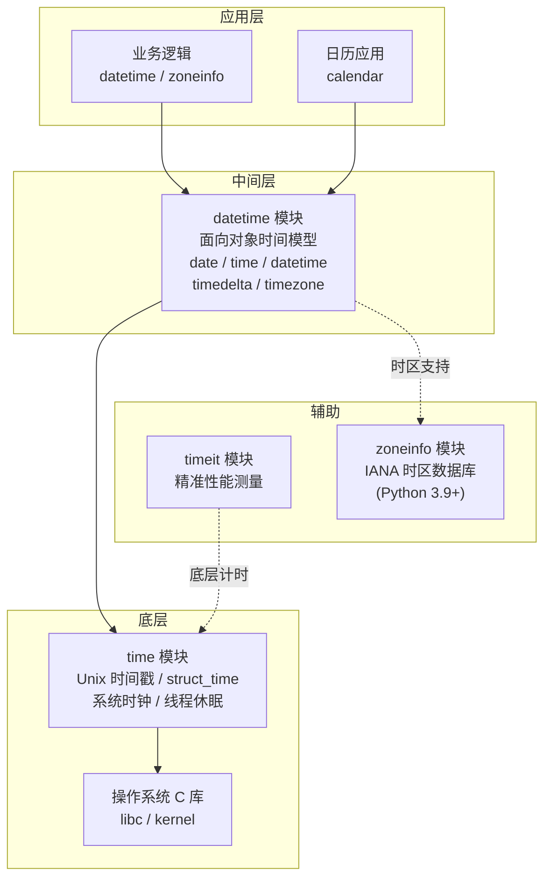
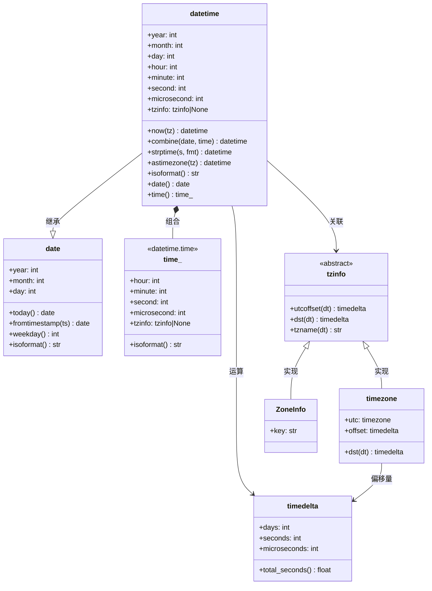
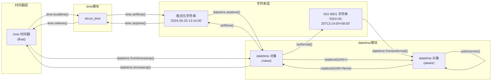

# Python 时间处理模块：time / datetime / calendar

Python 标准库提供了多层时间处理抽象：从最底层的系统时间戳，到面向对象的日期时间运算，再到日历生成与闰年判断。理解它们的职责边界和协作方式，是编写健壮时间逻辑的前提。

## 1. 是什么：Python 时间体系架构

Python 的时间处理并非一个模块包打天下，而是由四个模块各司其职、协同完成：



**核心分工原则**：

| 模块 | 定位 | 核心数据结构 | 何时使用 |
| :--- | :--- | :--- | :--- |
| **`time`** | 底层时间接口，与操作系统 C 库对接 | 时间戳 (`float`)、`struct_time` | 性能计时、线程休眠、与 C 交互 |
| **`datetime`** | 面向对象的时间模型，业务开发主力 | `date`/`time`/`datetime`/`timedelta` | 日期运算、格式化、时区转换、数据持久化 |
| **`calendar`** | 日历生成与闰年判断 | 嵌套列表、文本日历 | 月历展示、排班系统、闰年计算 |
| **`timeit`** | 代码片段性能测量 | — | 算法基准测试、微优化对比 |
| **`zoneinfo`** | IANA 时区数据库接入 (3.9+) | `ZoneInfo` 对象 | 时区感知的 datetime 构建 |

> **一句话选型**：业务逻辑用 `datetime`，底层计时用 `time`，日历用 `calendar`，性能测试用 `timeit`，时区用 `zoneinfo`。

---

## 2. 为什么：时间处理的痛点与设计哲学

### 2.1 时间处理的三大痛点

| 痛点 | 说明 | 后果 |
| :--- | :--- | :--- |
| **时区混乱** | Naive datetime 缺少时区信息，同一时刻不同解读 | 线上事故：跨时区用户看到错误时间 |
| **夏令时陷阱** | 部分地区时钟会"拨快/拨慢"一小时 | 时间计算出现 23h 或 25h 的"一天" |
| **精度与跳变** | `time.time()` 依赖系统时钟，NTP 校时会导致跳变 | 计时器出现负值或不准确的间隔 |

### 2.2 Python 的设计哲学

Python 的时间模块遵循"分层抽象"原则：

- **`time`**：直面操作系统，暴露原始时间戳和 `struct_time`，让你能做底层操控，但语义薄弱。
- **`datetime`**：在 `time` 之上构建面向对象模型，用不可变对象 (immutable) 保障线程安全和运算一致性。
- **Naive vs Aware 分离**：强制你在设计时思考"这个时间有没有时区？"，而非隐式假设。



**类关系要点**：

- `datetime` 继承自 `date`，因此拥有 `date` 的所有属性和方法。
- `datetime` 通过 `tzinfo` 关联时区；`timezone` 和 `ZoneInfo` 是 `tzinfo` 的两种实现。
- `timedelta` 是 `datetime` 算术运算的基石——两个 `datetime` 相减得到 `timedelta`，`datetime` 加 `timedelta` 得到新 `datetime`。
- 所有 datetime 核心类都是**不可变的 (immutable)**，运算总是返回新对象。

---

## 3. 怎么做：从时间戳到时区转换的完整流程

### 3.1 时间戳 <-> datetime 转换全景



> **关键规则**：`datetime.fromtimestamp(ts)` 返回的是**本地时区**的 naive datetime。如果你需要 UTC，请用 `datetime.fromtimestamp(ts, tz=timezone.utc)`。

---

## 4. `time` 模块：底层时间接口

### 4.1 是什么

`time` 模块是对操作系统 C 库时间函数的薄封装，核心数据模型是 **Unix 时间戳**（自 1970-01-01 00:00:00 UTC 以来的浮点秒数）和 **`struct_time`**（9 字段命名元组）。

### 4.2 为什么用 time

| 场景 | 为什么选 `time` 而非 `datetime` |
| :--- | :--- |
| 性能基准测试 | `perf_counter()` 提供纳秒级精度，`datetime` 无法替代 |
| 线程延时 | `time.sleep()` 是标准做法 |
| 与 C 库交互 | 时间戳是 C 标准接口的通用语言 |
| 跨进程时间传递 | 时间戳是纯数字，序列化零成本 |

### 4.3 怎么做

#### 4.3.1 获取与转换时间戳

```python
import time

# ① 获取当前时间戳（浮点秒数）
ts = time.time()
print(f"当前时间戳: {ts}")  # 例如: 1716170400.123456

# ② 时间戳 -> 本地 struct_time
local_st = time.localtime(ts)
print(f"本地 struct_time: {local_st}")
# time.struct_time(tm_year=2024, tm_mon=5, tm_mday=20, ...)

# ③ 时间戳 -> UTC struct_time
utc_st = time.gmtime(ts)
print(f"UTC struct_time: {utc_st}")

# ④ struct_time -> 时间戳（仅限本地时间的 struct_time）
ts_back = time.mktime(local_st)
print(f"还原的时间戳: {ts_back}")  # 与原始 ts 几乎相同
```

#### 4.3.2 格式化与解析

```python
import time

st = time.localtime()

# ① struct_time -> 格式化字符串
formatted = time.strftime("%Y-%m-%d %H:%M:%S", st)
print(f"格式化: {formatted}")  # "2024-05-20 13:14:00"

# ② 格式化字符串 -> struct_time
parsed = time.strptime("2024-01-15 09:30:00", "%Y-%m-%d %H:%M:%S")
print(f"解析: tm_year={parsed.tm_year}, tm_mon={parsed.tm_mon}")
```

#### 4.3.3 性能计时器（核心）

`time.time()` **不适合**用于计时——系统时钟可能因 NTP 校时而跳变。正确选择如下：

| 函数 | 特点 | 适用场景 |
| :--- | :--- | :--- |
| `perf_counter()` | 单调递增，最高精度，不受系统休眠影响 | 短间隔基准测试（首选） |
| `monotonic()` | 严格单调递增，不受系统时间调整影响 | 超时检测、网络编程 |
| `process_time()` | 仅计 CPU 执行时间，不含休眠 | 算法 CPU 开销对比 |

```python
import time

# ============ 推荐写法：perf_counter 计时 ============
start = time.perf_counter()

# ... 被测代码 ...
total = sum(i * i for i in range(10_000_000))

elapsed = time.perf_counter() - start
print(f"耗时: {elapsed:.6f} 秒")  # 例如: 耗时: 0.832145 秒

# ============ process_time：只算 CPU 时间 ============
start_cpu = time.process_time()

# ... CPU 密集型代码 ...
total = sum(i * i for i in range(10_000_000))

cpu_elapsed = time.process_time() - start_cpu
print(f"CPU 耗时: {cpu_elapsed:.6f} 秒")
# 注意：process_time 不含 time.sleep() 等待时间
```

#### 4.3.4 线程休眠

```python
import time

print("任务开始...")
time.sleep(0.5)    # 休眠 500 毫秒
print("500ms 后继续")

# 注意：sleep 的实际精度依赖操作系统调度器，
# Windows 默认精度约 15.6ms，Linux 通常更精确
```

---

## 5. `datetime` 模块：面向对象的时间处理

### 5.1 是什么

`datetime` 模块将时间抽象为不可变对象，提供日期算术、格式化和时区支持，是日常业务开发的主力。

### 5.2 datetime 核心类对比

| 类 | 表示 | 不可变 | 时区支持 | 典型用途 |
| :--- | :--- | :--- | :--- | :--- |
| `date` | 年-月-日 | 是 | 否 | 生日、节假日、纯日期场景 |
| `time` | 时:分:秒.微秒 | 是 | 是 (tzinfo) | 每日定时任务、营业时间 |
| `datetime` | 日期 + 时间 | 是 | 是 (tzinfo) | 日志时间戳、API 时间字段 |
| `timedelta` | 时间差 | 是 | — | 日期偏移、倒计时、超时计算 |
| `timezone` | 固定 UTC 偏移 | 是 | — | 简单时区 (UTC±N) |
| `ZoneInfo` | IANA 时区 | 是 | — | 完整时区规则（含夏令时） |

### 5.3 怎么做

#### 5.3.1 创建 datetime 对象

```python
from datetime import date, time, datetime, timezone, timedelta
from zoneinfo import ZoneInfo

# ============ date：纯日期 ============
today = date.today()                      # 当前日期
birthday = date(2000, 6, 15)             # 指定日期
from_ts = date.fromtimestamp(1716170400) # 从时间戳创建

print(f"今天: {today}")          # 2024-05-20
print(f"生日: {birthday}")       # 2000-06-15
print(f"时间戳日期: {from_ts}")  # 2024-05-20

# ============ time：纯时间 ============
morning = time(8, 30, 0)                  # 08:30:00
with_tz = time(8, 30, 0, tzinfo=ZoneInfo("Asia/Shanghai"))  # 带时区

print(f"早晨: {morning}")        # 08:30:00
print(f"带时区: {with_tz}")      # 08:30:00+08:00

# ============ datetime：日期 + 时间 ============
now_local = datetime.now()                                        # 本地 naive
now_utc = datetime.now(timezone.utc)                              # UTC aware
specific = datetime(2024, 5, 20, 13, 14, 0, tzinfo=ZoneInfo("Asia/Shanghai"))
from_combine = datetime.combine(today, morning)                   # 合并 date + time

print(f"本地: {now_local}")       # 2024-05-20 13:14:00.123456 (naive)
print(f"UTC: {now_utc}")          # 2024-05-20 05:14:00.123456+00:00 (aware)
print(f"指定: {specific}")        # 2024-05-20 13:14:00+08:00
print(f"合并: {from_combine}")    # 2024-05-20 08:30:00 (naive)
```

#### 5.3.2 timedelta 运算

`timedelta` 是日期算术的核心——所有加减运算都通过它完成。

```python
from datetime import datetime, timedelta, date

now = datetime.now()

# ============ 创建 timedelta ============
one_day = timedelta(days=1)            # 1 天
custom = timedelta(                    # 任意组合
    weeks=1,       # 7 天
    days=2,        # +2 天
    hours=3,       # +3 小时
    minutes=30,    # +30 分钟
    seconds=15     # +15 秒
)
print(f"自定义时长: {custom}")         # 9 days, 3:30:15

# ============ datetime + timedelta ============
tomorrow = now + timedelta(days=1)
three_hours_ago = now - timedelta(hours=3)
print(f"明天: {tomorrow}")
print(f"3小时前: {three_hours_ago}")

# ============ datetime - datetime ============
dt1 = datetime(2024, 1, 1)
dt2 = datetime(2024, 12, 31)
diff = dt2 - dt1
print(f"差值: {diff}")                        # 365 days, 0:00:00
print(f"总秒数: {diff.total_seconds()}")       # 31536000.0
print(f"天数: {diff.days}")                    # 365

# ============ date + timedelta ============
d = date(2024, 2, 28)
next_week = d + timedelta(weeks=1)
print(f"下周: {next_week}")             # 2024-03-06

# ============ timedelta 比较与运算 ============
assert timedelta(hours=1) > timedelta(minutes=59)
assert timedelta(hours=1) + timedelta(minutes=30) == timedelta(hours=1, minutes=30)
assert timedelta(hours=2) * 3 == timedelta(hours=6)        # 乘法
assert timedelta(hours=3) / 2 == timedelta(hours=1.5)     # 除法
```

#### 5.3.3 格式化与解析

**时间格式化符号完整对照表**：

| 符号 | 含义 | 范围/示例 | 符号 | 含义 | 范围/示例 |
| :--- | :--- | :--- | :--- | :--- | :--- |
| `%Y` | 四位年份 | `2024` | `%y` | 两位年份 | `24` |
| `%m` | 月份 (补零) | `01`-`12` | `%B` | 月份全称 | `January` |
| `%d` | 日期 (补零) | `01`-`31` | `%b` | 月份缩写 | `Jan` |
| `%H` | 24 小时制 | `00`-`23` | `%I` | 12 小时制 | `01`-`12` |
| `%M` | 分钟 | `00`-`59` | `%S` | 秒 | `00`-`59` |
| `%f` | 微秒 (6 位) | `000000`-`999999` | `%p` | AM/PM | `AM` / `PM` |
| `%A` | 星期全称 | `Monday` | `%a` | 星期缩写 | `Mon` |
| `%w` | 星期 (数字) | `0`(周日)-`6` | `%u` | 星期 (ISO) | `1`(周一)-`7` |
| `%j` | 年内天数 | `001`-`366` | `%U` | 周数(周日始) | `00`-`53` |
| `%W` | 周数(周一始) | `00`-`53` | `%V` | ISO 周数 | `01`-`53` |
| `%z` | UTC 偏移 | `+0800` | `%Z` | 时区名称 | `CST` |
| `%c` | 本地日期时间 | `Mon May 20 13:14:00 2024` | `%x` | 本地日期 | `05/20/24` |
| `%X` | 本地时间 | `13:14:00` | `%%` | 百分号字面量 | `%` |

```python
from datetime import datetime

now = datetime.now()

# ============ strftime：datetime -> 字符串 ============
# ① 常用格式
fmt1 = now.strftime("%Y-%m-%d %H:%M:%S")
print(f"标准格式: {fmt1}")          # "2024-05-20 13:14:00"

# ② 中文友好格式
fmt2 = now.strftime("%Y年%m月%d日 %A %H:%M")
print(f"中文格式: {fmt2}")          # "2024年05月20日 Monday 13:14"

# ③ 文件名安全格式（无特殊字符）
fmt3 = now.strftime("%Y%m%d_%H%M%S")
print(f"文件名格式: {fmt3}")        # "20240520_131400"

# ============ strptime：字符串 -> datetime ============
# 注意：strptime 返回的永远是 naive datetime
parsed = datetime.strptime("2024-05-20 13:14:00", "%Y-%m-%d %H:%M:%S")
print(f"解析结果: {parsed}")         # 2024-05-20 13:14:00 (naive!)

# ============ isoformat / fromisoformat（推荐）============
# ISO 8601 是数据交换的标准格式，无需记忆格式化字符串
iso_str = now.isoformat()
print(f"ISO 格式: {iso_str}")       # "2024-05-20T13:14:00.123456"

dt_from_iso = datetime.fromisoformat("2024-05-20T13:14:00+08:00")
print(f"ISO 解析: {dt_from_iso}")   # 2024-05-20 13:14:00+08:00 (aware)
```

> **最佳实践**：系统间数据交换优先用 `isoformat()`/`fromisoformat()`；面向用户的展示用 `strftime()` 自定义格式。

---

## 6. 时区处理：从 Naive 到 Aware

### 6.1 是什么

- **Naive datetime**：没有时区信息，"2024-05-20 13:14:00" 可能是北京也可能是纽约——无法确定。
- **Aware datetime**：携带时区信息，"2024-05-20 13:14:00+08:00" 明确是北京时间。

### 6.2 为什么时区是最大陷阱

| 陷阱 | 错误做法 | 正确做法 |
| :--- | :--- | :--- |
| 混用 Naive 和 Aware | `naive_dt == aware_dt` | 先统一时区再比较 |
| 本地化 Naive 时间 | `naive_dt.replace(tzinfo=ZoneInfo(...))` | 用 `ZoneInfo` 直接构建 Aware 对象 |
| 跨时区直接加减 | `dt + timedelta(hours=8)` | 用 `astimezone()` 转换 |
| 存储本地时间 | 数据库存 naive 本地时间 | 存储 UTC Aware 时间 |
| 夏令时切换日 | 在 naive 时间上假设一天 = 24 小时 | 用 aware datetime 运算（加减是绝对时长）；需要"日历意义的一天"时在 `date` 上做日历运算后重新组合 |

### 6.3 怎么做

#### 6.3.1 zoneinfo vs pytz

| 特性 | `zoneinfo` (Python 3.9+) | `pytz` (第三方) |
| :--- | :--- | :--- |
| 内置 | 是 | 否，需 `pip install pytz` |
| 数据源 | 系统 IANA 数据库 / `tzdata` 包 | 自带 IANA 数据库 |
| 使用方式 | `dt = datetime(tzinfo=ZoneInfo("..."))` | `dt = pytz.timezone("...").localize(dt)` |
| API 风格 | 直接传入 `tzinfo` 参数 | 必须用 `localize()` 方法 |
| 推荐程度 | **首选** | 仅在 Python < 3.9 时使用 |

> **Windows 用户注意**：`zoneinfo` 在 Windows 上可能找不到时区数据，安装 `tzdata` 包即可解决：`pip install tzdata`

#### 6.3.2 完整时区操作流程

```python
from datetime import datetime, timezone, timedelta
from zoneinfo import ZoneInfo

# ============ 1. 创建 Aware datetime ============
# 方式 A：构建时直接指定时区
beijing = datetime(2024, 5, 20, 13, 14, 0, tzinfo=ZoneInfo("Asia/Shanghai"))

# 方式 B：获取当前时间并指定时区
now_utc = datetime.now(timezone.utc)                # UTC 当前时间
now_beijing = datetime.now(ZoneInfo("Asia/Shanghai"))  # 北京当前时间

print(f"北京时间: {beijing}")          # 2024-05-20 13:14:00+08:00
print(f"UTC 现在: {now_utc}")          # 2024-05-20 05:14:00+00:00
print(f"北京现在: {now_beijing}")      # 2024-05-20 13:14:00+08:00

# ============ 2. 时区转换 ============
# 北京时间 -> 纽约时间
new_york = beijing.astimezone(ZoneInfo("America/New_York"))
print(f"纽约时间: {new_york}")         # 2024-05-20 01:14:00-04:00

# 北京时间 -> UTC
utc_time = beijing.astimezone(timezone.utc)
print(f"UTC 时间: {utc_time}")         # 2024-05-20 05:14:00+00:00

# 北京时间 -> 东京时间
tokyo = beijing.astimezone(ZoneInfo("Asia/Tokyo"))
print(f"东京时间: {tokyo}")            # 2024-05-20 14:14:00+09:00

# ============ 3. Naive -> Aware（本地化）============
naive_dt = datetime(2024, 5, 20, 13, 14, 0)

# ⚠️ 错误：replace 不会做时区转换，只是"贴标签"
# wrong = naive_dt.replace(tzinfo=ZoneInfo("Asia/Shanghai")
# 如果 naive_dt 本身就是北京时间的数据，这样做碰巧正确，
# 但如果它是 UTC 数据，结果就错了

# ✅ 正确：明确数据的原始时区，然后贴标签
# 假设 naive_dt 是北京时间：
aware_beijing = naive_dt.replace(tzinfo=ZoneInfo("Asia/Shanghai"))
# 假设 naive_dt 是 UTC 时间：
aware_utc = naive_dt.replace(tzinfo=timezone.utc)

print(f"本地化(北京): {aware_beijing}")  # 2024-05-20 13:14:00+08:00
print(f"本地化(UTC): {aware_utc}")       # 2024-05-20 13:14:00+00:00

# ============ 4. Aware -> Naive（去除时区）============
naive_back = aware_beijing.replace(tzinfo=None)
print(f"去除时区: {naive_back}")        # 2024-05-20 13:14:00

# ============ 5. 时间戳与 Aware datetime 的互转 ============
ts = aware_beijing.timestamp()          # 正确：aware -> 时间戳
dt_from_ts = datetime.fromtimestamp(ts, tz=timezone.utc)  # 正确：时间戳 -> UTC aware
print(f"时间戳: {ts}")
print(f"还原UTC: {dt_from_ts}")
```

---

## 7. `calendar` 模块：日历功能

### 7.1 核心功能速查

| 函数/方法 | 作用 | 返回值 |
| :--- | :--- | :--- |
| `month(year, month)` | 生成文本月历 | `str` |
| `monthcalendar(year, month)` | 月份矩阵 (周列表) | `list[list[int]]` |
| `monthrange(year, month)` | 月首星期 + 月天数 | `tuple[int, int]` |
| `isleap(year)` | 判断闰年 | `bool` |
| `leapdays(y1, y2)` | 区间闰年数 | `int` |
| `day_name` / `month_name` | 星期/月份名称序列 | 序列对象 |
| `Calendar.firstweekday` | 自定义周起始日 | 可读写属性 |

### 7.2 实用示例

```python
import calendar
from datetime import date

# ============ 1. 生成文本月历 ============
print(calendar.month(2024, 2))
# 输出:
#    February 2024
# Mo Tu We Th Fr Sa Su
#           1  2  3  4
#  5  6  7  8  9 10 11
# ...

# ============ 2. 月份矩阵 ============
weeks = calendar.monthcalendar(2024, 2)
for week in weeks:
    print(week)
# [0, 0, 0, 1, 2, 3, 4]    # 0 表示非本月日期
# [5, 6, 7, 8, 9, 10, 11]
# ...

# ============ 3. 月首星期 + 月天数 ============
weekday, num_days = calendar.monthrange(2024, 2)
# weekday: 3 (周四), num_days: 29 (闰年)
print(f"2024年2月: 首日周{weekday + 1}, 共{num_days}天")

# ============ 4. 闰年判断 ============
print(f"2024 闰年? {calendar.isleap(2024)}")     # True
print(f"2100 闰年? {calendar.isleap(2100)}")     # False (能被100整除但不能被400整除)
print(f"2000-2024间闰年数: {calendar.leapdays(2000, 2025)}")

# ============ 5. 自定义周起始日 ============
c = calendar.Calendar(firstweekday=6)  # 周日为起始
for day in c.itermonthdates(2024, 5):
    if day.month == 5:  # 过滤掉非本月的日期
        print(day, end=" ")
# 2024-05-01 2024-05-02 ... 2024-05-31

# ============ 6. 中文星期名 ============
print(list(calendar.day_name))       # ['Monday', 'Tuesday', ...]
# 如需中文，可以自行映射：
cn_days = ["周一", "周二", "周三", "周四", "周五", "周六", "周日"]
weekday_cn = cn_days[date.today().weekday()]
print(f"今天是: {weekday_cn}")
```

---

## 8. `timeit` 模块：代码性能测量

### 8.1 是什么

`timeit` 模块专为精准测量短代码片段的执行时间而设计，自动处理预热、多次运行和统计。

### 8.2 timeit vs time.perf_counter

| 对比项 | `timeit` | `time.perf_counter()` |
| :--- | :--- | :--- |
| 自动多次运行 | 是 (默认 1M 次) | 否，需手动循环 |
| 禁用 GC | 默认禁用 | 不禁用 |
| 返回统计值 | 最优时间 / 列表 | 单次间隔 |
| 命令行使用 | 支持 | 不支持 |
| 适用场景 | 微基准测试 | 代码块计时 |

### 8.3 怎么做

```python
import timeit

# ============ 1. 命令行方式（最快上手）============
# 在终端运行：
# python -m timeit "sum(range(100))"
# python -m timeit -n 1000 -r 5 "sum(range(100))"

# ============ 2. 函数调用方式 ============
# 测量列表推导 vs map 的性能
setup = "data = list(range(10000))"

time_listcomp = timeit.timeit(
    stmt="[x * 2 for x in data]",  # 被测代码
    setup=setup,                    # 预执行代码
    number=1000                     # 运行次数
)

time_map = timeit.timeit(
    stmt="list(map(lambda x: x * 2, data))",
    setup=setup,
    number=1000
)

print(f"列表推导: {time_listcomp:.4f}s")
print(f"map 函数: {time_map:.4f}s")

# ============ 3. repeat：多次独立测量 ============
results = timeit.repeat(
    stmt="sum(range(1000))",
    number=10000,
    repeat=5  # 独立运行 5 轮
)
print(f"各轮耗时: {results}")
print(f"最优时间: {min(results):.6f}s")

# ============ 4. Timer 对象（更灵活）============
timer = timeit.Timer(
    stmt="sorted(data)",
    setup="import random; data = [random.random() for _ in range(1000)]"
)

# 只运行一次，用于粗略估计
rough = timer.timeit(number=100)
print(f"粗略耗时: {rough:.6f}s")
```

---

## 9. time vs datetime 对比表

| 维度 | `time` | `datetime` |
| :--- | :--- | :--- |
| **数据模型** | 时间戳 (`float`) + `struct_time` (元组) | 面向对象 (`date`/`time`/`datetime`/`timedelta`) |
| **时区支持** | 无 (只能通过 `localtime`/`gmtime` 区分本地/UTC) | 完整 (`tzinfo`/`timezone`/`ZoneInfo`) |
| **日期算术** | 不支持 (需手动计算时间戳差) | 原生支持 (`timedelta` 运算) |
| **格式化** | `strftime`/`strptime` (基于 `struct_time`) | `strftime`/`strptime` (基于对象) + `isoformat` |
| **可读性** | 低 (时间戳是纯数字) | 高 (语义明确的属性访问) |
| **序列化** | 时间戳天然适合 JSON/数据库 | 需转为字符串或时间戳 |
| **性能计时** | `perf_counter`/`monotonic`/`process_time` | 无 |
| **线程控制** | `sleep()` | 无 |
| **不可变性** | `struct_time` 是元组，天然不可变 | 所有核心类均不可变 |
| **推荐场景** | 计时、休眠、C 接口、序列化 | 业务逻辑、时区转换、日期运算 |

> **选型口诀**：计时休眠用 `time`，业务运算用 `datetime`，序列化存时间戳，展示转 ISO 字符串。

---

## 10. 实战案例

### 10.1 计时器：精确测量代码执行耗时

```python
import time
from contextlib import contextmanager

@contextmanager
def timer(label: str):
    """上下文管理器计时器，使用 perf_counter 保证精度"""
    start = time.perf_counter()   # ① 记录起始时刻
    yield                          # ② 执行被测代码块
    elapsed = time.perf_counter() - start  # ③ 计算耗时
    print(f"[{label}] 耗时: {elapsed:.6f} 秒")

# 使用示例
with timer("列表推导"):
    result = [i ** 2 for i in range(1_000_000)]

with timer("生成器求和"):
    total = sum(i ** 2 for i in range(1_000_000))
```

### 10.2 日期范围生成器

```python
from datetime import date, timedelta

def date_range(start: date, end: date, step: timedelta = timedelta(days=1)):
    """生成从 start 到 end（不含 end）的日期序列

    Args:
        start: 起始日期（含）
        end:   结束日期（不含）
        step:  步长，默认 1 天

    Yields:
        date: 序列中的每个日期
    """
    current = start
    while current < end:               # ① 循环直到到达 end
        yield current                   # ② 产出当前日期
        current += step                 # ③ 步进

# 示例：生成 2024 年 5 月的所有日期
may_dates = list(date_range(date(2024, 5, 1), date(2024, 6, 1)))
print(f"5月天数: {len(may_dates)}")  # 31

# 示例：每隔一周取一天
weekly = list(date_range(
    date(2024, 1, 1),
    date(2024, 4, 1),
    timedelta(weeks=1)
))
print(f"Q1 周数: {len(weekly)}")  # 13

# 示例：工作日过滤
workdays = [
    d for d in date_range(date(2024, 5, 1), date(2024, 6, 1))
    if d.weekday() < 5  # 0-4 = 周一到周五
]
print(f"5月工作日: {len(workdays)} 天")
```

### 10.3 时区转换：全球会议时间对齐

```python
from datetime import datetime, timezone
from zoneinfo import ZoneInfo

def world_clock(dt: datetime, *cities: str) -> dict[str, datetime]:
    """将一个时间转换为多个城市对应的本地时间

    Args:
        dt: 源时间（必须是 aware datetime）
        cities: IANA 时区标识符列表

    Returns:
        城市 -> 本地时间的字典
    """
    result = {}
    for city in cities:
        tz = ZoneInfo(city)
        local_time = dt.astimezone(tz)   # 时区转换
        result[city] = local_time
    return result

# 场景：安排全球会议，北京时间下午 2 点
meeting_time = datetime(2024, 5, 20, 14, 0, 0, tzinfo=ZoneInfo("Asia/Shanghai"))

clocks = world_clock(
    meeting_time,
    "Asia/Shanghai",        # 北京
    "America/New_York",     # 纽约
    "Europe/London",        # 伦敦
    "Asia/Tokyo",           # 东京
    "Australia/Sydney",     # 悉尼
)

for city, t in clocks.items():
    print(f"{city:25s} {t.strftime('%Y-%m-%d %H:%M (%Z)')}")
# Asia/Shanghai              2024-05-20 14:00 (CST)
# America/New_York           2024-05-20 02:00 (EDT)
# Europe/London              2024-05-20 07:00 (BST)
# Asia/Tokyo                 2024-05-20 15:00 (JST)
# Australia/Sydney           2024-05-20 16:00 (AEST)
```

### 10.4 时间戳与 datetime 互转工具函数

```python
from datetime import datetime, timezone
from zoneinfo import ZoneInfo

def ts_to_datetime(ts: float, tz_name: str = "UTC") -> datetime:
    """时间戳 -> 指定时区的 aware datetime"""
    tz = ZoneInfo(tz_name) if tz_name != "UTC" else timezone.utc
    return datetime.fromtimestamp(ts, tz=tz)

def datetime_to_ts(dt: datetime) -> float:
    """aware/naive datetime -> 时间戳"""
    if dt.tzinfo is None:
        # naive datetime 按本地时区处理（不推荐，但需要处理）
        return dt.timestamp()
    return dt.timestamp()  # aware datetime 自动正确转换

# 示例
ts = 1716170400.0
dt_utc = ts_to_datetime(ts, "UTC")
dt_bj = ts_to_datetime(ts, "Asia/Shanghai")

print(f"时间戳 {ts}")
print(f"  UTC: {dt_utc}")    # 2024-05-20 02:00:00+00:00
print(f"  北京: {dt_bj}")    # 2024-05-20 10:00:00+08:00

# 反向转换
print(f"还原时间戳: {datetime_to_ts(dt_utc)}")  # 1716170400.0
```

---

## 11. 最佳实践对比表

| 场景 | 推荐做法 | 反模式 | 原因 |
| :--- | :--- | :--- | :--- |
| 内部存储时间 | UTC Aware datetime / 时间戳 | 本地 Naive datetime | 避免时区歧义 |
| API 时间字段 | ISO 8601 字符串 | 自定义格式字符串 | 国际标准，无歧义 |
| 用户展示 | `astimezone()` 转本地时区 | 直接展示 UTC | 用户体验 |
| 计时/基准测试 | `time.perf_counter()` | `time.time()` | 避免系统时钟跳变 |
| 代码微优化 | `timeit` 模块 | 手写 for 循环计时 | 自动预热、多次运行、禁用 GC |
| 日期运算 | `timedelta` | 手动计算秒数 | 可读性、正确性（夏令时） |
| 时区构建 | `ZoneInfo("Asia/Shanghai")` | `timezone(timedelta(hours=8))` | 后者不含夏令时规则 |
| Naive -> Aware | `replace(tzinfo=...)` | 手动加减小时数 | 保证时间点不变 |
| 格式化 | `isoformat()`（系统间）/ `strftime()`（用户展示） | 拼接字符串 | 避免格式错误 |
| 跨时区比较 | 统一转 UTC 后比较 | 直接比较不同时区的 naive | 结果不可靠 |

---

## 12. 常见陷阱 / FAQ

### Q1：Naive datetime 和 Aware datetime 能比较吗？

**不能**。Python 3 会抛出 `TypeError`：

```python
from datetime import datetime, timezone

naive = datetime(2024, 1, 1, 8, 0, 0)
aware = datetime(2024, 1, 1, 0, 0, 0, tzinfo=timezone.utc)

# naive == aware  # TypeError: can't compare offset-naive and offset-aware datetimes
```

**解决**：统一为 Aware 后再比较。

### Q2：夏令时切换日，"一天"不是 24 小时怎么办？

```python
from datetime import datetime, timedelta
from zoneinfo import ZoneInfo

# 美国 2024 年 3 月 10 日夏令时开始，时钟从 2:00 跳到 3:00
tz = ZoneInfo("America/New_York")
midnight = datetime(2024, 3, 10, 0, 0, 0, tzinfo=tz)

# ⚠️ 关键认知：aware datetime 加减 timedelta 的都是"绝对时长"，
# days=1 与 hours=24 完全等价（实测一致），不存在"days=1 会自动适配 DST"的说法
next_day = midnight + timedelta(days=1)
print(next_day)                                          # 2024-03-11 00:00:00-04:00
print(f"绝对时长: {(next_day - midnight).total_seconds() / 3600} 小时")  # 24.0
print(midnight + timedelta(hours=24) == next_day)        # True
# 但在墙上时钟上，这一段只"看起来"过了 23 小时（2:00 被跳过）

# ✅ 正确：需要"下一天的同一钟表时刻"（日历语义）时，
# 先在 date 上做日历运算，再用 combine 重新组合（时区偏移由 zoneinfo 按新日期计算）
next_calendar_day = datetime.combine(
    midnight.date() + timedelta(days=1),
    midnight.timetz()
)
print(next_calendar_day)  # 2024-03-11 00:00:00-04:00
```

**规则**：aware datetime 的加减是绝对时长（`days=1` 与 `hours=24` 等价）；需要"日历意义的一天"时，在 `date` 上做运算后 `combine`，或使用 `dateutil.relativedelta`。

### Q3：`datetime.utcnow()` 和 `datetime.now(timezone.utc)` 有什么区别？

| | `utcnow()` | `now(timezone.utc)` |
| :--- | :--- | :--- |
| 返回类型 | **Naive** datetime | **Aware** datetime |
| Python 3.12 状态 | **已弃用**（3.14 仍保留但官方要求迁移） | 推荐 |
| 时区信息 | 无 | `+00:00` |

**结论**：始终使用 `datetime.now(timezone.utc)`，不要用 `utcnow()`。

### Q4：时间戳精度够用吗？

Python 的 `time.time()` 返回 `float`，在大多数系统上精度约 1 微秒。`perf_counter()` 精度更高，可达纳秒级。

但要注意 `float` 的有效位数限制（约 15-16 位）：

```python
import time

# 远未来的时间戳可能丢失微秒精度
ts = time.time()
print(f"时间戳: {ts:.6f}")  # 微秒级精度

# 如果需要更高精度，使用 perf_counter 的纳秒版本
ns = time.perf_counter_ns()
print(f"纳秒计时: {ns}")
```

### Q5：datetime 对象为什么是不可变的？

```python
from datetime import datetime

dt = datetime(2024, 5, 20, 13, 14, 0)

# dt.hour = 15  # AttributeError: attribute 'hour' is read-only

# 正确做法：用 replace() 创建新对象
dt_new = dt.replace(hour=15)
print(f"原对象: {dt}")      # 13:14:00 (不变)
print(f"新对象: {dt_new}")  # 15:14:00
```

**原因**：不可变性保证了线程安全、哈希稳定（可做 dict key）、运算无副作用。

### Q6：`fromtimestamp()` 返回的是本地时间还是 UTC？

```python
from datetime import datetime, timezone

ts = 1716170400.0

# 不指定 tz -> 本地时区的 naive datetime（取决于运行环境的时区设置）
local_dt = datetime.fromtimestamp(ts)     # 危险！结果因环境而异

# 指定 tz -> 明确时区的 aware datetime
utc_dt = datetime.fromtimestamp(ts, tz=timezone.utc)  # 推荐

print(f"本地: {local_dt}")   # 结果依赖系统时区
print(f"UTC: {utc_dt}")      # 2024-05-20 02:00:00+00:00（确定性）
```

**规则**：永远在 `fromtimestamp()` 中指定 `tz` 参数。

### Q7：如何在数据库/JSON 中存储时间？

| 格式 | 示例 | 优点 | 缺点 |
| :--- | :--- | :--- | :--- |
| Unix 时间戳 | `1716170400.0` | 紧凑、无时区歧义 | 不可读 |
| ISO 8601 | `"2024-05-20T02:00:00Z"` | 可读、国际标准 | 字符串较长 |
| 数据库原生 | `TIMESTAMP WITH TIME ZONE` | 数据库原生支持 | 依赖数据库 |

**推荐**：数据库用 `TIMESTAMP WITH TIME ZONE`，JSON 用 ISO 8601。

---

## 术语表

| 术语 | 英文 | 定义 |
| :--- | :--- | :--- |
| Unix 时间戳 | Unix Timestamp / Epoch Time | 自 1970-01-01 00:00:00 UTC 以来的秒数（浮点数） |
| `struct_time` | struct_time | `time` 模块中的 9 字段命名元组，是时间戳与格式化字符串的桥梁 |
| Naive datetime | Naive datetime | 不含时区信息的 datetime 对象 |
| Aware datetime | Aware datetime | 含时区信息 (`tzinfo`) 的 datetime 对象 |
| UTC | Coordinated Universal Time | 协调世界时，全球时间基准 |
| DST | Daylight Saving Time | 夏令时，部分地区在夏季将时钟拨快一小时 |
| IANA 时区数据库 | IANA Time Zone Database | 全球时区规则的标准数据集（含历史变更和夏令时规则） |
| ISO 8601 | ISO 8601 | 国际日期时间格式标准，如 `2024-05-20T13:14:00+08:00` |
| `timedelta` | timedelta | 表示两个时间点之差的不可变对象 |
| `tzinfo` | tzinfo | datetime 的时区信息基类，`timezone` 和 `ZoneInfo` 是其实现 |
| 单调时钟 | Monotonic Clock | 严格递增的时钟，不受系统时间调整影响 |
| 纪元 | Epoch | 时间戳的起点：1970-01-01 00:00:00 UTC |
| `strftime` | strftime | "string format time"——将时间对象格式化为字符串 |
| `strptime` | strptime | "string parse time"——将字符串解析为时间对象 |

---

## 延伸阅读

| 资源 | 说明 | 链接 |
| :--- | :--- | :--- |
| Python 官方文档：`datetime` | 核心模块完整参考 | [docs.python.org/3/library/datetime.html](https://docs.python.org/3/library/datetime.html) |
| Python 官方文档：`time` | 底层时间接口参考 | [docs.python.org/3/library/time.html](https://docs.python.org/3/library/time.html) |
| Python 官方文档：`zoneinfo` | IANA 时区支持 | [docs.python.org/3/library/zoneinfo.html](https://docs.python.org/3/library/zoneinfo.html) |
| PEP 495 | 本地时间消歧义（夏令时重叠） | [peps.python.org/pep-0495](https://peps.python.org/pep-0495/) |
| PEP 615 | `zoneinfo` 模块正式纳入标准库 | [peps.python.org/pep-0615](https://peps.python.org/pep-0615/) |
| IANA 时区数据库 | 全球时区规则权威数据源 | [iana.org/time-zones](https://www.iana.org/time-zones) |
| ISO 8601 标准 | 日期时间格式国际标准 | [iso.org/iso-8601](https://www.iso.org/iso-8601-date-and-time-format.html) |
| 《日期时间编程的真相》 | YouTube 演讲：为什么时间处理如此困难 | 搜索 "The Truth About Date Time Programming" |
| `dateutil` 第三方库 | 增强 datetime 功能（相对解析、重复事件） | [dateutil.readthedocs.io](https://dateutil.readthedocs.io/) |
| `arrow` 第三方库 | 更人性化的 datetime API | [arrow.readthedocs.io](https://arrow.readthedocs.io/) |

---

> **学习路线建议**：先掌握 `datetime` 的对象模型和 `timedelta` 运算 → 理解 Naive/Aware 的区别 → 学会用 `zoneinfo` 做时区转换 → 用 `time.perf_counter()` 做性能计时 → 在实际项目中积累时区陷阱的经验。

## 版本差异（标准库 → Python 3.14）

| 模块/特性 | 本文编写时 | Python 3.14 变化 |
|-----------|-----------|------------------|
| `datetime` | `utcnow()` / `utcfromtimestamp()` | 3.12 起弃用，改用 `datetime.now(tz=datetime.UTC)` / `fromtimestamp(ts, tz=datetime.UTC)`（aware 对象） |
| `asyncio` | 基础 API | 3.14 新增内省能力（`asyncio.Task`/`Future` 状态查询）；3.11 起推荐 `TaskGroup` + `asyncio.timeout()` |
| `typing` | 旧式 `List`/`Dict` | 3.9+ 内置泛型；3.10+ 联合类型 `X \| Y`；3.12 `type` 语句；3.14 PEP 649 延迟注解 |
| `importlib` | `imp` 模块 | `imp` 于 3.12 移除，统一使用 `importlib` |
| 压缩 | zlib/gzip/bz2/lzma | 3.14 新增 `zstandard` 标准库支持（PEP 784） |
| `pathlib` | 基础路径操作 | 3.12+ 持续增强（`Path.walk()` 等）；`is_relative_to()` 自 3.9 起可用 |
| 往事清理 | — | 3.13 移除 `cgi`、`telnetlib`、`crypt`、`audioop` 等已废弃模块 |

> 本文讲解的模块核心 API 与使用模式在 3.14 中保持稳定；注意上述弃用/移除项，升级时优先用标准库推荐的替代方案。
