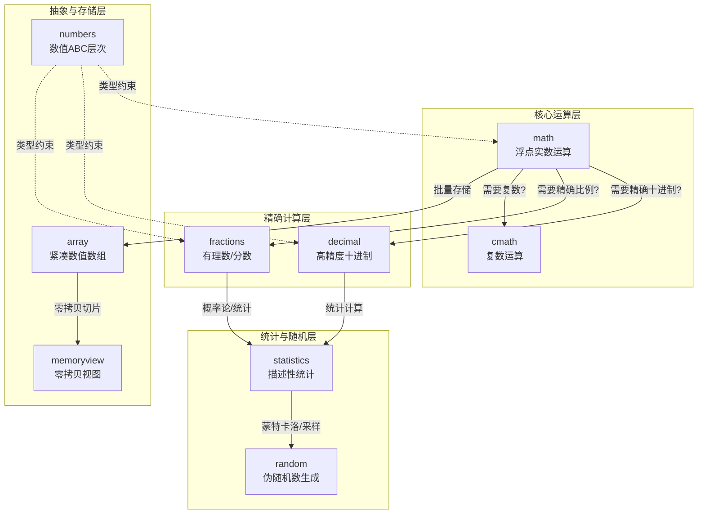
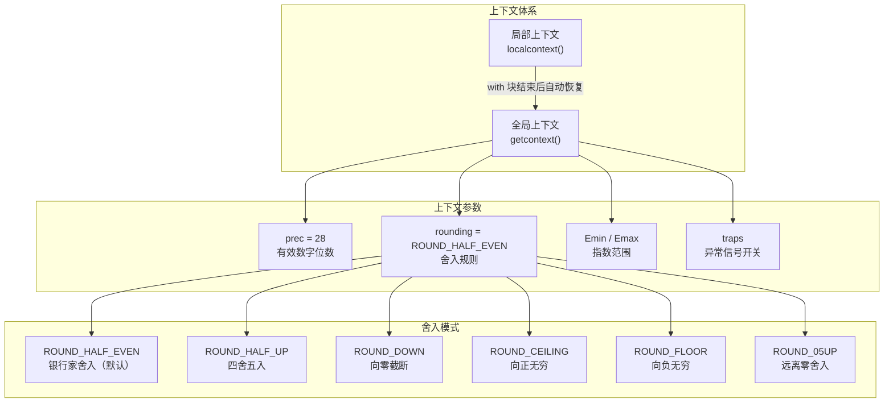
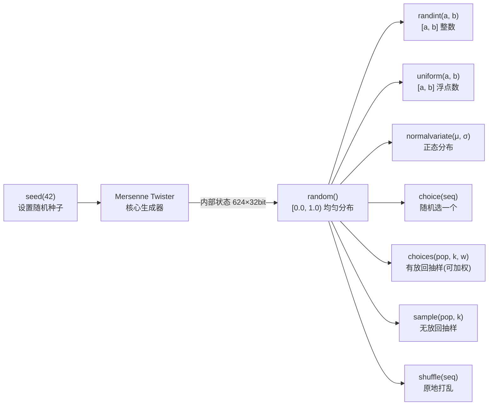

# Python 数学与数值计算

Python 标准库提供了一套完整的数学与数值计算模块体系——从基础浮点运算（`math`）、复数运算（`cmath`）、高精度十进制（`decimal`）、精确有理数（`fractions`），到描述性统计（`statistics`）和伪随机数生成（`random`）。理解这些模块的分工与协作，是写出**正确、精确、高效**数值代码的前提。

---

## 全局导航：Python 数学模块体系



### 模块速查选型表

| 模块 | 一句话定位 | 精度保证 | 典型场景 | 性能 |
|:--|:--|:--|:--|:--|
| `math` | IEEE 754 浮点实数运算 | 双精度（~15-16 位有效数字） | 通用科学计算、几何、三角函数 | 极快 |
| `cmath` | 复数版 math | 双精度 | 信号处理、交流电路、量子力学 | 极快 |
| `decimal` | 十进制精确浮点 | 用户自定义（默认 28 位） | 财务计算、货币、精确计量 | 中等 |
| `fractions` | 有理数（分数）运算 | 精确无误差 | 概率论、离散数学、比例计算 | 中等 |
| `statistics` | 描述性统计 | 依赖输入类型 | 均值/中位数/标准差/正态分布 | 中小数据集快 |
| `random` | 伪随机数生成与抽样 | N/A（非密码学安全） | 蒙特卡洛、数据抽样、游戏 | 快 |
| `numbers` | 数值类型抽象基类 | N/A | 自定义数值类型、类型检查 | N/A |
| `array` | 同类型紧凑数值数组 | 依赖类型码 | 大量同类型数值紧凑存储 | 快 |
| `memoryview` | 零拷贝缓冲区视图 | N/A | 大型数据缓冲区高效处理 | 极快 |

---

## 第一层：基础浮点运算 — `math` 与 `cmath`

### `math` — 标准实数数学函数

`math` 模块提供符合 IEEE 754 标准的浮点数数学函数，**只接受实数输入**，是科学计算和工程计算的基础工具。

#### math 核心函数分类表

| 分类 | 函数/常量 | 描述 | 关键细节 |
|:--|:--|:--|:--|
| **常量** | `pi`, `e`, `tau`, `inf`, `nan` | 圆周率、自然常数、2π、无穷大、非数值 | `tau = 2π`，`nan != nan` |
| **取整** | `ceil(x)`, `floor(x)`, `trunc(x)` | 向上/向下取整/截断 | `ceil(-2.3) = -2`，`trunc(-2.3) = -2` |
| **幂与对数** | `pow(x,y)`, `sqrt(x)`, `exp(x)`, `log(x,[base])` | 幂、平方根、e^x、对数 | `log(x, 10)` 与 `log10(x)` 等价，但精度通常略低 |
| **三角函数** | `sin(x)`, `cos(x)`, `tan(x)` | 正弦/余弦/正切（弧度） | 输入为弧度，用 `radians()` 转换 |
| **反三角** | `asin(x)`, `acos(x)`, `atan2(y,x)` | 反正弦/余弦/考虑象限的反正切 | `atan2` 自动判断象限 |
| **组合数学** | `comb(n,k)`, `perm(n,k)`, `factorial(n)` | 组合数/排列数/阶乘 | Python 3.8+ 大整数安全 |
| **特殊函数** | `gamma(x)`, `erf(x)` | 伽马函数/误差函数 | `gamma(n) = (n-1)!` |
| **浮点工具** | `fsum(iter)`, `isclose(a,b)`, `fma(x,y,z)` | 精确求和/近似比较/熔合乘加 | `fma` 仅一次舍入（3.13+） |
| **距离** | `dist(p,q)`, `hypot(*coords)` | 欧氏距离/多维向量模长 | `hypot(x,y)` = `sqrt(x²+y²)` |

#### 代码示例：精确计算与浮点陷阱

```python
import math

# --- 陷阱演示：0.1 + 0.2 != 0.3 ---
print(0.1 + 0.2 == 0.3)           # False！二进制浮点无法精确表示 0.1
print(math.isclose(0.1 + 0.2, 0.3))  # True — 用 isclose 安全比较

# --- fma vs 常规运算：减少中间舍入 ---
a, b, c = 1e-16, 1e-16, 1.0
regular = a * b + c        # 中间结果 a*b 先舍入，再加 c
fma_result = math.fma(a, b, c)  # 只在最后一步舍入
print(f"常规: {regular}, FMA: {fma_result}")
# 当 a*b 极小时，fma 能保留更多有效位

# --- fsum：精确浮点序列求和 ---
values = [0.1] * 10
print(f"sum():    {sum(values)}")      # 1.0（Python 3.12+ 的 sum 已内建 Neumaier 补偿求和）
print(f"fsum():   {math.fsum(values)}") # 1.0 — Kahan/Neumaier 补偿算法，任何版本都精确

# --- isclose 的容差参数 ---
# rel_tol: 相对容差（默认 1e-9），abs_tol: 绝对容差（默认 0）
print(math.isclose(1e-10, 1e-10 + 1e-18))              # True（相对容差内）
print(math.isclose(0.0, 1e-20, abs_tol=1e-15))         # True（绝对容差内）
print(math.isclose(0.0, 1e-10, abs_tol=1e-15))         # False
```

#### 代码示例：极坐标转换

```python
import math

x, y = -4, 3

# 计算模长（半径）
r = math.hypot(x, y)       # 等价于 sqrt(x*x + y*y)，但避免溢出

# 计算辐角（角度）—— atan2 自动判断象限
theta = math.atan2(y, x)   # 返回弧度

print(f"笛卡尔坐标: ({x}, {y})")
print(f"极坐标 (模, 辐角): ({r:.2f}, {math.degrees(theta):.2f}°)")

# 反向转换：极坐标 -> 笛卡尔坐标
x2 = r * math.cos(theta)
y2 = r * math.sin(theta)
print(f"反转换: ({x2:.2f}, {y2:.2f})")
```

### `cmath` — 复数数学函数

`cmath` 是 `math` 的复数版本，所有函数都接受复数输入、返回复数结果。

#### cmath 核心功能表

| 分类 | 函数 | 描述 |
|:--|:--|:--|
| **转换** | `phase(z)`, `polar(z)`, `rect(r, phi)` | 获取辐角、转极坐标、从极坐标还原 |
| **幂与对数** | `exp(z)`, `log(z)`, `log10(z)`, `sqrt(z)` | 复数指数/自然对数/常用对数/平方根 |
| **三角函数** | `sin(z)`, `cos(z)`, `tan(z)` | 复数三角函数 |
| **双曲函数** | `sinh(z)`, `cosh(z)`, `tanh(z)` | 复数双曲函数 |

#### 代码示例：欧拉公式验证

```python
import cmath

phi = cmath.pi / 4  # 45°

# 欧拉公式: e^(iφ) = cos(φ) + i·sin(φ)
rect_form = cmath.rect(1, phi)    # 极坐标 (1, φ) -> 笛卡尔
exp_form = cmath.exp(1j * phi)    # 直接用 exp 计算

print(f"rect(1, π/4)  = {rect_form:.3f}")
print(f"exp(j·π/4)    = {exp_form:.3f}")
print(f"两者近似相等? {cmath.isclose(rect_form, exp_form)}")
```

#### 代码示例：交流电路阻抗计算

```python
import cmath
import math

# RLC 串联电路参数
R = 10       # 电阻 (Ω)
L = 0.05     # 电感 (H)
C = 1e-4     # 电容 (F)
f = 50       # 频率 (Hz)
omega = 2 * cmath.pi * f  # 角频率

# 感抗 Z_L = jωL，容抗 Z_C = 1/(jωC)
Z_L = 1j * omega * L
Z_C = 1 / (1j * omega * C)

# 总阻抗
Z_total = R + Z_L + Z_C

print(f"总阻抗: {Z_total:.2f} Ω")
print(f"阻抗模: {abs(Z_total):.2f} Ω")
print(f"相位角: {math.degrees(cmath.phase(Z_total)):.2f}°")
```

> **注意**：`cmath` 函数总是返回 `complex` 类型，即使虚部为零。若输入确定是实数，优先用 `math` 以获得 `float` 返回值。

---

## 第二层：精确计算 — `decimal` 与 `fractions`

### `decimal` — 高精度十进制算术

`decimal` 模块解决了 `float` 二进制浮点数的根本问题：**无法精确表示十进制小数**（如 0.1）。它提供精确的十进制浮点运算，是金融和会计领域的必备工具。

#### decimal 精度控制机制 Mermaid 图



#### 创建 Decimal 的三种方式（陷阱！）

```python
from decimal import Decimal

# --- 方式 1：从字符串创建（推荐！精确） ---
d1 = Decimal('0.1')       # 精确的 0.1
print(f"Decimal('0.1')  = {d1}")  # 0.1

# --- 方式 2：从整数创建（推荐！精确） ---
d2 = Decimal(10)          # 精确的 10
print(f"Decimal(10)     = {d2}")  # 10

# --- 方式 3：从 float 创建（危险！已丢失精度） ---
d3 = Decimal(0.1)         # 先构造 float 0.1，再转换——精度已丢
print(f"Decimal(0.1)    = {d3}")  # 0.1000000000000000055511151231257827021181583404541015625

# 结论：永远用字符串或整数创建 Decimal！
```

#### decimal 上下文管理

```python
from decimal import Decimal, getcontext, localcontext, ROUND_HALF_UP, ROUND_HALF_EVEN

# --- 查看默认全局上下文 ---
ctx = getcontext()
print(f"默认精度: {ctx.prec}")        # 28
print(f"默认舍入: {ctx.rounding}")    # ROUND_HALF_EVEN

# --- 修改全局上下文（影响后续所有 Decimal 运算） ---
getcontext().prec = 6
print(f"1/7 (prec=6): {Decimal(1) / Decimal(7)}")  # 0.142857

# --- 使用 localcontext 临时修改（推荐！不影响全局） ---
with localcontext() as ctx:
    ctx.prec = 50
    ctx.rounding = ROUND_HALF_UP
    result = Decimal(1) / Decimal(7)
    print(f"1/7 (prec=50): {result}")

# 退出 with 块后，精度和舍入规则自动恢复
print(f"1/7 (恢复后): {Decimal(1) / Decimal(7)}")
```

#### quantize：按指定小数位舍入

```python
from decimal import Decimal, ROUND_HALF_UP, ROUND_DOWN, ROUND_HALF_EVEN

price = Decimal('29.95')
tax_rate = Decimal('0.0825')

# 计算税额并舍入到分
tax = (price * tax_rate).quantize(Decimal('0.01'), rounding=ROUND_HALF_UP)
print(f"税额: ${tax}")  # $2.47

# 对比不同舍入模式
value = Decimal('2.345')
print(f"ROUND_HALF_UP:   {value.quantize(Decimal('0.01'), rounding=ROUND_HALF_UP)}")   # 2.35
print(f"ROUND_HALF_EVEN: {value.quantize(Decimal('0.01'), rounding=ROUND_HALF_EVEN)}") # 2.34（银行家舍入）
print(f"ROUND_DOWN:      {value.quantize(Decimal('0.01'), rounding=ROUND_DOWN)}")      # 2.34（截断）
```

### `fractions` — 有理数（分数）运算

`fractions.Fraction` 以**分子/分母**形式存储数值，运算过程中**永远不会产生舍入误差**，结果自动约分为最简分数。

#### 代码示例：分数运算

```python
from fractions import Fraction

# --- 创建 Fraction 的多种方式 ---
f1 = Fraction(3, 4)       # 从分子、分母创建
f2 = Fraction('0.5')      # 从字符串创建
f3 = Fraction(2, 8)       # 自动约分 -> 1/4
f4 = Fraction(1.5)        # 从 float 创建（有精度风险，不推荐）
f5 = Fraction(Decimal('0.1'))  # 从 Decimal 创建（精确）

print(f"Fraction(3,4) = {f1}")   # 3/4
print(f"Fraction('0.5') = {f2}") # 1/2
print(f"Fraction(2,8) = {f3}")   # 1/4（自动约分）

# --- 四则运算：结果保持精确 ---
a = Fraction(1, 3)
b = Fraction(1, 6)
print(f"{a} + {b} = {a + b}")  # 1/2
print(f"{a} - {b} = {a - b}")  # 1/6
print(f"{a} * {b} = {a * b}")  # 1/18
print(f"{a} / {b} = {a / b}")  # 2（精确整数）
```

#### limit_denominator：有理数近似

```python
from fractions import Fraction
import math

# 将 π 近似为分数
pi_frac = Fraction(math.pi)
print(f"π 的默认分数: {pi_frac}")
# 884279719003555/281474976710656

# 限制分母大小，获得常用近似值
print(f"分母 <= 7:   {pi_frac.limit_denominator(7)}")    # 22/7（经典近似）
print(f"分母 <= 100: {pi_frac.limit_denominator(100)}")  # 311/99
print(f"分母 <= 113: {pi_frac.limit_denominator(113)}")  # 355/113（密率，极高精度）
```

### math vs decimal vs fractions 对比表

| 维度 | `math` (float) | `decimal` (Decimal) | `fractions` (Fraction) |
|:--|:--|:--|:--|
| **表示方式** | IEEE 754 二进制双精度 | 十进制浮点 | 分子/分母整数对 |
| **精度** | ~15-16 位有效数字 | 用户自定义（默认 28 位） | 精确无误差 |
| **0.1 精确表示** | 否 | 是 | 是（1/10） |
| **运算速度** | 最快（硬件加速） | 中等（纯 Python） | 较慢（整数运算+约分） |
| **内存占用** | 8 字节 | 较大（随精度增长） | 较大（两个整数） |
| **适用场景** | 科学计算、通用数值 | 金融、货币、会计 | 概率论、比例、离散数学 |
| **舍入控制** | 无（硬件默认） | 多种舍入模式 | 无需舍入（精确） |
| **与 math 函数兼容** | 原生兼容 | 不兼容 | 不兼容 |
| **序列化** | 直接 JSON | 需转字符串 | 需转字符串 |
| **典型创建** | `0.1`（字面量） | `Decimal('0.1')` | `Fraction(1, 10)` |

---

## 第三层：统计与随机 — `statistics` 与 `random`

### `statistics` — 描述性统计函数

`statistics` 模块为中小规模数据提供描述性统计计算，适合快速数据分析，无需引入 NumPy。

#### statistics 核心函数表

| 分类 | 函数 | 描述 | 样本 vs 总体 |
|:--|:--|:--|:--|
| **集中趋势** | `mean(data)` | 算术平均值 | — |
| | `fmean(data)` | 快速浮点均值（Python 3.8+） | — |
| | `geometric_mean(data)` | 几何平均（Python 3.8+） | — |
| | `median(data)` | 中位数 | — |
| | `mode(data)` | 众数（最常见的值） | — |
| | `multimode(data)` | 所有多重众数 | — |
| **离散程度** | `stdev(data)` | 样本标准差 | 样本（除以 n-1） |
| | `pstdev(data)` | 总体标准差 | 总体（除以 n） |
| | `variance(data)` | 样本方差 | 样本（除以 n-1） |
| | `pvariance(data)` | 总体方差 | 总体（除以 n） |
| **分位数** | `quantiles(data, n=4)` | 分位数（默认四分位数） | — |
| **分布** | `NormalDist(mu, sigma)` | 正态分布对象 | — |

#### 代码示例：描述性统计

```python
import statistics as stats

data = [8.7, 9.1, 9.1, 9.4, 9.8, 10.2, 10.5, 11.3]

# 集中趋势
print(f"均值:   {stats.mean(data):.2f}")       # 9.76
print(f"中位数: {stats.median(data)}")          # 9.600000000000001
print(f"众数:   {stats.mode(data)}")            # 9.1

# 离散程度
print(f"样本标准差: {stats.stdev(data):.2f}")   # 0.79
print(f"总体标准差: {stats.pstdev(data):.2f}")  # 0.74

# 四分位数
q = stats.quantiles(data, n=4)
print(f"四分位数: {q}")  # [9.1, 9.600000000000001, 10.425]
```

#### 代码示例：NormalDist 正态分布

```python
from statistics import NormalDist

data = [8.7, 9.1, 9.1, 9.4, 9.8, 10.2, 10.5, 11.3]

# 从样本数据拟合正态分布
dist = NormalDist.from_samples(data)
print(f"均值: {dist.mean:.2f}, 标准差: {dist.stdev:.2f}")

# 累积分布函数 CDF: P(X <= 10)
print(f"P(X <= 10) = {dist.cdf(10):.2%}")

# 逆 CDF（分位数）: P(X <= x) = 0.95 的 x
print(f"95% 分位数 = {dist.inv_cdf(0.95):.2f}")

# 两个分布的重叠度
dist2 = NormalDist(mu=10.5, sigma=1.0)
print(f"重叠度: {dist.overlap(dist2):.2%}")
```

> **样本 vs 总体**：如果你的数据是**总体**（全部数据），用 `pstdev`/`pvariance`；如果是从总体中抽取的**样本**，用 `stdev`/`variance`。混淆两者会导致系统偏差。

### `random` — 伪随机数生成与抽样

`random` 模块基于 **Mersenne Twister** 算法生成伪随机数，适用于模拟和抽样，**不适用于密码学场景**。

#### random 随机数生成流程 Mermaid 图



#### random 核心函数对比表

| 函数 | 返回类型 | 放回/不放回 | 权重支持 | 典型用途 |
|:--|:--|:--|:--|:--|
| `choice(seq)` | 单个元素 | — | 否 | 随机选一个 |
| `choices(pop, k, weights)` | 列表（k个） | **有放回** | 是 | 加权抽样、模拟 |
| `sample(pop, k)` | 列表（k个） | **无放回** | 否 | 不重复抽样 |
| `shuffle(seq)` | None（原地） | — | 否 | 打乱顺序 |
| `randint(a, b)` | int | — | — | [a, b] 随机整数 |
| `randrange(start, stop, step)` | int | — | — | 等步长随机整数 |
| `random()` | float | — | — | [0.0, 1.0) 随机浮点 |
| `uniform(a, b)` | float | — | — | [a, b] 均匀分布 |
| `normalvariate(μ, σ)` | float | — | — | 正态分布 |
| `gauss(μ, σ)` | float | — | — | 正态分布（稍快） |

#### 代码示例：抽样与加权选择

```python
import random

random.seed(42)  # 固定种子，保证可复现

deck = ['A', 'K', 'Q', 'J', '10', '9']

# --- 单个选择 ---
print(f"随机抽一张: {random.choice(deck)}")

# --- 无放回抽样（不重复） ---
print(f"无放回抽 3 张: {random.sample(deck, k=3)}")

# --- 有放回加权抽样 ---
weights = [0.4, 0.15, 0.15, 0.1, 0.1, 0.1]  # A 的权重远高于其他
print(f"带权重抽 5 次: {random.choices(deck, weights=weights, k=5)}")

# --- 原地打乱 ---
cards = deck.copy()
random.shuffle(cards)
print(f"打乱后: {cards}")
```

#### 代码示例：蒙特卡洛估算 π

```python
import random

def estimate_pi(n_points: int) -> float:
    """用蒙特卡洛方法估算 π：随机投点到单位正方形，落入内切圆的比例 × 4 ≈ π"""
    inside = 0
    for _ in range(n_points):
        x = random.uniform(-1, 1)
        y = random.uniform(-1, 1)
        if x**2 + y**2 <= 1:  # 距离原点 <= 1，即在圆内
            inside += 1
    return 4 * inside / n_points

print(f"10万次模拟: π ≈ {estimate_pi(100_000)}")
print(f"100万次模拟: π ≈ {estimate_pi(1_000_000)}")
```

#### 独立随机数生成器

```python
import random

# 创建独立的 Random 实例，互不干扰
rng1 = random.Random(42)
rng2 = random.Random(123)

print(f"rng1: {rng1.randint(1, 100)}")  # 基于种子 42
print(f"rng2: {rng2.randint(1, 100)}")  # 基于种子 123

# 全局 random 模块不受影响
print(f"全局: {random.randint(1, 100)}")
```

> **安全警告**：`random` 模块**绝不**用于密码学场景。生成令牌、密码、密钥时请使用 `secrets` 模块。

---

## 辅助模块：`numbers` / `array` / `memoryview`

### `numbers` — 数值类型抽象基类

`numbers` 定义了数值类型的层次结构，用于类型检查和自定义数值类型：

```
Number → Complex → Real → Rational → Integral
```

```python
from numbers import Integral, Real, Rational, Complex
import decimal
from fractions import Fraction

print(isinstance(10, Integral))                  # True
print(isinstance(3.14, Real))                    # True
print(isinstance(Fraction(1, 2), Rational))      # True
print(isinstance(3+4j, Complex))                 # True
print(isinstance(decimal.Decimal('1.2'), Real))  # False! Decimal 不注册为 Real

# 实用：编写泛型数值函数
def clamp(value: Real, low: Real, high: Real) -> Real:
    """将值限制在 [low, high] 范围内，接受任何实数类型"""
    if not isinstance(value, Real):
        raise TypeError(f"需要实数类型，得到 {type(value).__name__}")
    return max(low, min(value, high))
```

### `array` 与 `memoryview` — 高效数值存储

```python
import array

# array：比 list 更紧凑的同类型数值存储
nums = array.array('d', [2.5, 3.5, 4.5])  # 'd' = 双精度浮点
nums.append(5.5)
print(f"数组: {nums}")
print(f"每元素 {nums.itemsize} 字节，共 {nums.buffer_info()[1] * nums.itemsize} 字节")

# memoryview：零拷贝切片，修改视图直接反映到原数据
data = array.array('i', list(range(10)))
view = memoryview(data)[::2]   # 取偶数索引位置的视图
print(f"视图内容: {view.tolist()}")  # [0, 2, 4, 6, 8]
view[2] = 99                          # 修改视图
print(f"原数组: {list(data)}")         # [0, 1, 2, 3, 99, 5, 6, 7, 8, 9]
```

---

## 实战案例

### 实战 1：金融计算 — 精确货币处理

```python
from decimal import Decimal, ROUND_HALF_UP, getcontext

# 设置金融计算专用上下文
getcontext().prec = 28
getcontext().rounding = ROUND_HALF_UP

class Money:
    """精确货币类，基于 Decimal"""
    def __init__(self, amount: str, currency: str = 'CNY'):
        self.amount = Decimal(amount).quantize(Decimal('0.01'), rounding=ROUND_HALF_UP)
        self.currency = currency

    def __add__(self, other):
        assert self.currency == other.currency
        return Money(str(self.amount + other.amount), self.currency)

    def __sub__(self, other):
        assert self.currency == other.currency
        return Money(str(self.amount - other.amount), self.currency)

    def __mul__(self, factor):
        """乘以数字（如数量、税率）"""
        result = (self.amount * Decimal(str(factor))).quantize(
            Decimal('0.01'), rounding=ROUND_HALF_UP
        )
        return Money(str(result), self.currency)

    def __repr__(self):
        return f"{self.currency} {self.amount}"

# 使用示例
price = Money('29.95')
quantity = 3
tax_rate = Decimal('0.0825')

subtotal = price * quantity
tax = subtotal * float(tax_rate)  # 税额
total = subtotal + tax

print(f"单价: {price}")
print(f"数量: {quantity}")
print(f"小计: {subtotal}")
print(f"税额: {tax}")
print(f"总计: {total}")
```

### 实战 2：随机采样 — 加权抽奖系统

```python
import random
from collections import Counter

def weighted_lottery(prizes: dict, n_draws: int = 1) -> list:
    """
    加权抽奖系统
    prizes: {奖品名: 权重}，权重越大中奖概率越高
    n_draws: 抽奖次数（有放回）
    """
    items = list(prizes.keys())
    weights = list(prizes.values())

    results = random.choices(items, weights=weights, k=n_draws)
    return results

# 奖品配置（权重反映概率）
prize_pool = {
    '特等奖(iPhone)': 1,
    '一等奖(耳机)': 5,
    '二等奖(充电宝)': 20,
    '三等奖(钥匙扣)': 74,
}

# 模拟 10000 次抽奖，统计分布
results = weighted_lottery(prize_pool, n_draws=10_000)
stats = Counter(results)

print("抽奖结果分布（10000 次）：")
for prize in prize_pool:
    count = stats.get(prize, 0)
    pct = count / 10_000 * 100
    print(f"  {prize}: {count} 次 ({pct:.1f}%)")
```

### 实战 3：精确小数 — 科学测量数据

```python
from decimal import Decimal, localcontext, ROUND_HALF_UP
from fractions import Fraction

# --- 场景：化学实验中需要精确的浓度计算 ---
# 摩尔浓度 = 溶质摩尔数 / 溶液体积(升)

# 用 Decimal 精确计算
with localcontext() as ctx:
    ctx.prec = 12
    ctx.rounding = ROUND_HALF_UP

    moles = Decimal('0.0250')    # 0.0250 mol
    volume = Decimal('0.500')    # 0.500 L
    concentration = (moles / volume).quantize(Decimal('0.0001'))
    print(f"摩尔浓度: {concentration} mol/L")

# 用 Fraction 精确计算（无限精度）
mol_frac = Fraction('25/1000')   # 0.025 mol
vol_frac = Fraction('1/2')       # 0.5 L
conc_frac = mol_frac / vol_frac
print(f"精确浓度: {conc_frac} = {float(conc_frac)} mol/L")  # 1/20 = 0.05
```

---

## FAQ

### Q1：为什么 `0.1 + 0.2 != 0.3`？

这是 IEEE 754 二进制浮点数的根本限制。`0.1` 和 `0.2` 在二进制中是无限循环小数，存储时被截断，导致运算结果有微小误差。

```python
# 问题
print(0.1 + 0.2)       # 0.30000000000000004
print(0.1 + 0.2 == 0.3) # False

# 解决方案 1：用 math.isclose 比较浮点数
import math
print(math.isclose(0.1 + 0.2, 0.3))  # True

# 解决方案 2：需要精确十进制时用 Decimal
from decimal import Decimal
print(Decimal('0.1') + Decimal('0.2') == Decimal('0.3'))  # True

# 解决方案 3：需要精确比例时用 Fraction
from fractions import Fraction
print(Fraction('0.1') + Fraction('0.2') == Fraction('0.3'))  # True
```

### Q2：`random.seed()` 应该在什么时候设置？有什么影响？

- **设置种子**后，所有 `random` 函数的输出序列变为确定性的，便于**调试和复现**。
- **不设置种子**时，默认以系统时间/操作系统熵为种子，每次运行结果不同。
- `seed()` 只影响**全局** `random` 模块函数，独立的 `random.Random(seed)` 实例互不干扰。

```python
import random

random.seed(42)
print(random.random())  # 总是 0.6394267984578837
random.seed(42)
print(random.random())  # 仍然是 0.6394267984578837
```

> **生产环境注意**：仅在测试/调试中固定种子。生产环境中固定种子可能导致安全问题或统计偏差。

### Q3：`Decimal` 性能比 `float` 慢多少？值得用吗？

典型场景下 `Decimal` 比 `float` 慢 **10-100 倍**（纯 Python 实现，无硬件加速）。但在金融计算中，正确性远比速度重要——一个因浮点误差导致的资金计算错误，代价远超性能损失。

```python
import timeit
from decimal import Decimal

# float 运算
float_time = timeit.timeit('0.1 + 0.2', number=1_000_000)
print(f"float:  {float_time:.3f}s")

# Decimal 运算
decimal_time = timeit.timeit(
    "Decimal('0.1') + Decimal('0.2')",
    setup="from decimal import Decimal",
    number=1_000_000
)
print(f"Decimal: {decimal_time:.3f}s")

# 结论：科学计算用 float，金融/会计用 Decimal
```

### Q4：`choices` 和 `sample` 有什么区别？

| 维度 | `choices(pop, k)` | `sample(pop, k)` |
|:--|:--|:--|
| 放回方式 | **有放回**（可重复选同一元素） | **无放回**（每个元素最多选一次） |
| k 的限制 | k 可以大于 len(pop) | k 必须 <= len(pop) |
| 权重支持 | 支持 `weights` 参数 | 不支持 |
| 典型用途 | 加权抽样、模拟 | 不重复抽样、洗牌 |

### Q5：`stdev` 和 `pstdev` 应该用哪个？

- 如果你的数据是**从总体中抽取的样本**（绝大多数情况），用 `stdev`（除以 n-1，无偏估计）。
- 如果你的数据**就是整个总体**（如全班所有学生的成绩），用 `pstdev`（除以 n）。

### Q6：`Decimal` 能用 `math.sqrt()` 吗？

不能。`math` 函数只接受 `float`，传入 `Decimal` 会先转换为 `float`，丢失精度。对 `Decimal` 求平方根需要用 `Decimal.sqrt()` 方法：

```python
from decimal import Decimal, localcontext

with localcontext() as ctx:
    ctx.prec = 50
    d = Decimal(2)
    print(f"精确 sqrt(2): {d.sqrt()}")  # 50 位精度的 √2
```

---

## 术语表

| 术语 | 英文 | 定义 |
|:--|:--|:--|
| IEEE 754 | IEEE 754 | 浮点数运算的国际标准，定义了二进制浮点数的格式与行为 |
| 双精度 | Double Precision | 64 位浮点数，约 15-16 位有效数字 |
| 舍入模式 | Rounding Mode | 决定数值截断时如何进位的规则（如四舍五入、银行家舍入等） |
| 银行家舍入 | Round Half to Even | 默认舍入模式：当值恰好在中间时舍入到最近的偶数 |
| 伪随机数 | Pseudorandom Number | 由确定性算法生成的、统计上类似随机的数列 |
| Mersenne Twister | Mersenne Twister | Python `random` 使用的伪随机数生成算法，周期 2^19937-1 |
| 种子 | Seed | 伪随机数生成器的初始状态，相同种子产生相同序列 |
| 有放回抽样 | Sampling with Replacement | 每次抽取后元素放回，可能重复抽到同一元素 |
| 无放回抽样 | Sampling without Replacement | 每次抽取后不放回，每个元素最多被抽到一次 |
| 样本标准差 | Sample Standard Deviation | 除以 n-1 的标准差，是总体标准差的无偏估计 |
| 总体标准差 | Population Standard Deviation | 除以 n 的标准差，适用于已知全部总体数据 |
| 量化 | Quantize | 将 Decimal 值舍入到指定小数位数 |
| 分位数 | Quantile | 将有序数据划分为等概率区间的分割点 |
| CDF | Cumulative Distribution Function | 累积分布函数，P(X <= x) |
| 逆 CDF | Inverse CDF | 分位数函数，给定概率 p 返回使 P(X <= x) = p 的 x |
| 熔合乘加 | Fused Multiply-Add (FMA) | 一次运算完成 x*y+z，仅最后一步舍入 |
| Kahan 补偿求和 | Kahan's Compensated Summation | `math.fsum` 使用的精确浮点求和算法 |

---

## 延伸阅读

| 资源 | 说明 |
|:--|:--|
| [Python 官方文档 — math](https://docs.python.org/3/library/math.html) | math 模块完整 API 参考 |
| [Python 官方文档 — decimal](https://docs.python.org/3/library/decimal.html) | decimal 模块详细教程与 API |
| [Python 官方文档 — fractions](https://docs.python.org/3/library/fractions.html) | fractions 模块文档 |
| [Python 官方文档 — statistics](https://docs.python.org/3/library/statistics.html) | statistics 模块文档 |
| [Python 官方文档 — random](https://docs.python.org/3/library/random.html) | random 模块文档 |
| [IEEE 754 浮点标准](https://en.wikipedia.org/wiki/IEEE_754) | 理解浮点数表示与精度限制的根本原理 |
| [What Every Computer Scientist Should Know About Floating-Point Arithmetic](https://docs.oracle.com/cd/E19957-01/806-3568/ncg_goldberg.html) | 经典论文，深入理解浮点精度问题 |
| [Decimal 模块教程 — IBM General Decimal Arithmetic](https://speleotrove.com/decimal/) | decimal 设计的理论基础 |
| [NumPy 文档](https://numpy.org/doc/stable/) | 大规模数值计算的首选第三方库 |
| [secrets 模块](https://docs.python.org/3/library/secrets.html) | 密码学安全的随机数生成（替代 random） |

## 版本差异（标准库 → Python 3.14）

| 模块/特性 | 本文编写时 | Python 3.14 变化 |
|-----------|-----------|------------------|
| `datetime` | `utcnow()` / `utcfromtimestamp()` | 3.12 起弃用，改用 `datetime.now(tz=datetime.UTC)` / `fromtimestamp(ts, tz=datetime.UTC)`（aware 对象） |
| `asyncio` | 基础 API | 3.14 新增内省能力（`asyncio.Task`/`Future` 状态查询）；3.11 起推荐 `TaskGroup` + `asyncio.timeout()` |
| `typing` | 旧式 `List`/`Dict` | 3.9+ 内置泛型；3.10+ 联合类型 `X \| Y`；3.12 `type` 语句；3.14 PEP 649 延迟注解 |
| `importlib` | `imp` 模块 | `imp` 于 3.12 移除，统一使用 `importlib` |
| 压缩 | zlib/gzip/bz2/lzma | 3.14 新增 `zstandard` 标准库支持（PEP 784） |
| `pathlib` | 基础路径操作 | 3.12+ 持续增强（`Path.walk()` 等）；`is_relative_to()` 自 3.9 起可用 |
| 往事清理 | — | 3.13 移除 `cgi`、`telnetlib`、`crypt`、`audioop` 等已废弃模块 |

> 本文讲解的模块核心 API 与使用模式在 3.14 中保持稳定；注意上述弃用/移除项，升级时优先用标准库推荐的替代方案。
