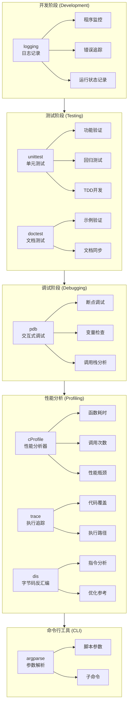
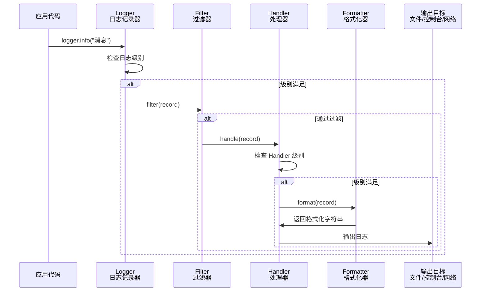
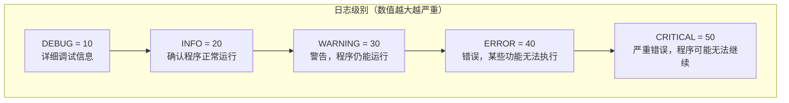
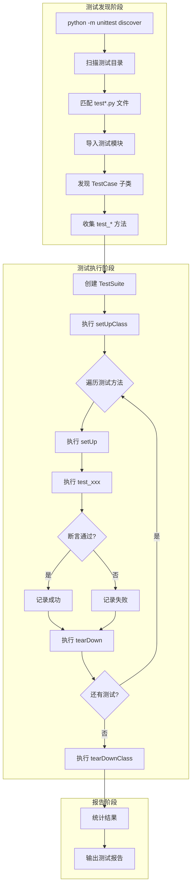
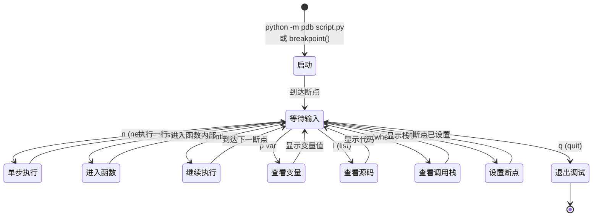
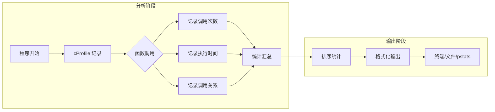

# 开发与调试工具：logging、unittest、pdb、cProfile、trace、dis

Python 提供了完整的开发与调试工具体系，从日志记录到单元测试，从交互式调试到性能分析，覆盖了软件开发生命周期的各个环节。掌握这些工具是成为高效 Python 开发者的必经之路。

## 一、是什么：Python 开发工具体系概览

### 1.1 工具全景图



### 1.2 核心工具速览

| 模块/工具 | 主要功能 | 典型 API/类 | 常见场景 |
| --- | --- | --- | --- |
| **`logging`** | 日志记录系统，支持多级别、多输出目标 | `Logger`, `Handler`, `Formatter`, `Filter` | 程序监控、错误追踪、审计日志 |
| **`unittest`** | 单元测试框架，支持测试用例、断言、固件 | `TestCase`, `TestSuite`, `mock` | 单元测试、集成测试、TDD |
| **`doctest`** | 文档测试，从文档字符串提取并执行测试 | `testmod()`, `testfile()` | 文档验证、示例代码测试 |
| **`pdb`** | Python 调试器，支持断点、单步执行 | `set_trace()`, `breakpoint()` | 交互式调试、错误定位 |
| **`cProfile`** | 确定性性能分析器，统计函数调用 | `Profile()`, `run()` | 性能瓶颈分析、优化指导 |
| **`profile`** | 纯 Python 性能分析器（较慢但可扩展） | `Profile()`, `run()` | 自定义分析、教学演示 |
| **`trace`** | 执行追踪，统计代码覆盖 | `Trace()`, `CoverageResults` | 代码覆盖率、执行路径分析 |
| **`dis`** | 字节码反汇编器 | `dis()`, `Instruction` | 底层优化、理解 Python 执行 |
| **`argparse`** | 命令行参数解析 | `ArgumentParser`, `add_argument()` | CLI 工具开发、脚本参数处理 |

---

## 二、为什么：工具价值与设计理念

### 2.1 为什么需要这些工具

```mermaid
graph LR
    subgraph 问题["开发中的问题"]
        P1[程序运行状态不可见]
        P2[代码正确性无法保证]
        P3[Bug 定位困难]
        P4[性能瓶颈不明]
        P5[底层行为不理解]
    end

    subgraph 解决方案["工具解决方案"]
        S1[logging<br/>让程序"说话"]
        S2[unittest<br/>自动化验证]
        S3[pdb<br/>交互式探查]
        S4[cProfile<br/>量化分析]
        S5[dis<br/>透视底层]
    end

    P1 --> S1
    P2 --> S2
    P3 --> S3
    P4 --> S4
    P5 --> S5
```

### 2.2 设计理念

| 工具 | 设计理念 | 核心价值 |
| --- | --- | --- |
| `logging` | **分级记录**：不同级别对应不同重要性 | 生产环境可配置，开发调试灵活 |
| `unittest` | **自动化验证**：测试即文档，回归即保障 | 重构有信心，协作有保障 |
| `pdb` | **交互式探查**：暂停执行，实时检查 | 理解程序行为，定位隐蔽 Bug |
| `cProfile` | **数据驱动优化**：用数据说话，而非猜测 | 避免过早优化，聚焦真正瓶颈 |
| `dis` | **底层透明**：理解 Python 虚拟机行为 | 写出更高效的代码 |

---

## 三、怎么做：logging 日志系统详解

### 3.1 logging 架构与流程



### 3.2 核心组件详解

| 组件 | 职责 | 常用类型 | 关键属性/方法 |
| --- | --- | --- | --- |
| **Logger** | 日志记录入口，提供记录接口 | `RootLogger`, 自定义 Logger | `name`, `level`, `handlers`, `debug()`, `info()`, `error()` |
| **Handler** | 定义日志输出目标 | `StreamHandler`, `FileHandler`, `RotatingFileHandler`, `TimedRotatingFileHandler`, `SMTPHandler`, `SysLogHandler` | `level`, `formatter`, `emit()` |
| **Formatter** | 定义日志输出格式 | `Formatter` | `fmt`, `datefmt`, `format()` |
| **Filter** | 细粒度过滤日志记录 | 自定义 `Filter` 子类 | `filter()` |

### 3.3 日志级别体系



### 3.4 完整可运行示例：生产级日志配置

```python
"""
生产级日志配置示例
演示：多 Handler、日志轮转、JSON 格式、自定义 Filter
"""
import logging
import logging.config
import json
from datetime import datetime
from pathlib import Path


# ============================================================
# 1. 自定义 JSON Formatter（结构化日志）
# ============================================================
class JsonFormatter(logging.Formatter):
    """
    将日志记录格式化为 JSON，便于日志聚合系统（ELK、Splunk）解析
    """
    def format(self, record: logging.LogRecord) -> str:
        """格式化日志记录为 JSON 字符串"""
        # 构建日志字典
        log_data = {
            "timestamp": datetime.fromtimestamp(record.created).isoformat(),
            "level": record.levelname,
            "logger": record.name,
            "message": record.getMessage(),
            "module": record.module,
            "function": record.funcName,
            "line": record.lineno,
        }

        # 添加异常信息（如果有）
        if record.exc_info:
            log_data["exception"] = self.formatException(record.exc_info)

        # 添加额外字段（通过 extra 参数传入）
        if hasattr(record, "user_id"):
            log_data["user_id"] = record.user_id
        if hasattr(record, "request_id"):
            log_data["request_id"] = record.request_id

        return json.dumps(log_data, ensure_ascii=False)


# ============================================================
# 2. 自定义 Filter（敏感信息过滤）
# ============================================================
class SensitiveDataFilter(logging.Filter):
    """
    过滤日志中的敏感信息（如密码、令牌）
    """
    SENSITIVE_WORDS = ["password", "passwd", "token", "secret", "api_key"]

    def filter(self, record: logging.LogRecord) -> bool:
        """过滤敏感信息，返回 True 表示保留该记录"""
        message = record.getMessage().lower()

        # 检查是否包含敏感词
        for word in self.SENSITIVE_WORDS:
            if word in message:
                # 替换敏感信息
                record.msg = record.msg.replace(word, "***REDACTED***")

        return True  # 保留所有记录，但已脱敏


# ============================================================
# 3. 字典配置（推荐方式）
# ============================================================
def get_logging_config(log_dir: str = "logs") -> dict:
    """
    生成日志配置字典
    参数:
        log_dir: 日志文件目录
    返回:
        配置字典，用于 logging.config.dictConfig()
    """
    Path(log_dir).mkdir(exist_ok=True)

    return {
        "version": 1,  # 配置格式版本，目前只有 1
        "disable_existing_loggers": False,  # 不禁用已存在的 logger

        # 日志格式定义
        "formatters": {
            # 控制台格式（人类可读）
            "console": {
                "format": "%(asctime)s | %(levelname)-8s | %(name)s | %(message)s",
                "datefmt": "%Y-%m-%d %H:%M:%S",
            },
            # 文件格式（详细）
            "file": {
                "format": "%(asctime)s | %(levelname)-8s | %(name)s | %(filename)s:%(lineno)d | %(message)s",
                "datefmt": "%Y-%m-%d %H:%M:%S",
            },
            # JSON 格式（机器可读）
            "json": {
                "()": JsonFormatter,  # 使用自定义 Formatter
            },
        },

        # 过滤器定义
        "filters": {
            "sensitive": {
                "()": SensitiveDataFilter,
            },
        },

        # 处理器定义
        "handlers": {
            # 控制台处理器
            "console": {
                "class": "logging.StreamHandler",
                "level": "INFO",
                "formatter": "console",
                "filters": ["sensitive"],
                "stream": "ext://sys.stdout",  # 输出到标准输出
            },
            # 文件处理器（带轮转）
            "file": {
                "class": "logging.handlers.RotatingFileHandler",
                "level": "DEBUG",
                "formatter": "file",
                "filename": f"{log_dir}/app.log",
                "maxBytes": 10 * 1024 * 1024,  # 10MB
                "backupCount": 5,  # 保留 5 个备份
                "encoding": "utf-8",
            },
            # 错误日志单独文件
            "error_file": {
                "class": "logging.handlers.RotatingFileHandler",
                "level": "ERROR",
                "formatter": "file",
                "filename": f"{log_dir}/error.log",
                "maxBytes": 10 * 1024 * 1024,
                "backupCount": 3,
                "encoding": "utf-8",
            },
            # JSON 格式日志（用于日志聚合）
            "json_file": {
                "class": "logging.handlers.TimedRotatingFileHandler",
                "level": "INFO",
                "formatter": "json",
                "filename": f"{log_dir}/app.json",
                "when": "midnight",  # 每天午夜轮转
                "backupCount": 7,
                "encoding": "utf-8",
            },
        },

        # Logger 定义
        "loggers": {
            # 应用主 Logger
            "myapp": {
                "level": "DEBUG",
                "handlers": ["console", "file", "error_file", "json_file"],
                "propagate": False,  # 不传播到父 logger
            },
            # 第三方库日志控制
            "urllib3": {
                "level": "WARNING",  # 只记录警告及以上
                "handlers": ["console"],
                "propagate": False,
            },
            "requests": {
                "level": "WARNING",
                "propagate": False,
            },
        },

        # Root Logger
        "root": {
            "level": "WARNING",
            "handlers": ["console"],
        },
    }


# ============================================================
# 4. 初始化日志
# ============================================================
def setup_logging(log_dir: str = "logs") -> logging.Logger:
    """
    初始化日志配置并返回应用 Logger
    参数:
        log_dir: 日志文件目录
    返回:
        配置好的 Logger 实例
    """
    config = get_logging_config(log_dir)
    logging.config.dictConfig(config)
    return logging.getLogger("myapp")


# ============================================================
# 5. 使用示例
# ============================================================
if __name__ == "__main__":
    # 初始化日志
    logger = setup_logging()

    # 基本日志记录
    logger.debug("这是调试信息，只在文件中可见")
    logger.info("应用启动成功")
    logger.warning("内存使用率较高: 85%")
    logger.error("数据库连接失败")

    # 带额外字段的日志（结构化日志）
    logger.info(
        "用户登录成功",
        extra={"user_id": 12345, "request_id": "req-abc-123"}
    )

    # 记录异常
    try:
        result = 1 / 0
    except ZeroDivisionError:
        logger.exception("计算出错")  # 自动记录异常堆栈

    # 敏感信息会被自动脱敏
    logger.info("用户 password=secret123 登录成功")

    print("\n日志已写入 logs/ 目录")
```

### 3.5 logging 最佳实践对比表

| 实践 | 推荐做法 | 反模式 | 原因 |
| --- | --- | --- | --- |
| **Logger 获取** | `logger = logging.getLogger(__name__)` | `logger = logging.getLogger("myapp")` 硬编码 | `__name__` 自动反映模块层次 |
| **库中配置** | 只获取 Logger，不配置 Handler | 在库中调用 `basicConfig()` | 让应用决定日志输出方式 |
| **异常记录** | `logger.exception("msg")` | `logger.error(str(e))` | `exception` 自动记录堆栈 |
| **敏感信息** | 使用 Filter 脱敏 | 直接记录密码、令牌 | 安全合规要求 |
| **生产级别** | INFO 或 WARNING | DEBUG | DEBUG 日志量大，影响性能 |
| **日志轮转** | `RotatingFileHandler` | `FileHandler` 无限增长 | 避免磁盘被日志占满 |
| **结构化日志** | JSON 格式 | 纯文本无结构 | 便于 ELK 等系统解析 |

---

## 四、怎么做：unittest 单元测试详解

### 4.1 unittest 执行流程



### 4.2 unittest vs pytest 对比表

| 特性 | unittest | pytest | 推荐 |
| --- | --- | --- | --- |
| **安装** | 标准库，无需安装 | `pip install pytest` | unittest（零依赖） |
| **断言语法** | `self.assertEqual(a, b)` | `assert a == b` | pytest（更直观） |
| **测试发现** | `python -m unittest discover` | `pytest` 自动发现 | pytest（更简洁） |
| **固件（Fixtures）** | `setUp/tearDown` | `@pytest.fixture` | pytest（更灵活） |
| **参数化测试** | 需 `@parameterized.expand` | 内置 `@pytest.mark.parametrize` | pytest |
| **跳过测试** | `@unittest.skip` | `@pytest.mark.skip` | 相当 |
| **Mock 支持** | `unittest.mock` | `pytest-mock` 插件 | 相当 |
| **插件生态** | 有限 | 丰富（cov、xdist、django 等） | pytest |
| **学习曲线** | 较低（类 JUnit） | 较低 | 相当 |
| **适合场景** | 标准库项目、企业限制 | 现代项目、追求效率 | 视情况 |

**结论**：新项目推荐 pytest，有第三方依赖限制的项目用 unittest。

### 4.3 完整可运行示例：测试驱动开发

```python
"""
TDD 示例：开发一个计算器模块
演示：TestCase、断言、固件、Mock、子测试、跳过测试
"""
import unittest
from unittest.mock import Mock, patch, MagicMock
from typing import List, Optional


# ============================================================
# 被测试的模块（计算器）
# ============================================================
class Calculator:
    """简单计算器类"""

    def __init__(self, precision: int = 2):
        """
        初始化计算器
        参数:
            precision: 结果保留小数位数
        """
        self.precision = precision
        self.history: List[str] = []  # 计算历史

    def add(self, a: float, b: float) -> float:
        """加法"""
        result = round(a + b, self.precision)
        self.history.append(f"{a} + {b} = {result}")
        return result

    def subtract(self, a: float, b: float) -> float:
        """减法"""
        result = round(a - b, self.precision)
        self.history.append(f"{a} - {b} = {result}")
        return result

    def multiply(self, a: float, b: float) -> float:
        """乘法"""
        result = round(a * b, self.precision)
        self.history.append(f"{a} * {b} = {result}")
        return result

    def divide(self, a: float, b: float) -> float:
        """除法"""
        if b == 0:
            raise ValueError("除数不能为零")
        result = round(a / b, self.precision)
        self.history.append(f"{a} / {b} = {result}")
        return result

    def clear_history(self) -> None:
        """清空历史记录"""
        self.history.clear()


# ============================================================
# 外部服务（用于演示 Mock）
# ============================================================
class ExternalService:
    """模拟外部服务（如 API 调用）"""

    def get_exchange_rate(self, from_currency: str, to_currency: str) -> float:
        """
        获取汇率（模拟网络请求）
        实际中会调用第三方 API
        """
        # 模拟网络延迟
        import time
        time.sleep(1)

        # 模拟返回汇率
        rates = {"USD_CNY": 7.2, "EUR_CNY": 7.8, "GBP_CNY": 9.0}
        key = f"{from_currency}_{to_currency}"
        if key in rates:
            return rates[key]
        raise ValueError(f"不支持的货币对: {key}")


class CurrencyConverter:
    """货币转换器（依赖外部服务）"""

    def __init__(self, service: ExternalService):
        self.service = service

    def convert(self, amount: float, from_currency: str, to_currency: str) -> float:
        """货币转换"""
        rate = self.service.get_exchange_rate(from_currency, to_currency)
        return round(amount * rate, 2)


# ============================================================
# 测试类
# ============================================================
class TestCalculator(unittest.TestCase):
    """Calculator 类的单元测试"""

    # --------------------------------------------------------
    # 类级别固件（所有测试方法共享）
    # --------------------------------------------------------
    @classmethod
    def setUpClass(cls):
        """在所有测试方法执行前运行一次"""
        print("\n=== 开始测试 Calculator ===")
        cls.shared_data = {"test_run": True}

    @classmethod
    def tearDownClass(cls):
        """在所有测试方法执行后运行一次"""
        print("\n=== Calculator 测试完成 ===")

    # --------------------------------------------------------
    # 方法级别固件（每个测试方法独立）
    # --------------------------------------------------------
    def setUp(self):
        """在每个测试方法执行前运行"""
        self.calc = Calculator(precision=2)  # 创建新的计算器实例

    def tearDown(self):
        """在每个测试方法执行后运行"""
        self.calc.clear_history()  # 清理资源

    # --------------------------------------------------------
    # 基本测试
    # --------------------------------------------------------
    def test_add(self):
        """测试加法"""
        result = self.calc.add(2, 3)
        self.assertEqual(result, 5)  # 基本断言

        # 测试浮点数
        result = self.calc.add(0.1, 0.2)
        self.assertAlmostEqual(result, 0.3, places=2)  # 浮点数近似比较

    def test_subtract(self):
        """测试减法"""
        self.assertEqual(self.calc.subtract(5, 3), 2)
        self.assertEqual(self.calc.subtract(3, 5), -2)

    def test_multiply(self):
        """测试乘法"""
        self.assertEqual(self.calc.multiply(3, 4), 12)
        self.assertEqual(self.calc.multiply(-2, 3), -6)

    def test_divide(self):
        """测试除法"""
        self.assertEqual(self.calc.divide(10, 2), 5)
        self.assertAlmostEqual(self.calc.divide(10, 3), 3.33, places=2)

    # --------------------------------------------------------
    # 异常测试
    # --------------------------------------------------------
    def test_divide_by_zero(self):
        """测试除以零抛出异常"""
        # 方法 1: 使用上下文管理器（推荐）
        with self.assertRaises(ValueError) as context:
            self.calc.divide(10, 0)

        # 验证异常消息
        self.assertEqual(str(context.exception), "除数不能为零")

        # 方法 2: 使用 assertRaises 方法
        # self.assertRaises(ValueError, self.calc.divide, 10, 0)

    # --------------------------------------------------------
    # 子测试（参数化测试）
    # --------------------------------------------------------
    def test_add_multiple_cases(self):
        """使用子测试测试多组数据"""
        test_cases = [
            (1, 2, 3),
            (0, 0, 0),
            (-1, 1, 0),
            (0.1, 0.2, 0.3),
            (100, 200, 300),
        ]

        for a, b, expected in test_cases:
            with self.subTest(a=a, b=b, expected=expected):
                result = self.calc.add(a, b)
                self.assertAlmostEqual(result, expected, places=2)

    # --------------------------------------------------------
    # 历史记录测试
    # --------------------------------------------------------
    def test_history(self):
        """测试历史记录功能"""
        self.calc.add(1, 2)
        self.calc.multiply(3, 4)

        self.assertEqual(len(self.calc.history), 2)
        self.assertIn("1 + 2 = 3", self.calc.history)
        self.assertIn("3 * 4 = 12", self.calc.history)

    # --------------------------------------------------------
    # 跳过测试
    # --------------------------------------------------------
    @unittest.skip("演示跳过功能")
    def test_skip_example(self):
        """这个测试会被跳过"""
        self.fail("不应该执行")

    @unittest.skipIf(True, "条件为 True 时跳过")
    def test_skip_if_example(self):
        """条件跳过"""
        pass

    @unittest.expectedFailure
    def test_expected_failure(self):
        """预期失败的测试（标记为预期失败，实际失败不算错误）"""
        self.assertEqual(1, 2)  # 这个断言会失败，但测试结果标记为 expected failure


# ============================================================
# Mock 测试
# ============================================================
class TestCurrencyConverter(unittest.TestCase):
    """货币转换器测试（演示 Mock）"""

    def test_convert_with_mock(self):
        """使用 Mock 模拟外部服务"""
        # 创建 Mock 对象
        mock_service = Mock()
        mock_service.get_exchange_rate.return_value = 7.2  # 设置返回值

        # 创建被测对象，注入 Mock
        converter = CurrencyConverter(mock_service)

        # 执行测试
        result = converter.convert(100, "USD", "CNY")

        # 验证结果
        self.assertEqual(result, 720)

        # 验证 Mock 方法被正确调用
        mock_service.get_exchange_rate.assert_called_once_with("USD", "CNY")

    def test_convert_with_side_effect(self):
        """使用 side_effect 模拟不同返回值"""
        mock_service = Mock()
        # 设置多次调用的不同返回值
        mock_service.get_exchange_rate.side_effect = [7.2, 7.8, 9.0]

        converter = CurrencyConverter(mock_service)

        self.assertEqual(converter.convert(100, "USD", "CNY"), 720)
        self.assertEqual(converter.convert(100, "EUR", "CNY"), 780)
        self.assertEqual(converter.convert(100, "GBP", "CNY"), 900)

    @patch.object(ExternalService, 'get_exchange_rate')
    def test_convert_with_patch(self, mock_get_rate):
        """使用 patch 装饰器替换方法"""
        mock_get_rate.return_value = 7.2

        service = ExternalService()
        converter = CurrencyConverter(service)

        result = converter.convert(100, "USD", "CNY")
        self.assertEqual(result, 720)

    def test_convert_exception(self):
        """测试异常情况"""
        mock_service = Mock()
        mock_service.get_exchange_rate.side_effect = ValueError("不支持的货币对")

        converter = CurrencyConverter(mock_service)

        with self.assertRaises(ValueError):
            converter.convert(100, "XXX", "YYY")


# ============================================================
# 运行测试
# ============================================================
if __name__ == "__main__":
    # 方式 1: 直接运行（默认）
    # unittest.main()

    # 方式 2: 自定义运行器（更详细的输出）
    loader = unittest.TestLoader()
    suite = unittest.TestSuite()

    # 添加测试类
    suite.addTests(loader.loadTestsFromTestCase(TestCalculator))
    suite.addTests(loader.loadTestsFromTestCase(TestCurrencyConverter))

    # 运行测试
    runner = unittest.TextTestRunner(verbosity=2)
    result = runner.run(suite)

    # 输出摘要
    print(f"\n测试摘要:")
    print(f"  运行: {result.testsRun}")
    print(f"  成功: {result.testsRun - len(result.failures) - len(result.errors)}")
    print(f"  失败: {len(result.failures)}")
    print(f"  错误: {len(result.errors)}")
    print(f"  跳过: {len(result.skipped)}")
```

### 4.4 测试覆盖率配置

```ini
# .coveragerc 配置文件
[run]
source = .
omit =
    */tests/*
    */venv/*
    */__pycache__/*
    */migrations/*

[report]
show_missing = True
skip_covered = True
exclude_lines =
    pragma: no cover
    if __name__ == .__main__.:
    raise NotImplementedError

[html]
directory = htmlcov
```

---

## 五、怎么做：pdb 交互式调试详解

### 5.1 pdb 调试流程状态图



### 5.2 pdb 常用命令速查表

| 命令 | 简写 | 说明 | 示例 |
| --- | --- | --- | --- |
| **导航命令** ||||
| `next` | `n` | 执行下一行（不进入函数） | `(Pdb) n` |
| `step` | `s` | 执行下一行（进入函数内部） | `(Pdb) s` |
| `continue` | `c` | 继续执行直到下一个断点 | `(Pdb) c` |
| `return` | `r` | 执行直到当前函数返回 | `(Pdb) r` |
| `until` | `unt` | 执行直到指定行 | `(Pdb) until 20` |
| **断点命令** ||||
| `break` | `b` | 设置断点 | `b 10`（第10行）<br/>`b func_name`（函数入口）<br/>`b 10, x > 5`（条件断点） |
| `clear` | `cl` | 清除断点 | `cl 1`（清除1号断点） |
| `disable` | | 禁用断点 | `disable 1` |
| `enable` | | 启用断点 | `enable 1` |
| **查看命令** ||||
| `list` | `l` | 显示源代码 | `l`（当前位置）<br/>`l 10, 20`（10-20行） |
| `print` | `p` | 打印表达式值 | `p x`<br/>`p x + y` |
| `pp` | | 美化打印 | `pp my_dict` |
| `args` | `a` | 显示当前函数参数 | `a` |
| `locals` | | 显示局部变量 | `locals` |
| `globals` | | 显示全局变量 | `globals` |
| `where` | `w` | 显示调用栈 | `w` |
| `up` | `u` | 向上移动调用栈 | `u` |
| `down` | `d` | 向下移动调用栈 | `d` |
| **其他命令** ||||
| `help` | `h` | 显示帮助 | `h`<br/>`h break` |
| `quit` | `q` | 退出调试器 | `q` |
| `!` | | 执行 Python 语句 | `!x = 10` |
| `alias` | | 定义别名 | `alias pl p locals()` |

### 5.3 完整可运行示例：pdb 调试实战

```python
"""
pdb 调试实战示例
演示：断点设置、变量检查、调用栈分析、条件断点
"""
import pdb


def calculate_discount(price: float, customer_level: str) -> float:
    """
    计算折扣价格
    参数:
        price: 原价
        customer_level: 客户等级（普通、银卡、金卡、钻石）
    返回:
        折扣后价格
    """
    # 折扣率映射
    discount_rates = {
        "普通": 1.0,    # 无折扣
        "银卡": 0.95,   # 5% 折扣
        "金卡": 0.9,    # 10% 折扣
        "钻石": 0.8,    # 20% 折扣
    }

    # 获取折扣率
    rate = discount_rates.get(customer_level, 1.0)

    # 计算折扣价格
    discounted_price = price * rate

    return discounted_price


def process_order(order_id: str, items: list, customer_level: str) -> dict:
    """
    处理订单
    参数:
        order_id: 订单ID
        items: 商品列表 [{"name": "商品名", "price": 价格}, ...]
        customer_level: 客户等级
    返回:
        订单详情字典
    """
    total = 0.0

    # 计算商品总价
    for item in items:
        price = item.get("price", 0)
        quantity = item.get("quantity", 1)
        total += price * quantity

    # 应用折扣
    final_price = calculate_discount(total, customer_level)

    # 构建订单结果
    order = {
        "order_id": order_id,
        "items": items,
        "subtotal": total,
        "customer_level": customer_level,
        "final_price": final_price,
        "discount_amount": total - final_price,
    }

    return order


def main():
    """主函数"""
    # 模拟订单数据
    orders = [
        {
            "order_id": "ORD-001",
            "items": [
                {"name": "Python 书籍", "price": 89.0, "quantity": 2},
                {"name": "键盘", "price": 299.0, "quantity": 1},
            ],
            "customer_level": "金卡",
        },
        {
            "order_id": "ORD-002",
            "items": [
                {"name": "鼠标", "price": 99.0, "quantity": 3},
            ],
            "customer_level": "钻石",
        },
    ]

    # 处理订单
    for order_data in orders:
        # --------------------------------------------------------
        # 方式 1: 使用 pdb.set_trace() 设置断点
        # --------------------------------------------------------
        # pdb.set_trace()

        # --------------------------------------------------------
        # 方式 2: 使用 breakpoint()（Python 3.7+ 推荐）
        # --------------------------------------------------------
        breakpoint()  # 程序会在这里暂停

        result = process_order(
            order_data["order_id"],
            order_data["items"],
            order_data["customer_level"]
        )

        print(f"\n订单处理结果:")
        print(f"  订单号: {result['order_id']}")
        print(f"  小计: ¥{result['subtotal']:.2f}")
        print(f"  客户等级: {result['customer_level']}")
        print(f"  折扣金额: ¥{result['discount_amount']:.2f}")
        print(f"  最终价格: ¥{result['final_price']:.2f}")


if __name__ == "__main__":
    # --------------------------------------------------------
    # 调试技巧说明
    # --------------------------------------------------------
    """
    运行方式:
    1. 直接运行（遇到 breakpoint() 暂停）:
       python debug_example.py

    2. 从命令行启动 pdb:
       python -m pdb debug_example.py

    3. 异常后调试（Post-mortem）:
       python -m pdb -c continue debug_example.py

    常用调试流程:
    1. 到达断点后，输入 'l' 查看当前代码
    2. 输入 'p order_data' 查看变量
    3. 输入 's' 进入 process_order 函数
    4. 输入 'n' 逐行执行
    5. 输入 'w' 查看调用栈
    6. 输入 'c' 继续执行到下一个断点

    条件断点示例:
    (Pdb) b 45, customer_level == "钻石"
    # 只在客户等级为钻石时中断

    修改变量（调试时）:
    (Pdb) !customer_level = "钻石"
    # 临时修改变量值测试不同场景
    """
    main()
```

### 5.4 pdb vs IDE 调试对比

| 特性 | pdb | IDE 调试（VS Code/PyCharm） |
| --- | --- | --- |
| **环境要求** | 终端即可 | 需要安装 IDE |
| **图形界面** | 无 | 有（可视化断点、变量） |
| **远程调试** | 支持（telnet/rpdb） | 支持（debugpy） |
| **条件断点** | 支持 | 支持（图形化设置） |
| **变量监视** | 手动 `p var` | 自动显示变量面板 |
| **调用栈** | `w` 命令 | 可视化栈帧 |
| **多线程调试** | 有限支持 | 较好支持 |
| **适用场景** | 服务器、CI/CD、无 GUI 环境 | 本地开发、复杂调试 |

---

## 六、怎么做：cProfile 性能分析详解

### 6.1 cProfile 工作原理



### 6.2 cProfile 核心指标

| 指标 | 含义 | 说明 |
| --- | --- | --- |
| `ncalls` | 调用次数 | 函数被调用的总次数 |
| `tottime` | 总执行时间 | 函数自身执行时间（不含子调用） |
| `percall` | 平均执行时间 | `tottime / ncalls` |
| `cumtime` | 累计执行时间 | 函数及其所有子调用的总时间 |
| `filename:lineno` | 函数位置 | 函数定义的文件和行号 |

### 6.3 完整可运行示例：性能分析与优化

```python
"""
cProfile 性能分析示例
演示：识别性能瓶颈、优化前后对比、pstats 分析
"""
import cProfile
import pstats
from io import StringIO
from functools import lru_cache
import time


# ============================================================
# 示例 1: 低效的斐波那契数列（递归无缓存）
# ============================================================
def fib_slow(n: int) -> int:
    """
    低效的斐波那契数列实现
    时间复杂度: O(2^n)
    """
    if n <= 1:
        return n
    return fib_slow(n - 1) + fib_slow(n - 2)


# ============================================================
# 示例 2: 高效的斐波那契数列（使用缓存）
# ============================================================
@lru_cache(maxsize=None)
def fib_fast(n: int) -> int:
    """
    高效的斐波那契数列实现（使用 LRU 缓存）
    时间复杂度: O(n)
    """
    if n <= 1:
        return n
    return fib_fast(n - 1) + fib_fast(n - 2)


# ============================================================
# 示例 3: 低效的列表操作
# ============================================================
def find_duplicates_slow(data: list) -> list:
    """
    低效的重复元素查找
    时间复杂度: O(n^2)
    """
    duplicates = []
    for i, item in enumerate(data):
        if item in data[i + 1:] and item not in duplicates:
            duplicates.append(item)
    return duplicates


# ============================================================
# 示例 4: 高效的列表操作
# ============================================================
def find_duplicates_fast(data: list) -> list:
    """
    高效的重复元素查找（使用集合）
    时间复杂度: O(n)
    """
    seen = set()
    duplicates = set()
    for item in data:
        if item in seen:
            duplicates.add(item)
        else:
            seen.add(item)
    return list(duplicates)


# ============================================================
# 示例 5: 模拟 I/O 密集型操作
# ============================================================
def simulate_io_operation(delay: float = 0.001) -> None:
    """模拟 I/O 操作（如网络请求、文件读写）"""
    time.sleep(delay)


def process_with_io(data: list) -> list:
    """处理数据并模拟 I/O"""
    results = []
    for item in data:
        simulate_io_operation()  # 模拟 I/O
        results.append(item * 2)
    return results


# ============================================================
# 性能分析函数
# ============================================================
def profile_fibonacci():
    """分析斐波那契数列性能"""
    print("\n" + "=" * 60)
    print("斐波那契数列性能分析")
    print("=" * 60)

    n = 30

    # 分析低效版本
    print(f"\n计算 fib_slow({n}):")
    profiler = cProfile.Profile()
    profiler.enable()
    result_slow = fib_slow(n)
    profiler.disable()

    print(f"结果: {result_slow}")
    stats = pstats.Stats(profiler)
    stats.sort_stats('cumtime')
    stats.print_stats(10)  # 打印前 10 个最耗时的函数

    # 分析高效版本
    print(f"\n计算 fib_fast({n}):")
    profiler = cProfile.Profile()
    profiler.enable()
    result_fast = fib_fast(n)
    profiler.disable()

    print(f"结果: {result_fast}")
    stats = pstats.Stats(profiler)
    stats.sort_stats('cumtime')
    stats.print_stats(10)


def profile_duplicate_finding():
    """分析重复元素查找性能"""
    print("\n" + "=" * 60)
    print("重复元素查找性能分析")
    print("=" * 60)

    # 生成测试数据
    import random
    data = [random.randint(1, 1000) for _ in range(5000)]

    # 分析低效版本
    print("\n使用 find_duplicates_slow:")
    profiler = cProfile.Profile()
    profiler.enable()
    result_slow = find_duplicates_slow(data)
    profiler.disable()

    print(f"找到 {len(result_slow)} 个重复元素")
    stats = pstats.Stats(profiler)
    stats.sort_stats('cumtime')
    stats.print_stats(5)

    # 分析高效版本
    print("\n使用 find_duplicates_fast:")
    profiler = cProfile.Profile()
    profiler.enable()
    result_fast = find_duplicates_fast(data)
    profiler.disable()

    print(f"找到 {len(result_fast)} 个重复元素")
    stats = pstats.Stats(profiler)
    stats.sort_stats('cumtime')
    stats.print_stats(5)


def profile_with_stringio():
    """使用 StringIO 捕获分析结果"""
    print("\n" + "=" * 60)
    print("使用 StringIO 捕获分析结果")
    print("=" * 60)

    # 创建分析器
    profiler = cProfile.Profile()

    # 分析
    profiler.enable()
    data = list(range(1000))
    result = find_duplicates_fast(data)
    profiler.disable()

    # 捕获输出到字符串
    s = StringIO()
    stats = pstats.Stats(profiler, stream=s)
    stats.sort_stats('cumtime')
    stats.print_stats()

    # 打印结果
    output = s.getvalue()
    print(output[:500])  # 只打印前 500 字符
    print("...")


def profile_to_file():
    """将分析结果保存到文件"""
    print("\n" + "=" * 60)
    print("将分析结果保存到文件")
    print("=" * 60)

    # 分析并保存
    cProfile.run(
        'fib_fast(100)',
        filename='fib_profile.prof',
        sort='cumtime'
    )

    # 从文件加载并分析
    stats = pstats.Stats('fib_profile.prof')
    print("\n按累计时间排序:")
    stats.sort_stats('cumtime').print_stats(5)

    print("\n按调用次数排序:")
    stats.sort_stats('ncalls').print_stats(5)

    print("\n分析结果已保存到 fib_profile.prof")


# ============================================================
# 命令行使用示例
# ============================================================
"""
命令行使用 cProfile:

1. 基本用法:
   python -m cProfile script.py

2. 按累计时间排序:
   python -m cProfile -s cumtime script.py

3. 保存到文件:
   python -m cProfile -o output.prof script.py

4. 分析保存的文件:
   python -c "import pstats; p = pstats.Stats('output.prof'); p.sort_stats('cumtime').print_stats(20)"

5. 只看特定函数:
   python -c "import pstats; p = pstats.Stats('output.prof'); p.print_stats('fib')"
"""


# ============================================================
# 主函数
# ============================================================
if __name__ == "__main__":
    # 运行各种分析
    profile_fibonacci()
    profile_duplicate_finding()
    profile_with_stringio()
    profile_to_file()
```

---

## 七、怎么做：trace 执行追踪与 dis 字节码分析

### 7.1 trace 模块：代码覆盖率与执行追踪

```python
"""
trace 模块示例
演示：代码覆盖率统计、执行路径追踪
"""
import trace
import sys
from pathlib import Path


# ============================================================
# 被追踪的函数
# ============================================================
def calculate_grade(score: float) -> str:
    """
    根据分数计算等级
    参数:
        score: 分数（0-100）
    返回:
        等级字符串
    """
    if score >= 90:
        return "A"
    elif score >= 80:
        return "B"
    elif score >= 70:
        return "C"
    elif score >= 60:
        return "D"
    else:
        return "F"


def process_scores(scores: list) -> dict:
    """
    处理分数列表
    参数:
        scores: 分数列表
    返回:
        统计结果字典
    """
    result = {
        "total": len(scores),
        "grades": {},
        "average": 0,
    }

    grade_counts = {"A": 0, "B": 0, "C": 0, "D": 0, "F": 0}

    for score in scores:
        grade = calculate_grade(score)
        grade_counts[grade] += 1

    result["grades"] = grade_counts
    result["average"] = sum(scores) / len(scores) if scores else 0

    return result


# ============================================================
# 使用 trace 模块
# ============================================================
def run_with_trace():
    """使用 trace 模块追踪代码执行"""
    print("=" * 60)
    print("trace 模块：代码覆盖率分析")
    print("=" * 60)

    # 创建 Trace 对象
    tracer = trace.Trace(
        count=True,           # 统计行执行次数
        trace=False,          # 不显示每行执行（设为 True 可显示）
        ignoremods=[],        # 不忽略任何模块
        ignoredirs=[sys.prefix, sys.exec_prefix],  # 忽略标准库
    )

    # 运行代码并收集追踪数据
    test_scores = [95, 82, 78, 65, 45, 88, 72, 91, 55, 68]
    tracer.runfunc(process_scores, test_scores)

    # 生成覆盖率报告
    results = tracer.results()

    print("\n覆盖率报告:")
    results.write_results(show_missing=True, coverdir="coverage_report")

    print("\n覆盖率报告已生成到 coverage_report/ 目录")


# ============================================================
# 命令行使用 trace
# ============================================================
"""
命令行使用 trace 模块:

1. 追踪脚本执行:
   python -m trace --trace script.py

2. 统计代码覆盖率:
   python -m trace --count script.py

3. 生成覆盖率报告:
   python -m trace --count --coverdir=coverage script.py

4. 只统计特定模块:
   python -m trace --count --ignore-module=sys,os script.py

5. 列出未执行的行:
   python -m trace --count --missing script.py
"""


if __name__ == "__main__":
    run_with_trace()
```

### 7.2 dis 模块：字节码反汇编

```python
"""
dis 模块示例
演示：查看 Python 字节码、理解底层执行
"""
import dis
from types import CodeType


# ============================================================
# 示例函数
# ============================================================
def simple_function(a, b):
    """简单函数：加法"""
    return a + b


def loop_function(n):
    """循环函数"""
    result = 0
    for i in range(n):
        result += i
    return result


def comprehension_function(data):
    """列表推导式"""
    return [x * 2 for x in data if x > 0]


# ============================================================
# 反汇编示例
# ============================================================
def demonstrate_dis():
    """演示 dis 模块功能"""
    print("=" * 60)
    print("dis 模块：字节码反汇编")
    print("=" * 60)

    # 1. 反汇编简单函数
    print("\n1. simple_function 字节码:")
    print("-" * 40)
    dis.dis(simple_function)

    # 2. 反汇编循环函数
    print("\n2. loop_function 字节码:")
    print("-" * 40)
    dis.dis(loop_function)

    # 3. 反汇编列表推导式
    print("\n3. comprehension_function 字节码:")
    print("-" * 40)
    dis.dis(comprehension_function)

    # 4. 反汇编代码对象
    print("\n4. 获取详细字节码信息:")
    print("-" * 40)
    code = simple_function.__code__
    print(f"函数名: {code.co_name}")
    print(f"参数数量: {code.co_argcount}")
    print(f"局部变量: {code.co_varnames}")
    print(f"常量: {code.co_consts}")
    print(f"字节码指令数: {len(code.co_code)}")

    # 5. 使用 dis.get_instructions() 获取指令列表
    print("\n5. 字节码指令列表:")
    print("-" * 40)
    for instr in dis.get_instructions(simple_function):
        print(f"  {instr.offset:3d} | {instr.opname:20s} | {instr.argrepr}")


# ============================================================
# 常见字节码指令说明
# ============================================================
"""
常见字节码指令（CPython 3.11+，旧版指令名如 BINARY_ADD/CALL_FUNCTION
已分别被 BINARY_OP/CALL 取代）:

LOAD_FAST    : 加载局部变量
LOAD_CONST   : 加载常量
LOAD_GLOBAL  : 加载全局变量
STORE_FAST   : 存储到局部变量
BINARY_OP    : 二元运算（加/减/乘等，通过操作数区分，3.11+ 取代 BINARY_ADD 等）
COMPARE_OP   : 比较操作
POP_JUMP_IF_FALSE : 条件跳转（假则跳转）
JUMP_FORWARD : 无条件向前跳转
CALL         : 函数调用（3.11+ 取代 CALL_FUNCTION）
RETURN_VALUE : 返回值
GET_ITER     : 获取迭代器
FOR_ITER     : 迭代循环
BUILD_LIST   : 构建列表
LIST_APPEND  : 列表追加
"""


# ============================================================
# 优化示例：通过字节码理解性能差异
# ============================================================
def demonstrate_optimization():
    """演示字节码层面的优化"""
    print("\n" + "=" * 60)
    print("字节码层面的优化对比")
    print("=" * 60)

    # 低效写法
    def slow_append(n):
        result = []
        for i in range(n):
            result = result + [i]  # 每次创建新列表
        return result

    # 高效写法
    def fast_append(n):
        result = []
        for i in range(n):
            result.append(i)  # 原地追加
        return result

    # 列表推导式
    def list_comprehension(n):
        return [i for i in range(n)]

    print("\nslow_append 字节码:")
    dis.dis(slow_append)

    print("\nfast_append 字节码:")
    dis.dis(fast_append)

    print("\nlist_comprehension 字节码:")
    dis.dis(list_comprehension)

    print("\n分析:")
    print("- slow_append: 每次循环都用 BINARY_OP(+) 创建新列表并拷贝，开销大")
    print("- fast_append: 使用 LIST_APPEND，原地操作，效率高")
    print("- list_comprehension: 推导式内联优化（3.12+）配合 LIST_APPEND，最优实现")


if __name__ == "__main__":
    demonstrate_dis()
    demonstrate_optimization()
```

---

## 八、常见陷阱与 FAQ

### 8.1 logging 常见陷阱

| 陷阱 | 问题表现 | 解决方案 |
| --- | --- | --- |
| **重复日志** | 同一条日志输出多次 | 检查是否多次添加 Handler，或 `propagate=True` 导致传播 |
| **日志不输出** | DEBUG 日志不显示 | 检查 Logger 和 Handler 的级别设置 |
| **中文乱码** | 日志文件中文乱码 | 设置 `FileHandler(encoding='utf-8')` |
| **日志丢失** | 程序崩溃时日志丢失 | 使用 `SysLogHandler` 或定期 flush |
| **性能问题** | 大量日志影响性能 | 生产环境使用 INFO 级别，避免 DEBUG |

### 8.2 unittest 常见陷阱

| 陷阱 | 问题表现 | 解决方案 |
| --- | --- | --- |
| **测试顺序依赖** | 测试单独运行通过，一起运行失败 | 确保 `setUp/tearDown` 正确清理状态 |
| **Mock 不生效** | Mock 后仍调用真实方法 | 检查 patch 路径是否正确（在被测模块 patch） |
| **资源泄漏** | 测试后资源未释放 | 在 `tearDown` 中确保资源释放 |
| **断言错误** | 浮点数比较失败 | 使用 `assertAlmostEqual` |
| **跳过测试未发现** | 跳过的测试被忽略 | 定期检查 `@skip` 装饰器是否仍需要 |

### 8.3 pdb 常见陷阱

| 陷阱 | 问题表现 | 解决方案 |
| --- | --- | --- |
| **忘记删除断点** | 生产代码中有 `breakpoint()` | 使用 IDE 调试或代码审查 |
| **多线程调试困难** | 线程切换混乱 | 使用 `thread` 命令切换线程 |
| **变量修改不生效** | `!x = 10` 后变量未变 | 确认当前栈帧是否正确 |
| **无法进入 C 扩展** | `s` 无法进入 C 函数 | C 扩展无法用 pdb 调试，需用 gdb |

### 8.4 FAQ

**Q1: 如何选择日志级别？**

| 场景 | 推荐级别 | 说明 |
| --- | --- | --- |
| 开发调试 | DEBUG | 详细信息，仅开发时使用 |
| 重要业务事件 | INFO | 用户登录、订单创建等 |
| 可恢复的异常 | WARNING | 配置缺失但有默认值 |
| 功能性错误 | ERROR | API 调用失败、数据处理错误 |
| 致命错误 | CRITICAL | 数据库连接断开、服务不可用 |

**Q2: 测试覆盖率多少合适？**

- **80%+**：一般项目的合理目标
- **90%+**：核心模块、金融/医疗等关键系统
- **100%**：不现实且不经济，关注关键路径

**Q3: pdb vs IDE 调试如何选择？**

| 场景 | 推荐 |
| --- | --- |
| 本地开发、复杂调试 | IDE 调试（可视化、方便） |
| 服务器、CI/CD 环境 | pdb（无需 GUI） |
| 远程调试 | debugpy（VS Code）或 rpdb |
| 快速定位问题 | pdb（无需配置） |

**Q4: cProfile 和 profile 有什么区别？**

| 特性 | cProfile | profile |
| --- | --- | --- |
| 实现 | C 扩展 | 纯 Python |
| 性能开销 | 低（约 5-10%） | 高（约 50%+） |
| 可扩展性 | 有限 | 高（可自定义） |
| 推荐场景 | 生产环境、常规分析 | 教学、自定义分析 |

---

## 术语表

| 术语 | 英文 | 定义 |
| --- | --- | --- |
| **Logger** | Logger | 日志记录器，应用程序代码的入口点 |
| **Handler** | Handler | 日志处理器，定义日志输出目标 |
| **Formatter** | Formatter | 日志格式化器，定义日志输出格式 |
| **Filter** | Filter | 日志过滤器，细粒度控制日志输出 |
| **日志级别** | Log Level | 日志重要性分级（DEBUG/INFO/WARNING/ERROR/CRITICAL） |
| **日志轮转** | Log Rotation | 自动分割和归档日志文件 |
| **结构化日志** | Structured Logging | 机器可解析的日志格式（如 JSON） |
| **TestCase** | Test Case | 单元测试用例，包含测试方法 |
| **TestSuite** | Test Suite | 测试套件，多个测试用例的集合 |
| **固件** | Fixture | 测试前后准备和清理的环境 |
| **断言** | Assertion | 验证测试预期结果的语句 |
| **Mock** | Mock | 模拟对象，用于隔离测试 |
| **测试覆盖率** | Test Coverage | 测试代码覆盖生产代码的比例 |
| **TDD** | Test-Driven Development | 测试驱动开发，先写测试再写代码 |
| **断点** | Breakpoint | 程序暂停执行的位置 |
| **单步执行** | Step Execution | 逐行执行代码 |
| **调用栈** | Call Stack | 函数调用的层次结构 |
| **Post-mortem** | Post-mortem Debugging | 异常后调试 |
| **性能分析** | Profiling | 分析程序性能特征 |
| **字节码** | Bytecode | Python 虚拟机执行的中间代码 |
| **热点** | Hotspot | 程序中执行频繁的代码区域 |

---

## 延伸阅读

### 10.1 官方文档

- [logging — Logging facility for Python](https://docs.python.org/3/library/logging.html)
- [unittest — Unit testing framework](https://docs.python.org/3/library/unittest.html)
- [pdb — The Python Debugger](https://docs.python.org/3/library/pdb.html)
- [cProfile — Deterministic Profiling](https://docs.python.org/3/library/profile.html)
- [trace — Trace or track Python statement execution](https://docs.python.org/3/library/trace.html)
- [dis — Disassembler for Python bytecode](https://docs.python.org/3/library/dis.html)

### 10.2 推荐书籍

- **《Python Testing with pytest》** - Brian Okken，pytest 权威指南
- **《Python Debugging Handbook》** - 调试技巧大全
- **《High Performance Python》** - 性能优化深入分析

### 10.3 第三方工具

| 工具 | 用途 | 说明 |
| --- | --- | --- |
| **pytest** | 测试框架 | 比 unittest 更简洁强大 |
| **pytest-cov** | 覆盖率插件 | 与 pytest 无缝集成 |
| **ipdb** | 增强调试器 | IPython 界面，支持补全和高亮 |
| **debugpy** | 远程调试 | VS Code 官方 Python 调试器 |
| **structlog** | 结构化日志 | 更现代的日志库 |
| **loguru** | 简化日志 | 开箱即用的日志库 |
| **py-spy** | 采样分析 | 无需修改代码的性能分析 |
| **memory_profiler** | 内存分析 | 分析内存使用情况 |
| **snakeviz** | 可视化分析 | cProfile 结果可视化 |

### 10.4 在线资源

- [Real Python - Python Logging](https://realpython.com/python-logging/)
- [Real Python - Python Debugging](https://realpython.com/python-debugging-pdb/)
- [Python Speed - Performance Tips](https://wiki.python.org/moin/PythonSpeed)

---

## 十一、总结

本文系统介绍了 Python 开发与调试工具体系：

| 工具 | 核心价值 | 关键要点 |
| --- | --- | --- |
| **logging** | 让程序运行状态可见 | 分级记录、多 Handler、结构化日志 |
| **unittest** | 自动化验证代码正确性 | TestCase、断言、Mock、覆盖率 |
| **pdb** | 交互式定位问题 | 断点、单步执行、调用栈分析 |
| **cProfile** | 数据驱动性能优化 | 识别热点、量化分析 |
| **trace** | 代码覆盖率分析 | 执行路径追踪 |
| **dis** | 理解底层执行机制 | 字节码分析、优化参考 |

**最佳实践建议**：

1. **日志先行**：项目初期就建立完善的日志体系
2. **测试驱动**：关键功能必须有测试覆盖
3. **调试有方**：善用断点和调用栈，而非大量 print
4. **性能量化**：用 cProfile 数据指导优化，避免过早优化
5. **持续改进**：定期检查测试覆盖率，优化日志配置

掌握这些工具，将显著提升开发效率和代码质量。

## 版本差异（标准库 → Python 3.14）

| 模块/特性 | 本文编写时 | Python 3.14 变化 |
|-----------|-----------|------------------|
| `datetime` | `utcnow()` / `utcfromtimestamp()` | 3.12 起弃用，改用 `datetime.now(tz=datetime.UTC)` / `fromtimestamp(ts, tz=datetime.UTC)`（aware 对象） |
| `asyncio` | 基础 API | 3.14 新增内省能力（`asyncio.Task`/`Future` 状态查询）；3.11 起推荐 `TaskGroup` + `asyncio.timeout()` |
| `typing` | 旧式 `List`/`Dict` | 3.9+ 内置泛型；3.10+ 联合类型 `X \| Y`；3.12 `type` 语句；3.14 PEP 649 延迟注解 |
| `importlib` | `imp` 模块 | `imp` 于 3.12 移除，统一使用 `importlib` |
| 压缩 | zlib/gzip/bz2/lzma | 3.14 新增 `zstandard` 标准库支持（PEP 784） |
| `pathlib` | 基础路径操作 | 3.12+ 持续增强（`Path.walk()` 等）；`is_relative_to()` 自 3.9 起可用 |
| 往事清理 | — | 3.13 移除 `cgi`、`telnetlib`、`crypt`、`audioop` 等已废弃模块 |

> 本文讲解的模块核心 API 与使用模式在 3.14 中保持稳定；注意上述弃用/移除项，升级时优先用标准库推荐的替代方案。
