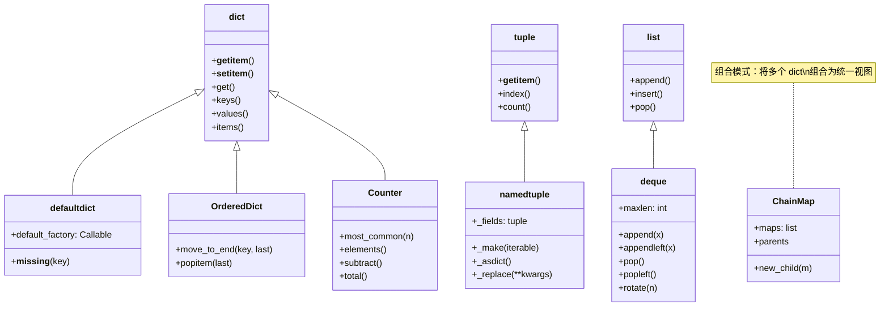
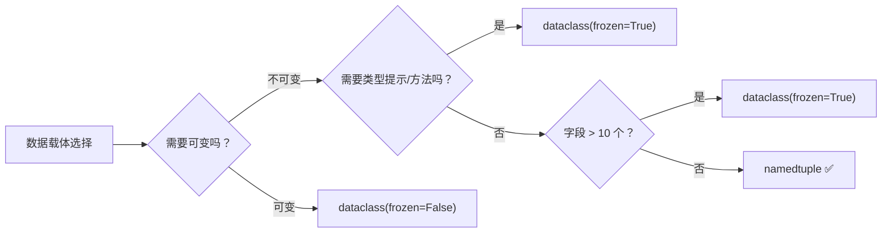
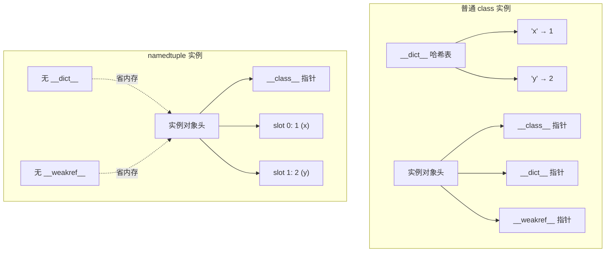
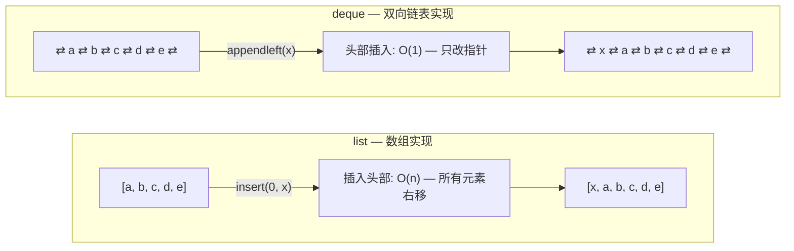
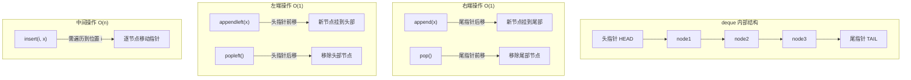
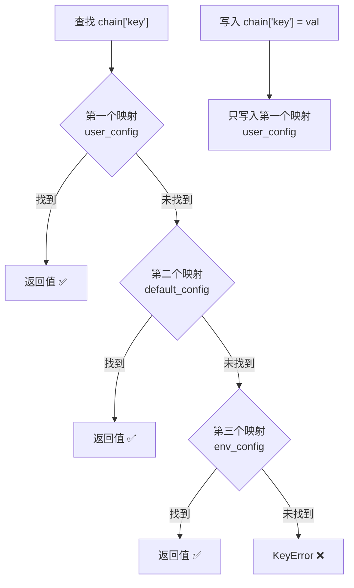
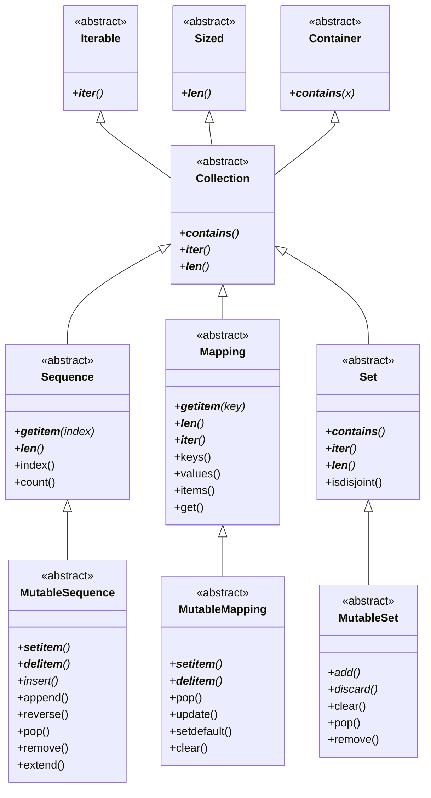

# collections 模块

## 是什么

`collections` 模块是 Python 标准库中提供**高性能容器数据类型**的集合。它对内置容器（`dict`、`list`、`tuple`）进行了扩展和特化，提供了更专业、更高效的替代方案。

## 为什么需要 collections

| 痛点 | 内置容器的问题 | collections 的解决方案 |
|------|---------------|----------------------|
| 访问不存在的键 | `dict[key]` 抛出 `KeyError`，需 `try/except` 或 `get()` | `defaultdict` 自动调用工厂函数生成默认值 |
| 计数统计 | 手动写 `for + if/else` 逻辑，代码冗长 | `Counter` 一行搞定，自带 `most_common()` |
| 首部插入/删除 | `list.insert(0, x)` 和 `list.pop(0)` 是 O(n) | `deque` 两端操作均为 O(1) |
| 位置参数可读性 | `tuple` 只能 `t[0]`、`t[1]`，语义不明 | `namedtuple` 支持 `p.x`、`p.y` 命名访问 |
| 多层配置查找 | 需手动逐层 `dict.get()` 或 `update()` 合并 | `ChainMap` 一次查找自动穿透多层映射 |
| 顺序敏感比较 | `dict` 的 `==` 忽略插入顺序 | `OrderedDict` 的 `==` 检查顺序 |

## 怎么做

下面按容器类型逐一展开，每个都包含：架构定位 → 核心原理 → 完整代码 → 最佳实践。

---

## 模块架构总览



> **关键洞察**：`defaultdict`、`OrderedDict`、`Counter` 都继承自 `dict`，因此拥有 `dict` 的全部方法；`namedtuple` 继承自 `tuple`，保持不可变性；`deque` 独立于 `list`，基于双向链表实现。`ChainMap` 不继承任何容器，而是用组合模式将多个映射串联。

---

## 1. namedtuple — 命名元组

### 是什么

`namedtuple()` 是一个**工厂函数**，用于创建具有命名字段的 `tuple` 子类。它返回一个新类，该类既支持索引访问（`p[0]`），又支持属性访问（`p.x`），同时保持元组的不可变性和内存效率。

### 为什么选择 namedtuple



### namedtuple 内存布局



> **内存优势**：`namedtuple` 使用 `__slots__` 而非 `__dict__` 存储属性，每个实例省去一个哈希表的开销。对于大量小对象，内存节省可达 40% 以上。

### API 详解

```python
collections.namedtuple(typename, field_names, *, rename=False, defaults=None, module=None)
```

| 参数 | 类型 | 说明 |
|------|------|------|
| `typename` | `str` | 生成的元组子类名称，作为 `__name__` 属性 |
| `field_names` | `Iterable[str] \| str` | 字段名序列，支持列表 `['x','y']` 或空格/逗号分隔字符串 `'x y'` |
| `rename` | `bool` | 为 `True` 时自动重命名无效字段名（关键字、重复名、下划线开头） |
| `defaults` | `Iterable` | 为最右边的字段提供默认值，从右向左对应 |
| `module` | `str` | 设置 `__module__` 属性，有助于 pickle 序列化 |

### 完整可运行代码

```python
from collections import namedtuple

# ========== 1. 基本创建与访问 ==========
Point = namedtuple('Point', ['x', 'y'])       # 列表形式定义字段
p = Point(1, 2)                               # 位置参数创建
print(p)                                       # Point(x=1, y=2)
print(p[0], p.x)                              # 1 1 — 索引和属性两种访问方式
print(p[1], p.y)                              # 2 2

# ========== 2. 字符串形式定义字段 ==========
Person = namedtuple('Person', 'name, age, gender')  # 逗号分隔
person = Person('Alice', 25, 'F')
print(person.name)                             # Alice

# ========== 3. 默认值（从右向左对应） ==========
Employee = namedtuple('Employee', ['name', 'id', 'department'], defaults=['IT'])
emp = Employee('Bob', '1001')                  # department 使用默认值
print(emp)                                     # Employee(name='Bob', id='1001', department='IT')

# ========== 4. 自动重命名无效字段 ==========
# 'abc' 重复, 'class' 是关键字, '_start' 下划线开头
Fields = namedtuple('Fields', ['abc', 'abc', 'class', '_start'], rename=True)
f = Fields(1, 2, 3, 4)
print(f)                                       # Fields(abc=1, _1=2, _2=3, _3=4)

# ========== 5. 实用方法 ==========
# _fields: 获取所有字段名
print(Point._fields)                           # ('x', 'y')

# _fields_defaults: 获取默认值映射
print(Employee._fields_defaults)               # {'department': 'IT'}

# _make: 从可迭代对象创建实例
p3 = Point._make([3, 4])
print(p3)                                      # Point(x=3, y=4)

# _asdict: 转为字典（Python 3.8+ 返回普通 dict）
print(p._asdict())                             # {'x': 1, 'y': 2}

# _replace: 创建新实例，替换指定字段（原实例不变！）
p2 = p._replace(x=10)
print(p2)                                      # Point(x=10, y=2)
print(p)                                       # Point(x=1, y=2) — 原实例未变

# ========== 6. 从字典创建 ==========
data = {'name': 'Charlie', 'age': 30, 'gender': 'M'}
person2 = Person(**data)                       # 解包字典
print(person2)                                 # Person(name='Charlie', age=30, gender='M')
```

### namedtuple vs class vs dataclass 对比

| 特性 | `namedtuple` | 普通 `class` | `dataclass` |
|------|-------------|-------------|-------------|
| 不可变性 | 不可变（核心优势） | 默认可变 | 可选 `frozen=True` |
| 内存占用 | 低（`__slots__`） | 高（`__dict__`） | 可选 `slots=True` |
| 属性访问 | `p.x` | `p.x` | `p.x` |
| 索引访问 | `p[0]` | 不支持 | 不支持 |
| 解包 | `x, y = p` | 不支持 | 不支持 |
| 默认值 | `defaults` 参数 | `__init__` 中定义 | 字段默认值 |
| 方法添加 | 需子类化 | 直接定义 | 直接定义 |
| 类型提示 | 无 | 手动 | 原生支持 |
| pickle | 支持 | 支持 | 支持 |
| 适用场景 | 轻量不可变数据 | 复杂有状态对象 | 带类型提示的数据类 |

---

## 2. deque — 双端队列

### 是什么

`deque`（double-ended queue）是基于**双向链表**实现的序列容器，支持从两端以 O(1) 时间复杂度添加和删除元素。

### 为什么 deque 比 list 快



### deque 双端操作流程



### API 详解

```python
collections.deque(iterable=None, maxlen=None)
```

| 参数 | 类型 | 说明 |
|------|------|------|
| `iterable` | `Iterable` | 初始化元素，默认为空 |
| `maxlen` | `int` | 最大长度，超出时自动从对端移除元素 |

**实例方法一览**：

| 方法 | 时间复杂度 | 说明 |
|------|-----------|------|
| `append(x)` | O(1) | 右端添加 |
| `appendleft(x)` | O(1) | 左端添加 |
| `pop()` | O(1) | 右端弹出 |
| `popleft()` | O(1) | 左端弹出 |
| `extend(iterable)` | O(k) | 右端扩展 |
| `extendleft(iterable)` | O(k) | 左端扩展（元素顺序反转） |
| `rotate(n=1)` | O(k) | 循环移动 n 步（正数右移，负数左移） |
| `clear()` | O(1) | 清空 |
| `copy()` | O(n) | 浅拷贝 |
| `count(x)` | O(n) | 统计出现次数 |
| `index(x[, start[, stop]])` | O(n) | 查找索引 |
| `insert(i, x)` | O(n) | 中间插入（超出 maxlen 抛 IndexError） |
| `remove(value)` | O(n) | 移除首个匹配 |
| `reverse()` | O(n) | 原地反转 |

### 完整可运行代码

```python
from collections import deque

# ========== 1. 基本双端操作 ==========
d = deque(['a', 'b', 'c'])

d.append('d')          # 右端添加
print(d)               # deque(['a', 'b', 'c', 'd'])

d.appendleft('x')      # 左端添加
print(d)               # deque(['x', 'a', 'b', 'c', 'd'])

print(d.pop())         # 'd' — 右端弹出
print(d.popleft())     # 'x' — 左端弹出
print(d)               # deque(['a', 'b', 'c'])

# ========== 2. 固定长度 deque（滑动窗口利器） ==========
d = deque(maxlen=3)
for i in range(5):
    d.append(i)
    print(f"添加 {i}: {list(d)}")
# 添加 0: [0]
# 添加 1: [0, 1]
# 添加 2: [0, 1, 2]
# 添加 3: [1, 2, 3]    ← 0 被自动挤出
# 添加 4: [2, 3, 4]    ← 1 被自动挤出

# ========== 3. rotate 循环移动 ==========
d = deque(['a', 'b', 'c', 'd', 'e'])
d.rotate(2)            # 右移 2 步：末尾 2 个移到头部
print(list(d))         # ['d', 'e', 'a', 'b', 'c']

d.rotate(-2)           # 左移 2 步：恢复原状
print(list(d))         # ['a', 'b', 'c', 'd', 'e']

# ========== 4. extendleft 注意顺序反转 ==========
d = deque(['a', 'b'])
d.extendleft(['x', 'y', 'z'])  # 逐个从左端插入，顺序反转
print(list(d))         # ['z', 'y', 'x', 'a', 'b']

# ========== 5. 实战：滑动窗口平均值 ==========
def sliding_window_avg(data, window_size):
    """使用 deque 实现高效滑动窗口平均值计算"""
    window = deque(maxlen=window_size)  # 固定长度窗口
    current_sum = 0
    for value in data:
        if len(window) == window_size:
            current_sum -= window[0]    # 移出旧值前先减去
        current_sum += value            # 加入新值
        window.append(value)
        if len(window) == window_size:
            yield current_sum / window_size

data = [1, 3, 5, 2, 4, 6, 8, 7, 9, 5]
print(list(sliding_window_avg(data, 3)))
# [3.0, 3.333..., 3.666..., 4.0, 6.0, 7.0, 8.0, 7.0]

# ========== 6. 实战：BFS 广度优先搜索 ==========
def bfs(graph, start):
    """使用 deque 作为 BFS 队列"""
    visited = set()
    queue = deque([start])             # 初始节点入队
    visited.add(start)
    result = []

    while queue:
        node = queue.popleft()         # O(1) 出队，比 list.pop(0) 快
        result.append(node)
        for neighbor in graph.get(node, []):
            if neighbor not in visited:
                visited.add(neighbor)
                queue.append(neighbor) # O(1) 入队
    return result

graph = {
    'A': ['B', 'C'],
    'B': ['A', 'D', 'E'],
    'C': ['A', 'F'],
    'D': ['B'],
    'E': ['B', 'F'],
    'F': ['C', 'E']
}
print(bfs(graph, 'A'))  # ['A', 'B', 'C', 'D', 'E', 'F']
```

### deque vs list 性能对比

| 操作 | `deque` | `list` | 差异 |
|------|---------|--------|------|
| 右端 `append` | O(1) | O(1) | 相同 |
| 右端 `pop` | O(1) | O(1) | 相同 |
| 左端 `appendleft` | **O(1)** | O(n) | deque 快 n 倍 |
| 左端 `popleft` | **O(1)** | O(n) | deque 快 n 倍 |
| 中间 `insert(i)` | O(n) | O(n) | 相同 |
| 随机访问 `d[i]` | O(n) | **O(1)** | list 快 |
| 内存连续性 | 非连续（链表块） | 连续（数组） | list 缓存友好 |

> **选择原则**：只在两端操作 → `deque`；需要随机访问 → `list`。

---

## 3. Counter — 计数器

### 是什么

`Counter` 是 `dict` 的子类，专门用于**计数可哈希对象**。它将元素映射到其出现次数，访问不存在的键返回 `0` 而非 `KeyError`。

### 为什么用 Counter 而非手动计数

```python
# ❌ 手动计数 — 冗长且易错
counts = {}
for item in data:
    if item in counts:
        counts[item] += 1
    else:
        counts[item] = 1

# ✅ Counter — 一行搞定
from collections import Counter
counts = Counter(data)
```

### API 详解

```python
collections.Counter(iterable_or_mapping=None)
```

**特有方法**：

| 方法 | 说明 |
|------|------|
| `elements()` | 返回迭代器，每个元素重复其计数次（顺序任意） |
| `most_common(n=None)` | 返回前 n 个最常见元素的 `(elem, count)` 列表 |
| `subtract(iterable_or_mapping)` | 原地减去计数（结果可为负数或零） |
| `total()` | Python 3.10+，返回所有计数之和 |

**数学运算**：

| 运算 | 效果 | 结果中的零/负数 |
|------|------|----------------|
| `c1 + c2` | 计数相加 | 零和负数被丢弃 |
| `c1 - c2` | 计数相减 | **只保留正数** |
| `c1 & c2` | 取最小值（交集） | 零被丢弃 |
| `c1 \| c2` | 取最大值（并集） | 零被丢弃 |

### 完整可运行代码

```python
from collections import Counter

# ========== 1. 多种创建方式 ==========
c1 = Counter('hello world')                    # 从字符串
c2 = Counter(['apple', 'banana', 'apple'])     # 从列表
c3 = Counter({'a': 3, 'b': 1})                 # 从字典
c4 = Counter(a=3, b=1)                         # 从关键字参数
print(c1)  # Counter({'l': 3, 'o': 2, 'h': 1, 'e': 1, ' ': 1, 'w': 1, 'r': 1, 'd': 1})

# ========== 2. 访问计数（不存在的键返回 0） ==========
print(c2['apple'])   # 2
print(c2['grape'])   # 0 — 不抛 KeyError！

# ========== 3. most_common — 高频元素 ==========
text = "the quick brown fox jumps over the lazy dog the fox is quick"
words = text.lower().split()
word_counts = Counter(words)
print(word_counts.most_common(3))
# [('the', 3), ('fox', 2), ('quick', 2)]

# ========== 4. elements — 展开所有元素 ==========
c = Counter(a=3, b=1, c=0)
print(sorted(c.elements()))  # ['a', 'a', 'a', 'b'] — c=0 的不出现

# ========== 5. 数学运算 ==========
c_a = Counter('aabbbcccc')   # a:2, b:3, c:4
c_b = Counter('abccccc')     # a:1, b:1, c:5

print(c_a + c_b)   # Counter({'c': 9, 'b': 4, 'a': 3}) — 计数相加
print(c_a - c_b)   # Counter({'b': 2}) — 只保留正数结果
print(c_a & c_b)   # Counter({'c': 4, 'a': 1, 'b': 1}) — 取最小值
print(c_a | c_b)   # Counter({'c': 5, 'b': 3, 'a': 2}) — 取最大值

# ========== 6. subtract — 原地减法（允许负数） ==========
c_sub = Counter('aabbbcccc')
c_sub.subtract('aacc')       # 原地减，结果可为负
print(c_sub)  # Counter({'b': 3, 'c': 2, 'a': 0, ...}) — a 变为 0

# ========== 7. total — Python 3.10+ ==========
# print(Counter(a=3, b=2).total())  # 5

# ========== 8. 实战：词频统计 Top-N ==========
article = """
Python is a popular programming language. Python is used for web development,
data analysis, artificial intelligence, and scientific computing. Python has
a simple syntax that makes it easy to learn. Many developers choose Python.
"""
word_freq = Counter(article.lower().split())
print("Top 5 高频词:", word_freq.most_common(5))
# Top 5 高频词: [('python', 4), ('is', 2), ('a', 1), ...]

# ========== 9. 实战：找出重复元素 ==========
items = [1, 2, 3, 4, 3, 2, 5, 1, 6]
duplicates = [item for item, count in Counter(items).items() if count > 1]
print("重复元素:", duplicates)  # 重复元素: [1, 2, 3]

# ========== 10. 实战：两个文本的词汇交集 ==========
text1 = "the quick brown fox jumps"
text2 = "the lazy fox sleeps"
common = Counter(text1.split()) & Counter(text2.split())
print("共同词汇:", list(common.elements()))  # ['the', 'fox']
```

### Counter vs defaultdict(int) 对比

| 特性 | `Counter` | `defaultdict(int)` |
|------|-----------|-------------------|
| 访问不存在的键 | 返回 `0`（不创建键） | 返回 `0`（**创建键**） |
| `most_common()` | 内置 | 需手动 `sorted()` |
| 数学运算 `+ - & \|` | 内置 | 不支持 |
| `elements()` | 内置 | 不支持 |
| `subtract()` | 内置 | 需手动循环 |
| 适用场景 | 频率统计、集合运算 | 简单累加计数 |

> **选择原则**：需要 `most_common()` 或数学运算 → `Counter`；只需简单累加 → `defaultdict(int)` 也可。

---

## 4. defaultdict — 默认值字典

### 是什么

`defaultdict` 是 `dict` 的子类，重写了 `__missing__` 方法。当访问不存在的键时，自动调用 `default_factory` 生成默认值，而非抛出 `KeyError`。

### 为什么 defaultdict 比dict.get() 更好

```python
# ❌ 方式一：dict + try/except — 冗长
d = {}
try:
    d['key'].append(1)
except KeyError:
    d['key'] = [1]

# ❌ 方式二：dict.get() — 每次都创建临时空列表
d = {}
d['key'] = d.get('key', []) + [1]  # 每次创建新列表，低效

# ❌ 方式三：setdefault — 语义不直观
d = {}
d.setdefault('key', []).append(1)  # 即使键存在也创建空列表

# ✅ defaultdict — 简洁高效
from collections import defaultdict
d = defaultdict(list)
d['key'].append(1)  # 不存在时自动创建空列表
```

### 常用工厂函数

| 工厂函数 | 默认值 | 典型用途 |
|---------|--------|---------|
| `list` | `[]` | 分组聚合 |
| `int` | `0` | 计数累加 |
| `set` | `set()` | 去重分组 |
| `str` | `''` | 字符串拼接 |
| `lambda: 'N/A'` | `'N/A'` | 自定义默认值 |
| `lambda: defaultdict(int)` | 嵌套 defaultdict | 多级分组 |

### 完整可运行代码

```python
from collections import defaultdict

# ========== 1. list 工厂 — 分组聚合 ==========
words = ['apple', 'banana', 'apricot', 'blueberry', 'cherry', 'avocado']
groups = defaultdict(list)
for word in words:
    groups[word[0]].append(word)               # 不存在的键自动创建空列表
print(dict(groups))
# {'a': ['apple', 'apricot', 'avocado'], 'b': ['banana', 'blueberry'], 'c': ['cherry']}

# ========== 2. int 工厂 — 计数 ==========
counter = defaultdict(int)
for ch in 'hello world':
    counter[ch] += 1                           # 不存在的键自动初始化为 0
print(dict(counter))
# {'h': 1, 'e': 1, 'l': 3, 'o': 2, ' ': 1, 'w': 1, 'r': 1, 'd': 1}

# ========== 3. set 工厂 — 去重分组 ==========
pairs = [('A', 1), ('B', 2), ('A', 1), ('A', 3), ('B', 2)]
unique_groups = defaultdict(set)
for key, val in pairs:
    unique_groups[key].add(val)                # set 自动去重
print(dict(unique_groups))                     # {'A': {1, 3}, 'B': {2}}

# ========== 4. 自定义工厂函数 ==========
tree = defaultdict(lambda: '叶子节点')
tree['root'] = '根节点'
print(tree['root'])   # 根节点
print(tree['other'])  # 叶子节点 — 自动生成默认值

# ========== 5. 嵌套 defaultdict — 多级分组 ==========
nested = defaultdict(lambda: defaultdict(list))
students = [
    ('CS', 'Freshman', 'Alice'),
    ('CS', 'Senior', 'Bob'),
    ('Math', 'Freshman', 'Charlie'),
    ('CS', 'Freshman', 'Diana'),
]
for dept, year, name in students:
    nested[dept][year].append(name)            # 两层都不存在时自动创建
print(dict(nested))
# {'CS': {'Freshman': ['Alice', 'Diana'], 'Senior': ['Bob']}, 'Math': {'Freshman': ['Charlie']}}

# ========== 6. 构建图的邻接表 ==========
edges = [('A', 'B'), ('A', 'C'), ('B', 'D'), ('C', 'D'), ('B', 'A')]
graph = defaultdict(list)
for u, v in edges:
    graph[u].append(v)                         # 不存在的节点自动创建空列表
print(dict(graph))
# {'A': ['B', 'C'], 'B': ['D', 'A'], 'C': ['D']}
```

---

## 5. OrderedDict — 有序字典

### 是什么

`OrderedDict` 是 `dict` 的子类，会记住键值对的插入顺序。Python 3.7+ 的内置 `dict` 也保证顺序，但 `OrderedDict` 仍有独有功能。

### OrderedDict vs dict 关键区别

| 特性 | `dict` (3.7+) | `OrderedDict` |
|------|--------------|---------------|
| 插入顺序保证 | 是 | 是 |
| `==` 比较是否检查顺序 | **否** | **是** |
| `move_to_end(key)` | 无 | 有 |
| `popitem(last=False)` FIFO 弹出 | 无 | 有 |
| 顺序变更意图表达 | 隐式 | **显式** |
| 内存占用 | 较低 | 较高（额外双向链表） |

### 完整可运行代码

```python
from collections import OrderedDict

# ========== 1. 顺序敏感的相等性 ==========
d1 = {'a': 1, 'b': 2}
d2 = {'b': 2, 'a': 1}
print(d1 == d2)  # True — dict 不关心顺序

od1 = OrderedDict([('a', 1), ('b', 2)])
od2 = OrderedDict([('b', 2), ('a', 1)])
print(od1 == od2)  # False — OrderedDict 关心顺序

# ========== 2. move_to_end — 移动键到首尾 ==========
od = OrderedDict([('a', 1), ('b', 2), ('c', 3)])
od.move_to_end('a')          # 移到末尾
print(list(od.keys()))       # ['b', 'c', 'a']

od.move_to_end('a', last=False)  # 移到开头
print(list(od.keys()))       # ['a', 'b', 'c']

# ========== 3. popitem — FIFO / LIFO 弹出 ==========
od = OrderedDict([('a', 1), ('b', 2), ('c', 3)])
print(od.popitem(last=False))  # ('a', 1) — FIFO 弹出最早插入的
print(od.popitem(last=True))   # ('c', 3) — LIFO 弹出最晚插入的
```

### 实战：LRU 缓存

```python
from collections import OrderedDict

class LRUCache:
    """基于 OrderedDict 实现的 LRU（最近最少使用）缓存"""

    def __init__(self, capacity: int):
        self.cache = OrderedDict()    # 有序字典：键按访问时间排列
        self.capacity = capacity      # 缓存容量

    def get(self, key):
        """获取缓存值，同时将键移到末尾（标记为最近使用）"""
        if key not in self.cache:
            return -1
        self.cache.move_to_end(key)   # 访问后移到末尾
        return self.cache[key]

    def put(self, key, value):
        """写入缓存，超出容量时淘汰最久未使用的键"""
        if key in self.cache:
            self.cache.move_to_end(key)  # 已存在则先移到末尾
        self.cache[key] = value          # 插入/更新
        if len(self.cache) > self.capacity:
            self.cache.popitem(last=False)  # FIFO 弹出最久未使用的

    def __repr__(self):
        return f"LRUCache({dict(self.cache)})"

# 测试
cache = LRUCache(3)
cache.put('a', 1)       # cache: {a:1}
cache.put('b', 2)       # cache: {a:1, b:2}
cache.put('c', 3)       # cache: {a:1, b:2, c:3}
cache.get('a')          # 访问 a → 移到末尾: {b:2, c:3, a:1}
cache.put('d', 4)       # 超出容量 → 淘汰 b: {c:3, a:1, d:4}
print(cache)            # LRUCache({'c': 3, 'a': 1, 'd': 4})
```

---

## 6. ChainMap — 链式映射

### 是什么

`ChainMap` 将多个字典（或其他映射）链接在一起，创建一个**统一的只读视图**。查找时按顺序搜索每个映射，写入时只作用于第一个映射。

### 为什么用 ChainMap 而非 dict.update()

```python
# ❌ update 合并 — 创建新字典，修改不影响原始
merged = {**defaults, **user_config}  # 浅拷贝合并，创建新字典（嵌套对象仍共享引用）
merged['key'] = 'new'                 # 修改不影响原始字典

# ✅ ChainMap — 零拷贝视图，修改反映到第一个映射
from collections import ChainMap
chain = ChainMap(user_config, defaults)  # 不复制数据
chain['key'] = 'new'                     # 写入 user_config
```

### ChainMap 查找流程



### 完整可运行代码

```python
from collections import ChainMap

# ========== 1. 基本用法 — 配置链 ==========
default_config = {'theme': 'light', 'font_size': 12, 'language': 'en'}
user_config = {'font_size': 14}                # 用户覆盖默认值
env_config = {'language': 'zh'}                # 环境变量覆盖

config = ChainMap(user_config, default_config)  # user_config 优先
print(config['font_size'])  # 14 — 来自 user_config
print(config['theme'])      # 'light' — 来自 default_config

# ========== 2. 写入只影响第一个映射 ==========
config['theme'] = 'dark'
print(user_config)    # {'font_size': 14, 'theme': 'dark'} — 写入了 user_config
print(default_config) # {'theme': 'light', ...} — 未被修改

# ========== 3. new_child — 添加新层 ==========
# 模拟函数调用时的局部变量层
local_vars = {'x': 10}
scope = config.new_child(local_vars)  # local_vars 成为最前层
print(scope['x'])          # 10 — 来自 local_vars
print(scope['font_size'])  # 14 — 来自 user_config

# ========== 4. parents — 去掉最前层 ==========
print(list(scope.parents.maps))
# [user_config, default_config] — 去掉了 local_vars

# ========== 5. 实战：多层配置系统 ==========
class ConfigManager:
    """多层配置管理器：命令行 > 环境变量 > 用户配置 > 默认配置"""

    def __init__(self, defaults, user_config=None, env_config=None, cli_config=None):
        layers = []
        if cli_config:
            layers.append(cli_config)       # 最高优先级
        if env_config:
            layers.append(env_config)
        if user_config:
            layers.append(user_config)
        layers.append(defaults)             # 最低优先级
        self.config = ChainMap(*layers)

    def get(self, key, fallback=None):
        """获取配置值，支持 fallback"""
        return self.config.get(key, fallback)

    def set_override(self, key, value):
        """在最高优先级层设置覆盖值"""
        if self.config.maps:
            self.config.maps[0][key] = value

    def show_sources(self):
        """显示每个配置项的来源"""
        for key in set().union(*self.config.maps):
            for i, layer in enumerate(self.config.maps):
                if key in layer:
                    names = ['CLI', 'ENV', 'USER', 'DEFAULT']
                    print(f"  {key} = {layer[key]}  ← {names[i] if i < len(names) else f'Layer{i}'}")
                    break

# 测试
defaults = {'theme': 'light', 'font_size': 12, 'debug': False, 'port': 8080}
user = {'theme': 'dark', 'font_size': 14}
env = {'port': 9090, 'debug': True}
cli = {'port': 3000}

mgr = ConfigManager(defaults, user_config=user, env_config=env, cli_config=cli)
mgr.show_sources()
#   theme = dark  ← USER
#   font_size = 14  ← USER
#   debug = True  ← ENV
#   port = 3000  ← CLI
```

---

## 7. UserDict / UserList / UserString — 自定义容器包装器

### 是什么

这三个类是内置容器类型的**包装器**，内部用 `self.data` 属性存储实际数据。它们存在的意义是：**方便子类化**。

### 为什么不直接继承 dict / list / str

| 问题 | 直接继承内置类型 | 继承 User* |
|------|----------------|-----------|
| `__setitem__` 被绕过 | 内置 `update()`、`setdefault()` 等方法**直接调用 C 层**，不走你重写的 `__setitem__` | 所有方法都通过 `self.data` 操作，**确保你的重写生效** |
| `__getitem__` 被绕过 | 类似问题 | 同上 |
| 存储灵活性 | 数据必须存在 C 结构中 | `self.data` 可以替换为任何容器 |

### 完整可运行代码

```python
from collections import UserDict, UserList, UserString

# ========== 1. UserDict — 键类型限制的字典 ==========
class TypedKeyDict(UserDict):
    """只允许字符串键的字典"""

    def __setitem__(self, key, value):
        if not isinstance(key, str):
            raise TypeError(f"键必须是字符串，收到: {type(key).__name__}")
        super().__setitem__(key, value)

d = TypedKeyDict()
d['name'] = 'Alice'       # 正常
# d[123] = 'error'        # TypeError: 键必须是字符串，收到: int

# 关键：update 也会走 __setitem__！
d.update({'age': 25, 'city': 'Beijing'})  # 每个键都经过检查
print(d)  # {'name': 'Alice', 'age': 25, 'city': 'Beijing'}

# ========== 2. UserList — 限制元素类型的列表 ==========
class NumberList(UserList):
    """只允许数值元素的列表"""

    def __setitem__(self, index, value):
        if not isinstance(value, (int, float)):
            raise TypeError(f"元素必须是数值，收到: {type(value).__name__}")
        super().__setitem__(index, value)

    def append(self, value):
        if not isinstance(value, (int, float)):
            raise TypeError(f"元素必须是数值，收到: {type(value).__name__}")
        super().append(value)

nums = NumberList([1, 2, 3])
nums.append(4)            # 正常
# nums.append('x')        # TypeError

# ========== 3. UserString — 字符串扩展 ==========
class TaggedString(UserString):
    """带标签的字符串"""

    def __init__(self, data, tag=None):
        super().__init__(data)
        self.tag = tag

    def with_tag(self):
        return f"[{self.tag}] {self.data}" if self.tag else self.data

s = TaggedString("Hello", tag="INFO")
print(s.with_tag())  # [INFO] Hello
print(s.upper())     # HELLO — 仍支持字符串方法
```

---

## 8. abc 容器抽象基类

### 是什么

`collections.abc` 模块定义了容器类型的**抽象基类**（Abstract Base Classes），用于：

1. **类型检查**：`isinstance(obj, Sequence)` 判断对象是否为序列
2. **接口定义**：子类化抽象基类确保实现了必要方法
3. **自定义容器**：继承 `MutableMapping` 等快速实现自定义容器

### 抽象基类层次结构



### 完整可运行代码

```python
from collections.abc import MutableMapping, Sequence, Iterable

# ========== 1. isinstance 类型检查 ==========
print(isinstance([1, 2, 3], Sequence))       # True
print(isinstance({'a': 1}, MutableMapping))  # True
print(isinstance('hello', Sequence))         # True — str 也是序列
print(isinstance(42, Iterable))              # False — int 不可迭代

# ========== 2. 自定义容器 — 继承 MutableMapping ==========
class CaseInsensitiveDict(MutableMapping):
    """键不区分大小写的字典"""

    def __init__(self, data=None, **kwargs):
        self._store = {}                     # 内部存储：小写键 → 原始键值对
        if data:
            self.update(data)
        self.update(kwargs)

    def __setitem__(self, key, value):
        # 统一转为小写存储，但保留原始键用于显示
        self._store[key.lower()] = (key, value)

    def __getitem__(self, key):
        return self._store[key.lower()][1]   # 返回值

    def __delitem__(self, key):
        del self._store[key.lower()]

    def __iter__(self):
        # 迭代时返回原始键（保留大小写）
        return (original_key for original_key, _ in self._store.values())

    def __len__(self):
        return len(self._store)

    def __repr__(self):
        items = ', '.join(f'{k!r}: {v!r}' for k, v in self.items())
        return f'CaseInsensitiveDict({{{items}}})'

# 测试
cid = CaseInsensitiveDict({'Name': 'Alice', 'AGE': 25})
cid['email'] = 'alice@example.com'           # 正常添加
print(cid['name'])   # 'Alice' — 大小写不敏感查找
print(cid['NAME'])   # 'Alice' — 同上
print(cid['age'])    # 25
print(cid)           # CaseInsensitiveDict({'Name': 'Alice', 'AGE': 25, 'email': 'alice@example.com'})

# MutableMapping 提供的混入方法自动可用
print(len(cid))      # 3
print(list(cid.keys()))  # ['Name', 'AGE', 'email']
cid.update({'CITY': 'Beijing'})
print(cid['city'])   # 'Beijing'
```

> **关键洞察**：继承 `MutableMapping` 只需实现 5 个抽象方法（`__getitem__`、`__setitem__`、`__delitem__`、`__iter__`、`__len__`），即可免费获得 `pop`、`update`、`setdefault`、`clear`、`get`、`keys`、`values`、`items` 等 8 个混入方法。

---

## 实战案例合集

### 实战 1：词频统计与文本分析

```python
from collections import Counter, defaultdict
import re

def analyze_text(text):
    """综合文本分析：词频、字符频率、词长分布"""

    # 1. 词频统计（过滤标点，转小写）
    words = re.findall(r'\b[a-z]+\b', text.lower())
    word_freq = Counter(words)

    # 2. 字符频率统计
    char_freq = Counter(c for c in text.lower() if c.isalpha())

    # 3. 按词长分组
    by_length = defaultdict(list)
    for word in set(words):                   # set 去重
        by_length[len(word)].append(word)

    return {
        'top_words': word_freq.most_common(5),
        'top_chars': char_freq.most_common(5),
        'total_words': sum(word_freq.values()),
        'unique_words': len(word_freq),
        'by_length': dict(by_length),
    }

# 测试
sample = """
Python is a versatile programming language. Python supports multiple
paradigms including procedural, object-oriented, and functional programming.
Python's standard library is extensive and covers areas like web development,
data analysis, and machine learning.
"""
result = analyze_text(sample)
print("Top 5 词频:", result['top_words'])
print("Top 5 字符:", result['top_chars'])
print("总词数:", result['total_words'])
print("不重复词数:", result['unique_words'])
print("按词长分组:", {k: sorted(v) for k, v in sorted(result['by_length'].items())})
```

### 实战 2：LRU 缓存（完整版）

```python
from collections import OrderedDict
from functools import wraps
import time

class LRUCache:
    """线程不安全的 LRU 缓存实现"""

    def __init__(self, capacity: int):
        self.cache = OrderedDict()
        self.capacity = capacity
        self.hits = 0
        self.misses = 0

    def get(self, key):
        if key in self.cache:
            self.cache.move_to_end(key)       # 标记为最近使用
            self.hits += 1
            return self.cache[key]
        self.misses += 1
        return None

    def put(self, key, value):
        if key in self.cache:
            self.cache.move_to_end(key)
        self.cache[key] = value
        if len(self.cache) > self.capacity:
            evicted = self.cache.popitem(last=False)  # 淘汰最久未使用
            print(f"  淘汰: {evicted}")

    @property
    def hit_rate(self):
        total = self.hits + self.misses
        return self.hits / total if total > 0 else 0.0

    def __repr__(self):
        return f"LRUCache(size={len(self.cache)}/{self.capacity}, hit_rate={self.hit_rate:.1%})"

def lru_cache_decorator(capacity=128):
    """LRU 缓存装饰器"""
    cache = LRUCache(capacity)

    def decorator(func):
        @wraps(func)
        def wrapper(*args):
            key = args                         # 简化：用参数元组作为键
            result = cache.get(key)
            if result is not None:
                return result
            result = func(*args)
            cache.put(key, result)
            return result
        wrapper.cache = cache
        return wrapper
    return decorator

# 测试
@lru_cache_decorator(capacity=3)
def expensive_compute(n):
    """模拟耗时计算"""
    time.sleep(0.01)
    return n * n

for n in [1, 2, 3, 1, 4, 2, 5]:
    result = expensive_compute(n)
    print(f"compute({n}) = {result}, cache: {expensive_compute.cache}")
```

### 实战 3：配置链（ChainMap 完整版）

```python
from collections import ChainMap
import os

class LayeredConfig:
    """多层配置系统：CLI > 环境变量 > 项目配置 > 全局默认"""

    def __init__(self, defaults, project=None, env_prefix='APP_'):
        self._env_prefix = env_prefix
        self._defaults = defaults
        self._project = project or {}
        self._env = self._load_env()
        self._overrides = {}                  # CLI / 运行时覆盖

        # 从高到低优先级构建 ChainMap
        self._chain = ChainMap(
            self._overrides,                  # 最高优先级
            self._env,                        # 环境变量
            self._project,                    # 项目配置
            self._defaults,                   # 全局默认
        )

    def _load_env(self):
        """从环境变量加载配置（前缀匹配）"""
        env_config = {}
        for key, value in os.environ.items():
            if key.startswith(self._env_prefix):
                config_key = key[len(self._env_prefix):].lower()
                # 尝试类型转换
                try:
                    value = int(value)
                except ValueError:
                    try:
                        value = float(value)
                    except ValueError:
                        if value.lower() in ('true', 'yes'):
                            value = True
                        elif value.lower() in ('false', 'no'):
                            value = False
                env_config[config_key] = value
        return env_config

    def get(self, key, fallback=None):
        return self._chain.get(key, fallback)

    def __getitem__(self, key):
        return self._chain[key]

    def set_override(self, key, value):
        """运行时覆盖（写入最高优先级层）"""
        self._overrides[key] = value

    def reset_override(self, key):
        """移除运行时覆盖，恢复下层配置"""
        self._overrides.pop(key, None)

    def source_of(self, key):
        """查看某个配置项来自哪一层"""
        layer_names = ['OVERRIDE', 'ENV', 'PROJECT', 'DEFAULT']
        for i, layer in enumerate(self._chain.maps):
            if key in layer:
                return layer_names[i]
        return None

    def __repr__(self):
        items = []
        for key in sorted(set().union(*self._chain.maps)):
            src = self.source_of(key)
            items.append(f"  {key} = {self[key]!r}  ({src})")
        return "LayeredConfig:\n" + "\n".join(items)

# 测试
defaults = {
    'host': '0.0.0.0',
    'port': 8080,
    'debug': False,
    'log_level': 'INFO',
    'max_connections': 100,
}
project = {'port': 3000, 'debug': True}

config = LayeredConfig(defaults, project=project, env_prefix='APP_')
print(config)
# host = '0.0.0.0'  (DEFAULT)
# port = 3000  (PROJECT)
# debug = True  (PROJECT)
# ...

config.set_override('port', 5000)             # 运行时覆盖
print(f"port = {config['port']}")             # 5000
print(f"port 来自: {config.source_of('port')}")  # OVERRIDE

config.reset_override('port')                 # 恢复
print(f"port = {config['port']}")             # 3000
```

---

## 最佳实践对比表

| 场景 | 推荐容器 | 理由 |
|------|---------|------|
| 简单键值存储 | `dict` | 内置、最快、3.7+ 有序 |
| 访问不存在的键需默认值 | `defaultdict` | 自动创建，无需 `try/except` |
| 频率统计 / Top-N | `Counter` | `most_common()` + 数学运算 |
| 队列 / 栈 / 滑动窗口 | `deque` | 两端 O(1)，`maxlen` 自动淘汰 |
| 不可变轻量数据记录 | `namedtuple` | 省内存、可解包、属性访问 |
| LRU 缓存 / 顺序敏感比较 | `OrderedDict` | `move_to_end()` + FIFO `popitem()` |
| 多层配置 / 作用域链 | `ChainMap` | 零拷贝、自动穿透查找 |
| 自定义容器行为 | `UserDict/UserList` | 确保重写方法不被绕过 |
| 接口约束 / 类型检查 | `collections.abc` | 抽象基类 + 混入方法 |
| 复杂数据类（可变、有方法） | `dataclass` | 类型提示、默认值、方法 |

---

## 常见陷阱与 FAQ

### Q1: namedtuple 不可变，如何"修改"字段值？

```python
from collections import namedtuple

Point = namedtuple('Point', ['x', 'y'])
p = Point(1, 2)

# ❌ 直接赋值 — 报错
# p.x = 10  # AttributeError: can't set attribute

# ✅ 方式一：_replace 创建新实例
p2 = p._replace(x=10)
print(p2)  # Point(x=10, y=2)

# ✅ 方式二：转为可变类型修改后再转回
d = p._asdict()
d['x'] = 10
p3 = Point(**d)
print(p3)  # Point(x=10, y=2)

# ✅ 方式三：如果需要可变，用 dataclass 代替
from dataclasses import dataclass
@dataclass
class MutablePoint:
    x: float
    y: float

mp = MutablePoint(1, 2)
mp.x = 10  # 正常修改
```

### Q2: deque 线程安全吗？

```python
from collections import deque
import threading

# ✅ deque 的 append 和 popleft 是线程安全的
# CPython 实现中，deque 的两端操作受 GIL 保护，是原子操作
# 这使得 deque 适合作为多线程队列

queue = deque()

def producer():
    for i in range(1000):
        queue.append(i)          # 线程安全的 append

def consumer():
    while True:
        try:
            item = queue.popleft()  # 线程安全的 popleft
        except IndexError:
            continue

# ⚠️ 但以下操作不是线程安全的：
# - len(d) + append 组合（检查再操作，非原子）
# - 中间 insert / remove
# - rotate
# 生产环境建议用 queue.Queue 或 asyncio.Queue
```

### Q3: Counter 的负数问题

```python
from collections import Counter

c = Counter(a=3, b=1)

# subtract 允许结果为负数（原地操作）
c.subtract({'a': 5})
print(c)  # Counter({'b': 1, 'a': -2}) — a 变为 -2

# 但 - 运算符只保留正数
c2 = Counter(a=3, b=1)
c3 = Counter(a=5)
print(c2 - c3)  # Counter({'b': 1}) — a=-2 被丢弃

# ⚠️ 访问负数键仍返回负数值
print(c['a'])  # -2

# ⚠️ elements() 不输出计数 ≤ 0 的元素
print(list(c.elements()))  # ['b'] — a=-2 不出现

# ✅ 如果需要只保留正数，用 + 运算符
positive = +c  # Counter({'b': 1}) — 等价于去掉零和负数
print(positive)
```

### Q4: defaultdict 的工厂函数陷阱

```python
from collections import defaultdict

# ❌ 陷阱一：工厂函数返回同一个可变对象
# 以下写法所有键共享同一个列表！
bad = defaultdict(lambda: [])  # 这其实没问题，每次调用 lambda 创建新列表
# 但注意不要写成：
# bad = defaultdict([].copy)  # 不直观

# ❌ 陷阱二：工厂函数有副作用
count = 0
def side_effect_factory():
    global count
    count += 1
    return count

d = defaultdict(side_effect_factory)
d['a']  # count 变为 1
d['b']  # count 变为 2
# 每次访问新键都会触发副作用！

# ✅ 正确做法：工厂函数应该是无副作用的
d = defaultdict(int)       # int() 返回 0，无副作用
d = defaultdict(list)      # list() 返回新空列表，无副作用
d = defaultdict(set)       # set() 返回新空集合，无副作用
d = defaultdict(str)       # str() 返回空字符串，无副作用

# ❌ 陷阱三：default_factory=None 时仍抛 KeyError
d = defaultdict()          # 等价于 defaultdict(None)
# d['missing']             # KeyError — 和普通 dict 一样

# ✅ 如果需要默认值，必须设置工厂函数
d = defaultdict(lambda: 'N/A')
print(d['missing'])        # 'N/A'
```

### Q5: ChainMap 的删除操作

```python
from collections import ChainMap

defaults = {'theme': 'light', 'font_size': 12}
user = {'font_size': 14}
config = ChainMap(user, defaults)

# ✅ 删除第一个映射中的键
del config['font_size']    # 从 user 中删除
print(config['font_size']) # 12 — 现在回退到 defaults

# ❌ 删除不在第一个映射中的键 — 报错
# del config['theme']      # KeyError: "Key not found in the first mapping"

# ✅ 如果要删除所有层中的键，需要逐层处理
for mapping in config.maps:
    mapping.pop('theme', None)
```

### Q6: namedtuple 的 _ 前缀方法会被覆盖吗？

```python
from collections import namedtuple

# namedtuple 的方法都以 _ 开头，避免与字段名冲突
# 但如果字段名恰好是 _fields、_asdict 等，会出问题

# ✅ 使用 rename=True 自动处理
T = namedtuple('T', ['x', '_fields', 'y'], rename=True)
print(T._fields)  # ('x', '_1', 'y') — _fields 被重命名为 _1

# ⚠️ 但 rename 不会处理所有冲突，避免使用 _ 开头的字段名
```

---

## 术语表

| 术语 | 英文 | 定义 |
|------|------|------|
| 容器 | Container | 可包含其他对象的对象，支持 `in` 操作符 |
| 可哈希 | Hashable | 对象具有 `__hash__()` 方法且哈希值不变，可作为 dict 键 |
| 工厂函数 | Factory Function | 用于创建对象的可调用对象，如 `list`、`int`、`lambda` |
| 双端队列 | Double-Ended Queue (deque) | 两端均可高效插入/删除的队列数据结构 |
| 抽象基类 | Abstract Base Class (ABC) | 定义接口规范的类，不能直接实例化，子类必须实现抽象方法 |
| 混入方法 | Mixin Method | 抽象基类中提供默认实现的方法，基于其他抽象方法组合而成 |
| LRU | Least Recently Used | 最近最少使用，一种缓存淘汰策略 |
| FIFO | First In First Out | 先进先出，队列的默认行为 |
| LIFO | Last In First Out | 后进先出，栈的默认行为 |
| 原地操作 | In-place Operation | 直接修改对象本身，不创建新对象（如 `subtract`） |
| 视图 | View | 不复制数据的只读窗口（如 `ChainMap`、`dict.keys()`） |
| 命名元组 | Named Tuple | 具有命名字段的元组子类，支持属性访问 |
| 链式映射 | Chain Map | 将多个映射串联为统一视图的组合模式 |
| GIL | Global Interpreter Lock | CPython 的全局解释器锁，保证单条字节码的原子性 |

---

## 延伸阅读

| 资源 | 说明 |
|------|------|
| [官方文档 — collections](https://docs.python.org/3/library/collections.html) | Python 官方文档，最权威的参考 |
| [官方文档 — collections.abc](https://docs.python.org/3/library/collections.abc.html) | 抽象基类完整参考 |
| [PEP 372](https://peps.python.org/pep-0372/) | `OrderedDict` 提案 |
| [PEP 412](https://peps.python.org/pep-0412/) | `__slots__` 与类字典共享优化 |
| [PEP 552](https://peps.python.org/pep-0552/) | Deterministic pyc（涉及 `__module__` 属性） |
| [Fluent Python 第 1 章](https://www.oreilly.com/library/view/fluent-python-2nd/9781492056348/) | 数据模型深入讲解 |
| [Python Cookbook 第 1 章](https://www.oreilly.com/library/view/python-cookbook-3rd/9781449357337/) | 数据结构和算法实战 |
| [functools.lru_cache](https://docs.python.org/3/library/functools.html#functools.lru_cache) | 标准库 LRU 缓存装饰器（生产级实现） |
| [dataclasses 模块](https://docs.python.org/3/library/dataclasses.html) | Python 3.7+ 数据类，`namedtuple` 的现代替代 |
| [typing.NamedTuple](https://docs.python.org/3/library/typing.html#typing.NamedTuple) | 带类型提示的命名元组 |

## 版本差异（标准库 → Python 3.14）

| 模块/特性 | 本文编写时 | Python 3.14 变化 |
|-----------|-----------|------------------|
| `datetime` | `utcnow()` / `utcfromtimestamp()` | 3.12 起弃用，改用 `datetime.now(tz=datetime.UTC)` / `fromtimestamp(ts, tz=datetime.UTC)`（aware 对象） |
| `asyncio` | 基础 API | 3.14 新增内省能力（`asyncio.Task`/`Future` 状态查询）；3.11 起推荐 `TaskGroup` + `asyncio.timeout()` |
| `typing` | 旧式 `List`/`Dict` | 3.9+ 内置泛型；3.10+ 联合类型 `X \| Y`；3.12 `type` 语句；3.14 PEP 649 延迟注解 |
| `importlib` | `imp` 模块 | `imp` 于 3.12 移除，统一使用 `importlib` |
| 压缩 | zlib/gzip/bz2/lzma | 3.14 新增 `zstandard` 标准库支持（PEP 784） |
| `pathlib` | 基础路径操作 | 3.12+ 持续增强（`Path.walk()` 等）；`is_relative_to()` 自 3.9 起可用 |
| 往事清理 | — | 3.13 移除 `cgi`、`telnetlib`、`crypt`、`audioop` 等已废弃模块 |

> 本文讲解的模块核心 API 与使用模式在 3.14 中保持稳定；注意上述弃用/移除项，升级时优先用标准库推荐的替代方案。
