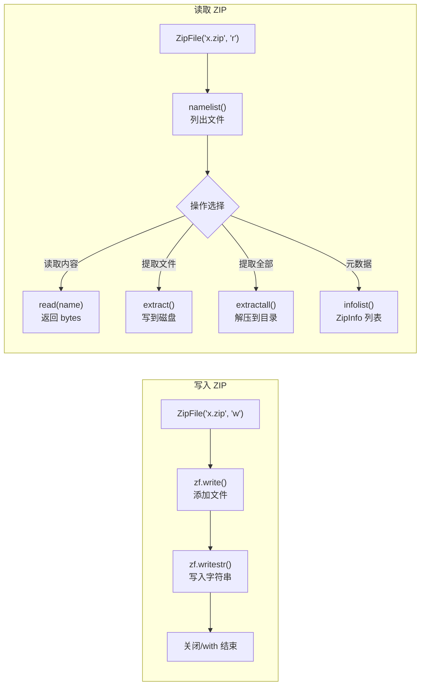
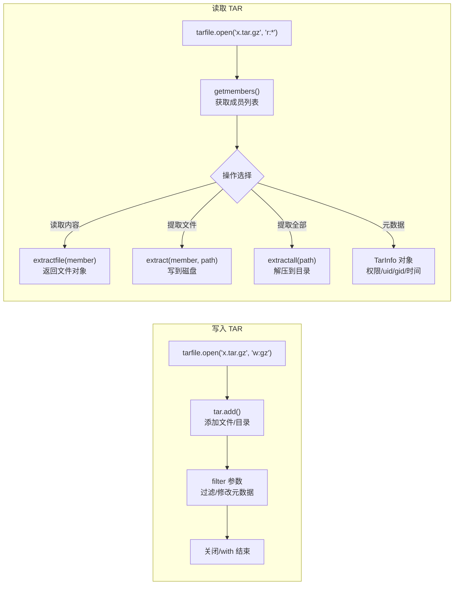
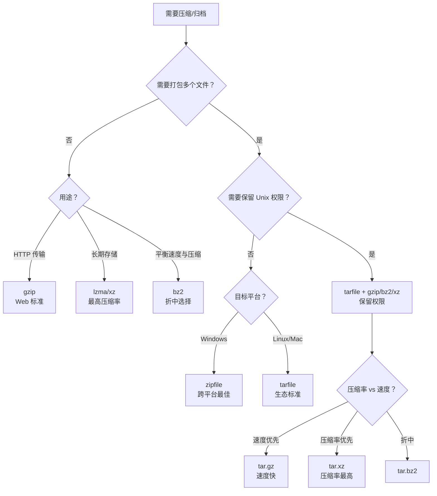

# Python 压缩与解压缩模块详解

## 是什么：Python 压缩模块体系

Python 标准库提供了一套完整的压缩与归档模块，覆盖从底层 zlib 数据压缩到高层归档操作的完整链路。这些模块分为两大阵营：

- **归档模块**（`zipfile`、`tarfile`）：将多个文件打包成一个归档文件，可同时支持压缩
- **单文件压缩模块**（`gzip`、`bz2`、`lzma`）：对单个数据流/文件进行压缩
- **底层压缩引擎**（`zlib`）：提供 DEFLATE 算法的原始接口，是 gzip/zipfile 的基石
- **便捷封装**（`shutil`）：一行代码完成归档/解档，适合快速脚本

```mermaid
graph TD
    subgraph "Python 压缩模块体系"
        A["标准库压缩模块"] --> B["归档模块<br/>多文件打包+压缩"]
        A --> C["单文件压缩模块<br/>流式压缩"]
        A --> D["底层引擎<br/>原始压缩算法"]
        A --> E["便捷封装<br/>一键归档"]

        B --> B1["zipfile<br/>.zip"]
        B --> B2["tarfile<br/>.tar / .tar.gz / .tar.bz2 / .tar.xz"]

        C --> C1["gzip<br/>.gz"]
        C --> C2["bz2<br/>.bz2"]
        C --> C3["lzma<br/>.xz / .lzma"]

        D --> D1["zlib<br/>DEFLATE 算法"]

        E --> E1["shutil<br/>make_archive / unpack_archive"]
    end

    D1 -.-> "被 gzip 调用"
    D1 -.-> "被 zipfile 调用"
    C1 -.-> "被 tarfile(w:gz) 调用"
    C2 -.-> "被 tarfile(w:bz2) 调用"
    C3 -.-> "被 tarfile(w:xz) 调用"

```

## 为什么：何时需要压缩模块

| 场景 | 不压缩的问题 | 压缩后收益 |
|------|-------------|-----------|
| 日志归档 | 磁盘占满，历史日志丢失 | 压缩率 5-20 倍，长期可追溯 |
| 数据传输 | 带宽瓶颈，传输慢 | HTTP gzip 传输体积减少 70%+ |
| 软件分发 | 下载包过大 | 用户下载时间缩短，CDN 成本降低 |
| 配置备份 | 多文件散落，难以管理 | 单文件归档，版本可控 |
| 增量备份 | 每次全量备份，冗余极大 | 仅打包变更文件，存储成本线性增长 |

## 怎么做：各模块详解与实战

---

## 一、zipfile —— ZIP 归档操作

### 1.1 是什么

`zipfile` 是 Python 处理 `.zip` 格式的标准模块。ZIP 是最广泛使用的跨平台归档格式，内建支持 DEFLATE 压缩，一个文件同时完成"打包 + 压缩"。

### 1.2 为什么选择 ZIP

- **跨平台**：Windows / macOS / Linux 原生支持
- **随机访问**：可直接读取归档内任意文件，无需解压整个归档
- **自包含**：归档与压缩一体，无需外部工具

### 1.3 zipfile 操作流程



### 1.4 核心代码

#### 创建 ZIP 文件

```python
import zipfile
import os

# ---------- 方法 1：write() 添加已有文件 ----------
with zipfile.ZipFile('example.zip', 'w', zipfile.ZIP_DEFLATED) as zf:
    zf.write('file1.txt')                          # 添加文件，归档名与原文件名相同
    zf.write('file2.txt', arcname='docs/file2.txt') # 指定归档内的路径名
    # ZIP_DEFLATED = 使用 zlib 压缩（推荐默认值）
    # ZIP_STORED   = 仅打包不压缩（适合已压缩文件如 .jpg/.mp4）

# ---------- 方法 2：writestr() 直接写入字符串/字节 ----------
with zipfile.ZipFile('data.zip', 'w') as zf:
    zf.writestr('readme.txt', 'This is a readme file')        # 写入文本
    zf.writestr('config.json', '{"key": "value"}')            # 写入 JSON
    zf.writestr('binary.bin', b'\x00\x01\x02\x03')            # 写入二进制

# ---------- 方法 3：追加文件到已有 ZIP ----------
with zipfile.ZipFile('example.zip', 'a') as zf:    # 'a' = append 模式
    zf.write('new_file.txt')
```

#### 读取与解压 ZIP

```python
import zipfile

# ---------- 安全检查 ----------
if not zipfile.is_zipfile('example.zip'):           # 验证是否为合法 ZIP
    raise ValueError("Not a valid ZIP file")

with zipfile.ZipFile('example.zip', 'r') as zf:
    # 列出所有文件名
    print(zf.namelist())                            # ['file1.txt', 'docs/file2.txt', ...]

    # 获取文件元数据
    for info in zf.infolist():                      # 每个元素是 ZipInfo 对象
        print(f"文件: {info.filename}")             # 归档内文件名
        print(f"  原始大小: {info.file_size} bytes")
        print(f"  压缩大小: {info.compress_size} bytes")
        print(f"  压缩率: {1 - info.compress_size / info.file_size:.1%}")
        print(f"  修改时间: {info.date_time}")      # (年, 月, 日, 时, 分, 秒)

    # 读取单个文件内容（不解压到磁盘，返回 bytes）
    content = zf.read('file1.txt')
    print(content.decode('utf-8'))

    # 提取单个文件
    zf.extract('file1.txt', 'output_folder')        # 解压到 output_folder/file1.txt

    # 提取全部文件
    zf.extractall('extracted_folder')               # 解压所有文件到指定目录

    # 测试 ZIP 完整性（返回第一个损坏文件的文件名，或 None）
    bad = zf.testzip()
    if bad:
        print(f"损坏的文件: {bad}")
```

#### 压缩级别与压缩方法

```python
import zipfile

# 四种压缩方法对比
methods = {
    zipfile.ZIP_STORED:   "不压缩，仅打包（最快，体积最大）",
    zipfile.ZIP_DEFLATED: "zlib DEFLATE 压缩（默认，速度与压缩率平衡）",
    zipfile.ZIP_BZIP2:    "bzip2 压缩（压缩率更高，速度更慢）",
    zipfile.ZIP_LZMA:     "LZMA 压缩（压缩率最高，速度最慢）",
}

# compresslevel 参数（仅 ZIP_DEFLATED / ZIP_BZIP2 / ZIP_LZMA 有效）
# DEFLATED: 0-9，默认 6
# BZIP2:    1-9，默认 9
# LZMA:     无 compresslevel，使用 preset（0-9，默认 6）

with zipfile.ZipFile('compressed.zip', 'w', zipfile.ZIP_DEFLATED,
                     compresslevel=9) as zf:        # 9 = 最高压缩率
    zf.write('large_file.txt')
```

#### 密码保护（有限制）

```python
import zipfile

# ⚠️ 重要：Python 标准库 zipfile **只能读取**使用旧式 ZIPCrypto 弱加密的 ZIP，
#          **不能创建**加密 ZIP（写入时 setpassword() 不会加密任何数据，实测验证），
#          也不支持读取 AES-256 等强加密 ZIP。创建加密 ZIP 请使用 pyzipper 第三方库。

# 读取使用传统 ZIPCrypto 加密的 ZIP
with zipfile.ZipFile('secure.zip', 'r') as zf:
    zf.setpassword(b'my_password')                  # 提供密码（仅影响读取/解压）
    zf.extractall('extracted')

# 单文件密码：read()/extract() 支持 pwd 参数
with zipfile.ZipFile('secure.zip', 'r') as zf:
    data = zf.read('secret.txt', pwd=b'my_password')

# 创建 AES-256 加密 ZIP（第三方库 pyzipper）
# pip install pyzipper
# import pyzipper
# with pyzipper.AESZipFile('secure_aes.zip', 'w',
#                          compression=pyzipper.ZIP_DEFLATED,
#                          encryption=pyzipper.WZ_AES) as zf:
#     zf.setpassword(b'strong_password')
#     zf.writestr('secret.txt', 'sensitive data')
```

### 1.5 ZipFile 常用方法速查

| 方法 | 说明 | 返回值 |
|------|------|--------|
| `namelist()` | 所有文件名列表 | `list[str]` |
| `infolist()` | 所有 ZipInfo 对象 | `list[ZipInfo]` |
| `getinfo(name)` | 指定文件的元数据 | `ZipInfo` |
| `read(name[, pwd])` | 读取文件内容 | `bytes` |
| `write(filename, arcname)` | 添加文件到归档 | `None` |
| `writestr(zinfo_or_name, data)` | 写入字符串/字节 | `None` |
| `extract(member, path)` | 提取单个文件 | `str`（提取路径） |
| `extractall(path)` | 提取所有文件 | `None` |
| `testzip()` | 测试完整性 | `str or None` |
| `printdir()` | 打印目录表（调试用） | `None` |
| `setpassword(pwd)` | 设置默认密码 | `None` |

---

## 二、tarfile —— TAR 归档操作

### 2.1 是什么

`tarfile` 处理 TAR 及其压缩变体（`.tar.gz`、`.tar.bz2`、`.tar.xz`）。TAR 是 Unix/Linux 世界的标准归档格式，核心优势是**完整保留文件元数据**（权限、所有者、时间戳、符号链接等）。

### 2.2 为什么选择 TAR

- **保留权限**：Unix 文件权限、uid/gid、符号链接、设备文件
- **灵活压缩**：可搭配 gzip / bzip2 / lzma 三种压缩算法
- **Linux 标准**：软件包分发（.deb / .rpm 内部均使用 TAR）

### 2.3 tarfile 操作流程



### 2.4 核心代码

#### 创建 TAR 文件

```python
import tarfile

# ---------- 未压缩的 TAR ----------
with tarfile.open('archive.tar', 'w') as tar:
    tar.add('file1.txt')                            # 添加单个文件
    tar.add('directory', arcname='backup/directory') # 添加目录，指定归档内名称

# ---------- gzip 压缩的 TAR ----------
with tarfile.open('archive.tar.gz', 'w:gz') as tar:
    tar.add('file1.txt')

# ---------- bzip2 压缩的 TAR ----------
with tarfile.open('archive.tar.bz2', 'w:bz2') as tar:
    tar.add('file1.txt')

# ---------- lzma/xz 压缩的 TAR ----------
with tarfile.open('archive.tar.xz', 'w:xz') as tar:
    tar.add('file1.txt')
```

#### 读取与解压 TAR

```python
import tarfile

# 'r:*' 自动检测压缩格式（推荐）
with tarfile.open('archive.tar.gz', 'r:*') as tar:
    # 列出所有文件名
    print(tar.getnames())                           # ['file1.txt', 'backup/directory/...']

    # 获取成员元数据
    for member in tar.getmembers():                 # 每个元素是 TarInfo 对象
        print(f"文件: {member.name}")
        print(f"  大小: {member.size} bytes")
        print(f"  权限: {oct(member.mode)}")        # 如 0o100644
        print(f"  UID: {member.uid}, GID: {member.gid}")
        print(f"  类型: {member.type}")              # b'0'=普通文件, b'5'=目录, b'2'=符号链接
        print(f"  修改时间: {member.mtime}")

    # 读取文件内容（不提取到磁盘）
    file_obj = tar.extractfile('file1.txt')         # 返回类文件对象（仅普通文件）
    if file_obj:
        content = file_obj.read()
        print(content.decode('utf-8'))

    # 提取单个文件
    tar.extract('file1.txt', 'output_folder')

    # 提取全部文件
    tar.extractall('extracted_folder')

    # 安全提取（Python 3.12+，推荐）
    # tar.extractall('extracted_folder', filter='data')
    # filter='data' 会阻止提取符号链接、设备文件等危险内容
```

#### 过滤与元数据修改

```python
import tarfile

# 写入时过滤文件
def filter_func(tarinfo):
    """自定义过滤器：排除 .pyc 文件并统一权限"""
    if tarinfo.name.endswith('.pyc'):                # 排除编译缓存
        return None                                  # 返回 None 表示跳过
    tarinfo.mode = 0o644                             # 统一设置文件权限
    tarinfo.uid = 0                                  # 统一设置 UID
    tarinfo.gid = 0                                  # 统一设置 GID
    tarinfo.uname = 'root'                           # 用户名
    tarinfo.gname = 'root'                           # 组名
    return tarinfo                                   # 返回修改后的 TarInfo

with tarfile.open('archive.tar.gz', 'w:gz') as tar:
    tar.add('project', filter=filter_func)           # filter 参数过滤

# 读取时选择性提取
with tarfile.open('archive.tar.gz', 'r:*') as tar:
    # 只提取 .py 文件
    py_members = [m for m in tar.getmembers()
                  if m.name.endswith('.py') and m.isfile()]
    tar.extractall('python_files', members=py_members)
```

#### 追加文件（仅未压缩 TAR）

```python
import tarfile

# ⚠️ 追加模式仅支持未压缩的 TAR
# 压缩的 TAR（.tar.gz 等）不支持追加，需要重建归档
with tarfile.open('archive.tar', 'a') as tar:
    tar.add('new_file.txt')

# 对压缩 TAR 的"追加"——重建归档
def append_to_compressed_tar(tar_path, new_file, compression='gz'):
    """向压缩 TAR 追加文件的通用方法（重建归档）"""
    import tempfile, os
    temp_path = tempfile.mktemp(suffix='.tar')
    # 1. 解压到临时 TAR
    with tarfile.open(tar_path, f'r:{compression}') as tar_in:
        with tarfile.open(temp_path, 'w') as tar_out:
            for member in tar_in.getmembers():
                tar_out.addfile(member, tar_in.extractfile(member))
            tar_out.add(new_file)                    # 2. 添加新文件
    # 3. 重新压缩
    with tarfile.open(temp_path, 'r') as tar_in:
        with tarfile.open(tar_path, f'w:{compression}') as tar_out:
            for member in tar_in.getmembers():
                tar_out.addfile(member, tar_in.extractfile(member))
    os.remove(temp_path)
```

### 2.5 tarfile 模式速查

| 模式 | 说明 | 支持压缩 |
|------|------|---------|
| `'r'` / `'r:*'` | 自动检测格式读取 | 自动 |
| `'r:gz'` | 以 gzip 格式读取 | gzip |
| `'r:bz2'` | 以 bzip2 格式读取 | bzip2 |
| `'r:xz'` | 以 xz 格式读取 | xz |
| `'w'` | 写入未压缩 TAR | 无 |
| `'w:gz'` | 写入 gzip 压缩 TAR | gzip |
| `'w:bz2'` | 写入 bzip2 压缩 TAR | bzip2 |
| `'w:xz'` | 写入 xz 压缩 TAR | xz |
| `'a'` | 追加（仅未压缩） | 不支持 |

### 2.6 TarFile 常用方法速查

| 方法 | 说明 | 返回值 |
|------|------|--------|
| `getnames()` | 所有文件名列表 | `list[str]` |
| `getmembers()` | 所有 TarInfo 对象 | `list[TarInfo]` |
| `getmember(name)` | 指定文件的元数据 | `TarInfo` |
| `extract(member, path)` | 提取单个文件 | `None` |
| `extractall(path, members)` | 提取指定成员到目录 | `None` |
| `extractfile(member)` | 返回文件对象用于读取 | `IOBase or None` |
| `add(name, arcname, filter)` | 添加文件/目录 | `None` |
| `list(verbose=True)` | 列出归档内容 | `None` |

---

## 三、gzip / bz2 / lzma —— 单文件压缩

### 3.1 是什么

这三个模块专门处理**单个文件**的压缩，不负责打包多个文件。它们的 API 设计高度一致，都提供 `open()`、`compress()`、`decompress()` 三个核心接口。

### 3.2 为什么需要单文件压缩

- **流式处理**：逐块读写，内存友好，适合大文件
- **HTTP 传输**：服务端/客户端 gzip 压缩是 Web 标准
- **日志轮转**：Nginx/Apache 日志自动 gzip 压缩
- **管道组合**：可与 tarfile 组合使用

### 3.3 三模块 API 对比

| 特性 | `gzip` | `bz2` | `lzma` |
|------|--------|-------|--------|
| 算法 | DEFLATE | Burrows-Wheeler | LZMA2 |
| 压缩率 | 中等 | 较高 | 最高 |
| 压缩速度 | 快 | 慢 | 最慢 |
| 解压速度 | 快 | 中等 | 慢 |
| 压缩级别 | 1-9（默认 9） | 1-9（默认 9） | preset 0-9（默认 6） |
| 格式 | `.gz` | `.bz2` | `.xz` / `.lzma` |
| `open()` | 支持 | 支持 | 支持 |
| `compress()` | 支持 | 支持 | 支持 |
| `decompress()` | 支持 | 支持 | 支持 |
| 文本模式 | 支持 | 支持 | 支持 |

### 3.4 gzip 核心代码

```python
import gzip
import shutil

# ---------- 压缩文件（推荐：流式复制，内存安全） ----------
with open('file.txt', 'rb') as f_in:
    with gzip.open('file.txt.gz', 'wb', compresslevel=6) as f_out:
        shutil.copyfileobj(f_in, f_out)             # 分块复制，适合大文件

# ---------- 直接写入压缩数据 ----------
with gzip.open('data.gz', 'wb') as f:
    f.write(b'This is compressed data')
    f.write('中文内容'.encode('utf-8'))

# ---------- 解压文件 ----------
with gzip.open('file.txt.gz', 'rb') as f:
    content = f.read()
    print(content.decode('utf-8'))

# ---------- 文本模式（自动编解码） ----------
with gzip.open('text.gz', 'wt', encoding='utf-8') as f:
    f.write('压缩的文本内容\n')
    f.write('This is compressed text\n')

with gzip.open('text.gz', 'rt', encoding='utf-8') as f:
    for line in f:                                  # 逐行读取，内存友好
        print(line, end='')

# ---------- compress/decompress（内存中操作） ----------
data = b'This is some data to compress'
compressed = gzip.compress(data, compresslevel=9)   # 返回压缩后的 bytes
decompressed = gzip.decompress(compressed)          # 返回原始 bytes
assert data == decompressed

# ---------- 流式处理大文件 ----------
def compress_large_file(input_path, output_path, chunk_size=65536):
    """流式压缩大文件，内存占用恒定"""
    with open(input_path, 'rb') as f_in:
        with gzip.open(output_path, 'wb') as f_out:
            while True:
                chunk = f_in.read(chunk_size)       # 每次读 64KB
                if not chunk:
                    break
                f_out.write(chunk)
```

### 3.5 bz2 核心代码

```python
import bz2

# ---------- 压缩文件 ----------
with open('file.txt', 'rb') as f_in:
    with bz2.open('file.txt.bz2', 'wb', compresslevel=9) as f_out:
        f_out.write(f_in.read())

# ---------- 解压文件 ----------
with bz2.open('file.txt.bz2', 'rb') as f:
    content = f.read()
    print(content.decode('utf-8'))

# ---------- 文本模式 ----------
with bz2.open('text.bz2', 'wt', encoding='utf-8') as f:
    f.write('压缩的文本内容\n')

with bz2.open('text.bz2', 'rt', encoding='utf-8') as f:
    print(f.read())

# ---------- compress/decompress ----------
data = b'This is some data'
compressed = bz2.compress(data, compresslevel=9)    # 压缩
decompressed = bz2.decompress(compressed)           # 解压
assert data == decompressed
```

### 3.6 lzma 核心代码

```python
import lzma

# ---------- 压缩文件（默认 XZ 格式） ----------
with open('file.txt', 'rb') as f_in:
    with lzma.open('file.txt.xz', 'wb', preset=6) as f_out:
        f_out.write(f_in.read())

# ---------- 解压文件 ----------
with lzma.open('file.txt.xz', 'rb') as f:
    content = f.read()
    print(content.decode('utf-8'))

# ---------- 文本模式 ----------
with lzma.open('text.xz', 'wt', encoding='utf-8') as f:
    f.write('压缩的文本内容\n')

with lzma.open('text.xz', 'rt', encoding='utf-8') as f:
    print(f.read())

# ---------- compress/decompress ----------
data = b'This is some data'
compressed = lzma.compress(data, preset=9)          # preset 0-9，默认 6
decompressed = lzma.decompress(compressed)
assert data == decompressed

# ---------- 格式选择 ----------
# FORMAT_XZ    = 默认，带校验和和索引，推荐（.xz 后缀）
# FORMAT_ALONE = 旧版 LZMA 格式，兼容性差（.lzma 后缀）
# FORMAT_RAW   = 裸数据流，需手动指定 filters

with lzma.open('file.xz', 'wb', format=lzma.FORMAT_XZ) as f:
    f.write(b'data')

with lzma.open('file.lzma', 'wb', format=lzma.FORMAT_ALONE) as f:
    f.write(b'data')
```

---

## 四、zlib —— 底层压缩引擎

### 4.1 是什么

`zlib` 是 DEFLATE 压缩算法的 Python 绑定，是 `gzip` 和 `zipfile` 的底层依赖。它提供**无格式头**的纯数据压缩，适合网络协议、二进制格式等需要自定义封装的场景。

### 4.2 为什么需要 zlib

- `gzip` 添加了 GZIP 文件头/尾（RFC 1952），不适合自定义协议
- `zlib` 添加 zlib 头/尾（RFC 1950），适合带校验的数据流
- `zlib` 的 `wbits=-15` 可产生**无任何头尾**的纯 DEFLATE 流

### 4.3 核心代码

```python
import zlib

# ---------- 一次性压缩/解压 ----------
data = b'Hello, ' * 1000                            # 原始数据

# compress：压缩数据
compressed = zlib.compress(data, level=6)            # level 0-9，默认 6
print(f"原始: {len(data)} bytes -> 压缩后: {len(compressed)} bytes")

# decompress：解压数据
decompressed = zlib.decompress(compressed)
assert data == decompressed

# ---------- 流式压缩（Compress 对象） ----------
comp_obj = zlib.compressobj(level=6,                 # 压缩级别
                            method=zlib.DEFLATED,    # 压缩方法
                            wbits=15)                # zlib 格式（15=zlib头, -15=raw, 31=gzip头）
result = comp_obj.compress(data)                     # 输入数据
result += comp_obj.flush()                           # 刷新缓冲区

# ---------- 流式解压（Decompress 对象） ----------
decomp_obj = zlib.decompressobj(wbits=15)
result = decomp_obj.decompress(compressed)
result += decomp_obj.flush()

# ---------- wbits 参数详解 ----------
# wbits=15:  zlib 格式（RFC 1950），带 zlib 头尾，最常用
# wbits=31:  gzip 格式（RFC 1952），带 gzip 头尾
# wbits=-15: raw DEFLATE（RFC 1951），无头尾，适合自定义协议

# ---------- 计算校验和 ----------
crc32_val = zlib.crc32(data)                        # CRC32 校验和
adler32_val = zlib.adler32(data)                    # Adler-32 校验和（更快）

# ---------- 实战：自定义协议中的压缩 ----------
def pack_compressed_message(payload: bytes) -> bytes:
    """自定义消息格式：4字节长度 + zlib压缩数据 + 4字节CRC32"""
    compressed = zlib.compress(payload, level=6)
    length = len(compressed).to_bytes(4, 'big')
    checksum = zlib.crc32(compressed).to_bytes(4, 'big')
    return length + compressed + checksum

def unpack_compressed_message(packet: bytes) -> bytes:
    """解析自定义压缩消息"""
    length = int.from_bytes(packet[:4], 'big')
    compressed = packet[4:4 + length]
    checksum = int.from_bytes(packet[4 + length:8 + length], 'big')
    if zlib.crc32(compressed) != checksum:
        raise ValueError("CRC32 checksum mismatch")
    return zlib.decompress(compressed)
```

---

## 五、shutil —— 一键归档

### 5.1 是什么

`shutil.make_archive()` 和 `shutil.unpack_archive()` 是最简化的归档接口，内部自动调用 zipfile/tarfile，一行代码完成打包/解包。

### 5.2 核心代码

```python
import shutil

# ---------- 创建归档 ----------
shutil.make_archive('backup', 'zip', 'source_directory')        # backup.zip
shutil.make_archive('backup', 'gztar', 'source_directory')      # backup.tar.gz
shutil.make_archive('backup', 'bztar', 'source_directory')      # backup.tar.bz2
shutil.make_archive('backup', 'xztar', 'source_directory')      # backup.tar.xz
shutil.make_archive('backup', 'tar', 'source_directory')        # backup.tar

# 指定根目录和子目录
shutil.make_archive('backup', 'zip',
                    root_dir='/path/to/parent',                   # 归档根目录
                    base_dir='child')                             # 从哪个子目录开始

# ---------- 解压归档 ----------
shutil.unpack_archive('backup.zip', 'extract_to_directory')
shutil.unpack_archive('backup.tar.gz', 'extract_to_directory')

# 查看支持的格式
print(shutil.get_archive_formats())
# [('bztar', "bzip2'ed tar-file"), ('gztar', "gzip'ed tar-file"),
#  ('tar', 'uncompressed tar file'), ('xztar', "xz'ed tar-file"),
#  ('zip', 'ZIP file')]
```

---

## 六、对比表与最佳实践

### 6.1 压缩格式对比表

| 格式 | 扩展名 | 压缩率 | 压缩速度 | 解压速度 | 跨平台 | 保留权限 | 随机访问 | 适用场景 |
|------|--------|--------|---------|---------|--------|---------|---------|---------|
| ZIP | `.zip` | 中等 | 快 | 快 | 优秀 | 否 | 支持 | 通用归档、Windows 分发 |
| TAR | `.tar` | 无 | 最快 | 最快 | Linux | 是 | 否 | 打包不压缩 |
| TAR+GZ | `.tar.gz` | 中等 | 中等 | 快 | Linux | 是 | 否 | 日志归档、源码分发 |
| TAR+BZ2 | `.tar.bz2` | 较高 | 慢 | 中等 | Linux | 是 | 否 | 高压缩率需求 |
| TAR+XZ | `.tar.xz` | 最高 | 最慢 | 慢 | Linux | 是 | 否 | 长期存储、Linux 内核 |
| GZIP | `.gz` | 中等 | 快 | 快 | 通用 | N/A | N/A | 单文件、HTTP 传输 |
| BZIP2 | `.bz2` | 较高 | 慢 | 中等 | 通用 | N/A | N/A | 单文件高压缩率 |
| LZMA | `.xz` | 最高 | 最慢 | 慢 | 通用 | N/A | N/A | 单文件长期存储 |

> **N/A** = 单文件压缩模块不涉及多文件打包，因此没有"保留权限"和"随机访问"的概念。

### 6.2 zipfile vs tarfile 对比表

| 维度 | `zipfile` | `tarfile` |
|------|-----------|-----------|
| 归档格式 | `.zip` | `.tar` / `.tar.gz` / `.tar.bz2` / `.tar.xz` |
| 压缩算法 | DEFLATE / BZIP2 / LZMA（内建） | 依赖外部 gzip/bz2/lzma 模块 |
| 保留 Unix 权限 | 否（需手动 external_attr） | 是（原生支持） |
| 保留符号链接 | 否 | 是 |
| 随机访问 | 支持（可直接读取任意文件） | 否（需顺序扫描） |
| 追加文件 | 支持（`'a'` 模式，含压缩） | 仅未压缩 TAR 支持 |
| 密码保护 | 支持弱加密 | 不支持 |
| 跨平台 | 优秀（Windows 原生支持） | 主要 Linux（macOS 部分支持） |
| 文件名编码 | CP437/UTF-8（易乱码） | UTF-8（更可靠） |
| 安全提取 | Python 3.12+ `filter='data'` | Python 3.12+ `filter='data'` |
| 典型场景 | Windows 分发、通用归档 | Linux 备份、权限敏感场景 |

### 6.3 gzip / bz2 / lzma 单文件压缩对比表

| 维度 | `gzip` | `bz2` | `lzma` |
|------|--------|-------|--------|
| 压缩算法 | DEFLATE | Burrows-Wheeler | LZMA2 |
| 压缩率（典型文本） | 基准（1x） | +10-20% | +20-40% |
| 压缩速度 | 快（基准） | 慢（3-5x 更慢） | 最慢（5-10x 更慢） |
| 解压速度 | 快 | 中等 | 慢 |
| 内存占用（压缩） | 低 | 中等 | 高 |
| 压缩级别参数 | `compresslevel` 1-9 | `compresslevel` 1-9 | `preset` 0-9 |
| 多线程支持 | 否 | 否 | 否（但系统 xz 命令支持） |
| HTTP 支持 | 原生（Content-Encoding） | 否 | 否 |
| 典型场景 | Web 传输、日志轮转 | 高压缩率单文件 | 长期存储、大文件压缩 |

### 6.4 最佳实践选择流程



---

## 七、实战案例

### 7.1 批量压缩日志文件

```python
import zipfile
import os
from pathlib import Path
from datetime import datetime

def compress_logs(log_dir: str, output_zip: str, pattern: str = '*.log',
                  compresslevel: int = 6) -> dict:
    """
    批量压缩日志文件到 ZIP 归档。

    Args:
        log_dir:     日志目录路径
        output_zip:  输出 ZIP 文件路径
        pattern:     文件匹配模式（默认 *.log）
        compresslevel: 压缩级别 0-9

    Returns:
        包含统计信息的字典
    """
    stats = {'count': 0, 'original_size': 0, 'compressed_size': 0}

    with zipfile.ZipFile(output_zip, 'w', zipfile.ZIP_DEFLATED,
                         compresslevel=compresslevel) as zf:
        for log_file in sorted(Path(log_dir).glob(pattern)):
            original_size = log_file.stat().st_size
            zf.write(log_file, arcname=log_file.name)          # 仅保留文件名
            stats['count'] += 1
            stats['original_size'] += original_size

    # 统计压缩后大小
    stats['compressed_size'] = os.path.getsize(output_zip)
    stats['ratio'] = 1 - stats['compressed_size'] / max(stats['original_size'], 1)

    print(f"压缩完成: {stats['count']} 个文件")
    print(f"原始大小: {stats['original_size'] / 1024:.1f} KB")
    print(f"压缩大小: {stats['compressed_size'] / 1024:.1f} KB")
    print(f"压缩率:   {stats['ratio']:.1%}")
    return stats

compress_logs('logs', 'logs_backup.zip')
```

### 7.2 增量备份

```python
import tarfile
import os
import json
from pathlib import Path
from datetime import datetime

def incremental_backup(source_dir: str, backup_dir: str,
                       manifest_path: str = None) -> str:
    """
    增量备份：仅备份自上次备份以来修改过的文件。

    Args:
        source_dir:    要备份的源目录
        backup_dir:    备份文件存放目录
        manifest_path: 备份清单文件路径（记录上次备份的文件时间戳）

    Returns:
        创建的备份文件路径
    """
    source_path = Path(source_dir)
    manifest_path = manifest_path or os.path.join(backup_dir, '.backup_manifest.json')

    # 1. 加载上次备份的清单（文件路径 -> 修改时间）
    old_manifest = {}
    if os.path.exists(manifest_path):
        with open(manifest_path, 'r') as f:
            old_manifest = json.load(f)

    # 2. 扫描当前文件，找出变更
    new_manifest = {}
    changed_files = []
    for filepath in source_path.rglob('*'):
        if not filepath.is_file():
            continue
        rel_path = str(filepath.relative_to(source_path))
        mtime = filepath.stat().st_mtime
        new_manifest[rel_path] = mtime
        if rel_path not in old_manifest or old_manifest[rel_path] < mtime:
            changed_files.append((filepath, rel_path))         # 记录变更文件

    if not changed_files:
        print("没有变更文件，跳过备份")
        return None

    # 3. 创建增量备份（仅包含变更文件）
    timestamp = datetime.now().strftime('%Y%m%d_%H%M%S')
    backup_file = os.path.join(backup_dir, f'incremental_{timestamp}.tar.gz')

    with tarfile.open(backup_file, 'w:gz') as tar:
        for filepath, rel_path in changed_files:
            tar.add(filepath, arcname=rel_path)                # 使用相对路径
            print(f"  备份: {rel_path}")

    # 4. 更新清单
    os.makedirs(os.path.dirname(manifest_path), exist_ok=True)
    with open(manifest_path, 'w') as f:
        json.dump(new_manifest, f, indent=2)

    print(f"增量备份完成: {len(changed_files)} 个文件 -> {backup_file}")
    return backup_file

incremental_backup('my_project', 'backups')
```

### 7.3 读取远程压缩文件（不落盘）

```python
import gzip
import json
import urllib.request
from io import BytesIO

def read_remote_gzip(url: str, encoding: str = 'utf-8') -> str:
    """
    直接从 URL 读取 gzip 压缩文件，无需保存到磁盘。

    Args:
        url:      远程 .gz 文件的 URL
        encoding: 文本编码

    Returns:
        解压后的文本内容
    """
    # 1. 下载压缩数据到内存
    with urllib.request.urlopen(url) as response:
        compressed_data = response.read()                       # 读取全部数据到内存

    # 2. 在内存中解压
    decompressed = gzip.decompress(compressed_data)
    return decompressed.decode(encoding)


def stream_remote_gzip(url: str, chunk_size: int = 65536) -> None:
    """
    流式读取远程 gzip 文件，逐行处理，内存占用恒定。

    Args:
        url:       远程 .gz 文件的 URL
        chunk_size: 读取块大小
    """
    # 1. 打开远程连接
    with urllib.request.urlopen(url) as response:
        # 2. 将响应体包装为 GzipFile 进行流式解压
        with gzip.GzipFile(fileobj=response) as gz:
            # 3. 逐行读取
            for line_number, line in enumerate(gz, 1):
                text = line.decode('utf-8').rstrip()
                # 在这里处理每一行数据
                print(f"Line {line_number}: {text[:80]}...")
                if line_number >= 100:                          # 限制演示行数
                    break


def read_zip_from_url(url: str) -> dict:
    """
    从 URL 读取 ZIP 文件，直接在内存中解析。

    Returns:
        {文件名: 文件内容} 的字典
    """
    import zipfile

    with urllib.request.urlopen(url) as response:
        zip_data = BytesIO(response.read())                     # 包装为类文件对象

    result = {}
    with zipfile.ZipFile(zip_data, 'r') as zf:
        for name in zf.namelist():
            if not name.endswith('/'):                          # 跳过目录
                result[name] = zf.read(name).decode('utf-8')
                print(f"读取: {name} ({len(result[name])} chars)")

    return result
```

### 7.4 压缩文件完整性校验

```python
import zipfile
import tarfile

def check_zip_integrity(zip_path: str) -> bool:
    """检查 ZIP 文件完整性"""
    try:
        with zipfile.ZipFile(zip_path, 'r') as zf:
            bad_file = zf.testzip()                             # 返回第一个损坏文件名
            if bad_file:
                print(f"损坏的文件: {bad_file}")
                return False
            print("ZIP 文件完整")
            return True
    except zipfile.BadZipFile as e:
        print(f"无效的 ZIP 文件: {e}")
        return False

def check_tar_integrity(tar_path: str) -> bool:
    """检查 TAR 文件完整性"""
    try:
        with tarfile.open(tar_path, 'r:*') as tar:
            tar.getmembers()                                    # 读取所有成员，触发错误
            print("TAR 文件完整")
            return True
    except tarfile.TarError as e:
        print(f"TAR 文件错误: {e}")
        return False
```

### 7.5 选择性提取与正则匹配

```python
import zipfile
import re

def extract_by_pattern(zip_path: str, pattern: str, extract_to: str) -> list:
    """
    按正则模式选择性提取 ZIP 中的文件。

    Args:
        zip_path:  ZIP 文件路径
        pattern:   正则表达式
        extract_to: 提取目标目录

    Returns:
        提取的文件名列表
    """
    regex = re.compile(pattern)
    extracted = []
    with zipfile.ZipFile(zip_path, 'r') as zf:
        for name in zf.namelist():
            if regex.search(name) and not name.endswith('/'):
                zf.extract(name, extract_to)
                extracted.append(name)
                print(f"提取: {name}")
    return extracted

# 只提取 .py 文件
extract_by_pattern('project.zip', r'\.py$', 'python_files')
```

---

## 八、常见陷阱与 FAQ

### FAQ 1：中文文件名乱码

```python
import zipfile

# ---------- 问题原因 ----------
# ZIP 规范中文件名编码为 CP437（DOS 时代），中文文件名在不同系统上
# 创建的 ZIP 可能使用不同编码（CP437 / GBK / UTF-8），导致乱码。
# Python 3.7+ 默认使用 CP437 解码文件名，UTF-8 标志位存在时才用 UTF-8。

# ---------- 解决方案 ----------
with zipfile.ZipFile('chinese.zip', 'r') as zf:
    for info in zf.infolist():
        try:
            filename = info.filename
            # 尝试解码为 UTF-8
            filename.encode('cp437').decode('utf-8')
        except (UnicodeDecodeError, UnicodeEncodeError):
            try:
                # 回退到 GBK（中文 Windows 常见）
                filename = info.filename.encode('cp437').decode('gbk')
            except (UnicodeDecodeError, UnicodeEncodeError):
                pass  # 使用原始文件名
        print(filename)

# ---------- 写入时使用 UTF-8（推荐） ----------
# Python 3.4+ 创建 ZIP 时默认使用 UTF-8 标志位
with zipfile.ZipFile('chinese_safe.zip', 'w') as zf:
    zf.write('中文文件.txt')                        # 自动设置 UTF-8 标志位
```

### FAQ 2：大文件处理——内存溢出

```python
import zipfile
import shutil

# ❌ 错误：大文件一次性加载到内存
with zipfile.ZipFile('large.zip', 'r') as zf:
    data = zf.read('huge_file.bin')                 # 可能 OOM

# ✅ 正确：流式读取
with zipfile.ZipFile('large.zip', 'r') as zf:
    with zf.open('huge_file.bin') as f_in:          # zf.open() 返回类文件对象
        with open('output.bin', 'wb') as f_out:
            shutil.copyfileobj(f_in, f_out)         # 分块复制

# ✅ 正确：tarfile 的流式读取
import tarfile
with tarfile.open('large.tar.gz', 'r:gz') as tar:
    member = tar.getmember('huge_file.bin')
    f_in = tar.extractfile(member)
    if f_in:
        with open('output.bin', 'wb') as f_out:
            shutil.copyfileobj(f_in, f_out)

# ✅ 正确：gzip 的流式读取
import gzip
with gzip.open('large.gz', 'rb') as f:
    with open('output', 'wb') as f_out:
        for chunk in iter(lambda: f.read(65536), b''):
            f_out.write(chunk)
```

### FAQ 3：密码保护的局限性

```python
import zipfile

# ⚠️ Python 标准库的 ZIP 密码使用的是 ZIPCrypto 加密（弱加密，易被破解）
# 不支持 AES-256 等强加密算法

# ✅ 推荐方案 1：使用 pyzipper 第三方库（支持 AES-256）
# pip install pyzipper
# import pyzipper
# with pyzipper.AESZipFile('secure.zip', 'w',
#                          compression=pyzipper.ZIP_DEFLATED,
#                          encryption=pyzipper.WZ_AES) as zf:
#     zf.setpassword(b'strong_password')
#     zf.writestr('secret.txt', 'sensitive data')

# ✅ 推荐方案 2：先加密数据，再压缩
from cryptography.fernet import Fernet
import gzip

key = Fernet.generate_key()                         # 生成加密密钥
cipher = Fernet(key)

data = b'sensitive data'
encrypted = cipher.encrypt(data)                    # 加密
compressed = gzip.compress(encrypted)               # 压缩加密后的数据
```

### FAQ 4：权限保留——ZIP vs TAR

```python
import zipfile
import tarfile
import os
import stat

# ---------- TAR 自动保留权限 ----------
with tarfile.open('archive.tar.gz', 'r:gz') as tar:
    for member in tar.getmembers():
        tar.extract(member, 'output')               # 自动恢复权限
        print(f"{member.name}: {oct(member.mode)}")

# ---------- ZIP 需要手动恢复权限 ----------
with zipfile.ZipFile('archive.zip', 'r') as zf:
    for info in zf.infolist():
        zf.extract(info, 'output')
        # 从 external_attr 中提取 Unix 权限（高 16 位）
        if info.external_attr:
            unix_mode = info.external_attr >> 16
            if unix_mode:                           # 非 0 表示有 Unix 权限信息
                file_path = os.path.join('output', info.filename)
                os.chmod(file_path, unix_mode & 0o7777)
                print(f"{info.filename}: {oct(unix_mode & 0o7777)}")

# ---------- 写入 ZIP 时保存权限 ----------
def write_zip_with_permissions(zip_path, files):
    """创建保留 Unix 权限的 ZIP 文件"""
    with zipfile.ZipFile(zip_path, 'w', zipfile.ZIP_DEFLATED) as zf:
        for filepath in files:
            stat_info = os.stat(filepath)
            info = zipfile.ZipInfo(filepath)
            # 将 Unix 权限写入 external_attr 的高 16 位
            info.external_attr = (stat_info.st_mode & 0xFFFF) << 16
            with open(filepath, 'rb') as f:
                zf.writestr(info, f.read())
```

### FAQ 5：路径遍历攻击防范

```python
import zipfile
import tarfile
import os

# ---------- zipfile 安全提取 ----------
def safe_extract_zip(zip_path: str, extract_to: str) -> None:
    """安全提取 ZIP 文件，防范路径遍历攻击"""
    extract_to = os.path.abspath(extract_to)
    with zipfile.ZipFile(zip_path, 'r') as zf:
        for member in zf.infolist():
            member_path = os.path.abspath(os.path.join(extract_to, member.filename))
            if not member_path.startswith(extract_to + os.sep):
                raise ValueError(f"危险路径: {member.filename}")
            zf.extract(member, extract_to)

# Python 3.12+ 内置安全过滤
# with zipfile.ZipFile('archive.zip', 'r') as zf:
#     zf.extractall('output', filter='data')  # 自动阻止路径遍历

# ---------- tarfile 安全提取 ----------
def safe_extract_tar(tar_path: str, extract_to: str) -> None:
    """安全提取 TAR 文件，防范路径遍历攻击"""
    extract_to = os.path.abspath(extract_to)
    with tarfile.open(tar_path, 'r:*') as tar:
        for member in tar.getmembers():
            member_path = os.path.abspath(os.path.join(extract_to, member.name))
            if not member_path.startswith(extract_to + os.sep):
                raise ValueError(f"危险路径: {member.name}")
            # 阻止符号链接指向归档外部
            if member.issym() or member.islnk():
                link_path = os.path.abspath(os.path.join(extract_to, member.linkname))
                if not link_path.startswith(extract_to + os.sep):
                    raise ValueError(f"危险链接: {member.name} -> {member.linkname}")
            tar.extract(member, extract_to)

# Python 3.12+ 内置安全过滤
# with tarfile.open('archive.tar.gz', 'r:*') as tar:
#     tar.extractall('output', filter='data')
```

### FAQ 6：压缩已压缩文件——体积反而增大

```python
import gzip

# ⚠️ 对已经压缩的文件（.jpg, .mp4, .zip, .gz 等）再压缩，体积可能反而增大
# 原因：压缩算法添加了头部/尾部元数据，而数据本身已无法进一步压缩

# ✅ 最佳实践：先判断文件类型，跳过已压缩格式
SKIP_EXTENSIONS = {
    '.zip', '.gz', '.bz2', '.xz', '.lzma',           # 压缩文件
    '.jpg', '.jpeg', '.png', '.gif', '.webp',         # 图片
    '.mp3', '.mp4', '.avi', '.mkv',                    # 音视频
    '.pdf', '.docx', '.xlsx', '.pptx',                 # 已压缩文档
    '.7z', '.rar',                                      # 其他压缩格式
}

def should_compress(filepath: str) -> bool:
    """判断文件是否值得压缩"""
    from pathlib import Path
    return Path(filepath).suffix.lower() not in SKIP_EXTENSIONS
```

---

## 术语表

| 术语 | 英文 | 含义 |
|------|------|------|
| 归档 | Archive | 将多个文件打包为一个文件的过程，归档本身不一定压缩 |
| 压缩 | Compression | 使用算法减小数据体积的过程 |
| DEFLATE | DEFLATE | zlib/gzip 使用的核心压缩算法，结合 LZ77 + Huffman 编码 |
| CRC32 | Cyclic Redundancy Check 32 | 循环冗余校验，用于检测数据完整性 |
| 流式处理 | Streaming | 逐块读写数据，不在内存中保存完整内容 |
| 压缩率 | Compression Ratio | 压缩后体积 / 原始体积，越低越好 |
| 压缩级别 | Compression Level | 0-9 的整数，越高压缩率越大但速度越慢 |
| 路径遍历 | Path Traversal | 恶意构造的文件名（如 `../../etc/passwd`）导致文件被写到归档外部 |
| 增量备份 | Incremental Backup | 仅备份自上次备份以来变更的文件 |
| LZMA | Lempel-Ziv-Markov chain Algorithm | lzma/xz 使用的高压缩率算法 |
| wbits | Window Bits | zlib 的窗口大小参数，控制输出格式（zlib/gzip/raw） |
| external_attr | External Attributes | ZIP 文件中存储的操作系统特定属性（Unix 权限在高位） |
| TarInfo / ZipInfo | - | 归档中单个文件的元数据对象（权限、大小、时间戳等） |
| preset | Preset | lzma 模块的压缩预设值（0-9），等价于其他模块的 compresslevel |

---

## 延伸阅读

| 资源 | 说明 |
|------|------|
| [zipfile 官方文档](https://docs.python.org/3/library/zipfile.html) | ZIP 模块完整 API 参考 |
| [tarfile 官方文档](https://docs.python.org/3/library/tarfile.html) | TAR 模块完整 API 参考 |
| [gzip 官方文档](https://docs.python.org/3/library/gzip.html) | GZIP 模块完整 API 参考 |
| [bz2 官方文档](https://docs.python.org/3/library/bz2.html) | BZIP2 模块完整 API 参考 |
| [lzma 官方文档](https://docs.python.org/3/library/lzma.html) | LZMA 模块完整 API 参考 |
| [zlib 官方文档](https://docs.python.org/3/library/zlib.html) | zlib 底层压缩接口 |
| [PEP 273](https://peps.python.org/pep-0273/) | 从 ZIP 导入 Python 模块 |
| [RFC 1950](https://tools.ietf.org/html/rfc1950) | zlib 格式规范 |
| [RFC 1951](https://tools.ietf.org/html/rfc1951) | DEFLATE 压缩数据规范 |
| [RFC 1952](https://tools.ietf.org/html/rfc1952) | GZIP 文件格式规范 |
| [pyzipper](https://github.com/danifus/pyzipper) | 第三方 ZIP 库，支持 AES-256 加密 |
| [python-zstandard](https://github.com/indygreg/python-zstandard) | Zstandard 压缩的 Python 绑定（Facebook 开源，速度与压缩率均优秀） |
| [7z](https://www.7-zip.org/) | 7-Zip 官方站点，LZMA 算法的原始实现 |

## 版本差异（标准库 → Python 3.14）

| 模块/特性 | 本文编写时 | Python 3.14 变化 |
|-----------|-----------|------------------|
| `datetime` | `utcnow()` / `utcfromtimestamp()` | 3.12 起弃用，改用 `datetime.now(tz=datetime.UTC)` / `fromtimestamp(ts, tz=datetime.UTC)`（aware 对象） |
| `asyncio` | 基础 API | 3.14 新增内省能力（`asyncio.Task`/`Future` 状态查询）；3.11 起推荐 `TaskGroup` + `asyncio.timeout()` |
| `typing` | 旧式 `List`/`Dict` | 3.9+ 内置泛型；3.10+ 联合类型 `X \| Y`；3.12 `type` 语句；3.14 PEP 649 延迟注解 |
| `importlib` | `imp` 模块 | `imp` 于 3.12 移除，统一使用 `importlib` |
| 压缩 | zlib/gzip/bz2/lzma | 3.14 新增 `zstandard` 标准库支持（PEP 784） |
| `pathlib` | 基础路径操作 | 3.12+ 持续增强（`Path.walk()` 等）；`is_relative_to()` 自 3.9 起可用 |
| 往事清理 | — | 3.13 移除 `cgi`、`telnetlib`、`crypt`、`audioop` 等已废弃模块 |

> 本文讲解的模块核心 API 与使用模式在 3.14 中保持稳定；注意上述弃用/移除项，升级时优先用标准库推荐的替代方案。
