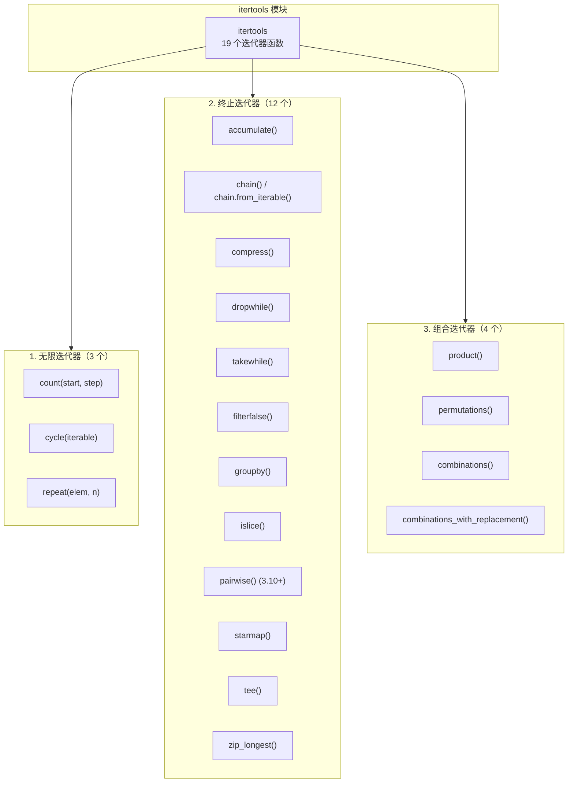
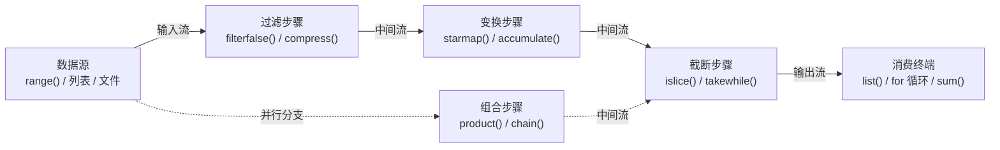
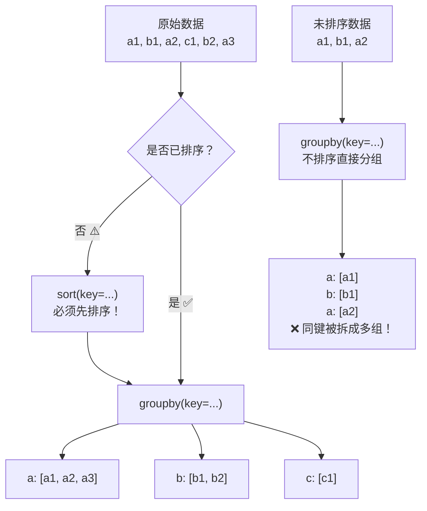
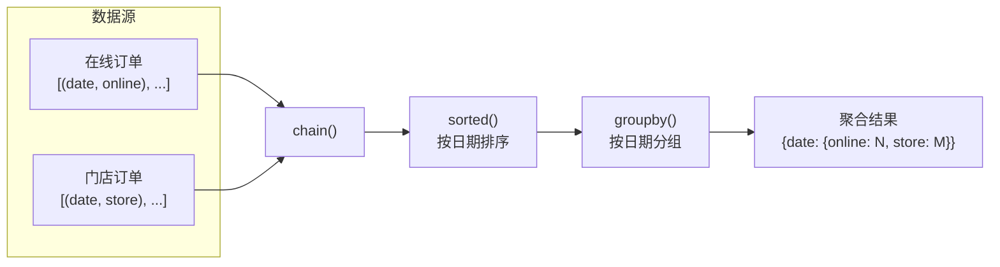

# itertools 模块：构建高效迭代器的工具箱

## 一、是什么：itertools 的核心定位

`itertools` 是 Python 标准库中专门用于**构造和处理迭代器**的模块。它为 Python 的迭代器协议（Iterator Protocol）提供了一套标准化、内存高效的基础构件，使你能用声明式的方式组合出复杂的数据管道，而无需手动管理循环变量和中间状态。

### 1.1 为什么需要 itertools

| 痛点 | 手写循环的问题 | itertools 的解决方案 |
|------|--------------|---------------------|
| 计数器变量管理 | `i = 0; while True: i += 1` 等价代码冗长 | `count()` 一行生成无限序列 |
| 多层嵌套循环可读性差 | 三层 `for` 嵌套缩进深，笛卡尔积逻辑与业务逻辑耦合 | `product()` 将组合生成与处理分离 |
| 分组统计需手写状态机 | 用标志位追踪"上一行"的分组键，代码易出错 | `groupby()` 声明式分组 |
| 滑动窗口需手动维护索引 | `for i in range(len(data)-n)` 易错且不优雅 | `islice()` 配合 `tee()` 实现管道式窗口 |
| 中间列表占用内存 | `list(filter(...))` 加载全部结果到内存 | `filterfalse()` 返回惰性迭代器 |
| zip 长短不一被截断 | 最短迭代器耗尽时静默丢失数据 | `zip_longest()` 填充缺失值 |

### 1.2 三类迭代器分类

`itertools` 提供了三类迭代器，共 19 个函数（加上 `tee` 和 `chain.from_iterable` 等变体；Python 3.12 起新增 `batched()`）：



### 1.3 itertools 数据流管道模型

理解 itertools 的最佳方式是将其视为**数据流管道**——数据从源头流过一系列处理步骤，每个步骤都是惰性的（仅在被消费时才计算）：



> **核心原则**：所有 itertools 函数都返回**惰性迭代器**——仅在需要时才产生下一个元素，内存占用极低。

---

## 二、无限迭代器

无限迭代器会不断产生值，除非被外部条件截断。它们通常与 `islice()`、`takewhile()` 或循环中的 `break` 配合使用。

### 2.1 count(start=0, step=1)

创建一个从 `start` 开始、每次递增 `step` 的等差数列迭代器。

```python
import itertools

# ========== 基础用法：生成自增序号 ==========
counter = itertools.count(1)          # 从 1 开始，步长为 1
print([next(counter) for _ in range(5)])  # [1, 2, 3, 4, 5]

# ========== 自定义步长 ==========
even = itertools.count(0, 2)          # 从 0 开始，步长为 2
print([next(even) for _ in range(5)])     # [0, 2, 4, 6, 8]

# ========== 实际场景：为日志行添加行号 ==========
logs = ["ERROR: connection refused", "WARN: retrying", "INFO: connected"]
for i, msg in zip(itertools.count(1), logs):
    print(f"[{i}] {msg}")
# 输出:
# [1] ERROR: connection refused
# [2] WARN: retrying
# [3] INFO: connected

# ========== 浮点步长（谨慎使用，可能累积误差） ==========
float_counter = itertools.count(0, 0.1)
print([round(next(float_counter), 1) for _ in range(5)])  # [0, 0.1, 0.2, 0.3, 0.4]
```

**典型应用场景：**
- 为可迭代对象添加自增序号（替代 `enumerate` 的复杂场景）
- 生成等步长的数值序列
- 作为 `islice` 的数据源，实现区间取值

### 2.2 cycle(iterable)

无限循环遍历一个可迭代对象，到达末尾后从头开始。

```python
import itertools

# ========== 基础用法 ==========
colors = ['red', 'green', 'blue']
cycler = itertools.cycle(colors)
print([next(cycler) for _ in range(7)])
# ['red', 'green', 'blue', 'red', 'green', 'blue', 'red']

# ========== 实际场景：轮询分配任务到多个 Worker ==========
workers = ['worker-A', 'worker-B', 'worker-C']
tasks = ['task-1', 'task-2', 'task-3', 'task-4', 'task-5']

assignments = list(zip(itertools.cycle(workers), tasks))
print(assignments)
# [('worker-A', 'task-1'), ('worker-B', 'task-2'), ('worker-C', 'task-3'),
#  ('worker-A', 'task-4'), ('worker-B', 'task-5')]

# ========== 注意：永远不会停止，必须外部截断 ==========
# 下面这行会无限循环——不要直接运行！
# for x in itertools.cycle([1, 2, 3]):
#     print(x)
```

### 2.3 repeat(object, times=None)

重复产生同一个对象。`times` 为 `None` 时无限重复。

```python
import itertools

# ========== 有限重复 ==========
print(list(itertools.repeat('hello', 3)))  # ['hello', 'hello', 'hello']

# ========== 实际场景：为 map() 提供常量参数 ==========
# 将多个数字乘以同一个系数 2.5
prices = [10, 20, 30]
with_tax = list(map(lambda p, rate: p * rate, prices, itertools.repeat(1.13)))
print(with_tax)  # [11.3, 22.6, 33.9]

# ========== 等价于生成器表达式（但 repeat 更清晰地表达意图） ==========
with_tax2 = [p * 1.13 for p in prices]
```

---

## 三、终止迭代器

终止迭代器基于输入的可迭代对象产生有限长度的输出。它们是最常用的 itertools 子集。

### 3.1 accumulate(iterable, func=operator.add, *, initial=None)

返回累积结果。默认是累加，可通过 `func` 指定任意二元运算。

> **版本要求：** `initial` 参数需要 Python 3.8+

```python
import itertools
import operator

# ========== 默认：累加 ==========
nums = [1, 2, 3, 4, 5]
print(list(itertools.accumulate(nums)))
# [1, 3, 6, 10, 15]

# ========== 累乘 ==========
print(list(itertools.accumulate(nums, operator.mul)))
# [1, 2, 6, 24, 120]

# ========== 使用 initial 参数（Python 3.8+） ==========
print(list(itertools.accumulate(nums, initial=100)))
# [100, 101, 103, 106, 110, 115]

# ========== 实际场景：计算累计收益率 ==========
daily_returns = [0.01, -0.02, 0.03, 0.01, -0.005]
cumulative = itertools.accumulate(daily_returns, lambda total, r: round(total * (1 + r), 4))
print(list(cumulative))
# [0.01, 0.0098, 0.0101, 0.0102, 0.0101]
```

### 3.2 chain(*iterables) 与 chain.from_iterable(iterable)

将多个可迭代对象串联为一个迭代器。`chain` 接受位置参数，`chain.from_iterable` 接受一个可迭代对象的可迭代对象。

```python
import itertools

# ========== chain：串联多个序列 ==========
a = [1, 2, 3]
b = ['a', 'b', 'c']
c = (True, False)
print(list(itertools.chain(a, b, c)))
# [1, 2, 3, 'a', 'b', 'c', True, False]

# ========== chain.from_iterable：扁平化一层嵌套 ==========
nested = [[1, 2], [3, 4], [5, 6]]
print(list(itertools.chain.from_iterable(nested)))
# [1, 2, 3, 4, 5, 6]

# ========== 实际场景：合并多个数据源的结果 ==========
db_results = [("Alice", 25), ("Bob", 30)]
api_results = [("Charlie", 28)]
cache_results = [("Dave", 35)]
all_users = list(itertools.chain(db_results, api_results, cache_results))
print(all_users)
# [('Alice', 25), ('Bob', 30), ('Charlie', 28), ('Dave', 35)]
```

### 3.3 compress(data, selectors)

基于 `selectors` 的真值测试过滤 `data` 中的元素。相当于数据库的"按位掩码过滤"。

```python
import itertools

# ========== 基础用法 ==========
data = ['A', 'B', 'C', 'D', 'E']
selectors = [True, False, 1, 0, True]  # 1 视为真，0 视为假
print(list(itertools.compress(data, selectors)))
# ['A', 'C', 'E']

# ========== 实际场景：按布尔掩码提取字段 ==========
columns = ['id', 'name', 'email', 'deleted_at', 'created_at']
visibility = [True, True, True, False, False]  # 隐藏 deleted_at 和 created_at
visible_columns = list(itertools.compress(columns, visibility))
print(visible_columns)  # ['id', 'name', 'email']
```

### 3.4 dropwhile(predicate, iterable) 与 takewhile(predicate, iterable)

`dropwhile` 跳过满足条件的元素直到条件不成立，之后返回所有剩余元素。
`takewhile` 返回满足条件的元素直到条件不成立，之后停止。

```python
import itertools

data = [1, 3, 5, 2, 4, 6, 7]

# ========== dropwhile：跳过开头符合条件的元素 ==========
print(list(itertools.dropwhile(lambda x: x < 5, data)))
# [5, 2, 4, 6, 7] — 跳过 1,3（都<5），遇到 5 后全部保留

# ========== takewhile：取开头符合条件的元素 ==========
print(list(itertools.takewhile(lambda x: x < 5, data)))
# [1, 3] — 1<5 保留, 3<5 保留, 遇到 5 停止

# ========== 实际场景：解析日志文件，跳过开头注释行 ==========
log_lines = [
    "# ===== LOG START =====",
    "# Generated: 2026-06-05",
    "INFO: process started",
    "ERROR: timeout",
    "WARN: retry attempt 1",
]
# 跳过所有以 # 开头的注释行
content_lines = itertools.dropwhile(lambda line: line.startswith("#"), log_lines)
print(list(content_lines))
# ['INFO: process started', 'ERROR: timeout', 'WARN: retry attempt 1']
```

> **常见误区**：`dropwhile` 只在遇到**第一个**不满足条件的元素时停止跳过，之后不再检查条件。它不会过滤掉后面又满足条件的元素。

### 3.5 filterfalse(predicate, iterable)

返回 `predicate` 为 `False` 的所有元素。是内置 `filter()` 的互补函数。

```python
import itertools

nums = [0, 1, 2, 3, 0, 4, 5, 0]

# ========== 过滤掉所有零（保留非零） ==========
print(list(itertools.filterfalse(lambda x: x == 0, nums)))
# [1, 2, 3, 4, 5]

# ========== 等效于 filter + not ==========
print(list(filter(lambda x: x != 0, nums)))  # [1, 2, 3, 4, 5]

# ========== 实际场景：分离有效数据和无效数据 ==========
records = [100, None, 200, None, 300, None]
valid = list(itertools.filterfalse(lambda x: x is None, records))
print(valid)  # [100, 200, 300]
```

### 3.6 groupby(iterable, key=None)

按 `key` 函数对**已排序**的连续元素进行分组。返回 `(key, group_iterator)` 的迭代器。



```python
import itertools

# ========== 基础用法：按首字母分组 ==========
words = ['apple', 'ant', 'bear', 'bat', 'cat', 'car']
words.sort(key=lambda w: w[0])  # groupby 要求预排序！
groups = itertools.groupby(words, key=lambda w: w[0])
for letter, items in groups:
    print(f"{letter}: {list(items)}")
# 输出:
# a: ['apple', 'ant']
# b: ['bear', 'bat']
# c: ['cat', 'car']

# ========== 实际场景：按日期分组日志 ==========
logs = [
    ('2026-06-01', 'INFO', 'start'),
    ('2026-06-01', 'ERROR', 'timeout'),
    ('2026-06-02', 'INFO', 'restart'),
    ('2026-06-02', 'WARN', 'slow query'),
    ('2026-06-02', 'INFO', 'success'),
]
logs.sort(key=lambda x: x[0])  # 按日期排序
grouped_logs = itertools.groupby(logs, key=lambda x: x[0])
for date, entries in grouped_logs:
    entries_list = list(entries)
    print(f"{date}: {len(entries_list)} entries → {[e[1] for e in entries_list]}")
# 2026-06-01: 2 entries → ['INFO', 'ERROR']
# 2026-06-02: 3 entries → ['INFO', 'WARN', 'INFO']
```

> **关键约束**：`groupby()` 只对**连续**的相同键进行分组。如果输入未预排序，相同键可能在多个分组中散落出现。始终在使用前对数据按目标键排序。

### 3.7 islice(iterable, start, stop, step)

对可迭代对象进行切片，行为类似于 `list[start:stop:step]`，但返回迭代器。

```python
import itertools

data = list(range(10))  # [0, 1, 2, 3, 4, 5, 6, 7, 8, 9]

# ========== 等价于 data[2:7] ==========
print(list(itertools.islice(data, 2, 7)))  # [2, 3, 4, 5, 6]

# ========== 等价于 data[:5] ==========
print(list(itertools.islice(data, 5)))     # [0, 1, 2, 3, 4]

# ========== 等价于 data[2:9:3] ==========
print(list(itertools.islice(data, 2, 9, 3)))  # [2, 5, 8]

# ========== 与无限迭代器配合：取 count(10) 的前 5 个 ==========
print(list(itertools.islice(itertools.count(10), 5)))  # [10, 11, 12, 13, 14]

# ========== islice 不支持负数索引（不同于普通切片） ==========
# itertools.islice(data, -3, None)  # ❌ ValueError
```

### 3.8 pairwise(iterable)

返回连续元素组成的对 `(s[0], s[1]), (s[1], s[2]), ...`。

> **版本要求：** Python 3.10+ 新增

```python
import itertools

# ========== 基础用法 ==========
data = [1, 2, 3, 4, 5]
print(list(itertools.pairwise(data)))
# [(1, 2), (2, 3), (3, 4), (4, 5)]

# ========== 实际场景：计算相邻元素的差值 ==========
values = [10, 15, 22, 30, 25]
diffs = [b - a for a, b in itertools.pairwise(values)]
print(diffs)  # [5, 7, 8, -5]
```

### 3.9 starmap(function, iterable)

将 `iterable` 中的每个元素解包后传给 `function`。相当于 `map` 的解包版。

```python
import itertools

# ========== 基础用法 ==========
# 将每组 (a, b) 传入 pow(a, b)
pairs = [(2, 3), (3, 2), (4, 2)]
print(list(itertools.starmap(pow, pairs)))
# [8, 9, 16]  # 等价于 pow(2,3), pow(3,2), pow(4,2)

# ========== 与 map 的区别 ==========
def add(a, b):
    return a + b

# map: 需要手动解包每个元组
print(list(map(lambda p: add(p[0], p[1]), pairs)))
# starmap: 自动解包
print(list(itertools.starmap(add, pairs)))
# [5, 5, 6]
```

### 3.10 tee(iterable, n=2)

将一个迭代器复制为 `n` 个独立的迭代器。注意：内部使用队列缓存，可能消耗大量内存。

```python
import itertools

source = [1, 2, 3]
it1, it2, it3 = itertools.tee(source, 3)

print(list(it1))  # [1, 2, 3]
print(list(it2))  # [1, 2, 3]
print(list(it3))  # [1, 2, 3]

# ========== 注意：tee 可能缓存大量数据 ==========
# 如果迭代器 A 和 B 的消费速度差异很大，
# 快的那一个会触发大量中间结果被缓存在内存中
```

### 3.11 zip_longest(*iterables, fillvalue=None)

类似于内置 `zip()`，但以**最长**的迭代器为准，短迭代器用 `fillvalue` 填充。

```python
import itertools

a = [1, 2, 3]
b = ['a', 'b']

# ========== 内置 zip：以最短为准，截断 ==========
print(list(zip(a, b)))  # [(1, 'a'), (2, 'b')]

# ========== zip_longest：以最长为标准，填充缺失值 ==========
print(list(itertools.zip_longest(a, b, fillvalue='缺')))
# [(1, 'a'), (2, 'b'), (3, '缺')]

# ========== 实际场景：对齐不同长度的数据列 ==========
names = ['Alice', 'Bob', 'Charlie']
scores = [95, 87]  # Charlie 缺考
for name, score in itertools.zip_longest(names, scores, fillvalue='缺考'):
    print(f"{name}: {score}")
# Alice: 95
# Bob: 87
# Charlie: 缺考
```

---

## 四、组合迭代器

组合迭代器生成输入元素的各种排列与组合，是算法题和配置生成的利器。

### 4.1 product(*iterables, repeat=1)

计算笛卡尔积。`repeat` 参数使单个可迭代对象与自身进行多次笛卡尔积。

```python
import itertools

# ========== 两个集合的笛卡尔积 ==========
colors = ['red', 'blue']
sizes = ['S', 'M', 'L']
print(list(itertools.product(colors, sizes)))
# [('red', 'S'), ('red', 'M'), ('red', 'L'),
#  ('blue', 'S'), ('blue', 'M'), ('blue', 'L')]

# ========== repeat 参数：单个集合的多次笛卡尔积 ==========
print(list(itertools.product('AB', repeat=2)))
# [('A', 'A'), ('A', 'B'), ('B', 'A'), ('B', 'B')]

# ========== 实际场景：生成测试用例的所有参数组合 ==========
browsers = ['Chrome', 'Firefox', 'Safari']
resolutions = ['1920x1080', '1366x768']
languages = ['zh-CN', 'en-US']

test_cases = list(itertools.product(browsers, resolutions, languages))
print(f"共生成 {len(test_cases)} 个测试用例")  # 12 个
for case in test_cases[:3]:
    print(f"  测试: {case}")
# 测试: ('Chrome', '1920x1080', 'zh-CN')
# 测试: ('Chrome', '1920x1080', 'en-US')
# 测试: ('Chrome', '1366x768', 'zh-CN')
```

### 4.2 permutations(iterable, r=None)

返回长度为 `r` 的**有序排列**（考虑顺序的所有排列）。`r` 默认为 `len(iterable)`。

```python
import itertools

items = ['A', 'B', 'C']

# ========== 全排列 ==========
print(list(itertools.permutations(items)))
# [('A', 'B', 'C'), ('A', 'C', 'B'), ('B', 'A', 'C'),
#  ('B', 'C', 'A'), ('C', 'A', 'B'), ('C', 'B', 'A')]

# ========== 取 2 个元素的排列 ==========
print(list(itertools.permutations(items, 2)))
# [('A', 'B'), ('A', 'C'), ('B', 'A'), ('B', 'C'), ('C', 'A'), ('C', 'B')]

# ========== 注意：元素值相同也视为不同的项 ==========
duplicates = ['A', 'A', 'B']
print(list(itertools.permutations(duplicates, 2)))
# [('A', 'A'), ('A', 'B'), ('A', 'A'), ('A', 'B'), ('B', 'A'), ('B', 'A')]
```

### 4.3 combinations(iterable, r)

返回长度为 `r` 的**无序组合**（不考虑顺序，每个元素最多出现一次）。

```python
import itertools

items = ['A', 'B', 'C']

# ========== 取 2 个元素的组合 ==========
print(list(itertools.combinations(items, 2)))
# [('A', 'B'), ('A', 'C'), ('B', 'C')]

# ========== 与 permutations 的对比 ==========
# permutations(items, 2) 有 6 个结果（(A,B) 和 (B,A) 都算）
# combinations(items, 2) 有 3 个结果（(A,B) 和 (B,A) 只算一个）

# ========== 实际场景：从队伍中选出双打配对 ==========
players = ['选手A', '选手B', '选手C', '选手D']
pairings = list(itertools.combinations(players, 2))
print(pairings)
# [('选手A', '选手B'), ('选手A', '选手C'), ('选手A', '选手D'),
#  ('选手B', '选手C'), ('选手B', '选手D'), ('选手C', '选手D')]
```

### 4.4 combinations_with_replacement(iterable, r)

返回长度为 `r` 的**可重复组合**（每个元素可以多次出现）。

```python
import itertools

items = ['A', 'B', 'C']

# ========== 取 2 个元素的可重复组合 ==========
print(list(itertools.combinations_with_replacement(items, 2)))
# [('A', 'A'), ('A', 'B'), ('A', 'C'), ('B', 'B'), ('B', 'C'), ('C', 'C')]

# ========== 实际场景：投 2 个骰子（可重复的 6 种面值取 2 个） ==========
dice = list(itertools.combinations_with_replacement(range(1, 7), 2))
print(f"可能的点数组合数: {len(dice)}")  # 21 种

# ========== 三种组合函数的结果数量对比 ==========
n, r = 5, 3
print(f"permutations:    {len(list(itertools.permutations(range(n), r)))}")         # 60 = n!/(n-r)!
print(f"combinations:    {len(list(itertools.combinations(range(n), r)))}")          # 10 = n!/(r!(n-r)!)
print(f"combinations_wr: {len(list(itertools.combinations_with_replacement(range(n), r)))}")  # 35 = (n+r-1)!/(r!(n-1)!)
```

---

## 五、实战案例

### 5.1 滑动窗口实现

滑动窗口是数据流处理中的常见模式。使用 `islice` 和 `tee` 可以构建通用窗口生成器。

```python
import itertools

def sliding_window(iterable, n: int):
    """生成大小为 n 的滑动窗口。"""
    # 创建 n 个独立的迭代器
    iterators = itertools.tee(iterable, n)
    # 每个迭代器依次向前偏移 0, 1, 2, ..., n-1 个位置
    staggered = (
        itertools.islice(it, i, None)
        for i, it in enumerate(iterators)
    )
    # 重新组合，生成 (it[0], it[1], ..., it[n-1])
    return zip(*staggered)

# ========== 使用示例：计算移动平均线 ==========
prices = [10, 12, 11, 14, 13, 15, 16, 14, 17]
window_size = 3

for window in sliding_window(prices, window_size):
    avg = sum(window) / window_size
    print(f"窗口 {window}: 均价 = {avg:.1f}")
# 窗口 (10, 12, 11): 均价 = 11.0
# 窗口 (12, 11, 14): 均价 = 12.3
# 窗口 (11, 14, 13): 均价 = 12.7
# ... 以此类推

# ========== Python 3.10+ 可用 pairwise 实现窗口大小为 2 的特例 ==========
for a, b in itertools.pairwise(prices):
    print(f"{a} → {b}: 变化 = {b - a:+d}")
```

### 5.2 分组聚合

使用 `groupby` 结合其他 itertools 工具，实现类 SQL 的 `GROUP BY` 聚合。

```python
import itertools
from statistics import mean

# 模拟数据：日期 + 销售额
transactions = [
    ('2026-06-01', 150),
    ('2026-06-01', 200),
    ('2026-06-01', 180),
    ('2026-06-02', 300),
    ('2026-06-02', 250),
    ('2026-06-03', 100),
    ('2026-06-03', 400),
    ('2026-06-03', 350),
    ('2026-06-03', 120),
]

# 按日期排序（groupby 的前提）
transactions.sort(key=lambda t: t[0])

# 分组聚合：计算每日销售总额和平均交易额
report = []
for date, records in itertools.groupby(transactions, key=lambda t: t[0]):
    amounts = [amt for _, amt in records]
    report.append({
        'date': date,
        'total': sum(amounts),
        'avg': mean(amounts),
        'count': len(amounts),
    })

for r in report:
    print(f"{r['date']}: 总额={r['total']}, 均额={r['avg']:.1f}, 笔数={r['count']}")
# 2026-06-01: 总额=530, 均额=176.7, 笔数=3
# 2026-06-02: 总额=550, 均额=275.0, 笔数=2
# 2026-06-03: 总额=970, 均额=242.5, 笔数=4
```

### 5.3 笛卡尔积查询：chain + groupby 组合使用

下面展示一个更复杂的实战：从两个数据源合并数据，使用 `chain` 串联，然后 `groupby` 分组聚合。



```python
import itertools
from collections import defaultdict

# 数据：两种渠道的销售额
online_sales = [
    ('2026-06-01', 'online', 150),
    ('2026-06-02', 'online', 200),
    ('2026-06-02', 'online', 180),
    ('2026-06-03', 'online', 300),
]
store_sales = [
    ('2026-06-01', 'store', 400),
    ('2026-06-02', 'store', 350),
    ('2026-06-03', 'store', 500),
    ('2026-06-03', 'store', 250),
]

# 1. chain: 合并两个数据源
all_sales = itertools.chain(online_sales, store_sales)

# 2. 按日期排序（groupby 的前提）
sorted_sales = sorted(all_sales, key=lambda x: x[0])

# 3. groupby: 按日期分组
daily_summary = {}
for date, records in itertools.groupby(sorted_sales, key=lambda x: x[0]):
    # 将 group 迭代器转为列表以便多次遍历
    items = list(records)
    daily_summary[date] = {
        'total': sum(amt for _, _, amt in items),
        'online': sum(amt for _, ch, amt in items if ch == 'online'),
        'store': sum(amt for _, ch, amt in items if ch == 'store'),
    }

for date, summary in daily_summary.items():
    print(f"{date}: 总计={summary['total']}, 线上={summary['online']}, 门店={summary['store']}")
# 2026-06-01: 总计=550, 线上=150, 门店=400
# 2026-06-02: 总计=730, 线上=380, 门店=350
# 2026-06-03: 总计=1050, 线上=300, 门店=750
```

---

## 六、常见陷阱

| 陷阱 | 问题描述 | 错误示例 | 正确做法 |
|------|---------|---------|---------|
| **迭代器只能遍历一次** | itertools 返回迭代器，消耗后无法重置 | `it = filterfalse(None, data); list(it); list(it)`（第二次返回空列表） | 用 `tee()` 复制，或用 `list()` 提前物化 |
| **无限迭代器未截断** | `count()`/`cycle()`/`repeat()` 不截断会无限运行 | `list(itertools.count())` 内存耗尽 | 始终配合 `islice()`/`takewhile()` 或在循环中 `break` |
| **groupby 需要预排序** | 未排序时相同键散落在不同分组中 | `groupby([2,1,2])` 产生 `(2, [2]), (1, [1]), (2, [2])` 两个 `2` 组 | 始终先 `sorted(data, key=...)` 再调 `groupby` |
| **groupby 返回的分组迭代器共享底层** | 分组迭代器在 `groupby` 前进时失效 | 在遍历当前分组前调用 `next()` 推进 groupby | 在进入下一分组前将当前分组物化为 `list` |
| **tee 内存消耗** | 消费速率不同的迭代器会使 `tee` 缓存大量中间结果 | 一个先遍历 100 万条，另一个才遍历 100 条 | 优先使用 `list()` 物化再复制；或确保消费步调一致 |
| **compress 中 selectors 耗尽即停** | `compress` 在较短的 selectors 耗尽时停止 | `compress('ABCDE', [1,1])` 只输出 2 个 | 确保 selectors 与 data 等长，或用 `repeat(True)` 补长 |
| **zip_longest 可能掩盖逻辑错误** | 静默用 `fillvalue` 填充本不应短的数据列 | 两列数据"巧合"补齐了缺失值，掩盖数据质量问题 | 在开发阶段先用 `zip` 严格模式（设置 `strict=True`）验证 |
| **accumulate 的 func 签名为二元函数** | 累积函数必须接受两个参数（累积值, 当前元素） | `accumulate(data, lambda x: x*2)` 只接受一个参数 | 使用 `lambda acc, x: acc + x` 这样的二元签名 |

### 6.1 深入陷阱：迭代器只能遍历一次

```python
import itertools

# ❌ 错误：同一个迭代器不能遍历两次
data = [1, 2, 3, 4, 5]
evens = filterfalse(lambda x: x % 2 != 0, data)  # 过滤出偶数
result1 = list(evens)   # OK: [2, 4]
result2 = list(evens)   # 陷阱！返回 []，迭代器已耗尽
print(f"第一次: {result1}, 第二次: {result2}")

# ✅ 方案一：物化为列表再复用
evens_list = list(filterfalse(lambda x: x % 2 != 0, data))
print(list(evens_list))  # [2, 4]
print(list(evens_list))  # [2, 4]

# ✅ 方案二：用 tee 复制
evens = filterfalse(lambda x: x % 2 != 0, data)
it1, it2 = itertools.tee(evens)
print(list(it1))  # [2, 4]
print(list(it2))  # [2, 4]
```

### 6.2 深入陷阱：groupby 未预排序

```python
import itertools

# ❌ 错误：未排序的 groupby
unsorted = ['apple', 'bear', 'ant', 'bat', 'cat', 'car']
groups = itertools.groupby(unsorted, key=lambda w: w[0])
for letter, items in groups:
    print(f"{letter}: {list(items)}")
# 输出:
# a: ['apple']          ← 两个 a 被分开了！
# b: ['bear']
# a: ['ant']            ← 这是第二个 a 组
# b: ['bat']
# c: ['cat', 'car']

# ✅ 正确：先排序
sorted_words = sorted(unsorted, key=lambda w: w[0])
groups = itertools.groupby(sorted_words, key=lambda w: w[0])
for letter, items in groups:
    print(f"{letter}: {list(items)}")
# a: ['ant', 'apple']   ← 所有 a 合并在一个组
# b: ['bat', 'bear']
# c: ['car', 'cat']
```

---

## 七、最佳实践

### 7.1 何时用 itertools，何时手写生成器

这是中级 Python 开发者需要掌握的判断力。以下决策矩阵帮助你在 itertools 和生成器表达式之间做出选择：

| 场景 | 推荐方案 | 理由 |
|------|---------|------|
| 简单的映射/过滤 | 列表推导式或生成器表达式 | `[x*2 for x in data]` 比 `map(operator.mul, data, repeat(2))` 直观 |
| 串联多个序列 | `chain()` | 比 `for seq in (a, b, c): for x in seq: yield x` 更简洁 |
| 笛卡尔积/排列组合 | `product()` / `permutations()` / `combinations()` | 手写多层嵌套递归容易出错且不易维护 |
| 按关键字分组 | 先排序再用 `groupby()` | 手写 `defaultdict(list)` 也可以，但 `groupby` 更声明式 |
| 滑动窗口 | `tee()` + `islice()` + `zip()` | 封装一次可复用；手写索引循环不够通用 |
| 条件性跳过/截取 | `dropwhile()` / `takewhile()` | 语义明确：一眼就能看出意图 |
| 无限序列的有限取样 | `islice(count(), n)` | 比 `while True: i += 1` 更安全、更声明式 |
| 复杂的惰性计算管道 | 组合多个 itertools 函数 | 链式调用比嵌套生成器更清晰，且性能更好（C 实现） |

### 7.2 管道组合模式

itertools 的真正威力在于**函数组合**：每个函数做一件事，通过数据管道串联。

```python
import itertools

# 场景：从日志流中提取错误信息，去重后取前 10 条
log_stream = iter([
    "INFO: ok", "ERROR: timeout", "ERROR: timeout",
    "WARN: slow", "INFO: ok", "ERROR: crash",
    "ERROR: disk full", "INFO: ok",
])

# 管道构建（每一步都是惰性的）
# 1. 只保留 ERROR
errors = filterfalse(lambda line: not line.startswith("ERROR:"), log_stream)
# 2. 去掉前缀
messages = map(lambda line: line.removeprefix("ERROR: "), errors)
# 3. 去重
seen = set()
unique_messages = filterfalse(lambda msg: msg in seen or seen.add(msg), messages)
# 4. 取前 10 条
top_errors = list(itertools.islice(unique_messages, 10))

print(top_errors)  # ['timeout', 'crash', 'disk full']
```

### 7.3 性能建议

1. **itertools 函数是 C 实现的**，对于大规模数据处理，比等价的 Python 生成器快 2-5 倍。
2. **避免过早物化**：保持迭代器惰性，在消费链末端才调用 `list()` 或 `for` 循环。
3. **`tee` 有代价**：如果两个消费分支都需要全量数据，先用 `list()` 物化再复制列表比 `tee` 更高效。
4. **`chain.from_iterable` 比 `chain(*nest_list)` 更通用**：前者避免了解包大列表时的参数膨胀。

### 7.4 可读性优先

```python
import itertools

# ❌ 过度使用 itertools 导致难以理解
result = list(itertools.compress(
    itertools.chain.from_iterable(
        map(lambda x: [x, x*2], range(10))
    ),
    itertools.cycle([True, False])
))

# ✅ 拆分为有意义的步骤，每个变量名说明意图
doubled = itertools.chain.from_iterable(
    (x, x * 2) for x in range(10)
)
every_other = itertools.compress(doubled, itertools.cycle([True, False]))
result = list(every_other)
```

---

## 术语表

| 术语 | 英文 | 定义 |
|------|------|------|
| 迭代器 | Iterator | 实现了 `__next__()` 和 `__iter__()` 方法的对象，支持惰性求值 |
| 惰性求值 | Lazy Evaluation | 仅在需要时才计算下一个值，而非一次性生成全部结果 |
| 笛卡尔积 | Cartesian Product | 两个或多个集合的所有可能组合，如 A x B = {(a,b) \| a in A, b in B} |
| 排列 | Permutation | 从 n 个元素中取 r 个的有序排列，考虑顺序 |
| 组合 | Combination | 从 n 个元素中取 r 个的无序组合，不考虑顺序 |
| 可重复组合 | Combination with Replacement | 从 n 个元素中取 r 个的组合，允许同一元素重复出现 |
| 滑动窗口 | Sliding Window | 在序列上按固定步长移动的连续子序列 |
| 终止迭代器 | Terminating Iterator | 基于有限输入数据产生有限输出的迭代器 |
| 无限迭代器 | Infinite Iterator | 理论上永不停止产生值的迭代器，必须被外部截断 |
| 累加器 | Accumulator | 将序列元素通过二元运算逐次累积合并的抽象 |
| 物化 | Materialize | 将惰性迭代器转换为具体的数据结构（如 list、tuple） |
| 管道 | Pipeline | 多个数据处理函数串联，数据流过每个步骤完成转换 |

---

## 延伸阅读

| 资源 | 说明 |
|------|------|
| [官方文档 — itertools](https://docs.python.org/3/library/itertools.html) | Python 官方文档，包含所有函数的完整说明和等价 Python 实现 |
| [官方文档 — itertools 食谱](https://docs.python.org/3/library/itertools.html#itertools-recipes) | 官方提供的实用 itertools 组合示例（`batched`、`nth`、`grouper` 等） |
| [PEP 279](https://peps.python.org/pep-0279/) | The enumerate() and itertools 提案 |
| [PEP 618](https://peps.python.org/pep-0618/) | `zip` strict 模式与 `zip_longest` 的关系 |
| [Python 3.10 What's New — pairwise()](https://docs.python.org/3/whatsnew/3.10.html#itertools) | `pairwise` 函数的引入背景 |
| [Fluent Python 第 17 章](https://www.oreilly.com/library/view/fluent-python-2nd/9781492056348/) | 迭代器、生成器与协程的深度讲解 |
| [more-itertools](https://more-itertools.readthedocs.io/) | 第三方扩展库，提供了 `itertools` 官方食谱中的所有工具及更多 |
| [Real Python — itertools 教程](https://realpython.com/python-itertools/) | 面向实践的 itertools 指南，含大量示例 |

## 版本差异（标准库 → Python 3.14）

| 模块/特性 | 本文编写时 | Python 3.14 变化 |
|-----------|-----------|------------------|
| `datetime` | `utcnow()` / `utcfromtimestamp()` | 3.12 起弃用，改用 `datetime.now(tz=datetime.UTC)` / `fromtimestamp(ts, tz=datetime.UTC)`（aware 对象） |
| `asyncio` | 基础 API | 3.14 新增内省能力（`asyncio.Task`/`Future` 状态查询）；3.11 起推荐 `TaskGroup` + `asyncio.timeout()` |
| `typing` | 旧式 `List`/`Dict` | 3.9+ 内置泛型；3.10+ 联合类型 `X \| Y`；3.12 `type` 语句；3.14 PEP 649 延迟注解 |
| `importlib` | `imp` 模块 | `imp` 于 3.12 移除，统一使用 `importlib` |
| 压缩 | zlib/gzip/bz2/lzma | 3.14 新增 `zstandard` 标准库支持（PEP 784） |
| `pathlib` | 基础路径操作 | 3.12+ 持续增强（`Path.walk()` 等）；`is_relative_to()` 自 3.9 起可用 |
| 往事清理 | — | 3.13 移除 `cgi`、`telnetlib`、`crypt`、`audioop` 等已废弃模块 |

> 本文讲解的模块核心 API 与使用模式在 3.14 中保持稳定；注意上述弃用/移除项，升级时优先用标准库推荐的替代方案。
